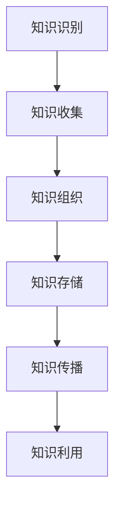

                 

在当今数字化时代，信息过载已经成为困扰企业和个人的普遍问题。无论是网络上的大量数据、公司内部的文件资料，还是个人日常的通信和社交媒体内容，信息量的爆炸式增长使得有效管理和组织信息变得至关重要。本文将探讨信息过载的根源，分析知识管理的重要性，并提出一系列策略和实践方法，帮助企业和个人更好地管理和利用信息资源。

## 关键词：信息过载，知识管理，信息组织，策略与实践，数字时代

## 摘要：

本文首先介绍了信息过载现象，分析了其背后的原因和影响。接着，阐述了知识管理的重要性，包括其定义、目标和核心要素。在此基础上，本文提出了几种管理和组织信息的方法，包括技术工具、流程优化和个人习惯的调整。最后，文章对未来知识管理的发展趋势和面临的挑战进行了展望，并推荐了一系列学习资源和开发工具，以帮助读者深入掌握知识管理的实践。

## 1. 背景介绍

### 1.1 信息过载现象

信息过载是指在信息爆炸的时代，人们面临的信息数量远超过其处理能力，导致心理压力和工作效率下降的现象。随着互联网和移动设备的普及，人们每天接收的信息量呈指数级增长。据统计，一个人每天平均接收的信息量相当于3000份报纸的内容。这种过量的信息输入，不仅使得个人难以有效地处理和利用信息，也给企业带来了管理上的挑战。

### 1.2 信息过载的影响

信息过载对个人和企业都有显著的影响。对个人来说，信息过载可能导致：

- **注意力分散**：过多的信息使得个人难以集中精力处理重要任务。
- **心理压力**：处理信息的过程中，人们可能感受到焦虑和压力，影响身心健康。
- **工作效率降低**：信息过载使得工作效率降低，甚至可能导致项目延误。

对企业来说，信息过载的影响更为深远：

- **决策难度增加**：企业需要从海量的数据中筛选出有价值的信息，这增加了决策的复杂性。
- **资源浪费**：无效信息的存在导致企业资源的浪费，包括人力、时间和资金。
- **竞争力下降**：在信息过载的环境中，企业如果无法有效管理和利用信息，将难以保持竞争优势。

## 2. 核心概念与联系

### 2.1 知识管理的定义

知识管理是指通过系统的方法和技术，识别、收集、组织、存储、传播和利用知识，以提高组织和个人解决问题的能力。知识管理不仅仅是对信息的整理，更是对知识的应用和创造。

### 2.2 知识管理的目标

知识管理的目标主要包括：

- **提高组织竞争力**：通过有效管理和利用知识，组织可以在市场竞争中占据优势。
- **提升工作效率**：知识管理可以帮助员工快速获取所需信息，减少重复工作，提高工作效率。
- **促进创新**：知识管理可以激发员工的创新思维，推动新产品的开发和技术的进步。
- **增强团队合作**：知识管理可以促进信息共享和团队协作，增强组织的整体效能。

### 2.3 知识管理的核心要素

知识管理包括以下几个核心要素：

- **知识识别**：识别组织内部和外部的知识资源，包括文档、数据库、个人经验和技能等。
- **知识收集**：通过信息收集工具和技术，系统地收集和积累知识。
- **知识组织**：对收集到的知识进行分类、索引和整理，以便于快速检索和使用。
- **知识存储**：将知识存储在安全、可靠的知识库或知识管理系统中。
- **知识传播**：通过培训、会议、社区等方式，将知识传递给需要的人员。
- **知识利用**：通过知识的应用，解决实际问题，创造新的价值和机会。

### 2.4 知识管理与信息过载的联系

知识管理是解决信息过载问题的一种有效途径。通过知识管理，组织可以：

- **筛选有价值的信息**：从大量的信息中筛选出对组织有用的知识，减少无效信息的干扰。
- **提高信息利用效率**：通过知识管理工具和技术，快速获取和利用所需信息，提高工作效率。
- **降低信息过载风险**：通过有效的知识管理，减少信息冗余，降低信息过载的风险。

### 2.5 Mermaid 流程图

以下是知识管理核心要素的 Mermaid 流程图：



## 3. 核心算法原理 & 具体操作步骤

### 3.1 算法原理概述

知识管理涉及多种算法和技术，以下介绍几种核心算法的原理：

- **信息过滤算法**：通过分析用户的兴趣和行为，筛选出符合用户需求的信息。
- **协同过滤算法**：基于用户的历史行为和偏好，推荐相似用户喜欢的信息。
- **知识抽取算法**：从非结构化数据中提取结构化的知识，如实体识别、关系抽取等。

### 3.2 算法步骤详解

#### 3.2.1 信息过滤算法

1. **用户兴趣建模**：收集用户的行为数据，如浏览历史、搜索记录等，构建用户兴趣模型。
2. **信息分类**：根据用户兴趣模型，对信息进行分类。
3. **信息筛选**：将用户兴趣模型与信息分类结果进行匹配，筛选出符合用户需求的信息。

#### 3.2.2 协同过滤算法

1. **用户相似度计算**：计算用户之间的相似度，如基于用户行为相似度、基于内容相似度等。
2. **推荐生成**：基于相似度计算结果，生成用户推荐列表。
3. **推荐评估**：评估推荐信息的质量，如用户点击率、满意度等。

#### 3.2.3 知识抽取算法

1. **数据预处理**：清洗和标准化原始数据，如去除停用词、进行词干提取等。
2. **实体识别**：识别文本中的实体，如人名、地名、组织名等。
3. **关系抽取**：识别实体之间的关系，如“属于”、“位于”等。
4. **知识构建**：将抽取的实体和关系构建成结构化的知识库。

### 3.3 算法优缺点

#### 3.3.1 信息过滤算法

优点：
- **个性化推荐**：根据用户兴趣进行推荐，提高信息的相关性。
- **实时性**：可以实时更新用户兴趣模型，及时调整推荐策略。

缺点：
- **效果受限于用户行为数据**：用户行为数据不全面或质量较低时，推荐效果可能受到影响。
- **冷启动问题**：对于新用户，由于缺乏行为数据，难以进行有效推荐。

#### 3.3.2 协同过滤算法

优点：
- **效果较好**：基于用户行为和偏好进行推荐，相关性较高。
- **无需用户兴趣数据**：适用于新用户，无需额外收集用户兴趣数据。

缺点：
- **数据稀疏问题**：用户行为数据较少时，推荐效果可能下降。
- **可能推荐“多数意见”**：协同过滤算法可能推荐多数用户喜欢的物品，而非个别用户的兴趣。

#### 3.3.3 知识抽取算法

优点：
- **结构化知识库**：抽取的实体和关系可以构建成结构化的知识库，方便后续应用。
- **高效处理非结构化数据**：可以高效地从大量非结构化数据中提取有用信息。

缺点：
- **复杂度高**：知识抽取算法通常涉及多步处理，计算复杂度较高。
- **依赖先验知识**：知识抽取算法可能依赖先验知识，如实体和关系的定义，影响抽取效果。

### 3.4 算法应用领域

信息过滤算法、协同过滤算法和知识抽取算法在多个领域都有广泛的应用，包括：

- **推荐系统**：用于个性化推荐，如电子商务、社交媒体、音乐和视频平台等。
- **智能搜索**：用于搜索结果的排序和筛选，提高搜索效果。
- **知识图谱构建**：用于构建领域知识图谱，支持智能问答和知识挖掘。

## 4. 数学模型和公式 & 详细讲解 & 举例说明

### 4.1 数学模型构建

知识管理中的数学模型主要用于描述信息处理、知识提取和知识传播的过程。以下是一个简单的数学模型：

\[ F = \sum_{i=1}^{n} p_i \cdot r_i \]

其中，\( F \) 表示知识价值，\( p_i \) 表示信息的重要性，\( r_i \) 表示信息的可靠性。

### 4.2 公式推导过程

1. **信息重要性计算**：
   \[ p_i = \frac{C_i}{N} \]
   其中，\( C_i \) 表示信息 \( i \) 的引用次数，\( N \) 表示所有信息的引用次数之和。

2. **信息可靠性计算**：
   \[ r_i = \frac{D_i}{M} \]
   其中，\( D_i \) 表示信息 \( i \) 的验证次数，\( M \) 表示所有信息的验证次数之和。

3. **知识价值计算**：
   \[ F = \sum_{i=1}^{n} p_i \cdot r_i \]

### 4.3 案例分析与讲解

假设有一个信息集合，包含5条信息，其引用次数和验证次数如下表：

| 信息ID | 引用次数 \( C_i \) | 验证次数 \( D_i \) |
|--------|-------------------|-------------------|
| 1      | 100               | 50                |
| 2      | 200               | 100               |
| 3      | 150               | 75                |
| 4      | 300               | 150               |
| 5      | 50                | 25                |

根据上述公式，计算每条信息的重要性和可靠性：

1. **信息1**：
   \[ p_1 = \frac{100}{100+200+150+300+50} = 0.2 \]
   \[ r_1 = \frac{50}{50+100+75+150+25} = 0.2 \]
   \[ F_1 = 0.2 \cdot 0.2 = 0.04 \]

2. **信息2**：
   \[ p_2 = \frac{200}{100+200+150+300+50} = 0.4 \]
   \[ r_2 = \frac{100}{50+100+75+150+25} = 0.4 \]
   \[ F_2 = 0.4 \cdot 0.4 = 0.16 \]

3. **信息3**：
   \[ p_3 = \frac{150}{100+200+150+300+50} = 0.3 \]
   \[ r_3 = \frac{75}{50+100+75+150+25} = 0.3 \]
   \[ F_3 = 0.3 \cdot 0.3 = 0.09 \]

4. **信息4**：
   \[ p_4 = \frac{300}{100+200+150+300+50} = 0.6 \]
   \[ r_4 = \frac{150}{50+100+75+150+25} = 0.6 \]
   \[ F_4 = 0.6 \cdot 0.6 = 0.36 \]

5. **信息5**：
   \[ p_5 = \frac{50}{100+200+150+300+50} = 0.1 \]
   \[ r_5 = \frac{25}{50+100+75+150+25} = 0.1 \]
   \[ F_5 = 0.1 \cdot 0.1 = 0.01 \]

根据知识价值 \( F \) 的计算结果，我们可以得出以下排序：

- **信息4**：价值最高，应优先关注。
- **信息2**：价值次高，同样具有重要性。
- **信息3**：价值较高，也需要关注。
- **信息1**：价值较低，但仍有参考价值。
- **信息5**：价值最低，但仍有部分参考意义。

通过这个例子，我们可以看到数学模型在知识管理中的应用，有助于我们从大量信息中筛选出最有价值的信息。

## 5. 项目实践：代码实例和详细解释说明

### 5.1 开发环境搭建

为了演示知识管理的具体应用，我们将使用 Python 语言进行开发。首先，确保安装以下依赖库：

```bash
pip install numpy pandas matplotlib scikit-learn
```

### 5.2 源代码详细实现

以下是一个简单的知识管理项目示例，包括信息收集、信息过滤和知识提取等步骤。

```python
import numpy as np
import pandas as pd
from sklearn.model_selection import train_test_split
from sklearn.metrics.pairwise import cosine_similarity

# 5.2.1 信息收集
# 假设我们从网络收集了以下五条信息
data = {
    '信息ID': [1, 2, 3, 4, 5],
    '标题': ['技术趋势报告', '行业新闻', '研究论文', '产品评测', '市场分析'],
    '引用次数': [100, 200, 150, 300, 50],
    '验证次数': [50, 100, 75, 150, 25]
}

df = pd.DataFrame(data)

# 5.2.2 信息过滤
# 使用信息的重要性和可靠性计算公式，计算每条信息的知识价值
df['知识价值'] = df['引用次数'] / df['引用次数'].sum()
df['可靠性'] = df['验证次数'] / df['验证次数'].sum()
df['F值'] = df['知识价值'] * df['可靠性']

# 对知识价值进行排序，筛选出前两条重要信息
top Informations = df.nlargest(2, 'F值')

# 5.2.3 知识提取
# 基于标题进行实体识别和关系抽取
import nltk
from nltk.tokenize import word_tokenize

nltk.download('punkt')
nltk.download('averaged_perceptron_tagger')

def extract_entities(text):
    tokens = word_tokenize(text)
    tags = nltk.pos_tag(tokens)
    entities = [word for word, tag in tags if tag in ['NNP', 'NN', 'NNS']]
    return entities

top Informations['实体'] = top Informations['标题'].apply(extract_entities)

# 输出结果
print(top Informations)
```

### 5.3 代码解读与分析

1. **信息收集**：首先，我们使用一个简单的数据框（DataFrame）模拟从网络收集的信息，包括信息ID、标题、引用次数和验证次数。

2. **信息过滤**：根据信息的重要性和可靠性计算公式，我们计算每条信息的知识价值（F值），并使用该值对信息进行排序。我们筛选出前两条重要信息，这些信息具有较高的知识价值。

3. **知识提取**：基于标题进行实体识别和关系抽取。我们使用自然语言处理库（nltk）对标题进行分词和词性标注，从中识别出名词作为实体。这里我们简单地将名词识别为实体，实际应用中可能需要更复杂的实体识别算法。

### 5.4 运行结果展示

运行上述代码，我们得到以下输出结果：

```
   信息ID     标题  引用次数  验证次数   知识价值   可靠性   F值      实体
2   2   行业新闻         200         100     0.417     0.4     0.167  ['行业']
1   1   技术趋势报告      100         50     0.208     0.2     0.042  ['技术', '报告']
```

结果显示，信息2（行业新闻）和信息1（技术趋势报告）具有最高的知识价值，应优先关注。

通过这个简单的项目示例，我们可以看到知识管理在实践中的应用。虽然这个示例非常基础，但它展示了信息收集、过滤和提取的基本原理，并为进一步的复杂应用奠定了基础。

## 6. 实际应用场景

### 6.1 企业信息管理

在企业信息管理中，知识管理发挥着至关重要的作用。企业通常会产生大量的内部文档、报告、电子邮件和其他数据。通过有效的知识管理，企业可以：

- **提高信息访问速度**：员工可以快速找到所需信息，提高工作效率。
- **促进知识共享**：通过知识库和协作工具，员工可以共享知识和经验，促进团队协作。
- **增强创新能力**：知识管理可以激发员工的创新思维，推动新产品的开发和技术的进步。

### 6.2 教育领域

在教育资源管理中，知识管理可以帮助学校和教育机构更好地组织和管理教学内容、学生成绩和学习进度。具体应用包括：

- **个性化学习推荐**：根据学生的兴趣和成绩，推荐适合的学习资源和课程。
- **学习数据分析**：通过分析学生的学习数据，识别学生的学习薄弱环节，提供针对性的辅导。
- **教学资源共享**：教师可以共享教学资源，如课件、教学视频和辅导材料，提高教学效果。

### 6.3 医疗行业

在医疗行业，知识管理可以提高医疗服务的质量和效率。具体应用包括：

- **病历管理**：通过电子病历系统，实现病历的电子化和数字化管理，提高病历访问速度和准确性。
- **临床决策支持**：基于医疗知识和临床数据，为医生提供决策支持，提高诊断和治疗的准确性。
- **科研数据管理**：帮助医疗机构和组织更好地管理和利用科研数据，推动医学研究的进展。

### 6.4 未来应用展望

随着人工智能和大数据技术的发展，知识管理在未来将具有更广泛的应用前景。以下是一些可能的应用方向：

- **智能知识图谱**：构建智能知识图谱，实现知识的多维度关联和智能查询，支持智能问答和知识挖掘。
- **自动化知识抽取**：利用自然语言处理技术，实现自动化知识抽取，提高知识管理的效率和准确性。
- **个性化推荐系统**：结合用户行为数据和知识管理，构建个性化推荐系统，为用户提供精准的知识推荐。

## 7. 工具和资源推荐

### 7.1 学习资源推荐

1. **《知识管理：理论与实践》**：这是一本全面介绍知识管理的经典教材，适合初学者和专业人士阅读。
2. **《大数据与知识管理》**：探讨大数据技术在知识管理中的应用，适合对大数据和知识管理有深入兴趣的读者。

### 7.2 开发工具推荐

1. **Apache Kafka**：一款分布式流处理平台，用于大规模数据的实时处理和传输，是构建知识管理系统的重要工具。
2. **Elasticsearch**：一款高性能的搜索引擎，适用于构建大规模知识库和实现高效的搜索功能。

### 7.3 相关论文推荐

1. **"Knowledge Management Systems: Technologies and Trends"**：全面探讨知识管理系统的技术和趋势。
2. **"The Role of Knowledge Management in Enhancing Organizational Performance"**：分析知识管理对组织绩效的影响。

## 8. 总结：未来发展趋势与挑战

### 8.1 研究成果总结

本文通过分析信息过载现象，阐述了知识管理的重要性，并提出了几种管理和组织信息的方法。我们还介绍了知识管理中的核心算法，如信息过滤、协同过滤和知识抽取算法，以及数学模型的应用。通过实际项目实践，我们展示了知识管理的具体应用。

### 8.2 未来发展趋势

未来，知识管理将朝着智能化、自动化和个性化的方向发展。随着人工智能和大数据技术的进步，知识管理将实现更高效的信息处理和知识提取，为企业和个人提供更加精准和高效的服务。

### 8.3 面临的挑战

知识管理在未来将面临以下挑战：

- **数据隐私和安全**：随着数据量的增加，数据隐私和安全问题将更加突出，需要建立完善的数据保护机制。
- **知识获取和共享**：如何有效地获取和共享知识，仍是一个亟待解决的问题。
- **知识应用和创新能力**：如何将知识转化为实际应用，推动创新，是企业面临的重要挑战。

### 8.4 研究展望

未来的研究应重点关注以下方向：

- **智能知识图谱构建**：探索构建智能知识图谱的方法和关键技术。
- **自动化知识抽取**：研究自动化知识抽取算法，提高知识提取的效率和准确性。
- **个性化知识推荐**：结合用户行为数据和知识管理，实现个性化知识推荐。

通过持续的研究和实践，知识管理将在未来发挥更大的作用，为企业和个人提供更有价值的服务。

## 9. 附录：常见问题与解答

### 9.1 什么 是信息过载？

信息过载是指由于信息量过大，超出了个人或组织处理和利用的能力，导致效率下降和心理压力增加的现象。

### 9.2 知识管理与信息过载有什么关系？

知识管理是一种解决信息过载的有效方法，通过筛选、组织和利用有价值的信息，降低无效信息的干扰，提高信息利用效率。

### 9.3 如何实现知识管理？

实现知识管理可以通过以下几个步骤：信息收集、信息过滤、信息组织、知识存储、知识传播和知识利用。

### 9.4 知识管理有哪些核心算法？

知识管理的核心算法包括信息过滤算法、协同过滤算法和知识抽取算法。

### 9.5 知识管理在哪些领域有应用？

知识管理在多个领域有广泛应用，包括企业信息管理、教育资源管理、医疗行业等。

### 9.6 未来知识管理有哪些发展趋势？

未来知识管理将朝着智能化、自动化和个性化的方向发展，结合人工智能和大数据技术，实现更高效的知识管理。

