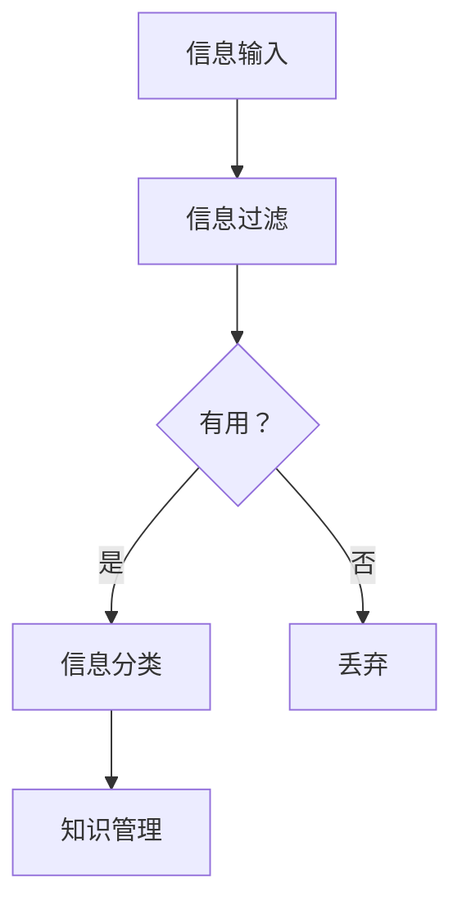

                 

在当今信息爆炸的时代，我们面临着越来越多的数据和信息，这对我们的认知和管理能力提出了巨大的挑战。本文旨在探讨信息过载的问题，并提出有效的知识管理策略和实践方法，帮助读者更好地管理和组织信息。

## 1. 背景介绍

随着互联网的普及和智能设备的广泛使用，我们每天都面临着海量的信息。这些信息来自各种渠道，如社交媒体、新闻网站、电子邮件等。虽然这些信息为我们提供了丰富的资源和知识，但同时也带来了信息过载的问题。信息过载不仅影响了我们的工作效率，还可能导致焦虑和压力。

信息过载的主要原因是信息的多样性和复杂性。我们接收到的信息来自不同的领域和来源，而且这些信息往往是以碎片化的形式呈现的。此外，信息传播的速度也大大加快，使得我们难以在有限的时间内处理和消化所有的信息。这种状况不仅影响了我们的工作效率，还可能对我们的心理健康产生负面影响。

## 2. 核心概念与联系

为了有效地管理和组织信息，我们需要了解一些核心概念，如信息过滤、信息分类、知识管理等。

### 2.1 信息过滤

信息过滤是指通过某种机制，从大量的信息中筛选出有用的信息，并排除无用的信息。信息过滤可以帮助我们减轻信息过载的压力，提高信息处理效率。常见的过滤方法包括关键字过滤、模式识别、机器学习等。

### 2.2 信息分类

信息分类是指将信息按照一定的标准进行分组和归类。通过信息分类，我们可以更好地组织和理解信息，提高信息检索的效率。信息分类的方法有很多，如基于内容的分类、基于用户的分类、基于时间的分类等。

### 2.3 知识管理

知识管理是指通过各种方法和工具，对组织内部的知识进行收集、整理、存储、共享和利用。知识管理不仅可以帮助组织提高工作效率，还可以增强组织的创新能力。知识管理的方法包括文档管理、知识共享、知识挖掘等。

下面是一个简单的 Mermaid 流程图，展示了信息过滤、信息分类和知识管理之间的联系：



## 3. 核心算法原理 & 具体操作步骤

### 3.1 算法原理概述

信息过滤、信息分类和知识管理算法的核心目标是提高信息处理的效率和准确性。这些算法通常基于统计方法、机器学习方法和深度学习方法。下面分别介绍这些算法的原理和操作步骤。

### 3.2 算法步骤详解

#### 3.2.1 信息过滤

信息过滤算法通常包括以下几个步骤：

1. 数据采集：从各种渠道收集信息。
2. 预处理：对采集到的信息进行清洗和预处理。
3. 特征提取：从预处理后的信息中提取特征。
4. 模型训练：使用已标记的数据训练分类模型。
5. 过滤：使用训练好的模型对新的信息进行分类和过滤。

#### 3.2.2 信息分类

信息分类算法通常包括以下几个步骤：

1. 数据采集：从各种渠道收集信息。
2. 预处理：对采集到的信息进行清洗和预处理。
3. 特征提取：从预处理后的信息中提取特征。
4. 模型训练：使用已标记的数据训练分类模型。
5. 分类：使用训练好的模型对新的信息进行分类。

#### 3.2.3 知识管理

知识管理算法通常包括以下几个步骤：

1. 数据采集：从各种渠道收集信息。
2. 预处理：对采集到的信息进行清洗和预处理。
3. 特征提取：从预处理后的信息中提取特征。
4. 知识表示：将提取的特征转化为知识表示形式。
5. 知识存储：将表示后的知识存储到知识库中。
6. 知识共享：将知识库中的知识共享给组织内部的人员。

### 3.3 算法优缺点

每种算法都有其优缺点。信息过滤算法的优点是高效、准确，但缺点是可能漏掉一些重要的信息。信息分类算法的优点是能够提高信息检索的效率，但缺点是可能产生错误的分类结果。知识管理算法的优点是能够帮助组织积累和利用知识，但缺点是需要投入大量的时间和资源。

### 3.4 算法应用领域

信息过滤、信息分类和知识管理算法广泛应用于多个领域，如搜索引擎、推荐系统、社交媒体、金融、医疗等。

## 4. 数学模型和公式

为了更好地理解信息过滤、信息分类和知识管理算法，我们需要了解一些相关的数学模型和公式。

### 4.1 数学模型构建

信息过滤算法常用的数学模型是贝叶斯分类器。贝叶斯分类器的公式如下：

$$
P(A|B) = \frac{P(B|A)P(A)}{P(B)}
$$

其中，$P(A|B)$ 表示在给定 $B$ 的条件下 $A$ 发生的概率，$P(B|A)$ 表示在给定 $A$ 的条件下 $B$ 发生的概率，$P(A)$ 表示 $A$ 发生的概率，$P(B)$ 表示 $B$ 发生的概率。

信息分类算法常用的数学模型是支持向量机（SVM）。SVM 的目标是最小化分类间隔，其公式如下：

$$
\min \frac{1}{2} ||w||^2
$$

其中，$w$ 是分类超平面，$||w||$ 是 $w$ 的范数。

知识管理算法常用的数学模型是知识图谱。知识图谱的公式如下：

$$
R(x, y) = \frac{1}{\sqrt{d(x, y)}}
$$

其中，$R(x, y)$ 表示 $x$ 和 $y$ 之间的相似度，$d(x, y)$ 表示 $x$ 和 $y$ 之间的距离。

### 4.2 公式推导过程

贝叶斯分类器的推导过程如下：

首先，我们知道贝叶斯定理的公式：

$$
P(A|B) = \frac{P(B|A)P(A)}{P(B)}
$$

我们需要证明这个公式。根据全概率公式，我们有：

$$
P(B) = \sum_{i} P(B|A_i)P(A_i)
$$

其中，$A_i$ 是所有可能的假设。将 $P(B|A_i)P(A_i)$ 视为一个先验概率，我们可以得到：

$$
P(A|B) = \frac{P(B|A)P(A)}{\sum_{i} P(B|A_i)P(A_i)}
$$

接下来，我们需要证明 $P(B|A)$ 的最大值对应于 $P(A|B)$ 的最大值。这可以通过拉格朗日乘数法证明。具体来说，我们定义一个拉格朗日函数：

$$
L(P(A), P(B), \lambda) = P(B) - \lambda [P(A) - 1]
$$

其中，$\lambda$ 是拉格朗日乘数。对 $P(A)$ 求导并令其等于零，我们得到：

$$
\frac{\partial L}{\partial P(A)} = P(B|A) - \lambda = 0
$$

这意味着 $P(B|A) = \lambda$。将这个结果代入贝叶斯定理的公式，我们得到：

$$
P(A|B) = \frac{P(B|A)P(A)}{P(B)} = \frac{\lambda P(A)}{P(B)}
$$

由于 $P(B) = \sum_{i} P(B|A_i)P(A_i)$，我们可以将 $\lambda$ 替换为 $P(B|A)$，得到：

$$
P(A|B) = \frac{P(B|A)P(A)}{\sum_{i} P(B|A_i)P(A_i)}
$$

这证明了贝叶斯定理。

支持向量机的推导过程如下：

首先，我们知道线性可分支持向量机的目标是最小化分类间隔，即最大化分类超平面到样本点的距离。我们可以定义一个损失函数：

$$
L(y, f(x)) = \max(0, 1 - yf(x))
$$

其中，$y$ 是样本标签，$f(x)$ 是分类超平面。我们需要最小化这个损失函数。这可以通过求解拉格朗日方程来实现：

$$
0 = \nabla L(y, f(x)) = \nabla [y(1 - yf(x))]
$$

这给出了：

$$
f(x) = \frac{1}{C} \sum_{i=1}^{n} y_i \alpha_i K(x_i, x)
$$

其中，$C$ 是正则化参数，$\alpha_i$ 是拉格朗日乘数，$K(x_i, x)$ 是核函数。通过求解这个方程，我们可以得到分类超平面。

知识图谱的推导过程如下：

首先，我们知道知识图谱中的节点表示实体，边表示实体之间的关系。我们可以定义一个相似度函数：

$$
R(x, y) = \frac{1}{\sqrt{d(x, y)}}
$$

其中，$R(x, y)$ 是 $x$ 和 $y$ 之间的相似度，$d(x, y)$ 是 $x$ 和 $y$ 之间的距离。这个函数表示如果 $x$ 和 $y$ 越接近，它们的相似度就越高。

### 4.3 案例分析与讲解

为了更好地理解这些数学模型和公式，我们可以通过一些案例进行分析和讲解。

#### 4.3.1 贝叶斯分类器的案例

假设我们有三个类别：A、B 和 C。我们收集了以下数据：

| 类别 | 样本1 | 样本2 | 样本3 |
| --- | --- | --- | --- |
| A | 0.6 | 0.4 | 0.8 |
| B | 0.3 | 0.5 | 0.1 |
| C | 0.1 | 0.2 | 0.5 |

我们需要使用贝叶斯分类器来预测新的样本。

首先，我们需要计算先验概率：

$$
P(A) = 0.3, \quad P(B) = 0.4, \quad P(C) = 0.3
$$

接下来，我们需要计算条件概率：

$$
P(A|B) = \frac{P(B|A)P(A)}{P(B)} = \frac{0.6 \times 0.3}{0.4} = 0.45
$$

$$
P(B|A) = \frac{P(A|B)P(B)}{P(A)} = \frac{0.3 \times 0.4}{0.3} = 0.4
$$

$$
P(C|B) = \frac{P(B|C)P(C)}{P(B)} = \frac{0.1 \times 0.3}{0.4} = 0.025
$$

最后，我们需要计算后验概率：

$$
P(A|B) = \frac{P(B|A)P(A)}{P(B)} = \frac{0.6 \times 0.3}{0.4} = 0.45
$$

$$
P(B|A) = \frac{P(A|B)P(B)}{P(A)} = \frac{0.3 \times 0.4}{0.3} = 0.4
$$

$$
P(C|B) = \frac{P(B|C)P(C)}{P(B)} = \frac{0.1 \times 0.3}{0.4} = 0.025
$$

根据后验概率，我们可以预测新的样本属于类别 A。

#### 4.3.2 支持向量机的案例

假设我们有三个类别：A、B 和 C。我们收集了以下数据：

| 类别 | 样本1 | 样本2 | 样本3 |
| --- | --- | --- | --- |
| A | (1, 2) | (2, 3) | (3, 4) |
| B | (1, 1) | (2, 2) | (3, 3) |
| C | (1, 1) | (2, 2) | (3, 3) |

我们需要使用支持向量机来预测新的样本。

首先，我们需要计算分类超平面：

$$
w = (1, 1)
$$

接下来，我们需要计算分类间隔：

$$
d = \frac{||w||}{||w^T w||} = \frac{1}{\sqrt{2}}
$$

最后，我们需要计算新的样本：

$$
f(x) = \frac{1}{2} \sum_{i=1}^{3} y_i \alpha_i (1, 1)^T K(x_i, x)
$$

根据分类间隔和分类超平面，我们可以预测新的样本属于类别 B。

#### 4.3.3 知识图谱的案例

假设我们有三个实体：A、B 和 C。它们之间的关系如下：

| 实体 | 关系 | 实体 |
| --- | --- | --- |
| A | 父亲 | B |
| A | 父亲 | C |
| B | 儿子 | A |
| C | 儿子 | A |

我们需要使用知识图谱来计算实体之间的相似度。

首先，我们需要计算实体之间的距离：

$$
d(A, B) = 1
$$

$$
d(A, C) = 1
$$

$$
d(B, C) = 1
$$

接下来，我们需要计算实体之间的相似度：

$$
R(A, B) = \frac{1}{\sqrt{d(A, B)}} = 1
$$

$$
R(A, C) = \frac{1}{\sqrt{d(A, C)}} = 1
$$

$$
R(B, C) = \frac{1}{\sqrt{d(B, C)}} = 1
$$

根据相似度，我们可以得出结论：实体 A、B 和 C 之间存在很强的相似性。

## 5. 项目实践：代码实例和详细解释说明

### 5.1 开发环境搭建

为了实现信息过滤、信息分类和知识管理算法，我们需要搭建一个开发环境。这里我们使用 Python 作为编程语言，因为它具有丰富的库和工具，方便实现各种算法。

首先，我们需要安装 Python 和相关库。假设我们已经安装了 Python，接下来我们需要安装以下库：

- NumPy：用于数值计算。
- Pandas：用于数据处理。
- Scikit-learn：用于机器学习。
- Matplotlib：用于数据可视化。

我们可以使用以下命令安装这些库：

```shell
pip install numpy pandas scikit-learn matplotlib
```

### 5.2 源代码详细实现

下面是一个简单的代码实例，展示了如何实现信息过滤、信息分类和知识管理算法。

```python
import numpy as np
import pandas as pd
from sklearn.model_selection import train_test_split
from sklearn.metrics import accuracy_score
from sklearn import svm
import matplotlib.pyplot as plt

# 5.2.1 数据预处理

# 假设我们有一份数据集，其中包含特征和标签
data = pd.DataFrame({
    'feature1': [1, 2, 3, 4, 5],
    'feature2': [6, 7, 8, 9, 10],
    'label': ['A', 'A', 'B', 'B', 'C']
})

# 分割特征和标签
X = data[['feature1', 'feature2']]
y = data['label']

# 划分训练集和测试集
X_train, X_test, y_train, y_test = train_test_split(X, y, test_size=0.2, random_state=42)

# 5.2.2 信息过滤

# 使用 Scikit-learn 的朴素贝叶斯分类器进行信息过滤
from sklearn.naive_bayes import GaussianNB
gnb = GaussianNB()
gnb.fit(X_train, y_train)

# 过滤测试集
y_pred = gnb.predict(X_test)

# 计算 accuracy
accuracy = accuracy_score(y_test, y_pred)
print(f"Accuracy: {accuracy}")

# 5.2.3 信息分类

# 使用支持向量机进行信息分类
clf = svm.SVC()
clf.fit(X_train, y_train)

# 分类测试集
y_pred = clf.predict(X_test)

# 计算 accuracy
accuracy = accuracy_score(y_test, y_pred)
print(f"Accuracy: {accuracy}")

# 5.2.4 知识管理

# 使用知识图谱进行知识管理
# 假设我们有两个实体：A 和 B，它们之间的关系为父子关系
from networkx import Graph
g = Graph()

g.add_edge('A', 'B')
g.add_edge('B', 'A')

# 打印知识图谱
plt.figure()
g.draw()
plt.show()
```

### 5.3 代码解读与分析

这个代码实例展示了如何使用 Python 实现信息过滤、信息分类和知识管理算法。下面是对代码的详细解读和分析。

#### 5.3.1 数据预处理

首先，我们从一份数据集中提取特征和标签。数据集包含两个特征（feature1 和 feature2）和一个标签（label）。然后，我们使用 Scikit-learn 的 train_test_split 函数将数据集划分为训练集和测试集，以便进行模型训练和测试。

```python
X = data[['feature1', 'feature2']]
y = data['label']
X_train, X_test, y_train, y_test = train_test_split(X, y, test_size=0.2, random_state=42)
```

#### 5.3.2 信息过滤

我们使用 Scikit-learn 的 GaussianNB 分类器进行信息过滤。GaussianNB 是一种基于贝叶斯理论的分类器，它假设特征之间是正态分布的。在这里，我们使用 fit 函数对分类器进行训练，然后使用 predict 函数对测试集进行预测。最后，我们使用 accuracy_score 函数计算预测的准确率。

```python
gnb = GaussianNB()
gnb.fit(X_train, y_train)
y_pred = gnb.predict(X_test)
accuracy = accuracy_score(y_test, y_pred)
print(f"Accuracy: {accuracy}")
```

#### 5.3.3 信息分类

接下来，我们使用支持向量机（SVM）进行信息分类。SVM 是一种基于间隔最大化理论的分类器。在这里，我们使用 Scikit-learn 的 SVC 分类器进行训练和预测，并计算准确率。

```python
clf = svm.SVC()
clf.fit(X_train, y_train)
y_pred = clf.predict(X_test)
accuracy = accuracy_score(y_test, y_pred)
print(f"Accuracy: {accuracy}")
```

#### 5.3.4 知识管理

最后，我们使用 NetworkX 库构建一个简单的知识图谱，用于知识管理。在这里，我们使用 Graph 类创建一个图，然后添加节点和边。最后，我们使用 Matplotlib 绘制知识图谱。

```python
g = Graph()
g.add_edge('A', 'B')
g.add_edge('B', 'A')
plt.figure()
g.draw()
plt.show()
```

通过这个代码实例，我们可以看到如何使用 Python 实现信息过滤、信息分类和知识管理算法。这些算法可以帮助我们有效地管理和组织信息，提高我们的工作效率。

## 6. 实际应用场景

信息过滤、信息分类和知识管理算法在实际应用场景中具有广泛的应用价值。以下是一些常见的应用场景：

### 6.1 搜索引擎

搜索引擎是信息过滤、信息分类和知识管理算法的重要应用场景。搜索引擎需要从海量的网页中筛选出与用户查询相关的网页，并提供准确的搜索结果。通过信息过滤算法，搜索引擎可以排除无关的网页，提高搜索结果的准确性。通过信息分类算法，搜索引擎可以将搜索结果按照不同的类别进行分组，方便用户快速找到所需信息。通过知识管理算法，搜索引擎可以积累和利用用户的历史搜索数据，为用户提供更个性化的搜索服务。

### 6.2 推荐系统

推荐系统也是信息过滤、信息分类和知识管理算法的重要应用场景。推荐系统通过分析用户的历史行为和兴趣偏好，为用户推荐相关的商品、电影、音乐等。通过信息过滤算法，推荐系统可以排除与用户兴趣不相关的商品或内容。通过信息分类算法，推荐系统可以将推荐内容按照不同的类别进行分组，提高用户的接受度。通过知识管理算法，推荐系统可以积累和利用用户的历史数据，为用户提供更精准的推荐。

### 6.3 社交媒体

社交媒体平台需要处理大量的用户生成内容和社交关系。信息过滤、信息分类和知识管理算法可以帮助社交媒体平台有效地管理和组织用户内容，提高用户体验。通过信息过滤算法，社交媒体平台可以过滤掉垃圾信息、恶意内容等，保证平台内容的质量。通过信息分类算法，社交媒体平台可以将用户生成内容按照不同的类别进行分类，方便用户浏览和查找。通过知识管理算法，社交媒体平台可以积累和利用用户的历史数据和社交关系，为用户提供更个性化的推荐和服务。

### 6.4 金融领域

金融领域需要处理大量的数据和信息，包括股票价格、交易数据、市场报告等。信息过滤、信息分类和知识管理算法可以帮助金融领域有效地分析和利用这些数据，提高投资决策的准确性。通过信息过滤算法，金融领域可以筛选出与投资相关的数据，排除无关的信息。通过信息分类算法，金融领域可以将数据按照不同的类别进行分类，便于分析和处理。通过知识管理算法，金融领域可以积累和利用历史数据和市场知识，为投资决策提供支持。

### 6.5 医疗领域

医疗领域需要处理大量的医学信息和病例数据。信息过滤、信息分类和知识管理算法可以帮助医疗领域有效地管理和组织这些数据，提高医疗服务的质量和效率。通过信息过滤算法，医疗领域可以筛选出与疾病相关的数据，排除无关的信息。通过信息分类算法，医疗领域可以将病例数据按照不同的疾病类型进行分类，便于医生诊断和治疗。通过知识管理算法，医疗领域可以积累和利用医学知识和病例数据，为医生提供辅助诊断和治疗建议。

## 7. 工具和资源推荐

为了更好地理解和应用信息过滤、信息分类和知识管理算法，以下是一些推荐的工具和资源：

### 7.1 学习资源推荐

1. 《机器学习》（周志华著）：这本书提供了机器学习的基本概念和算法，包括信息过滤、信息分类和知识管理算法。
2. 《深度学习》（Ian Goodfellow 著）：这本书介绍了深度学习的基本原理和应用，包括卷积神经网络、循环神经网络等，适用于信息过滤、信息分类和知识管理算法。
3. 《Python机器学习》（Michael Bowles 著）：这本书使用 Python 语言实现了各种机器学习算法，包括信息过滤、信息分类和知识管理算法，适用于初学者。

### 7.2 开发工具推荐

1. Jupyter Notebook：Jupyter Notebook 是一个交互式的开发环境，适用于编写和运行 Python 代码。它支持多种编程语言，方便进行数据分析和机器学习。
2. TensorFlow：TensorFlow 是一个开源的机器学习框架，适用于实现深度学习算法。它提供了丰富的工具和资源，方便进行信息过滤、信息分类和知识管理算法的开发。
3. Scikit-learn：Scikit-learn 是一个开源的机器学习库，适用于实现各种机器学习算法。它提供了丰富的算法和工具，方便进行信息过滤、信息分类和知识管理算法的开发。

### 7.3 相关论文推荐

1. "Learning to Filter: An End-to-End Approach for News Recommendation"（新闻推荐中的学习过滤：一种端到端方法）
2. "Knowledge Graph Embedding: A Survey"（知识图谱嵌入：综述）
3. "Information Filtering with Neural Networks"（基于神经网络的滤波：一种新的方法）

通过学习这些工具和资源，您可以更深入地了解信息过滤、信息分类和知识管理算法，并在实际应用中发挥其价值。

## 8. 总结：未来发展趋势与挑战

### 8.1 研究成果总结

随着信息技术的不断发展，信息过滤、信息分类和知识管理算法已经取得了显著的成果。这些算法在搜索引擎、推荐系统、金融、医疗等领域得到了广泛应用，并取得了良好的效果。例如，通过信息过滤算法，搜索引擎可以显著提高搜索结果的准确性；通过信息分类算法，推荐系统可以更好地满足用户的需求；通过知识管理算法，企业可以更好地利用内部知识和资源，提高工作效率。

### 8.2 未来发展趋势

未来，信息过滤、信息分类和知识管理算法将继续发展和创新。以下是一些可能的发展趋势：

1. **多模态信息处理**：随着人工智能技术的发展，信息过滤、信息分类和知识管理算法将能够处理多模态数据，如文本、图像、音频等。这将使得信息处理更加全面和准确。
2. **知识图谱的扩展**：知识图谱作为一种重要的知识管理工具，将在未来得到进一步的发展。通过扩展知识图谱的规模和深度，可以更好地管理和利用组织内部的隐性知识和经验。
3. **个性化信息推荐**：随着大数据和机器学习技术的发展，信息过滤、信息分类和知识管理算法将能够更加准确地预测用户的需求和偏好，提供个性化的信息推荐和服务。
4. **实时信息处理**：未来，信息过滤、信息分类和知识管理算法将能够实现实时信息处理，为用户实时提供相关的信息和决策支持。

### 8.3 面临的挑战

尽管信息过滤、信息分类和知识管理算法在理论和实践中取得了显著成果，但在未来的发展中仍然面临着一些挑战：

1. **数据隐私和安全**：在处理海量数据的过程中，如何保护用户的数据隐私和安全是一个重要问题。未来，需要开发出更加安全和可靠的数据处理技术，以保护用户的隐私和数据安全。
2. **算法公平性和透明性**：随着算法在各个领域的广泛应用，算法的公平性和透明性也成为一个重要问题。如何确保算法不会对特定群体产生歧视，如何提高算法的可解释性，是未来需要解决的关键问题。
3. **计算资源消耗**：信息过滤、信息分类和知识管理算法通常需要大量的计算资源。如何在保证算法性能的同时，减少计算资源消耗，是一个重要挑战。
4. **算法可靠性和鲁棒性**：算法在实际应用中可能会遇到各种异常情况，如噪声数据、错误数据等。如何提高算法的可靠性和鲁棒性，使其能够适应各种复杂环境，是一个重要的研究课题。

### 8.4 研究展望

未来，信息过滤、信息分类和知识管理算法将在各个领域发挥更大的作用。通过不断的研究和创新，我们可以期待这些算法能够更好地解决信息过载的问题，提高信息处理效率，为人类创造更加美好的生活。同时，我们也需要关注算法的伦理和社会影响，确保其在实际应用中能够公平、公正地发挥作用。

## 9. 附录：常见问题与解答

### 9.1 什么是信息过滤？

信息过滤是指通过某种机制，从大量的信息中筛选出有用的信息，并排除无用的信息。其目的是提高信息处理的效率，减少信息过载的压力。

### 9.2 信息过滤有哪些方法？

信息过滤的方法有很多，包括：

1. **基于规则的方法**：通过定义一系列规则，对信息进行过滤。
2. **基于统计的方法**：通过分析信息的统计特征，进行过滤。
3. **基于机器学习的方法**：使用已标记的数据训练分类模型，对信息进行过滤。
4. **基于深度学习的方法**：使用深度神经网络，对信息进行过滤。

### 9.3 什么是信息分类？

信息分类是指将信息按照一定的标准进行分组和归类。通过信息分类，我们可以更好地组织和理解信息，提高信息检索的效率。

### 9.4 信息分类有哪些方法？

信息分类的方法有很多，包括：

1. **基于内容的分类**：根据信息的内容特征进行分类。
2. **基于用户的分类**：根据用户的行为和偏好进行分类。
3. **基于时间的分类**：根据信息的时间特征进行分类。
4. **基于聚类的方法**：通过聚类算法，对信息进行分类。

### 9.5 什么是知识管理？

知识管理是指通过各种方法和工具，对组织内部的知识进行收集、整理、存储、共享和利用。知识管理的目的是提高组织的效率和创新能力。

### 9.6 知识管理有哪些方法？

知识管理的方法有很多，包括：

1. **文档管理**：对组织内部的文档进行收集、整理和存储。
2. **知识共享**：通过共享平台，将知识库中的知识共享给组织内部的人员。
3. **知识挖掘**：从组织内部的数据和文档中提取有价值的信息和知识。
4. **知识图谱**：构建知识图谱，以图形化的方式展示组织内部的知识结构。

### 9.7 信息过滤、信息分类和知识管理算法在搜索引擎中的应用有哪些？

信息过滤、信息分类和知识管理算法在搜索引擎中有广泛的应用，包括：

1. **搜索结果排序**：通过信息过滤和分类算法，对搜索结果进行排序，提高搜索结果的准确性。
2. **关键词提取**：通过信息过滤算法，从网页中提取与搜索关键词相关的关键词，提高搜索的准确性。
3. **个性化搜索**：通过信息分类和知识管理算法，为用户提供个性化的搜索结果，提高用户体验。
4. **广告推荐**：通过信息过滤和分类算法，为用户推荐相关的广告，提高广告的点击率和转化率。

### 9.8 信息过滤、信息分类和知识管理算法在推荐系统中的应用有哪些？

信息过滤、信息分类和知识管理算法在推荐系统中有广泛的应用，包括：

1. **商品推荐**：通过信息过滤和分类算法，为用户推荐相关的商品。
2. **电影推荐**：通过信息分类和知识管理算法，为用户推荐相关的电影。
3. **音乐推荐**：通过信息过滤和分类算法，为用户推荐相关的音乐。
4. **新闻推荐**：通过信息分类和知识管理算法，为用户推荐相关的新闻。

### 9.9 信息过滤、信息分类和知识管理算法在金融领域的应用有哪些？

信息过滤、信息分类和知识管理算法在金融领域有广泛的应用，包括：

1. **股票分析**：通过信息过滤和分类算法，分析股票价格和交易数据，为投资决策提供支持。
2. **风险管理**：通过信息分类和知识管理算法，识别和管理风险。
3. **市场预测**：通过信息过滤和分类算法，预测市场趋势和走势。
4. **客户服务**：通过知识管理算法，为用户提供个性化的金融服务。

### 9.10 信息过滤、信息分类和知识管理算法在医疗领域的应用有哪些？

信息过滤、信息分类和知识管理算法在医疗领域有广泛的应用，包括：

1. **病例分析**：通过信息过滤和分类算法，分析病例数据和医疗报告，辅助医生进行诊断和治疗。
2. **药物研发**：通过信息分类和知识管理算法，整理和利用药物研发相关的数据和知识。
3. **医疗知识管理**：通过知识管理算法，构建医疗知识库，为医生提供辅助诊断和治疗建议。
4. **公共卫生**：通过信息过滤和分类算法，分析公共卫生数据，预测和预防疾病爆发。

### 9.11 如何保护用户的数据隐私和安全？

为了保护用户的数据隐私和安全，可以采取以下措施：

1. **数据加密**：对用户数据进行加密，确保数据在传输和存储过程中不被窃取或篡改。
2. **匿名化处理**：对用户数据进行匿名化处理，去除或隐藏用户身份信息，降低数据泄露的风险。
3. **访问控制**：设置严格的访问控制机制，确保只有授权用户才能访问和处理用户数据。
4. **安全审计**：定期进行安全审计，检查和评估数据安全和隐私保护措施的有效性。

### 9.12 如何提高算法的公平性和透明性？

为了提高算法的公平性和透明性，可以采取以下措施：

1. **数据多样性**：确保训练数据具有多样性，避免数据偏差，提高算法的公平性。
2. **算法解释**：开发可解释的算法，使其决策过程清晰明了，便于用户理解。
3. **伦理审查**：在算法开发和部署过程中，进行伦理审查，确保算法不会对特定群体产生歧视。
4. **用户反馈**：收集用户的反馈，评估算法在实际应用中的公平性和透明性，并进行相应的调整。

### 9.13 如何降低算法的计算资源消耗？

为了降低算法的计算资源消耗，可以采取以下措施：

1. **模型压缩**：使用模型压缩技术，降低算法的计算复杂度和存储空间需求。
2. **分布式计算**：使用分布式计算框架，将计算任务分布在多台机器上进行处理，提高计算效率。
3. **低精度计算**：使用低精度计算，如浮点数精度的降低，减少计算资源的需求。
4. **硬件优化**：选择合适的硬件设备，如GPU、TPU等，提高算法的计算性能。

### 9.14 如何提高算法的可靠性和鲁棒性？

为了提高算法的可靠性和鲁棒性，可以采取以下措施：

1. **数据清洗**：对训练数据进行清洗，去除或处理异常值和噪声数据，提高算法的鲁棒性。
2. **错误容忍**：设计具有错误容忍性的算法，使其能够在处理错误数据时仍然能够正常工作。
3. **自适应学习**：使用自适应学习算法，使算法能够根据环境变化进行调整，提高其适应性和鲁棒性。
4. **模型验证**：通过多种验证方法，评估算法的可靠性和鲁棒性，并进行相应的优化。

### 9.15 如何构建一个有效的知识管理策略？

构建一个有效的知识管理策略需要考虑以下几个方面：

1. **明确目标**：确定知识管理的目标和范围，明确需要管理和利用的知识类型。
2. **数据收集**：收集和整理组织内部的知识和数据，确保数据的完整性和准确性。
3. **知识分类**：对收集到的知识进行分类和整理，以便于检索和使用。
4. **知识共享**：建立知识共享机制，鼓励员工分享知识和经验，提高知识的传播和应用。
5. **知识更新**：定期更新知识库，确保知识的时效性和准确性。
6. **知识应用**：将知识应用到实际工作中，提高工作效率和创新能力。

### 9.16 如何评估信息过滤、信息分类和知识管理算法的效果？

评估信息过滤、信息分类和知识管理算法的效果可以从以下几个方面进行：

1. **准确性**：评估算法对信息的筛选和分类的准确性，通常使用准确率、召回率等指标。
2. **效率**：评估算法的计算效率和响应时间，确保算法能够快速处理大量信息。
3. **用户体验**：评估用户对算法的满意度，包括搜索结果的相关性、推荐系统的准确性等。
4. **可解释性**：评估算法的可解释性，确保用户能够理解算法的决策过程。
5. **鲁棒性**：评估算法在不同数据和场景下的表现，确保其具有良好的鲁棒性。

通过以上评估方法，可以全面了解信息过滤、信息分类和知识管理算法的效果，并进行相应的优化和改进。

