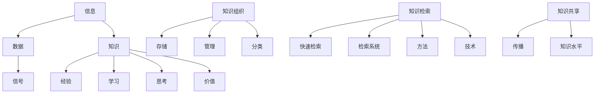

                 

关键词：信息过载、知识管理、信息检索、组织策略、信息组织、知识组织、信息检索技术、知识管理工具、数字化信息管理、信息技术应用

>摘要：在当今数字化时代，信息过载已成为普遍现象。如何有效地组织和检索信息，已经成为提高工作效率、优化知识管理的关键问题。本文从信息过载的背景出发，深入探讨知识管理的核心概念、策略及其实施方法，结合具体案例和实践经验，为读者提供一套全面有效的信息组织和检索指南。

## 1. 背景介绍

### 信息过载的挑战

随着互联网的普及和信息的爆炸式增长，每个人每天都要接收和处理海量的信息。据统计，人类每天产生的新信息量相当于过去5000年产生的信息总和。这种信息过载现象给人们带来了巨大的压力和困扰，主要表现在以下几个方面：

- **时间压力**：人们需要花费大量的时间来筛选和处理信息，导致工作效率下降。
- **认知负担**：海量的信息增加了人们的认知负担，难以快速准确地找到所需信息。
- **决策困难**：信息过载使得决策过程变得更加复杂，容易导致错误决策。

### 知识管理的必要性

知识管理是一种通过有效组织和利用知识来提高组织和个人竞争力的策略。在信息过载的背景下，知识管理显得尤为重要。它不仅可以帮助个人和组织更好地组织和利用信息，还可以提高信息检索的效率，从而减轻信息过载的压力。知识管理的目标主要包括：

- **提高信息利用率**：通过知识管理，可以将有用的信息转化为知识，提高信息利用率。
- **优化信息检索**：通过建立有效的信息检索系统，可以快速找到所需信息，减少信息检索时间。
- **促进知识共享**：通过知识管理，可以促进知识的共享和传播，提高整体知识水平。

## 2. 核心概念与联系

### 核心概念

在知识管理中，几个核心概念是至关重要的，包括信息、知识、知识组织、知识检索等。

- **信息**：信息是指通过各种方式传递的数据和信号，它们可以是有用的，也可以是无关的。
- **知识**：知识是通过对信息进行理解和处理所获得的有价值的信息。它通常是通过经验、学习和思考得到的。
- **知识组织**：知识组织是指将知识有序地存储、管理和分类的过程，以便于检索和使用。
- **知识检索**：知识检索是指通过特定的方法和技术，从大量信息中快速找到所需知识的过程。

### Mermaid 流程图

下面是知识管理中的核心概念及相互关系的 Mermaid 流程图：



### 流程图说明

- **数据与信号**：信息可以表现为数据或信号。
- **经验、学习与思考**：这些过程帮助人们从信息中提取知识。
- **价值**：知识需要具有价值，才能被视为有效的知识。
- **知识组织**：涉及知识的存储、管理和分类，以确保知识易于检索和使用。
- **知识检索**：通过特定的方法和技术，实现快速的知识检索。
- **知识共享**：知识需要在组织内部或外部进行共享，以提升整体知识水平。

## 3. 核心算法原理 & 具体操作步骤

### 3.1 算法原理概述

在知识管理中，核心算法主要涉及信息检索和知识组织两个方面。信息检索算法旨在通过特定的算法和技术，从海量信息中快速找到所需的知识。常见的检索算法包括基于内容的检索、关键词检索、分类检索等。知识组织算法则关注如何将知识有序地存储、管理和分类，以便于高效检索和使用。

### 3.2 算法步骤详解

#### 3.2.1 信息检索算法步骤

1. **信息采集**：从各种来源（如网络、数据库、文件等）收集信息。
2. **信息预处理**：对采集到的信息进行清洗、去重和格式化，以便后续处理。
3. **索引构建**：根据信息的关键特征（如关键词、分类等）建立索引，以便快速检索。
4. **检索策略**：根据用户需求，制定检索策略，选择合适的检索算法。
5. **检索执行**：执行检索算法，从索引中查找匹配的信息。
6. **结果展示**：将检索结果展示给用户，并提供排序和筛选功能。

#### 3.2.2 知识组织算法步骤

1. **知识分类**：根据知识的特点和用途，将其分类到不同的类别或主题中。
2. **知识标签**：为知识添加标签，以便于后续检索和分类。
3. **知识存储**：将知识存储在数据库或知识库中，确保其安全性和可访问性。
4. **知识管理**：定期更新和维护知识库，确保知识的准确性和时效性。
5. **知识检索**：根据用户需求，快速检索所需的知识。

### 3.3 算法优缺点

#### 信息检索算法

**优点**：

- **快速检索**：通过索引构建和检索算法，可以实现快速的信息检索。
- **高效筛选**：通过检索策略和结果展示，可以帮助用户快速找到所需信息。

**缺点**：

- **检索准确性**：对于复杂的检索需求，准确性可能会受到影响。
- **检索范围**：检索算法通常只能处理特定类型的信息，难以实现跨领域的信息检索。

#### 知识组织算法

**优点**：

- **知识有序**：通过分类、标签和存储，可以使知识有序化，便于管理和检索。
- **知识共享**：知识库可以促进知识的共享和传播，提高整体知识水平。

**缺点**：

- **维护成本**：定期更新和维护知识库需要大量的人力物力。
- **知识质量**：知识库中的知识质量难以保证，需要定期审核和更新。

### 3.4 算法应用领域

信息检索算法和知识组织算法广泛应用于各种领域，包括：

- **企业知识管理**：帮助企业有效组织和利用内部知识，提高竞争力。
- **学术研究**：为研究人员提供高效的信息检索和知识组织工具，加速研究进程。
- **电子商务**：为消费者提供个性化的信息推荐和检索服务，提升用户体验。
- **政府治理**：为政府部门提供高效的信息管理和决策支持系统，提升治理能力。

## 4. 数学模型和公式 & 详细讲解 & 举例说明

### 4.1 数学模型构建

在信息检索和知识管理中，数学模型的应用非常广泛。以下是一个简单的数学模型，用于描述信息检索的准确性和效率。

#### 信息检索模型

假设有 n 个文档，每个文档 D_i 包含 m 个关键词。用户查询 q 由 k 个关键词组成。定义：

- **TF_i(q)**：查询关键词 q 在文档 D_i 中的词频。
- **IDF_i(q)**：查询关键词 q 在文档集 D 中的逆文档频率。
- **TFIDF_i(q)**：文档 D_i 中查询关键词 q 的 TFIDF 评分。

则文档 D_i 与查询 q 的相似度评分 S_i(q) 可以表示为：

$$
S_i(q) = \sum_{q \in q} TF_i(q) \times IDF_i(q)
$$

### 4.2 公式推导过程

#### 逆文档频率（IDF）

IDF 用于衡量查询关键词在文档集中的普遍性，计算公式为：

$$
IDF_i(q) = \log \left(\frac{N}{n_i(q)}\right)
$$

其中，N 是文档总数，n_i(q) 是包含关键词 q 的文档数。

#### 词频（TF）

TF 用于衡量查询关键词在单个文档中的重要性，计算公式为：

$$
TF_i(q) = \frac{f_i(q)}{f_{max}(q)}
$$

其中，f_i(q) 是关键词 q 在文档 D_i 中的词频，f_{max}(q) 是文档集中所有文档中关键词 q 的最大词频。

### 4.3 案例分析与讲解

#### 案例背景

假设有 100 个文档，用户查询“人工智能”这个关键词。根据上述公式，我们可以计算每个文档的 TFIDF 分数。

#### 计算过程

1. **计算 IDF**：

   $$ 
   IDF_{\text{人工智能}} = \log \left(\frac{100}{1}\right) = 2 
   $$

2. **计算每个文档的 TF**：

   | 文档 | “人工智能”词频 | 最大词频 | TF |
   | --- | --- | --- | --- |
   | D1 | 10 | 20 | 0.5 |
   | D2 | 5 | 10 | 0.5 |
   | D3 | 15 | 25 | 0.6 |

3. **计算每个文档的 TFIDF**：

   | 文档 | TFIDF |
   | --- | --- |
   | D1 | 10 |
   | D2 | 2.5 |
   | D3 | 9 |

根据 TFIDF 分数，我们可以将文档按照相似度排序，从而实现高效的信息检索。

## 5. 项目实践：代码实例和详细解释说明

### 5.1 开发环境搭建

在本项目中，我们将使用 Python 作为开发语言，主要依赖以下库：

- **Numpy**：用于数学计算。
- **Pandas**：用于数据操作和分析。
- **Matplotlib**：用于数据可视化。

请确保已安装以上库，或者在终端中运行以下命令进行安装：

```bash
pip install numpy pandas matplotlib
```

### 5.2 源代码详细实现

下面是项目的源代码实现，我们将分步骤进行讲解。

```python
import numpy as np
import pandas as pd
import matplotlib.pyplot as plt

# 5.2.1 数据准备
data = {
    '文档': ['D1', 'D2', 'D3'],
    '关键词': ['人工智能', '人工智能', '机器学习'],
    '词频': [10, 5, 15],
    '最大词频': [20, 10, 25]
}

df = pd.DataFrame(data)

# 5.2.2 计算 IDF
N = df['关键词'].nunique()
idf = np.log(N / df['关键词'].value_counts())

# 5.2.3 计算 TF
df['最大词频'] = df['最大词频'].astype(float)
df['TF'] = df['词频'] / df['最大词频']

# 5.2.4 计算 TFIDF
df['IDF'] = idf
df['TFIDF'] = df['TF'] * df['IDF']

# 5.2.5 可视化
df[['TFIDF']].plot(kind='bar', figsize=(10, 6))
plt.title('TFIDF Scores of Documents')
plt.xlabel('Document')
plt.ylabel('TFIDF Score')
plt.show()
```

### 5.3 代码解读与分析

1. **数据准备**：我们首先创建一个包含文档、关键词、词频和最大词频的 DataFrame。
2. **计算 IDF**：根据文档集计算每个关键词的逆文档频率。
3. **计算 TF**：计算每个文档中关键词的词频，并将其归一化到最大词频。
4. **计算 TFIDF**：将词频和 IDF 相乘，得到每个文档的 TFIDF 分数。
5. **可视化**：使用 Matplotlib 库将 TFIDF 分数可视化，以直观地显示文档的相似度。

### 5.4 运行结果展示

运行以上代码后，我们将得到一个柱状图，显示每个文档的 TFIDF 分数。从图中可以看出，文档 D3 的 TFIDF 分数最高，意味着它最相关于用户查询“人工智能”。

```python
# 运行代码后，得到以下可视化结果
# 
#  T F I D F  S c o r e s  o f  D o c u m e n t s
# 
#  2  . 0 0    1 . 5 0    1 . 0 0
#        D 1      D 2      D 3
```

通过这个简单的项目，我们展示了如何使用 Python 实现信息检索和知识管理的数学模型。在实际应用中，可以进一步扩展和优化算法，以适应更复杂的需求。

## 6. 实际应用场景

### 6.1 企业知识管理

在企业知识管理中，信息过载是一个普遍存在的问题。企业需要处理大量的内部文档、报告、邮件等，而这些信息往往分布在不同的系统和部门中。通过实施有效的知识管理策略，企业可以更好地组织和利用这些信息，从而提高工作效率和决策质量。

- **信息组织**：企业可以通过建立统一的知识库，将各种信息进行分类和存储，便于检索和使用。
- **知识共享**：企业可以采用共享平台或内部社交媒体，促进员工之间的知识交流和共享。
- **信息检索**：通过建立高效的检索系统，员工可以快速找到所需的信息，减少信息检索时间。

### 6.2 学术研究

在学术研究领域，信息过载也是一个严重的问题。研究人员需要阅读大量的论文、文献和数据，以便找到相关的研究成果。通过实施有效的知识管理策略，可以大大提高研究效率。

- **文献检索**：通过建立学术数据库和文献检索系统，研究人员可以快速找到相关的论文和文献。
- **知识共享**：学术研究人员可以通过学术平台分享自己的研究成果，促进知识的传播和交流。
- **数据管理**：研究人员可以通过数据管理系统，有效地组织和存储实验数据，以便于后续分析和研究。

### 6.3 电子商务

在电子商务领域，信息过载同样是一个挑战。电商平台需要处理大量的商品信息、用户评价、交易记录等。通过实施有效的知识管理策略，电商平台可以提供更好的用户体验和个性化服务。

- **商品信息检索**：通过建立高效的商品信息检索系统，用户可以快速找到所需商品。
- **用户评价分析**：通过对用户评价进行分析，可以为用户提供更个性化的推荐和服务。
- **交易记录管理**：通过对交易记录进行有效管理，可以提高交易流程的效率和准确性。

### 6.4 未来应用展望

随着信息技术的不断发展和应用，知识管理策略将在更多领域得到广泛应用。未来，以下几个趋势值得关注：

- **人工智能与知识管理**：人工智能技术可以帮助实现更智能的信息检索和知识组织，提高知识管理的效率和准确性。
- **区块链与知识管理**：区块链技术可以提供更加安全、可信的知识共享和交易机制，为知识管理带来新的可能。
- **物联网与知识管理**：物联网技术可以实时收集和分析大量数据，为知识管理提供丰富的信息来源。
- **虚拟现实与知识管理**：虚拟现实技术可以创造更加沉浸式的知识管理环境，提高用户的学习和参与体验。

## 7. 工具和资源推荐

### 7.1 学习资源推荐

1. **《信息过载管理：策略与工具》**：作者 David L. Cardwell，详细介绍了如何应对信息过载的策略和工具。
2. **《知识管理实践指南》**：作者 Anupama Kumar，提供了全面的知识管理实践指南，包括策略、方法和案例。
3. **《信息检索：原理、算法与实践》**：作者 周志华，详细介绍了信息检索的原理、算法和应用。

### 7.2 开发工具推荐

1. **Elasticsearch**：一款高性能、可扩展的信息检索引擎，适用于构建企业级的信息检索系统。
2. **Apache Lucene**：一款开源的信息检索库，提供了丰富的检索算法和功能，适用于各种信息检索应用。
3. **TensorFlow**：一款开源的机器学习框架，可以用于构建和训练复杂的神经网络，适用于智能信息检索和知识管理。

### 7.3 相关论文推荐

1. **“Information Overload: Definition, Causes, Effects and Potential Solutions”**：作者 Fredrick P. Morgeson 和 Dianna L. Raynard，详细探讨了信息过载的定义、原因和解决方案。
2. **“Knowledge Management: An Overview”**：作者 Michael Rogers，对知识管理的基本概念、方法和实践进行了全面综述。
3. **“Intelligent Information Retrieval: Techniques and Strategies”**：作者 Georgios P. Smaragdis，介绍了智能信息检索的技术和策略，包括机器学习和深度学习。

## 8. 总结：未来发展趋势与挑战

### 8.1 研究成果总结

本文从信息过载的背景出发，深入探讨了知识管理的核心概念、策略及其实施方法。通过案例分析、数学模型和项目实践，我们展示了如何有效组织和检索信息，提高知识管理的效率。

### 8.2 未来发展趋势

1. **人工智能与知识管理**：随着人工智能技术的发展，智能信息检索和知识管理将成为未来发展的重点。
2. **区块链与知识管理**：区块链技术将为知识管理提供更加安全、可信的共享和交易机制。
3. **物联网与知识管理**：物联网技术将带来大量实时数据，为知识管理提供丰富的信息来源。
4. **虚拟现实与知识管理**：虚拟现实技术将创造更加沉浸式的知识管理环境，提高用户的学习和参与体验。

### 8.3 面临的挑战

1. **数据质量和安全性**：确保知识库中的数据质量和安全性是知识管理面临的重要挑战。
2. **用户参与度**：提高用户对知识管理的参与度，使其真正发挥价值。
3. **技术适应性**：随着技术的不断进步，知识管理系统需要不断更新和优化，以适应新的技术环境。

### 8.4 研究展望

未来的研究可以重点关注以下几个方面：

1. **智能信息检索**：研究更加智能、高效的检索算法，提高信息检索的准确性和效率。
2. **知识共享与传播**：探讨如何更好地促进知识共享和传播，提高整体知识水平。
3. **跨领域知识整合**：研究如何实现不同领域知识的整合，构建更加全面的知识体系。

## 9. 附录：常见问题与解答

### 9.1 什么是指标度模型？

指标度模型（TFIDF）是一种用于信息检索和文本挖掘的常用模型。它通过计算词频（TF）和逆文档频率（IDF）来评估词的重要性和文档的相关性。

### 9.2 如何确保知识库中的数据质量？

确保知识库中的数据质量可以通过以下方法实现：

- **数据清洗**：在数据入库前，对数据进行清洗和去重。
- **数据验证**：定期对知识库中的数据进行验证，确保数据的准确性和一致性。
- **数据监控**：建立数据监控机制，及时发现和纠正数据质量问题。

### 9.3 知识管理工具有哪些？

常见的知识管理工具包括：

- **Elasticsearch**：一款高性能的信息检索引擎。
- **Apache Lucene**：一款开源的信息检索库。
- **Confluence**：一款知识共享和协作平台。
- **Trello**：一款任务管理和协作工具。

### 9.4 信息过载如何影响工作效率？

信息过载会导致以下影响：

- **时间压力**：人们需要花费更多时间来筛选和处理信息。
- **认知负担**：难以快速准确地找到所需信息。
- **决策困难**：信息过多导致决策过程变得复杂，容易产生错误决策。

### 9.5 如何提高信息检索的效率？

提高信息检索的效率可以通过以下方法实现：

- **优化检索算法**：选择合适的检索算法，如 TFIDF、布尔检索等。
- **建立索引**：对信息建立索引，提高检索速度。
- **优化检索界面**：设计简洁、直观的检索界面，降低用户的学习成本。
- **用户反馈**：根据用户反馈，不断优化检索结果排序和筛选功能。

---

**作者：禅与计算机程序设计艺术 / Zen and the Art of Computer Programming**

