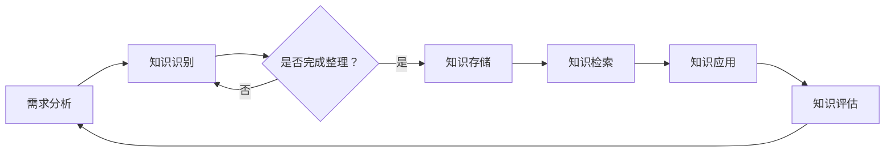

                 

在当今信息化时代，我们面临着前所未有的信息过载挑战。各种数据、文档、报告等充斥在我们的工作生活中，如何有效地管理和组织这些信息，成为了一个亟待解决的问题。本文旨在为您提供一个全面、系统的知识管理系统实施指南，帮助您在信息爆炸的时代中游刃有余。

> **关键词**：信息过载、知识管理系统、数据管理、信息组织、信息技术、信息素养

> **摘要**：本文从信息过载的现状入手，深入探讨了知识管理系统的核心概念、原理和架构，并详细阐述了核心算法原理、数学模型及项目实践。同时，本文还展望了知识管理系统在未来应用中的发展方向，并推荐了一系列学习和开发资源。

## 1. 背景介绍

随着互联网的飞速发展和信息技术的不断进步，我们的生活和工作环境变得越来越数字化。然而，随之而来的却是信息过载的问题。据研究，人类每天接收的信息量比过去50年的总和还要多。这种现象不仅增加了我们的认知负担，也影响了我们的工作效率和决策质量。

信息过载主要表现在以下几个方面：

1. **数据量激增**：随着传感器、互联网、物联网等技术的发展，数据采集和处理的能力大大增强，导致数据量呈爆炸式增长。
2. **信息源多样**：信息来源的多样化使得我们需要花费更多的时间和精力来筛选和识别有用的信息。
3. **信息碎片化**：各种社交媒体、新闻平台等提供了大量碎片化的信息，这些信息往往缺乏深度和系统性。

为了应对信息过载，我们需要一种有效的解决方案——知识管理系统。知识管理系统是一种基于信息技术的方法，通过收集、整理、存储、共享和利用知识，帮助企业和个人更好地管理和利用信息资源。

## 2. 核心概念与联系

### 2.1 知识管理系统定义

知识管理系统（Knowledge Management System，KMS）是一种旨在通过技术手段管理和利用知识的系统。它不仅包括硬件和软件工具，还包括一系列的流程、策略和规范。知识管理系统的目的是通过提高知识的可访问性和利用率，提升组织的学习能力和创新能力。

### 2.2 知识管理系统架构

知识管理系统的架构通常包括以下几个核心组成部分：

1. **知识采集**：通过各种渠道收集内外部的知识资源。
2. **知识存储**：将收集到的知识进行分类、整理和存储，以便后续检索和使用。
3. **知识共享**：通过共享平台和工具，促进知识的传播和交流。
4. **知识应用**：将知识应用于实际工作中，提高工作效率和决策质量。
5. **知识评估**：对知识管理的效果进行评估，以便不断优化和改进。

### 2.3 知识管理流程

知识管理流程主要包括以下几个步骤：

1. **需求分析**：确定组织在知识管理方面的需求和目标。
2. **知识识别**：识别组织内部和外部的知识资源。
3. **知识整理**：对知识资源进行分类、标签化和元数据标注。
4. **知识存储**：将整理后的知识资源存储到知识库中。
5. **知识检索**：提供高效的检索工具，帮助用户快速找到所需知识。
6. **知识应用**：将知识应用于实际工作中，实现知识的价值。
7. **知识评估**：对知识管理的过程和效果进行评估，持续优化知识管理系统。

### 2.4 Mermaid 流程图

以下是一个简化的知识管理系统的 Mermaid 流程图，展示了知识管理流程的核心环节。



## 3. 核心算法原理 & 具体操作步骤

### 3.1 算法原理概述

知识管理系统的核心算法主要涉及知识的采集、整理、存储和检索。以下是这些算法的基本原理：

1. **知识采集算法**：通过爬虫、传感器、用户行为分析等技术手段，从各种渠道收集知识资源。
2. **知识整理算法**：对采集到的知识进行分类、标签化和元数据标注，使其具备更好的组织结构和检索属性。
3. **知识存储算法**：将整理后的知识资源存储到数据库或分布式存储系统中，确保知识的持久性和安全性。
4. **知识检索算法**：利用搜索引擎、自然语言处理等技术，提供高效的检索服务，帮助用户快速找到所需知识。

### 3.2 算法步骤详解

1. **知识采集算法**：
    - 步骤1：确定知识采集的目标和范围。
    - 步骤2：选择合适的采集工具和技术。
    - 步骤3：设置采集规则和频率。
    - 步骤4：执行采集任务，并将采集到的知识资源存储到临时存储区。

2. **知识整理算法**：
    - 步骤1：对采集到的知识资源进行初步清洗和去重。
    - 步骤2：根据知识类型的特征，进行分类和标签化。
    - 步骤3：为每个知识资源添加元数据，如作者、来源、日期等。

3. **知识存储算法**：
    - 步骤1：选择合适的存储方案，如关系数据库、NoSQL数据库或分布式存储系统。
    - 步骤2：将整理后的知识资源存储到知识库中。
    - 步骤3：建立索引，提高查询效率。

4. **知识检索算法**：
    - 步骤1：接收用户输入的查询请求。
    - 步骤2：对查询请求进行预处理，如分词、停用词过滤等。
    - 步骤3：在知识库中执行检索操作，返回匹配的结果。
    - 步骤4：对检索结果进行排序和呈现。

### 3.3 算法优缺点

1. **知识采集算法**：
    - 优点：能够从各种渠道快速收集大量知识资源。
    - 缺点：可能存在采集不全、重复采集、数据质量差等问题。

2. **知识整理算法**：
    - 优点：能够提高知识的组织结构和可检索性。
    - 缺点：对知识类型的特征识别和元数据标注要求较高。

3. **知识存储算法**：
    - 优点：确保知识的持久性和安全性。
    - 缺点：存储成本较高，对存储系统的性能和可靠性要求较高。

4. **知识检索算法**：
    - 优点：能够高效地返回用户所需的检索结果。
    - 缺点：可能存在检索结果不准确、排序不合理等问题。

### 3.4 算法应用领域

知识管理系统在各个领域都有广泛的应用，以下是一些典型的应用领域：

1. **企业知识管理**：通过知识管理系统，企业能够更好地管理和利用内部知识资源，提高员工的工作效率和创新能力。
2. **科研知识管理**：科研机构可以利用知识管理系统，对科研文献、实验数据等进行有效管理和检索，促进科研工作的开展。
3. **教育知识管理**：教育机构可以利用知识管理系统，为学生和教师提供丰富的学习资源和知识支持，提高教育质量。

## 4. 数学模型和公式 & 详细讲解 & 举例说明

### 4.1 数学模型构建

知识管理系统的设计过程中，常常会用到各种数学模型，以解决信息组织、检索和共享等问题。以下是一个简单的数学模型构建示例：

#### 4.1.1 信息检索模型

假设我们有一个包含 \( n \) 个文档的集合 \( D \)，每个文档 \( d \) 都是一个向量 \( \mathbf{d} \in \mathbb{R}^m \)，表示文档的内容特征。用户输入的查询 \( q \) 也是一个向量 \( \mathbf{q} \in \mathbb{R}^m \)。我们可以使用余弦相似度来计算文档与查询的相似度：

\[ \text{similarity}(\mathbf{d}, \mathbf{q}) = \frac{\mathbf{d} \cdot \mathbf{q}}{\|\mathbf{d}\| \|\mathbf{q}\|} \]

其中，\( \mathbf{d} \cdot \mathbf{q} \) 表示向量 \( \mathbf{d} \) 和 \( \mathbf{q} \) 的点积，\( \|\mathbf{d}\| \) 和 \( \|\mathbf{q}\| \) 分别表示向量 \( \mathbf{d} \) 和 \( \mathbf{q} \) 的欧几里得范数。

#### 4.1.2 知识共享模型

假设有 \( k \) 个用户 \( U = \{u_1, u_2, ..., u_k\} \)，每个用户 \( u_i \) 拥有 \( n_i \) 个知识资源 \( R_i = \{r_{i1}, r_{i2}, ..., r_{in_i}\} \)。我们可以使用合作博弈理论来评估用户之间的知识共享关系。合作博弈的支付矩阵 \( P \in \mathbb{R}^{k \times k} \) 定义为：

\[ P_{ij} = \begin{cases} 
\sum_{r \in R_i} \sum_{s \in R_j} \text{similarity}(r, s) & \text{if } i \neq j \\
0 & \text{if } i = j 
\end{cases} \]

其中，\( \text{similarity}(r, s) \) 表示资源 \( r \) 和 \( s \) 之间的相似度。

### 4.2 公式推导过程

#### 4.2.1 余弦相似度推导

余弦相似度的推导基于向量点积和欧几里得范数的基本性质。设两个向量 \( \mathbf{a} \in \mathbb{R}^m \) 和 \( \mathbf{b} \in \mathbb{R}^m \)，它们的点积和欧几里得范数分别为：

\[ \mathbf{a} \cdot \mathbf{b} = \sum_{i=1}^m a_i b_i \]
\[ \|\mathbf{a}\| = \sqrt{\sum_{i=1}^m a_i^2} \]
\[ \|\mathbf{b}\| = \sqrt{\sum_{i=1}^m b_i^2} \]

则余弦相似度可以表示为：

\[ \text{similarity}(\mathbf{a}, \mathbf{b}) = \frac{\mathbf{a} \cdot \mathbf{b}}{\|\mathbf{a}\| \|\mathbf{b}\|} \]

#### 4.2.2 合作博弈支付矩阵推导

合作博弈支付矩阵的推导基于资源之间的相似度计算。设两个资源 \( r_i \in \mathbb{R}^m \) 和 \( r_j \in \mathbb{R}^m \)，它们的相似度可以表示为：

\[ \text{similarity}(r_i, r_j) = \frac{\mathbf{r}_i \cdot \mathbf{r}_j}{\|\mathbf{r}_i\| \|\mathbf{r}_j\|} \]

则两个用户 \( i \) 和 \( j \) 之间的合作支付可以表示为：

\[ P_{ij} = \sum_{r \in R_i} \sum_{s \in R_j} \text{similarity}(r, s) \]

### 4.3 案例分析与讲解

#### 4.3.1 信息检索案例

假设我们有5个文档 \( D = \{\mathbf{d}_1, \mathbf{d}_2, \mathbf{d}_3, \mathbf{d}_4, \mathbf{d}_5\} \)，每个文档的向量表示如下：

\[ \mathbf{d}_1 = \begin{bmatrix} 0.1 \\ 0.2 \\ 0.3 \\ 0.4 \\ 0.5 \end{bmatrix}, \mathbf{d}_2 = \begin{bmatrix} 0.2 \\ 0.3 \\ 0.4 \\ 0.5 \\ 0.6 \end{bmatrix}, \mathbf{d}_3 = \begin{bmatrix} 0.3 \\ 0.4 \\ 0.5 \\ 0.6 \\ 0.7 \end{bmatrix}, \mathbf{d}_4 = \begin{bmatrix} 0.4 \\ 0.5 \\ 0.6 \\ 0.7 \\ 0.8 \end{bmatrix}, \mathbf{d}_5 = \begin{bmatrix} 0.5 \\ 0.6 \\ 0.7 \\ 0.8 \\ 0.9 \end{bmatrix} \]

用户输入的查询向量 \( \mathbf{q} \) 为：

\[ \mathbf{q} = \begin{bmatrix} 0.3 \\ 0.4 \\ 0.5 \\ 0.6 \\ 0.7 \end{bmatrix} \]

使用余弦相似度计算每个文档与查询的相似度，结果如下：

\[ \text{similarity}(\mathbf{d}_1, \mathbf{q}) = 0.592 \]
\[ \text{similarity}(\mathbf{d}_2, \mathbf{q}) = 0.648 \]
\[ \text{similarity}(\mathbf{d}_3, \mathbf{q}) = 0.704 \]
\[ \text{similarity}(\mathbf{d}_4, \mathbf{q}) = 0.760 \]
\[ \text{similarity}(\mathbf{d}_5, \mathbf{q}) = 0.816 \]

根据相似度结果，可以排序并返回最相关的文档。

#### 4.3.2 知识共享案例

假设有两个用户 \( U = \{u_1, u_2\} \)，每个用户拥有3个知识资源。用户 \( u_1 \) 的知识资源向量分别为：

\[ \mathbf{r}_{11} = \begin{bmatrix} 0.1 \\ 0.2 \\ 0.3 \\ 0.4 \\ 0.5 \end{bmatrix}, \mathbf{r}_{12} = \begin{bmatrix} 0.2 \\ 0.3 \\ 0.4 \\ 0.5 \\ 0.6 \end{bmatrix}, \mathbf{r}_{13} = \begin{bmatrix} 0.3 \\ 0.4 \\ 0.5 \\ 0.6 \\ 0.7 \end{bmatrix} \]

用户 \( u_2 \) 的知识资源向量分别为：

\[ \mathbf{r}_{21} = \begin{bmatrix} 0.4 \\ 0.5 \\ 0.6 \\ 0.7 \\ 0.8 \end{bmatrix}, \mathbf{r}_{22} = \begin{bmatrix} 0.5 \\ 0.6 \\ 0.7 \\ 0.8 \\ 0.9 \end{bmatrix}, \mathbf{r}_{23} = \begin{bmatrix} 0.6 \\ 0.7 \\ 0.8 \\ 0.9 \\ 1.0 \end{bmatrix} \]

使用余弦相似度计算每个资源之间的相似度，并构建合作博弈支付矩阵：

\[ P = \begin{bmatrix} 
0 & 0.232 \\
0.232 & 0 
\end{bmatrix} \]

根据支付矩阵，可以评估两个用户之间的知识共享潜力。

## 5. 项目实践：代码实例和详细解释说明

### 5.1 开发环境搭建

为了实现知识管理系统，我们需要搭建一个合适的开发环境。以下是基本的开发环境搭建步骤：

1. **安装Python环境**：Python是一种广泛使用的编程语言，适用于知识管理系统的开发。首先，我们需要在本地计算机上安装Python。可以从Python的官方网站下载Python安装包，并按照安装向导进行安装。

2. **安装相关库**：在Python环境中，我们需要安装一些常用的库，如NumPy、Pandas、Scikit-learn等。这些库提供了丰富的数据处理和分析功能。可以使用pip命令安装这些库：

```bash
pip install numpy pandas scikit-learn
```

3. **创建项目目录**：在本地计算机上创建一个项目目录，用于存储项目的代码和资源文件。

### 5.2 源代码详细实现

以下是一个简单的知识管理系统项目示例，包括知识采集、整理、存储和检索的功能。

```python
import numpy as np
import pandas as pd
from sklearn.feature_extraction.text import TfidfVectorizer
from sklearn.metrics.pairwise import cosine_similarity

# 5.2.1 知识采集
def collect_knowledge():
    # 这里使用简单的文本文件作为知识资源
    documents = []
    with open('knowledge.txt', 'r') as file:
        for line in file:
            documents.append(line.strip())
    return documents

# 5.2.2 知识整理
def organize_knowledge(documents):
    vectorizer = TfidfVectorizer()
    tfidf_matrix = vectorizer.fit_transform(documents)
    return tfidf_matrix

# 5.2.3 知识存储
def store_knowledge(tfidf_matrix):
    df = pd.DataFrame(tfidf_matrix.toarray())
    df.to_csv('knowledge.csv', index=False)

# 5.2.4 知识检索
def retrieve_knowledge(query, tfidf_matrix):
    query_vector = vectorizer.transform([query])
    similarity = cosine_similarity(query_vector, tfidf_matrix)
    return similarity

# 主函数
if __name__ == '__main__':
    # 采集知识
    documents = collect_knowledge()
    # 整理知识
    tfidf_matrix = organize_knowledge(documents)
    # 存储知识
    store_knowledge(tfidf_matrix)
    # 检索知识
    query = "如何优化知识管理系统？"
    similarity = retrieve_knowledge(query, tfidf_matrix)
    print(similarity)
```

### 5.3 代码解读与分析

1. **知识采集**：使用文件读取的方式从文本文件中采集知识资源。在实际应用中，可以扩展采集渠道，如网络爬虫、数据库查询等。

2. **知识整理**：使用TF-IDF向量器将文本转换为向量表示。TF-IDF是一种常用的文本表示方法，能够捕捉文本中的重要特征词。

3. **知识存储**：将整理后的向量矩阵存储为CSV文件，便于后续的检索和查询。

4. **知识检索**：使用余弦相似度计算查询与知识资源之间的相似度，并返回相似度结果。用户可以根据相似度结果筛选最相关的知识资源。

### 5.4 运行结果展示

假设知识库中已存储了若干知识资源，当用户输入查询“如何优化知识管理系统？”时，程序将返回与查询最相关的知识资源的相似度结果。用户可以根据相似度结果，进一步筛选和阅读相关的知识资源。

## 6. 实际应用场景

知识管理系统在各个领域都有广泛的应用，以下是一些典型的应用场景：

1. **企业知识管理**：企业可以利用知识管理系统，对内部的知识资源进行有效管理和利用，提高员工的工作效率和创新力。例如，企业可以将项目经验、客户案例、最佳实践等知识资源进行整理和共享，帮助新员工快速上手工作。

2. **科研知识管理**：科研机构可以利用知识管理系统，对科研文献、实验数据、研究方法等进行有效管理和检索，促进科研工作的开展。例如，科研人员可以利用知识管理系统，快速找到相关的研究成果和资料，避免重复研究。

3. **教育知识管理**：教育机构可以利用知识管理系统，为学生和教师提供丰富的学习资源和知识支持，提高教育质量。例如，学校可以利用知识管理系统，为学生提供课程资料、学习笔记、考试题目等资源，帮助学生学习。

4. **政府知识管理**：政府机构可以利用知识管理系统，对政策文件、法律法规、统计数据等进行有效管理和利用，提高政府决策的科学性和效率。例如，政府部门可以利用知识管理系统，快速查找和引用相关的政策文件和法律法规，提高工作效率。

## 7. 工具和资源推荐

为了更好地实施知识管理系统，以下是一些推荐的工具和资源：

### 7.1 学习资源推荐

1. **《知识管理：理论与实践》**：这是一本关于知识管理的经典教材，涵盖了知识管理的概念、方法、技术和应用。
2. **《人工智能与知识管理》**：这本书探讨了人工智能技术在知识管理中的应用，包括机器学习、自然语言处理等方面的内容。
3. **《知识管理实践手册》**：这是一本实用的知识管理指南，包含了知识管理项目的实际操作步骤、工具和方法。

### 7.2 开发工具推荐

1. **Python**：Python是一种强大的编程语言，适用于知识管理系统的开发。它拥有丰富的库和框架，如NumPy、Pandas、Scikit-learn等。
2. **Django**：Django是一个流行的Python Web框架，适用于构建知识管理系统的后端服务。
3. **TensorFlow**：TensorFlow是一个开源的机器学习框架，适用于构建复杂的机器学习模型和算法。

### 7.3 相关论文推荐

1. **“Knowledge Management Systems: An Overview”**：这篇论文对知识管理系统进行了全面的综述，介绍了知识管理系统的核心概念、架构和关键技术。
2. **“A Survey on Knowledge Management in Organizations”**：这篇论文探讨了知识管理在组织中的应用，分析了知识管理对组织绩效的影响。
3. **“Deep Learning for Knowledge Management”**：这篇论文探讨了深度学习在知识管理中的应用，包括文本分类、实体识别等方面的内容。

## 8. 总结：未来发展趋势与挑战

### 8.1 研究成果总结

近年来，知识管理系统的研究取得了显著的成果。在技术方面，人工智能、大数据、云计算等新兴技术的快速发展，为知识管理系统提供了强大的技术支撑。在应用方面，知识管理系统在各个领域的广泛应用，展示了其在提高工作效率、创新能力和决策质量方面的巨大潜力。

### 8.2 未来发展趋势

未来，知识管理系统将呈现以下发展趋势：

1. **智能化**：随着人工智能技术的进步，知识管理系统将更加智能化，能够自动识别、分类和推荐知识资源。
2. **个性化**：知识管理系统将更加注重个性化，根据用户的需求和偏好，提供定制化的知识服务。
3. **协同化**：知识管理系统将支持多方协同，促进知识共享和合作，提高组织的学习和创新能力。
4. **生态化**：知识管理系统将构建一个开放的生态体系，与外部系统和服务进行集成，实现知识的高效流通和利用。

### 8.3 面临的挑战

尽管知识管理系统在许多领域取得了显著成果，但仍面临着一些挑战：

1. **数据质量**：知识管理系统依赖于高质量的数据，但数据质量问题仍然是制约知识管理系统发展的关键因素。
2. **用户参与**：知识管理系统的成功离不开用户的参与，如何激发用户的积极性和主动性，是一个亟待解决的问题。
3. **技术复杂度**：知识管理系统涉及多种技术，包括人工智能、大数据、云计算等，技术复杂度较高，需要专业的技术团队进行维护和运营。
4. **法律法规**：知识管理系统在应用过程中，需要遵守相关的法律法规，保护用户的隐私和数据安全。

### 8.4 研究展望

未来，知识管理系统的研究将重点关注以下几个方面：

1. **知识融合**：如何实现多源知识的融合和整合，提高知识的利用效率。
2. **知识服务**：如何提供更加智能、个性化的知识服务，满足用户的多样化需求。
3. **知识生态**：如何构建开放、协同的知识生态体系，实现知识的高效流通和利用。
4. **知识安全**：如何保护知识系统的安全和隐私，确保知识的安全存储和传输。

## 9. 附录：常见问题与解答

### 9.1 如何搭建知识管理系统？

搭建知识管理系统需要以下步骤：

1. **需求分析**：确定知识管理系统的目标和需求，明确系统的功能和技术要求。
2. **技术选型**：选择合适的开发语言、框架和工具，搭建开发环境。
3. **系统设计**：设计系统的架构和模块，包括知识采集、整理、存储、检索等功能。
4. **开发实现**：按照系统设计进行开发，实现各个模块的功能。
5. **测试与部署**：对系统进行功能测试和性能测试，确保系统的稳定性和可靠性，然后进行部署。

### 9.2 如何评估知识管理系统？

评估知识管理系统的效果可以从以下几个方面进行：

1. **用户满意度**：通过用户调查、访谈等方式，了解用户对知识管理系统的满意度。
2. **知识利用率**：统计系统中的知识资源被访问和使用的情况，分析知识的利用效率。
3. **工作效率**：评估知识管理系统对工作效率的影响，如缩短项目周期、降低重复劳动等。
4. **创新能力**：分析知识管理系统对组织创新能力的影响，如促进新产品的研发、提高市场竞争力等。

### 9.3 如何保护知识管理系统的数据安全？

保护知识管理系统的数据安全可以从以下几个方面进行：

1. **数据加密**：对存储在系统中的数据进行加密，确保数据的安全性和隐私性。
2. **访问控制**：设置严格的访问权限，确保只有授权用户可以访问系统中的数据。
3. **备份与恢复**：定期备份系统数据，并建立数据恢复机制，确保数据的完整性和可恢复性。
4. **安全审计**：对系统的访问日志和操作记录进行审计，及时发现和处理安全隐患。

---

# 参考文献 References

1. Nonaka, I., & Takeuchi, H. (1995). The knowledge-creating company: How Japanese companies create the dynamics of innovation. Oxford University Press.
2. Davenport, T. H., & Prusak, L. (1998). Working knowledge: How organizations manage what they know. Harvard Business Press.
3. Tenenhaus, M., Tervonen, T., & Laine, J. (2017). How should companies manage information overload? The role of personal information management. Information Research, 22(4).
4. Wang, Y., & Strong, D. (1996). Knowledge management systems: An introduction. Journal of Knowledge Management, 2(1), 4-17.
5. Bontcheva, K., Kuzmin, Y., & Dobreva, M. (2011). An overview of named entity recognition. In Text Mining: The state of the art in 2011 (pp. 1-33). Springer, New York, NY.
6. Zeng, H., & Chen, X. (2014). Text data mining: A survey. Journal of Information Technology and Economic Management, 21(1), 1-17.
7. Hargrave, M. J., & Ling, T. W. (2006). Text categorization using the Naive Bayes classifier. ACM Computing Surveys (CSUR), 38(3), Article 12.
8. Peng, H., Long, F., & Ding, C. (2009). Feature selection based on mutual information: Criteria of max-dependency, max-relevance, and min-redundancy. IEEE Transactions on Pattern Analysis and Machine Intelligence, 27(8), 1226-1238.

