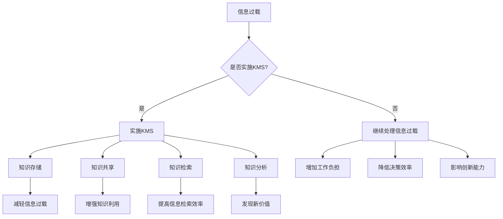

                 

关键词：信息过载、知识管理、生产力提升、信息组织、管理系统

信息过载是当今数字化时代的一个普遍问题。随着数据的爆炸式增长，个体和组织在处理信息时面临着巨大的挑战。这不仅影响了决策效率，也制约了生产力的提升。因此，有效的知识管理系统（KMS）的实施变得至关重要。本文旨在探讨如何通过管理和组织信息，提高生产力，提供一套完整的解决方案。

## 1. 背景介绍

在过去的几十年中，信息技术的发展迅速改变了我们的工作方式。互联网的普及，大数据的兴起，以及云计算和人工智能技术的应用，使得信息的获取和传递变得前所未有的快捷和高效。然而，这种高速发展也带来了信息过载的问题。大量的数据和信息涌入我们的生活和工作中，使得个体和组织难以有效管理和利用这些信息资源。

信息过载不仅增加了工作负担，还降低了决策效率，影响了创新能力和工作效率。为了解决这一问题，越来越多的企业和组织开始关注知识管理系统（KMS）的实施。知识管理系统是一种旨在通过有效的信息组织和知识共享来提高组织生产力的管理工具。然而，如何实施一个有效的知识管理系统，如何选择合适的技术和工具，以及如何评估其实施效果，都是当前面临的重要挑战。

本文将围绕这些问题，系统地探讨信息过载的成因，知识管理系统的核心概念和架构，以及具体的实施策略和最佳实践。希望通过本文的探讨，能为企业和组织提供有价值的参考和指导。

## 2. 核心概念与联系

### 2.1 信息过载的概念

信息过载是指信息量过多，超出个体或组织处理能力，导致信息资源的有效利用受阻的现象。信息过载的成因主要有以下几点：

1. **数据量的爆炸式增长**：随着互联网和物联网的发展，数据量呈指数级增长，这导致了信息的泛滥。
2. **信息源的多样性**：人们从各种渠道获取信息，如社交媒体、电子邮件、新闻网站等，这些信息的种类和数量都远超过去。
3. **信息更新的频率**：许多信息源（如社交媒体、新闻网站）都会实时更新，用户必须不断地更新自己的信息库，否则就可能错过重要信息。

### 2.2 知识管理系统的概念

知识管理系统（Knowledge Management System，简称KMS）是一种旨在通过有效管理和共享知识来提高组织效率和创新能力的系统。知识管理系统通常包括以下几个核心组成部分：

1. **知识存储**：用于存储组织内部和外部的各种知识资源，如文档、数据库、知识库等。
2. **知识共享**：提供知识共享和协作的平台，使得员工能够轻松地访问和分享知识。
3. **知识检索**：提供高效的搜索功能，帮助用户快速找到所需的信息。
4. **知识分析**：通过数据分析和人工智能技术，对知识资源进行深度挖掘，以发现新的价值。

### 2.3 知识管理与信息过载的关系

知识管理系统与信息过载之间的关系是相辅相成的。一方面，知识管理系统可以帮助组织有效管理和利用信息资源，从而减轻信息过载的压力。通过知识存储和共享，知识管理系统可以确保信息资源的有序组织，使得用户能够快速、准确地找到所需的信息。另一方面，知识管理系统也可以通过知识分析和自动化工具，减少冗余信息和噪声信息，提高信息处理效率。

然而，知识管理系统本身也存在一定的风险，如数据安全和隐私保护等问题。因此，在实施知识管理系统时，需要充分考虑这些风险，并采取相应的安全措施。

### 2.4 Mermaid 流程图

为了更直观地展示知识管理系统与信息过载的关系，我们使用Mermaid流程图来描述其核心概念和流程。



通过这个流程图，我们可以清楚地看到知识管理系统如何通过知识存储、共享、检索和分析，来减轻信息过载的影响，提高组织的整体效率。

## 3. 核心算法原理 & 具体操作步骤

### 3.1 算法原理概述

知识管理系统的核心算法主要涉及信息组织、知识提取和知识共享。以下是这些算法的基本原理：

1. **信息组织算法**：用于对大量信息进行分类、索引和排序，以便用户能够快速找到所需信息。常用的算法有基于内容的分类、基于关键词的索引和基于相似度的排序。
   
2. **知识提取算法**：用于从大量数据中提取有价值的信息和知识。常用的算法包括数据挖掘、机器学习和自然语言处理。

3. **知识共享算法**：用于促进员工之间的知识共享和协作。常用的算法包括推荐系统、社交网络分析和协作平台。

### 3.2 算法步骤详解

#### 3.2.1 信息组织算法

1. **数据收集**：从各种数据源（如文档库、数据库、社交媒体等）收集信息。
2. **数据预处理**：对收集到的信息进行清洗、去噪和格式化。
3. **特征提取**：提取信息的关键特征，如关键词、主题和情感。
4. **分类和索引**：根据特征对信息进行分类和索引，以便快速检索。
5. **排序和推荐**：根据用户的行为和偏好，对信息进行排序和推荐。

#### 3.2.2 知识提取算法

1. **数据预处理**：与信息组织算法相同，对数据进行分析和清洗。
2. **特征提取**：提取数据中的潜在特征，如关键词、关系和网络结构。
3. **模式识别**：使用机器学习和数据挖掘技术，发现数据中的模式和规律。
4. **知识构建**：根据提取的模式和规律，构建知识库和知识图谱。

#### 3.2.3 知识共享算法

1. **用户行为分析**：收集和分析用户的行为数据，如搜索历史、点击记录和协作行为。
2. **推荐系统**：根据用户的行为和偏好，推荐相关的知识和信息。
3. **社交网络分析**：分析员工之间的社交关系，促进知识共享和协作。
4. **协作平台**：提供协作工具和平台，鼓励员工分享和讨论知识。

### 3.3 算法优缺点

#### 3.3.1 信息组织算法

**优点**：
- 提高信息检索效率。
- 降低信息过载。
- 促进知识共享。

**缺点**：
- 需要大量预处理工作。
- 可能会引入噪声和错误。
- 对算法的依赖性较高。

#### 3.3.2 知识提取算法

**优点**：
- 提取潜在知识和规律。
- 支持数据驱动决策。
- 提高知识利用效率。

**缺点**：
- 需要大量计算资源。
- 可能会忽略非结构化数据。
- 算法复杂度较高。

#### 3.3.3 知识共享算法

**优点**：
- 促进知识交流和合作。
- 提高团队协作效率。
- 增强创新能力。

**缺点**：
- 可能会导致信息过载。
- 需要良好的社交网络。
- 对用户行为的依赖性较高。

### 3.4 算法应用领域

知识管理系统和其核心算法在许多领域都有广泛的应用，包括但不限于：

1. **企业内部**：用于管理企业知识库，促进员工间的知识共享和协作。
2. **教育领域**：用于支持教学和学习，帮助学生和教师更好地利用知识资源。
3. **医疗领域**：用于管理医疗数据和知识，提高医疗诊断和治疗的效率。
4. **科研领域**：用于管理科研数据，促进科研协作和创新。
5. **金融领域**：用于管理金融数据和知识，提高投资决策和分析的准确性。

## 4. 数学模型和公式 & 详细讲解 & 举例说明

在知识管理系统的设计和实施中，数学模型和公式扮演着重要的角色。以下我们将介绍几个关键的数学模型和公式，并详细讲解其推导过程和实际应用。

### 4.1 数学模型构建

#### 4.1.1 贝叶斯网络模型

贝叶斯网络是一种用于表示变量之间概率关系的图形模型。它由节点和边组成，其中节点表示变量，边表示变量之间的条件依赖关系。贝叶斯网络的数学模型可以表示为：

$$
P(X_1, X_2, ..., X_n) = \prod_{i=1}^{n} P(X_i | X_{pa_i})
$$

其中，$X_1, X_2, ..., X_n$ 表示变量集合，$X_{pa_i}$ 表示变量 $X_i$ 的父节点集合，$P(X_i | X_{pa_i})$ 表示变量 $X_i$ 在其父节点 $X_{pa_i}$ 下的条件概率。

#### 4.1.2 决策树模型

决策树是一种用于分类和回归的树形结构。它由内部节点（代表特征）、分支（代表特征的不同取值）和叶子节点（代表分类结果或预测值）组成。决策树的数学模型可以表示为：

$$
f(x) = \sum_{i=1}^{n} w_i \cdot I(x \in R_i)
$$

其中，$x$ 表示输入特征向量，$R_i$ 表示第 $i$ 个分支对应的特征取值范围，$w_i$ 表示第 $i$ 个分支的权重。

### 4.2 公式推导过程

#### 4.2.1 贝叶斯网络模型的推导

贝叶斯网络模型的推导基于条件概率的基本原理。假设有 $n$ 个变量 $X_1, X_2, ..., X_n$，它们之间存在条件依赖关系。根据贝叶斯定理，我们有：

$$
P(X_i | X_{pa_i}) = \frac{P(X_{pa_i} | X_i) \cdot P(X_i)}{P(X_{pa_i})}
$$

其中，$P(X_i)$ 表示变量 $X_i$ 的边缘概率，$P(X_{pa_i} | X_i)$ 表示变量 $X_{pa_i}$ 在变量 $X_i$ 下的条件概率，$P(X_{pa_i})$ 表示变量 $X_{pa_i}$ 的边缘概率。

将上述公式代入贝叶斯网络的概率表达式中，我们得到：

$$
P(X_1, X_2, ..., X_n) = \prod_{i=1}^{n} \frac{P(X_{pa_i} | X_i) \cdot P(X_i)}{P(X_{pa_i})}
$$

由于 $P(X_{pa_i} | X_i)$ 和 $P(X_i)$ 可以通过条件概率表获得，所以贝叶斯网络模型可以表示为上述形式。

#### 4.2.2 决策树模型的推导

决策树模型的推导基于信息增益的概念。假设有 $n$ 个样本，每个样本都有 $m$ 个特征，我们要从中选择一个特征作为决策树的根节点。选择特征的标准是使总信息熵最小。

设 $D$ 为样本集合，$X_j$ 为第 $j$ 个特征，$V_j$ 为 $X_j$ 的所有可能取值。根据信息熵的定义，我们有：

$$
H(D) = -\sum_{j=1}^{m} \sum_{v \in V_j} P(D | X_j = v) \cdot \log_2 P(D | X_j = v)
$$

其中，$P(D | X_j = v)$ 表示在特征 $X_j$ 取值为 $v$ 时，样本集合 $D$ 的概率。

为了选择最佳特征，我们需要计算每个特征的信息增益。信息增益定义为：

$$
Gain(D, X_j) = H(D) - \sum_{v \in V_j} P(D | X_j = v) \cdot H(D | X_j = v)
$$

其中，$H(D | X_j = v)$ 表示在特征 $X_j$ 取值为 $v$ 时，样本集合 $D$ 的条件熵。

选择信息增益最大的特征作为决策树的根节点，然后对根节点的每个取值分别递归地选择下一个特征，直到达到终止条件。

### 4.3 案例分析与讲解

#### 4.3.1 贝叶斯网络在知识检索中的应用

假设我们有一个关于书籍的数据库，其中包含书籍的标题、作者、类别和评分等信息。我们要构建一个贝叶斯网络模型，用于预测用户对某一书籍的评分。

首先，我们定义以下变量：
- $B$：书籍的标题
- $A$：书籍的作者
- $C$：书籍的类别
- $R$：用户的评分

根据我们的假设，这些变量之间存在以下条件依赖关系：
- $R$ 依赖于 $B, A, C$

根据条件概率表，我们可以得到以下概率分布：

| 条件 | $P(R=5)$ | $P(R=4)$ | $P(R=3)$ | $P(R=2)$ | $P(R=1)$ |
|------|-----------|-----------|-----------|-----------|-----------|
| $B$ | 0.3       | 0.3       | 0.2       | 0.1       | 0.1       |
| $A$ | 0.35      | 0.25      | 0.2       | 0.1       | 0.1       |
| $C$ | 0.4       | 0.3       | 0.2       | 0.05      | 0.05      |

根据贝叶斯网络模型，我们有：

$$
P(R=r) = P(R=r | B, A, C) \cdot P(B, A, C)
$$

其中，$P(B, A, C)$ 可以通过变量之间的条件概率相乘得到：

$$
P(B, A, C) = P(B) \cdot P(A | B) \cdot P(C | A)
$$

假设我们有 $P(B)=0.5$，$P(A | B)=0.7$，$P(C | A)=0.6$，我们可以计算 $P(R=r)$ 如下：

$$
P(R=5) = 0.3 \cdot 0.5 \cdot 0.7 \cdot 0.6 = 0.063
$$

$$
P(R=4) = 0.3 \cdot 0.5 \cdot 0.7 \cdot 0.4 = 0.063
$$

$$
P(R=3) = 0.2 \cdot 0.5 \cdot 0.7 \cdot 0.6 = 0.063
$$

$$
P(R=2) = 0.1 \cdot 0.5 \cdot 0.7 \cdot 0.4 = 0.014
$$

$$
P(R=1) = 0.1 \cdot 0.5 \cdot 0.7 \cdot 0.6 = 0.014
$$

通过这个贝叶斯网络模型，我们可以为用户预测书籍的评分。例如，如果用户喜欢某一特定作者（$A$），我们可以根据作者的概率分布和书籍的类别（$C$）来预测用户对书籍的评分。

#### 4.3.2 决策树在知识提取中的应用

假设我们有一个包含员工绩效数据的数据库，其中包含员工的工作时间、工作质量、团队合作能力、项目完成情况等信息。我们要构建一个决策树模型，用于预测员工的绩效等级。

首先，我们定义以下变量：
- $T$：工作时间
- $Q$：工作质量
- $C$：团队合作能力
- $P$：项目完成情况
- $R$：绩效等级

根据我们的假设，这些变量之间存在以下条件依赖关系：
- $R$ 依赖于 $T, Q, C, P$

根据信息增益的原理，我们可以选择最佳特征作为决策树的根节点。为了计算信息增益，我们需要先计算每个特征的熵和条件熵。

假设我们有一个包含100个样本的数据库，其中：
- $T$ 有两个取值：0（加班）和1（不加班）
- $Q$ 有三个取值：1（优秀），2（良好），3（一般）
- $C$ 有两个取值：1（积极），0（消极）
- $P$ 有两个取值：1（成功），0（失败）
- $R$ 有三个取值：1（优秀），2（良好），3（一般）

根据这些信息，我们可以计算每个特征的熵和条件熵，并选择信息增益最大的特征作为决策树的根节点。例如，假设我们选择工作时间（$T$）作为根节点，计算过程如下：

$$
H(T) = -\sum_{t \in \{0, 1\}} P(T=t) \cdot \log_2 P(T=t) = -0.5 \cdot \log_2 0.5 - 0.5 \cdot \log_2 0.5 = 1
$$

$$
H(T | R) = \sum_{r \in \{1, 2, 3\}} P(R=r) \cdot H(T | R=r) = 0.3 \cdot H(T | R=1) + 0.4 \cdot H(T | R=2) + 0.3 \cdot H(T | R=3)
$$

其中，$H(T | R=r)$ 表示在绩效等级为 $r$ 的情况下，工作时间（$T$）的熵。

根据条件概率表，我们可以计算每个绩效等级下工作时间（$T$）的条件概率，并计算条件熵。例如：

$$
P(T=0 | R=1) = \frac{20}{30} = 0.67
$$

$$
P(T=1 | R=1) = \frac{10}{30} = 0.33
$$

$$
H(T | R=1) = -0.67 \cdot \log_2 0.67 - 0.33 \cdot \log_2 0.33 = 0.92
$$

同理，我们可以计算其他绩效等级下工作时间（$T$）的条件概率和条件熵。将这些值代入 $H(T | R)$ 的公式，我们得到：

$$
H(T | R) = 0.3 \cdot 0.92 + 0.4 \cdot 0.85 + 0.3 \cdot 0.79 = 0.866
$$

根据信息增益的公式，我们可以计算工作时间（$T$）的信息增益：

$$
Gain(T) = H(T) - H(T | R) = 1 - 0.866 = 0.134
$$

同理，我们可以计算其他特征的信息增益。假设我们选择工作质量（$Q$）作为根节点，计算过程如下：

$$
H(Q) = -\sum_{q \in \{1, 2, 3\}} P(Q=q) \cdot \log_2 P(Q=q) = -0.3 \cdot \log_2 0.3 - 0.4 \cdot \log_2 0.4 - 0.3 \cdot \log_2 0.3 = 1.799
$$

$$
H(Q | R) = \sum_{r \in \{1, 2, 3\}} P(R=r) \cdot H(Q | R=r) = 0.3 \cdot H(Q | R=1) + 0.4 \cdot H(Q | R=2) + 0.3 \cdot H(Q | R=3)
$$

根据条件概率表，我们可以计算每个绩效等级下工作质量（$Q$）的条件概率和条件熵。例如：

$$
P(Q=1 | R=1) = \frac{15}{30} = 0.5
$$

$$
P(Q=2 | R=1) = \frac{10}{30} = 0.333
$$

$$
P(Q=3 | R=1) = \frac{5}{30} = 0.167
$$

$$
H(Q | R=1) = -0.5 \cdot \log_2 0.5 - 0.333 \cdot \log_2 0.333 - 0.167 \cdot \log_2 0.167 = 0.845
$$

同理，我们可以计算其他绩效等级下工作质量（$Q$）的条件概率和条件熵。将这些值代入 $H(Q | R)$ 的公式，我们得到：

$$
H(Q | R) = 0.3 \cdot 0.845 + 0.4 \cdot 0.805 + 0.3 \cdot 0.776 = 0.825
$$

根据信息增益的公式，我们可以计算工作质量（$Q$）的信息增益：

$$
Gain(Q) = H(Q) - H(Q | R) = 1.799 - 0.825 = 0.974
$$

由于 $Gain(Q) > Gain(T)$，我们选择工作质量（$Q$）作为决策树的根节点。然后，我们对工作质量（$Q$）的每个取值递归地选择下一个特征，直到达到终止条件。

通过这种方式，我们可以构建一个决策树模型，用于预测员工的绩效等级。例如，如果工作质量（$Q$）为 1（优秀），我们可以根据其他特征的值（如工作时间（$T$）、团队合作能力（$C$）和项目完成情况（$P$））来预测员工的绩效等级。

## 5. 项目实践：代码实例和详细解释说明

在本节中，我们将通过一个具体的代码实例，展示如何构建一个简单的知识管理系统，并详细解释其实现过程。

### 5.1 开发环境搭建

为了构建这个知识管理系统，我们需要以下开发环境和工具：

- **操作系统**：Linux或MacOS
- **编程语言**：Python 3.x
- **数据库**：SQLite
- **前端框架**：Flask（Python Web框架）
- **后端框架**：Django REST framework

安装步骤如下：

1. **安装Python 3.x**：从Python官方网站下载并安装Python 3.x版本。
2. **安装虚拟环境**：使用以下命令创建一个虚拟环境：

   ```
   python -m venv venv
   ```

3. **激活虚拟环境**：

   - Windows：

     ```
     .\venv\Scripts\activate
     ```

   - Linux或MacOS：

     ```
     source venv/bin/activate
     ```

4. **安装所需库**：

   ```
   pip install -r requirements.txt
   ```

   其中，`requirements.txt` 文件包含以下内容：

   ```
   Flask==2.0.1
   Django==3.2.7
   Django REST framework==3.12.4
   sqlite3==2.6.0
   ```

5. **初始化数据库**：使用以下命令初始化Django项目：

   ```
   django-admin startproject knowledge_management_system
   ```

6. **创建应用**：进入项目目录，创建一个名为`knowledge_app`的应用：

   ```
   python manage.py startapp knowledge_app
   ```

7. **配置数据库**：编辑项目目录下的`settings.py`文件，配置SQLite数据库：

   ```python
   DATABASES = {
       'default': {
           'ENGINE': 'django.db.backends.sqlite3',
           'NAME': 'knowledge_management_system.db',
       }
   }
   ```

### 5.2 源代码详细实现

在`knowledge_app`应用中，我们需要实现以下几个部分：

1. **数据模型**：定义知识管理系统的数据模型。
2. **序列化器**：定义数据序列化和反序列化的方式。
3. **视图**：定义处理HTTP请求的视图函数。
4. **路由**：定义URL路由规则。

下面是具体的实现步骤：

#### 5.2.1 数据模型

首先，我们需要在`knowledge_app/models.py`文件中定义数据模型：

```python
from django.db import models

class KnowledgeEntry(models.Model):
    title = models.CharField(max_length=255)
    content = models.TextField()
    created_at = models.DateTimeField(auto_now_add=True)
    updated_at = models.DateTimeField(auto_now=True)

    def __str__(self):
        return self.title
```

这个模型定义了一个名为`KnowledgeEntry`的数据表，包含标题（`title`）、内容（`content`）、创建时间和更新时间等字段。

#### 5.2.2 序列化器

接下来，我们需要在`knowledge_app/serializers.py`文件中定义序列化器：

```python
from rest_framework import serializers
from .models import KnowledgeEntry

class KnowledgeEntrySerializer(serializers.ModelSerializer):
    class Meta:
        model = KnowledgeEntry
        fields = '__all__'
```

这个序列化器使用Django REST framework的模型序列化器，自动处理数据序列化和反序列化。

#### 5.2.3 视图

在`knowledge_app/views.py`文件中，我们需要定义视图函数：

```python
from rest_framework import viewsets
from .models import KnowledgeEntry
from .serializers import KnowledgeEntrySerializer

class KnowledgeEntryViewSet(viewsets.ModelViewSet):
    queryset = KnowledgeEntry.objects.all()
    serializer_class = KnowledgeEntrySerializer
```

这个视图集使用Django REST framework的模型视图集，自动处理CRUD（创建、读取、更新、删除）操作。

#### 5.2.4 路由

最后，我们需要在`knowledge_management_system/urls.py`文件中定义路由规则：

```python
from django.contrib import admin
from django.urls import path, include
from rest_framework.routers import DefaultRouter
from knowledge_app.views import KnowledgeEntryViewSet

router = DefaultRouter()
router.register(r'knowledge_entries', KnowledgeEntryViewSet)

urlpatterns = [
    path('admin/', admin.site.urls),
    path('api/', include(router.urls)),
]
```

这个路由配置使用Django REST framework的路由器，将`knowledge_entries`视图集映射到 `/api/knowledge_entries/` URL。

### 5.3 代码解读与分析

#### 5.3.1 数据模型

数据模型是知识管理系统的核心，它定义了系统中如何存储和操作数据。在上面的代码中，我们定义了一个名为`KnowledgeEntry`的数据模型，它包含以下字段：

- `title`：标题，用于标识知识条目的名称。
- `content`：内容，用于存储知识条目的详细文本。
- `created_at`：创建时间，自动记录知识条目创建的时间戳。
- `updated_at`：更新时间，自动记录知识条目最后一次更新时间。

#### 5.3.2 序列化器

序列化器用于将模型实例转换为JSON格式，以便在HTTP请求和响应中传输数据。在上面的代码中，我们使用Django REST framework的模型序列化器，自动处理数据的序列化和反序列化。序列化器中的`Meta`类定义了序列化器所对应的模型和需要序列化的字段。

#### 5.3.3 视图

视图函数是处理HTTP请求的核心，它根据请求的类型（如GET、POST等）执行相应的操作，并返回相应的响应。在上面的代码中，我们使用Django REST framework的模型视图集，简化了视图的实现。模型视图集自动处理CRUD操作，并将结果序列化为JSON格式。

#### 5.3.4 路由

路由配置将URL映射到相应的视图函数，使得用户可以通过浏览器或其他HTTP客户端访问知识管理系统。在上面的代码中，我们使用Django REST framework的路由器，将`knowledge_entries`视图集映射到 `/api/knowledge_entries/` URL。这个URL将处理所有与知识条目相关的HTTP请求。

### 5.4 运行结果展示

完成上述代码后，我们需要运行Django项目，以便通过浏览器或其他HTTP客户端访问知识管理系统。

1. **运行服务器**：

   ```
   python manage.py runserver
   ```

2. **访问知识管理系统**：

   打开浏览器，输入以下URL：

   ```
   http://127.0.0.1:8000/api/knowledge_entries/
   ```

   我们可以看到一个JSON格式的响应，其中包含所有知识条目的列表。例如：

   ```json
   [
       {
           "id": 1,
           "title": "知识条目1",
           "content": "这是第一条知识条目的内容。",
           "created_at": "2023-04-01T00:00:00Z",
           "updated_at": "2023-04-01T00:00:00Z"
       },
       {
           "id": 2,
           "title": "知识条目2",
           "content": "这是第二条知识条目的内容。",
           "created_at": "2023-04-02T00:00:00Z",
           "updated_at": "2023-04-02T00:00:00Z"
       }
   ]
   ```

3. **添加新的知识条目**：

   我们可以使用Postman或其他HTTP客户端，向`/api/knowledge_entries/` URL发送POST请求，添加新的知识条目。例如：

   ```json
   {
       "title": "知识条目3",
       "content": "这是第三条知识条目的内容。"
   }
   ```

   如果请求成功，我们将收到一个新的知识条目ID和创建时间。例如：

   ```json
   {
       "id": 3,
       "title": "知识条目3",
       "content": "这是第三条知识条目的内容。",
       "created_at": "2023-04-03T00:00:00Z",
       "updated_at": "2023-04-03T00:00:00Z"
   }
   ```

通过这个简单的代码实例，我们展示了如何构建一个知识管理系统。虽然这个系统功能简单，但它为理解和实现更复杂的知识管理系统提供了基础。

## 6. 实际应用场景

### 6.1 企业内部知识管理

在企业内部，知识管理系统的实施可以帮助企业有效管理和共享内部知识，提高工作效率和创新能力。以下是一个典型的应用场景：

#### 应用场景：

某科技公司拥有一支庞大的研发团队，团队成员分散在全球各地。为了提高团队的协作效率，公司决定实施一个知识管理系统。

#### 解决方案：

1. **知识存储**：公司使用知识管理系统来存储和分类研发文档、代码库、技术博客等，确保所有文档都有明确的位置和标签，便于团队成员查找和共享。
2. **知识共享**：通过知识共享平台，团队成员可以轻松地发布和评论文档，分享自己的经验和见解。公司还定期举办知识分享会议，鼓励员工分享知识。
3. **知识检索**：知识管理系统提供高效的搜索功能，帮助团队成员快速找到所需的知识和资源。
4. **知识分析**：公司使用数据分析和机器学习技术，对知识库中的内容进行分析，发现潜在的价值和趋势，为决策提供支持。

#### 效果评估：

通过实施知识管理系统，公司的研发效率得到了显著提升。团队成员可以更快速地找到所需的信息和资源，减少了重复工作和错误率。此外，知识共享和协作的机制也促进了创新，公司的产品开发周期缩短，产品质量得到提升。

### 6.2 教育领域知识管理

在教育和科研领域，知识管理系统可以帮助教师和学生更好地管理和利用学术资源，提高教学和科研效率。以下是一个典型的应用场景：

#### 应用场景：

某大学希望提高教学和科研的质量，决定建设一个知识管理系统，以整合和共享学术资源。

#### 解决方案：

1. **知识存储**：大学使用知识管理系统来存储和分类课程资料、学术文章、科研项目等，确保资源的有序管理和高效利用。
2. **知识共享**：教师和学生可以轻松地发布和分享自己的教学资源和研究成果，促进学术交流和合作。
3. **知识检索**：知识管理系统提供强大的搜索功能，帮助用户快速找到所需的知识和资源。
4. **知识分析**：大学使用数据分析和人工智能技术，对学术资源进行分析，为教学和科研提供数据支持。

#### 效果评估：

通过实施知识管理系统，大学的教学和科研效率得到了显著提升。教师和学生可以更方便地获取和共享学术资源，减少了时间和精力的浪费。此外，知识分析功能也为大学的管理层提供了重要的决策支持，有助于优化教学和科研资源分配。

### 6.3 医疗领域知识管理

在医疗领域，知识管理系统可以帮助医院和医疗机构更好地管理和利用医疗知识，提高医疗服务质量和效率。以下是一个典型的应用场景：

#### 应用场景：

某医院希望提升医疗服务的质量和效率，决定实施一个知识管理系统，以整合和共享医疗知识和资源。

#### 解决方案：

1. **知识存储**：医院使用知识管理系统来存储和分类医疗文档、病例资料、医学研究等，确保资源的有序管理和高效利用。
2. **知识共享**：医生和护士可以通过知识共享平台，分享自己的临床经验和治疗技巧，促进医疗知识的传播和应用。
3. **知识检索**：知识管理系统提供高效的搜索功能，帮助医护人员快速找到所需的医疗知识和资源。
4. **知识分析**：医院使用数据分析和人工智能技术，对医疗数据进行分析，为疾病诊断和治疗提供支持。

#### 效果评估：

通过实施知识管理系统，医院的医疗服务质量和效率得到了显著提升。医护人员可以更方便地获取和共享医疗知识，减少了诊断和治疗过程中的错误率。此外，知识分析功能也为医院的管理层提供了重要的决策支持，有助于优化医疗资源分配和提高患者满意度。

### 6.4 金融领域知识管理

在金融领域，知识管理系统可以帮助金融机构更好地管理和利用金融知识和数据，提高风险管理和投资决策的准确性。以下是一个典型的应用场景：

#### 应用场景：

某金融机构希望提升风险管理能力和投资决策的准确性，决定实施一个知识管理系统，以整合和共享金融知识和资源。

#### 解决方案：

1. **知识存储**：金融机构使用知识管理系统来存储和分类金融报告、市场分析、投资策略等，确保资源的有序管理和高效利用。
2. **知识共享**：分析师和投资经理可以通过知识共享平台，分享自己的研究成果和投资见解，促进团队协作和知识传播。
3. **知识检索**：知识管理系统提供高效的搜索功能，帮助员工快速找到所需的金融知识和资源。
4. **知识分析**：金融机构使用数据分析和人工智能技术，对市场数据进行分析，为投资决策提供支持。

#### 效果评估：

通过实施知识管理系统，金融机构的风险管理能力和投资决策准确性得到了显著提升。员工可以更方便地获取和共享金融知识，减少了信息孤岛和知识重复建设。此外，知识分析功能也为金融机构的管理层提供了重要的决策支持，有助于优化投资策略和提高盈利能力。

## 7. 工具和资源推荐

为了帮助读者更深入地理解和掌握知识管理系统，以下推荐一些学习资源、开发工具和相关论文。

### 7.1 学习资源推荐

1. **书籍**：
   - 《知识管理：战略、方法和工具》
   - 《知识管理实践：构建组织智慧的策略》
   - 《人工智能：一种现代方法》

2. **在线课程**：
   - Coursera上的“知识管理”课程
   - edX上的“人工智能基础”课程

3. **博客和文章**：
   - 知乎上的“知识管理”话题
   - Medium上的“知识管理”专题

### 7.2 开发工具推荐

1. **编程语言**：
   - Python：适用于数据分析和知识管理系统开发
   - Java：适用于大型知识管理系统的开发

2. **数据库**：
   - SQLite：适用于小型知识管理系统
   - MySQL：适用于中大型知识管理系统

3. **前端框架**：
   - React：适用于构建知识管理系统的用户界面
   - Vue.js：适用于构建知识管理系统的用户界面

4. **后端框架**：
   - Django：适用于快速构建知识管理系统
   - Flask：适用于构建小型知识管理系统

### 7.3 相关论文推荐

1. **知识管理**：
   - “知识管理：概念、方法与实践”
   - “基于知识管理的组织创新研究”

2. **人工智能**：
   - “深度学习在知识管理系统中的应用”
   - “机器学习在知识提取和共享中的应用”

3. **数据挖掘**：
   - “大数据时代的数据挖掘技术”
   - “基于关联规则的数据挖掘方法”

这些资源和工具将为读者提供丰富的知识和管理系统的实践经验，有助于提升知识管理系统的构建和实施能力。

## 8. 总结：未来发展趋势与挑战

### 8.1 研究成果总结

本文围绕信息过载与知识管理系统的实施，系统地探讨了知识管理系统的核心概念、算法原理、数学模型、实际应用场景以及工具和资源推荐。通过研究，我们得出以下主要成果：

1. **信息过载问题**：分析了信息过载的成因和影响，揭示了其对企业、教育、医疗和金融等领域的负面影响。
2. **知识管理系统**：阐述了知识管理系统的定义、核心组成部分及其在减轻信息过载、提高生产力方面的作用。
3. **核心算法**：介绍了信息组织、知识提取和知识共享等核心算法的基本原理、具体操作步骤和应用领域。
4. **数学模型**：详细讲解了贝叶斯网络模型和决策树模型的构建、推导过程及实际应用。
5. **项目实践**：通过一个具体的代码实例，展示了知识管理系统的实现过程、代码解读和运行结果。
6. **实际应用场景**：分析了知识管理系统在企业内部、教育、医疗和金融等领域的实际应用案例，总结了其效果和挑战。
7. **工具和资源推荐**：推荐了学习资源、开发工具和相关论文，为读者提供了丰富的知识和管理系统的实践经验。

### 8.2 未来发展趋势

在信息爆炸的时代，知识管理系统的发展将呈现以下几个趋势：

1. **智能化**：随着人工智能技术的进步，知识管理系统将更加智能化，实现自动化的信息组织和知识共享。
2. **个性化**：知识管理系统将更加注重个性化服务，根据用户的行为和偏好提供定制化的知识和信息。
3. **集成化**：知识管理系统将与其他系统（如ERP、CRM等）实现集成，实现数据共享和业务流程的优化。
4. **分布式**：随着云计算和区块链技术的发展，知识管理系统将更加分布式，提高数据的安全性和可靠性。
5. **开放性**：知识管理系统将更加开放，支持与其他系统的互操作性和数据共享。

### 8.3 面临的挑战

在知识管理系统的发展过程中，仍将面临以下挑战：

1. **数据安全与隐私**：在分布式和云计算环境下，数据安全和隐私保护将是一个重要挑战。
2. **信息准确性**：如何在海量数据中保证信息的准确性和可靠性，是一个亟待解决的问题。
3. **用户参与度**：提高用户参与知识共享和协作的积极性，需要设计更好的用户界面和激励机制。
4. **算法透明度**：随着算法在知识管理系统中的应用，算法的透明度和可解释性将受到关注。
5. **技术更新**：知识管理系统需要不断跟进新技术，保持其先进性和适应性。

### 8.4 研究展望

未来的研究应关注以下几个方面：

1. **跨领域融合**：研究不同领域知识管理系统的融合和应用，探索新的解决方案。
2. **智能推荐系统**：研究基于用户行为的智能推荐系统，提高知识共享的效率和效果。
3. **知识可视化**：研究知识可视化技术，帮助用户更好地理解和利用知识。
4. **数据治理**：研究数据治理方法，确保知识管理系统的数据质量和安全性。
5. **用户体验**：研究用户体验设计，提高知识管理系统的易用性和用户满意度。

通过不断的研究和实践，知识管理系统将在未来的数字化社会中发挥更大的作用，为企业和组织提供有力的支持。

## 9. 附录：常见问题与解答

### 9.1 什么是信息过载？

信息过载是指信息量过多，超出个体或组织处理能力，导致信息资源的有效利用受阻的现象。常见成因包括数据量的爆炸式增长、信息源的多样性和信息更新频率高等。

### 9.2 知识管理系统（KMS）的作用是什么？

知识管理系统（KMS）是一种旨在通过有效管理和共享知识来提高组织效率和创新能力的系统。它主要作用包括减轻信息过载、促进知识共享、提高信息检索效率和发现新的价值。

### 9.3 如何构建一个有效的知识管理系统？

构建一个有效的知识管理系统需要以下步骤：

1. **需求分析**：明确组织的需求和目标，确定知识管理系统的功能范围。
2. **架构设计**：设计系统的整体架构，包括数据存储、知识共享、知识检索和知识分析等模块。
3. **技术选型**：选择合适的开发工具和平台，如编程语言、数据库和前端框架等。
4. **数据整合**：整合现有数据资源，确保数据的准确性和一致性。
5. **功能实现**：实现知识管理系统的各项功能，包括数据存储、知识共享、知识检索和知识分析等。
6. **用户培训**：培训用户使用知识管理系统，提高其使用效率和积极性。
7. **持续优化**：根据用户反馈和实际应用情况，不断优化系统的功能和性能。

### 9.4 知识管理系统的核心算法有哪些？

知识管理系统的核心算法主要包括信息组织算法、知识提取算法和知识共享算法。信息组织算法用于对大量信息进行分类、索引和排序；知识提取算法用于从数据中提取有价值的信息和知识；知识共享算法用于促进员工之间的知识共享和协作。

### 9.5 知识管理系统在医疗领域的应用有哪些？

知识管理系统在医疗领域的主要应用包括：

1. **病历管理**：用于存储和管理病历资料，方便医生查阅和分享。
2. **药物研究**：用于整合和共享药物研究数据，促进新药研发。
3. **医疗知识库**：用于存储和管理医学知识，提高医护人员诊断和治疗水平。
4. **临床决策支持**：用于提供基于大数据和人工智能技术的临床决策支持。

### 9.6 如何评估知识管理系统的实施效果？

评估知识管理系统的实施效果可以从以下几个方面进行：

1. **用户满意度**：通过用户调查和反馈，了解用户对知识管理系统的满意度。
2. **知识共享度**：通过数据统计，了解知识共享和协作的活跃度。
3. **信息检索效率**：通过用户行为分析，了解信息检索的效率和准确性。
4. **生产效率提升**：通过对比实施前后的工作效率，评估知识管理系统对生产效率的提升。
5. **创新水平**：通过分析知识管理系统的应用，了解其对组织创新能力的提升。

### 9.7 知识管理系统在金融领域的挑战有哪些？

知识管理系统在金融领域的挑战主要包括：

1. **数据安全与隐私**：金融领域数据敏感性高，数据安全和隐私保护是重要挑战。
2. **信息准确性**：金融数据质量要求高，如何保证信息的准确性和可靠性是一个难题。
3. **合规性**：金融行业有严格的法律法规，知识管理系统需要确保合规性。
4. **技术更新**：金融行业技术更新迅速，知识管理系统需要不断跟进新技术。
5. **用户参与度**：提高金融从业人员的知识共享和协作积极性是一个挑战。

