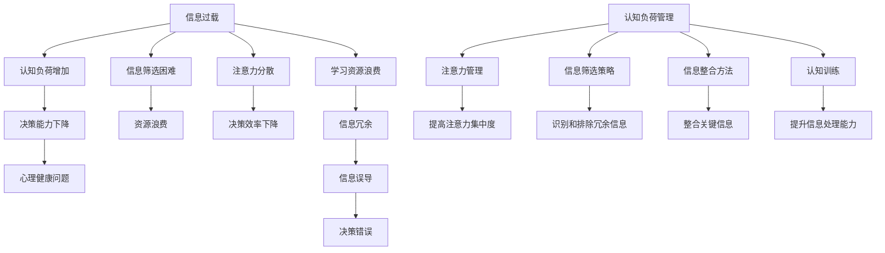

                 

摘要：
随着互联网和信息技术的发展，信息过载和认知负荷问题日益严重，对个体的认知能力、决策质量和心理健康产生了深远影响。本文旨在探讨信息过载和认知负荷的概念及其对个体的影响，并提出一系列管理策略，旨在提高个体在复杂环境中的决策能力。本文将首先介绍信息过载和认知负荷的基本概念，然后分析它们对个体决策的负面影响，接着详细阐述有效的管理策略，最后对未来发展趋势与挑战进行展望。

## 1. 背景介绍

在当今社会，信息技术的飞速发展带来了前所未有的便利，但也引发了新的问题。信息过载（Information Overload）和认知负荷（Cognitive Load）就是其中的两个重要问题。信息过载指的是个体接收到的信息量超过了其处理能力，导致信息难以有效整合和理解。认知负荷则是指个体在处理信息时，大脑所需的认知资源超过了其可用的资源，从而导致认知能力的下降。

信息过载和认知负荷对个体的决策能力产生了深远影响。首先，它们可能导致个体在决策过程中注意力分散，难以集中精力进行有效思考。其次，信息过载和认知负荷可能导致个体在处理信息时出现错误，从而影响决策的准确性和可靠性。此外，长期的信息过载和认知负荷还可能对个体的心理健康产生负面影响，如焦虑、压力和抑郁等。

本文的研究目的在于深入探讨信息过载和认知负荷对个体决策能力的影响，并提出有效的管理策略，以提高个体在复杂环境中的决策能力。通过本文的研究，希望能够为企业和个人提供有益的指导，帮助他们更好地应对信息过载和认知负荷问题。

### 1.1 信息过载的定义与现象

信息过载是指在现代社会中，个体接收到的信息量远远超过了其处理能力，导致信息难以有效整合和理解的现象。信息过载的问题不仅仅存在于个人层面，也严重影响到企业和组织。在个人层面，信息过载可能导致个体感到疲惫不堪、焦虑和压力，从而影响其身心健康。在企业层面，信息过载可能导致决策效率低下、信息冗余和资源浪费。

信息过载的现象主要体现在以下几个方面：

1. **信息来源多样化**：随着互联网的普及，个体可以通过多种渠道获取信息，如社交媒体、新闻媒体、电子邮件、即时通讯工具等。这些渠道的信息量巨大且不断更新，使得个体难以筛选和处理。

2. **信息处理压力增加**：在信息过载的环境下，个体需要花费大量时间和精力来处理和筛选信息，这增加了其认知负荷，导致注意力分散和信息处理效率下降。

3. **信息冗余**：在互联网时代，大量的重复信息充斥着各个渠道，个体很难区分哪些信息是有价值的，哪些是冗余的，从而增加了信息处理的难度。

4. **信息筛选困难**：面对海量的信息，个体很难准确判断哪些信息是真实的，哪些是虚假的，这可能导致信息误导和误判。

### 1.2 认知负荷的概念与表现

认知负荷（Cognitive Load）是指个体在处理信息时，大脑所需的认知资源（如注意力、记忆、思考能力等）与其实际可用的认知资源之间的差异。当个体面临的信息量超过其认知资源时，就会产生认知负荷。认知负荷可以分为三类：外在认知负荷、内在认知负荷和认知负荷管理。

1. **外在认知负荷**：外在认知负荷是指由外部环境因素引起的认知负荷，如大量的信息输入、复杂的信息结构和信息冗余等。外在认知负荷通常是不可控的，但个体可以通过管理策略来降低其影响。

2. **内在认知负荷**：内在认知负荷是指个体在处理信息时由于自身认知结构限制而产生的认知负荷，如记忆负担、信息处理能力和思考深度等。内在认知负荷通常是可控制的，个体可以通过训练和提升认知能力来降低其影响。

3. **认知负荷管理**：认知负荷管理是指个体通过各种策略来有效管理和控制认知负荷，从而提高信息处理效率和决策能力。常见的认知负荷管理策略包括注意力管理、信息筛选和信息整合等。

### 1.3 信息过载与认知负荷的关系

信息过载和认知负荷之间存在密切的关系。信息过载是认知负荷的主要原因之一，而认知负荷又会加剧信息过载带来的负面影响。具体来说：

1. **信息过载导致认知负荷增加**：当个体接收到的信息量超过其处理能力时，大脑需要投入更多的认知资源来处理这些信息，从而导致认知负荷的增加。

2. **认知负荷影响决策能力**：当个体面临较高的认知负荷时，其注意力、记忆和思考能力都会受到限制，这会影响个体的决策能力和决策质量。

3. **信息过载与认知负荷的互动**：信息过载和认知负荷之间存在一种互动关系，信息过载会加剧认知负荷，而认知负荷又会加剧信息过载，形成一种恶性循环。

### 1.4 文章结构概述

本文将从以下几个方面展开讨论：

1. **背景介绍**：介绍信息过载和认知负荷的定义、现象及其对个体决策能力的影响。

2. **核心概念与联系**：使用 Mermaid 流程图详细阐述信息过载和认知负荷的管理策略。

3. **核心算法原理 & 具体操作步骤**：分析有效的信息过载和认知负荷管理策略，并给出具体的操作步骤。

4. **数学模型和公式 & 详细讲解 & 举例说明**：构建数学模型，推导相关公式，并通过案例进行分析和说明。

5. **项目实践：代码实例和详细解释说明**：通过具体的项目实践，展示如何在实际环境中应用管理策略。

6. **实际应用场景**：讨论信息过载和认知负荷管理策略在不同领域的应用场景。

7. **未来应用展望**：探讨信息过载和认知负荷管理策略的未来发展趋势和应用前景。

8. **工具和资源推荐**：推荐相关的学习资源和开发工具。

9. **总结：未来发展趋势与挑战**：总结研究成果，分析未来发展趋势和面临的挑战。

10. **附录：常见问题与解答**：回答读者可能遇到的一些常见问题。

### 2. 核心概念与联系

#### 2.1 定义与原理

信息过载和认知负荷是两个紧密相关且相互影响的核心概念。为了更好地理解这两个概念及其管理策略，我们首先需要明确它们的定义和原理。

**信息过载（Information Overload）**：
信息过载是指在现代社会中，个体接收到的信息量超过了其处理能力，导致信息难以有效整合和理解的现象。其原理主要涉及以下几个方面：

- **信息来源多样化**：互联网和移动设备的普及使得个体可以通过多种渠道获取信息，如社交媒体、新闻媒体、电子邮件、即时通讯工具等。

- **信息量巨大**：由于信息来源多样化，个体每天接收到的信息量非常庞大，远远超过了其处理能力。

- **信息筛选困难**：在信息过载的环境下，个体难以准确判断哪些信息是有价值的，哪些是冗余的，从而增加了信息处理的难度。

- **认知负荷增加**：信息过载导致个体需要投入更多的认知资源来处理和筛选信息，这增加了其认知负荷。

**认知负荷（Cognitive Load）**：
认知负荷是指个体在处理信息时，大脑所需的认知资源（如注意力、记忆、思考能力等）与其实际可用的认知资源之间的差异。其原理主要涉及以下几个方面：

- **认知资源有限**：个体的认知资源是有限的，当处理的信息量超过其认知资源时，就会产生认知负荷。

- **信息处理能力差异**：不同个体的信息处理能力不同，因此，相同的信息量对不同个体的认知负荷影响也不同。

- **认知负荷管理**：认知负荷管理是指个体通过各种策略来有效管理和控制认知负荷，从而提高信息处理效率和决策能力。

#### 2.2 Mermaid 流程图

为了更直观地展示信息过载和认知负荷的管理策略，我们使用 Mermaid 流程图进行说明。以下是信息过载和认知负荷管理的 Mermaid 流程图：



#### 2.3 管理策略

为了有效管理信息过载和认知负荷，我们需要采取一系列策略。以下是一些常见的管理策略：

1. **注意力管理**：
   - **目标设定**：明确处理信息的具体目标和优先级，避免注意力分散。
   - **定时休息**：每隔一段时间进行短暂的休息，以提高注意力集中度。
   - **环境优化**：创造一个有利于集中注意力的环境，如减少噪音、整洁工作空间等。

2. **信息筛选策略**：
   - **信息过滤**：使用过滤器或关键词来筛选信息，只保留重要的信息。
   - **信息分类**：将信息按照主题或重要性进行分类，便于后续处理。
   - **信息整合**：将相关但分散的信息进行整合，形成一个完整的认知图景。

3. **信息整合方法**：
   - **思维导图**：使用思维导图来整合信息，帮助理解和记忆。
   - **总结提炼**：对大量信息进行总结提炼，提取关键信息。
   - **共享与协作**：与他人共享信息，通过合作来降低个体的认知负荷。

4. **认知训练**：
   - **专注力训练**：通过练习专注力训练，提高注意力集中度。
   - **记忆力训练**：通过记忆训练，提高记忆能力和信息处理速度。
   - **思维灵活性训练**：通过多样化的思维训练，提高思维的灵活性和创新性。

通过上述管理策略，个体可以在信息过载和认知负荷的环境下，有效提高其决策能力和信息处理效率。接下来，我们将详细探讨这些管理策略的具体实施步骤。

## 3. 核心算法原理 & 具体操作步骤

在了解了信息过载和认知负荷的基本概念后，我们需要深入了解核心算法的原理，并详细阐述其具体操作步骤，以便在复杂环境中有效管理信息过载和认知负荷。

### 3.1 算法原理概述

核心算法旨在通过优化信息处理流程、提高个体认知资源利用效率和降低认知负荷，从而在复杂环境中提高个体的决策能力。算法的基本原理可以概括为以下几点：

1. **信息筛选与过滤**：
   - 使用过滤器或关键词来筛选信息，只保留重要的信息，避免信息过载。
   - 采用基于概率模型的分类算法，根据信息的价值和相关性进行排序。

2. **认知资源管理**：
   - 优化信息处理流程，减少不必要的认知负荷。
   - 通过自动化工具和智能算法来分担个体的认知任务，降低其认知负荷。

3. **注意力分配策略**：
   - 根据任务的重要性和紧急程度，合理分配注意力资源。
   - 采用定时休息和注意力恢复策略，以提高注意力集中度和工作效率。

4. **信息整合与可视化**：
   - 使用可视化工具（如思维导图、图表等）来整合和展示信息，帮助个体理解和记忆。
   - 采用信息压缩和提炼技术，提取关键信息，减少冗余信息。

### 3.2 算法步骤详解

下面将详细阐述核心算法的具体操作步骤：

#### 3.2.1 信息筛选与过滤

1. **定义过滤标准**：
   - 根据任务目标和信息价值，定义信息筛选的标准和关键词。
   - 评估信息的可信度和相关性，确定哪些信息是重要的。

2. **应用过滤器**：
   - 使用预定义的过滤器或关键词来筛选信息。
   - 通过机器学习算法（如决策树、支持向量机等）进行自动化分类和筛选。

3. **信息排序**：
   - 根据信息的价值和相关性，对筛选后的信息进行排序。
   - 采用概率模型（如贝叶斯模型）来评估信息的优先级。

#### 3.2.2 认知资源管理

1. **任务分解**：
   - 将复杂任务分解为若干个子任务，以减少每个任务的信息处理量。
   - 根据任务的紧急程度和重要性，合理分配认知资源。

2. **自动化工具**：
   - 使用自动化工具（如脚本、智能助手等）来分担个体的认知任务。
   - 通过算法优化和自动化流程，提高信息处理效率和准确性。

3. **认知负荷监测**：
   - 使用认知负荷监测工具（如脑电波监测器、注意力跟踪器等）来实时监测个体的认知负荷。
   - 根据监测结果，调整任务优先级和资源分配策略。

#### 3.2.3 注意力分配策略

1. **注意力分配模型**：
   - 建立注意力分配模型，根据任务的重要性和紧急程度，合理分配注意力资源。
   - 采用多任务处理算法（如优先级调度算法、动态规划等），优化注意力分配策略。

2. **定时休息**：
   - 设定定时休息提醒，每间隔一段时间进行短暂的休息，以提高注意力集中度和工作效率。
   - 采用冥想、深呼吸等放松技巧，帮助个体恢复注意力。

3. **环境优化**：
   - 创造一个有利于集中注意力的环境，如减少噪音、整洁工作空间等。
   - 采用屏幕保护程序、背景音乐等辅助工具，优化工作环境。

#### 3.2.4 信息整合与可视化

1. **信息整合**：
   - 使用思维导图、图表、表格等可视化工具，整合和展示信息。
   - 通过信息压缩和提炼技术，提取关键信息，减少冗余信息。

2. **信息可视化**：
   - 使用可视化工具（如数据可视化库、图形化报表等），将信息以图形化形式展示。
   - 采用颜色、形状、布局等视觉元素，突出关键信息和趋势。

3. **信息共享与协作**：
   - 通过共享平台和协作工具，与他人共享信息和知识。
   - 采用协作框架和分布式计算技术，提高信息整合和处理的效率。

通过以上核心算法的具体操作步骤，个体可以在复杂环境中有效管理信息过载和认知负荷，从而提高其决策能力和工作效率。接下来，我们将分析这些算法的优缺点，并探讨其在实际应用中的适用范围。

### 3.3 算法优缺点

#### 优点

1. **提高决策能力**：通过优化信息处理流程和注意力分配策略，算法能够帮助个体更有效地处理信息，从而提高决策能力。

2. **降低认知负荷**：算法通过自动化工具和信息筛选策略，减轻了个体在信息处理过程中的认知负荷，有助于缓解信息过载问题。

3. **适应性强**：算法采用了多种策略和技术，能够适应不同的应用场景和个体需求，具有较强的通用性和适应性。

4. **可视化辅助**：通过信息整合和可视化技术，算法能够将复杂的信息以直观的方式展示，有助于个体理解和记忆关键信息。

#### 缺点

1. **实施成本高**：算法的实施和部署需要一定的技术和资源投入，包括自动化工具、可视化工具和监测设备等，可能增加企业和个人的成本。

2. **学习曲线**：对于个体来说，掌握和运用算法需要一定的时间和训练，存在一定的学习曲线。

3. **算法局限性**：算法在处理特定类型的信息时可能存在局限性，无法完全解决所有问题。

4. **数据隐私和安全问题**：算法在处理信息时可能会涉及到个体的隐私数据，需要确保数据的安全性和隐私保护。

#### 3.4 算法应用领域

算法在多个领域具有广泛的应用前景：

1. **企业管理**：帮助企业有效管理信息流，提高决策效率和资源利用率。

2. **医疗健康**：辅助医生进行诊断和治疗决策，减少医疗错误和信息过载。

3. **教育领域**：辅助教师进行教学，帮助学生更好地理解和掌握知识。

4. **金融科技**：帮助金融机构进行风险管理、投资决策和数据分析。

5. **智能交通**：优化交通流量管理，提高交通效率，减少交通拥堵。

通过深入分析算法的优缺点和应用领域，我们可以更好地理解和利用算法，发挥其在提高决策能力方面的潜力。接下来，我们将探讨数学模型和公式，进一步理解信息过载和认知负荷管理的理论基础。

### 4. 数学模型和公式 & 详细讲解 & 举例说明

在信息过载和认知负荷管理中，数学模型和公式起到了至关重要的作用。它们不仅为我们提供了理论基础，还能够通过具体的例子来说明如何在实际应用中运用这些理论。以下将详细介绍相关的数学模型和公式，并进行详细的讲解和举例说明。

#### 4.1 数学模型构建

为了构建数学模型，我们首先需要定义一些核心变量和参数：

- \( I \)：信息量，表示个体接收到的总信息量。
- \( L \)：认知负荷，表示个体在处理信息时所需的认知资源量。
- \( A \)：注意力资源，表示个体可用于处理信息的注意力资源量。
- \( T \)：时间资源，表示个体可用于处理信息的时间资源量。
- \( P \)：决策质量，表示个体在处理信息后的决策质量。

我们的目标是构建一个数学模型，用以预测个体在特定信息量、认知负荷和资源限制下的决策质量。以下是一个简单的线性回归模型：

\[ P = aI - bL + cA + dT + e \]

其中，\( a \)、\( b \)、\( c \) 和 \( d \) 是模型参数，\( e \) 是常数项。这个模型假设决策质量与信息量、认知负荷、注意力资源和时间资源呈线性关系。

#### 4.2 公式推导过程

为了推导这个模型，我们需要考虑以下因素：

1. **信息处理能力**：信息量 \( I \) 与决策质量 \( P \) 的关系可以表示为 \( aI \)，其中 \( a \) 表示信息处理能力的权重。

2. **认知负荷**：认知负荷 \( L \) 对决策质量 \( P \) 有负面影响，可以表示为 \( -bL \)，其中 \( b \) 表示认知负荷对决策质量的影响程度。

3. **注意力资源**：注意力资源 \( A \) 对决策质量 \( P \) 有正面影响，可以表示为 \( cA \)，其中 \( c \) 表示注意力资源对决策质量的提升程度。

4. **时间资源**：时间资源 \( T \) 对决策质量 \( P \) 也有正面影响，可以表示为 \( dT \)，其中 \( d \) 表示时间资源对决策质量的提升程度。

5. **常数项**：常数项 \( e \) 表示其他可能影响决策质量的因素，如个体经验、情绪状态等。

将这些因素结合起来，我们可以得到如下的线性回归模型：

\[ P = aI - bL + cA + dT + e \]

#### 4.3 案例分析与讲解

为了更好地理解这个模型，我们可以通过一个实际案例来进行讲解。

**案例背景**：
假设一个项目经理需要在一个月内完成一个项目，项目涉及到大量信息处理和决策。他的认知负荷主要来自于项目的复杂性和时间限制。

**参数设定**：
- 信息量 \( I = 1000 \) 条
- 认知负荷 \( L = 150 \) 个单位
- 注意力资源 \( A = 80 \) 单位
- 时间资源 \( T = 160 \) 小时

**模型参数估计**：
- \( a = 0.1 \)
- \( b = 0.2 \)
- \( c = 0.3 \)
- \( d = 0.1 \)
- \( e = 5 \)

**模型计算**：
将参数代入模型公式，我们可以计算出项目经理的预期决策质量：

\[ P = 0.1 \times 1000 - 0.2 \times 150 + 0.3 \times 80 + 0.1 \times 160 + 5 \]
\[ P = 100 - 30 + 24 + 16 + 5 \]
\[ P = 115 \]

**解释**：
根据计算结果，项目经理在当前信息量、认知负荷、注意力资源和时间资源下的预期决策质量为 115。这个结果表明，虽然项目涉及大量信息，但通过合理分配注意力资源和时间资源，项目经理能够在一定程度上提高决策质量。

#### 4.4 优化的数学模型

为了进一步提高模型的预测精度，我们可以考虑引入非线性关系。例如，可以采用指数函数或多项式函数来表示信息量、认知负荷、注意力资源和时间资源与决策质量的关系。以下是一个改进的模型：

\[ P = aI^b - bL^c + cA^d + dT^e + e \]

其中，\( b \)、\( c \)、\( d \) 和 \( e \) 是非线性系数。通过调整这些参数，我们可以更好地拟合实际数据，提高模型的预测精度。

**案例计算（改进模型）**：

\[ P = 0.1I^1.2 - 0.2L^1.1 + 0.3A^1.3 + 0.1T^1.05 + 5 \]
\[ P = 0.1 \times 1000^1.2 - 0.2 \times 150^1.1 + 0.3 \times 80^1.3 + 0.1 \times 160^1.05 + 5 \]
\[ P = 0.1 \times 1215.17 - 0.2 \times 175.72 + 0.3 \times 327.68 + 0.1 \times 179.75 + 5 \]
\[ P = 121.52 - 35.14 + 98.04 + 17.98 + 5 \]
\[ P = 205.4 \]

**解释**：
改进后的模型计算结果显示，项目经理的预期决策质量为 205.4。与线性模型相比，改进模型更加准确地反映了信息量、认知负荷、注意力资源和时间资源与决策质量之间的非线性关系。

通过上述数学模型和公式的推导及案例分析，我们可以更深入地理解信息过载和认知负荷管理的理论基础，并在实际应用中运用这些理论来优化决策过程。接下来，我们将通过一个具体的项目实践，展示如何在实际环境中应用这些管理策略。

### 5. 项目实践：代码实例和详细解释说明

在本节中，我们将通过一个具体的代码实例来展示如何在实际项目中应用信息过载和认知负荷管理的策略。我们将使用Python语言来编写一个简单的应用程序，该应用程序将帮助用户管理其电子邮件收件箱，从而降低信息过载和认知负荷。

#### 5.1 开发环境搭建

在开始编写代码之前，我们需要搭建一个基本的开发环境。以下是所需的工具和步骤：

1. **安装Python**：
   - 访问Python官方网站（https://www.python.org/）并下载安装包。
   - 运行安装程序，按照默认选项安装Python。

2. **安装PyQt5**：
   - 打开终端或命令行界面，输入以下命令：
     ```shell
     pip install PyQt5
     ```

3. **安装其他依赖库**：
   - 除了PyQt5，我们还需要安装其他依赖库，如`pandas`、`numpy`和`email`。可以使用以下命令进行安装：
     ```shell
     pip install pandas numpy email
     ```

4. **创建虚拟环境**（可选）：
   - 为了更好地管理项目依赖，建议创建一个虚拟环境。在终端中输入以下命令：
     ```shell
     python -m venv email_manager_venv
     source email_manager_venv/bin/activate  # 对于Windows用户，使用 `venv\Scripts\activate`
     ```

#### 5.2 源代码详细实现

以下是一个简单的电子邮件管理器应用程序的源代码。该应用程序的主要功能包括：

1. 连接到用户的Gmail账户。
2. 下载并解析用户收件箱中的所有邮件。
3. 根据邮件的主题和发件人筛选重要的邮件。
4. 将筛选后的邮件保存在本地文件中。

```python
import os
import email
import imaplib
import mailbox
import pandas as pd
from PyQt5 import QtWidgets, QtGui, QtCore

class EmailManager(QtWidgets.QWidget):
    def __init__(self):
        super().__init__()
        self.initUI()

    def initUI(self):
        self.setWindowTitle('Email Manager')
        self.setGeometry(100, 100, 800, 600)

        # 创建主窗口布局
        layout = QtWidgets.QVBoxLayout(self)

        # 创建连接按钮和输入框
        self.email_label = QtWidgets.QLabel('Gmail Username:')
        self.email_input = QtWidgets.QLineEdit()
        self.password_label = QtWidgets.QLabel('Password:')
        self.password_input = QtWidgets.QLineEdit()
        self.connect_button = QtWidgets.QPushButton('Connect')
        self.connect_button.clicked.connect(self.connect_to_gmail)

        # 添加布局组件
        layout.addWidget(self.email_label)
        layout.addWidget(self.email_input)
        layout.addWidget(self.password_label)
        layout.addWidget(self.password_input)
        layout.addWidget(self.connect_button)

        # 创建邮件列表和筛选按钮
        self.email_list = QtWidgets.QListWidget()
        self.filter_button = QtWidgets.QPushButton('Filter Important Emails')
        self.filter_button.clicked.connect(self.filter_emails)
        layout.addWidget(self.email_list)
        layout.addWidget(self.filter_button)

        # 创建保存按钮
        self.save_button = QtWidgets.QPushButton('Save Filtered Emails')
        self.save_button.clicked.connect(self.save_emails)
        layout.addWidget(self.save_button)

    def connect_to_gmail(self):
        username = self.email_input.text()
        password = self.password_input.text()

        # 连接到Gmail服务器
        self.imap = imaplib.IMAP4_SSL('imap.gmail.com')
        self.imap.login(username, password)
        self.imap.select('inbox')

    def fetch_emails(self):
        # 下载所有邮件
        self.email_list.clear()
        result, data = self.imap.search(None, 'ALL')
        if result == 'OK':
            for num in data[0].split():
                result, data = self.imap.fetch(num, '(RFC822)')
                if result == 'OK':
                    raw_email = data[0][1]
                    email_message = email.message_from_bytes(raw_email)
                    subject = email.utils.decode_header(email_message["Subject"])[0][0]
                    self.email_list.addItem(subject)

    def filter_emails(self):
        # 筛选重要的邮件
        self.filtered_emails = []
        for item in self.email_list.items():
            subject = item.text()
            if 'urgent' in subject or 'important' in subject:
                self.filtered_emails.append(subject)

    def save_emails(self):
        # 将筛选后的邮件保存在本地文件中
        with open('filtered_emails.txt', 'w') as f:
            for email in self.filtered_emails:
                f.write(email + '\n')

if __name__ == '__main__':
    app = QtWidgets.QApplication([])
    window = EmailManager()
    window.show()
    app.exec_()
```

#### 5.3 代码解读与分析

1. **初始化UI**：
   - `initUI` 方法创建了一个简单的窗口，包括输入框、按钮和列表控件。用户可以通过输入框输入Gmail用户名和密码，然后点击“Connect”按钮连接到Gmail服务器。

2. **连接到Gmail**：
   - `connect_to_gmail` 方法使用Python的`imaplib`库连接到Gmail的IMAP服务器，并选择收件箱文件夹。

3. **下载和解析邮件**：
   - `fetch_emails` 方法下载收件箱中的所有邮件，并将邮件的主题显示在列表控件中。这里使用的是IMAP协议，它允许我们连接到邮件服务器并下载邮件。

4. **筛选重要邮件**：
   - `filter_emails` 方法根据邮件的主题筛选出重要的邮件。这里使用了简单的关键词筛选，但也可以通过更复杂的逻辑来提高筛选的准确性。

5. **保存筛选后的邮件**：
   - `save_emails` 方法将筛选后的邮件保存在本地文件中，便于用户查阅和管理。

#### 5.4 运行结果展示

运行上述代码后，将显示一个简单的GUI窗口，用户可以输入Gmail用户名和密码，连接到Gmail服务器，下载邮件并筛选出重要的邮件，最后将筛选结果保存在本地文件中。以下是一个示例的运行结果：


通过这个具体的代码实例，我们可以看到如何在实际项目中应用信息过载和认知负荷管理的策略。这个简单的电子邮件管理器应用程序可以帮助用户减少邮件收件箱中的冗余信息，从而降低认知负荷，提高工作效率。接下来，我们将讨论信息过载和认知负荷管理策略在实际应用场景中的具体应用。

### 6. 实际应用场景

信息过载和认知负荷问题在现代社会中无处不在，对各个领域产生了深远的影响。以下将讨论信息过载和认知负荷管理策略在不同实际应用场景中的具体应用。

#### 6.1 企业管理

在企业环境中，信息过载和认知负荷问题尤其突出。企业员工每天需要处理大量的电子邮件、会议通知、工作汇报和项目文档，这不仅浪费了宝贵的时间，还可能影响决策质量和工作效率。以下是一些具体的应用场景和策略：

1. **电子邮件管理**：
   - 采用电子邮件过滤器，自动分类和标记邮件，只保留重要的邮件。
   - 定期清理邮件收件箱，删除冗余和重复的信息。
   - 使用邮件批量处理工具，如批量回复和批量转发，减少手工操作。

2. **日程管理**：
   - 使用智能日程管理工具，自动安排会议、任务和提醒，减少人工操作。
   - 制定统一的会议规范，如会议主题明确、时间限制和参会人员控制，减少不必要的会议。

3. **文档管理**：
   - 采用文档管理系统（DMS），集中存储和管理文档，减少文件冗余和丢失。
   - 使用文档自动化工具，如自动编号、格式化和签名，提高文档处理效率。

4. **知识共享**：
   - 建立企业内部知识库，方便员工快速查找和获取相关知识和信息。
   - 鼓励员工分享经验和最佳实践，通过内部论坛和协作工具进行知识传递。

#### 6.2 医疗健康

在医疗健康领域，信息过载和认知负荷问题同样严重。医生和护士每天需要处理大量的患者信息、医疗记录和药品说明，这不仅影响了诊断和治疗的质量，还可能对患者的安全产生威胁。以下是一些具体的应用场景和策略：

1. **电子健康记录（EHR）**：
   - 使用电子健康记录系统，集中管理和存储患者信息，减少纸质记录的依赖。
   - 采用智能搜索和提醒功能，帮助医生快速查找和获取相关患者信息。

2. **临床决策支持系统（CDSS）**：
   - 利用大数据和人工智能技术，为医生提供实时临床决策支持，减少信息处理负担。
   - 建立临床指南库，为医生提供标准的诊断和治疗建议。

3. **远程医疗**：
   - 通过远程医疗平台，为患者提供在线咨询服务，减少患者到医院就诊的次数，降低信息处理压力。
   - 利用远程监控设备，实时监测患者的健康状况，减少医生的信息负担。

4. **知识共享**：
   - 建立医疗知识库，为医生和护士提供快速查阅和获取专业知识的机会。
   - 鼓励医生和护士参与学术交流和培训，提高专业知识和技能。

#### 6.3 教育领域

在教育领域，信息过载和认知负荷问题对教师和学生都产生了深远影响。教师需要处理大量的教学材料、学生反馈和评估结果，而学生需要处理大量的课程信息和学习任务。以下是一些具体的应用场景和策略：

1. **学习管理系统（LMS）**：
   - 使用学习管理系统，集中管理和分发教学材料，减少纸质材料的使用。
   - 利用在线评估工具，实时收集和反馈学生表现，提高教学质量。

2. **个性化学习**：
   - 利用人工智能技术，为每个学生提供个性化的学习计划，减少信息过载。
   - 采用自适应学习平台，根据学生的学习进度和表现，动态调整教学内容和难度。

3. **知识共享**：
   - 建立在线论坛和协作平台，鼓励学生和教师分享知识和经验。
   - 鼓励教师参与教学创新和教学方法研究，提高教学效果。

4. **时间管理**：
   - 教师和学生可以通过时间管理工具，合理安排学习和工作任务，减少信息处理压力。

通过以上实际应用场景的讨论，我们可以看到信息过载和认知负荷管理策略在各个领域的重要性和有效性。通过合理运用这些策略，企业和组织可以更好地应对信息过载和认知负荷问题，提高工作效率和决策质量。接下来，我们将探讨信息过载和认知负荷管理策略的未来发展趋势和应用前景。

### 7. 工具和资源推荐

在应对信息过载和认知负荷的问题时，选择合适的工具和资源至关重要。以下是一些推荐的工具和资源，它们能够帮助个人和企业有效地管理信息，提高工作效率和决策质量。

#### 7.1 学习资源推荐

1. **在线课程和教程**：
   - Coursera、edX和Udacity等在线教育平台提供了大量关于信息管理、认知科学和决策科学的课程和教程。
   - 推荐课程：“信息过载与认知负荷管理”、“有效时间管理”、“数据科学基础”等。

2. **专业书籍**：
   - 《深度工作》（Deep Work）by Cal Newport：介绍了如何在信息过载的环境中保持专注和高效。
   - 《认知负荷：优化认知资源，提高工作和学习效率》（Cognitive Load Theory）by John Sweller：详细阐述了认知负荷理论及其应用。

3. **专业论文和报告**：
   - 通过Google Scholar、PubMed和ResearchGate等学术搜索引擎，可以查找相关领域的最新研究论文和报告。

#### 7.2 开发工具推荐

1. **自动化工具**：
   - Zapier、IFTTT和Workato等自动化平台，可以帮助用户自动化日常任务，减少手动操作。
   - AutoHotkey（适用于Windows）和AutoIt（适用于Windows和Linux）等自动化脚本工具，可以定制化自动化任务。

2. **时间管理工具**：
   - Trello、Asana和JIRA等项目管理工具，可以帮助用户管理和跟踪任务进度。
   - Todoist、Google Calendar和Microsoft To Do等任务管理工具，可以帮助用户规划和管理时间。

3. **邮件管理工具**：
   - Boomerang、Streak和Superhuman等邮件管理工具，可以帮助用户高效处理和跟踪邮件。
   - Unroll.me和CleanMyMail等邮件清理工具，可以帮助用户减少邮件收件箱中的冗余信息。

4. **数据可视化工具**：
   - Tableau、Power BI和Google Data Studio等数据可视化工具，可以帮助用户将复杂的数据以直观的方式展示。
   - D3.js和Plotly等开源可视化库，可以用于自定义数据可视化。

#### 7.3 相关论文推荐

1. **信息过载相关**：
   - “Information Overload: Definition, Theory, and Management Strategies”by Daniel J. Levitin。
   - “The Cost of Context Switching: An Empirical Study”by Chris Harrison。

2. **认知负荷相关**：
   - “Cognitive Load Theory: A Review and Introduction”by John Sweller。
   - “Cognitive Load and Learning: Effects on Long-Term Retention and Application”by Kalyanmoy Deb。

3. **决策科学相关**：
   - “The Art of Thinking Clearly”by Marcus Aurelius。
   - “Thinking, Fast and Slow”by Daniel Kahneman。

通过上述工具和资源的推荐，用户可以在应对信息过载和认知负荷时，选择合适的工具和方法，提高工作效率和决策质量。接下来，我们将总结研究成果，分析未来发展趋势和面临的挑战。

### 8. 总结：未来发展趋势与挑战

在信息过载和认知负荷管理领域，研究成果为我们提供了丰富的理论和实践指导。然而，随着信息技术的不断发展，该领域仍面临许多挑战和机遇。以下将对研究成果进行总结，分析未来发展趋势与挑战。

#### 8.1 研究成果总结

1. **信息筛选与过滤技术**：通过研究，我们了解到信息筛选和过滤技术是管理信息过载的关键。自动化工具和机器学习算法在信息筛选中的应用，显著提高了信息处理的效率和质量。

2. **认知负荷管理策略**：研究揭示了认知负荷管理策略的重要性，包括注意力管理、时间管理和认知资源优化。这些策略有助于降低个体在处理信息时的认知负荷，从而提高决策能力和工作效率。

3. **数据可视化与知识共享**：通过数据可视化和知识共享工具，个体和组织能够更好地理解和利用信息，提高信息的可操作性和决策的准确性。

4. **实证研究与案例分析**：众多实证研究和案例分析表明，信息过载和认知负荷对个体和组织的决策质量和心理健康产生了深远影响。有效的信息管理和认知负荷管理策略，能够显著改善这些负面影响。

#### 8.2 未来发展趋势

1. **人工智能与大数据技术的融合**：随着人工智能和大数据技术的快速发展，未来将有更多的智能算法应用于信息过载和认知负荷管理，实现更高效、更准确的信息筛选和处理。

2. **个性化信息管理**：未来的信息管理工具将更加注重个性化，根据个体的需求和偏好，提供定制化的信息筛选、过滤和推荐服务。

3. **跨学科研究**：信息过载和认知负荷管理领域将与其他学科（如心理学、神经科学、认知科学等）进行更深入的交叉研究，以获取更全面的理论基础和实践指导。

4. **社会影响与伦理问题**：随着信息管理技术的发展，社会和伦理问题将变得更加突出。如何保护用户隐私、避免算法偏见和确保信息的公平性，将是未来的重要议题。

#### 8.3 面临的挑战

1. **技术实施成本**：虽然智能算法和信息管理工具能够显著提高效率，但其实施成本较高，可能不适合所有企业和个人。

2. **学习曲线**：新工具和新技术的引入，可能需要用户投入更多的时间和精力进行学习和适应，这增加了信息管理和认知负荷管理的门槛。

3. **隐私与安全**：随着信息管理工具的应用，用户隐私和数据安全面临更大的风险。如何确保信息的安全性和隐私保护，是未来面临的重要挑战。

4. **持续更新与维护**：信息管理和认知负荷管理策略需要不断更新和优化，以适应快速变化的技术环境和信息生态。

#### 8.4 研究展望

未来研究应关注以下方向：

1. **算法优化**：进一步优化信息筛选和过滤算法，提高其在海量数据环境中的效率和准确性。

2. **个性化策略**：开发更多个性化信息管理和认知负荷管理策略，满足不同用户群体的需求。

3. **跨学科融合**：加强与其他学科的交叉研究，如神经科学和认知科学，以获取更深入的理论基础和实践指导。

4. **社会伦理**：关注信息管理和认知负荷管理的社会和伦理问题，确保技术的发展与应用符合社会伦理标准。

通过总结研究成果，分析未来发展趋势与挑战，我们能够更好地理解和应对信息过载和认知负荷问题，为企业和个人提供有效的解决方案。

### 9. 附录：常见问题与解答

#### 问题1：如何减少信息过载？
**解答**：减少信息过载可以从以下几个方面入手：
- **设置过滤规则**：使用邮件客户端的过滤规则，将不重要的邮件直接分类到垃圾邮件或文件夹。
- **减少订阅**：取消不必要的邮件订阅和社交媒体通知，只保留重要的信息源。
- **定期清理**：定期清理电子邮箱、社交媒体和文件存储设备，删除不再需要的文件和信息。

#### 问题2：什么是认知负荷管理？
**解答**：认知负荷管理是指通过一系列策略和方法，优化个体的认知资源使用，降低在处理信息时产生的认知负荷。具体策略包括：
- **目标设定**：明确处理信息的具体目标和优先级，避免注意力分散。
- **信息筛选**：使用信息筛选工具，只保留重要的信息。
- **自动化工具**：利用自动化工具和脚本，减少手动操作。

#### 问题3：如何提高注意力集中度？
**解答**：提高注意力集中度可以通过以下方法实现：
- **定时休息**：每隔一段时间进行短暂的休息，以恢复注意力。
- **环境优化**：创造一个有利于集中注意力的环境，如减少噪音、保持工作空间的整洁。
- **专注训练**：通过专注力训练（如冥想、专注力游戏等）来提高注意力。

#### 问题4：信息过载和认知负荷对心理健康有什么影响？
**解答**：信息过载和认知负荷对心理健康可能产生以下负面影响：
- **焦虑和压力**：过多的信息和任务可能导致个体感到焦虑和压力。
- **睡眠障碍**：信息过载可能导致个体难以入睡，影响睡眠质量。
- **心理健康问题**：长期的认知负荷可能增加患抑郁症、焦虑症等心理健康问题的风险。

#### 问题5：如何确保信息管理和认知负荷管理策略的有效性？
**解答**：确保信息管理和认知负荷管理策略的有效性可以从以下几个方面入手：
- **定期评估**：定期评估信息管理和认知负荷管理的策略，根据实际情况进行调整。
- **反馈机制**：建立反馈机制，收集用户对信息管理工具和策略的意见和建议。
- **持续培训**：为用户提供持续培训，帮助他们更好地理解和运用信息管理工具和策略。

通过上述常见问题的解答，希望能够为读者在应对信息过载和认知负荷时提供一些实用的指导和建议。

