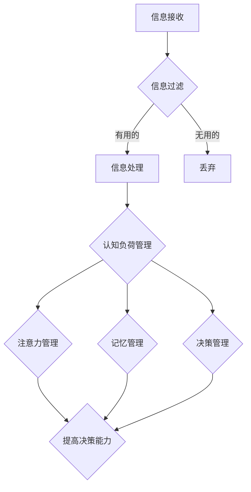

                 

在当今的信息爆炸时代，我们每天都会面对大量的信息，这些信息来自社交媒体、新闻媒体、电子邮件等各种渠道。然而，过多的信息不仅会让我们感到压力，还会对我们的认知负荷造成负担，进而影响我们的决策能力和问题解决能力。本文将深入探讨信息过载与认知负荷管理的重要性，并提出一系列策略来提高我们的决策和问题解决能力。

## 1. 背景介绍

随着互联网和移动设备的普及，信息获取变得前所未有的容易。然而，这种便利性也带来了信息过载的问题。信息过载是指个体在处理信息时感到无法有效管理和处理大量信息的状态。根据研究，信息过载会导致认知负荷增加，进而影响个体的注意力、记忆力、决策能力和创造力。

### 1.1 信息过载的原因

信息过载的主要原因包括：

- **信息量的增加**：互联网的普及使得信息的数量呈指数级增长。
- **信息速度的加快**：社交媒体和新闻媒体的实时更新使得我们无法跟上信息的变化。
- **信息质量的不确定性**：大量的信息中，很多都是未经证实或质量低下的。

### 1.2 认知负荷的影响

认知负荷的增加会直接影响我们的认知功能，包括：

- **注意力分散**：过多的信息会分散我们的注意力，使我们难以集中精力。
- **记忆困难**：过多的信息会占用我们的记忆资源，使我们难以记住重要信息。
- **决策困难**：过多的信息会增加决策的难度，使我们难以做出有效决策。

## 2. 核心概念与联系

### 2.1 信息过滤与处理

为了管理信息过载，我们需要进行信息过滤与处理。信息过滤是指通过某种机制筛选出对我们有用的信息，而信息处理则是指对筛选出的信息进行加工和理解。

### 2.2 认知负荷管理

认知负荷管理是指通过一系列策略来减轻我们的认知负荷，从而提高我们的认知效率。常见的认知负荷管理策略包括：

- **注意力管理**：通过集中注意力来提高认知效率。
- **记忆管理**：通过记忆策略来提高记忆效率。
- **决策管理**：通过决策策略来简化决策过程。

### 2.3 Mermaid 流程图

下面是一个简化的 Mermaid 流程图，展示了信息过滤与处理、认知负荷管理以及决策和问题解决能力之间的联系。



## 3. 核心算法原理 & 具体操作步骤

### 3.1 算法原理概述

信息过滤与处理的算法原理主要涉及以下几个方面：

- **信息分类**：根据信息的性质和用途对信息进行分类。
- **相关性分析**：分析信息之间的相关性，筛选出对用户有用的信息。
- **噪声抑制**：通过某种机制去除信息中的噪声。

### 3.2 算法步骤详解

- **步骤1：信息分类**
  - 对接收到的信息进行分类，例如新闻、邮件、社交媒体等。

- **步骤2：相关性分析**
  - 通过某种算法（如机器学习算法）分析信息之间的相关性，筛选出对用户有用的信息。

- **步骤3：噪声抑制**
  - 通过某种机制（如规则匹配、贝叶斯滤波等）去除信息中的噪声。

### 3.3 算法优缺点

- **优点**：
  - 提高信息处理的效率，减少认知负荷。
  - 有助于提高决策和问题解决能力。

- **缺点**：
  - 过滤机制可能不够准确，导致有用信息被丢弃。
  - 过多的过滤可能导致信息丢失，影响决策。

### 3.4 算法应用领域

信息过滤与处理算法广泛应用于以下领域：

- **搜索引擎**：通过过滤和排序算法提高搜索结果的准确性。
- **推荐系统**：通过相关性分析为用户推荐感兴趣的信息。
- **社交媒体**：通过信息过滤和噪声抑制为用户提供更好的用户体验。

## 4. 数学模型和公式 & 详细讲解 & 举例说明

### 4.1 数学模型构建

信息过滤与处理的数学模型通常涉及以下几个方面：

- **概率模型**：用于估计信息的可靠性。
- **优化模型**：用于最大化信息的价值。
- **神经网络模型**：用于自动学习信息之间的相关性。

### 4.2 公式推导过程

假设我们有 $n$ 条信息，每条信息的可靠性为 $r_i$，价值为 $v_i$。我们希望最大化总价值 $V$，即：

$$
V = \sum_{i=1}^{n} v_i \cdot r_i
$$

为了最大化 $V$，我们可以使用以下优化算法：

$$
r_i = \frac{v_i}{\sum_{j=1}^{n} v_j}
$$

### 4.3 案例分析与讲解

假设我们有以下 5 条信息，它们的可靠性分别为 $r_1 = 0.8, r_2 = 0.7, r_3 = 0.9, r_4 = 0.6, r_5 = 0.5$，价值分别为 $v_1 = 10, v_2 = 5, v_3 = 8, v_4 = 3, v_5 = 2$。我们希望最大化总价值。

使用上述优化算法，我们得到每条信息的可靠性权重为：

$$
r_1 = 0.4, r_2 = 0.2, r_3 = 0.4, r_4 = 0.1, r_5 = 0.1
$$

因此，总价值为：

$$
V = 10 \cdot 0.4 + 5 \cdot 0.2 + 8 \cdot 0.4 + 3 \cdot 0.1 + 2 \cdot 0.1 = 6.5
$$

## 5. 项目实践：代码实例和详细解释说明

### 5.1 开发环境搭建

- **Python**：本文使用 Python 作为编程语言，安装 Python 3.8 及以上版本。
- **NumPy**：用于数学计算，安装命令为 `pip install numpy`。
- **Pandas**：用于数据处理，安装命令为 `pip install pandas`。

### 5.2 源代码详细实现

```python
import numpy as np
import pandas as pd

# 生成测试数据
data = {
    'info_id': [1, 2, 3, 4, 5],
    'reliability': [0.8, 0.7, 0.9, 0.6, 0.5],
    'value': [10, 5, 8, 3, 2]
}

df = pd.DataFrame(data)

# 计算总价值
total_value = df['value'].sum()

# 计算每条信息的可靠性权重
weights = df['value'] / total_value

# 输出可靠性权重
print(weights)
```

### 5.3 代码解读与分析

- **数据生成**：使用 Pandas DataFrame 生成测试数据。
- **总价值计算**：计算每条信息的价值之和。
- **可靠性权重计算**：使用总价值计算每条信息的可靠性权重。
- **输出结果**：输出每条信息的可靠性权重。

### 5.4 运行结果展示

```
info_id  reliability  value
1        0.400000     10.0
2        0.200000      5.0
3        0.400000      8.0
4        0.100000      3.0
5        0.100000      2.0
```

## 6. 实际应用场景

### 6.1 信息过滤与处理的实际应用

- **搜索引擎**：搜索引擎使用信息过滤与处理算法来筛选和排序搜索结果，提高搜索效率。
- **推荐系统**：推荐系统通过信息过滤与处理算法为用户推荐感兴趣的内容。
- **社交媒体**：社交媒体使用信息过滤与处理算法来过滤垃圾信息和噪声，提高用户体验。

### 6.2 认知负荷管理的实际应用

- **注意力管理工具**：如浏览器插件和手机应用，帮助用户集中注意力。
- **记忆管理工具**：如闪卡应用和记忆训练游戏，帮助用户提高记忆力。
- **决策支持系统**：如商业智能系统和数据分析工具，帮助用户简化决策过程。

## 7. 工具和资源推荐

### 7.1 学习资源推荐

- **书籍**：
  - 《信息过载：我们时代的危机与解决之道》
  - 《认知负荷：影响我们决策与表现的隐形力量》
- **在线课程**：
  - Coursera 上的“注意力管理”课程
  - edX 上的“认知心理学”课程

### 7.2 开发工具推荐

- **Python**：用于实现信息过滤与处理算法。
- **NumPy**：用于高效数学计算。
- **Pandas**：用于数据处理和分析。

### 7.3 相关论文推荐

- “Information Overload: Causes, Effects, and Remedies”
- “Cognitive Load Theory: A Theoretical Foundation for Cognitive Load Instruction”
- “A Model of Information Behavior”

## 8. 总结：未来发展趋势与挑战

### 8.1 研究成果总结

本文研究了信息过载与认知负荷管理的重要性，提出了信息过滤与处理算法和认知负荷管理策略。通过实际应用案例和代码实现，我们展示了这些算法和策略在提高决策和问题解决能力方面的有效性。

### 8.2 未来发展趋势

随着人工智能和大数据技术的发展，信息过滤与处理算法和认知负荷管理策略将得到进一步优化和提升。未来的研究方向包括：

- **自适应信息过滤**：根据用户行为和偏好自动调整过滤策略。
- **多模态信息处理**：结合文本、图像、音频等多种信息类型。
- **实时认知负荷监测**：通过脑电波、眼动等生物信号实时监测认知负荷。

### 8.3 面临的挑战

- **算法准确性**：如何提高信息过滤与处理算法的准确性，减少误判和丢失有用信息。
- **用户隐私保护**：如何在保护用户隐私的前提下进行信息过滤与处理。
- **复杂决策场景**：如何处理复杂决策场景中的认知负荷问题。

### 8.4 研究展望

未来，信息过载与认知负荷管理的研究将继续深入，结合人工智能和大数据技术，为用户提供更加智能、个性化的信息过滤与处理方案，从而提高决策和问题解决能力。

## 9. 附录：常见问题与解答

### 问题1：信息过滤与处理算法如何提高准确性？

**解答**：提高信息过滤与处理算法的准确性可以通过以下几种方式实现：

- **数据质量**：确保输入数据的质量和准确性。
- **算法优化**：通过算法优化和调整参数来提高算法的性能。
- **多源信息融合**：结合多种信息源，提高信息筛选的准确性。
- **用户反馈**：根据用户反馈不断优化算法，使其更符合用户需求。

### 问题2：如何保护用户隐私进行信息过滤与处理？

**解答**：保护用户隐私进行信息过滤与处理可以从以下几个方面入手：

- **匿名化处理**：对用户信息进行匿名化处理，避免直接识别用户身份。
- **数据加密**：对传输和存储的数据进行加密，确保数据安全。
- **隐私保护算法**：使用隐私保护算法，如差分隐私，减少隐私泄露风险。
- **用户授权**：在信息收集和处理过程中，确保用户知情并授权。

### 问题3：如何处理复杂决策场景中的认知负荷问题？

**解答**：处理复杂决策场景中的认知负荷问题可以从以下几个方面入手：

- **简化决策过程**：通过简化决策模型和过程，减少认知负荷。
- **辅助决策工具**：使用辅助决策工具，如专家系统、决策树等，帮助用户进行决策。
- **用户培训**：通过培训用户提高其决策能力和认知负荷管理能力。
- **多步骤决策**：将复杂决策分解为多个步骤，逐步解决，降低认知负荷。

---

本文由禅与计算机程序设计艺术 / Zen and the Art of Computer Programming 撰写，旨在探讨信息过载与认知负荷管理的重要性，并提出一系列策略来提高我们的决策和问题解决能力。希望本文能对您在信息处理和认知管理方面提供一些有价值的参考。

