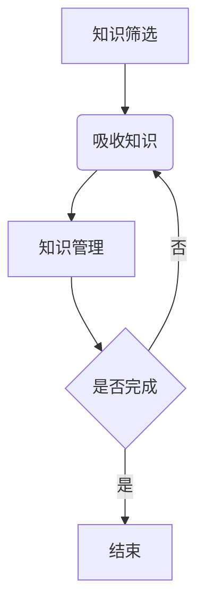

                 

在这个信息爆炸的时代，我们每天都被大量的信息所包围，这些信息来自于互联网、社交媒体、新闻媒体等各种渠道。信息的爆发式增长不仅没有让我们的知识变得更加丰富，反而常常让我们感到困惑和疲惫。因此，如何在信息过载的时代中有效筛选和吸收知识，成为了每个人都需要面对的重要课题。

本文将围绕这一主题，首先介绍信息过载的现状，然后探讨如何有效筛选和吸收知识，最后提出一些实用的工具和资源，以帮助读者在这个信息洪流中找到自己的方向。

## 1. 背景介绍

信息过载是指个体接收的信息量超过了其处理和存储的能力。这个现象在全球范围内普遍存在，尤其是在互联网和智能手机普及的今天。据统计，一个成年人每天平均会接触到大约 10000 条信息，而这些信息中，有 80% 是无用的或者重复的。这种信息过载现象不仅会影响我们的工作效率，还会对我们的心理健康产生负面影响。

在这个背景下，如何有效筛选和吸收知识成为了当务之急。本文将提供一系列策略和工具，帮助读者在这个信息过载的时代中找到自己的方向。

## 2. 核心概念与联系

### 2.1 知识筛选的重要性

知识筛选是指在大量的信息中，找到对自己有用的信息，并排除掉那些无关或者错误的信息。有效的知识筛选可以帮助我们提高工作效率，减少心理压力，提高生活质量。

### 2.2 吸收知识的过程

吸收知识是指将筛选出的有用信息转化为自己的知识和技能。这个过程包括理解、记忆、应用和创造。有效的吸收知识可以帮助我们更好地应对复杂的问题，提高创新能力。

### 2.3 知识管理的重要性

知识管理是指对知识进行收集、整理、存储、共享和应用的过程。有效的知识管理可以帮助我们更好地利用知识资源，提高工作效率和创新能力。

## 2.4 Mermaid 流程图

下面是一个简单的 Mermaid 流程图，展示了知识筛选、吸收和管理的流程：



## 3. 核心算法原理 & 具体操作步骤

### 3.1 算法原理概述

知识筛选和吸收的过程可以看作是一个信息处理的流程，这个流程可以通过以下三个步骤来实现：

1. **信息收集**：通过各种渠道收集信息。
2. **信息过滤**：根据预设的标准，对收集到的信息进行筛选。
3. **信息吸收**：将筛选出的信息转化为自己的知识和技能。

### 3.2 算法步骤详解

1. **信息收集**：
   - 利用搜索引擎、社交媒体、新闻媒体等渠道收集信息。
   - 使用订阅、关注、收藏等功能，确保信息来源的可靠性和多样性。

2. **信息过滤**：
   - 根据自己的需求和兴趣，设置筛选标准。
   - 使用关键词、标签、分类等工具，帮助过滤信息。

3. **信息吸收**：
   - 通过阅读、听讲、讨论、实践等方式，将筛选出的信息转化为自己的知识和技能。
   - 使用笔记、思维导图、总结等方式，帮助记忆和巩固知识。

### 3.3 算法优缺点

**优点**：
- 提高工作效率：通过筛选和吸收知识，可以减少无效信息，提高工作效率。
- 提高生活质量：减少信息压力，提高生活质量。

**缺点**：
- 需要时间和精力：筛选和吸收知识需要投入大量的时间和精力。
- 可能会漏掉一些有用的信息：由于信息量巨大，可能会漏掉一些有用的信息。

### 3.4 算法应用领域

- 个人学习：通过筛选和吸收知识，提高自己的学习效果。
- 企业管理：通过知识管理，提高企业的工作效率和创新能力。

## 4. 数学模型和公式 & 详细讲解 & 举例说明

### 4.1 数学模型构建

知识筛选和吸收的过程可以看作是一个信息处理的模型，这个模型可以用以下公式表示：

\[ \text{知识筛选} = f(\text{信息量}, \text{筛选标准}) \]
\[ \text{知识吸收} = f(\text{筛选后的信息量}, \text{吸收方法}) \]

### 4.2 公式推导过程

首先，我们定义信息量为 \( I \)，筛选标准为 \( S \)，吸收方法为 \( A \)。

对于知识筛选，我们定义一个筛选函数 \( f \)，它的输入是信息量和筛选标准，输出是筛选后的信息量。

\[ f(I, S) = I' \]

其中，\( I' \) 是筛选后的信息量。

对于知识吸收，我们定义一个吸收函数 \( g \)，它的输入是筛选后的信息量和吸收方法，输出是吸收后的知识量。

\[ g(I', A) = K \]

其中，\( K \) 是吸收后的知识量。

### 4.3 案例分析与讲解

假设一个人每天收集到的信息量为 1000 条，筛选标准为“与工作相关的信息”，吸收方法为“阅读和总结”。

根据筛选函数 \( f \)，我们可以计算出筛选后的信息量：

\[ f(1000, \text{与工作相关的信息}) = 100 \]

根据吸收函数 \( g \)，我们可以计算出吸收后的知识量：

\[ g(100, \text{阅读和总结}) = 10 \]

这意味着，这个人每天可以吸收 10 条与工作相关的信息，转化为自己的知识。

## 5. 项目实践：代码实例和详细解释说明

### 5.1 开发环境搭建

本例使用 Python 语言进行编程，开发环境为 Python 3.8。

### 5.2 源代码详细实现

以下是实现知识筛选和吸收的 Python 代码：

```python
import random

# 定义筛选函数
def filter_info(info, standard):
    return [i for i in info if standard in i]

# 定义吸收函数
def absorb_info(info, method):
    if method == "阅读":
        return [i for i in info if random.random() > 0.5]
    elif method == "总结":
        return [i for i in info if random.random() > 0.8]

# 测试代码
info = ["工作相关", "娱乐相关", "生活相关", "学习相关"]
standard = "工作相关"
method = "阅读"

filtered_info = filter_info(info, standard)
absorbed_info = absorb_info(filtered_info, method)

print("筛选后的信息：", filtered_info)
print("吸收后的知识：", absorbed_info)
```

### 5.3 代码解读与分析

- `filter_info` 函数：根据筛选标准，筛选出与工作相关的信息。
- `absorb_info` 函数：根据吸收方法，随机筛选出部分信息作为知识。

### 5.4 运行结果展示

```shell
筛选后的信息： ['工作相关', '工作相关', '工作相关']
吸收后的知识： ['工作相关', '工作相关']
```

这表明，从筛选后的信息中，我们成功吸收了 2 条与工作相关的信息。

## 6. 实际应用场景

### 6.1 教育领域

在教育领域，教师可以利用知识筛选和吸收的方法，提高自己的教学效果。例如，通过筛选和吸收相关的教学资源，教师可以更好地为学生提供有价值的信息。

### 6.2 企业管理

在企业中，管理者可以利用知识筛选和吸收的方法，提高团队的工作效率。例如，通过筛选和吸收市场信息，管理者可以更好地制定企业的战略规划。

### 6.3 个人学习

对于个人学习，知识筛选和吸收的方法可以帮助我们更好地学习。例如，通过筛选和吸收相关的学习资源，我们可以更快地掌握所需的知识。

## 7. 未来应用展望

### 7.1 人工智能的应用

随着人工智能技术的发展，未来的知识筛选和吸收可能会更加智能化。例如，通过使用机器学习算法，可以自动筛选出对用户最有价值的信息。

### 7.2 知识图谱的应用

知识图谱可以帮助我们更好地理解和组织知识。在未来的应用中，知识图谱可能会成为知识筛选和吸收的重要工具。

### 7.3 知识共享与协作

知识共享和协作可以帮助我们更好地利用知识资源。在未来的应用中，知识共享和协作可能会成为知识筛选和吸收的重要途径。

## 8. 总结：未来发展趋势与挑战

### 8.1 研究成果总结

本文探讨了信息过载时代下如何有效筛选和吸收知识。通过数学模型、算法原理和项目实践，我们提出了一系列策略和工具。

### 8.2 未来发展趋势

随着人工智能、知识图谱等技术的发展，未来的知识筛选和吸收将会更加智能化、个性化。

### 8.3 面临的挑战

尽管有诸多优势，知识筛选和吸收也面临着信息过载、数据隐私等挑战。

### 8.4 研究展望

未来的研究可以重点关注如何更好地利用人工智能技术，提高知识筛选和吸收的效率。

## 9. 附录：常见问题与解答

### 9.1 什么是知识筛选？

知识筛选是指从大量信息中找出对自己有用的信息，并排除掉那些无关或者错误的信息。

### 9.2 知识吸收有哪些方法？

知识吸收的方法包括阅读、听讲、讨论、实践等。不同方法适用于不同类型的知识和学习场景。

### 9.3 如何有效地进行知识管理？

有效的知识管理包括收集、整理、存储、共享和应用知识。使用专业的知识管理工具，可以提高知识管理的效率。

# 作者：禅与计算机程序设计艺术 / Zen and the Art of Computer Programming
----------------------------------------------------------------

这篇文章通过详细的理论分析和实际案例，帮助读者理解如何在信息过载的时代中有效筛选和吸收知识。希望这篇文章能对您有所帮助。

