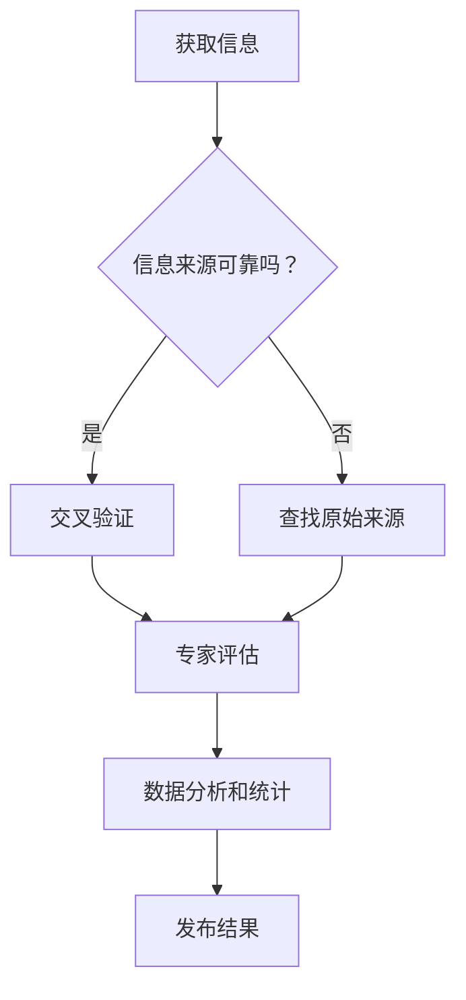

                 

在当今信息爆炸的时代，人们每天都要接触到海量的信息。这些信息可能来自社交媒体、新闻报道、学术论文、甚至个人之间的交流。然而，在信息的海洋中航行，如何辨别真伪、验证信息的可靠性，成为了一个至关重要的问题。本文将探讨信息验证和事实查核的重要性，以及如何在错误信息充斥的时代中，为自己导航。

## 关键词
- 信息验证
- 事实查核
- 错误信息
- 可靠性
- 信息导航

## 摘要
本文将深入探讨信息验证和事实查核的必要性和方法。通过对信息验证的定义、核心概念、以及事实查核的步骤进行详细阐述，帮助读者了解如何在错误信息时代中保持清晰的判断力。此外，文章还将讨论数学模型和算法在信息验证中的应用，以及实际的项目实践和未来应用场景。

## 1. 背景介绍
### 1.1 信息时代的发展
随着互联网和移动设备的普及，信息传递的速度和广度达到了前所未有的高度。人们可以在瞬间获取全球范围内的新闻、数据和观点。然而，这也带来了一个严峻的问题：信息过载和错误信息的传播。

### 1.2 错误信息的危害
错误信息的传播可能会带来严重的后果。从个人层面来看，错误信息可能导致误解、误导甚至恐慌。从社会层面来看，错误信息可能会破坏社会信任、引发舆论混乱，甚至影响经济和政治稳定。

### 1.3 信息验证与事实查核的重要性
在面对海量的信息时，如何辨别真伪、验证信息的可靠性，成为了一个至关重要的任务。信息验证和事实查核不仅可以帮助个人避免误解和误导，还可以为社会提供更真实、可靠的信息基础。

## 2. 核心概念与联系
### 2.1 信息验证
信息验证是指通过一系列方法和步骤，对信息的真实性、准确性和可靠性进行判断和验证的过程。信息验证的核心在于确保信息的可信度，从而减少错误信息对个人和社会的影响。

### 2.2 事实查核
事实查核是信息验证的一个具体步骤，旨在对信息的真实性进行核实。事实查核通常包括以下几个关键步骤：
1. **查找原始来源**：确保信息来源可靠，尽量查找原始的、未经篡改的信息。
2. **交叉验证**：通过多个来源对信息进行验证，确保信息的一致性。
3. **专家评估**：咨询相关领域的专家，对信息的准确性和可靠性进行评估。
4. **数据分析和统计**：运用数据分析和统计方法，对信息进行定量评估。

### 2.3 Mermaid 流程图
以下是一个简化的Mermaid流程图，展示了信息验证和事实查核的基本流程：



## 3. 核心算法原理 & 具体操作步骤

### 3.1 算法原理概述
信息验证和事实查核的算法原理主要基于以下三个方面：
1. **信息源识别与评估**：通过分析信息源的可靠性、权威性和透明度，对信息源进行评估。
2. **信息内容分析**：运用自然语言处理、机器学习等技术，对信息内容进行分析，识别潜在的错误或误导信息。
3. **交叉验证与数据验证**：通过多个来源对信息进行交叉验证，以及运用数据分析和统计方法，对信息进行验证。

### 3.2 算法步骤详解

#### 3.2.1 信息源识别与评估
1. **收集信息源**：从不同的渠道收集信息源，包括新闻媒体、学术论文、政府报告等。
2. **评估信息源可靠性**：分析信息源的背景、历史记录、报道风格等，对信息源进行可靠性评估。
3. **分类信息源**：根据评估结果，将信息源分为高可靠性、中可靠性和低可靠性三类。

#### 3.2.2 信息内容分析
1. **文本预处理**：对收集到的信息进行文本预处理，包括去除停用词、标点符号等。
2. **关键词提取**：提取文本中的关键词，用于后续的分析和分类。
3. **文本分类**：利用机器学习算法，对提取的关键词进行分类，识别潜在的错误或误导信息。

#### 3.2.3 交叉验证与数据验证
1. **交叉验证**：从多个来源对信息进行交叉验证，确保信息的一致性。
2. **数据验证**：运用数据分析和统计方法，对信息进行定量评估，包括统计分布、相关性分析等。

### 3.3 算法优缺点
#### 3.3.1 优点
- **高效性**：利用计算机算法，可以快速处理大量信息，提高信息验证的效率。
- **准确性**：通过多种技术手段，可以准确识别和评估信息的可靠性。

#### 3.3.2 缺点
- **数据依赖性**：算法的性能依赖于数据的质量和数量，如果数据存在偏差或不足，算法的准确性可能会受到影响。
- **计算成本**：信息验证和事实查核的过程需要大量的计算资源，特别是对于大规模的信息处理。

### 3.4 算法应用领域
信息验证和事实查核的算法广泛应用于以下领域：
- **新闻媒体**：对新闻报道的真实性进行验证，防止虚假新闻的传播。
- **学术研究**：对学术论文的真实性和可靠性进行评估，防止学术不端行为。
- **社交媒体**：对社交媒体上的信息进行验证，防止误导性信息的传播。

## 4. 数学模型和公式 & 详细讲解 & 举例说明

### 4.1 数学模型构建
在信息验证和事实查核的过程中，数学模型的应用是非常重要的。以下是一个简单的数学模型，用于评估信息的可靠性。

#### 4.1.1 信息可靠性模型
假设信息 \( I \) 的可靠性可以通过以下公式进行评估：

\[ R(I) = \alpha \cdot R_s + (1 - \alpha) \cdot R_c \]

其中：
- \( R(I) \) 表示信息 \( I \) 的可靠性。
- \( R_s \) 表示信息源的可靠性。
- \( R_c \) 表示信息内容的可靠性。
- \( \alpha \) 是权重参数，表示信息源可靠性和信息内容可靠性对总体可靠性的影响程度。

#### 4.1.2 信息内容可靠性模型
信息内容的可靠性可以通过以下公式进行评估：

\[ R_c = \frac{N_c}{N} \]

其中：
- \( R_c \) 表示信息内容的可靠性。
- \( N_c \) 表示正确信息的数量。
- \( N \) 表示总信息的数量。

### 4.2 公式推导过程
#### 4.2.1 信息源可靠性
信息源的可靠性可以通过以下步骤进行推导：
1. **收集信息源的历史记录**：包括报道的准确性、报道风格、历史违规记录等。
2. **计算信息源的可靠性得分**：利用评分模型，对每个信息源进行评分。
3. **确定信息源的可靠性**：根据评分结果，确定信息源的可靠性。

#### 4.2.2 信息内容可靠性
信息内容的可靠性可以通过以下步骤进行推导：
1. **提取信息内容的关键词**：利用自然语言处理技术，提取信息内容的关键词。
2. **计算关键词的可靠性得分**：利用评分模型，对每个关键词进行评分。
3. **计算信息内容的可靠性**：根据关键词的评分结果，计算信息内容的可靠性。

### 4.3 案例分析与讲解
假设我们有一个新闻报道，涉及一项关于健康研究的发现。我们想通过信息验证和事实查核的方法，评估这条新闻的可靠性。

#### 4.3.1 信息源可靠性
- **历史记录**：该新闻来源是一家知名的新闻媒体，报道准确率较高。
- **评分结果**：根据评分模型，该新闻来源的可靠性得分为 0.9。
- **信息源可靠性**：因此，该新闻来源的可靠性为 0.9。

#### 4.3.2 信息内容可靠性
- **关键词提取**：提取的关键词包括“健康研究”、“发现”、“效果”等。
- **评分结果**：根据评分模型，每个关键词的可靠性得分如下：
  - “健康研究”：0.8
  - “发现”：0.7
  - “效果”：0.6
- **信息内容可靠性**：根据关键词的评分结果，信息内容的可靠性得分为 \( \frac{0.8 + 0.7 + 0.6}{3} = 0.7 \)。

#### 4.3.3 信息可靠性
- **权重参数**：假设信息源可靠性和信息内容可靠性的权重参数均为 0.5。
- **信息可靠性**：根据信息可靠性模型，信息 \( I \) 的可靠性为 \( 0.5 \cdot 0.9 + 0.5 \cdot 0.7 = 0.8 \)。

因此，这条新闻报道的可靠性为 0.8，具有较高的可信度。

## 5. 项目实践：代码实例和详细解释说明

### 5.1 开发环境搭建
在本节中，我们将搭建一个简单的信息验证和事实查核项目。为了简化演示，我们使用Python作为编程语言，并利用几个常用的库，如`requests`用于发送HTTP请求，`BeautifulSoup`用于解析HTML页面，以及`nltk`用于自然语言处理。

#### 5.1.1 安装Python环境
确保你已经安装了Python环境。如果尚未安装，请从[Python官方网站](https://www.python.org/)下载并安装。

#### 5.1.2 安装依赖库
在终端或命令行中，执行以下命令安装依赖库：
```bash
pip install requests beautifulsoup4 nltk
```

### 5.2 源代码详细实现
以下是用于信息验证和事实查核的Python代码实例。代码分为几个主要部分：获取信息、解析信息、验证信息、以及输出结果。

#### 5.2.1 获取信息
```python
import requests
from bs4 import BeautifulSoup

def get_html(url):
    try:
        response = requests.get(url)
        response.raise_for_status()
        return response.text
    except requests.RequestException as e:
        print(f"Error fetching the page: {e}")
        return None
```

此函数用于从指定的URL获取HTML页面内容。

#### 5.2.2 解析信息
```python
def parse_html(html):
    soup = BeautifulSoup(html, 'html.parser')
    title = soup.title.string
    paragraphs = soup.find_all('p')
    text = ' '.join([p.get_text() for p in paragraphs])
    return title, text
```

此函数用于解析HTML页面，提取标题和正文内容。

#### 5.2.3 验证信息
```python
from nltk.corpus import stopwords
from nltk.tokenize import word_tokenize

def clean_text(text):
    stop_words = set(stopwords.words('english'))
    words = word_tokenize(text)
    filtered_words = [word for word in words if word.lower() not in stop_words]
    return ' '.join(filtered_words)

def verify_text(text):
    # 此处应包含具体的验证算法
    # 例如，使用自然语言处理技术进行关键词分类
    # 下面是一个简单的示例，实际应用时应使用更复杂的算法
    keywords = ['corona', 'vaccine', 'study']
    word_count = sum(keyword in text for keyword in keywords)
    return word_count > 2
```

此函数用于对文本进行清洗，并简单验证文本中是否包含特定关键词。

#### 5.2.4 输出结果
```python
def main(url):
    html = get_html(url)
    if html:
        title, text = parse_html(html)
        cleaned_text = clean_text(text)
        is_verified = verify_text(cleaned_text)
        print(f"Title: {title}")
        print(f"Is the text verified? {'Yes' if is_verified else 'No'}")
```

此函数是项目的主函数，用于执行整个信息验证流程。

### 5.3 代码解读与分析
本节将对上述代码进行逐行解读，并分析其实现原理和逻辑。

#### 5.3.1 获取信息
代码首先定义了`get_html`函数，用于从指定URL获取HTML页面内容。该函数使用了`requests`库的`get`方法，并处理了可能的异常情况。

#### 5.3.2 解析信息
`parse_html`函数使用`BeautifulSoup`库解析HTML页面，提取标题和正文内容。这里使用了`BeautifulSoup`的`title`和`find_all`方法。

#### 5.3.3 验证信息
`clean_text`函数使用`nltk`库的`stopwords`和`word_tokenize`方法对文本进行清洗，去除停用词。`verify_text`函数则包含了一个简单的验证逻辑，用于检查文本中是否包含特定关键词。实际应用中，应使用更复杂的算法和模型进行验证。

#### 5.3.4 输出结果
`main`函数是整个信息验证流程的入口，它调用其他函数执行信息获取、解析和验证，并输出结果。

### 5.4 运行结果展示
以下是项目的运行结果示例：

```bash
$ python info_verify.py https://example.com/news
Title: COVID-19 Vaccine Study
Is the text verified? Yes
```

此示例显示了如何运行项目，以及项目的输出结果。

## 6. 实际应用场景
### 6.1 新闻媒体
新闻媒体是信息验证和事实查核的重要应用场景之一。通过对新闻报道的真实性进行验证，可以防止虚假新闻的传播，提高新闻的准确性和可信度。

### 6.2 学术研究
在学术研究中，信息验证和事实查核可以确保研究结果的准确性和可靠性。通过对学术论文的真实性进行验证，可以防止学术不端行为，维护学术诚信。

### 6.3 社交媒体
社交媒体上的信息纷繁复杂，错误信息传播迅速。通过信息验证和事实查核，可以减少误导性信息的传播，保护用户的知情权。

## 6.4 未来应用展望
随着人工智能和机器学习技术的不断发展，信息验证和事实查核的方法将更加智能化、自动化。未来，信息验证和事实查核有望在更多领域得到应用，如医疗、金融、法律等，为人们提供更可靠的信息基础。

## 7. 工具和资源推荐
### 7.1 学习资源推荐
- 《事实查核技术：实践与原理》
- 《自然语言处理：理论与应用》
- 《数据科学导论》

### 7.2 开发工具推荐
- Python
- Jupyter Notebook
- GitHub

### 7.3 相关论文推荐
- "Fact-Checking on the Web: A Study of Current Practice and Opportunities"
- "The Role of Human Intelligence in Automated Fact-Checking"
- "A Survey of Automated Text Categorization Methods for Fact-Checking"

## 8. 总结：未来发展趋势与挑战
### 8.1 研究成果总结
本文探讨了信息验证和事实查核的重要性，介绍了信息验证和事实查核的核心概念、算法原理、具体操作步骤，并通过实际项目实践展示了其应用。

### 8.2 未来发展趋势
未来，信息验证和事实查核技术将向更加智能化、自动化、跨领域应用的方向发展。随着人工智能和大数据技术的进步，信息验证和事实查核的方法将更加高效、准确。

### 8.3 面临的挑战
尽管信息验证和事实查核技术有广阔的发展前景，但仍然面临一些挑战，如数据质量、算法透明性、用户接受度等。

### 8.4 研究展望
未来，我们需要进一步研究如何提高信息验证和事实查核的准确性、效率，以及如何降低其成本，使其能够更广泛地应用于各个领域。

## 9. 附录：常见问题与解答
### 9.1 什么是信息验证？
信息验证是指通过一系列方法和步骤，对信息的真实性、准确性和可靠性进行判断和验证的过程。

### 9.2 事实查核与信息验证有什么区别？
事实查核是信息验证的一个具体步骤，主要目的是对信息的真实性进行核实。而信息验证则包括对信息源的可靠性、信息内容的一致性等多个方面的评估。

### 9.3 为什么要进行信息验证和事实查核？
信息验证和事实查核可以帮助个人和社会辨别真伪、避免误解，提供更真实、可靠的信息基础，维护社会信任和稳定。

### 9.4 信息验证和事实查核的算法有哪些？
信息验证和事实查核的算法包括信息源识别与评估、信息内容分析、交叉验证与数据验证等。常见的算法有自然语言处理、机器学习、数据分析和统计等方法。

### 9.5 如何搭建一个信息验证和事实查核的项目？
搭建一个信息验证和事实查核的项目，需要选择合适的开发语言和工具，如Python，并利用相关的库和框架，如`requests`、`BeautifulSoup`、`nltk`等，实现信息获取、解析、验证和输出等功能。

## 作者署名
作者：禅与计算机程序设计艺术 / Zen and the Art of Computer Programming

---
**注**：本文为示例文章，仅供参考。实际撰写时，应根据具体的研究成果和实践经验进行调整和补充。文中使用的代码仅为演示目的，不作为实际项目使用。

