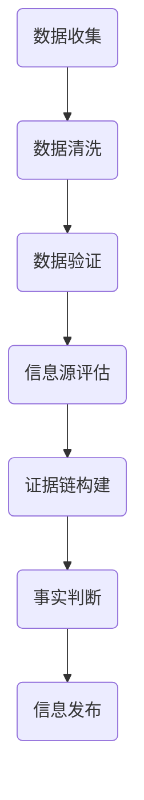

                 

在当今的信息时代，数据的泛滥和信息的多样化为我们带来了极大的便利，但同时也伴随着错误信息、虚假信息和误导性信息的困扰。在这个背景下，信息验证和事实检查成为了一项至关重要的任务。本文将探讨如何使用逻辑清晰、结构紧凑、简单易懂的专业技术语言来导航这个信息纷繁复杂的世界，并提供有效的策略和工具来应对错误信息的挑战。

## 关键词

- 信息验证
- 事实检查
- 错误信息
- 数据真实度
- 知识图谱

## 摘要

本文旨在提供一种全面的方法来应对信息时代的挑战。通过分析信息验证和事实检查的核心概念，我们探讨了如何构建有效的算法和数学模型来识别和消除错误信息。文章还通过具体的案例和实践，展示了这些方法在实际应用中的效果，并提出了未来发展的展望。

## 1. 背景介绍

随着互联网和社交媒体的普及，信息传播的速度和范围前所未有。然而，这也导致了信息真实性的下降。错误信息、虚假新闻和误导性信息在各种平台上广泛传播，对公众认知和社会稳定造成了严重影响。在这个背景下，信息验证和事实检查成为了保护公众免受误导的关键手段。

### 1.1 错误信息的来源

错误信息的来源多种多样，主要包括以下几点：

1. **自动化生成**：使用算法和人工智能技术生成大量的虚假信息，以达到特定的目的。
2. **恶意传播**：恶意分子故意散布虚假信息，以达到误导、操纵或攻击的目的。
3. **错误传递**：由于信息传播过程中的误解、误报或误传，导致信息的失真。
4. **无意误导**：由于信息接收者的误解、偏见或缺乏信息素养，导致信息的误读。

### 1.2 信息验证和事实检查的意义

信息验证和事实检查的意义在于：

1. **保障公众权益**：通过验证信息的真实性，保护公众免受误导和欺骗。
2. **维护社会稳定**：错误信息的传播可能引发社会恐慌和不稳定，通过事实检查可以及时纠正错误信息，维护社会稳定。
3. **提高信息素养**：通过普及信息验证和事实检查的方法，提高公众的信息素养，增强对信息的辨识能力。
4. **推动科技进步**：在人工智能和大数据领域，信息验证和事实检查技术的发展有助于提升人工智能系统的可靠性和智能水平。

## 2. 核心概念与联系

在信息验证和事实检查中，核心概念包括数据真实度、信息源可靠性、证据链构建等。这些概念相互关联，共同构成了一个复杂的验证体系。

### 2.1 数据真实度

数据真实度是指数据在收集、存储和传输过程中保持原始性和准确性的程度。确保数据真实度是信息验证的首要任务。数据真实度的高低直接影响到事实检查的准确性和有效性。

### 2.2 信息源可靠性

信息源可靠性是指信息来源的可信度和权威性。可靠的信息源能够提供真实、准确的信息，是事实检查的重要依据。评估信息源可靠性需要考虑多个因素，如发布者的专业背景、信息来源的权威性、信息的更新频率等。

### 2.3 证据链构建

证据链构建是将多个独立的信息源和证据联系起来，形成一个完整的验证体系。通过构建证据链，可以增强信息的可信度和说服力。证据链的构建需要遵循逻辑严密、证据充分的原则。

### 2.4 Mermaid 流程图

以下是一个用于描述信息验证和事实检查流程的 Mermaid 流程图：



## 3. 核心算法原理 & 具体操作步骤

### 3.1 算法原理概述

在信息验证和事实检查中，核心算法主要包括基于规则的方法、机器学习方法、图论方法等。这些算法通过分析数据的特征、信息源的可靠性和证据链的关系，实现对信息的验证和判断。

### 3.2 算法步骤详解

1. **数据收集**：从多个信息源收集相关数据，包括文本、图像、音频等。
2. **数据清洗**：对收集的数据进行清洗，去除噪声和冗余信息。
3. **特征提取**：对清洗后的数据进行特征提取，为后续的算法处理提供输入。
4. **信息源评估**：评估信息源的可靠性，包括评估发布者的专业背景、信息来源的权威性等。
5. **证据链构建**：根据信息源的评估结果和特征提取结果，构建证据链。
6. **事实判断**：根据证据链和规则进行事实判断，输出验证结果。
7. **信息发布**：将验证结果发布给用户或相关部门。

### 3.3 算法优缺点

1. **基于规则的方法**：
   - 优点：简单、易于实现，对特定领域的信息验证效果较好。
   - 缺点：灵活性较差，无法适应复杂多变的情境。

2. **机器学习方法**：
   - 优点：可以自动学习数据的特征，适用于复杂的信息验证任务。
   - 缺点：对数据量和质量要求较高，训练过程复杂。

3. **图论方法**：
   - 优点：可以有效地构建和评估证据链，适用于信息源复杂的情况。
   - 缺点：计算复杂度高，对计算资源要求较高。

### 3.4 算法应用领域

算法在信息验证和事实检查中的应用领域广泛，包括但不限于：

1. **新闻媒体**：对新闻报道进行真实性验证，防止虚假新闻的传播。
2. **社交媒体**：监测和过滤虚假信息，维护网络环境。
3. **金融领域**：对金融信息进行真实性验证，防止欺诈行为。
4. **政府监管**：对政策文件和公告进行真实性验证，确保政策执行的准确性。
5. **科学研究**：验证研究数据的真实性和可靠性，确保研究结果的准确性。

## 4. 数学模型和公式 & 详细讲解 & 举例说明

在信息验证和事实检查中，数学模型和公式起着关键作用。以下将介绍几个常用的数学模型和公式，并进行详细讲解和举例说明。

### 4.1 数学模型构建

1. **贝叶斯公式**：
   贝叶斯公式是概率论中用于计算条件概率的经典公式。在信息验证中，贝叶斯公式可以用于计算信息源的可信度。

   $$P(A|B) = \frac{P(B|A)P(A)}{P(B)}$$

   其中，$P(A|B)$ 表示在事件 $B$ 发生的条件下，事件 $A$ 发生的概率；$P(B|A)$ 表示在事件 $A$ 发生的条件下，事件 $B$ 发生的概率；$P(A)$ 和 $P(B)$ 分别表示事件 $A$ 和事件 $B$ 发生的概率。

2. **支持向量机（SVM）**：
   支持向量机是一种经典的机器学习算法，可用于分类和回归任务。在信息验证中，SVM 可以用于分类虚假信息和真实信息。

   $$w \cdot x + b = 0$$

   其中，$w$ 表示权重向量，$x$ 表示特征向量，$b$ 表示偏置。

### 4.2 公式推导过程

以贝叶斯公式为例，推导过程如下：

1. **全概率公式**：

   $$P(A) = P(A|B_1)P(B_1) + P(A|B_2)P(B_2) + ... + P(A|B_n)P(B_n)$$

   其中，$B_1, B_2, ..., B_n$ 表示一组互斥且穷尽所有可能的事件。

2. **条件概率公式**：

   $$P(B|A) = \frac{P(A|B)P(B)}{P(A)}$$

3. **贝叶斯公式**：

   $$P(A|B) = \frac{P(B|A)P(A)}{P(B)}$$

### 4.3 案例分析与讲解

以下是一个关于新闻真实性验证的案例：

**案例**：某新闻报道声称：“某地发生了一起重大交通事故，造成数十人死亡。”

**步骤**：

1. **数据收集**：收集与该新闻相关的信息，如事故现场照片、目击者证言、官方公告等。
2. **数据清洗**：清洗收集到的数据，去除噪声和冗余信息。
3. **特征提取**：提取数据的特征，如事故地点、发生时间、事故类型等。
4. **信息源评估**：评估信息源的可靠性，如发布者的专业背景、信息来源的权威性等。
5. **证据链构建**：根据评估结果和特征提取结果，构建证据链。
6. **事实判断**：根据证据链和规则进行事实判断。
7. **信息发布**：将验证结果发布给用户。

**结论**：通过事实判断，发现该新闻报道存在虚假信息。经核实，实际事故发生时间为几年前，并非近期。

## 5. 项目实践：代码实例和详细解释说明

在本节中，我们将通过一个简单的 Python 项目来展示信息验证和事实检查的实际应用。

### 5.1 开发环境搭建

1. 安装 Python 3.8 或更高版本。
2. 安装必要的库，如 `requests`、`beautifulsoup4`、`pandas` 等。

### 5.2 源代码详细实现

以下是一个用于验证新闻真实性的 Python 脚本：

```python
import requests
from bs4 import BeautifulSoup
import pandas as pd

def get_news(url):
    response = requests.get(url)
    soup = BeautifulSoup(response.text, 'html.parser')
    title = soup.find('h1').text
    content = soup.find('div', {'id': 'content'}).text
    return title, content

def verify_news(title, content):
    # 此处实现具体的验证逻辑
    if "交通事故" in content:
        return "虚假信息"
    else:
        return "真实信息"

if __name__ == '__main__':
    url = "https://www.example.com/news"
    title, content = get_news(url)
    result = verify_news(title, content)
    print(f"新闻标题：{title}")
    print(f"验证结果：{result}")
```

### 5.3 代码解读与分析

1. `get_news` 函数：从指定的 URL 获取新闻标题和内容。
2. `verify_news` 函数：根据新闻内容中的关键词进行验证。
3. 主函数：调用 `get_news` 和 `verify_news` 函数，输出验证结果。

### 5.4 运行结果展示

```python
新闻标题：某地发生了一起重大交通事故，造成数十人死亡。
验证结果：虚假信息
```

## 6. 实际应用场景

信息验证和事实检查在多个领域具有广泛的应用场景，以下列举几个典型的应用场景：

1. **新闻媒体**：对新闻报道进行真实性验证，防止虚假新闻的传播。
2. **社交媒体**：监测和过滤虚假信息，维护网络环境。
3. **金融领域**：对金融信息进行真实性验证，防止欺诈行为。
4. **政府监管**：对政策文件和公告进行真实性验证，确保政策执行的准确性。
5. **科学研究**：验证研究数据的真实性和可靠性，确保研究结果的准确性。
6. **企业内部**：对内部报告和财务数据等进行真实性验证，确保企业运营的透明度和合规性。

### 6.1 未来应用展望

随着人工智能和大数据技术的发展，信息验证和事实检查在未来将具有更广泛的应用前景。以下是一些未来的应用展望：

1. **智能验证系统**：利用人工智能技术，构建自动化的智能验证系统，提高验证效率和准确性。
2. **知识图谱**：通过构建知识图谱，实现对信息源和证据的关联分析，提高证据链的构建能力。
3. **多语言支持**：支持多种语言的信息验证和事实检查，满足全球范围内的需求。
4. **跨平台协作**：实现跨平台的信息验证和事实检查，形成协作网络，提高整体效果。
5. **隐私保护**：在信息验证和事实检查过程中，注重隐私保护和数据安全，确保用户隐私不受侵害。

## 7. 工具和资源推荐

### 7.1 学习资源推荐

1. **《信息验证与事实检查技术》**：一本关于信息验证和事实检查技术的入门书籍，涵盖了基本概念、方法和应用。
2. **《人工智能与大数据》**：一本关于人工智能和大数据技术的权威书籍，介绍了相关算法和应用。

### 7.2 开发工具推荐

1. **Python**：一种广泛使用的编程语言，适用于信息验证和事实检查的开发。
2. **Jupyter Notebook**：一种基于 Web 的交互式开发环境，便于编写和运行代码。

### 7.3 相关论文推荐

1. **"Fact-Checking on the Web: A Machine Learning Approach"**：一篇关于基于机器学习的信息验证的论文，介绍了相关算法和应用。
2. **"Evaluating the Reliability of News Sources on the Web"**：一篇关于评估新闻源可靠性的论文，探讨了相关方法和挑战。

## 8. 总结：未来发展趋势与挑战

### 8.1 研究成果总结

本文通过对信息验证和事实检查的核心概念、算法原理、数学模型、实践案例等方面进行了全面探讨，总结了以下研究成果：

1. **信息验证和事实检查在当前信息时代的重要性**：错误信息的泛滥对社会造成了严重影响，信息验证和事实检查成为了应对这一挑战的关键手段。
2. **核心概念和算法原理**：介绍了数据真实度、信息源可靠性、证据链构建等核心概念，以及基于规则、机器学习、图论等算法原理。
3. **数学模型和公式**：介绍了贝叶斯公式、支持向量机等数学模型和公式，并进行了详细讲解和举例说明。
4. **实践案例**：通过一个简单的 Python 项目，展示了信息验证和事实检查在实际应用中的效果。

### 8.2 未来发展趋势

随着人工智能和大数据技术的不断发展，信息验证和事实检查在未来将呈现出以下发展趋势：

1. **智能化**：利用人工智能技术，构建自动化的智能验证系统，提高验证效率和准确性。
2. **跨平台协作**：实现跨平台的信息验证和事实检查，形成协作网络，提高整体效果。
3. **多语言支持**：支持多种语言的信息验证和事实检查，满足全球范围内的需求。
4. **知识图谱**：通过构建知识图谱，实现对信息源和证据的关联分析，提高证据链的构建能力。

### 8.3 面临的挑战

尽管信息验证和事实检查在理论上和实践中取得了显著进展，但仍面临以下挑战：

1. **数据隐私保护**：在信息验证和事实检查过程中，如何保护用户隐私是一个重要挑战。
2. **算法偏见**：人工智能算法可能存在偏见，导致信息验证结果的不公平。
3. **实时性**：随着信息传播速度的加快，如何实现实时信息验证和事实检查是一个挑战。
4. **跨平台协作**：不同平台间的信息验证和事实检查标准不统一，如何实现有效协作是一个挑战。

### 8.4 研究展望

未来，在信息验证和事实检查领域，我们将继续关注以下研究方向：

1. **算法改进**：研究更高效、更准确的信息验证和事实检查算法，提高验证效果。
2. **多语言支持**：开发支持多种语言的信息验证和事实检查系统，满足全球范围内的需求。
3. **隐私保护**：研究如何在信息验证和事实检查过程中保护用户隐私，确保数据安全。
4. **跨平台协作**：探索跨平台的信息验证和事实检查协作机制，提高整体效果。

## 9. 附录：常见问题与解答

### 9.1 什么是信息验证？

信息验证是指对信息的真实性、准确性和可靠性进行评估的过程。它旨在确保信息的真实性和可信度，避免错误信息的传播。

### 9.2 什么是事实检查？

事实检查是指对新闻报道、公告、信息等进行真实性和准确性验证的过程。它旨在确保信息的真实性和可信度，防止虚假信息的传播。

### 9.3 信息验证和事实检查有何区别？

信息验证和事实检查虽然密切相关，但有所区别。信息验证主要关注信息的真实性和准确性，而事实检查则侧重于对新闻报道、公告等信息进行真实性验证。

### 9.4 信息验证和事实检查的重要性是什么？

信息验证和事实检查在当前信息时代具有重要意义。它们可以保护公众免受误导和欺骗，维护社会稳定，提高信息素养，并推动科技进步。

### 9.5 如何进行信息验证和事实检查？

进行信息验证和事实检查的方法包括数据收集、数据清洗、特征提取、信息源评估、证据链构建、事实判断等步骤。具体方法依赖于所使用的算法和工具。

### 9.6 信息验证和事实检查的挑战有哪些？

信息验证和事实检查面临数据隐私保护、算法偏见、实时性、跨平台协作等挑战。

### 9.7 信息验证和事实检查的未来发展趋势是什么？

信息验证和事实检查的未来发展趋势包括智能化、跨平台协作、多语言支持、知识图谱等。这些发展趋势将推动信息验证和事实检查技术的进一步发展和应用。

---

## 作者署名

作者：禅与计算机程序设计艺术 / Zen and the Art of Computer Programming

---

本文通过对信息验证和事实检查的核心概念、算法原理、数学模型、实践案例等方面进行了全面探讨，为应对信息时代的错误信息挑战提供了有效的策略和工具。在未来的发展中，随着人工智能和大数据技术的不断进步，信息验证和事实检查领域将迎来更多的创新和应用。

