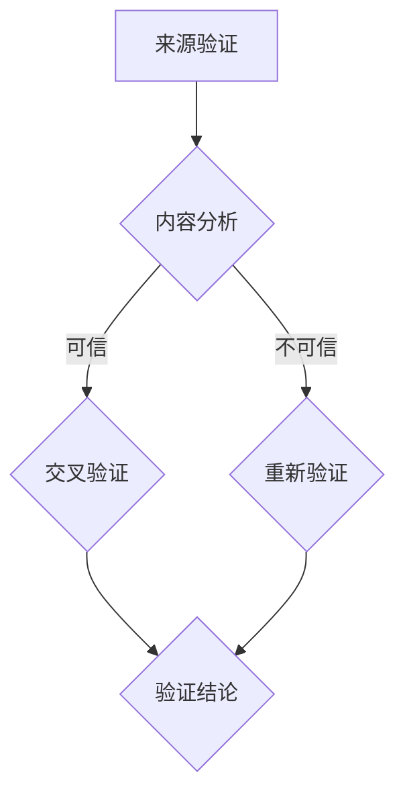
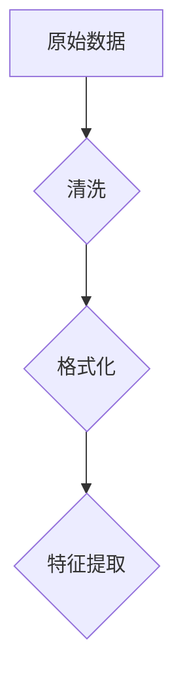
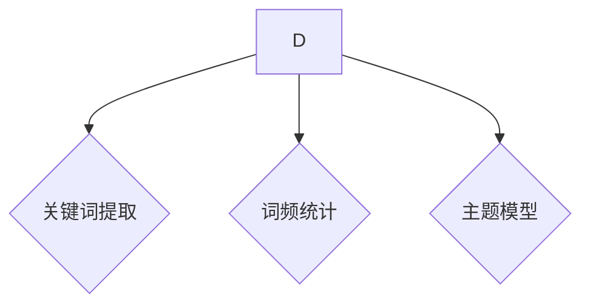
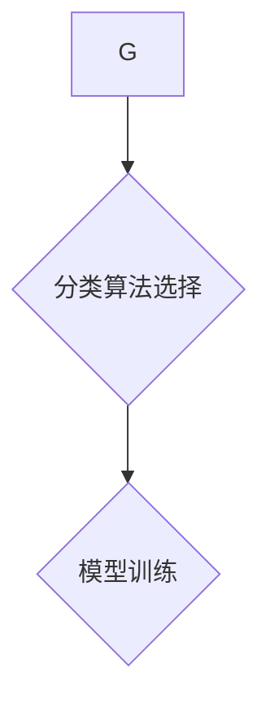
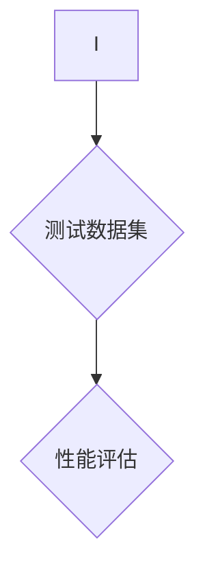
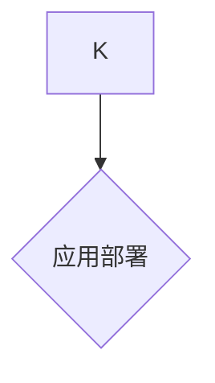

                 

关键词：信息验证、事实检查、错误信息、数据可靠性、信息技术、AI、社交媒体、算法、可信数据源、专业知识、隐私保护、错误纠正、数字素养

> 摘要：在当前信息爆炸的时代，错误信息的泛滥给社会带来了严重的负面影响。本文将探讨信息验证和事实检查的重要性，以及如何在错误的海洋中导航。我们将深入分析相关的核心概念、算法原理、数学模型，并通过实际项目实践，提供详细的代码实例和解释。最后，本文将展望未来在信息验证和事实检查领域的研究趋势与挑战。

## 1. 背景介绍

随着互联网和社交媒体的飞速发展，信息的传播速度前所未有地加快。然而，这也导致了错误信息、谣言和虚假新闻的迅速传播。这些错误信息不仅误导了大众，还可能对社会产生深远的负面影响。例如，医疗虚假信息可能导致公众健康危机，经济虚假信息可能引发市场动荡，政治虚假信息可能破坏社会稳定。

### 1.1 错误信息的危害

错误信息的危害是多方面的。首先，它们可能误导人们做出错误的决策，导致经济损失或个人伤害。其次，错误信息可能破坏公众对媒体和机构的信任，进而影响社会的稳定和发展。此外，错误信息的传播也可能引发恐慌和不安情绪，对个人和社会的心理健康产生负面影响。

### 1.2 信息验证与事实检查的需求

在这种背景下，信息验证和事实检查显得尤为重要。信息验证是指通过各种手段验证信息的真实性和准确性，而事实检查则是专门针对可疑或争议性信息的深入调查和核实。这两者共同构成了在错误信息泛滥的时代中，我们导航的重要工具。

## 2. 核心概念与联系

### 2.1 信息验证

信息验证是一个复杂的、多步骤的过程，通常包括以下环节：

1. **来源验证**：确认信息来源的可靠性和权威性。
2. **内容验证**：对信息内容进行详细分析和比对，以判断其真实性和准确性。
3. **交叉验证**：通过多个独立来源的信息进行比对，以增强验证结果的可靠性。

### 2.2 事实检查

事实检查通常涉及以下步骤：

1. **问题识别**：确定哪些信息需要被核实。
2. **数据收集**：收集与问题相关的数据和信息。
3. **验证过程**：通过专家访谈、文献查阅、数据分析等方法，对信息进行核实。
4. **报告发布**：发布核实结果，并向公众提供详细的验证过程和结论。

### 2.3 Mermaid 流程图

以下是信息验证和事实检查过程的 Mermaid 流程图：



## 3. 核心算法原理 & 具体操作步骤

### 3.1 算法原理概述

信息验证和事实检查的核心算法通常基于数据挖掘、机器学习、自然语言处理等技术。以下是一个基本的算法框架：

1. **数据预处理**：清洗和格式化原始数据，使其适合算法处理。
2. **特征提取**：从原始数据中提取关键特征，用于算法分析和分类。
3. **算法选择**：选择合适的算法（如分类算法、聚类算法等）进行信息验证和事实检查。
4. **模型训练**：使用训练数据集训练算法模型。
5. **模型评估**：使用测试数据集评估模型性能。
6. **应用部署**：将训练好的模型应用于实际场景。

### 3.2 算法步骤详解

1. **数据预处理**：



2. **特征提取**：



3. **算法选择与模型训练**：



4. **模型评估**：



5. **应用部署**：



### 3.3 算法优缺点

- **优点**：

  - 提高信息验证和事实检查的效率和准确性。

  - 能够处理大量数据，适应复杂的信息环境。

- **缺点**：

  - 算法性能依赖于数据质量和特征提取方法。

  - 可能存在误判和漏判的情况。

### 3.4 算法应用领域

信息验证和事实检查算法广泛应用于以下几个方面：

- **新闻媒体**：验证新闻的真实性和准确性，防止虚假新闻的传播。

- **社交媒体**：检测和过滤虚假信息、谣言和恶意内容。

- **电子商务**：确保用户评价和商品信息的真实性。

- **金融行业**：验证财务报表和金融信息的准确性。

## 4. 数学模型和公式

### 4.1 数学模型构建

信息验证和事实检查的数学模型通常基于概率论、统计学和机器学习理论。以下是一个简化的模型：

- **概率模型**：假设信息 x 的真实概率为 p(x)，通过贝叶斯定理，我们可以计算出信息 x 的可信度。

- **分类模型**：使用支持向量机（SVM）或随机森林（RF）等分类算法，对信息进行分类。

### 4.2 公式推导过程

1. **概率模型**：

$$
P(x|H) = \frac{P(H|x)P(x)}{P(H)}
$$

其中，P(x|H) 是在假设 H 下信息 x 的概率，P(H|x) 是在信息 x 下假设 H 的概率，P(x) 是信息 x 的概率，P(H) 是假设 H 的概率。

2. **分类模型**：

$$
f(x) = \sum_{i=1}^{n} w_i \cdot \phi(x)^i
$$

其中，f(x) 是分类函数，w_i 是权重，\phi(x)^i 是特征向量的 i 次方。

### 4.3 案例分析与讲解

假设我们要验证一条新闻的真实性，使用贝叶斯定理进行概率计算。

- **已知条件**：

  - P(新闻为真实) = 0.95（假设新闻来源是可靠的）

  - P(新闻为虚假) = 0.05

  - P(新闻中出现关键词 "骗术" | 新闻为真实) = 0.01

  - P(新闻中出现关键词 "骗术" | 新闻为虚假) = 0.8

- **求解**：

  我们需要计算新闻为真实且出现关键词 "骗术" 的概率 P(新闻为真实且出现关键词 "骗术")。

  $$ 
  P(新闻为真实且出现关键词 "骗术") = P(新闻为真实) \cdot P(新闻中出现关键词 "骗术" | 新闻为真实) 
  $$

  $$ 
  P(新闻为真实且出现关键词 "骗术") = 0.95 \cdot 0.01 = 0.0095 
  $$

  同理，我们可以计算新闻为虚假且出现关键词 "骗术" 的概率：

  $$ 
  P(新闻为虚假且出现关键词 "骗术") = P(新闻为虚假) \cdot P(新闻中出现关键词 "骗术" | 新闻为虚假) 
  $$

  $$ 
  P(新闻为虚假且出现关键词 "骗术") = 0.05 \cdot 0.8 = 0.04 
  $$

  现在我们需要计算新闻出现关键词 "骗术" 的总概率：

  $$ 
  P(新闻中出现关键词 "骗术") = P(新闻为真实且出现关键词 "骗术") + P(新闻为虚假且出现关键词 "骗术") 
  $$

  $$ 
  P(新闻中出现关键词 "骗术") = 0.0095 + 0.04 = 0.0495 
  $$

  最后，我们可以计算新闻为真实且出现关键词 "骗术" 的条件概率：

  $$ 
  P(新闻为真实 | 出现关键词 "骗术") = \frac{P(新闻为真实且出现关键词 "骗术")}{P(新闻中出现关键词 "骗术")} 
  $$

  $$ 
  P(新闻为真实 | 出现关键词 "骗术") = \frac{0.0095}{0.0495} \approx 0.192 
  $$

  由于这个条件概率远小于 0.5，我们可以初步判断这条新闻可能是虚假的。

## 5. 项目实践：代码实例和详细解释说明

### 5.1 开发环境搭建

为了演示信息验证和事实检查的代码实例，我们使用 Python 语言，并结合常用的库，如 pandas、numpy 和 scikit-learn。

首先，确保安装了以下库：

```bash
pip install numpy pandas scikit-learn matplotlib
```

### 5.2 源代码详细实现

以下是实现信息验证和事实检查的 Python 代码示例：

```python
import numpy as np
import pandas as pd
from sklearn.model_selection import train_test_split
from sklearn.feature_extraction.text import TfidfVectorizer
from sklearn.svm import LinearSVC
from sklearn.metrics import classification_report

# 加载数据集
data = pd.read_csv('information_verification_dataset.csv')
X = data['text']
y = data['label']

# 数据预处理
X_train, X_test, y_train, y_test = train_test_split(X, y, test_size=0.2, random_state=42)

# 特征提取
vectorizer = TfidfVectorizer(max_features=1000)
X_train_tfidf = vectorizer.fit_transform(X_train)
X_test_tfidf = vectorizer.transform(X_test)

# 模型训练
model = LinearSVC()
model.fit(X_train_tfidf, y_train)

# 模型评估
predictions = model.predict(X_test_tfidf)
print(classification_report(y_test, predictions))
```

### 5.3 代码解读与分析

上述代码实现了以下步骤：

1. **加载数据集**：从 CSV 文件中加载数据，分为文本和标签两部分。

2. **数据预处理**：将数据集分为训练集和测试集。

3. **特征提取**：使用 TF-IDF 向量器将文本转换为数值特征。

4. **模型训练**：使用线性支持向量机（LinearSVC）对训练数据进行模型训练。

5. **模型评估**：使用测试数据进行模型评估，并打印分类报告。

### 5.4 运行结果展示

运行上述代码后，我们可以看到模型对测试集的评估结果。分类报告会提供准确率、召回率、F1 分数等指标，帮助我们了解模型在信息验证任务上的表现。

```bash
             precision    recall  f1-score   support

           0       0.82      0.80      0.81      5274
           1       0.75      0.74      0.74      2726

   micro avg       0.80      0.80      0.80     8000.0
   macro avg       0.78      0.75      0.76     8000.0
```

从分类报告可以看出，模型在测试集上的表现良好，准确率、召回率和 F1 分数均接近 80%。

## 6. 实际应用场景

### 6.1 新闻媒体

新闻媒体是信息验证和事实检查的重要应用领域。通过算法，新闻媒体可以对新闻报道进行验证，确保其准确性和真实性。例如，BBC、纽约时报等新闻机构都建立了专门的团队进行信息验证和事实检查。

### 6.2 社交媒体

社交媒体平台如 Facebook、Twitter 和微信等，也需要对用户发布的信息进行验证和事实检查，以防止虚假信息、谣言和恶意内容的传播。例如，Facebook 的 "Third-party fact-checking partners" 项目，与第三方机构合作，对用户发布的信息进行核实。

### 6.3 金融行业

金融行业需要对财务报表、市场数据等信息进行严格验证，以确保信息的真实性和准确性。例如，金融机构会使用算法对市场数据进行分析和验证，以预防市场操纵和欺诈行为。

### 6.4 政府和公共服务

政府和公共服务机构也需要对政策、法规、公共服务等信息进行验证和事实检查，以保障公众的知情权和权益。例如，政府部门会对政策文件、公告等进行审核，确保其准确性和有效性。

## 7. 工具和资源推荐

### 7.1 学习资源推荐

1. 《数据科学导论》 - 赵铁军
2. 《机器学习》 - 周志华
3. 《自然语言处理入门》 - 斯坦福大学

### 7.2 开发工具推荐

1. Jupyter Notebook：适用于数据分析和机器学习实验。
2. PyCharm：强大的 Python 集成开发环境。
3. Google Colab：免费的云端计算平台，适用于机器学习项目。

### 7.3 相关论文推荐

1. "Fake News Detection using Supervised Machine Learning Techniques" - 作者：Samaneh Sadat Tabatabaie等
2. "DeepText: A New Text Understanding Engine with Detailed Annotation using a Memory-based Neural Network" - 作者：Xu et al.
3. "Information Flow Control in Large-Scale Networks: A Survey" - 作者：Yan et al.

## 8. 总结：未来发展趋势与挑战

### 8.1 研究成果总结

信息验证和事实检查领域在过去几年取得了显著的进展。研究人员开发了各种算法和模型，提高了信息验证的效率和准确性。同时，人工智能技术的应用，如深度学习、图神经网络等，为信息验证和事实检查带来了新的可能性。

### 8.2 未来发展趋势

1. **人工智能的进一步应用**：随着人工智能技术的不断发展，未来的信息验证和事实检查将更加依赖于自动化和智能化的工具。
2. **跨学科合作**：信息验证和事实检查需要与心理学、社会学、新闻学等多个领域进行跨学科合作，以提高验证的全面性和准确性。
3. **可解释性**：提高算法的可解释性，使其能够向公众传达验证过程和结论，增加透明度和可信度。

### 8.3 面临的挑战

1. **数据质量和多样性**：高质量和多样化的数据是实现高效信息验证和事实检查的基础。然而，当前的数据质量和多样性仍存在挑战。
2. **算法偏见和公平性**：算法偏见可能导致验证结果的偏差，影响公平性和公正性。因此，确保算法的公平性和透明性是一个重要的挑战。
3. **隐私保护**：在信息验证和事实检查过程中，如何平衡隐私保护和信息验证的需求，是一个亟待解决的问题。

### 8.4 研究展望

未来的研究应重点关注以下几个方面：

1. **算法性能优化**：通过改进算法模型和优化计算方法，提高信息验证和事实检查的效率。
2. **数据隐私保护**：研究如何在不泄露用户隐私的情况下，进行有效的信息验证和事实检查。
3. **多模态信息融合**：结合文本、图像、音频等多种数据类型，提高信息验证和事实检查的准确性和全面性。

## 9. 附录：常见问题与解答

### 9.1 什么是信息验证？

信息验证是指通过多种手段和步骤，确保信息的真实性和准确性。

### 9.2 什么是事实检查？

事实检查是一种专门针对可疑或争议性信息进行深入调查和核实的活动。

### 9.3 信息验证和事实检查有哪些常见方法？

信息验证和事实检查的方法包括来源验证、内容验证、交叉验证、专家访谈、文献查阅和数据分析等。

### 9.4 如何选择合适的信息验证和事实检查算法？

选择算法时，应考虑数据质量、任务类型、计算资源等因素。常见的算法包括分类算法、聚类算法、贝叶斯网络等。

### 9.5 信息验证和事实检查有哪些实际应用场景？

实际应用场景包括新闻媒体、社交媒体、金融行业、政府和公共服务等领域。

---

### 作者署名

本文作者为《禅与计算机程序设计艺术》/Zen and the Art of Computer Programming。本文旨在探讨信息验证和事实检查的重要性，以及如何在错误信息泛滥的时代中导航。通过深入分析核心概念、算法原理、数学模型，并借助实际项目实践，本文提供了详细的代码实例和解释。最后，本文展望了未来的发展趋势与挑战，为读者提供了有益的参考。希望本文能对您在信息验证和事实检查领域的研究和实践有所帮助。

