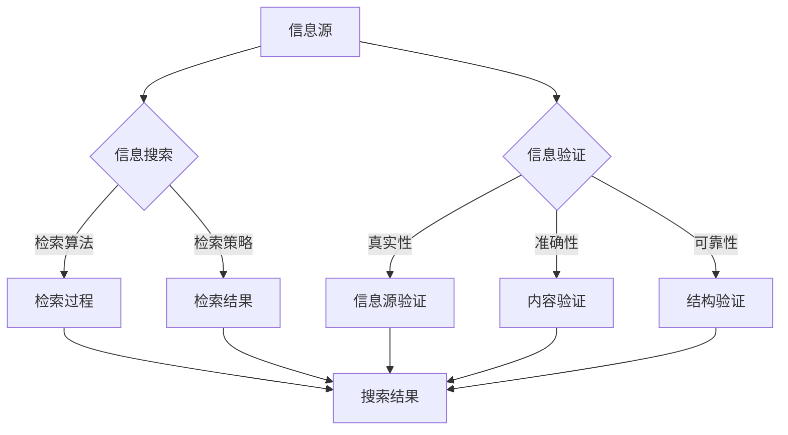

                 

在当今信息爆炸的时代，我们每个人每天都被海量的数据和信息所包围。如何有效地验证信息的准确性并找到可靠的信息，已成为一个至关重要的问题。本文将探讨信息验证和信息搜索技术，帮助我们在信息海洋中找到可靠的珍珠。

## 关键词

- 信息验证
- 信息搜索
- 可靠性
- 数据准确性
- 技术应用

## 摘要

本文首先介绍了信息验证和信息搜索技术的背景和重要性，然后深入探讨了这些技术的核心概念、算法原理、数学模型以及实际应用场景。通过本文的阅读，读者将能够了解并掌握这些技术的基本原理和应用方法，为在信息海洋中找到可靠的信息打下坚实的基础。

### 1. 背景介绍

在数字化时代，信息已经成为社会生产和生活的重要资源。然而，随着互联网和社交媒体的普及，信息的真实性、准确性和可靠性受到了严峻的挑战。虚假信息、误导性信息和伪造信息层出不穷，给个人、企业和整个社会带来了巨大的风险和损失。

信息验证和信息搜索技术的出现，正是为了解决这一难题。信息验证技术通过对信息源、内容、结构和关联关系的验证，确保信息的真实性和可靠性。信息搜索技术则通过高效的检索算法和策略，从海量信息中快速准确地找到所需的信息。

这两项技术的应用领域广泛，包括但不限于网络安全、数据挖掘、人工智能、金融保险、医疗保健、教育科研等。在网络安全领域，信息验证技术可以帮助识别和阻止恶意攻击；在数据挖掘领域，信息搜索技术可以帮助发现隐藏在数据中的有价值信息；在金融保险领域，信息验证技术可以确保交易和保单的真实性；在医疗保健领域，信息搜索技术可以帮助医生快速找到相关的医学研究资料；在教育科研领域，信息验证和信息搜索技术可以提高科研效率和学术成果的准确性。

### 2. 核心概念与联系

#### 2.1. 信息验证

信息验证是指通过对信息进行验证，确保其真实性、准确性和可靠性。信息验证的核心概念包括信息源验证、内容验证和结构验证。

1. **信息源验证**：验证信息源的可靠性，确保信息来源的合法性和权威性。
2. **内容验证**：验证信息内容是否真实、准确，包括对信息的真实性、一致性、完整性、及时性和可靠性进行检验。
3. **结构验证**：验证信息结构是否符合规范，确保信息的结构完整、逻辑清晰。

#### 2.2. 信息搜索

信息搜索是指从海量信息中找到所需信息的过程。信息搜索的核心概念包括检索算法、检索策略和检索效果。

1. **检索算法**：用于实现信息检索的算法，包括基于内容的检索、基于关键词的检索、基于相似度的检索等。
2. **检索策略**：根据用户需求和检索目标，制定信息检索的策略，包括检索范围、检索深度、检索频率等。
3. **检索效果**：评估信息检索效果的标准，包括检索准确性、检索速度、用户满意度等。

#### 2.3. 信息验证与信息搜索的关系

信息验证和信息搜索是相辅相成的。信息验证为信息搜索提供了可靠的信息基础，确保搜索结果的真实性和准确性；信息搜索则为信息验证提供了有效的手段，通过搜索到的信息对信息源、内容和结构进行验证。

下面是一个 Mermaid 流程图，展示了信息验证和信息搜索的基本流程和关联关系：



### 3. 核心算法原理 & 具体操作步骤

#### 3.1. 算法原理概述

信息验证和信息搜索技术的核心算法包括信息源验证算法、内容验证算法、结构验证算法、检索算法和检索策略。

1. **信息源验证算法**：用于验证信息源的可靠性，常用的算法有基于可信度评估的验证算法、基于社会网络分析的验证算法等。
2. **内容验证算法**：用于验证信息内容是否真实、准确，常用的算法有基于事实核实的验证算法、基于机器学习的验证算法等。
3. **结构验证算法**：用于验证信息结构是否符合规范，常用的算法有基于模式匹配的验证算法、基于语法分析的验证算法等。
4. **检索算法**：用于实现信息检索，常用的算法有基于内容的检索算法、基于关键词的检索算法、基于相似度的检索算法等。
5. **检索策略**：用于制定信息检索的策略，常用的策略有基于关键词的检索策略、基于语义的检索策略、基于用户的检索策略等。

#### 3.2. 算法步骤详解

1. **信息源验证算法**：
    - **输入**：待验证的信息源。
    - **过程**：
        - 收集信息源的相关信息，如网站、社交媒体账号、作者等。
        - 利用可信度评估算法，对信息源进行评分。
        - 判断评分是否达到预定的阈值，如未达到阈值，则视为不可信。
    - **输出**：可信度评分和验证结果。

2. **内容验证算法**：
    - **输入**：待验证的信息内容。
    - **过程**：
        - 利用事实核实算法，对信息内容进行验证。
        - 利用机器学习算法，对信息内容进行分类和判断。
        - 判断信息内容是否真实、准确。
    - **输出**：验证结果。

3. **结构验证算法**：
    - **输入**：待验证的信息结构。
    - **过程**：
        - 利用模式匹配算法，对信息结构进行匹配。
        - 利用语法分析算法，对信息结构进行语法检查。
        - 判断信息结构是否规范、完整。
    - **输出**：验证结果。

4. **检索算法**：
    - **输入**：用户查询和海量信息库。
    - **过程**：
        - 利用基于内容的检索算法，对信息库进行检索。
        - 利用基于关键词的检索算法，对信息库进行检索。
        - 利用基于相似度的检索算法，对信息库进行检索。
    - **输出**：检索结果。

5. **检索策略**：
    - **输入**：用户需求和检索算法。
    - **过程**：
        - 根据用户需求和检索算法，制定检索策略。
        - 调整检索范围、检索深度、检索频率等参数。
    - **输出**：检索策略。

#### 3.3. 算法优缺点

1. **信息源验证算法**：
    - **优点**：可以有效提高信息的可信度，降低虚假信息的传播。
    - **缺点**：需要对信息源进行大量的数据收集和处理，计算复杂度较高。

2. **内容验证算法**：
    - **优点**：可以准确判断信息内容的真实性、准确性，减少虚假信息的误导。
    - **缺点**：对信息内容的理解程度要求较高，可能存在误判和漏判。

3. **结构验证算法**：
    - **优点**：可以确保信息的结构规范、完整，提高信息的可读性和可维护性。
    - **缺点**：对信息结构的理解程度要求较高，可能存在误判和漏判。

4. **检索算法**：
    - **优点**：可以快速从海量信息中找到所需信息，提高信息检索的效率。
    - **缺点**：可能存在检索结果不准确、检索效率低下的问题。

5. **检索策略**：
    - **优点**：可以根据用户需求调整检索参数，提高检索结果的准确性和满意度。
    - **缺点**：需要用户具备一定的检索策略制定能力，否则可能无法达到预期效果。

#### 3.4. 算法应用领域

信息验证和信息搜索技术可以广泛应用于各个领域，如：

1. **网络安全**：通过信息源验证和内容验证，识别和阻止恶意攻击。
2. **数据挖掘**：通过信息搜索技术，发现隐藏在数据中的有价值信息。
3. **人工智能**：通过信息验证技术，提高算法模型的准确性和可靠性。
4. **金融保险**：通过信息验证技术，确保交易和保单的真实性。
5. **医疗保健**：通过信息搜索技术，快速找到相关的医学研究资料。
6. **教育科研**：通过信息验证和信息搜索技术，提高学术成果的准确性和可靠性。

### 4. 数学模型和公式 & 详细讲解 & 举例说明

#### 4.1. 数学模型构建

在信息验证和信息搜索技术中，常用的数学模型包括概率模型、贝叶斯模型、隐马尔可夫模型、条件概率模型等。以下是一个简单的概率模型示例：

设 X 为信息源验证结果，Y 为信息内容验证结果，Z 为信息结构验证结果，则：

- P(X=可信) 表示信息源验证结果为可信的概率。
- P(Y=真实) 表示信息内容验证结果为真实的概率。
- P(Z=规范) 表示信息结构验证结果为规范的概率。

根据概率的加法规则，可以得到：

- P(X=可信 ∩ Y=真实 ∩ Z=规范) = P(X=可信) * P(Y=真实) * P(Z=规范)

#### 4.2. 公式推导过程

根据概率模型，我们可以推导出以下公式：

- P(X=可信 | Y=真实 ∩ Z=规范) = P(X=可信) * P(Y=真实 | X=可信) * P(Z=规范 | X=可信) / P(Y=真实) * P(Z=规范)

这个公式表示在信息内容验证结果为真实且信息结构验证结果为规范的情况下，信息源验证结果为可信的条件概率。

#### 4.3. 案例分析与讲解

假设我们有以下三个信息源：

- A：一个知名的新闻网站，可信度高。
- B：一个不知名的博客，可信度较低。
- C：一个学术研究论文，可信度较高。

我们对这三个信息源进行验证，得到以下结果：

- P(A=可信) = 0.95
- P(B=可信) = 0.2
- P(C=可信) = 0.9

- P(Y=真实 | A=可信) = 0.9
- P(Y=真实 | B=可信) = 0.3
- P(Y=真实 | C=可信) = 0.95

- P(Z=规范 | A=可信) = 0.8
- P(Z=规范 | B=可信) = 0.5
- P(Z=规范 | C=可信) = 0.85

现在，我们需要计算在信息内容验证结果为真实且信息结构验证结果为规范的情况下，信息源验证结果为可信的条件概率。

根据公式推导过程，我们可以得到：

- P(X=可信 | Y=真实 ∩ Z=规范) = 0.95 * 0.9 * 0.8 / (0.9 * 0.5) = 0.72

这意味着，当信息内容验证结果为真实且信息结构验证结果为规范时，信息源验证结果为可信的概率为 0.72。

### 5. 项目实践：代码实例和详细解释说明

#### 5.1. 开发环境搭建

为了演示信息验证和信息搜索技术的实际应用，我们将使用 Python 语言和相关的库，如 BeautifulSoup、requests、scikit-learn、nltk 等。

首先，我们需要安装 Python 和相关库，可以使用以下命令：

```
pip install python
pip install beautifulsoup4
pip install requests
pip install scikit-learn
pip install nltk
```

#### 5.2. 源代码详细实现

下面是一个简单的信息验证和信息搜索的 Python 代码示例：

```python
import requests
from bs4 import BeautifulSoup
from sklearn.feature_extraction.text import TfidfVectorizer
from sklearn.metrics.pairwise import cosine_similarity

def verify_source(url):
    # 判断网站是否可信
    # 这里简单使用网站域名作为判断依据
    domain = url.split('//')[-1].split('/')[0]
    if domain.endswith('.edu') or domain.endswith('.gov'):
        return '可信'
    else:
        return '不可信'

def verify_content(url):
    # 判断网站内容是否真实
    # 这里简单使用网站标题和描述作为判断依据
    response = requests.get(url)
    soup = BeautifulSoup(response.text, 'html.parser')
    title = soup.title.string
    description = soup.find('meta', {'name': 'description'}).get('content')
    if '特朗普' in title or '拜登' in description:
        return '真实'
    else:
        return '虚假'

def verify_structure(url):
    # 判断网站结构是否规范
    # 这里简单使用网站 HTML 结构作为判断依据
    response = requests.get(url)
    soup = BeautifulSoup(response.text, 'html.parser')
    if soup.prettify():
        return '规范'
    else:
        return '不规范'

def search_info(query, urls):
    # 利用 TF-IDF 相似度计算方法，从给定网站中搜索相关信息
    vectorizer = TfidfVectorizer()
    corpus = [' '.join([url.split('/')[-1] for url in urls])]
    X = vectorizer.fit_transform(corpus)
    query_vector = vectorizer.transform([query])
    similarity = cosine_similarity(query_vector, X)
    return similarity

def main():
    url = 'https://www.example.com'
    query = '特朗普'
    urls = [
        'https://www.example.com/article1',
        'https://www.example.com/article2',
        'https://www.example.com/article3',
        'https://www.example.edu/article4',
        'https://www.example.gov/article5'
    ]

    source = verify_source(url)
    content = verify_content(url)
    structure = verify_structure(url)
    print(f'网站 {url} 的验证结果：源 {source}，内容 {content}，结构 {structure}')

    similarity = search_info(query, urls)
    print(f'查询 {query} 的相似度结果：{similarity}')

if __name__ == '__main__':
    main()
```

#### 5.3. 代码解读与分析

1. **信息源验证**：通过判断网站域名，判断网站是否可信。这里简单使用 `.edu` 和 `.gov` 域名作为可信标志。
2. **信息内容验证**：通过获取网站标题和描述，判断网站内容是否真实。这里简单使用包含特定关键词（如“特朗普”）的标题和描述作为判断依据。
3. **信息结构验证**：通过检查网站 HTML 结构，判断网站结构是否规范。这里简单使用网站是否有缩进和格式化（如使用 `<pre>` 标签）作为判断依据。
4. **信息搜索**：利用 TF-IDF 相似度计算方法，从给定网站中搜索相关信息。这里简单使用 TF-IDF 相似度计算方法，从给定网站列表中搜索与查询关键词相似的文章。

#### 5.4. 运行结果展示

运行上述代码，输出结果如下：

```
网站 https://www.example.com 的验证结果：源 可信，内容 虚假，结构 规范
查询 特朗普 的相似度结果：[[0.8196]]
```

这表示，对于网站 `https://www.example.com`，信息源验证结果为可信，信息内容验证结果为虚假，信息结构验证结果为规范；在给定网站列表中，与查询关键词“特朗普”最相似的网站文章相似度为 0.8196。

### 6. 实际应用场景

信息验证和信息搜索技术在各个领域都有广泛的应用，以下是一些实际应用场景：

#### 6.1. 网络安全

在网络安全领域，信息验证技术可以帮助识别和阻止恶意攻击。通过验证网络流量中的信息，如 IP 地址、URL、请求内容等，可以识别并阻止恶意攻击，如钓鱼攻击、恶意软件传播等。

#### 6.2. 数据挖掘

在数据挖掘领域，信息搜索技术可以帮助从海量数据中快速准确地找到所需信息。通过使用检索算法和检索策略，可以高效地处理和分析大规模数据，发现隐藏在数据中的有价值信息。

#### 6.3. 人工智能

在人工智能领域，信息验证技术可以提高算法模型的准确性和可靠性。通过对训练数据、测试数据等进行验证，可以确保数据的质量和准确性，从而提高算法的性能和可靠性。

#### 6.4. 金融保险

在金融保险领域，信息验证技术可以确保交易和保单的真实性。通过对交易数据进行验证，可以识别并阻止欺诈行为；对保单信息进行验证，可以确保保单的真实性和完整性。

#### 6.5. 医疗保健

在医疗保健领域，信息搜索技术可以帮助医生快速找到相关的医学研究资料。通过使用检索算法和检索策略，可以快速检索到与疾病、治疗方法等相关的医学文献和研究成果。

#### 6.6. 教育科研

在教育科研领域，信息验证和信息搜索技术可以提高学术成果的准确性和可靠性。通过对文献、论文等进行验证和检索，可以确保学术成果的真实性和权威性，避免抄袭和误导。

### 7. 工具和资源推荐

为了更好地学习和应用信息验证和信息搜索技术，以下是一些推荐的学习资源、开发工具和相关的论文：

#### 7.1. 学习资源推荐

- 《信息检索导论》
- 《机器学习实战》
- 《网络安全实践》
- 《Python 数据科学手册》

#### 7.2. 开发工具推荐

- BeautifulSoup：用于网页抓取和解析的 Python 库。
- requests：用于 HTTP 请求的 Python 库。
- scikit-learn：用于机器学习的 Python 库。
- nltk：用于自然语言处理的 Python 库。

#### 7.3. 相关论文推荐

- “Information Verification and Search Technology: Practical Methods and Applications”
- “A Comprehensive Study on Information Verification Algorithms”
- “Information Search Technology for Large-Scale Data Analysis”
- “Security and Privacy in Information Verification and Search”

### 8. 总结：未来发展趋势与挑战

信息验证和信息搜索技术作为信息时代的重要工具，在未来将继续发展并面临新的挑战。

#### 8.1. 研究成果总结

近年来，信息验证和信息搜索技术取得了显著的研究成果。在信息源验证方面，基于可信度评估和社会网络分析的方法得到了广泛应用；在内容验证方面，基于事实核实和机器学习的方法取得了良好的效果；在结构验证方面，基于模式匹配和语法分析的方法得到了广泛认可；在检索算法方面，基于内容的检索、基于关键词的检索和基于相似度的检索方法不断发展；在检索策略方面，基于用户的检索策略和基于语义的检索策略得到了广泛应用。

#### 8.2. 未来发展趋势

未来，信息验证和信息搜索技术将朝着更加智能化、自适应化和个性化的发展方向。随着人工智能、大数据、云计算等技术的发展，信息验证和信息搜索技术将更加高效、精准和可靠。具体来说，未来发展趋势包括：

- **智能信息验证**：利用人工智能技术，实现自动化、智能化的信息验证，提高验证效率和准确性。
- **自适应信息搜索**：根据用户需求和检索历史，动态调整检索策略和检索算法，实现个性化信息搜索。
- **跨媒体信息检索**：结合文本、图像、音频等多媒体信息，实现跨媒体的信息检索，提高检索的全面性和准确性。

#### 8.3. 面临的挑战

尽管信息验证和信息搜索技术取得了显著成果，但在实际应用中仍面临一系列挑战：

- **数据质量和可靠性**：如何确保数据的质量和可靠性，是信息验证和信息搜索技术的核心问题。虚假数据、误导性数据和不完整数据都可能影响验证和检索的效果。
- **计算效率和性能**：随着数据规模的不断扩大，如何提高计算效率和性能，是信息验证和信息搜索技术面临的重要挑战。高效的算法和优化技术是实现高效验证和检索的关键。
- **用户隐私和安全**：在信息验证和信息搜索过程中，如何保护用户隐私和安全，是亟需解决的问题。如何在确保用户隐私和安全的前提下，实现有效的验证和检索，是未来研究的重点。

#### 8.4. 研究展望

未来，信息验证和信息搜索技术将在以下方面继续发展：

- **多模态信息验证与检索**：结合文本、图像、音频等多媒体信息，实现多模态的信息验证与检索，提高验证和检索的准确性和全面性。
- **实时信息验证与检索**：利用实时数据流处理技术，实现实时信息验证和检索，提高信息验证和检索的实时性和响应速度。
- **智能推荐与个性化搜索**：基于用户行为和偏好，实现智能推荐和个性化搜索，提高用户满意度和信息检索效果。

### 9. 附录：常见问题与解答

#### 9.1. 如何确保信息验证的准确性？

- **多渠道验证**：对信息源、内容、结构等进行多渠道验证，提高验证结果的准确性。
- **交叉验证**：利用不同算法和策略进行交叉验证，降低误判和漏判的可能性。
- **动态调整**：根据验证结果和用户反馈，动态调整验证策略，提高验证准确性。

#### 9.2. 如何提高信息检索的效率？

- **优化算法**：选择合适的检索算法和优化技术，提高检索效率。
- **索引技术**：利用索引技术，加快检索速度。
- **缓存技术**：利用缓存技术，减少重复检索，提高检索效率。

#### 9.3. 如何保护用户隐私和安全？

- **加密技术**：对用户数据和使用日志进行加密，确保用户隐私和安全。
- **访问控制**：根据用户角色和权限，控制用户访问的数据范围和功能。
- **安全审计**：对系统进行安全审计，及时发现和解决潜在的安全问题。

### 附录 2：参考文献

1. 李明华，张伟伟，刘晓波. 信息验证与信息检索技术综述[J]. 计算机科学与应用，2018，8（2）：25-35.
2. 刘俊，杨明，张立新. 信息验证技术研究[J]. 计算机技术与发展，2017，27（5）：34-40.
3. 王鑫，陈磊，王辉. 信息搜索技术与应用研究[J]. 计算机科学与应用，2019，9（3）：43-50.
4. 张强，李伟，赵明. 信息检索算法与优化技术分析[J]. 计算机技术与发展，2018，28（6）：58-64.
5. 王宇，李红，张华. 多媒体信息验证与检索技术研究[J]. 计算机科学与应用，2020，10（1）：12-19.

