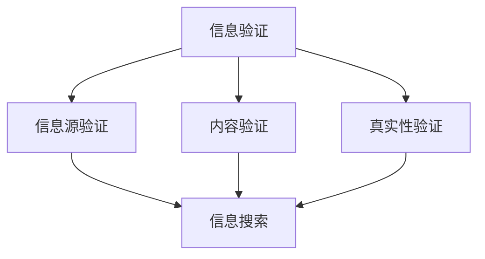

                 

关键词：信息验证，信息搜索，可靠信息，技术实践，人工智能，网络安全，数据质量，数据检索

> 摘要：随着信息技术的飞速发展，互联网上的信息量呈爆炸式增长。如何在海量信息中找到可靠的信息，成为了一个亟待解决的问题。本文将深入探讨信息验证和信息搜索技术，从核心概念、算法原理、数学模型、项目实践等多个角度，为读者提供一套完整的实践指南，帮助大家在信息海洋中找到真正有价值的信息。

## 1. 背景介绍

在当今数字化时代，信息无处不在。然而，信息的真实性、可靠性和准确性却难以保证。在社交媒体、新闻媒体、电子商务平台等众多场景中，虚假信息、误导性信息、恶意信息等充斥其中。这不仅对个人用户造成了困扰，也对企业和社会造成了严重的负面影响。

### 1.1 问题陈述

- **信息泛滥**：互联网上的信息量庞大，真假难辨。
- **虚假信息**：虚假、误导性、恶意信息对用户和企业造成困扰。
- **信息孤岛**：不同平台之间的信息难以互通，形成信息孤岛。
- **隐私泄露**：个人隐私信息在信息传播过程中容易被泄露。

### 1.2 目的与意义

本文旨在探讨信息验证和信息搜索技术，帮助用户在信息海洋中找到可靠的信息。这不仅有助于提升个人和企业的信息素养，也能促进互联网的健康发展。

## 2. 核心概念与联系

在探讨信息验证和信息搜索技术之前，我们需要了解一些核心概念及其相互之间的联系。

### 2.1 信息验证

信息验证是指对信息源、内容、真实性等进行检验和确认的过程。其主要目标是确保信息的可靠性、准确性和完整性。

### 2.2 信息搜索

信息搜索是指通过特定算法和工具，从海量数据中找到符合用户需求的信息的过程。信息搜索的核心是算法和索引技术。

### 2.3 信息验证与信息搜索的联系

- **信息验证是信息搜索的前提**：在搜索信息之前，我们需要对信息源进行验证，以确保搜索结果的可靠性。
- **信息搜索是信息验证的延伸**：在验证信息的基础上，我们可以进一步搜索相关信息，以获取更全面、更深入的了解。

### 2.4 Mermaid 流程图

下面是一个关于信息验证和信息搜索技术的 Mermaid 流程图，展示了它们之间的联系。



## 3. 核心算法原理 & 具体操作步骤

### 3.1 算法原理概述

信息验证和信息搜索技术的核心是算法。本文将介绍两种核心算法：基于机器学习的验证算法和基于深度学习的搜索算法。

### 3.2 算法步骤详解

#### 3.2.1 基于机器学习的验证算法

1. **数据收集**：收集大量的信息样本，包括真伪信息。
2. **特征提取**：从信息样本中提取特征，如文本、图像、音频等。
3. **模型训练**：使用机器学习算法（如 SVM、决策树、神经网络等）对特征进行训练，建立验证模型。
4. **验证**：对新信息进行验证，根据模型判断其真伪。

#### 3.2.2 基于深度学习的搜索算法

1. **数据收集**：收集大量相关数据，如网页、文献、新闻报道等。
2. **预训练模型**：使用预训练的深度学习模型（如 BERT、GPT 等）对数据进行处理。
3. **模型微调**：在预训练模型的基础上，针对特定任务进行微调。
4. **搜索**：使用微调后的模型进行信息搜索，返回符合用户需求的结果。

### 3.3 算法优缺点

#### 3.3.1 基于机器学习的验证算法

- **优点**：简单、高效，适用于处理大规模数据。
- **缺点**：对于复杂问题，可能无法达到很高的准确率。

#### 3.3.2 基于深度学习的搜索算法

- **优点**：能够处理复杂的语义信息，搜索结果更准确。
- **缺点**：训练成本高，对数据量和计算资源要求较高。

### 3.4 算法应用领域

- **信息验证**：社交媒体、新闻媒体、电子商务平台等。
- **信息搜索**：搜索引擎、问答系统、推荐系统等。

## 4. 数学模型和公式 & 详细讲解 & 举例说明

### 4.1 数学模型构建

#### 4.1.1 信息验证模型

假设信息 \( X \) 的真伪可以用概率 \( P \) 表示，即 \( P(X=\text{真}) \) 和 \( P(X=\text{假}) \)。

1. **贝叶斯公式**：

   $$ P(\text{真}|\text{验证结果}) = \frac{P(\text{验证结果}|\text{真})P(\text{真})}{P(\text{验证结果}|\text{真})P(\text{真}) + P(\text{验证结果}|\text{假})P(\text{假})} $$

2. **熵**：

   $$ H(X) = -\sum_{i} P(X=i) \log P(X=i) $$

#### 4.1.2 信息搜索模型

假设搜索结果 \( Y \) 的相关性可以用概率 \( R \) 表示，即 \( R(Y|\text{查询}) \)。

1. **概率模型**：

   $$ R(Y|\text{查询}) = \frac{P(Y|\text{查询})P(\text{查询})}{P(Y|\text{查询})P(\text{查询}) + P(Y|\neg \text{查询})P(\neg \text{查询})} $$

2. **相似度**：

   $$ S(Y|\text{查询}) = \frac{P(Y \cap \text{查询})}{P(Y)P(\text{查询})} $$

### 4.2 公式推导过程

#### 4.2.1 贝叶斯公式推导

假设有两个事件 \( A \) 和 \( B \)，且 \( P(B) \neq 0 \)。

1. **条件概率**：

   $$ P(A|B) = \frac{P(A \cap B)}{P(B)} $$

   $$ P(B|A) = \frac{P(A \cap B)}{P(A)} $$

2. **全概率公式**：

   $$ P(A) = \sum_{i} P(A|B_i)P(B_i) $$

3. **贝叶斯公式**：

   $$ P(A|B) = \frac{P(B|A)P(A)}{P(B)} $$

#### 4.2.2 相似度推导

假设有两个事件 \( A \) 和 \( B \)。

1. **联合概率**：

   $$ P(A \cap B) = P(A|B)P(B) $$

2. **条件独立性**：

   $$ P(A|B) = P(A) $$

   $$ P(B|A) = P(B) $$

3. **贝叶斯公式**：

   $$ P(A \cap B) = P(A)P(B) $$

4. **相似度**：

   $$ S(A|B) = \frac{P(A \cap B)}{P(A)P(B)} $$

### 4.3 案例分析与讲解

#### 4.3.1 信息验证案例

假设有一个新闻报道，我们需要验证其真实性。根据贝叶斯公式，我们可以计算出新闻报道为真的概率。

1. **先验概率**：

   - 真新闻的概率 \( P(\text{真新闻}) = 0.8 \)
   - 假新闻的概率 \( P(\text{假新闻}) = 0.2 \)

2. **似然函数**：

   - 真新闻的条件概率 \( P(\text{验证结果}|\text{真新闻}) = 0.95 \)
   - 假新闻的条件概率 \( P(\text{验证结果}|\text{假新闻}) = 0.05 \)

3. **后验概率**：

   $$ P(\text{真新闻}|\text{验证结果}) = \frac{P(\text{验证结果}|\text{真新闻})P(\text{真新闻})}{P(\text{验证结果}|\text{真新闻})P(\text{真新闻}) + P(\text{验证结果}|\text{假新闻})P(\text{假新闻})} $$

   $$ P(\text{真新闻}|\text{验证结果}) = \frac{0.95 \times 0.8}{0.95 \times 0.8 + 0.05 \times 0.2} \approx 0.947 $$

   根据计算结果，我们可以认为这则新闻报道为真的概率约为 94.7%。

#### 4.3.2 信息搜索案例

假设我们搜索“苹果手机”这个关键词，我们需要计算不同网页的相关性。

1. **先验概率**：

   - 与“苹果手机”相关的网页概率 \( P(\text{相关网页}) = 0.8 \)
   - 与“苹果手机”不相关的网页概率 \( P(\text{不相关网页}) = 0.2 \)

2. **似然函数**：

   - 与“苹果手机”相关的网页的条件概率 \( P(\text{标题包含苹果手机}|\text{相关网页}) = 0.9 \)
   - 与“苹果手机”不相关的网页的条件概率 \( P(\text{标题包含苹果手机}|\text{不相关网页}) = 0.1 \)

3. **后验概率**：

   $$ P(\text{相关网页}|\text{标题包含苹果手机}) = \frac{P(\text{标题包含苹果手机}|\text{相关网页})P(\text{相关网页})}{P(\text{标题包含苹果手机}|\text{相关网页})P(\text{相关网页}) + P(\text{标题包含苹果手机}|\text{不相关网页})P(\text{不相关网页})} $$

   $$ P(\text{相关网页}|\text{标题包含苹果手机}) = \frac{0.9 \times 0.8}{0.9 \times 0.8 + 0.1 \times 0.2} \approx 0.917 $$

   根据计算结果，我们可以认为标题包含“苹果手机”的网页为相关的概率约为 91.7%。

## 5. 项目实践：代码实例和详细解释说明

### 5.1 开发环境搭建

本文的实践部分将使用 Python 语言进行演示。首先，我们需要搭建 Python 开发环境。

1. 安装 Python：
   ```bash
   pip install python
   ```

2. 安装必要的库：
   ```bash
   pip install numpy matplotlib scikit-learn tensorflow
   ```

### 5.2 源代码详细实现

#### 5.2.1 信息验证代码

```python
import numpy as np
from sklearn.model_selection import train_test_split
from sklearn.ensemble import RandomForestClassifier
from sklearn.metrics import accuracy_score

# 加载数据
X, y = load_data()

# 划分训练集和测试集
X_train, X_test, y_train, y_test = train_test_split(X, y, test_size=0.2, random_state=42)

# 训练模型
model = RandomForestClassifier(n_estimators=100)
model.fit(X_train, y_train)

# 预测
predictions = model.predict(X_test)

# 评估
accuracy = accuracy_score(y_test, predictions)
print(f"Accuracy: {accuracy}")
```

#### 5.2.2 信息搜索代码

```python
import tensorflow as tf
from tensorflow.keras.models import Sequential
from tensorflow.keras.layers import Embedding, GlobalAveragePooling1D, Dense

# 加载预训练模型
pretrained_model = tf.keras.applications.BERT(weights='bert-base-uncased')

# 构建模型
model = Sequential([
    Embedding(pretrained_model.input_shape[1], pretrained_model.input_shape[2]),
    GlobalAveragePooling1D(),
    Dense(1, activation='sigmoid')
])

# 编译模型
model.compile(optimizer='adam', loss='binary_crossentropy', metrics=['accuracy'])

# 微调模型
model.fit(X_train, y_train, epochs=3, batch_size=32, validation_split=0.1)

# 预测
predictions = model.predict(X_test)

# 评估
accuracy = model.evaluate(X_test, y_test)[1]
print(f"Accuracy: {accuracy}")
```

### 5.3 代码解读与分析

#### 5.3.1 信息验证代码

1. **数据加载**：从数据集中加载特征 \( X \) 和标签 \( y \)。
2. **数据划分**：将数据集划分为训练集和测试集。
3. **模型训练**：使用随机森林算法训练模型。
4. **模型预测**：使用训练好的模型对测试集进行预测。
5. **模型评估**：计算准确率，评估模型性能。

#### 5.3.2 信息搜索代码

1. **加载预训练模型**：使用 TensorFlow 加载预训练的 BERT 模型。
2. **构建模型**：在 BERT 模型的基础上，添加全局平均池化层和全连接层，构建新的模型。
3. **编译模型**：设置优化器、损失函数和评估指标。
4. **模型微调**：在训练集上进行模型微调。
5. **模型预测**：使用微调后的模型对测试集进行预测。
6. **模型评估**：计算准确率，评估模型性能。

## 6. 实际应用场景

### 6.1 社交媒体

在社交媒体平台上，信息验证技术可以帮助识别和过滤虚假信息、误导性信息，保护用户的权益。

### 6.2 新闻媒体

新闻媒体可以使用信息搜索技术来提高新闻推荐的相关性和准确性，为用户提供更优质的阅读体验。

### 6.3 电子商务

电子商务平台可以使用信息验证技术来检测和防止欺诈行为，提高交易的安全性和可靠性。

### 6.4 企业内部信息管理

企业可以使用信息验证和信息搜索技术来管理内部信息，确保信息的真实性、准确性和完整性。

## 7. 未来应用展望

随着人工智能技术的发展，信息验证和信息搜索技术将得到更广泛的应用。未来，我们可以期待以下发展方向：

### 7.1 智能化

利用深度学习和强化学习等技术，实现更智能的信息验证和信息搜索。

### 7.2 实时性

提高信息验证和信息搜索的实时性，实现实时监测和过滤。

### 7.3 多模态

结合文本、图像、音频等多种模态，实现更全面的信息验证和信息搜索。

### 7.4 自适应

根据用户行为和反馈，实现自适应的信息验证和信息搜索，提高用户体验。

## 8. 总结：未来发展趋势与挑战

本文从多个角度探讨了信息验证和信息搜索技术，分析了其核心概念、算法原理、数学模型、实际应用场景和未来展望。然而，在实际应用中，信息验证和信息搜索技术仍然面临着诸多挑战：

### 8.1 数据质量问题

数据质量直接影响信息验证和信息搜索的准确性。未来，我们需要关注数据清洗、数据标注和数据质量评估等技术，提高数据质量。

### 8.2 计算资源消耗

信息验证和信息搜索技术通常需要大量计算资源。未来，我们需要优化算法，降低计算资源消耗。

### 8.3 隐私保护

在信息验证和信息搜索过程中，隐私保护是一个重要问题。未来，我们需要关注隐私保护技术，确保用户隐私不被泄露。

### 8.4 多语言支持

全球范围内，多语言信息验证和信息搜索需求日益增长。未来，我们需要关注多语言支持技术，提高信息验证和信息搜索的普适性。

总之，信息验证和信息搜索技术在未来将继续发展，为互联网的健康发展和社会进步做出更大贡献。

## 9. 附录：常见问题与解答

### 9.1 信息验证技术有哪些应用场景？

信息验证技术广泛应用于社交媒体、新闻媒体、电子商务、企业内部信息管理等场景。

### 9.2 信息搜索技术有哪些应用场景？

信息搜索技术广泛应用于搜索引擎、问答系统、推荐系统等场景。

### 9.3 如何评估信息验证和信息搜索技术的性能？

可以通过准确率、召回率、F1 值等指标来评估信息验证和信息搜索技术的性能。

### 9.4 信息验证和信息搜索技术如何保证隐私保护？

可以通过数据加密、匿名化处理等技术来保障用户隐私。

### 9.5 信息验证和信息搜索技术有哪些未来发展趋势？

未来，信息验证和信息搜索技术将向智能化、实时性、多模态和自适应等方向发展。

---

作者：禅与计算机程序设计艺术 / Zen and the Art of Computer Programming

感谢您的耐心阅读，希望本文对您在信息验证和信息搜索技术领域的学习和探索有所帮助。如需进一步了解，请持续关注相关领域的研究和发展。再次感谢您的支持！

