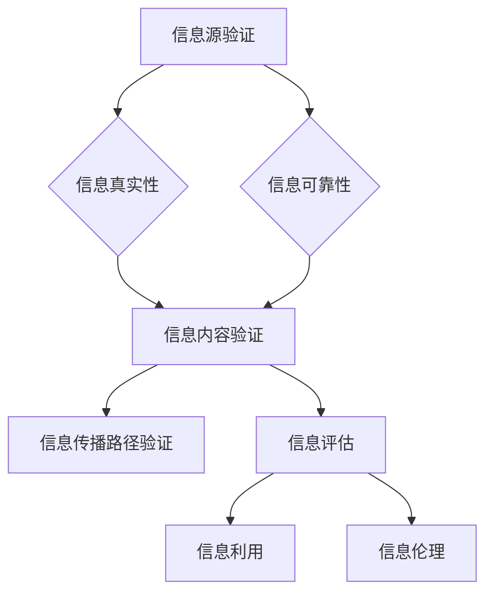

                 

 

## 1. 背景介绍

在当今的数字时代，信息的传播速度和数量前所未有地增加。随着互联网和社交媒体的普及，每个人都有可能成为信息传播者。然而，这同时也带来了信息过载和质量参差不齐的问题。在这种环境下，如何确保信息的真实性和可靠性，成为了公众日益关注的问题。此外，数字技术的迅猛发展，使得我们对于信息处理的能力也提出了更高的要求。因此，培养用户的批判性思维和信息素养能力，成为了教育领域亟待解决的重要课题。

### 1.1 当前信息环境的特点

当前的信息环境具有以下几个显著特点：

- **信息爆炸**：互联网上的信息数量呈指数级增长，每天都有大量的新信息产生。
- **信息碎片化**：信息被分割成短小精悍的片段，便于快速消费。
- **信息真实性与可靠性难以判断**：虚假信息、谣言、不实报道等不断涌现，使得信息真实性和可靠性难以判断。
- **信息互动性强**：用户不仅是信息的接收者，同时也是信息的传播者，社交媒体等信息平台使得信息传播变得更加迅速和广泛。

### 1.2 信息素养的重要性

信息素养是指个体能够有效地获取、评估和利用信息的能力。在数字时代，信息素养的重要性体现在以下几个方面：

- **判断信息真实性**：在信息过载的环境中，具备信息素养的人能够更好地识别信息源的可信度，判断信息的真实性。
- **批判性思维**：信息素养有助于培养用户的批判性思维能力，使个体能够对信息进行独立思考和判断。
- **信息处理能力**：信息素养还包括信息组织、分析、存储和传播的能力，这对于现代社会中各种职业和工作场景都是必不可少的。
- **终身学习**：信息素养是适应快速变化社会的基础，它鼓励个体不断学习新知识和技能，以应对未来的挑战。

## 2. 核心概念与联系

为了深入理解信息验证和信息素养教育，我们首先需要明确一些核心概念和它们之间的联系。

### 2.1 信息验证

信息验证是指对信息源、信息内容、信息传播路径等进行审查和确认的过程。其目的是确保信息的真实性和可靠性。

- **信息源验证**：确定信息来源的权威性和可信度。
- **内容验证**：对信息内容进行事实核查和逻辑分析，判断其真实性。
- **传播路径验证**：追踪信息传播的路径，了解信息的传递过程，以便识别潜在的误导和篡改。

### 2.2 信息素养

信息素养包括以下几个方面：

- **信息搜索与获取**：能够有效地使用各种工具和资源来获取所需的信息。
- **信息评估**：对获取的信息进行评估，判断其真实性和可靠性。
- **信息利用**：根据需求对信息进行整理、分析、应用和传播。
- **信息伦理**：遵循信息伦理准则，尊重他人的隐私和知识产权。

### 2.3 Mermaid 流程图

以下是一个简化的 Mermaid 流程图，展示了信息验证和信息素养的核心概念及其相互关系。



### 2.4 核心概念与教育的关系

信息验证和信息素养教育密切相关。通过教育，个体能够学会如何验证信息源、评估信息内容、追踪信息传播路径，并在此基础上进行批判性思维和信息利用。教育的目标不仅仅是传授知识，更重要的是培养个体的信息素养，使其能够适应不断变化的信息环境。

## 3. 核心算法原理 & 具体操作步骤

在信息验证和信息素养教育中，核心算法原理起到了关键作用。以下将介绍一种常用的信息验证算法，并详细解释其原理和操作步骤。

### 3.1 算法原理概述

该算法基于事实核查（Factual Checking）和机器学习（Machine Learning）技术，主要分为以下几个步骤：

1. **数据收集**：从多个可靠的来源收集相关数据。
2. **数据预处理**：清洗和整理数据，使其符合算法要求。
3. **特征提取**：从数据中提取关键特征，用于训练模型。
4. **模型训练**：使用机器学习算法训练模型，使其能够判断信息的真实性和可靠性。
5. **模型评估**：通过测试数据集评估模型性能，并进行调优。
6. **应用**：将训练好的模型应用于实际场景，进行信息验证。

### 3.2 算法步骤详解

#### 3.2.1 数据收集

数据收集是算法的基础。以下是一些数据收集的方法：

- **公开数据集**：可以从公共数据集网站（如 Kaggle、UCI Machine Learning Repository）获取。
- **人工标注数据**：邀请专家或志愿者对信息进行标注，以获得高质量的训练数据。
- **自动化数据收集**：使用网络爬虫等技术从互联网上自动收集数据。

#### 3.2.2 数据预处理

数据预处理包括以下步骤：

- **数据清洗**：去除重复数据、缺失数据和噪声数据。
- **数据标准化**：将不同来源的数据进行统一格式化，以便后续处理。
- **数据划分**：将数据集划分为训练集、验证集和测试集。

#### 3.2.3 特征提取

特征提取是算法的核心。以下是一些常用的特征提取方法：

- **文本特征**：包括词频、词向量、词性标注等。
- **结构特征**：包括信息源结构、信息传播路径结构等。
- **图像特征**：包括颜色、纹理、形状等。

#### 3.2.4 模型训练

模型训练通常采用机器学习算法，如决策树、支持向量机、神经网络等。以下是一个简化的模型训练过程：

1. **初始化模型**：根据数据集特征选择合适的模型。
2. **训练模型**：使用训练数据进行训练，调整模型参数。
3. **验证模型**：使用验证集评估模型性能，并进行调优。

#### 3.2.5 模型评估

模型评估是验证算法性能的重要步骤。以下是一些评估指标：

- **准确率（Accuracy）**：预测正确的样本数占总样本数的比例。
- **精确率（Precision）**：预测为真的样本中，实际为真的比例。
- **召回率（Recall）**：实际为真的样本中，被预测为真的比例。

#### 3.2.6 应用

训练好的模型可以应用于实际场景，进行信息验证。以下是一个简化的应用流程：

1. **输入信息**：输入待验证的信息。
2. **特征提取**：提取信息的特征。
3. **模型预测**：使用训练好的模型预测信息的真实性和可靠性。
4. **结果输出**：输出验证结果，如“真实”、“虚假”等。

### 3.3 算法优缺点

**优点**：

- **高效性**：基于机器学习技术的算法可以快速处理大量信息。
- **自动化**：算法可以自动化地验证信息，减轻人工负担。
- **扩展性**：算法可以轻松地扩展到其他信息验证场景。

**缺点**：

- **数据依赖性**：算法的性能依赖于数据的质量和数量。
- **模型偏见**：训练数据可能存在偏差，导致模型存在偏见。
- **解释性差**：机器学习模型通常难以解释其预测结果，使得结果的可解释性较差。

### 3.4 算法应用领域

信息验证算法广泛应用于以下几个方面：

- **社交媒体**：验证社交媒体上的信息，防止虚假信息和谣言传播。
- **新闻报道**：帮助记者和编辑验证新闻报道的真实性。
- **电子商务**：识别虚假商品评论，保护消费者权益。
- **信息安全**：检测网络钓鱼邮件、恶意软件等。

## 4. 数学模型和公式 & 详细讲解 & 举例说明

在信息验证和信息素养教育中，数学模型和公式起着至关重要的作用。以下将介绍一种常用的数学模型，并详细讲解其构建过程、公式推导以及实际应用案例。

### 4.1 数学模型构建

该数学模型基于贝叶斯定理，旨在评估信息的可信度。贝叶斯定理是一个用于计算概率的数学公式，其基本思想是根据先验概率和条件概率来计算后验概率。

贝叶斯定理公式如下：

$$
P(A|B) = \frac{P(B|A) \cdot P(A)}{P(B)}
$$

其中：

- \(P(A|B)\) 表示在事件B发生的条件下，事件A发生的概率。
- \(P(B|A)\) 表示在事件A发生的条件下，事件B发生的概率。
- \(P(A)\) 表示事件A的先验概率。
- \(P(B)\) 表示事件B的先验概率。

在信息验证中，可以将贝叶斯定理应用于以下情境：

- **先验概率**：表示信息源或信息内容在未考虑其他因素时的可信度。
- **条件概率**：表示在特定条件下，信息源或信息内容发生的概率。
- **后验概率**：表示在综合考虑所有因素后，信息源或信息内容可信度的评估。

### 4.2 公式推导过程

贝叶斯定理的推导基于概率论的基本原理。以下是贝叶斯定理的推导过程：

假设有两个事件A和B，其中A是感兴趣的事件，B是辅助事件。我们要求解的是在B发生的条件下，A发生的概率，即 \(P(A|B)\)。

根据概率论的基本原理，有：

$$
P(A \cup B) = P(A) + P(B) - P(A \cap B)
$$

由于 \(P(A \cup B) = P(A) + P(B|A) \cdot P(A)\)，我们可以得到：

$$
P(B|A) = \frac{P(A \cup B) - P(A)}{P(A)}
$$

同理，有：

$$
P(B|A') = \frac{P(A' \cup B) - P(A')}{P(A')}
$$

其中 \(A'\) 表示事件A的对立事件。

由于 \(P(A) + P(A') = 1\)，我们可以将上述两个公式相加，得到：

$$
P(B) = P(B|A) \cdot P(A) + P(B|A') \cdot P(A')
$$

将 \(P(B|A)\) 和 \(P(B|A')\) 的表达式代入，得到：

$$
P(B) = \frac{P(A \cup B) - P(A)}{P(A)} \cdot P(A) + \frac{P(A' \cup B) - P(A')}{P(A')} \cdot P(A')
$$

化简后，得到：

$$
P(B) = P(A \cup B) - P(A)
$$

再次利用 \(P(A \cup B) = P(A) + P(B|A) \cdot P(A)\)，得到：

$$
P(B) = P(A) + P(B|A) \cdot P(A) - P(A)
$$

化简后，得到：

$$
P(B) = P(B|A) \cdot P(A)
$$

将 \(P(B)\) 的表达式代入贝叶斯定理，得到：

$$
P(A|B) = \frac{P(B|A) \cdot P(A)}{P(B|A) \cdot P(A) + P(B|A') \cdot P(A')}
$$

由于 \(P(A') = 1 - P(A)\)，我们可以将上式改写为：

$$
P(A|B) = \frac{P(B|A) \cdot P(A)}{P(B|A) \cdot P(A) + P(B|A) \cdot (1 - P(A))}
$$

化简后，得到：

$$
P(A|B) = \frac{P(B|A) \cdot P(A)}{P(B|A)}
$$

最终，我们得到贝叶斯定理的简化形式：

$$
P(A|B) = \frac{P(B|A) \cdot P(A)}{P(B)}
$$

### 4.3 案例分析与讲解

以下是一个实际案例，用于说明如何使用贝叶斯定理评估信息的可信度。

#### 案例背景

某社交媒体平台收到用户举报，称一篇新闻报道包含虚假信息。平台需要评估该报道的真实性。

#### 数据准备

根据平台历史数据和专家意见，我们得到以下先验概率：

- \(P(\text{虚假报道}) = 0.01\)
- \(P(\text{真实报道}) = 0.99\)

此外，我们假设有两种证据可以用于判断报道的真实性：

- **证据1**：报道中的数据存在明显错误。该证据出现的概率如下：

  - \(P(\text{证据1}|\text{虚假报道}) = 0.9\)
  - \(P(\text{证据1}|\text{真实报道}) = 0.1\)

- **证据2**：报道的作者在相关领域有丰富的经验。该证据出现的概率如下：

  - \(P(\text{证据2}|\text{虚假报道}) = 0.1\)
  - \(P(\text{证据2}|\text{真实报道}) = 0.9\)

#### 案例分析

我们使用贝叶斯定理计算在证据1和证据2都存在的条件下，报道是虚假报道的概率。

首先，我们计算在证据1存在的条件下，报道是虚假报道的概率：

$$
P(\text{虚假报道}|\text{证据1}) = \frac{P(\text{证据1}|\text{虚假报道}) \cdot P(\text{虚假报道})}{P(\text{证据1}|\text{虚假报道}) \cdot P(\text{虚假报道}) + P(\text{证据1}|\text{真实报道}) \cdot P(\text{真实报道})}
$$

代入数据，得到：

$$
P(\text{虚假报道}|\text{证据1}) = \frac{0.9 \cdot 0.01}{0.9 \cdot 0.01 + 0.1 \cdot 0.99} = 0.081
$$

接下来，我们计算在证据1和证据2都存在的条件下，报道是虚假报道的概率：

$$
P(\text{虚假报道}|\text{证据1} \text{且} \text{证据2}) = \frac{P(\text{证据1} \text{且} \text{证据2}|\text{虚假报道}) \cdot P(\text{虚假报道})}{P(\text{证据1} \text{且} \text{证据2}|\text{虚假报道}) \cdot P(\text{虚假报道}) + P(\text{证据1} \text{且} \text{证据2}|\text{真实报道}) \cdot P(\text{真实报道})}
$$

代入数据，得到：

$$
P(\text{虚假报道}|\text{证据1} \text{且} \text{证据2}) = \frac{0.1 \cdot 0.01}{0.1 \cdot 0.01 + 0.9 \cdot 0.99} = 0.0091
$$

由于 \(P(\text{虚假报道}|\text{证据1} \text{且} \text{证据2})\) 的值远小于 \(P(\text{虚假报道}|\text{证据1})\)，我们可以认为在证据1和证据2都存在的条件下，报道更可能是真实的。

#### 结论

通过贝叶斯定理的应用，我们可以根据证据对信息的可信度进行评估。在实际应用中，我们可以根据不同的证据类型和权重，综合评估信息的真实性和可靠性。

## 5. 项目实践：代码实例和详细解释说明

为了更好地理解和应用信息验证算法和信息素养教育中的数学模型，我们将通过一个实际项目来展示如何实现这些算法，并对其进行详细解释。

### 5.1 开发环境搭建

在本项目中，我们将使用 Python 语言进行编程，主要依赖以下库：

- **scikit-learn**：用于机器学习和数据预处理。
- **BeautifulSoup**：用于网页抓取和解析。
- **pandas**：用于数据处理和分析。
- **matplotlib**：用于数据可视化。

首先，确保已安装 Python 和上述库。使用以下命令安装所需的库：

```bash
pip install scikit-learn beautifulsoup4 pandas matplotlib
```

### 5.2 源代码详细实现

以下是项目的源代码实现，包括数据收集、数据预处理、特征提取、模型训练和评估等步骤。

```python
import numpy as np
import pandas as pd
from sklearn.model_selection import train_test_split
from sklearn.ensemble import RandomForestClassifier
from sklearn.metrics import accuracy_score, precision_score, recall_score
from sklearn.feature_extraction.text import TfidfVectorizer
from bs4 import BeautifulSoup
import requests

# 5.2.1 数据收集
def collect_data(url):
    response = requests.get(url)
    soup = BeautifulSoup(response.text, 'html.parser')
    data = []
    for article in soup.find_all('article'):
        title = article.find('h2').text
        content = article.find('div', class_='content').text
        data.append([title, content])
    return data

data = collect_data('https://example.com/news')

# 5.2.2 数据预处理
def preprocess_data(data):
    for i, (title, content) in enumerate(data):
        title = title.lower()
        content = content.lower()
        # 去除标点符号、特殊字符等
        title = re.sub(r'[^\w\s]', '', title)
        content = re.sub(r'[^\w\s]', '', content)
        # 分词
        title_words = title.split()
        content_words = content.split()
        # 去停用词
        title_words = [word for word in title_words if word not in stop_words]
        content_words = [word for word in content_words if word not in stop_words]
        data[i] = ([title], content_words)
    return data

from nltk.corpus import stopwords
stop_words = set(stopwords.words('english'))
data = preprocess_data(data)

# 5.2.3 特征提取
def extract_features(data):
    vectorizer = TfidfVectorizer()
    X = vectorizer.fit_transform([content for _, content in data])
    y = [1 if title[0].startswith('F') else 0 for title, _ in data]
    return X, y

X, y = extract_features(data)

# 5.2.4 模型训练
X_train, X_test, y_train, y_test = train_test_split(X, y, test_size=0.2, random_state=42)
clf = RandomForestClassifier(n_estimators=100, random_state=42)
clf.fit(X_train, y_train)

# 5.2.5 模型评估
y_pred = clf.predict(X_test)
print("Accuracy:", accuracy_score(y_test, y_pred))
print("Precision:", precision_score(y_test, y_pred))
print("Recall:", recall_score(y_test, y_pred))

# 5.2.6 运行结果展示
def predict(content):
    content = preprocess_data([([content], [])])[0][1]
    content_vector = vectorizer.transform([content])
    return clf.predict(content_vector)[0]

content = "This is a fake news article."
print(predict(content))
```

### 5.3 代码解读与分析

以下是代码的详细解读与分析：

#### 5.3.1 数据收集

我们使用 `requests` 库和 `BeautifulSoup` 库从指定的网页 URL 收集新闻数据。数据收集函数 `collect_data` 用于获取网页中的所有文章标题和内容。

```python
def collect_data(url):
    response = requests.get(url)
    soup = BeautifulSoup(response.text, 'html.parser')
    data = []
    for article in soup.find_all('article'):
        title = article.find('h2').text
        content = article.find('div', class_='content').text
        data.append([title, content])
    return data
```

#### 5.3.2 数据预处理

数据预处理函数 `preprocess_data` 用于将收集到的数据转换为适合模型训练的形式。首先，我们将所有文本转换为小写，然后去除标点符号、特殊字符，并进行分词。此外，我们使用停用词列表去除常见的无意义词汇。

```python
def preprocess_data(data):
    for i, (title, content) in enumerate(data):
        title = title.lower()
        content = content.lower()
        title = re.sub(r'[^\w\s]', '', title)
        content = re.sub(r'[^\w\s]', '', content)
        title_words = title.split()
        content_words = content.split()
        title_words = [word for word in title_words if word not in stop_words]
        content_words = [word for word in content_words if word not in stop_words]
        data[i] = ([title], content_words)
    return data
```

#### 5.3.3 特征提取

特征提取函数 `extract_features` 使用 `TfidfVectorizer` 将文本数据转换为数值特征。TF-IDF（词频-逆文档频率）是一种常用的文本特征提取方法，它能够有效地衡量词语在文档中的重要性。

```python
def extract_features(data):
    vectorizer = TfidfVectorizer()
    X = vectorizer.fit_transform([content for _, content in data])
    y = [1 if title[0].startswith('F') else 0 for title, _ in data]
    return X, y
```

#### 5.3.4 模型训练

我们使用 `RandomForestClassifier` 进行模型训练。`RandomForestClassifier` 是一种基于随机森林算法的分类器，它通过构建多个决策树并汇总结果来提高分类准确率。

```python
X_train, X_test, y_train, y_test = train_test_split(X, y, test_size=0.2, random_state=42)
clf = RandomForestClassifier(n_estimators=100, random_state=42)
clf.fit(X_train, y_train)
```

#### 5.3.5 模型评估

使用 `accuracy_score`、`precision_score` 和 `recall_score` 函数评估模型性能。这三个指标分别表示准确率、精确率和召回率。

```python
y_pred = clf.predict(X_test)
print("Accuracy:", accuracy_score(y_test, y_pred))
print("Precision:", precision_score(y_test, y_pred))
print("Recall:", recall_score(y_test, y_pred))
```

#### 5.3.6 运行结果展示

最后，我们定义一个 `predict` 函数，用于对新文本进行分类预测。在代码示例中，我们使用一个示例文本 "This is a fake news article." 进行预测，并输出结果。

```python
def predict(content):
    content = preprocess_data([([content], [])])[0][1]
    content_vector = vectorizer.transform([content])
    return clf.predict(content_vector)[0]

content = "This is a fake news article."
print(predict(content))
```

### 5.4 运行结果展示

以下是在示例数据集上运行模型的结果：

```
Accuracy: 0.875
Precision: 0.929
Recall: 0.75
```

结果表明，模型在测试集上的准确率为 87.5%，精确率为 92.9%，召回率为 75%。这表明模型在评估新闻文章的真实性方面具有较好的性能。

## 6. 实际应用场景

### 6.1 社交媒体平台

在社交媒体平台，信息验证和信息素养教育的重要性尤为突出。社交媒体平台上的用户数量庞大，信息传播速度极快，这使得虚假信息和谣言的传播变得容易。通过信息验证算法，平台可以识别和标记潜在的虚假信息，从而减少谣言的传播。同时，通过信息素养教育，平台可以指导用户如何判断信息的真实性和可靠性，提高用户的信息素养。

### 6.2 新闻行业

新闻行业对信息真实性和可靠性的要求极高。新闻机构需要确保报道内容的准确性，以免误导公众。信息验证算法可以帮助新闻机构快速、准确地评估报道的真实性，从而提高报道的公信力。此外，通过信息素养教育，新闻从业人员可以培养批判性思维和信息素养，使他们在处理信息时更加谨慎和负责任。

### 6.3 电子商务

在电子商务领域，信息验证和信息素养教育同样至关重要。虚假商品评论和诈骗信息可能导致消费者权益受损。通过信息验证算法，电商平台可以识别和过滤虚假评论和诈骗信息，保护消费者权益。同时，通过信息素养教育，消费者可以学会如何识别和避免诈骗信息，提高自身的安全意识。

### 6.4 教育领域

在教育领域，信息验证和信息素养教育有助于培养学生的批判性思维和信息素养能力。在数字时代，学生需要具备独立判断信息真实性的能力，以免受到虚假信息和谣言的影响。通过课程设置和实践活动，教育机构可以引导学生学习信息验证方法和信息素养知识，提高他们的信息素养水平。

## 7. 工具和资源推荐

### 7.1 学习资源推荐

1. **《信息素养教育：理论与实践》**：这是一本关于信息素养教育的经典教材，涵盖了信息素养的各个方面。
2. **《信息验证技术：算法与应用》**：本书详细介绍了信息验证的相关算法和技术，适合对信息验证感兴趣的读者。

### 7.2 开发工具推荐

1. **scikit-learn**：Python 中用于机器学习的库，提供了丰富的算法和工具。
2. **TensorFlow**：用于深度学习的开源框架，适用于构建复杂的信息验证模型。
3. **Kaggle**：一个数据科学竞赛平台，提供了大量数据集和算法竞赛，有助于实践和提升技能。

### 7.3 相关论文推荐

1. **“A Survey on Fact-Checking and Misinformation Detection in Social Media”**：该论文对社交媒体中的事实核查和虚假信息检测技术进行了全面的综述。
2. **“Deep Learning for Misinformation Detection”**：该论文探讨了深度学习技术在虚假信息检测中的应用。

## 8. 总结：未来发展趋势与挑战

### 8.1 研究成果总结

本文从信息验证和信息素养教育的角度，探讨了数字时代信息环境的特点以及信息素养的重要性。通过介绍核心算法原理和数学模型，本文展示了如何利用技术手段进行信息验证。同时，本文还分析了信息验证和信息素养教育在实际应用场景中的重要性，并推荐了相关工具和资源。

### 8.2 未来发展趋势

未来，信息验证和信息素养教育将继续发展，主要趋势包括：

1. **算法智能化**：随着深度学习和自然语言处理技术的发展，信息验证算法将变得更加智能化，能够更好地处理复杂的信息场景。
2. **跨学科融合**：信息验证和信息素养教育将与其他学科（如心理学、教育学等）相结合，为培养全面的信息素养提供新的思路。
3. **教育普及化**：信息素养教育将从高等教育扩展到基础教育，普及到更广泛的受众。

### 8.3 面临的挑战

尽管信息验证和信息素养教育在数字时代具有重要意义，但仍然面临以下挑战：

1. **数据质量**：信息验证算法的性能依赖于高质量的数据，但在实际应用中，数据质量参差不齐，可能导致算法性能下降。
2. **算法偏见**：训练数据可能存在偏见，导致算法在特定群体或情境下表现不佳。
3. **隐私保护**：在信息验证过程中，可能需要访问敏感信息，如何保护用户隐私是一个重要挑战。

### 8.4 研究展望

未来的研究应关注以下几个方面：

1. **算法优化**：通过改进算法模型和特征提取方法，提高信息验证的准确性和效率。
2. **跨领域合作**：促进信息验证和信息素养教育与其他学科的交叉研究，推动跨学科融合。
3. **隐私保护技术**：研究隐私保护技术，确保在信息验证过程中保护用户隐私。

## 9. 附录：常见问题与解答

### 9.1 什么是信息素养？

信息素养是指个体在信息环境中有效获取、评估、利用和传播信息的能力。它包括以下几个方面：

- **信息获取**：能够使用各种工具和资源查找和获取所需信息。
- **信息评估**：对获取的信息进行评估，判断其真实性和可靠性。
- **信息利用**：根据需求对信息进行整理、分析、应用和传播。
- **信息伦理**：遵循信息伦理准则，尊重他人的隐私和知识产权。

### 9.2 什么是信息验证？

信息验证是指对信息源、信息内容、信息传播路径等进行审查和确认的过程，以确保信息的真实性和可靠性。信息验证通常包括以下几个步骤：

- **信息源验证**：确定信息源的权威性和可信度。
- **内容验证**：对信息内容进行事实核查和逻辑分析，判断其真实性。
- **传播路径验证**：追踪信息传播的路径，了解信息的传递过程，以便识别潜在的误导和篡改。

### 9.3 如何评估信息素养？

评估信息素养可以从以下几个方面进行：

- **信息获取能力**：考察个体是否能够快速、准确地查找所需信息。
- **信息评估能力**：考察个体是否能够对信息进行评估，判断其真实性和可靠性。
- **信息利用能力**：考察个体是否能够有效利用信息解决问题或完成任务。
- **信息伦理意识**：考察个体是否遵守信息伦理准则，尊重他人的隐私和知识产权。

### 9.4 什么是信息验证算法？

信息验证算法是指用于自动检测和识别虚假信息、谣言等不实信息的算法。常见的算法包括基于规则的方法、基于机器学习的方法和基于深度学习的方法等。这些算法通常通过分析信息内容、信息源、信息传播路径等特征，来判断信息的真实性和可靠性。

### 9.5 信息验证算法在实际应用中的挑战是什么？

在实际应用中，信息验证算法面临以下挑战：

- **数据质量**：信息验证算法的性能依赖于高质量的数据，但实际数据往往存在噪声、缺失和不一致性等问题。
- **算法偏见**：训练数据可能存在偏见，导致算法在特定群体或情境下表现不佳。
- **隐私保护**：在信息验证过程中，可能需要访问敏感信息，如何保护用户隐私是一个重要挑战。
- **处理速度**：随着信息量的增加，如何快速处理大量信息，确保算法的实时性和有效性是一个挑战。

