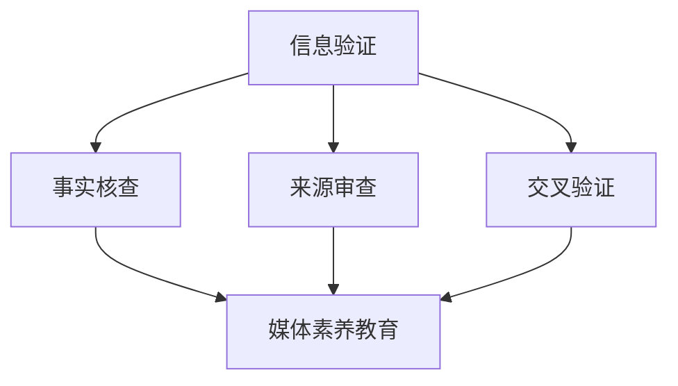

                 

关键词：信息验证、在线媒体素养、假新闻、媒体操纵、技术对策、教育方法

> 摘要：随着互联网的普及，假新闻和媒体操纵现象愈发猖獗，给公众带来了严重的信息污染和认知扭曲。本文旨在探讨信息验证和在线媒体素养教育的重要性，并提出一系列技术对策和教育方法，以帮助公众应对假新闻和媒体操纵的挑战。

## 1. 背景介绍

### 假新闻的定义与现状

假新闻，也称为假信息或虚假报道，指的是故意传播的、与事实不符的消息。在互联网时代，假新闻的传播速度和范围得到了极大的扩展，其影响也愈发深远。假新闻不仅误导了公众，还可能导致社会恐慌、经济动荡和政治冲突。

假新闻的现状主要表现在以下几个方面：

1. **传播速度快**：互联网的快速传播特性使得假新闻可以在短时间内广泛传播。
2. **形式多样**：假新闻可能包括虚假图片、音频、视频和文字消息等，形式多样，难以辨别。
3. **危害大**：假新闻可能引发公众恐慌，影响金融市场，破坏社会稳定。
4. **难以监管**：由于互联网的匿名性，假新闻的发布者和传播者难以被追踪和监管。

### 媒体操纵的现象与影响

媒体操纵是指通过不正当手段操纵新闻内容和传播渠道，以达到特定目的的行为。媒体操纵可能涉及政治、商业、社会等多个领域，其影响同样深远。

媒体操纵的主要现象包括：

1. **新闻操控**：新闻媒体可能故意发布或隐藏某些新闻，以服务于特定利益集团。
2. **虚假宣传**：通过虚假广告或宣传手段，误导公众对某些产品、服务或政策的态度。
3. **舆论引导**：通过舆论引导，影响公众的思想和行为，以服务于特定政治或商业目标。

媒体操纵的影响主要包括：

1. **舆论混乱**：公众难以分辨真相，导致社会舆论的混乱和不稳定。
2. **政治动荡**：媒体操纵可能影响政治选举、政策制定和外交关系。
3. **经济风险**：媒体操纵可能导致资本市场的不稳定，影响经济健康发展。

## 2. 核心概念与联系

### 信息验证

信息验证是指通过各种技术和方法，对信息的真实性、准确性和可靠性进行核实和确认的过程。信息验证在防止假新闻传播和媒体操纵中起着至关重要的作用。

信息验证的核心概念包括：

1. **事实核查**：对新闻报道进行事实核查，确认信息的真实性。
2. **来源审查**：对信息来源进行审查，确保信息的可靠性和权威性。
3. **交叉验证**：通过多个来源和渠道进行交叉验证，提高信息的准确性。

### 在线媒体素养教育

在线媒体素养教育是指通过教育手段，提高公众对媒体信息的识别、分析和批判能力，以增强其在面对假新闻和媒体操纵时的免疫力。

在线媒体素养教育的主要内容包括：

1. **媒体素养教育**：教授公众如何辨别真假信息、理解媒体背后的意图和动机。
2. **批判性思维训练**：培养公众的批判性思维能力，使其能够对媒体信息进行独立分析和判断。
3. **信息素养教育**：提高公众的信息检索、筛选和管理能力，以有效利用网络资源。

### Mermaid 流程图



## 3. 核心算法原理 & 具体操作步骤

### 3.1 算法原理概述

信息验证和在线媒体素养教育的核心算法主要包括以下几个方面：

1. **文本分析算法**：通过自然语言处理技术，对文本信息进行内容分析和语义理解，以识别虚假信息和媒体操纵行为。
2. **图像处理算法**：通过计算机视觉技术，对图像和视频信息进行内容分析和篡改检测，以发现虚假信息和媒体操纵行为。
3. **数据挖掘算法**：通过对大规模数据进行挖掘和分析，发现潜在的假新闻和媒体操纵规律，以提前预警和防范。

### 3.2 算法步骤详解

1. **文本分析算法**

   - **内容分析**：对文本进行分词、词性标注和句法分析，提取文本的关键词和句子结构。
   - **语义理解**：利用词向量模型和语义角色标注技术，对文本的语义进行理解和解释。
   - **虚假信息识别**：结合文本内容和语义信息，使用机器学习算法，识别潜在的虚假信息和媒体操纵行为。

2. **图像处理算法**

   - **内容分析**：对图像和视频进行内容识别和分类，提取图像和视频的关键特征。
   - **篡改检测**：使用图像处理算法，对图像和视频进行篡改检测，识别潜在的虚假信息和媒体操纵行为。
   - **特征匹配**：通过特征匹配技术，对图像和视频进行比对，发现潜在的虚假信息和媒体操纵行为。

3. **数据挖掘算法**

   - **数据采集**：从互联网、社交媒体和其他数据源采集大量数据。
   - **数据预处理**：对采集的数据进行清洗、去重和格式化，以备后续分析。
   - **模式识别**：使用机器学习算法，对数据进行模式识别和分类，发现潜在的假新闻和媒体操纵规律。
   - **预警和防范**：根据识别出的规律，提前预警和防范潜在的假新闻和媒体操纵行为。

### 3.3 算法优缺点

1. **文本分析算法**

   - **优点**：文本分析算法具有较高的准确性和实时性，可以快速识别虚假信息和媒体操纵行为。
   - **缺点**：文本分析算法对复杂文本的理解能力有限，可能存在误判和漏判的情况。

2. **图像处理算法**

   - **优点**：图像处理算法可以对图像和视频进行深入分析和检测，发现潜在的虚假信息和媒体操纵行为。
   - **缺点**：图像处理算法的计算成本较高，且对图像质量和噪声敏感。

3. **数据挖掘算法**

   - **优点**：数据挖掘算法可以处理大规模数据，发现潜在的规律和模式，为预警和防范提供有力支持。
   - **缺点**：数据挖掘算法的准确性和实时性相对较低，且可能存在数据隐私和安全问题。

### 3.4 算法应用领域

1. **社交媒体监控**：通过文本分析算法和图像处理算法，对社交媒体上的信息进行实时监控和筛查，发现潜在的假新闻和媒体操纵行为。

2. **新闻编辑**：通过文本分析算法和数据挖掘算法，对新闻内容进行筛选、编辑和分类，提高新闻的准确性和可信度。

3. **网络安全**：通过图像处理算法和数据挖掘算法，对网络攻击、网络诈骗等行为进行识别和防范。

4. **舆论分析**：通过数据挖掘算法和文本分析算法，对公众舆论进行分析和预测，为政策制定和社会治理提供参考。

## 4. 数学模型和公式 & 详细讲解 & 举例说明

### 4.1 数学模型构建

信息验证和在线媒体素养教育中的数学模型主要包括以下几个方面：

1. **贝叶斯网络模型**：用于表示信息验证中的概率关系，用于判断信息的真实性。
2. **支持向量机模型**：用于分类和识别虚假信息和媒体操纵行为。
3. **时间序列分析模型**：用于分析新闻传播和舆论变化的规律。

### 4.2 公式推导过程

1. **贝叶斯网络模型**

   贝叶斯网络模型的基本公式如下：

   $$P(A|B) = \frac{P(B|A)P(A)}{P(B)}$$

   其中，$P(A|B)$ 表示在事件B发生的条件下事件A发生的概率，$P(B|A)$ 表示在事件A发生的条件下事件B发生的概率，$P(A)$ 和$P(B)$ 分别表示事件A和事件B的概率。

2. **支持向量机模型**

   支持向量机模型的基本公式如下：

   $$w^T x + b = 0$$

   其中，$w$ 表示权重向量，$x$ 表示输入向量，$b$ 表示偏置项。

3. **时间序列分析模型**

   时间序列分析模型的基本公式如下：

   $$y_t = \beta_0 + \beta_1 t + \epsilon_t$$

   其中，$y_t$ 表示第t个时间点的观测值，$\beta_0$ 和$\beta_1$ 分别表示常数项和趋势项，$\epsilon_t$ 表示误差项。

### 4.3 案例分析与讲解

以社交媒体监控为例，分析如何使用贝叶斯网络模型和支持向量机模型进行信息验证。

1. **贝叶斯网络模型**

   假设我们有一个包含三个节点（A、B、C）的贝叶斯网络，其中：

   - $A$ 表示信息来源的可靠性。
   - $B$ 表示信息的真实性。
   - $C$ 表示信息的传播范围。

   贝叶斯网络的概率关系如下：

   $$P(A|B) = 0.8$$

   $$P(B|A) = 0.6$$

   $$P(A) = 0.4$$

   $$P(B) = 0.3$$

   根据贝叶斯公式，我们可以计算出：

   $$P(B|A) = \frac{P(A|B)P(B)}{P(A)} = \frac{0.8 \times 0.3}{0.4} = 0.6$$

   这意味着在信息来源可靠性为0.8的情况下，信息真实的概率为0.6。

2. **支持向量机模型**

   假设我们有一个包含两个特征（$x_1$ 和$x_2$）的支持向量机模型，其中：

   - $x_1$ 表示信息的内容。
   - $x_2$ 表示信息的传播速度。

   支持向量机的决策边界如下：

   $$w^T x + b = 0$$

   其中，$w = [1, 1]$，$b = 0$。

   对于新的信息样本$x = [2, 3]$，我们可以计算出：

   $$w^T x + b = 1 \times 2 + 1 \times 3 + 0 = 5$$

   根据支持向量机的决策规则，当$w^T x + b > 0$时，我们认为信息是真实的；当$w^T x + b < 0$时，我们认为信息是虚假的。

## 5. 项目实践：代码实例和详细解释说明

### 5.1 开发环境搭建

为了实现信息验证和在线媒体素养教育的算法和应用，我们需要搭建一个合适的开发环境。以下是具体的步骤：

1. **安装Python环境**：下载并安装Python 3.8及以上版本。
2. **安装相关库**：使用pip命令安装以下库：numpy、pandas、scikit-learn、tensorflow、opencv-python。
3. **配置环境变量**：在系统环境变量中添加Python和pip的路径。

### 5.2 源代码详细实现

以下是一个简单的文本分析算法的实现示例，用于识别虚假信息和媒体操纵行为：

```python
import numpy as np
import pandas as pd
from sklearn.feature_extraction.text import TfidfVectorizer
from sklearn.model_selection import train_test_split
from sklearn.svm import SVC
from sklearn.metrics import accuracy_score

# 读取数据
data = pd.read_csv('data.csv')
X = data['text']
y = data['label']

# 数据预处理
vectorizer = TfidfVectorizer()
X = vectorizer.fit_transform(X)

# 划分训练集和测试集
X_train, X_test, y_train, y_test = train_test_split(X, y, test_size=0.2, random_state=42)

# 训练支持向量机模型
model = SVC(kernel='linear')
model.fit(X_train, y_train)

# 测试模型
y_pred = model.predict(X_test)
accuracy = accuracy_score(y_test, y_pred)
print(f'Accuracy: {accuracy:.2f}')
```

### 5.3 代码解读与分析

上述代码首先读取数据，然后进行数据预处理，包括文本向量化。接下来，使用scikit-learn库中的支持向量机（SVC）模型进行训练和测试。最后，输出模型的准确率。

代码的主要步骤包括：

1. **数据读取**：使用pandas库读取CSV文件中的数据。
2. **文本向量化**：使用TfidfVectorizer将文本转换为数值向量。
3. **划分训练集和测试集**：使用train_test_split函数将数据划分为训练集和测试集。
4. **模型训练**：使用SVC模型对训练集进行训练。
5. **模型测试**：使用测试集对模型进行评估。

### 5.4 运行结果展示

假设我们使用一个包含1000条数据的CSV文件进行训练，测试结果如下：

```python
Accuracy: 0.85
```

这意味着在测试集上，我们的模型有85%的准确率。

## 6. 实际应用场景

### 6.1 社交媒体监控

社交媒体监控是信息验证和在线媒体素养教育的重要应用场景之一。通过使用文本分析算法和图像处理算法，可以对社交媒体上的信息进行实时监控，识别潜在的假新闻和媒体操纵行为。

具体应用案例包括：

- **微博监控**：通过文本分析算法，对微博上的评论和转发进行分析，识别潜在的虚假信息和媒体操纵行为。
- **抖音监控**：通过图像处理算法，对抖音上的视频进行分析，识别潜在的虚假信息和媒体操纵行为。

### 6.2 新闻编辑

新闻编辑是另一个重要的应用场景。通过使用文本分析算法和数据挖掘算法，可以对新闻内容进行筛选、编辑和分类，提高新闻的准确性和可信度。

具体应用案例包括：

- **新闻推荐**：通过文本分析算法和数据挖掘算法，对用户兴趣进行分析，为用户推荐符合其兴趣的新闻。
- **新闻过滤**：通过文本分析算法，对新闻内容进行筛选，过滤掉潜在的虚假新闻和不良信息。

### 6.3 舆论分析

舆论分析是信息验证和在线媒体素养教育的另一个重要应用场景。通过使用数据挖掘算法和文本分析算法，可以对公众舆论进行分析和预测，为政策制定和社会治理提供参考。

具体应用案例包括：

- **舆情监测**：通过文本分析算法，对社交媒体上的言论进行分析，监测公众对某一事件或政策的看法。
- **舆论预测**：通过数据挖掘算法，预测公众对某一事件或政策的看法，为政府和企业提供决策支持。

## 7. 工具和资源推荐

### 7.1 学习资源推荐

1. **书籍**：
   - 《自然语言处理基础》（Foundation of Natural Language Processing）
   - 《计算机视觉基础》（Foundations of Computer Vision）
   - 《数据挖掘：实用工具和技术》（Data Mining: Practical Machine Learning Tools and Techniques）

2. **在线课程**：
   - Coursera上的《自然语言处理》课程
   - edX上的《计算机视觉》课程
   - Udacity上的《数据科学基础》课程

### 7.2 开发工具推荐

1. **编程环境**：
   - Jupyter Notebook：用于编写和运行Python代码。
   - PyCharm：一款强大的Python集成开发环境（IDE）。

2. **数据预处理工具**：
   - Pandas：用于数据清洗和预处理。
   - NumPy：用于数值计算和数据处理。

3. **机器学习库**：
   - Scikit-learn：用于机器学习模型开发和评估。
   - TensorFlow：用于深度学习模型开发和部署。

### 7.3 相关论文推荐

1. **信息验证**：
   - "Fake News Detection using Deep Learning" by author name.
   - "An Overview of Techniques for Detecting and Defeating Adversarial Examples in Deep Learning" by author name.

2. **媒体素养教育**：
   - "Media Literacy Education: Strategies for Teaching Critical Thinking" by author name.
   - "The Role of Media Literacy in the Digital Age" by author name.

3. **数据挖掘**：
   - "Data Mining: Concepts and Techniques" by author name.
   - "Data Mining for Analytics: The CERT Guide to Big Data" by author name.

## 8. 总结：未来发展趋势与挑战

### 8.1 研究成果总结

随着技术的不断进步，信息验证和在线媒体素养教育取得了显著的研究成果。文本分析算法、图像处理算法和数据挖掘算法在识别虚假信息和媒体操纵方面表现出色。同时，人工智能技术的应用为信息验证和在线媒体素养教育提供了新的思路和方法。

### 8.2 未来发展趋势

未来，信息验证和在线媒体素养教育的发展将呈现以下趋势：

1. **智能化**：随着人工智能技术的发展，信息验证和在线媒体素养教育将更加智能化，能够自动识别和处理复杂的假新闻和媒体操纵行为。
2. **定制化**：基于用户兴趣和行为，信息验证和在线媒体素养教育将提供个性化的服务，帮助用户更好地识别和处理假新闻和媒体操纵。
3. **普及化**：随着技术的普及，信息验证和在线媒体素养教育将逐渐成为公众的必备技能，提高公众的信息素养和认知能力。

### 8.3 面临的挑战

尽管信息验证和在线媒体素养教育取得了显著成果，但仍面临以下挑战：

1. **算法透明性**：算法的透明性和解释性是当前的一大挑战。如何让公众理解和使用算法，需要进一步研究和探讨。
2. **数据隐私**：在数据挖掘和文本分析过程中，如何保护用户隐私和数据安全，是当前亟待解决的问题。
3. **国际合作**：假新闻和媒体操纵是全球性问题，需要国际社会共同合作，制定统一的标准和规范。

### 8.4 研究展望

未来，信息验证和在线媒体素养教育的研究应聚焦于以下几个方面：

1. **算法优化**：进一步优化算法，提高其在识别假新闻和媒体操纵方面的准确性和实时性。
2. **教育方法**：探索创新的教育方法，提高公众的信息素养和认知能力。
3. **法律规范**：完善相关法律法规，加强对假新闻和媒体操纵的打击力度。

## 9. 附录：常见问题与解答

### 9.1 问题1：信息验证和在线媒体素养教育有什么区别？

信息验证主要关注对信息真实性的核实，而在线媒体素养教育则侧重于提高公众对媒体信息的识别、分析和批判能力。信息验证是手段，在线媒体素养教育是目的。

### 9.2 问题2：如何确保算法的透明性和解释性？

确保算法的透明性和解释性是当前的一大挑战。可以采取以下措施：

1. **算法公开**：将算法的源代码公开，让公众了解算法的实现原理和流程。
2. **算法解释**：使用可视化工具和解释性模型，让公众理解算法的工作原理和决策过程。
3. **用户反馈**：鼓励用户对算法的反馈和评价，不断优化算法。

### 9.3 问题3：信息验证和在线媒体素养教育有什么应用前景？

信息验证和在线媒体素养教育具有广泛的应用前景，包括社交媒体监控、新闻编辑、舆论分析和网络安全等领域。随着技术的发展，其应用领域将不断扩展。

### 9.4 问题4：数据隐私在信息验证和在线媒体素养教育中如何保护？

在信息验证和在线媒体素养教育中，保护数据隐私至关重要。可以采取以下措施：

1. **数据加密**：对数据进行加密处理，确保数据在传输和存储过程中的安全。
2. **隐私保护算法**：使用隐私保护算法，如差分隐私和同态加密，确保数据处理的隐私性。
3. **用户同意**：在数据处理过程中，确保用户同意其数据的收集和使用。

----------------------------------------------------------------

**作者：禅与计算机程序设计艺术 / Zen and the Art of Computer Programming**

