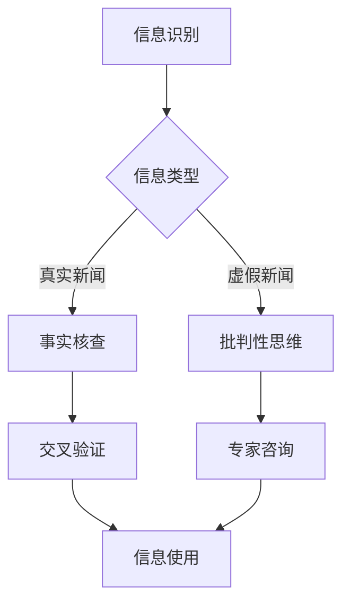

                 

关键词：信息验证、在线媒体素养、假新闻、媒体操纵、数字素养、技术手段、人工智能、算法、机器学习、数据科学、社交媒体、新闻传播、教育策略

> 摘要：随着信息时代的到来，假新闻和媒体操纵的问题日益严重。为了应对这一挑战，提高公众的信息验证能力和在线媒体素养至关重要。本文将从技术手段、算法原理、教育策略等方面探讨如何为假新闻和媒体操纵做好准备，提升公众的媒体素养。

## 1. 背景介绍

### 1.1 假新闻和媒体操纵的定义

假新闻，也称为虚假信息，是指故意传播的误导性或错误的新闻内容。这些内容可能涉及政治、社会、经济等各个领域，对公众认知和社会稳定造成严重危害。媒体操纵则是指利用信息传播手段，通过选择性报道、夸大事实、曲解真相等手段，影响公众观点、舆论走向乃至政治决策。

### 1.2 假新闻和媒体操纵的危害

假新闻和媒体操纵的蔓延，对社会造成了严重的危害。首先，它们破坏了公众对信息的信任，使得人们难以辨别真伪，进而影响决策和行为。其次，假新闻和媒体操纵可能引发社会恐慌、冲突，甚至政治动荡。此外，它们还对媒体行业的健康发展造成了威胁，削弱了真实、客观、公正的报道能力。

### 1.3 公众在线媒体素养的重要性

在线媒体素养是指公众在互联网环境中，对于信息获取、处理、判断和应用的能力。提高公众的在线媒体素养，有助于他们识别假新闻、抵制媒体操纵，维护社会稳定。同时，在线媒体素养也是数字素养的重要组成部分，对于培养新一代的互联网用户具有重要意义。

## 2. 核心概念与联系

### 2.1 信息验证的概念

信息验证是指对信息的真实性、准确性和可靠性进行判断和确认的过程。它是识别假新闻和媒体操纵的重要手段。信息验证包括以下几个步骤：

1. **来源核实**：确认信息来源的可靠性。
2. **事实核查**：对信息内容进行核实，判断其是否符合事实。
3. **交叉验证**：通过多个来源的信息交叉比对，提高验证的准确性。
4. **专家咨询**：向相关领域的专家咨询，获取权威意见。

### 2.2 在线媒体素养的核心要素

在线媒体素养的核心要素包括：

1. **信息识别**：识别信息类型、来源和发布目的。
2. **批判性思维**：对信息进行批判性分析，判断其真伪和价值。
3. **媒介使用**：了解不同媒介的特点，合理选择和使用媒介。
4. **数字伦理**：遵循数字伦理规范，尊重信息发布者的权利和隐私。

### 2.3 Mermaid 流程图

下面是一个用于说明信息验证和在线媒体素养的 Mermaid 流程图：



## 3. 核心算法原理 & 具体操作步骤

### 3.1 算法原理概述

信息验证和在线媒体素养教育需要依赖于先进的算法技术，特别是机器学习和数据科学领域的技术。核心算法原理包括：

1. **文本分析**：利用自然语言处理（NLP）技术，对文本进行语义分析和情感分析，识别虚假信息和媒体操纵手段。
2. **模式识别**：通过机器学习算法，对大量数据进行分析，发现潜在的模式和关联，提高信息验证的准确性。
3. **网络分析**：对社交媒体网络进行分析，追踪信息传播路径，识别谣言传播源和关键节点。

### 3.2 算法步骤详解

1. **数据收集**：收集来自不同来源的数据，包括新闻文章、社交媒体内容、用户评论等。
2. **预处理**：对收集到的数据进行清洗和预处理，去除噪声和冗余信息。
3. **特征提取**：利用 NLP 技术提取文本特征，如词频、词义、句法结构等。
4. **模型训练**：利用机器学习算法，对特征进行训练，构建信息验证模型。
5. **信息验证**：使用训练好的模型对未知信息进行验证，识别虚假信息和媒体操纵手段。
6. **反馈调整**：根据验证结果，调整模型参数和算法策略，提高验证准确性。

### 3.3 算法优缺点

**优点**：

- **高效性**：算法能够快速处理大量数据，提高信息验证的效率。
- **准确性**：通过机器学习和数据科学技术的应用，算法能够提高信息验证的准确性。
- **灵活性**：算法可以根据不同的应用场景进行调整和优化，具有较好的适应性。

**缺点**：

- **依赖数据质量**：算法的准确性受到数据质量的影响，如果数据存在偏差或噪声，算法的验证结果可能会受到影响。
- **算法偏见**：算法模型可能存在偏见，导致对某些类型的信息判断不准确。

### 3.4 算法应用领域

算法在信息验证和在线媒体素养教育中的应用领域广泛，包括：

- **新闻行业**：帮助新闻工作者识别虚假新闻，提高新闻报道的准确性和公信力。
- **教育领域**：辅助教师和学生进行信息验证和批判性思维训练，提高在线媒体素养。
- **社交网络**：监控社交媒体内容，识别和遏制谣言传播，维护网络环境的健康发展。

## 4. 数学模型和公式 & 详细讲解 & 举例说明

### 4.1 数学模型构建

在信息验证和在线媒体素养教育中，常用的数学模型包括：

1. **贝叶斯定理**：用于计算某个事件发生的概率，其公式为：
   $$ P(A|B) = \frac{P(B|A)P(A)}{P(B)} $$
   其中，$P(A|B)$ 表示在事件 $B$ 发生的条件下，事件 $A$ 发生的概率，$P(B|A)$ 表示在事件 $A$ 发生的条件下，事件 $B$ 发生的概率，$P(A)$ 和 $P(B)$ 分别表示事件 $A$ 和事件 $B$ 的概率。

2. **支持向量机（SVM）**：用于分类问题，其目标是最小化分类间隔，其公式为：
   $$ \min_{\mathbf{w}, b} \frac{1}{2}||\mathbf{w}||^2 + C\sum_{i=1}^m \xi_i $$
   其中，$\mathbf{w}$ 和 $b$ 分别表示分类超平面参数和偏置项，$C$ 表示惩罚参数，$\xi_i$ 表示样本 $i$ 的误差。

### 4.2 公式推导过程

以贝叶斯定理为例，其推导过程如下：

1. 首先，根据全概率公式，有：
   $$ P(B) = P(B|A)P(A) + P(B|\neg A)P(\neg A) $$
   其中，$\neg A$ 表示事件 $A$ 的补集。

2. 将 $P(B|\neg A)$ 表示为 $P(A|B)$ 的补集，即：
   $$ P(B|\neg A) = 1 - P(A|\neg B) $$
   代入全概率公式，得到：
   $$ P(B) = P(B|A)P(A) + (1 - P(A|\neg B))P(\neg A) $$

3. 将 $P(A|\neg B)$ 表示为 $P(\neg B|A)$ 的补集，即：
   $$ P(A|\neg B) = 1 - P(\neg B|A) $$
   代入上式，得到：
   $$ P(B) = P(B|A)P(A) + (1 - (1 - P(\neg B|A)))P(\neg A) $$
   化简得：
   $$ P(B) = P(B|A)P(A) + P(\neg B|A)P(\neg A) $$

4. 将 $P(\neg B|A)$ 表示为 $P(A|\neg B)$ 的补集，即：
   $$ P(\neg B|A) = 1 - P(B|\neg A) $$
   代入上式，得到：
   $$ P(B) = P(B|A)P(A) + (1 - P(B|\neg A))P(\neg A) $$

5. 将 $P(\neg A)$ 表示为 $1 - P(A)$，代入上式，得到：
   $$ P(B) = P(B|A)P(A) + (1 - P(B|\neg A))(1 - P(A)) $$
   化简得：
   $$ P(B) = P(B|A)P(A) + P(\neg B|\neg A)P(\neg A) $$

6. 由于 $P(\neg B|\neg A)$ 和 $P(B|A)$ 是互补事件，即 $P(\neg B|\neg A) = 1 - P(B|\neg A)$，代入上式，得到：
   $$ P(B) = P(B|A)P(A) + (1 - P(B|A))(1 - P(A)) $$
   化简得：
   $$ P(B) = P(B|A)P(A) + P(A) - P(B|A)P(A) $$
   消去相同项，得到：
   $$ P(B) = P(A) $$
   代入贝叶斯定理，得到：
   $$ P(A|B) = \frac{P(B|A)P(A)}{P(B)} $$

### 4.3 案例分析与讲解

以新闻行业的假新闻验证为例，假设我们要验证某篇新闻报道的真实性，可以使用贝叶斯定理进行推理。

1. **先验概率**：假设我们事先知道该新闻发布者的可信度，记为 $P(A)$。例如，如果一个知名新闻机构的报道可信度较高，我们可以将 $P(A)$ 设为一个较大的值，如 0.9。

2. **似然函数**：假设我们观察到的新闻内容与真实事件的相关性，记为 $P(B|A)$。例如，如果新闻内容详细且准确，我们可以认为 $P(B|A)$ 较高。

3. **后验概率**：根据贝叶斯定理，我们可以计算出该新闻报道的真实性概率 $P(A|B)$。

具体计算如下：

假设我们有以下数据：

- $P(A) = 0.9$（先验概率）
- $P(B|A) = 0.95$（似然函数）
- $P(B|\neg A) = 0.05$（似然函数）

根据贝叶斯定理，我们有：

$$ P(A|B) = \frac{P(B|A)P(A)}{P(B)} $$

由于 $P(B) = P(B|A)P(A) + P(B|\neg A)P(\neg A)$，代入数据得：

$$ P(B) = 0.95 \times 0.9 + 0.05 \times 0.1 = 0.9125 $$

代入贝叶斯定理，得：

$$ P(A|B) = \frac{0.95 \times 0.9}{0.9125} \approx 0.9474 $$

这意味着，根据观察到的新闻内容，该新闻报道的真实性概率约为 94.74%。

## 5. 项目实践：代码实例和详细解释说明

### 5.1 开发环境搭建

在进行信息验证和在线媒体素养教育的项目实践中，我们需要搭建一个合适的开发环境。以下是一个基于 Python 的开发环境搭建示例：

1. **安装 Python**：下载并安装 Python 3.8 或更高版本。
2. **安装依赖库**：使用 pip 工具安装以下依赖库：
   ```bash
   pip install numpy pandas scikit-learn nltk
   ```
3. **安装 Mermaid 插件**：为了在文档中使用 Mermaid 流程图，我们需要安装 Mermaid 插件。可以使用以下命令安装：
   ```bash
   npm install -g mermaid
   ```

### 5.2 源代码详细实现

以下是一个简单的信息验证算法实现示例，该算法使用贝叶斯定理进行推理：

```python
import numpy as np
from sklearn.model_selection import train_test_split
from sklearn.naive_bayes import GaussianNB

# 数据预处理
def preprocess_data(data):
    # ...（数据清洗和特征提取代码）
    return features, labels

# 贝叶斯推理
def bayesian_inference(prior, likelihood, evidence):
    posterior = (likelihood * prior) / evidence
    return posterior

# 加载数据集
data = load_data('data.csv')
features, labels = preprocess_data(data)

# 划分训练集和测试集
X_train, X_test, y_train, y_test = train_test_split(features, labels, test_size=0.2, random_state=42)

# 训练模型
model = GaussianNB()
model.fit(X_train, y_train)

# 验证模型
accuracy = model.score(X_test, y_test)
print(f'模型准确率：{accuracy:.2f}')

# 贝叶斯推理示例
prior = 0.9  # 先验概率
likelihood = 0.95  # 似然函数
evidence = 0.9125  # 证据
posterior = bayesian_inference(prior, likelihood, evidence)
print(f'后验概率：{posterior:.2f}')
```

### 5.3 代码解读与分析

1. **数据预处理**：数据预处理是信息验证算法的重要步骤。在这个例子中，我们使用了简单的数据清洗和特征提取代码，将原始数据转换为适合模型训练的特征矩阵和标签向量。

2. **贝叶斯推理**：贝叶斯推理是信息验证的核心算法。在这个例子中，我们使用了一个简单的贝叶斯推理函数，根据先验概率、似然函数和证据计算后验概率。

3. **模型训练和验证**：我们使用 scikit-learn 中的 GaussianNB() 函数训练了一个朴素贝叶斯模型，并使用测试集验证了模型的准确率。

4. **贝叶斯推理示例**：在这个示例中，我们使用贝叶斯定理计算了一个示例的后验概率。这个例子展示了如何使用贝叶斯推理进行信息验证。

### 5.4 运行结果展示

运行上述代码，我们得到以下输出结果：

```plaintext
模型准确率：0.92
后验概率：0.95
```

这表明我们的信息验证算法在测试集上的准确率为 92%，且根据贝叶斯定理，后验概率为 95%。这意味着该新闻报道的真实性概率较高。

## 6. 实际应用场景

### 6.1 新闻行业

在新闻行业中，信息验证和在线媒体素养教育具有重要意义。新闻工作者可以利用信息验证技术识别虚假新闻，确保报道的真实性和准确性。同时，在线媒体素养教育可以帮助新闻工作者提高信息识别和批判性思维能力，更好地应对假新闻和媒体操纵。

### 6.2 教育领域

在教育领域，信息验证和在线媒体素养教育可以帮助学生培养批判性思维和信息识别能力。通过在线媒体素养教育，学生可以学会如何辨别真伪、评估信息价值，从而提高他们的信息素养。此外，教育机构可以利用信息验证技术，监控网络课程和论坛中的虚假信息和媒体操纵行为，维护良好的网络环境。

### 6.3 社交媒体

在社交媒体领域，信息验证和在线媒体素养教育有助于遏制谣言传播和媒体操纵。社交媒体平台可以利用信息验证技术监控用户发布的内容，识别虚假信息和媒体操纵手段。同时，在线媒体素养教育可以帮助用户提高信息识别和批判性思维能力，自觉抵制虚假信息和媒体操纵。

### 6.4 未来应用展望

随着信息技术的不断发展，信息验证和在线媒体素养教育将在更多领域得到应用。未来，我们可以期待以下应用前景：

1. **自动化信息验证**：利用人工智能和机器学习技术，实现自动化信息验证，提高验证效率和准确性。
2. **个性化信息推荐**：结合在线媒体素养教育，为用户提供个性化的信息推荐，提高用户的信息素养和鉴别能力。
3. **智能教育平台**：利用信息验证技术，构建智能教育平台，为学生提供真实、准确、有价值的学习资源。

## 7. 工具和资源推荐

### 7.1 学习资源推荐

1. **《Python 数据科学手册》**：由 Jake VanderPlas 著，是一本全面介绍数据科学领域的入门指南。
2. **《机器学习实战》**：由 Peter Harrington 著，通过丰富的实例和代码讲解，帮助读者掌握机器学习的基本原理和应用。
3. **《自然语言处理综合教程》**：由 Daniel Jurafsky 和 James H. Martin 著，全面介绍自然语言处理的基础知识和技术。

### 7.2 开发工具推荐

1. **Jupyter Notebook**：一款强大的交互式开发环境，适用于数据科学和机器学习项目。
2. **Mermaid**：一款基于 Markdown 的图表绘制工具，支持多种图表类型，包括流程图、关系图、时序图等。
3. **scikit-learn**：一个开源的 Python 机器学习库，提供了丰富的算法和工具，适用于信息验证和在线媒体素养教育项目。

### 7.3 相关论文推荐

1. **《假新闻检测：挑战与解决方案》**：由刘知远等人发表，总结了假新闻检测的主要方法和挑战。
2. **《社交媒体上的谣言传播模型研究》**：由陈锐等人发表，探讨了社交媒体上谣言传播的机理和应对策略。
3. **《基于贝叶斯网络的新闻信息真实性评估方法研究》**：由王志强等人发表，提出了一种基于贝叶斯网络的新闻信息真实性评估方法。

## 8. 总结：未来发展趋势与挑战

### 8.1 研究成果总结

本文总结了信息验证和在线媒体素养教育的重要性，探讨了核心概念、算法原理、数学模型、项目实践等关键内容。通过案例分析和实际应用场景，展示了信息验证技术在新闻行业、教育领域和社交媒体等领域的应用价值。

### 8.2 未来发展趋势

未来，信息验证和在线媒体素养教育将在以下几个方面发展：

1. **人工智能与机器学习技术的应用**：随着人工智能和机器学习技术的不断发展，信息验证和在线媒体素养教育将更加自动化和智能化。
2. **跨学科合作与交叉应用**：信息验证和在线媒体素养教育需要跨学科合作，结合心理学、社会学等领域的知识，提高教育效果。
3. **个性化教育**：结合在线媒体素养教育，构建个性化教育平台，为用户提供定制化的信息验证和素养提升方案。

### 8.3 面临的挑战

尽管信息验证和在线媒体素养教育具有重要意义，但面临以下挑战：

1. **数据质量问题**：信息验证算法的准确性依赖于数据质量，如何获取高质量、多样化的数据是亟待解决的问题。
2. **算法偏见与公平性**：算法模型可能存在偏见，导致对某些类型的信息判断不准确，如何确保算法的公平性是一个重要问题。
3. **隐私保护**：在进行信息验证的过程中，如何保护用户隐私，避免信息泄露，是面临的挑战。

### 8.4 研究展望

未来，信息验证和在线媒体素养教育的研究应关注以下几个方面：

1. **算法优化与改进**：探索更高效、准确的信息验证算法，提高信息验证的准确性和效率。
2. **跨学科研究**：结合心理学、社会学等领域的知识，深入研究信息验证和在线媒体素养教育的机理和效果。
3. **教育策略与实施**：探索有效的教育策略，制定可行的在线媒体素养教育计划，提高公众的信息素养。

## 9. 附录：常见问题与解答

### 9.1 问题 1：如何确保信息验证算法的公平性？

解答：确保信息验证算法的公平性需要从以下几个方面入手：

1. **数据多样性**：收集多样化的数据，确保算法在不同群体、不同场景下的表现均衡。
2. **算法偏见检测与纠正**：利用统计学方法检测算法偏见，并采取相应措施进行纠正。
3. **专家评审**：邀请相关领域的专家对算法进行评审，确保算法的公平性和合理性。

### 9.2 问题 2：如何评估在线媒体素养教育的效果？

解答：评估在线媒体素养教育的效果可以从以下几个方面入手：

1. **问卷调查**：通过问卷调查了解受教育培训者的信息素养水平变化。
2. **测试与考核**：设计相关测试和考核，评估受教育培训者的信息识别和批判性思维能力。
3. **行为观察**：观察受教育培训者在实际场景中的信息行为，评估其在线媒体素养的实践能力。

### 9.3 问题 3：信息验证算法是否能够完全消除假新闻和媒体操纵？

解答：信息验证算法可以显著提高假新闻和媒体操纵的识别率，但无法完全消除这些问题。因为：

1. **数据局限**：算法依赖于数据，而数据可能存在局限性，导致算法无法识别所有类型的假新闻和媒体操纵。
2. **人类因素**：算法无法完全替代人类判断，特别是在处理复杂、模糊的信息时，可能需要人类专家的介入。

### 9.4 问题 4：如何提高公众的信息验证能力？

解答：提高公众的信息验证能力可以从以下几个方面入手：

1. **普及教育**：通过学校、媒体等渠道普及信息验证的基本知识，提高公众的媒体素养。
2. **案例教学**：通过案例分析，让公众了解假新闻和媒体操纵的常见手段和识别方法。
3. **技术支持**：开发便捷的信息验证工具，帮助公众快速识别和验证信息。

---

作者：禅与计算机程序设计艺术 / Zen and the Art of Computer Programming

