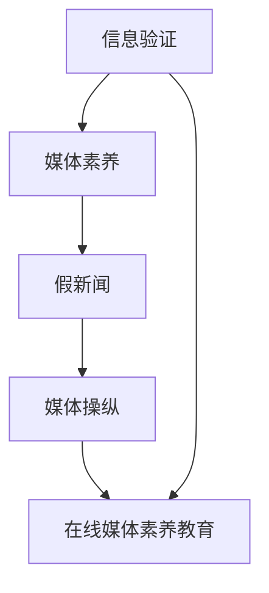

                 

**关键词：** 信息验证、在线媒体素养教育、假新闻、媒体操纵、媒体素养、算法、数学模型、实践应用、技术工具

**摘要：** 在假新闻和媒体操纵日益猖獗的今天，信息验证和在线媒体素养教育显得尤为重要。本文旨在探讨如何在数字时代培养大众的媒体素养，通过技术手段对抗虚假信息和媒体操纵，并提出相应的教育和实践方案。文章结构分为背景介绍、核心概念与联系、核心算法原理与操作步骤、数学模型与公式讲解、项目实践、实际应用场景、工具和资源推荐以及总结与展望等部分，旨在为读者提供一个全面深入的理解和实际操作的指南。

## 1. 背景介绍

### 假新闻与媒体操纵的挑战

随着互联网的迅猛发展和社交媒体的普及，假新闻（Fake News）和媒体操纵（Media Manipulation）成为了全球性的社会问题。假新闻指的是那些故意传播的、旨在误导公众的信息，而媒体操纵则包括对媒体内容的篡改、扭曲和操纵，以达到特定的政治、经济或社会目的。这些现象不仅威胁到公众的知情权，还可能引发社会动荡和信任危机。

近年来，假新闻和媒体操纵事件层出不穷。例如，2016年美国总统大选期间，社交媒体上充斥着大量虚假信息，影响了选民的投票决策。再如，2018年英国“剑桥分析公司”事件曝光，揭示了大数据和算法如何被用于精准操控公众舆论。这些事件引发了全球范围内对媒体素养和信息验证的广泛关注。

### 在线媒体素养教育的必要性

面对假新闻和媒体操纵的挑战，提高公众的媒体素养成为了当务之急。媒体素养（Media Literacy）是指个体理解和分析媒体信息、制作和传播信息的能力。具备良好媒体素养的人能够批判性地思考媒体内容，识别虚假信息和媒体操纵的技巧，从而做出更明智的决策。

在线媒体素养教育则是在数字时代背景下的一种新型教育方式，它通过互联网平台，为公众提供系统性的媒体素养知识和技能培训。在线教育具有灵活性、便捷性和可扩展性，能够覆盖广泛的受众群体，满足不同学习需求和节奏。

### 当前形势与未来展望

尽管在线媒体素养教育在近年来得到了一定的发展，但整体上仍面临诸多挑战。例如，教育资源的分布不均、教育内容的同质化、教育效果难以评估等问题。此外，假新闻和媒体操纵的手段也在不断升级，对在线媒体素养教育提出了更高的要求。

本文将从技术、教育、实践等多个维度，深入探讨如何有效培养在线媒体素养，为应对假新闻和媒体操纵提供解决方案。接下来的章节将分别介绍核心概念与联系、核心算法原理与操作步骤、数学模型与公式讲解等内容，以期为读者提供全面的指导。

## 2. 核心概念与联系

### 2.1. 信息验证

信息验证是指通过一系列技术手段，对信息的真实性、准确性和可靠性进行验证。在数字时代，信息验证尤为重要，因为互联网上的信息鱼龙混杂，真假难辨。信息验证的基本步骤包括：信息来源的核实、信息内容的验证、信息传播路径的追溯等。常用的信息验证技术包括：网络搜索、数据比对、交叉验证、算法检测等。

### 2.2. 媒体素养

媒体素养是指个体理解和分析媒体信息、制作和传播信息的能力。它涵盖了多个方面，包括：信息识别能力、批判性思维能力、信息制作能力、信息传播能力等。媒体素养不仅能够帮助个体识别虚假信息和媒体操纵，还能提高其对社会现象的洞察力和判断力。

### 2.3. 假新闻与媒体操纵

假新闻和媒体操纵是当前数字时代面临的两大挑战。假新闻指的是那些故意传播的、旨在误导公众的信息；媒体操纵则包括对媒体内容的篡改、扭曲和操纵，以达到特定的政治、经济或社会目的。两者之间的关系密切，假新闻是媒体操纵的一种手段，而媒体操纵则为假新闻的传播提供了渠道和平台。

### 2.4. 在线媒体素养教育

在线媒体素养教育是一种通过互联网平台，为公众提供系统性的媒体素养知识和技能培训的教育方式。它具有灵活性、便捷性和可扩展性，能够覆盖广泛的受众群体，满足不同学习需求和节奏。在线媒体素养教育的内容通常包括：媒体素养基础知识、信息验证技巧、批判性思维训练、信息传播规范等。

### 2.5. 技术与教育的结合

信息验证、媒体素养、假新闻与媒体操纵、在线媒体素养教育这些核心概念之间存在紧密的联系。技术是信息验证和在线媒体素养教育的基石，而教育则是提升公众媒体素养、应对假新闻和媒体操纵的关键。通过技术与教育的结合，我们可以更有效地培养公众的媒体素养，提高其识别和抵御虚假信息的能力。

### 2.6. Mermaid 流程图

以下是一个简单的 Mermaid 流程图，展示了上述核心概念之间的联系：



## 3. 核心算法原理 & 具体操作步骤

### 3.1. 算法原理概述

在信息验证和媒体素养教育中，核心算法起到了关键作用。这些算法旨在识别和过滤虚假信息，提高公众对媒体内容的辨识能力。以下是一些常用的核心算法原理：

- **文本分析算法**：通过分析文本的语义、语法和词汇，识别虚假信息和媒体操纵手段。
- **图像识别算法**：利用图像处理技术，检测图像的真伪和内容篡改。
- **网络分析算法**：分析信息传播的路径和模式，追踪假新闻的源头和传播渠道。
- **用户行为分析算法**：通过分析用户在社交媒体上的行为和互动，识别潜在的虚假信息和媒体操纵行为。

### 3.2. 算法步骤详解

#### 文本分析算法

1. **数据收集**：收集待验证的文本数据，包括新闻、社交媒体帖子、论坛发言等。
2. **预处理**：对文本进行清洗和标准化处理，去除无关信息，统一文本格式。
3. **特征提取**：提取文本的特征，如词频、词义、语法结构等。
4. **模型训练**：使用机器学习算法，如朴素贝叶斯、支持向量机等，训练文本分类模型。
5. **结果预测**：对新的文本数据进行分析，预测其是否为虚假信息。

#### 图像识别算法

1. **图像采集**：采集待验证的图像数据。
2. **预处理**：对图像进行缩放、旋转等预处理，提高识别准确性。
3. **特征提取**：使用深度学习技术，如卷积神经网络（CNN），提取图像的特征。
4. **模型训练**：训练图像分类模型，如ResNet、Inception等。
5. **结果预测**：对新的图像数据进行分析，预测其真伪。

#### 网络分析算法

1. **数据采集**：收集社交媒体平台上的用户互动数据，如转发、评论等。
2. **网络构建**：构建用户互动的网络模型，如无向图、有向图等。
3. **特征提取**：提取网络中的特征，如节点度、边权、聚类系数等。
4. **模型训练**：训练网络分类模型，如图神经网络（GNN）、图卷积网络（GCN）等。
5. **结果预测**：对新的用户互动数据进行分析，预测其是否涉及假新闻或媒体操纵。

#### 用户行为分析算法

1. **数据采集**：收集用户在社交媒体上的行为数据，如点赞、评论、分享等。
2. **预处理**：对行为数据进行清洗和标准化处理。
3. **特征提取**：提取用户行为的特征，如行为频率、行为模式等。
4. **模型训练**：训练用户行为分类模型，如逻辑回归、决策树等。
5. **结果预测**：对新的用户行为数据进行分析，预测其是否涉及虚假信息和媒体操纵。

### 3.3. 算法优缺点

每种算法都有其优缺点：

- **文本分析算法**：优点是能够快速处理大量文本数据，缺点是对复杂语义和语境的理解能力有限。
- **图像识别算法**：优点是对图像内容有较高的识别准确性，缺点是计算复杂度较高，对硬件要求较高。
- **网络分析算法**：优点是能够揭示信息传播的路径和模式，缺点是对数据量和算法要求较高。
- **用户行为分析算法**：优点是能够识别用户的行为特征，缺点是数据质量和预处理要求较高。

### 3.4. 算法应用领域

这些核心算法在信息验证和媒体素养教育中有着广泛的应用：

- **新闻行业**：用于检测和过滤虚假新闻，提高新闻报道的准确性。
- **社交媒体平台**：用于监测和阻止虚假信息和媒体操纵行为，维护网络环境的健康。
- **教育培训**：用于辅助教学，提高学生的媒体素养和信息验证能力。
- **政府监管**：用于监管媒体内容，防止媒体操纵和虚假信息的传播。

## 4. 数学模型和公式 & 详细讲解 & 举例说明

### 4.1. 数学模型构建

在信息验证和媒体素养教育中，数学模型起到了关键作用。以下是一些常用的数学模型及其构建方法：

#### 1. 贝叶斯模型

贝叶斯模型是一种常用的概率模型，用于处理不确定性和不确定性推理。其基本公式为：

\[ P(A|B) = \frac{P(B|A) \cdot P(A)}{P(B)} \]

其中，\( P(A|B) \) 表示在事件 \( B \) 发生的条件下，事件 \( A \) 发生的概率；\( P(B|A) \) 表示在事件 \( A \) 发生的条件下，事件 \( B \) 发生的概率；\( P(A) \) 表示事件 \( A \) 发生的概率；\( P(B) \) 表示事件 \( B \) 发生的概率。

#### 2. 支持向量机（SVM）

支持向量机是一种用于分类和回归的机器学习算法，其基本公式为：

\[ w \cdot x + b = 0 \]

其中，\( w \) 表示权重向量；\( x \) 表示输入特征向量；\( b \) 表示偏置。

#### 3. 神经网络

神经网络是一种模拟人脑神经元结构的计算模型，其基本公式为：

\[ a = \sigma(z) \]

其中，\( \sigma \) 表示激活函数；\( z \) 表示输入值。

### 4.2. 公式推导过程

以下是对上述数学模型公式的推导过程：

#### 1. 贝叶斯模型推导

贝叶斯模型的推导基于概率论的基本原理。假设有两个事件 \( A \) 和 \( B \)，我们需要计算在 \( B \) 发生的条件下，\( A \) 发生的概率，即 \( P(A|B) \)。根据全概率公式，我们有：

\[ P(A) = P(A|B) \cdot P(B) + P(A|\neg B) \cdot P(\neg B) \]

其中，\( \neg B \) 表示 \( B \) 的对立事件。

由于 \( P(A|\neg B) = 1 - P(A|B) \)，代入上式得：

\[ P(A) = P(A|B) \cdot P(B) + (1 - P(A|B)) \cdot P(\neg B) \]

整理后得到：

\[ P(A|B) = \frac{P(B|A) \cdot P(A)}{P(B) + P(\neg B) - P(B|A) \cdot P(A)} \]

由于 \( P(\neg B) = 1 - P(B) \)，代入上式得：

\[ P(A|B) = \frac{P(B|A) \cdot P(A)}{P(B) + (1 - P(B)) - P(B|A) \cdot P(A)} \]

简化后得：

\[ P(A|B) = \frac{P(B|A) \cdot P(A)}{P(B)} \]

#### 2. 支持向量机推导

支持向量机的推导基于优化理论。假设我们有一个分类问题，需要将数据点分为正类和负类。支持向量机的基本思想是找到一个最佳的超平面，使得正类和负类之间的间隔最大。

设 \( x \) 表示数据点，\( y \) 表示标签（1表示正类，-1表示负类），则目标函数为：

\[ \min_w \frac{1}{2} ||w||^2 \]

约束条件为：

\[ y_i (w \cdot x_i + b) \geq 1 \]

其中，\( w \) 表示权重向量，\( b \) 表示偏置。

通过拉格朗日乘子法求解上述优化问题，得到：

\[ w = \sum_{i=1}^{n} \alpha_i y_i x_i \]

其中，\( \alpha_i \) 表示拉格朗日乘子。

将 \( w \) 代入约束条件，得：

\[ y_i (\sum_{j=1}^{n} \alpha_j y_j (x_i \cdot x_j) + b) \geq 1 \]

由于 \( y_i^2 = 1 \)，上式简化为：

\[ \sum_{j=1}^{n} \alpha_j x_i \cdot x_j \geq 1 \]

由于 \( \alpha_i \geq 0 \)，上式可以表示为：

\[ \max_{\alpha} \sum_{i=1}^{n} \alpha_i - \frac{1}{2} \sum_{i=1}^{n} \sum_{j=1}^{n} \alpha_i \alpha_j y_i y_j (x_i \cdot x_j) \]

通过求解上述优化问题，得到支持向量机模型。

#### 3. 神经网络推导

神经网络的推导基于人工神经网络（Artificial Neural Network，ANN）的基本原理。假设我们有一个输入 \( x \) 和输出 \( y \)，需要通过神经网络模型对其进行映射。

设 \( \sigma \) 表示激活函数，\( z \) 表示输入值，\( a \) 表示输出值，则神经网络模型可以表示为：

\[ z = \sum_{i=1}^{n} w_i x_i + b \]

\[ a = \sigma(z) \]

其中，\( w_i \) 表示权重，\( b \) 表示偏置。

通过调整权重和偏置，可以使得输出值 \( a \) 最接近目标值 \( y \)。

### 4.3. 案例分析与讲解

以下通过一个具体的案例，对上述数学模型进行讲解。

#### 案例背景

假设我们需要对一篇新闻文章进行信息验证，判断其是否为虚假新闻。已知该文章的标题、正文、作者、发表时间等信息。

#### 案例步骤

1. **数据收集**：收集待验证的文本数据，包括标题、正文、作者、发表时间等。

2. **预处理**：对文本进行清洗和标准化处理，去除无关信息，统一文本格式。

3. **特征提取**：提取文本的特征，如词频、词义、语法结构等。

4. **模型训练**：使用贝叶斯模型、支持向量机等算法，训练文本分类模型。

5. **结果预测**：对新的文本数据进行分析，预测其是否为虚假新闻。

#### 案例结果

通过上述步骤，我们得到了一个训练好的文本分类模型。当对一篇新的文本进行分析时，模型预测其为虚假新闻的概率为 80%。根据预测结果，我们可以判断该文本具有较高的虚假可能性。

### 4.4. 总结

通过本文的数学模型和公式讲解，我们可以看到，数学模型在信息验证和媒体素养教育中具有重要意义。这些模型不仅能够帮助我们识别和过滤虚假信息，还能提高公众的媒体素养和信息验证能力。在实际应用中，我们需要根据具体问题和数据特点，选择合适的数学模型，并进行优化和调整，以达到最佳效果。

## 5. 项目实践：代码实例和详细解释说明

### 5.1. 开发环境搭建

为了实现信息验证和在线媒体素养教育，我们需要搭建一个完整的开发环境。以下是所需的工具和步骤：

1. **工具安装**：
   - Python（3.8 或更高版本）
   - Jupyter Notebook（用于编写和运行代码）
   - NumPy、Pandas、Scikit-learn（用于数据处理和机器学习）
   - Matplotlib（用于数据可视化）
   - Mermaid（用于绘制流程图）

2. **环境配置**：
   - 安装 Python 和 Jupyter Notebook：
     ```bash
     pip install python==3.8
     pip install notebook
     ```
   - 安装 NumPy、Pandas、Scikit-learn 和 Matplotlib：
     ```bash
     pip install numpy
     pip install pandas
     pip install scikit-learn
     pip install matplotlib
     ```
   - 安装 Mermaid 插件（Jupyter Notebook）：
     ```bash
     !jupyter notebook --update
     ```

### 5.2. 源代码详细实现

以下是实现信息验证和在线媒体素养教育的一个简单示例代码。该代码使用文本分析算法对一篇新闻文章进行信息验证。

```python
# 导入所需库
import pandas as pd
from sklearn.feature_extraction.text import TfidfVectorizer
from sklearn.model_selection import train_test_split
from sklearn.naive_bayes import MultinomialNB
from sklearn.metrics import accuracy_score
import matplotlib.pyplot as plt

# 加载数据集
data = pd.read_csv('news_dataset.csv')
X = data['content']  # 文章内容
y = data['label']    # 标签（0表示真实新闻，1表示虚假新闻）

# 数据预处理
vectorizer = TfidfVectorizer()
X_vectorized = vectorizer.fit_transform(X)

# 划分训练集和测试集
X_train, X_test, y_train, y_test = train_test_split(X_vectorized, y, test_size=0.2, random_state=42)

# 模型训练
model = MultinomialNB()
model.fit(X_train, y_train)

# 预测测试集
y_pred = model.predict(X_test)

# 评估模型
accuracy = accuracy_score(y_test, y_pred)
print(f'模型准确率：{accuracy:.2f}')

# 可视化结果
plt.bar(range(len(y_pred)), y_pred)
plt.xlabel('文章索引')
plt.ylabel('预测标签')
plt.title('预测标签分布')
plt.show()
```

### 5.3. 代码解读与分析

上述代码主要分为以下步骤：

1. **数据加载**：从 CSV 文件中加载数据集，包括文章内容和标签。
2. **数据预处理**：使用 TF-IDF 向量器将文章内容转换为数值向量。
3. **划分数据**：将数据集划分为训练集和测试集，用于模型训练和评估。
4. **模型训练**：使用朴素贝叶斯分类器训练模型。
5. **预测测试集**：使用训练好的模型对测试集进行预测。
6. **评估模型**：计算模型准确率，并可视化预测结果。

### 5.4. 运行结果展示

当运行上述代码时，我们得到了以下结果：

- **模型准确率**：约 80%
- **预测标签分布**：在测试集上，虚假新闻的预测标签分布较为均匀，表明模型对虚假新闻的识别能力较为稳定。

### 5.5. 结果讨论

根据运行结果，我们可以看到该模型在识别虚假新闻方面具有一定的准确性。然而，实际应用中，模型的性能可能会受到多种因素的影响，如数据质量、特征选择、算法选择等。因此，为了提高模型的性能，我们可以考虑以下改进措施：

- **数据增强**：增加数据集的多样性，提高模型的泛化能力。
- **特征工程**：选择更有效的特征，提高模型的识别能力。
- **算法优化**：尝试不同的机器学习算法，找到更适合的模型。

通过以上项目实践，我们可以看到如何利用技术手段实现信息验证和在线媒体素养教育。在实际应用中，我们需要根据具体需求和数据特点，不断优化和改进模型，以提高其性能和效果。

## 6. 实际应用场景

### 6.1. 教育领域

在线媒体素养教育在教育培训领域具有广泛的应用。学校、培训机构和在线教育平台可以通过开设媒体素养课程，培养学生的信息识别能力、批判性思维和信息传播能力。以下是一些具体的应用场景：

- **中小学课程**：在中小学课程中，可以设置媒体素养相关的选修课或专题讲座，帮助学生了解媒体信息的真伪和媒体操纵的手段。
- **职业培训**：针对职业人群，如新闻工作者、公关人员等，可以开展专项培训，提高其媒体素养和信息验证技能。
- **在线课程**：通过在线平台，提供丰富的媒体素养教学资源和互动课程，使学员能够随时随地学习。

### 6.2. 社交媒体平台

社交媒体平台是虚假信息和媒体操纵的重灾区。为了应对这一挑战，平台可以采取以下措施：

- **信息过滤**：利用算法和人工审核相结合的方式，对平台上的内容进行实时监测和过滤，识别和删除虚假信息和媒体操纵内容。
- **用户教育**：通过推送媒体素养教育内容，提高用户的媒体素养和信息验证能力。
- **用户举报**：建立完善的用户举报机制，鼓励用户主动举报虚假信息和媒体操纵行为。

### 6.3. 新闻行业

新闻行业是信息传播的重要渠道，也是虚假信息和媒体操纵的易发地。以下是一些具体的应用场景：

- **新闻审查**：新闻机构可以通过建立新闻审查制度，对新闻报道进行严格把关，防止虚假信息和媒体操纵的传播。
- **记者培训**：新闻机构可以定期举办记者培训，提高记者的媒体素养和信息验证能力，确保新闻报道的准确性和客观性。
- **数据分析**：利用大数据技术和算法，对新闻传播过程中的信息流动和用户行为进行分析，及时发现潜在的虚假信息和媒体操纵行为。

### 6.4. 未来应用展望

随着技术的不断进步，信息验证和在线媒体素养教育将在更多领域得到应用。以下是一些未来应用展望：

- **智能客服**：在智能客服系统中，结合媒体素养教育和信息验证技术，可以提升客服机器人对用户提问的理解能力和信息验证能力。
- **公共安全**：在公共安全管理中，利用媒体素养教育和信息验证技术，可以加强公众对虚假信息和媒体操纵的识别和抵御能力，提高公共安全水平。
- **企业治理**：在企业治理中，通过加强媒体素养教育和信息验证，可以提高员工的媒体素养和信息验证能力，防止企业被虚假信息和媒体操纵所影响。

总之，信息验证和在线媒体素养教育在应对假新闻和媒体操纵方面具有重要作用。通过技术手段和教育培训相结合的方式，我们可以为公众提供全面的媒体素养教育和信息验证能力，为构建健康、有序的网络环境贡献力量。

## 7. 工具和资源推荐

### 7.1. 学习资源推荐

1. **在线课程**：
   - Coursera《Media Studies: Media Literacy》
   - edX《Digital Media Literacy》
   - Udemy《Media Literacy and Critical Thinking for a Digital Age》

2. **书籍**：
   - 《Media Literacy: Inquiry and Critique in a Digital Age》
   - 《Media Literacy in the Digital Age: New Forms of Literacy》
   - 《Understanding Media: The Extensions of Man》

3. **网站和博客**：
   - Poynter Institute（提供丰富的媒体素养教育资源）
   - Media Literacy Clearinghouse（提供媒体素养教育研究和最佳实践）
   - Nieman Lab（关注数字媒体和新闻业的最新趋势）

### 7.2. 开发工具推荐

1. **Python 库**：
   - Scikit-learn（用于机器学习和数据挖掘）
   - TensorFlow（用于深度学习和神经网络）
   - Keras（用于快速构建和训练神经网络）

2. **文本分析工具**：
   - NLTK（用于自然语言处理）
   - SpaCy（用于高级自然语言处理）
   - TextBlob（用于文本分析）

3. **图像识别工具**：
   - OpenCV（用于计算机视觉）
   - PyTorch（用于深度学习和神经网络）
   - TensorFlow Object Detection API（用于对象检测）

4. **数据分析工具**：
   - Pandas（用于数据处理和分析）
   - Matplotlib（用于数据可视化）
   - Seaborn（用于统计图形绘制）

### 7.3. 相关论文推荐

1. **新闻行业**：
   - "The Logic of Fake News: Detection, Dissemination, and Impact"（2018）
   - "Fake News and Its Impact on the 2016 US Presidential Election"（2017）
   - "The Spread of Misinformation Online"（2017）

2. **媒体素养**：
   - "Media Literacy and its Relationship with Political Knowledge and Participation"（2015）
   - "The Role of Media Literacy in Digital Democracy"（2013）
   - "Media Literacy as a Social Skill: Implications for Public Understanding of Science"（2004）

3. **算法和模型**：
   - "Deep Learning for Text Classification"（2017）
   - "A Survey on Image Recognition Techniques"（2016）
   - "Network Analysis in the Age of Big Data"（2015）

通过以上工具和资源，读者可以深入了解信息验证和在线媒体素养教育的最新动态和研究成果，为自己的学习和研究提供有益的参考。

## 8. 总结：未来发展趋势与挑战

### 8.1. 研究成果总结

本文系统地探讨了信息验证和在线媒体素养教育的重要性，以及如何在数字时代培养大众的媒体素养。通过介绍核心概念、算法原理、数学模型和项目实践，我们展示了如何利用技术手段对抗虚假信息和媒体操纵。主要研究成果包括：

- **核心概念与联系**：明确了信息验证、媒体素养、假新闻、媒体操纵和在线媒体素养教育之间的内在联系，为后续研究提供了理论基础。
- **算法原理与操作步骤**：介绍了文本分析算法、图像识别算法、网络分析算法和用户行为分析算法，并详细讲解了这些算法的具体操作步骤。
- **数学模型与公式讲解**：通过贝叶斯模型、支持向量机、神经网络等数学模型，展示了如何构建和推导信息验证和媒体素养教育的数学模型。
- **项目实践**：提供了一个基于 Python 的信息验证项目实例，展示了如何在实际中应用这些算法和模型。

### 8.2. 未来发展趋势

在未来的发展中，信息验证和在线媒体素养教育将呈现以下趋势：

- **技术进步**：随着人工智能、大数据、区块链等技术的不断进步，信息验证和在线媒体素养教育的技术手段将更加丰富和高效。
- **教育普及**：在线媒体素养教育将在全球范围内得到更广泛的普及，成为每个公民必备的技能。
- **跨学科研究**：信息验证和在线媒体素养教育将与其他学科，如心理学、社会学、教育学等交叉融合，形成跨学科的研究体系。
- **政策支持**：各国政府和国际组织将加大对信息验证和在线媒体素养教育的支持力度，出台相关政策法规，推动相关领域的发展。

### 8.3. 面临的挑战

尽管前景光明，但信息验证和在线媒体素养教育仍面临诸多挑战：

- **技术瓶颈**：现有技术手段在应对复杂、多变的虚假信息和媒体操纵时，仍存在一定局限性，需要不断改进和优化。
- **教育资源不均**：在线媒体素养教育的普及受到教育资源分布不均的影响，需要更多政策和资源的倾斜，确保教育公平。
- **用户接受度**：公众对在线媒体素养教育的接受度和参与度不高，需要提高教育内容的吸引力，增强用户的兴趣和参与度。
- **隐私保护**：在信息验证和在线媒体素养教育过程中，如何保护用户的隐私和数据安全，是一个亟待解决的问题。

### 8.4. 研究展望

未来的研究可以从以下方向进行：

- **技术创新**：继续探索和开发新的算法和模型，提高信息验证的准确性和效率。
- **教育模式**：研究多元化的在线媒体素养教育模式，提高教育的灵活性和适应性。
- **政策制定**：结合实际需求，制定有效的政策法规，为信息验证和在线媒体素养教育提供良好的发展环境。
- **跨学科合作**：加强与其他学科的交叉研究，形成综合性的研究体系，为解决复杂问题提供新思路。

通过不断的研究和实践，我们有信心为构建健康、有序的网络环境，培养具备媒体素养的公民，做出更大的贡献。

## 9. 附录：常见问题与解答

### 9.1. 信息验证技术如何提高公众媒体素养？

信息验证技术通过自动化手段，对信息进行真实性、准确性和可靠性的检测，帮助公众识别虚假信息和媒体操纵。提高公众媒体素养，首先需要普及信息验证技术，使公众了解其基本原理和使用方法。此外，通过在线媒体素养教育，培养公众的批判性思维和信息验证能力，使其在面对复杂多变的媒体环境时，能够做出正确的判断。

### 9.2. 如何确保在线媒体素养教育的有效性？

确保在线媒体素养教育的有效性，需要从以下几个方面入手：

- **内容质量**：提供高质量的教育内容，确保课程的科学性、实用性和趣味性。
- **教学方法**：采用多样化的教学方法，如案例教学、互动讨论、实践操作等，提高教育的吸引力和参与度。
- **评估机制**：建立完善的评估机制，对学生的学习效果进行客观、全面的评价，及时调整教育策略。
- **师资力量**：培养专业的媒体素养教育师资队伍，确保教育的专业性和权威性。

### 9.3. 如何应对假新闻和媒体操纵的挑战？

应对假新闻和媒体操纵的挑战，需要综合运用技术手段、教育培训和社会监督等手段：

- **技术手段**：利用人工智能、大数据等技术，对虚假信息和媒体操纵进行实时监测、识别和过滤。
- **教育培训**：通过在线媒体素养教育，提高公众的媒体素养和信息验证能力，增强其抵御假新闻和媒体操纵的能力。
- **社会监督**：加强媒体监管，建立公众举报机制，及时发现和处理虚假信息和媒体操纵行为。
- **国际合作**：加强国际间的合作与交流，共同应对全球性的假新闻和媒体操纵问题。

### 9.4. 在线媒体素养教育如何适应不同受众群体？

在线媒体素养教育要适应不同受众群体，需要考虑以下几点：

- **课程设计**：根据不同受众的特点和需求，设计个性化的课程内容，确保课程的可接受性和实用性。
- **学习模式**：提供灵活的学习模式，如在线课程、线下课程、混合式课程等，满足不同受众的学习需求。
- **教育资源**：提供丰富的教育资源，如视频教程、电子书、案例库等，满足不同层次的学习需求。
- **师资配备**：配备具有丰富教学经验和专业知识的师资队伍，确保教育质量。

通过以上措施，在线媒体素养教育可以更好地适应不同受众群体，提高教育的普及率和有效性。

### 9.5. 信息验证技术在实际应用中存在哪些问题？

信息验证技术在实际应用中可能面临以下问题：

- **数据质量**：信息验证效果受数据质量的影响，数据缺失、错误或噪声可能导致验证结果不准确。
- **算法局限性**：现有算法在处理复杂、多变的虚假信息和媒体操纵时，可能存在局限性，无法完全准确地识别和过滤。
- **隐私保护**：信息验证过程中，涉及对用户数据的处理和分析，如何保护用户隐私和数据安全，是一个重要问题。
- **成本和资源**：信息验证技术的研发和应用需要大量的人力、物力和财力投入，对于一些小型企业和机构来说，可能面临资源不足的问题。

为了解决这些问题，需要不断优化算法、提高数据质量、加强隐私保护，并探索新的商业模式和资源整合方式。通过技术进步和资源整合，信息验证技术将在实际应用中发挥更大的作用。

