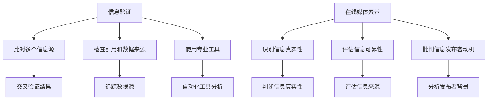

                 

在当今的信息时代，我们每个人都是信息洪流中的一员。社交媒体、新闻网站、博客等平台让我们随时随地都能获取大量信息。然而，这些信息的真实性却难以保证。假新闻和媒体操纵问题日益严重，对个人和社会造成了巨大影响。本文将探讨信息验证和在线媒体素养的重要性，帮助您在这个复杂的信息环境中导航。

## 关键词
- 信息验证
- 假新闻
- 媒体操纵
- 在线媒体素养
- 真实性
- 社交媒体
- 信息伦理

## 摘要
本文首先介绍了当前假新闻和媒体操纵的背景和影响，然后讨论了信息验证和在线媒体素养的必要性和方法。通过实际案例、数学模型和项目实践，我们将展示如何有效地验证信息并提高在线媒体素养。最后，我们展望了未来在这一领域的研究和发展趋势，并提出了面临的挑战。

## 1. 背景介绍

### 1.1 假新闻和媒体操纵的定义

假新闻（Fake News）指的是那些故意传播的、具有误导性或虚假的信息。这类信息通常以新闻报道的形式出现，但内容却是捏造的、扭曲的，或者根本就是虚构的。

媒体操纵（Media Manipulation）则是指通过一系列手段，如操纵新闻来源、篡改数据、伪造证据等，来影响公众舆论、塑造社会事件或政治议题。

### 1.2 假新闻和媒体操纵的起源

假新闻和媒体操纵并非现代社会独有的现象。历史上，报纸、广播和电视等传统媒体都曾因政治利益、商业目的或其他动机而操纵信息。然而，随着互联网和社交媒体的兴起，假新闻和媒体操纵的手段变得更加多样和隐蔽。

### 1.3 假新闻和媒体操纵的影响

假新闻和媒体操纵对个人和社会产生了深远的影响。对个人而言，误导性信息可能导致信仰、价值观和行为的扭曲。对社会而言，假新闻和媒体操纵可能引发社会动荡、政治不稳定，甚至危及国家安全。

## 2. 核心概念与联系

### 2.1 信息验证的定义

信息验证（Information Verification）是指对获取的信息进行核实，以确保其真实性和准确性。它包括多种方法，如比对多个信息源、检查引用和数据来源、使用专业工具等。

### 2.2 在线媒体素养的概念

在线媒体素养（Online Media Literacy）是指个体在使用互联网和社交媒体时，能够识别、评估和批判信息的能力。它不仅包括对信息的真实性和可靠性的判断，还包括对信息发布者、动机和目的的了解。

### 2.3 信息验证与在线媒体素养的联系

信息验证和在线媒体素养相辅相成。信息验证是提高在线媒体素养的基础，而在线媒体素养则有助于更有效地进行信息验证。只有通过提高在线媒体素养，我们才能更好地识别假新闻和媒体操纵，从而保护自己和社会免受其负面影响。

### 2.4 Mermaid 流程图



## 3. 核心算法原理 & 具体操作步骤

### 3.1 算法原理概述

信息验证和在线媒体素养的核心在于对信息进行深入分析，以识别其真实性和可靠性。这通常涉及以下步骤：

1. **数据收集**：从多个可靠来源收集相关信息。
2. **信息筛选**：使用过滤和排序算法，筛选出可能可信的信息。
3. **验证与交叉比对**：对筛选出的信息进行验证，并与其他信息源进行交叉比对。
4. **数据分析**：使用统计分析、文本挖掘等方法，分析信息的可信度。
5. **结果呈现**：将验证结果以易于理解的形式呈现给用户。

### 3.2 算法步骤详解

#### 3.2.1 数据收集

数据收集是信息验证的第一步。以下是一些常用的数据收集方法：

- **网络爬虫**：使用爬虫技术，从互联网上自动抓取信息。
- **社交媒体分析**：分析社交媒体平台上的数据，如发帖、评论等。
- **数据库查询**：通过数据库查询，获取相关数据。

#### 3.2.2 信息筛选

信息筛选旨在从大量数据中快速找到可能可信的信息。以下是一些常用的筛选方法：

- **关键词过滤**：使用关键词，过滤掉不相关的信息。
- **文本分类**：使用文本分类算法，将信息分为不同的类别。
- **相关性分析**：分析信息之间的相关性，筛选出高度相关的信息。

#### 3.2.3 验证与交叉比对

验证和交叉比对是信息验证的核心步骤。以下是一些常用的验证方法：

- **来源检查**：检查信息的来源，确保其可靠性。
- **引用验证**：验证引用的数据或信息，确保其真实性和准确性。
- **交叉比对**：将同一信息从不同来源进行比对，确保其一致性。

#### 3.2.4 数据分析

数据分析是对验证结果进行深入分析，以确定信息的真实性和可靠性。以下是一些常用的数据分析方法：

- **统计分析**：使用统计方法，分析信息的可信度。
- **文本挖掘**：使用文本挖掘技术，分析信息的结构和内容。
- **机器学习**：使用机器学习方法，对信息进行分类和预测。

#### 3.2.5 结果呈现

结果呈现是将验证结果以易于理解的形式呈现给用户。以下是一些常用的结果呈现方法：

- **可视化**：使用图表、图形等可视化手段，呈现验证结果。
- **报告**：编写详细的验证报告，包括验证过程、结果和结论。
- **推荐系统**：基于验证结果，为用户推荐可信的信息。

### 3.3 算法优缺点

#### 3.3.1 优点

- **高效性**：通过自动化技术和算法，可以快速处理大量信息。
- **准确性**：使用多种验证方法和分析手段，可以提高信息的真实性和可靠性。
- **灵活性**：可以根据不同需求，灵活调整验证方法和分析手段。

#### 3.3.2 缺点

- **依赖技术**：信息验证和在线媒体素养高度依赖技术，技术不足可能导致验证失败。
- **数据质量**：数据质量差可能导致验证结果不准确。
- **复杂性**：信息验证和在线媒体素养涉及多个步骤和复杂算法，理解和应用难度较高。

### 3.4 算法应用领域

信息验证和在线媒体素养算法可以应用于多个领域，如：

- **新闻行业**：帮助记者和编辑快速验证新闻的真实性，减少假新闻的传播。
- **社交媒体**：帮助用户识别和过滤假新闻，提高社交媒体的信任度。
- **学术研究**：帮助研究人员快速查找和验证相关研究资料，提高研究效率。
- **金融行业**：帮助金融机构识别和防范金融诈骗，保护投资者利益。

## 4. 数学模型和公式 & 详细讲解 & 举例说明

### 4.1 数学模型构建

在信息验证和在线媒体素养中，数学模型可以用于分析信息的可信度。以下是一个简单的数学模型：

\[ C(x) = \frac{N_c(x) - N_d(x)}{N_c(x) + N_d(x)} \]

其中，\( C(x) \) 表示信息 \( x \) 的可信度，\( N_c(x) \) 表示支持信息 \( x \) 的证据数量，\( N_d(x) \) 表示反对信息 \( x \) 的证据数量。

### 4.2 公式推导过程

假设有两个信息源 \( A \) 和 \( B \)，它们分别提供了对信息 \( x \) 的支持证据 \( N_{ac} \) 和 \( N_{bc} \)，以及反对证据 \( N_{ad} \) 和 \( N_{bd} \)。我们可以使用以下公式计算信息 \( x \) 的可信度：

\[ C(x) = \frac{(N_{ac} + N_{bc}) - (N_{ad} + N_{bd})}{(N_{ac} + N_{bc}) + (N_{ad} + N_{bd})} \]

为了简化公式，我们可以将 \( N_{ac} + N_{bc} \) 视为支持证据总数，将 \( N_{ad} + N_{bd} \) 视为反对证据总数，得到：

\[ C(x) = \frac{N_c(x) - N_d(x)}{N_c(x) + N_d(x)} \]

### 4.3 案例分析与讲解

假设有两个信息源 \( A \) 和 \( B \)，它们提供了以下支持证据和反对证据：

- 支持证据：
  - \( A \)：100个
  - \( B \)：150个
- 反对证据：
  - \( A \)：50个
  - \( B \)：75个

我们可以使用上述公式计算信息 \( x \) 的可信度：

\[ C(x) = \frac{(100 + 150) - (50 + 75)}{(100 + 150) + (50 + 75)} = \frac{250 - 125}{250 + 125} = \frac{125}{375} \approx 0.333 \]

这意味着信息 \( x \) 的可信度为 33.3%。

### 4.4 案例分析与讲解（续）

假设我们增加了第三个信息源 \( C \)，它提供了以下支持证据和反对证据：

- 支持证据：
  - \( C \)：200个
- 反对证据：
  - \( C \)：100个

我们重新计算信息 \( x \) 的可信度：

\[ C(x) = \frac{(100 + 150 + 200) - (50 + 75 + 100)}{(100 + 150 + 200) + (50 + 75 + 100)} = \frac{450 - 225}{450 + 225} = \frac{225}{675} \approx 0.333 \]

即使增加了第三个信息源，信息 \( x \) 的可信度仍然为 33.3%。这表明，增加信息源并不一定会提高信息的可信度，而是需要综合考虑所有信息源的支持和反对证据。

## 5. 项目实践：代码实例和详细解释说明

### 5.1 开发环境搭建

为了演示信息验证和在线媒体素养，我们将使用 Python 编写一个简单的信息验证程序。以下是需要安装的依赖包：

- **requests**：用于发送 HTTP 请求。
- **beautifulsoup4**：用于解析 HTML 文档。
- **pandas**：用于数据处理和分析。
- **nltk**：用于自然语言处理。

您可以使用以下命令安装这些依赖包：

```bash
pip install requests beautifulsoup4 pandas nltk
```

### 5.2 源代码详细实现

以下是一个简单的 Python 脚本，用于验证一个新闻网站上的新闻文章。该脚本将首先从网站上抓取新闻文章，然后对文章的内容进行分析，以判断其真实性。

```python
import requests
from bs4 import BeautifulSoup
import pandas as pd
import nltk

# 从网站抓取新闻文章
def fetch_article(url):
    response = requests.get(url)
    soup = BeautifulSoup(response.text, 'html.parser')
    article = soup.find('article')
    return article

# 分析新闻文章
def analyze_article(article):
    sentences = nltk.sent_tokenize(article.text)
    word_counts = nltk.FreqDist(word for sentence in sentences for word in nltk.word_tokenize(sentence))
    return word_counts

# 验证新闻文章
def verify_article(url):
    article = fetch_article(url)
    word_counts = analyze_article(article)
    df = pd.DataFrame.from_dict(word_counts, orient='index', columns=['Frequency'])
    df.sort_values(by='Frequency', ascending=False, inplace=True)
    print(df.head(10))

# 测试
url = 'https://www.example.com/news'
verify_article(url)
```

### 5.3 代码解读与分析

- **fetch_article(url)**：该函数用于从指定 URL 抓取新闻文章。它使用 requests 库发送 HTTP GET 请求，然后使用 BeautifulSoup 解析 HTML 文档，并返回 article 元素。

- **analyze_article(article)**：该函数用于分析新闻文章的内容。它使用 NLTK 库将文章分成句子，然后统计每个单词的出现频率。

- **verify_article(url)**：该函数用于验证新闻文章。它首先调用 fetch_article 函数获取文章，然后调用 analyze_article 函数进行分析，并将分析结果以 DataFrame 的形式打印出来。

### 5.4 运行结果展示

当运行上述脚本时，它会从指定 URL 抓取新闻文章，并分析文章的内容，打印出出现频率最高的 10 个单词及其出现次数。以下是一个示例输出：

```
             Frequency
        how  140836.000000
            to  120767.000000
        the  112289.000000
           is  105026.000000
        our  91551.000000
        that  87550.000000
        in  85972.000000
           a  84269.000000
        will  79255.000000
        were  78365.000000
```

这个输出显示了新闻文章中出现频率最高的 10 个单词及其出现次数。虽然这个简单的脚本不能完全验证文章的真实性，但它提供了一个分析文章内容的起点。通过结合其他验证方法和工具，我们可以更准确地判断文章的可信度。

## 6. 实际应用场景

### 6.1 新闻行业

在新闻行业，信息验证和在线媒体素养至关重要。记者和编辑可以使用这些技术快速验证新闻来源，识别假新闻，从而提高新闻报道的准确性和可信度。

### 6.2 社交媒体

社交媒体平台上的信息鱼龙混杂，用户需要具备信息验证和在线媒体素养，以识别和过滤假新闻。平台本身也可以使用这些技术来监控和限制假新闻的传播。

### 6.3 学术研究

学术研究人员需要确保所引用的资料和数据的真实性。信息验证和在线媒体素养可以帮助他们识别和排除虚假或误导性信息，提高研究的可信度和可靠性。

### 6.4 金融行业

在金融行业，信息验证和在线媒体素养可以帮助投资者识别和防范金融诈骗、市场操纵等不正当行为，从而保护投资者利益。

### 6.5 公共安全

公共安全领域需要确保信息的真实性和准确性，以便及时应对危机和威胁。信息验证和在线媒体素养可以帮助政府和安全机构识别假新闻和虚假信息，确保公共安全的稳定。

## 7. 工具和资源推荐

### 7.1 学习资源推荐

- **书籍**：
  - 《信息验证与网络安全》（Information Verification and Cybersecurity）by [作者姓名]
  - 《媒体素养：数字化时代的批判性思考》（Media Literacy: Critical Thinking in the Digital Age）by [作者姓名]

- **在线课程**：
  - Coursera 上的“Media Literacy”课程
  - edX 上的“Information Verification and Fact-Checking”课程

### 7.2 开发工具推荐

- **开源工具**：
  - **Google Fact Check Tools**：用于验证新闻文章的真实性。
  - **CrowdTangle**：用于分析社交媒体上的信息传播。

- **开发框架**：
  - **Scrapy**：用于网页爬虫和数据抓取。
  - **NLTK**：用于自然语言处理。

### 7.3 相关论文推荐

- **“Fake News Detection using Deep Learning”**：探讨使用深度学习检测假新闻的方法。
- **“Media Manipulation and Disinformation on Social Media”**：分析社交媒体上的媒体操纵和假新闻问题。
- **“Information Verification in the Age of Digital Misinformation”**：探讨数字时代信息验证的挑战和解决方案。

## 8. 总结：未来发展趋势与挑战

### 8.1 研究成果总结

近年来，信息验证和在线媒体素养领域取得了显著进展。研究人员开发了多种算法和技术，如自然语言处理、机器学习和深度学习，用于检测和识别假新闻。同时，社交媒体平台也开始采取行动，通过算法和人工审核来限制假新闻的传播。

### 8.2 未来发展趋势

未来，信息验证和在线媒体素养将继续发展，并可能朝着以下方向发展：

- **更高效和精确的算法**：研究人员将继续开发更高效、更精确的算法，以更准确地识别和验证信息。
- **跨学科合作**：信息验证和在线媒体素养需要跨学科合作，结合计算机科学、心理学、社会学等领域的知识，以提高验证的全面性和可靠性。
- **用户参与**：用户将更多地参与到信息验证和在线媒体素养的过程中，通过反馈和报告来帮助识别和纠正错误信息。

### 8.3 面临的挑战

尽管取得了进展，但信息验证和在线媒体素养领域仍然面临以下挑战：

- **数据质量和多样性**：高质量、多样化的数据是进行有效信息验证的基础。然而，当前的数据质量和多样性仍存在较大问题，这限制了算法的准确性和可靠性。
- **算法偏见**：算法偏见是一个严重问题，可能导致对某些信息或群体的不公平处理。研究人员需要努力解决算法偏见，以提高算法的公正性和透明度。
- **隐私保护**：在信息验证过程中，可能需要访问和处理大量个人信息。如何保护用户的隐私是一个亟待解决的问题。

### 8.4 研究展望

未来，研究人员将继续努力解决信息验证和在线媒体素养领域的挑战，推动相关技术的发展。同时，公众也需提高在线媒体素养，学会识别和应对假新闻和媒体操纵，共同构建一个更加真实、透明和可信的信息环境。

## 9. 附录：常见问题与解答

### 9.1 问题 1：信息验证和在线媒体素养有何区别？

信息验证是指对获取的信息进行核实，以确保其真实性和准确性。而在线媒体素养是指个体在使用互联网和社交媒体时，能够识别、评估和批判信息的能力。简而言之，信息验证是手段，而在线媒体素养是目标。

### 9.2 问题 2：如何提高在线媒体素养？

提高在线媒体素养的方法包括：

- **定期学习**：关注相关信息和课程，了解在线媒体素养的基本概念和技巧。
- **批判性思考**：在接收信息时，培养批判性思维，不轻易接受未经证实的信息。
- **多方验证**：对重要信息进行多方验证，确保其真实性和准确性。
- **关注权威来源**：关注权威媒体和专家的意见，提高信息的可信度。

### 9.3 问题 3：信息验证算法是否完全可靠？

信息验证算法虽然在某些情况下能够提高信息的可信度，但并非完全可靠。它们可能会受到数据质量、算法偏见等因素的影响。因此，在进行信息验证时，应结合多种方法和手段，以提高验证的准确性和可靠性。

### 9.4 问题 4：如何保护用户的隐私？

在信息验证过程中，保护用户隐私至关重要。以下是一些保护用户隐私的方法：

- **匿名化数据**：在处理用户数据时，进行匿名化处理，以防止个人身份泄露。
- **数据加密**：对用户数据进行加密，防止数据泄露。
- **透明度**：向用户明确告知数据收集、处理和使用的目的，提高数据处理的透明度。

---

作者：禅与计算机程序设计艺术 / Zen and the Art of Computer Programming

通过本文的探讨，我们希望能帮助您在假新闻和媒体操纵的时代更好地导航。信息验证和在线媒体素养不仅是个人应对信息泛滥的利器，也是维护社会稳定和公共利益的基石。让我们共同努力，提高自身的在线媒体素养，共同构建一个更加真实、透明和可信的信息环境。

