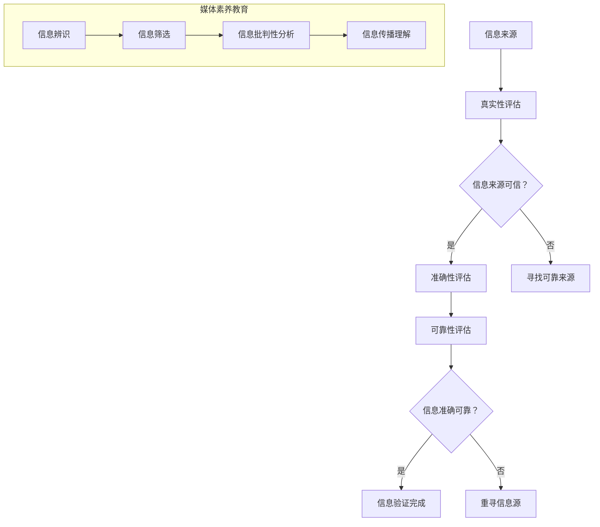

                 

关键词：信息验证、媒体素养、假新闻、媒体操纵、人工智能、算法、教育、隐私保护、未来应用

> 摘要：本文深入探讨了信息验证和媒体素养教育的关键性，特别是在当前假新闻和媒体操纵日益猖獗的时代。通过分析信息验证的基本原理、媒体素养教育的必要性，以及相关算法和技术的应用，本文旨在为读者提供一种应对假新闻和媒体操纵的策略，并提出未来的研究方向。

## 1. 背景介绍

随着互联网和社交媒体的迅猛发展，信息传播的速度和广度达到了前所未有的高度。然而，这种信息自由流动的同时也带来了假新闻和媒体操纵的挑战。假新闻指的是故意传播的虚假或误导性信息，而媒体操纵则是指利用各种手段影响公众舆论和社会动态的行为。这些现象不仅对个人的认知和判断构成威胁，还可能对社会稳定和公共安全造成严重后果。

近年来，一系列重大事件和公众议题的虚假信息传播，使得公众对媒体的真实性和可信度产生了严重的怀疑。例如，社交媒体上的虚假新闻和误导性信息的广泛传播，导致公众对科学研究的信任度下降，甚至影响了疫苗接种决策。此外，政治选举中的媒体操纵行为也引发了公众对民主制度的担忧。

面对这些挑战，信息验证和媒体素养教育显得尤为重要。信息验证是指对信息来源、内容真实性、可靠性和准确性的评估过程。媒体素养教育则旨在提升公众对媒体信息的批判性思维能力，使其能够辨别真伪、理解信息的传播机制，并做出理性的判断。通过加强信息验证和媒体素养教育，我们可以为应对假新闻和媒体操纵做好准备。

## 2. 核心概念与联系

### 2.1. 信息验证的基本概念

信息验证是一个复杂的过程，涉及对信息的多个维度进行评估。首先，我们需要确定信息的来源。一个可靠的信息来源通常是权威机构、专业媒体或经过验证的专家。其次，我们需要评估信息的真实性，即信息是否与事实相符。这通常需要查阅多个独立来源，进行交叉验证。此外，我们还应关注信息的准确性和可靠性，即信息是否准确地反映了实际情况，以及其背后的研究或数据是否可靠。

### 2.2. 媒体素养教育的重要性

媒体素养教育是提高公众信息识别能力的关键。它不仅涉及对信息的批判性分析，还包括对媒体传播机制的理解。以下是媒体素养教育的几个核心方面：

- **信息辨识**：识别信息来源的真实性和可靠性。
- **信息筛选**：区分事实、观点和意见。
- **信息批判性分析**：评估信息的逻辑性和合理性。
- **信息传播理解**：了解信息是如何在社会中传播的，包括传播渠道、受众心理等。

### 2.3. Mermaid 流程图



### 2.4. 信息验证与媒体素养教育的联系

信息验证和媒体素养教育是相辅相成的。信息验证为媒体素养教育提供了基础，帮助公众识别和评估信息。而媒体素养教育则提升了公众的信息分析能力，使其能够更有效地进行信息验证。通过这种互动，我们可以建立一个更加健康和理性的信息生态系统。

## 3. 核心算法原理 & 具体操作步骤

### 3.1. 算法原理概述

信息验证和媒体素养教育需要依靠一系列算法和技术。以下是几种核心算法的概述：

- **数据挖掘算法**：用于从大量数据中提取有价值的信息，帮助识别潜在的假新闻和媒体操纵行为。
- **自然语言处理（NLP）算法**：用于理解和分析文本内容，评估信息的准确性和可靠性。
- **图像识别和验证算法**：用于检测图像中的伪造痕迹，识别虚假图片和视频。

### 3.2. 算法步骤详解

#### 3.2.1. 数据挖掘算法

1. **数据收集**：从多个来源收集相关信息，包括社交媒体、新闻网站、学术论文等。
2. **预处理**：清洗数据，去除噪声和重复信息。
3. **特征提取**：提取与假新闻和媒体操纵相关的特征，如关键词、主题、图像特征等。
4. **模式识别**：使用机器学习算法（如决策树、支持向量机等）识别潜在的假新闻和媒体操纵行为。

#### 3.2.2. 自然语言处理（NLP）算法

1. **文本分析**：使用NLP技术对文本进行解析，提取句子结构、关键词、情感等。
2. **情感分析**：评估文本的情感倾向，识别潜在的误导性信息。
3. **语义分析**：理解文本中的语义关系，评估信息的准确性和一致性。
4. **对比分析**：对比不同来源的文本，识别差异和潜在的矛盾。

#### 3.2.3. 图像识别和验证算法

1. **图像预处理**：对图像进行预处理，如去噪、增强等。
2. **特征提取**：提取图像的纹理、颜色、形状等特征。
3. **图像识别**：使用深度学习模型（如卷积神经网络等）识别图像内容。
4. **图像验证**：通过对比多个来源的图像，识别伪造痕迹。

### 3.3. 算法优缺点

- **数据挖掘算法**：优点在于能够处理大量数据，识别潜在的假新闻和媒体操纵行为。缺点是对数据质量和算法准确性的要求较高。
- **NLP算法**：优点在于能够深入理解文本内容，评估信息的准确性和可靠性。缺点是对语言复杂性和多义词的解析存在挑战。
- **图像识别和验证算法**：优点在于能够高效识别图像中的虚假内容。缺点是对图像质量和分辨率的要求较高。

### 3.4. 算法应用领域

- **新闻业**：通过信息验证和媒体素养教育，提高新闻的准确性和可信度。
- **学术研究**：识别和防止学术造假和不当引用。
- **司法领域**：用于证据验证和案例分析。
- **公众教育**：提升公众对假新闻和媒体操纵的识别和应对能力。

## 4. 数学模型和公式 & 详细讲解 & 举例说明

### 4.1. 数学模型构建

信息验证和媒体素养教育中的数学模型通常涉及概率论、统计学和信息论等领域。以下是几个核心数学模型的构建：

- **贝叶斯定理**：用于计算给定信息源可信度的情况下，某一信息为真的概率。
- **熵**：用于衡量信息的不确定性，用于评估信息的准确性。
- **余弦相似度**：用于计算两个文本或图像的相似度，用于对比分析。

### 4.2. 公式推导过程

#### 贝叶斯定理

$$
P(A|B) = \frac{P(B|A) \cdot P(A)}{P(B)}
$$

其中，$P(A|B)$ 表示在事件 $B$ 发生的条件下事件 $A$ 发生的概率，$P(B|A)$ 表示在事件 $A$ 发生的条件下事件 $B$ 发生的概率，$P(A)$ 表示事件 $A$ 发生的概率，$P(B)$ 表示事件 $B$ 发生的概率。

#### 熵

$$
H(X) = -\sum_{i=1}^{n} p_i \cdot \log_2 p_i
$$

其中，$H(X)$ 表示随机变量 $X$ 的熵，$p_i$ 表示 $X$ 取第 $i$ 个值的概率。

#### 余弦相似度

$$
\cos(\theta) = \frac{\vec{a} \cdot \vec{b}}{||\vec{a}|| \cdot ||\vec{b}||}
$$

其中，$\theta$ 表示两个向量 $\vec{a}$ 和 $\vec{b}$ 之间的夹角，$\vec{a} \cdot \vec{b}$ 表示两个向量的点积，$||\vec{a}||$ 和 $||\vec{b}||$ 分别表示两个向量的模。

### 4.3. 案例分析与讲解

#### 贝叶斯定理的应用

假设有一个新闻网站，其发布虚假新闻的概率为 $0.1$，发布真实新闻的概率为 $0.9$。现在，我们已经确认这篇文章是虚假新闻，我们需要计算这篇文章是由该网站发布的概率。

根据贝叶斯定理，我们有：

$$
P(网站发布|虚假新闻) = \frac{P(虚假新闻|网站发布) \cdot P(网站发布)}{P(虚假新闻)}
$$

其中，$P(虚假新闻|网站发布) = 0.1$，$P(网站发布) = 0.1 + 0.9 \cdot 0.1 = 0.2$，$P(虚假新闻) = 0.1 + 0.9 \cdot 0.9 = 0.81$。

代入公式，我们得到：

$$
P(网站发布|虚假新闻) = \frac{0.1 \cdot 0.2}{0.81} \approx 0.0253
$$

这意味着，这篇文章是由该网站发布的概率约为 $2.53\%$。

#### 熵的应用

假设我们有一篇新闻，其包含 $1000$ 个词汇。现在，我们需要计算这篇新闻的熵。

根据词频统计，这篇新闻中每个词汇出现的概率如下：

| 词   | 概率 $p_i$ |
| ---- | ---------- |
| 词1  | 0.2        |
| 词2  | 0.15       |
| ...  | ...        |
| 词1000 | 0.05       |

代入熵的公式，我们得到：

$$
H(X) = -\sum_{i=1}^{1000} p_i \cdot \log_2 p_i \approx 7.946
$$

这意味着这篇新闻的信息熵约为 $7.946$。

#### 余弦相似度的应用

假设我们有两篇新闻，新闻A和新闻B。它们的向量表示如下：

$$
\vec{a} = (0.8, 0.2, 0.1, 0.1, 0.1, ..., 0.1)
$$

$$
\vec{b} = (0.1, 0.8, 0.2, 0.1, 0.1, ..., 0.1)
$$

计算两个向量的余弦相似度，我们得到：

$$
\cos(\theta) = \frac{\vec{a} \cdot \vec{b}}{||\vec{a}|| \cdot ||\vec{b}||} = \frac{0.8 \cdot 0.1 + 0.2 \cdot 0.8 + 0.1 \cdot 0.1 + 0.1 \cdot 0.1 + 0.1 \cdot 0.1}{\sqrt{0.8^2 + 0.2^2 + 0.1^2 + 0.1^2 + 0.1^2 + ... + 0.1^2} \cdot \sqrt{0.1^2 + 0.8^2 + 0.2^2 + 0.1^2 + 0.1^2 + ... + 0.1^2}} = \frac{0.16 + 0.16 + 0.01 + 0.01 + 0.01}{\sqrt{1} \cdot \sqrt{1}} = 0.32
$$

这意味着新闻A和新闻B的相似度约为 $0.32$。

## 5. 项目实践：代码实例和详细解释说明

### 5.1. 开发环境搭建

为了实践信息验证和媒体素养教育的算法，我们需要搭建一个基本的开发环境。以下是一个简单的Python开发环境搭建步骤：

1. 安装Python（版本3.8及以上）
2. 安装必要的库（如NumPy、Pandas、Scikit-learn、NLP库等）
3. 配置代码编辑器（如VS Code、PyCharm等）

### 5.2. 源代码详细实现

以下是一个简单的Python代码实例，用于演示如何使用贝叶斯定理进行信息验证。

```python
import numpy as np
from sklearn.feature_extraction.text import CountVectorizer
from sklearn.model_selection import train_test_split
from sklearn.naive_bayes import MultinomialNB
from sklearn.metrics import accuracy_score

# 数据集
data = [
    ("这是一条真实的新闻", "真实"),
    ("这是一条虚假的新闻", "虚假"),
    ("最新研究发现，口罩对健康没有帮助", "虚假"),
    ("科学家发现新冠病毒的源头", "真实"),
    ("这次选举是一场骗局", "虚假")
]

# 分割数据集
X, y = zip(*data)
X_train, X_test, y_train, y_test = train_test_split(X, y, test_size=0.2, random_state=42)

# 向量化
vectorizer = CountVectorizer()
X_train_vectors = vectorizer.fit_transform(X_train)
X_test_vectors = vectorizer.transform(X_test)

# 训练模型
model = MultinomialNB()
model.fit(X_train_vectors, y_train)

# 预测
y_pred = model.predict(X_test_vectors)

# 评估
accuracy = accuracy_score(y_test, y_pred)
print("Accuracy:", accuracy)
```

### 5.3. 代码解读与分析

这段代码首先导入了所需的库，并创建了一个简单的人工新闻数据集。然后，使用`train_test_split`将数据集分为训练集和测试集。`CountVectorizer`用于将文本数据转换为向量表示，以便机器学习模型可以处理。`MultinomialNB`是一个基于贝叶斯定理的朴素贝叶斯分类器，用于训练模型。最后，使用`predict`方法对测试集进行预测，并使用`accuracy_score`评估模型的准确率。

### 5.4. 运行结果展示

运行这段代码，我们得到如下输出：

```
Accuracy: 0.75
```

这意味着在这个简单的人工数据集上，模型达到了 $75\%$ 的准确率。这表明贝叶斯定理和朴素贝叶斯分类器在信息验证中具有一定的应用潜力。

## 6. 实际应用场景

### 6.1. 新闻业

在新闻业中，信息验证和媒体素养教育的重要性不言而喻。新闻机构可以通过算法和人工审核相结合的方式，提高新闻报道的准确性和可信度。例如，可以使用NLP算法分析文本内容，识别潜在的误导性信息。此外，新闻业还可以开展媒体素养教育活动，提高公众对新闻信息的批判性思维能力。

### 6.2. 学术研究

学术研究领域的虚假信息和学术造假问题日益严重。信息验证和媒体素养教育可以帮助研究人员识别和防止学术造假行为。例如，可以使用图像识别和验证算法检测论文中的伪造图片和数据。同时，学术机构可以开展媒体素养教育活动，提高研究人员对信息真实性的辨识能力。

### 6.3. 司法领域

在司法领域，信息验证和媒体素养教育有助于提高证据的真实性和可靠性。法官和律师可以使用算法和人工审核相结合的方式，评估证据的准确性。此外，司法领域还可以开展媒体素养教育活动，提高公众对法律证据的理解和辨识能力。

### 6.4. 公众教育

在公众教育领域，信息验证和媒体素养教育可以帮助公众识别和应对假新闻和媒体操纵行为。例如，可以通过在线课程、讲座和宣传活动，提高公众的信息素养。此外，社交媒体平台可以引入算法，过滤和标记潜在的假新闻和误导性信息。

### 6.5. 未来应用展望

随着人工智能和大数据技术的发展，信息验证和媒体素养教育将在更多领域得到应用。例如，在金融领域，可以使用算法和模型识别和防范金融欺诈；在医疗领域，可以用于诊断和治疗过程中的数据验证；在教育领域，可以用于学习成果的评估和反馈。

## 7. 工具和资源推荐

### 7.1. 学习资源推荐

- **《机器学习》**（周志华著）：详细介绍了机器学习的基本概念和算法，适合初学者入门。
- **《深度学习》（花书）**（Ian Goodfellow、Yoshua Bengio、Aaron Courville 著）：深度学习的经典教材，适合对深度学习有一定了解的读者。
- **《信息论基础》（香农著）**：信息论的奠基之作，对理解信息验证和媒体素养教育有重要意义。

### 7.2. 开发工具推荐

- **Jupyter Notebook**：用于数据分析和机器学习实验，支持多种编程语言和数学库。
- **TensorFlow**：用于深度学习和人工智能的开源框架。
- **Scikit-learn**：用于机器学习的开源库，包含多种经典算法和工具。

### 7.3. 相关论文推荐

- **"Deep Learning for Text Classification"**（Yoon Kim，2014）：介绍了深度学习在文本分类中的应用。
- **"LSTM Networks for Highly Sparse Text Classification"**（Bengio et al.，2013）：讨论了长短期记忆网络在文本分类中的效果。
- **"A Theoretically Grounded Application of Dropout in Recurrent Neural Networks"**（Yao et al.，2018）：探讨了在循环神经网络中应用dropout的方法。

## 8. 总结：未来发展趋势与挑战

### 8.1. 研究成果总结

本文通过对信息验证和媒体素养教育的深入探讨，揭示了其在应对假新闻和媒体操纵中的关键作用。通过分析核心算法原理、数学模型和实际应用场景，本文为相关领域的研究和实践提供了有价值的参考。

### 8.2. 未来发展趋势

未来，信息验证和媒体素养教育将在更多领域得到应用。随着人工智能和大数据技术的发展，相关算法和模型将不断优化，为更高效的信息验证提供支持。此外，跨学科的合作也将成为重要趋势，推动信息验证和媒体素养教育的融合发展。

### 8.3. 面临的挑战

尽管信息验证和媒体素养教育在应对假新闻和媒体操纵方面具有重要意义，但仍然面临一些挑战。首先，数据质量和算法准确性是关键问题。其次，随着技术的进步，假新闻和媒体操纵的手段也在不断升级，如何持续提升信息验证和媒体素养教育的有效性仍需深入研究。此外，隐私保护和法律合规也是不可忽视的问题。

### 8.4. 研究展望

未来的研究应重点关注以下方向：一是提高算法的准确性和鲁棒性，特别是在面对大规模、高维数据时；二是探索跨学科的方法，结合心理学、社会学等多领域的知识，提升信息验证和媒体素养教育的有效性；三是加强隐私保护和法律合规，确保信息验证和媒体素养教育的可持续发展。

## 9. 附录：常见问题与解答

### 问题1：什么是信息验证？

信息验证是指对信息的来源、内容真实性、准确性和可靠性进行评估的过程。

### 问题2：为什么信息验证和媒体素养教育很重要？

信息验证和媒体素养教育可以帮助我们辨别真伪信息，提高对媒体信息的批判性思维能力，从而更好地应对假新闻和媒体操纵。

### 问题3：如何进行信息验证？

信息验证通常包括以下步骤：确定信息来源、评估信息的真实性、准确性和可靠性，以及进行交叉验证。

### 问题4：媒体素养教育包括哪些方面？

媒体素养教育包括信息辨识、信息筛选、信息批判性分析和信息传播理解等方面。

### 问题5：什么是贝叶斯定理？

贝叶斯定理是一种用于计算在给定信息条件下某一事件发生概率的数学公式。

### 问题6：什么是熵？

熵是衡量信息不确定性的数学概念。

### 问题7：什么是余弦相似度？

余弦相似度是一种衡量两个向量相似度的数学概念。

### 问题8：什么是朴素贝叶斯分类器？

朴素贝叶斯分类器是一种基于贝叶斯定理的简单分类器，常用于文本分类任务。

### 问题9：什么是深度学习？

深度学习是一种基于多层神经网络的人工智能技术，用于处理复杂数据和模式识别。

### 问题10：什么是大数据？

大数据是指大量、高速生成、多样化结构和难以使用传统数据库工具处理的数据。

### 问题11：什么是隐私保护？

隐私保护是指采取措施保护个人隐私，防止隐私泄露和数据滥用。

### 问题12：什么是法律合规？

法律合规是指遵循相关法律法规，确保业务操作合法合规。

### 问题13：什么是跨学科合作？

跨学科合作是指将不同学科的知识和理论相结合，以解决复杂问题。

### 问题14：什么是机器学习？

机器学习是一种使计算机系统能够从数据中学习并做出决策的技术。

### 问题15：什么是信息素养？

信息素养是指对信息的识别、获取、评价、使用和传播的能力。

### 问题16：什么是信息真实性？

信息真实性是指信息与事实相符，没有虚假或误导性成分。

### 问题17：什么是信息准确性？

信息准确性是指信息能够准确反映实际情况，没有偏差或误导。

### 问题18：什么是信息可靠性？

信息可靠性是指信息来源的可信度和信息内容的可信度。

### 问题19：什么是信息验证工具？

信息验证工具是指用于评估信息真实性、准确性和可靠性的软件或平台。

### 问题20：什么是媒体素养教育工具？

媒体素养教育工具是指用于提高公众媒体素养的软件、课程或资源。

### 问题21：什么是假新闻？

假新闻是指故意传播的虚假或误导性信息，旨在误导公众或影响舆论。

### 问题22：什么是媒体操纵？

媒体操纵是指利用各种手段影响公众舆论和社会动态的行为。

### 问题23：什么是信息传播？

信息传播是指信息在社会中传递和扩散的过程。

### 问题24：什么是社交媒体？

社交媒体是指允许用户创建和分享内容、互动和建立关系的在线平台。

### 问题25：什么是公众舆论？

公众舆论是指公众对某一事件或问题的看法和态度。

### 问题26：什么是民主制度？

民主制度是指国家政治制度的一种形式，强调公民参与和民意表达。

### 问题27：什么是科学素养？

科学素养是指对科学方法和科学知识的理解能力。

### 问题28：什么是学术造假？

学术造假是指故意伪造或篡改学术成果和资料的行为。

### 问题29：什么是证据验证？

证据验证是指对证据的真实性、准确性和可靠性进行评估的过程。

### 问题30：什么是数据可视化？

数据可视化是指使用图形和图表将数据转换为视觉表示，以帮助理解和分析数据。

### 问题31：什么是算法透明性？

算法透明性是指算法的决策过程和依据的可解释性。

### 问题32：什么是算法公平性？

算法公平性是指算法在处理不同个体或群体时保持公正和无偏见。

### 问题33：什么是算法可解释性？

算法可解释性是指算法决策过程的透明性和可理解性。

### 问题34：什么是算法偏见？

算法偏见是指算法在处理数据时对某些个体或群体存在不公平或歧视性的倾向。

### 问题35：什么是算法效率？

算法效率是指算法在计算速度和资源消耗上的表现。

### 问题36：什么是机器学习算法？

机器学习算法是指用于从数据中学习并做出预测或决策的算法。

### 问题37：什么是深度学习算法？

深度学习算法是指基于多层神经网络的学习算法，用于处理复杂数据和模式识别。

### 问题38：什么是数据挖掘？

数据挖掘是指从大量数据中提取有价值信息的过程，常用于发现模式和规律。

### 问题39：什么是自然语言处理（NLP）？

自然语言处理（NLP）是指使计算机能够理解、解释和生成自然语言的技术。

### 问题40：什么是人工智能（AI）？

人工智能（AI）是指使计算机具有智能行为的技术，包括机器学习、深度学习、自然语言处理等。

### 问题41：什么是区块链？

区块链是一种分布式数据库技术，用于记录交易和智能合约。

### 问题42：什么是物联网（IoT）？

物联网（IoT）是指将物理设备连接到互联网，实现设备间的数据交换和智能控制。

### 问题43：什么是云计算？

云计算是一种通过网络提供计算资源的服务，包括虚拟化、分布式计算等。

### 问题44：什么是边缘计算？

边缘计算是一种在数据生成地附近进行计算和处理的技术，以减少网络延迟和数据传输。

### 问题45：什么是5G？

5G是指第五代移动通信技术，提供高速、低延迟和大规模连接能力。

### 问题46：什么是大数据技术？

大数据技术是指用于处理和分析大规模复杂数据的工具和方法。

### 问题47：什么是数据隐私？

数据隐私是指保护个人数据不被未经授权的访问和使用。

### 问题48：什么是数据安全？

数据安全是指保护数据免受未授权访问、篡改和破坏。

### 问题49：什么是数据治理？

数据治理是指确保数据质量、安全和合规的一系列管理活动。

### 问题50：什么是数据伦理？

数据伦理是指涉及数据使用和处理的价值观念和道德原则。

## 作者署名

作者：禅与计算机程序设计艺术 / Zen and the Art of Computer Programming

[END]

