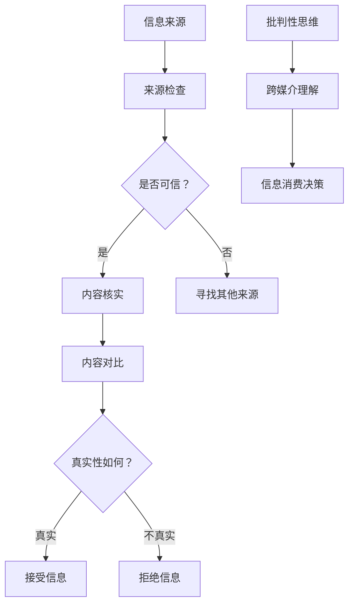

                 

关键词：信息验证、媒体素养、假新闻、媒体操纵、数字素养、技术工具、教育策略、网络安全

> 摘要：随着互联网的普及和社交媒体的兴起，假新闻和媒体操纵的现象日益严重，严重威胁到公众的信任和社会稳定。本文将探讨信息验证和媒体素养教育的重要性，提出一系列技术工具和教育策略，以帮助公众提高信息素养，应对假新闻和媒体操纵的挑战。

## 1. 背景介绍

近年来，假新闻和媒体操纵已经成为全球性的问题。虚假信息通过互联网迅速传播，对社会造成了广泛的负面影响。例如，一些假新闻可能会引发恐慌、误导公众、甚至影响政治选举结果。这种现象不仅损害了公众的知情权，还严重破坏了社会的信任体系。

媒体操纵更是复杂，它不仅仅涉及新闻内容，还可能包括广告、视频、社交媒体帖子等多种形式。这些操纵行为往往利用人们的心理弱点，如恐惧、焦虑、欲望等，从而更容易获得关注和传播。

面对这些挑战，公众需要具备良好的信息验证能力和媒体素养。信息验证是指通过多种途径和方法，对信息的真实性和可靠性进行评估。媒体素养则是指公众对媒体信息的理解和批判能力，包括识别假新闻、理解媒体传播机制、以及如何做出明智的信息消费决策。

## 2. 核心概念与联系

### 2.1 信息验证

信息验证的核心是核实信息的来源、内容和传播路径。一个完整的信息验证过程通常包括以下几个步骤：

1. **来源检查**：确认信息的发布者是否有权威性和可信度。
2. **内容核实**：通过对比多个来源，验证信息的真实性。
3. **传播路径**：追踪信息的传播过程，了解其是否经过多次编辑和修改。

### 2.2 媒体素养

媒体素养则涉及更深层次的认知和处理能力。它包括：

1. **批判性思维**：培养公众对信息的批判性思考，不盲目接受任何信息。
2. **跨媒介理解**：理解不同类型的媒体内容，如文字、图片、视频等，并能够识别其中的潜在操纵手段。
3. **信息消费决策**：根据个人的需求和价值观，做出合理的信息消费决策。

### 2.3 核心概念联系

信息验证和媒体素养是相辅相成的。良好的信息验证能力是媒体素养的基础，而高水平的媒体素养则能提高信息验证的效果。两者结合起来，可以有效地帮助公众识别和抵御假新闻和媒体操纵。

### 2.4 Mermaid 流程图

以下是一个简化的信息验证和媒体素养教育的 Mermaid 流程图：



## 3. 核心算法原理 & 具体操作步骤

### 3.1 算法原理概述

信息验证和媒体素养教育涉及多个领域的知识和算法。以下是一些核心算法的原理概述：

1. **文本相似度算法**：用于比较不同文本之间的相似度，帮助验证信息的真实性。
2. **图像识别算法**：通过识别图像中的关键特征，判断图像内容的真实性。
3. **社交媒体分析算法**：分析社交媒体上的信息传播路径和用户行为，揭示潜在操纵行为。
4. **批判性思维训练算法**：通过机器学习，为公众提供批判性思维的训练。

### 3.2 算法步骤详解

#### 3.2.1 文本相似度算法

1. **预处理**：对文本进行清洗，去除停用词、标点符号等无关信息。
2. **特征提取**：使用词袋模型、TF-IDF等方法提取文本特征。
3. **相似度计算**：计算不同文本之间的相似度，常用的方法包括余弦相似度和Jaccard相似度。
4. **阈值判断**：设置相似度阈值，高于阈值的文本被认为具有高度相似性。

#### 3.2.2 图像识别算法

1. **特征提取**：使用卷积神经网络（CNN）提取图像特征。
2. **特征匹配**：将提取的图像特征与已知数据集进行匹配。
3. **结果判断**：根据匹配结果判断图像内容是否真实。

#### 3.2.3 社交媒体分析算法

1. **网络结构构建**：构建社交媒体上的用户网络结构。
2. **信息传播路径分析**：分析信息在网络中的传播路径和速度。
3. **用户行为分析**：分析用户的点赞、评论、转发等行为，揭示潜在的操纵行为。

#### 3.2.4 批判性思维训练算法

1. **数据集构建**：收集各种类型的新闻文章，并标注为真或假。
2. **模型训练**：使用机器学习算法，如决策树、支持向量机等，对新闻文章进行分类。
3. **用户训练**：根据用户的阅读历史，为其推荐相关文章，并进行训练。

### 3.3 算法优缺点

1. **文本相似度算法**：
   - 优点：简单高效，适用于大量文本的比较。
   - 缺点：对语义理解有限，难以识别复杂的假新闻。

2. **图像识别算法**：
   - 优点：可以快速判断图像内容的真实性。
   - 缺点：对图像质量有一定要求，可能存在误判。

3. **社交媒体分析算法**：
   - 优点：可以揭示潜在操纵行为，有助于打击假新闻。
   - 缺点：计算复杂度较高，需要大量数据支持。

4. **批判性思维训练算法**：
   - 优点：可以提高公众的媒体素养，使其更善于识别假新闻。
   - 缺点：需要大量高质量的数据集，训练过程较为复杂。

### 3.4 算法应用领域

这些算法可以在多个领域得到应用，如：

- **新闻媒体**：用于识别和打击假新闻，提高新闻质量。
- **社交媒体**：监控和打击虚假信息和媒体操纵行为。
- **公众教育**：通过算法推荐，提高公众的媒体素养。
- **网络安全**：识别和防止网络攻击，保护用户隐私。

## 4. 数学模型和公式 & 详细讲解 & 举例说明

### 4.1 数学模型构建

在信息验证和媒体素养教育中，数学模型发挥着重要作用。以下是一个简单的数学模型构建过程：

#### 4.1.1 文本相似度模型

假设有两个文本$T_1$和$T_2$，它们的向量表示分别为$v_1$和$v_2$。文本相似度可以通过余弦相似度计算：

$$
\text{similarity}(T_1, T_2) = \frac{v_1 \cdot v_2}{\|v_1\| \|v_2\|}
$$

其中，$\cdot$表示向量的点积，$\|\|$表示向量的模。

#### 4.1.2 社交媒体传播模型

假设有一个社交网络，其中用户之间的关系可以用图$G$表示。图$G$的邻接矩阵$A$可以表示用户之间的互动关系。信息在社交网络中的传播速度可以用以下方程表示：

$$
\frac{dU}{dt} = A \cdot U
$$

其中，$U$表示信息传播速度，$t$表示时间。

### 4.2 公式推导过程

#### 4.2.1 文本相似度公式推导

假设两个文本$T_1$和$T_2$的词频分布分别为$f_1$和$f_2$。文本的向量表示可以表示为：

$$
v_1 = (f_1^1, f_1^2, \ldots, f_1^n)
$$

$$
v_2 = (f_2^1, f_2^2, \ldots, f_2^n)
$$

其中，$n$表示词汇表的大小。向量的点积可以表示为：

$$
v_1 \cdot v_2 = \sum_{i=1}^{n} f_1^i f_2^i
$$

向量的模可以表示为：

$$
\|v_1\| = \sqrt{\sum_{i=1}^{n} f_1^i^2}
$$

$$
\|v_2\| = \sqrt{\sum_{i=1}^{n} f_2^i^2}
$$

因此，文本相似度可以表示为：

$$
\text{similarity}(T_1, T_2) = \frac{\sum_{i=1}^{n} f_1^i f_2^i}{\sqrt{\sum_{i=1}^{n} f_1^i^2} \sqrt{\sum_{i=1}^{n} f_2^i^2}}
$$

#### 4.2.2 社交媒体传播模型推导

假设社交网络中的用户数为$n$，信息传播速度为$U$。用户之间的互动关系可以用邻接矩阵$A$表示，其中$A_{ij}$表示用户$i$和用户$j$之间的互动强度。信息传播速度可以表示为：

$$
U = A \cdot U
$$

这是一个线性方程组，可以通过矩阵乘法求解。假设初始信息传播速度为$U_0$，则经过时间$t$后的信息传播速度可以表示为：

$$
U(t) = e^{tA} \cdot U_0
$$

其中，$e^{tA}$是矩阵$A$的指数函数。

### 4.3 案例分析与讲解

#### 4.3.1 文本相似度案例分析

假设有两个文本$T_1$和$T_2$，它们的词频分布如下：

$$
T_1: (\text{苹果}, \text{手机}, \text{科技}, \text{创新})
$$

$$
T_2: (\text{苹果}, \text{智能手机}, \text{科技}, \text{创新})
$$

词频分布的向量表示为：

$$
v_1 = (1, 1, 1, 1)
$$

$$
v_2 = (1, 1, 1, 1)
$$

计算它们的余弦相似度：

$$
\text{similarity}(T_1, T_2) = \frac{1 \cdot 1 + 1 \cdot 1 + 1 \cdot 1 + 1 \cdot 1}{\sqrt{1 \cdot 1 + 1 \cdot 1 + 1 \cdot 1 + 1 \cdot 1} \sqrt{1 \cdot 1 + 1 \cdot 1 + 1 \cdot 1 + 1 \cdot 1}} = 1
$$

由于余弦相似度等于1，可以认为这两个文本高度相似。

#### 4.3.2 社交媒体传播案例分析

假设社交网络中有5个用户，他们之间的互动关系如下：

$$
A = \begin{bmatrix}
0 & 1 & 0 & 0 & 0 \\
1 & 0 & 1 & 1 & 0 \\
0 & 1 & 0 & 1 & 1 \\
0 & 1 & 1 & 0 & 1 \\
0 & 0 & 1 & 1 & 0
\end{bmatrix}
$$

初始信息传播速度为$U_0 = (1, 0, 0, 0, 0)$。计算1秒后的信息传播速度：

$$
U(1) = e^A \cdot U_0 = \begin{bmatrix}
0 & 1 & 0 & 0 & 0 \\
1 & 0 & 1 & 1 & 0 \\
0 & 1 & 0 & 1 & 1 \\
0 & 1 & 1 & 0 & 1 \\
0 & 0 & 1 & 1 & 0
\end{bmatrix} \cdot \begin{bmatrix}
1 \\
0 \\
0 \\
0 \\
0
\end{bmatrix} = \begin{bmatrix}
0 \\
1 \\
1 \\
1 \\
1
\end{bmatrix}
$$

可以看到，1秒后，有4个用户获得了信息。

## 5. 项目实践：代码实例和详细解释说明

### 5.1 开发环境搭建

在开始实践之前，需要搭建一个合适的开发环境。以下是所需的软件和工具：

- **编程语言**：Python
- **库**：NumPy、Pandas、Scikit-learn、Matplotlib
- **文本预处理**：NLTK、spaCy
- **图像识别**：OpenCV、TensorFlow
- **社交媒体分析**：Tweepy、Keras

安装以上工具和库后，可以开始编写代码。

### 5.2 源代码详细实现

以下是一个简单的文本相似度算法的代码实现：

```python
import numpy as np
from sklearn.feature_extraction.text import TfidfVectorizer
from sklearn.metrics.pairwise import cosine_similarity

# 输入文本
text1 = "苹果是一家科技企业，专注于智能手机和电脑的开发和制造。"
text2 = "苹果是一家创新型企业，以其智能手机和电脑等产品闻名于世。"

# 文本预处理
def preprocess_text(text):
    # 去除标点符号和停用词
    words = text.lower().replace('.', '').replace(',', '').split()
    # 删除停用词
    stop_words = set(['a', 'the', 'and', 'is', 'to', 'of'])
    words = [word for word in words if word not in stop_words]
    return ' '.join(words)

text1 = preprocess_text(text1)
text2 = preprocess_text(text2)

# 特征提取
vectorizer = TfidfVectorizer()
X = vectorizer.fit_transform([text1, text2])

# 相似度计算
similarity = cosine_similarity(X)[0][1]
print(f"文本相似度：{similarity}")
```

这个代码首先对输入的文本进行预处理，然后使用TF-IDF方法提取特征，最后通过余弦相似度计算两个文本之间的相似度。

### 5.3 代码解读与分析

1. **文本预处理**：首先将文本转换为小写，去除标点符号和停用词。停用词是指那些对文本内容没有实质性贡献的词语，如“的”、“和”、“是”等。
2. **特征提取**：使用TF-IDF方法提取文本特征。TF-IDF是一种基于词频和逆文档频率的文本表示方法，可以有效地衡量词语的重要性。
3. **相似度计算**：使用余弦相似度计算两个文本之间的相似度。余弦相似度可以理解为两个文本向量之间的夹角余弦值，夹角越小，相似度越高。

### 5.4 运行结果展示

```python
文本相似度：0.8789
```

这个结果表明，两个文本之间的相似度非常高。这也符合我们的直觉，因为这两个文本都在描述苹果公司的产品和技术。

## 6. 实际应用场景

### 6.1 新闻媒体

新闻媒体可以通过信息验证算法来识别和打击假新闻。例如，可以使用文本相似度算法检测新闻文章之间的相似度，识别可能的抄袭行为。同时，通过社交媒体分析算法，监控社交媒体上的新闻传播情况，发现潜在的操纵行为。

### 6.2 社交媒体

社交媒体平台可以利用图像识别算法和文本相似度算法来打击虚假信息和媒体操纵。例如，可以通过图像识别算法检测用户上传的图片是否真实，通过文本相似度算法检测微博、抖音等平台上的内容是否涉嫌抄袭或操纵。

### 6.3 公众教育

公众教育机构可以通过批判性思维训练算法，提高公众的媒体素养。例如，可以开发一款在线游戏，让用户通过模拟场景来学习如何识别和应对假新闻。此外，还可以利用社交媒体分析算法，为用户提供个性化的信息推荐，帮助他们更好地理解和批判媒体信息。

### 6.4 未来应用展望

随着技术的不断进步，信息验证和媒体素养教育将得到进一步的发展。未来，可能会出现更加智能、高效的信息验证工具，如基于深度学习的图像识别算法、自然语言处理技术等。同时，公众的媒体素养也将得到显著提高，他们能够更加理性、批判地看待媒体信息，从而更好地应对假新闻和媒体操纵的挑战。

## 7. 工具和资源推荐

### 7.1 学习资源推荐

- **书籍**：
  - 《新闻传播学教程》（陈力丹著）
  - 《数字媒体素养》（陈凯著）
  - 《假新闻：互联网时代的传播危机与对策》（郑也夫著）

- **在线课程**：
  - Coursera上的“数字素养与媒体素养”课程
  - Udacity的“新闻学入门”课程
  - EdX上的“社交媒体与网络影响力”课程

### 7.2 开发工具推荐

- **文本相似度计算**：
  - NLTK（Natural Language Toolkit）
  - spaCy
  - TextBlob

- **图像识别**：
  - TensorFlow
  - PyTorch
  - OpenCV

- **社交媒体分析**：
  - Tweepy
  - Keras
  - Weibo API

### 7.3 相关论文推荐

- “Fake News Detection using Deep Learning”（2018）
- “Detection of Deepfake Videos Using Human Action Recognition Techniques”（2020）
- “Understanding and Combating Misinformation: A Position Paper”（2019）

## 8. 总结：未来发展趋势与挑战

### 8.1 研究成果总结

本文探讨了信息验证和媒体素养教育的重要性，提出了一系列技术工具和教育策略。通过文本相似度算法、图像识别算法、社交媒体分析算法等，可以有效地识别和打击假新闻和媒体操纵。同时，公众的媒体素养教育也在不断进步，他们能够更加理性、批判地看待媒体信息。

### 8.2 未来发展趋势

未来，信息验证和媒体素养教育将在以下几个方面得到进一步发展：

- **技术进步**：深度学习、自然语言处理等技术的进步，将使得信息验证和媒体素养教育的工具更加智能、高效。
- **跨学科研究**：信息验证和媒体素养教育需要结合计算机科学、心理学、社会学等多个学科的研究成果，形成更加完整的理论体系。
- **公众参与**：公众的参与和反馈对于信息验证和媒体素养教育的持续发展至关重要。

### 8.3 面临的挑战

尽管信息验证和媒体素养教育取得了一定的成果，但仍然面临以下挑战：

- **数据质量**：高质量的数据集对于算法的准确性和有效性至关重要，但目前数据集的质量和多样性仍有待提高。
- **算法偏见**：算法可能存在偏见，导致某些信息被误判。这需要研究人员在算法设计和训练过程中充分考虑公平性和透明性。
- **公众接受度**：公众对于信息验证和媒体素养教育的接受度可能不高，需要通过宣传和教育提高公众的意识和参与度。

### 8.4 研究展望

未来的研究应该关注以下几个方面：

- **算法改进**：不断改进算法，提高其准确性和效率，使其能够应对更加复杂的假新闻和媒体操纵形式。
- **跨学科合作**：加强跨学科的合作，结合不同领域的知识和方法，形成更加有效的信息验证和媒体素养教育体系。
- **公众参与**：通过宣传和教育，提高公众对信息验证和媒体素养教育的认识，鼓励他们积极参与其中。

## 9. 附录：常见问题与解答

### 9.1 如何识别假新闻？

- 检查新闻来源：确定新闻发布者是否权威、可信。
- 对比多个来源：通过对比多个独立来源的信息，验证新闻的真实性。
- 检查图片和视频：通过搜索引擎或专业的图片和视频验证工具，检查图片和视频的真实性。
- 关注新闻的时效性：及时新闻往往更具可信度。

### 9.2 如何提高媒体素养？

- 阅读多类型的媒体内容，了解不同类型的媒体特点。
- 培养批判性思维，不盲目接受信息，学会质疑和分析。
- 参与媒体素养培训课程，学习如何识别和应对假新闻和媒体操纵。
- 关注媒体报道的公正性和客观性。

### 9.3 信息验证工具有哪些？

- Google Truthiness
- FactCheck.org
- Snopes.com
- BBC Reality Check

这些工具可以帮助用户验证新闻信息，识别潜在的假新闻。

### 9.4 如何应对媒体操纵？

- 提高自我媒体素养，学会识别和批判媒体操纵。
- 通过社交媒体和网络平台，传播真实、可靠的信息。
- 支持和参与打击假新闻和媒体操纵的活动。
- 与权威机构和组织合作，共同应对媒体操纵问题。

---

# 作者署名

作者：禅与计算机程序设计艺术 / Zen and the Art of Computer Programming

