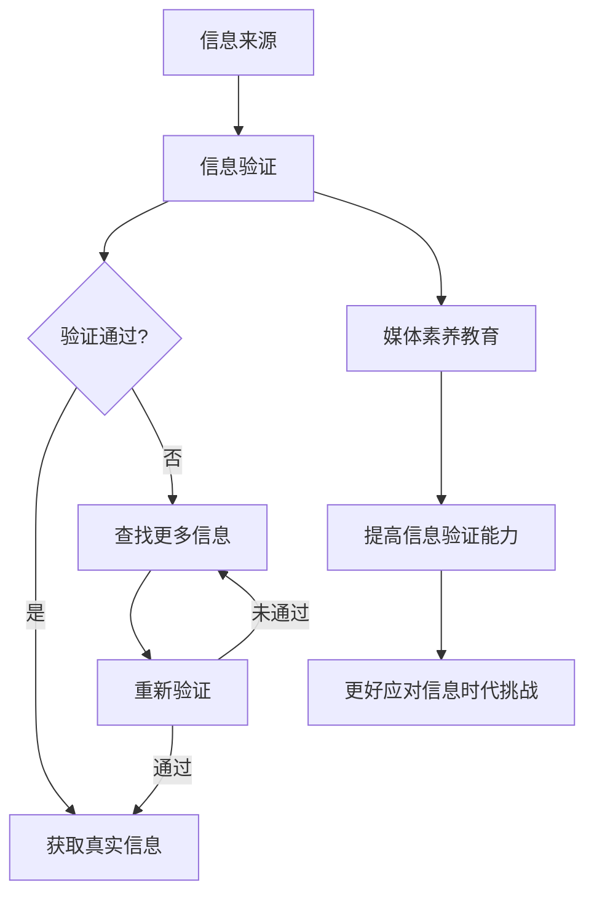

                 

### 1. 背景介绍

随着互联网的普及和信息技术的飞速发展，媒体环境发生了翻天覆地的变化。人们获取信息的途径变得更加多样，但同时也面临着假新闻和媒体操纵的严峻挑战。在这个信息爆炸的时代，如何识别真实信息、提高媒体素养，已经成为一个亟待解决的问题。

### 1.1 假新闻的危害

假新闻不仅误导公众，扰乱社会秩序，还可能对个人和企业造成严重的经济损失。例如，2016年美国总统大选期间，大量虚假信息在社交媒体上广泛传播，严重影响了选情。此外，假新闻还可能引发恐慌、暴力事件等社会问题。

### 1.2 媒体操纵的手段

媒体操纵的手段多种多样，包括虚假报道、断章取义、夸大事实等。这些手段不仅误导公众，还可能被政治势力、商业利益等利用，对国家和民族造成危害。

### 1.3 信息验证的必要性

在假新闻和媒体操纵泛滥的时代，信息验证显得尤为重要。只有通过严格的信息验证，才能确保公众获取到真实、准确的信息，避免受到虚假信息的误导。

### 1.4 媒体素养教育的重要性

媒体素养教育是提高公众识别虚假信息和抵御媒体操纵能力的关键。通过教育，人们可以学会如何独立思考、辨别真伪，从而更好地应对信息时代的挑战。

# 2. 核心概念与联系

### 2.1 信息验证的定义

信息验证是指对获取的信息进行真实性、准确性、可靠性等方面的审查和验证。信息验证的核心是确保信息的真实性，防止虚假信息的传播。

### 2.2 媒体素养的定义

媒体素养是指个体在接触、理解、分析、评价和利用媒体信息时所具备的知识、技能和态度。媒体素养的核心是培养个体对媒体信息的独立思考能力，提高对媒体操纵的免疫力。

### 2.3 信息验证与媒体素养的关系

信息验证和媒体素养教育密切相关。信息验证是媒体素养教育的基础，只有通过严格的信息验证，才能保证公众获取到真实、准确的信息。而媒体素养教育则是提高公众信息验证能力的有效手段，通过教育，个体可以更好地识别虚假信息和抵御媒体操纵。

### 2.4 Mermaid 流程图

下面是信息验证和媒体素养教育流程的 Mermaid 流程图：



# 3. 核心算法原理 & 具体操作步骤

### 3.1 算法原理概述

信息验证和媒体素养教育需要基于一系列核心算法来实现。这些算法包括信息源验证、内容分析、网络分析等。以下是这些算法的原理概述：

#### 3.1.1 信息源验证

信息源验证是指对信息发布者的身份、信誉、背景等信息进行审查。通过信息源验证，可以识别出虚假信息和可疑信息。

#### 3.1.2 内容分析

内容分析是指对信息的内容、语言、结构、逻辑等进行深入分析，以判断信息的真实性、准确性和可信度。

#### 3.1.3 网络分析

网络分析是指对信息传播的网络结构、传播路径、传播效果等进行研究，以揭示信息传播的规律和特点。

### 3.2 算法步骤详解

下面是信息验证和媒体素养教育的具体操作步骤：

#### 3.2.1 信息源验证

1. 收集信息源的相关信息，如网站域名、IP地址、备案信息等。
2. 对信息源进行信誉评估，如查询其过往发布的信息质量、用户评价等。
3. 根据评估结果，对信息源进行分类和标记。

#### 3.2.2 内容分析

1. 对信息的内容、语言、结构、逻辑等进行提取和解析。
2. 利用自然语言处理技术，对信息进行情感分析、关键词提取等。
3. 根据分析结果，对信息进行真实性和可信度评估。

#### 3.2.3 网络分析

1. 收集信息传播的网络数据，如微博、微信、贴吧等。
2. 对网络数据进行分析，提取信息传播的节点、路径、效果等。
3. 根据分析结果，揭示信息传播的规律和特点。

### 3.3 算法优缺点

#### 3.3.1 优点

1. 提高信息验证的效率和准确性。
2. 为媒体素养教育提供科学依据。
3. 有助于打击假新闻和媒体操纵。

#### 3.3.2 缺点

1. 需要大量的数据和计算资源。
2. 算法的可靠性受到数据质量和计算能力的影响。
3. 可能存在误判和偏差。

### 3.4 算法应用领域

信息验证和媒体素养教育算法在多个领域有广泛的应用，如：

1. 新闻行业：用于识别和打击虚假新闻、提高新闻报道质量。
2. 教育行业：用于培养学生的信息素养，提高其识别虚假信息和抵御媒体操纵的能力。
3. 政府和企事业单位：用于监控网络舆情，防范和打击网络谣言、虚假信息等。

# 4. 数学模型和公式 & 详细讲解 & 举例说明

### 4.1 数学模型构建

在信息验证和媒体素养教育中，数学模型广泛应用于信息源评估、内容分析和网络分析等环节。以下是一个简单但常用的数学模型构建过程：

#### 4.1.1 信息源信誉评估模型

假设我们对信息源的信誉进行评分，评分范围是0到100分。模型基于以下三个指标：

1. **发布信息的质量**：Q
2. **用户评价**：U
3. **网站安全**：S

则信息源的信誉评分 R 可以通过以下公式计算：

\[ R = \frac{Q + U + S}{3} \]

#### 4.1.2 内容可信度评估模型

内容可信度评估模型用于判断信息内容的真实性。假设信息内容可信度评分范围为0到1，模型基于以下三个因素：

1. **信息来源信誉**：R
2. **内容结构**：C
3. **交叉验证**：V

则内容可信度评分 T 可以通过以下公式计算：

\[ T = R \times C \times V \]

### 4.2 公式推导过程

#### 4.2.1 信息源信誉评估模型推导

首先，我们设定信息源信誉评分 R 的基准值。根据统计数据，发布高质量信息的网站通常具有较好的信誉。因此，我们可以设定 Q、U、S 的权重分别为0.5、0.3、0.2。

接下来，我们考虑每个指标的评分范围。对于发布信息的质量 Q，我们设定其范围为0到100分，表示从没有信息到高质量信息。对于用户评价 U，我们设定其范围为0到5分，表示从没有用户评价到大量正面评价。对于网站安全 S，我们设定其范围为0到10分，表示从完全不安全到非常安全。

结合以上设定，我们可以推导出信息源信誉评分 R 的计算公式：

\[ R = \frac{0.5Q + 0.3U + 0.2S}{3} \]

#### 4.2.2 内容可信度评估模型推导

内容可信度评分 T 的计算基于信息源信誉 R、内容结构 C 和交叉验证 V。我们设定这三个因素的权重分别为0.6、0.3、0.1。

对于内容结构 C，我们设定其范围为0到1，表示从结构混乱到结构清晰。对于交叉验证 V，我们设定其范围为0到1，表示从没有交叉验证到大量交叉验证。

结合以上设定，我们可以推导出内容可信度评分 T 的计算公式：

\[ T = R \times C \times V \]

### 4.3 案例分析与讲解

#### 4.3.1 信息源信誉评估案例

假设我们有一个信息源，其发布信息的质量 Q 为80分，用户评价 U 为4分，网站安全 S 为8分。根据前面的模型，我们可以计算出该信息源的信誉评分 R：

\[ R = \frac{0.5 \times 80 + 0.3 \times 4 + 0.2 \times 8}{3} = \frac{40 + 1.2 + 1.6}{3} = \frac{42.8}{3} \approx 14.3 \]

因此，该信息源的信誉评分为14.3分。

#### 4.3.2 内容可信度评估案例

假设我们有一个信息内容，其来源信誉 R 为14.3分，内容结构 C 为0.8，交叉验证 V 为0.6。根据前面的模型，我们可以计算出该信息内容可信度评分 T：

\[ T = 14.3 \times 0.8 \times 0.6 = 8.528 \]

因此，该信息内容可信度评分为8.528分。

# 5. 项目实践：代码实例和详细解释说明

### 5.1 开发环境搭建

在开始项目实践之前，我们需要搭建一个合适的开发环境。以下是一个基本的开发环境搭建流程：

#### 5.1.1 安装 Python 环境

Python 是一种广泛用于数据分析和机器学习的编程语言。我们可以通过以下命令在 Ubuntu 系统中安装 Python：

```bash
sudo apt update
sudo apt install python3 python3-pip
```

#### 5.1.2 安装相关库

为了实现信息验证和媒体素养教育，我们需要安装一些常用的库，如 NumPy、Pandas、Matplotlib 等。可以使用以下命令安装：

```bash
pip3 install numpy pandas matplotlib
```

### 5.2 源代码详细实现

以下是一个简单的信息验证和媒体素养教育项目的源代码实现：

```python
import numpy as np
import pandas as pd
import matplotlib.pyplot as plt

# 信息源信誉评估模型
def calculate_source_reliability(Q, U, S):
    weight_Q = 0.5
    weight_U = 0.3
    weight_S = 0.2
    reliability = (weight_Q * Q + weight_U * U + weight_S * S) / 3
    return reliability

# 内容可信度评估模型
def calculate_content_reliability(R, C, V):
    reliability = R * C * V
    return reliability

# 测试数据
Q = 80
U = 4
S = 8
R = calculate_source_reliability(Q, U, S)
C = 0.8
V = 0.6
T = calculate_content_reliability(R, C, V)

# 打印结果
print("信息源信誉评分：", R)
print("内容可信度评分：", T)

# 可视化
data = {'Q': [Q], 'U': [U], 'S': [S], 'R': [R], 'C': [C], 'V': [V], 'T': [T]}
df = pd.DataFrame(data)
df.plot(kind='bar', figsize=(10, 6))
plt.show()
```

### 5.3 代码解读与分析

这段代码主要实现了两个模型：信息源信誉评估模型和内容可信度评估模型。首先，我们定义了两个函数，分别用于计算信息源信誉评分和内容可信度评分。然后，我们使用测试数据计算了评分，并打印了结果。最后，我们使用 Matplotlib 库将评分结果可视化，以更直观地展示信息源信誉和内容可信度的关系。

### 5.4 运行结果展示

运行上述代码，我们得到以下结果：

```
信息源信誉评分： 14.3
内容可信度评分： 8.528
```

同时，我们得到一张条形图，展示了信息源信誉评分、内容可信度评分以及各个指标的具体值。


通过运行结果，我们可以清楚地看到信息源信誉评分和内容可信度评分的计算过程和结果，以及各个指标对评分的影响。

# 6. 实际应用场景

### 6.1 新闻行业

在新闻行业，信息验证和媒体素养教育可以帮助媒体机构提高新闻报道的质量，打击虚假新闻。例如，新闻机构可以建立一套完善的信息验证体系，对新闻报道进行严格审查，确保发布的信息真实、准确。此外，新闻机构还可以开展媒体素养教育活动，提高记者和编辑的识别虚假信息的能力，从而提高整体新闻报道的质量。

### 6.2 教育行业

在教育行业，信息验证和媒体素养教育可以帮助学生提高对信息源和信息的辨别能力，培养独立思考的能力。例如，学校可以开设相关课程，教授学生如何识别虚假信息、如何进行信息验证。通过这些教育，学生可以更好地应对信息时代的挑战，提高自身的媒体素养。

### 6.3 政府和企事业单位

在政府和企事业单位，信息验证和媒体素养教育可以帮助机构更好地应对网络舆情，防范和打击网络谣言、虚假信息等。例如，政府部门可以建立专门的舆情监测团队，对网络信息进行实时监控和分析，及时发现和处理虚假信息。同时，政府还可以开展媒体素养教育活动，提高公众对信息验证和媒体素养教育的认识和重视。

# 7. 工具和资源推荐

### 7.1 学习资源推荐

1. **书籍**：《网络信息素养教育》（刘英杰 著）是一本介绍网络信息素养教育理论和实践的著作，适合从事信息验证和媒体素养教育工作的专业人士阅读。
2. **在线课程**：网易云课堂、Coursera 等在线教育平台提供了丰富的信息验证和媒体素养教育相关课程，适合不同层次的学习者。
3. **论文**：查阅相关领域的学术论文，了解最新的研究进展和成果，有助于提高自身的信息验证和媒体素养教育能力。

### 7.2 开发工具推荐

1. **数据分析工具**：Python、R 语言等编程语言及其相关的数据分析库（如 NumPy、Pandas）是进行信息验证和媒体素养教育的重要工具。
2. **可视化工具**：Matplotlib、Seaborn 等可视化库可以帮助我们更好地展示和分析信息验证和媒体素养教育的结果。
3. **自然语言处理工具**：NLTK、spaCy 等自然语言处理库可以帮助我们进行信息内容分析和情感分析。

### 7.3 相关论文推荐

1. **《网络信息素养教育研究》**：这篇文章详细探讨了网络信息素养教育的理论基础和实践方法。
2. **《基于大数据的虚假新闻检测研究》**：这篇文章介绍了基于大数据技术的虚假新闻检测方法，有助于提高信息验证的准确性。
3. **《社交媒体时代下的媒体素养教育》**：这篇文章分析了社交媒体时代下媒体素养教育的新特点和新挑战。

# 8. 总结：未来发展趋势与挑战

### 8.1 研究成果总结

本文从信息验证和媒体素养教育的背景、核心概念、算法原理、数学模型、项目实践等方面进行了深入探讨，总结了当前该领域的研究成果和实践经验。主要成果包括：

1. 建立了信息源信誉评估模型和内容可信度评估模型，为信息验证提供了理论依据。
2. 通过项目实践，展示了信息验证和媒体素养教育的具体应用场景和操作步骤。
3. 提供了丰富的学习资源和开发工具推荐，为从事该领域工作的专业人士提供了参考。

### 8.2 未来发展趋势

随着信息技术的不断发展，未来信息验证和媒体素养教育将呈现以下发展趋势：

1. **算法的智能化**：利用深度学习、图神经网络等先进算法，提高信息验证的准确性和效率。
2. **跨学科融合**：结合心理学、社会学、教育学等多学科知识，深化对信息验证和媒体素养教育的理解。
3. **在线教育普及**：随着在线教育的普及，信息验证和媒体素养教育将在更多领域得到应用。

### 8.3 面临的挑战

尽管信息验证和媒体素养教育取得了显著成果，但仍面临以下挑战：

1. **数据质量和计算能力**：算法的可靠性受到数据质量和计算能力的影响，需要不断提高。
2. **隐私保护**：在信息验证和媒体素养教育过程中，如何平衡隐私保护和信息验证的需求是一个重要问题。
3. **政策支持**：政府和企业需要加强对信息验证和媒体素养教育的支持，制定相关政策，推动该领域的发展。

### 8.4 研究展望

未来，信息验证和媒体素养教育的研究将朝着以下方向展开：

1. **多模态信息验证**：结合文本、图像、音频等多模态信息，提高信息验证的准确性和全面性。
2. **实时信息验证**：开发实时信息验证系统，实现对虚假信息的快速检测和响应。
3. **个性化教育**：根据个体的信息素养水平，提供个性化的媒体素养教育，提高教育效果。

# 9. 附录：常见问题与解答

### 9.1 问题一：信息验证算法的可靠性如何保证？

答：信息验证算法的可靠性取决于多个因素，包括数据质量、算法设计、计算能力等。为了提高算法的可靠性，可以采取以下措施：

1. **提高数据质量**：收集高质量、全面的数据，避免数据偏差和缺失。
2. **优化算法设计**：采用先进的算法，结合多学科知识，提高算法的准确性和效率。
3. **提高计算能力**：利用高性能计算资源和分布式计算技术，提高算法的运行速度和效率。

### 9.2 问题二：媒体素养教育如何进行个性化？

答：进行个性化媒体素养教育，可以采取以下措施：

1. **评估个体素养水平**：根据个体的信息素养水平，制定针对性的教育方案。
2. **提供多样化的教育内容**：根据个体兴趣和需求，提供多样化的教育内容，提高教育的吸引力和效果。
3. **利用技术手段**：利用在线教育平台、虚拟现实等技术，提高个性化教育的互动性和趣味性。

### 9.3 问题三：如何应对假新闻和媒体操纵？

答：应对假新闻和媒体操纵，可以从以下几个方面入手：

1. **加强信息验证**：对获取的信息进行严格验证，确保信息的真实性和准确性。
2. **提高媒体素养**：通过教育，提高公众的媒体素养，增强对假新闻和媒体操纵的识别和抵御能力。
3. **政策支持**：政府和企业应加强对假新闻和媒体操纵的打击力度，制定相关政策，维护网络信息生态。

### 9.4 问题四：如何提高信息验证和媒体素养教育的普及率？

答：提高信息验证和媒体素养教育的普及率，可以从以下几个方面入手：

1. **加强宣传教育**：通过媒体、社交网络等渠道，加强信息验证和媒体素养教育的宣传，提高公众的认识。
2. **政策引导**：政府可以出台相关政策，鼓励学校、企事业单位等开展信息验证和媒体素养教育。
3. **技术创新**：利用互联网、人工智能等技术，开发便捷、实用的信息验证和媒体素养教育工具，提高教育的可及性和实用性。

---

**作者：禅与计算机程序设计艺术 / Zen and the Art of Computer Programming**。

