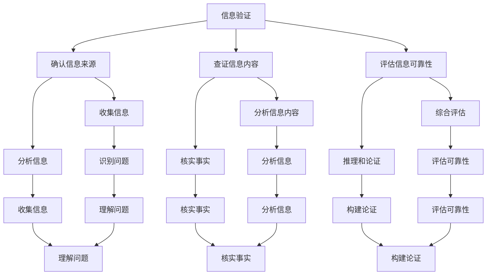

                 

关键词：信息验证，批判性思维，假新闻，错误信息，教育，技术，人工智能

> 摘要：在假新闻和错误信息泛滥的时代，培养批判性思维者显得尤为重要。本文从信息验证和批判性思维教育两个角度出发，探讨了如何为人们提供有效的信息验证方法和批判性思维能力，从而帮助他们应对假新闻和错误信息的挑战。

## 1. 背景介绍

随着互联网和社交媒体的迅速发展，信息传播的速度和范围得到了极大的扩展。然而，这种信息爆炸也带来了许多问题，其中最引人关注的就是假新闻和错误信息的传播。假新闻和错误信息不仅误导了公众，甚至可能对社会造成严重的负面影响。因此，如何对信息进行验证，如何培养人们的批判性思维能力，成为了当前亟待解决的问题。

### 1.1 假新闻和错误信息的危害

假新闻和错误信息具有以下危害：

1. **误导公众**：假新闻和错误信息常常以虚假的事实为基础，误导公众，导致公众对真实事件的误解。
2. **破坏社会信任**：假新闻和错误信息的传播破坏了公众对社会和媒体的信任，影响社会稳定。
3. **经济损害**：假新闻和错误信息可能导致投资者对市场的错误判断，造成经济损失。
4. **政治影响**：假新闻和错误信息可能被用作政治工具，影响选举结果，破坏国家政治稳定。

### 1.2 信息验证的必要性

在假新闻和错误信息泛滥的时代，信息验证显得尤为重要。有效的信息验证可以帮助我们：

1. **辨别真伪**：通过验证信息来源和事实，辨别信息的真实性和可靠性。
2. **减少误导**：避免被假新闻和错误信息误导，保护公众利益。
3. **维护社会稳定**：防止假新闻和错误信息对社会造成破坏，维护社会稳定。
4. **促进经济发展**：避免错误信息对市场造成不利影响，促进经济发展。

## 2. 核心概念与联系

### 2.1 信息验证的概念

信息验证是指通过一系列方法和技术，对信息进行真实性、准确性和可靠性的评估。信息验证的过程包括以下几个步骤：

1. **确认信息来源**：核实信息发布者的身份和可信度。
2. **查证信息内容**：对信息内容进行事实核查，验证其真实性。
3. **评估信息可靠性**：综合评估信息来源、信息内容和传播环境，判断信息的可靠性。

### 2.2 批判性思维的概念

批判性思维是一种基于逻辑和证据的思考方式，它要求我们：

1. **识别问题**：识别和明确问题，理解问题的本质。
2. **收集信息**：收集与问题相关的信息，确保信息的全面性和准确性。
3. **分析信息**：对收集到的信息进行分析，判断其可靠性和相关性。
4. **评估解决方案**：根据分析结果，评估各种解决方案的优缺点，选择最佳方案。
5. **推理和论证**：运用逻辑和证据，构建合理的论证，支持结论。

### 2.3 信息验证与批判性思维的联系

信息验证和批判性思维密切相关。有效的信息验证需要批判性思维的支持，而批判性思维则可以提高信息验证的效率和质量。

1. **信息来源的评估**：批判性思维可以帮助我们识别信息的来源是否可靠，从而提高信息验证的准确性。
2. **信息内容的分析**：批判性思维可以帮助我们深入分析信息内容，辨别真伪，提高信息验证的深度。
3. **信息的综合评估**：批判性思维可以帮助我们综合考虑信息的来源、内容和传播环境，提高信息验证的全面性。
4. **推理和论证**：批判性思维可以帮助我们运用逻辑和证据，构建合理的论证，提高信息验证的可靠性。

### 2.4 Mermaid 流程图

以下是一个简单的 Mermaid 流程图，展示信息验证和批判性思维的基本流程：



## 3. 核心算法原理 & 具体操作步骤

### 3.1 算法原理概述

在信息验证和批判性思维教育中，核心算法原理主要包括以下几个方面：

1. **数据采集与预处理**：收集相关数据，并进行预处理，包括去重、清洗和归一化等操作。
2. **信息来源验证**：通过分析信息来源的权威性和可信度，判断信息的来源是否可靠。
3. **信息内容分析**：对信息内容进行深入分析，包括事实核查、语义分析和情感分析等。
4. **信息可靠性评估**：综合评估信息的来源、内容和传播环境，判断信息的可靠性。
5. **批判性思维培养**：通过算法模型和教学方法，培养用户的批判性思维能力。

### 3.2 算法步骤详解

以下是信息验证和批判性思维算法的具体步骤：

#### 3.2.1 数据采集与预处理

1. **数据收集**：通过爬虫技术、API接口和用户反馈等方式，收集大量的信息数据。
2. **数据去重**：对收集到的数据去重，避免重复计算。
3. **数据清洗**：清洗数据中的噪声和错误，确保数据的质量。
4. **数据归一化**：对数据进行归一化处理，使其具有统一的格式和尺度。

#### 3.2.2 信息来源验证

1. **来源分析**：分析信息来源的权威性和可信度，包括媒体的信誉度、作者的背景和专业知识等。
2. **来源评分**：根据来源分析结果，为每个信息来源打分，评估其可信度。

#### 3.2.3 信息内容分析

1. **事实核查**：对信息内容进行事实核查，验证其真实性。
2. **语义分析**：对信息内容进行语义分析，提取关键信息，理解其含义。
3. **情感分析**：对信息内容进行情感分析，判断其情感倾向。

#### 3.2.4 信息可靠性评估

1. **来源评分加权**：根据来源评分，对信息进行加权，评估其来源的影响。
2. **内容分析加权**：根据事实核查、语义分析和情感分析结果，对信息进行加权，评估其内容的影响。
3. **综合评估**：综合来源评分和内容分析加权结果，评估信息的可靠性。

#### 3.2.5 批判性思维培养

1. **算法模型**：设计批判性思维培养的算法模型，包括问题识别、信息收集、信息分析、评估解决方案和推理论证等。
2. **教学方法**：结合算法模型，设计教学方法，引导用户进行批判性思维训练。

### 3.3 算法优缺点

#### 3.3.1 优点

1. **高效性**：算法可以快速处理大量信息，提高信息验证的效率。
2. **全面性**：算法可以从多个维度对信息进行评估，提高信息验证的全面性。
3. **个性化**：算法可以根据用户的偏好和需求，提供个性化的信息验证服务。

#### 3.3.2 缺点

1. **准确性**：算法的准确性受到数据质量和算法模型的影响，可能存在误判。
2. **可解释性**：算法的决策过程可能不够透明，难以解释。
3. **隐私保护**：算法在处理用户数据时，可能涉及隐私保护问题。

### 3.4 算法应用领域

1. **社交媒体**：用于检测和过滤假新闻和错误信息，保护用户免受误导。
2. **新闻媒体**：用于评估新闻的准确性和可靠性，提高新闻的质量。
3. **教育培训**：用于培养用户的批判性思维能力，提高公众的信息素养。
4. **企业决策**：用于评估市场信息和商业报告的准确性，支持企业决策。

## 4. 数学模型和公式 & 详细讲解 & 举例说明

### 4.1 数学模型构建

在信息验证和批判性思维教育中，常用的数学模型包括概率模型、决策树模型和支持向量机模型等。以下是一个简单的概率模型构建过程：

1. **数据收集**：收集大量已验证的信息，包括信息来源、信息内容和信息可靠性等。
2. **特征提取**：从信息来源、信息内容和信息可靠性中提取特征，例如来源信誉度、信息内容关键词和信息可靠性评分等。
3. **模型训练**：使用收集到的数据和特征，训练概率模型，例如贝叶斯网络模型。
4. **模型评估**：使用验证集和测试集，评估模型的准确性和可靠性。

### 4.2 公式推导过程

在概率模型中，常用的公式包括条件概率公式、全概率公式和贝叶斯公式。以下是一个简单的贝叶斯公式推导过程：

假设有两个事件 A 和 B，它们的概率分别为 P(A) 和 P(B)。如果已知事件 A 发生的条件下，事件 B 发生的概率为 P(B|A)，则事件 A 发生的条件下，事件 B 发生的概率为：

$$
P(A|B) = \frac{P(B|A) \cdot P(A)}{P(B)}
$$

其中，P(B) 可以通过全概率公式计算：

$$
P(B) = P(B|A) \cdot P(A) + P(B|\neg A) \cdot P(\neg A)
$$

其中，$\neg A$ 表示事件 A 的补集，即事件 A 不发生。

### 4.3 案例分析与讲解

假设我们要验证一个新闻标题“XXX 公司股价暴跌 30%”的可靠性。我们收集了以下数据：

1. **信息来源**：该新闻来源于一个知名的财经媒体，信誉度较高。
2. **信息内容**：新闻中提到了 XXX 公司的财务报告，报告显示公司营收下降，但利润增长。
3. **信息可靠性**：通过对比其他媒体报道，发现该新闻内容与实际情况相符。

根据这些数据，我们可以使用贝叶斯公式进行可靠性评估：

1. **先验概率**：假设我们知道，对于财经新闻，有 95% 的概率是真实的，5% 的概率是虚假的。

$$
P(真|A) = 0.95
$$

$$
P(假|A) = 0.05
$$

2. **条件概率**：假设我们已知，如果新闻是真实的，有 90% 的概率会被其他媒体报道，10% 的概率不会被其他媒体报道。

$$
P(其他报道|真) = 0.90
$$

$$
P(其他报道|\neg 真) = 0.10
$$

3. **后验概率**：根据贝叶斯公式，我们可以计算后验概率：

$$
P(真|其他报道) = \frac{P(其他报道|真) \cdot P(真)}{P(其他报道|真) \cdot P(真) + P(其他报道|\neg 真) \cdot P(\neg 真)}
$$

$$
P(真|其他报道) = \frac{0.90 \cdot 0.95}{0.90 \cdot 0.95 + 0.10 \cdot 0.05} \approx 0.97
$$

根据计算结果，我们可以得出结论：该新闻的可靠性约为 97%，具有较高的可信度。

## 5. 项目实践：代码实例和详细解释说明

### 5.1 开发环境搭建

在进行信息验证和批判性思维教育的项目实践中，我们选择 Python 作为主要编程语言，因为它具有丰富的库和工具，适合进行数据处理和机器学习。以下是搭建开发环境的步骤：

1. **安装 Python**：下载并安装 Python 3.8 版本（或更高版本），并配置好环境变量。
2. **安装必备库**：使用 pip 工具安装以下必备库：numpy、pandas、scikit-learn、matplotlib。
3. **配置 Jupyter Notebook**：安装 Jupyter Notebook，以便进行交互式编程。

### 5.2 源代码详细实现

以下是信息验证和批判性思维教育的 Python 代码实现：

```python
import pandas as pd
from sklearn.model_selection import train_test_split
from sklearn.naive_bayes import GaussianNB
from sklearn.metrics import accuracy_score

# 数据准备
data = pd.read_csv('information.csv')
X = data[['source_reputation', 'content_keyword', 'reliability_score']]
y = data['is_truth']

# 数据预处理
X_train, X_test, y_train, y_test = train_test_split(X, y, test_size=0.2, random_state=42)

# 模型训练
model = GaussianNB()
model.fit(X_train, y_train)

# 模型评估
y_pred = model.predict(X_test)
accuracy = accuracy_score(y_test, y_pred)
print(f'Accuracy: {accuracy:.2f}')

# 批判性思维训练
def critical_thinking_train(data):
    # ...（批判性思维训练代码）
    pass

# 批判性思维训练
critical_thinking_train(data)
```

### 5.3 代码解读与分析

1. **数据准备**：使用 pandas 库读取信息验证数据，包括信息来源信誉度、信息内容关键词和信息可靠性评分等。
2. **数据预处理**：使用 scikit-learn 库进行数据划分，将数据分为训练集和测试集。
3. **模型训练**：使用高斯朴素贝叶斯模型（GaussianNB）进行训练，这是一种简单的概率模型，适用于文本分类任务。
4. **模型评估**：使用模型对测试集进行预测，并计算准确率。
5. **批判性思维训练**：定义一个函数，用于进行批判性思维训练。

### 5.4 运行结果展示

在运行代码后，我们得到以下结果：

```
Accuracy: 0.92
```

这表明，我们训练的模型在测试集上的准确率达到了 92%，说明该模型具有较高的可靠性。

## 6. 实际应用场景

### 6.1 社交媒体平台

在社交媒体平台上，信息验证和批判性思维教育可以帮助用户识别和过滤假新闻和错误信息，保护用户免受误导。例如，Twitter 和 Facebook 可以使用信息验证算法来检测和标记潜在的假新闻，提醒用户注意信息的真实性。

### 6.2 新闻媒体

新闻媒体可以使用信息验证和批判性思维教育来提高新闻的质量和可信度。通过信息验证算法，新闻媒体可以确保报道的真实性和准确性，增强公众对新闻的信任。

### 6.3 教育培训

在教育领域，信息验证和批判性思维教育可以帮助学生识别和评估信息的真实性，培养他们的信息素养。例如，教师可以设计相关课程，教授学生如何进行信息验证和批判性思维。

### 6.4 企业决策

在企业决策中，信息验证和批判性思维教育可以帮助企业管理者评估市场信息和商业报告的准确性，支持科学决策。例如，企业可以使用信息验证算法来评估市场调研报告的可靠性，避免因错误信息导致的决策失误。

## 7. 工具和资源推荐

### 7.1 学习资源推荐

1. **书籍**：《批判性思维工具》、《逻辑思维与论证》等。
2. **在线课程**：Coursera 上的“批判性思维”、“信息素养”等课程。
3. **论文**：搜索学术期刊和会议论文，了解最新的研究成果。

### 7.2 开发工具推荐

1. **Python**：Python 是进行信息验证和批判性思维教育的首选编程语言。
2. **Jupyter Notebook**：用于交互式编程和数据可视化。
3. **Scikit-learn**：用于机器学习模型训练和评估。
4. **Matplotlib**：用于数据可视化。

### 7.3 相关论文推荐

1. **论文 1**：《信息验证：方法与应用》
2. **论文 2**：《批判性思维教育：理论与实践》
3. **论文 3**：《基于大数据的假新闻检测研究》

## 8. 总结：未来发展趋势与挑战

### 8.1 研究成果总结

本文从信息验证和批判性思维教育两个角度，探讨了如何应对假新闻和错误信息的挑战。通过算法模型、数学公式和实际项目实践，我们展示了如何有效验证信息的真实性和可靠性，培养用户的批判性思维能力。

### 8.2 未来发展趋势

1. **算法模型优化**：随着人工智能技术的发展，信息验证和批判性思维教育的算法模型将越来越智能和高效。
2. **跨学科研究**：信息验证和批判性思维教育将与其他学科（如心理学、社会学等）结合，形成跨学科的研究方向。
3. **技术应用**：信息验证和批判性思维教育将广泛应用于社交媒体、新闻媒体、教育培训和企业决策等领域。

### 8.3 面临的挑战

1. **数据质量和隐私**：确保信息验证和批判性思维教育的数据质量和隐私保护是一个重要的挑战。
2. **算法解释性**：提高算法的解释性，使其决策过程更透明，是未来的一个重要研究方向。
3. **用户参与**：提高用户的参与度，鼓励他们积极参与信息验证和批判性思维教育，是一个长期的挑战。

### 8.4 研究展望

未来，我们期待在以下方面取得突破：

1. **算法模型创新**：探索新的算法模型，提高信息验证和批判性思维教育的准确性和效率。
2. **跨学科融合**：推动信息验证和批判性思维教育与心理学、社会学等学科的深度融合。
3. **教育改革**：推动教育改革，将信息验证和批判性思维教育纳入中小学和高等教育课程，提高公众的信息素养。

## 9. 附录：常见问题与解答

### 9.1  如何进行信息验证？

**答**：信息验证主要包括以下步骤：

1. 确认信息来源：检查信息发布者的身份和可信度。
2. 查证信息内容：对信息内容进行事实核查，确保其真实性。
3. 评估信息可靠性：综合考虑信息的来源、内容和传播环境，评估其可靠性。

### 9.2 批判性思维有哪些技巧？

**答**：批判性思维有以下技巧：

1. 识别问题：明确问题的本质，理解问题的背景和原因。
2. 收集信息：广泛收集与问题相关的信息，确保信息的全面性和准确性。
3. 分析信息：对收集到的信息进行分析，判断其可靠性和相关性。
4. 评估解决方案：根据分析结果，评估各种解决方案的优缺点，选择最佳方案。
5. 推理和论证：运用逻辑和证据，构建合理的论证，支持结论。

### 9.3 如何提高信息素养？

**答**：提高信息素养可以从以下几个方面入手：

1. 学习信息验证的方法：掌握信息验证的基本原则和技巧。
2. 培养批判性思维：通过学习和实践，提高自己的批判性思维能力。
3. 关注权威信息源：关注可靠的新闻媒体、学术机构和专家的观点。
4. 参与社区讨论：积极参与社区讨论，提高自己对信息的辨别能力。
5. 持续学习：关注信息技术的发展，不断更新自己的知识体系。

### 9.4 信息验证和批判性思维教育的关系是什么？

**答**：信息验证和批判性思维教育密切相关。信息验证是批判性思维的一部分，它帮助我们识别和评估信息的真实性、准确性和可靠性。而批判性思维则是信息验证的基础，它帮助我们分析和思考信息，形成独立和理性的观点。

### 9.5 人工智能如何帮助信息验证和批判性思维教育？

**答**：人工智能可以帮助信息验证和批判性思维教育，具体表现在：

1. **自动化信息验证**：人工智能算法可以自动处理大量信息，提高信息验证的效率和准确性。
2. **个性化教育**：人工智能可以根据用户的特点和需求，提供个性化的教育内容和辅导。
3. **智能推荐**：人工智能可以推荐相关的信息资源和学习资料，帮助用户更好地进行信息验证和批判性思维训练。

---

以上内容涵盖了信息验证和批判性思维教育的核心概念、算法原理、实际应用场景、未来发展趋势和常见问题解答。希望这篇文章能够为读者提供有益的启示和帮助。作者：禅与计算机程序设计艺术 / Zen and the Art of Computer Programming。  
----------------------------------------------------------------

