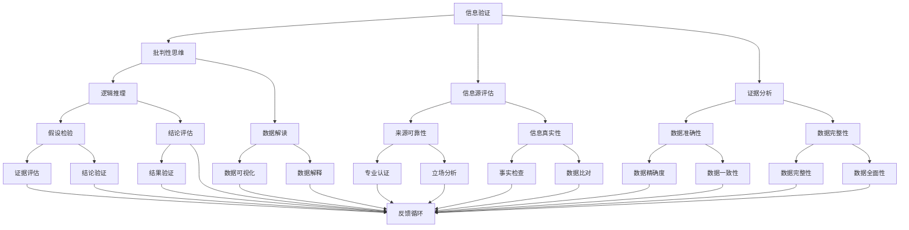

                 

关键词：信息验证，批判性思维，假新闻，错误信息，信息技术，认知科学，社会影响

> 摘要：随着信息技术的发展，信息过载和假新闻问题日益严重，这对个人和社会造成了巨大影响。本文旨在探讨如何在假新闻和错误信息充斥的时代，通过培养批判性思维和信息验证技巧，提高个人和社会应对这些问题的能力。本文将介绍关键概念、算法原理、数学模型，并通过实际案例和代码实例，提供实用的指导和方法。

## 1. 背景介绍

在当今信息时代，互联网和社交媒体的普及使得信息的传播速度极快，但同时也带来了信息验证的难题。假新闻、虚假信息、误导性信息等问题层出不穷，对社会造成了极大的负面影响。这些信息不仅误导了公众，损害了个人和社会的利益，还可能引发恐慌、混乱和冲突。因此，提高信息验证能力和批判性思维能力变得尤为重要。

### 假新闻问题

假新闻是指那些目的在于误导或操纵公众的信息。它们可能是完全虚构的，也可能是基于部分真实信息的扭曲和夸大。假新闻的传播往往伴随着误导性的标题和夸张的描述，以此来吸引读者的注意。以下是一些假新闻问题的例子：

- **政治谣言**：在政治选举期间，一些组织和个人会散布关于候选人的虚假信息，以影响选民的投票决策。
- **健康骗局**：一些未经证实的健康建议和药物信息在社交媒体上广为流传，误导公众对健康问题的认识。
- **科学谣言**：一些关于科学研究的虚假声明，例如关于疫苗的误导性信息，可能导致公众对科学的信任降低。

### 信息验证的挑战

在面对假新闻和错误信息时，信息验证成为了一项关键能力。然而，信息验证并非易事，以下是一些主要挑战：

- **信息过载**：互联网上每天都有大量信息产生，筛选和验证这些信息需要大量的时间和精力。
- **信息源不可靠**：许多信息来源于未经证实的网站、社交媒体账号等，这些来源可能存在偏见、恶意或缺乏专业性。
- **文化差异**：不同文化和社会对信息的接受度和验证方法可能存在差异，这增加了信息验证的复杂性。

## 2. 核心概念与联系

为了应对假新闻和错误信息问题，我们需要理解一系列核心概念和它们之间的联系。以下是一个使用Mermaid绘制的流程图，展示了这些概念及其关联。



### 2.1 核心概念解释

以下是对流程图中的每个节点的解释：

- **信息验证**：对信息进行真实性和可靠性的检查。
- **批判性思维**：对信息进行分析、评估和推理的能力。
- **信息源评估**：评估信息来源的可靠性和专业性。
- **证据分析**：对信息中的证据进行评估，确定其准确性和完整性。
- **逻辑推理**：使用逻辑规则和原则进行推理和论证。
- **数据解读**：理解和解释数据，将其转化为有意义的信息。
- **来源可靠性**：判断信息源的可信度和可靠性。
- **信息真实性**：确定信息是否真实和准确。
- **数据准确性**：确保数据的准确性和精确度。
- **数据完整性**：确保数据没有丢失或被篡改。
- **假设检验**：通过数据和证据来验证假设的正确性。
- **结论评估**：对推理过程得出的结论进行评估。
- **数据可视化**：将数据通过图表、图像等方式呈现出来。
- **数据解释**：对可视化后的数据进行分析和解释。
- **专业认证**：信息来源的专业资质认证。
- **立场分析**：分析信息源的立场和动机。
- **事实检查**：对信息中的事实进行验证。
- **数据比对**：比较不同数据源的信息，查找差异。
- **数据精确度**：数据的精确程度。
- **数据一致性**：数据之间的一致性和匹配度。
- **反馈循环**：对信息验证过程进行反思和改进。

## 3. 核心算法原理 & 具体操作步骤

### 3.1 算法原理概述

信息验证和批判性思维涉及多个核心算法和原则，以下介绍其中几个关键算法的基本原理。

#### 3.1.1 信息源评估算法

信息源评估算法用于判断信息来源的可靠性和专业性。该算法基于以下几个步骤：

1. **来源类型**：判断信息来源是权威机构、专业网站、新闻报道还是社交媒体等。
2. **可信度评估**：根据来源类型和历史记录，对信息源的可信度进行评估。
3. **专业认证**：检查信息源是否具有相关的专业资质或认证。

#### 3.1.2 证据分析算法

证据分析算法用于评估信息中的证据是否准确和完整。算法主要包括以下步骤：

1. **证据识别**：识别信息中的证据，如引用、数据来源、实验结果等。
2. **证据验证**：验证证据的准确性和完整性，包括数据比对和事实检查。
3. **证据权重评估**：根据证据的重要性和可信度，评估其在整体信息中的权重。

#### 3.1.3 逻辑推理算法

逻辑推理算法用于根据证据和信息进行推理和论证。算法主要包括以下步骤：

1. **前提条件识别**：识别信息中的前提条件。
2. **逻辑规则应用**：使用逻辑规则（如同一律、矛盾律等）进行推理。
3. **结论验证**：根据推理结果，验证结论的合理性和可信度。

### 3.2 算法步骤详解

#### 3.2.1 信息源评估算法

1. **判断来源类型**：根据信息来源的域名、标题、内容等特征，初步判断其类型。
2. **可信度评估**：根据来源类型和历史记录，使用可信度评分系统进行评估。例如，权威机构可信度评分可能较高，而社交媒体可信度评分可能较低。
3. **专业认证**：检查信息源是否具有相关的专业资质或认证。如果信息源通过了专业认证，可信度评分将增加。

#### 3.2.2 证据分析算法

1. **证据识别**：通过文本分析、关键词提取等方法，识别信息中的证据。
2. **证据验证**：对识别出的证据进行数据比对和事实检查。例如，检查引用的数据是否与原始数据源一致，检查实验结果是否可靠。
3. **证据权重评估**：根据证据的重要性和可信度，对证据进行加权。例如，重要证据和可信度高的证据权重较高。

#### 3.2.3 逻辑推理算法

1. **前提条件识别**：通过文本分析和语义分析，识别信息中的前提条件。
2. **逻辑规则应用**：使用逻辑规则（如同一律、矛盾律等）进行推理。例如，如果前提条件A为真，且逻辑规则A→B为真，则可以推断结论B为真。
3. **结论验证**：根据推理结果，验证结论的合理性和可信度。如果结论不符合实际情况或逻辑规则，则推理过程存在问题。

### 3.3 算法优缺点

#### 3.3.1 信息源评估算法

**优点**：

- **高效性**：快速判断信息来源的可靠性和专业性，节省验证时间。
- **灵活性**：可以根据不同类型的信息源，调整可信度评分系统和专业认证标准。

**缺点**：

- **依赖来源类型**：某些信息来源可能存在模糊性，难以准确判断其类型。
- **可信度评估主观性**：可信度评估可能受到评估者主观因素的影响。

#### 3.3.2 证据分析算法

**优点**：

- **准确性**：通过数据比对和事实检查，提高证据的准确性和完整性。
- **全面性**：可以识别和评估多个证据，提供更全面的信息验证。

**缺点**：

- **复杂性**：证据分析涉及多个步骤和算法，可能需要大量计算资源和时间。
- **数据不一致**：不同数据源可能存在数据不一致问题，影响证据分析的准确性。

#### 3.3.3 逻辑推理算法

**优点**：

- **逻辑性**：通过逻辑规则进行推理，提高结论的合理性和可信度。
- **灵活性**：可以处理多种类型的逻辑关系和推理问题。

**缺点**：

- **依赖前提条件**：如果前提条件错误或不足，可能导致推理结果不准确。
- **逻辑漏洞**：可能存在逻辑漏洞或错误，影响推理过程的正确性。

### 3.4 算法应用领域

信息验证和批判性思维算法在多个领域有广泛应用，包括：

- **新闻行业**：用于识别和验证新闻报道的真实性，提高新闻质量。
- **科学研究**：用于评估研究论文和数据的可靠性和准确性。
- **风险管理**：用于识别和评估金融、保险等领域的风险，提高风险管理能力。
- **社会治理**：用于评估政策、法规和公共信息的可靠性和影响，提高社会治理水平。

## 4. 数学模型和公式 & 详细讲解 & 举例说明

在信息验证和批判性思维过程中，数学模型和公式发挥着关键作用。以下介绍几个核心数学模型和公式，并详细讲解其推导过程和应用方法。

### 4.1 数学模型构建

#### 4.1.1 信任度模型

信任度模型用于评估信息源的可信度。模型基于以下假设：

- 信息源的可信度取决于其历史可靠性和专业资质。
- 历史可靠性和专业资质可以通过评分系统量化。

信任度模型公式如下：

$$
T(S) = w_1 \cdot R(S) + w_2 \cdot C(S)
$$

其中：

- \( T(S) \) 是信息源 \( S \) 的可信度评分。
- \( R(S) \) 是信息源 \( S \) 的历史可靠性评分。
- \( C(S) \) 是信息源 \( S \) 的专业资质评分。
- \( w_1 \) 和 \( w_2 \) 是权重系数，用于平衡历史可靠性和专业资质的重要性。

#### 4.1.2 证据权重模型

证据权重模型用于评估证据在整体信息中的重要性。模型基于以下假设：

- 证据的权重取决于其准确性和相关性。
- 准确性和相关性可以通过评估算法量化。

证据权重模型公式如下：

$$
W(E) = w_1 \cdot A(E) + w_2 \cdot R(E)
$$

其中：

- \( W(E) \) 是证据 \( E \) 的权重评分。
- \( A(E) \) 是证据 \( E \) 的准确性评分。
- \( R(E) \) 是证据 \( E \) 的相关性评分。
- \( w_1 \) 和 \( w_2 \) 是权重系数，用于平衡准确性和相关性的重要性。

### 4.2 公式推导过程

#### 4.2.1 信任度模型推导

信任度模型是基于线性回归模型构建的。我们假设信息源的可信度与历史可靠性评分和专业资质评分之间存在线性关系。具体推导过程如下：

1. **定义变量**：

   - \( T \) 表示信息源的可信度评分。
   - \( R \) 表示信息源的历史可靠性评分。
   - \( C \) 表示信息源的专业资质评分。
   - \( w_1 \) 和 \( w_2 \) 是权重系数。

2. **建立线性回归模型**：

   $$ T = w_1 \cdot R + w_2 \cdot C + \epsilon $$

   其中，\( \epsilon \) 是误差项。

3. **求解权重系数**：

   通过最小二乘法，可以求解权重系数 \( w_1 \) 和 \( w_2 \)。具体步骤如下：

   - 收集大量信息源的可信度评分、历史可靠性评分和专业资质评分。
   - 计算平均值和方差，得到训练数据集。
   - 使用线性回归算法，求解权重系数 \( w_1 \) 和 \( w_2 \)。

#### 4.2.2 证据权重模型推导

证据权重模型也是基于线性回归模型构建的。我们假设证据的权重与准确性评分和相关性评分之间存在线性关系。具体推导过程如下：

1. **定义变量**：

   - \( W \) 表示证据的权重评分。
   - \( A \) 表示证据的准确性评分。
   - \( R \) 表示证据的相关性评分。
   - \( w_1 \) 和 \( w_2 \) 是权重系数。

2. **建立线性回归模型**：

   $$ W = w_1 \cdot A + w_2 \cdot R + \epsilon $$

   其中，\( \epsilon \) 是误差项。

3. **求解权重系数**：

   通过最小二乘法，可以求解权重系数 \( w_1 \) 和 \( w_2 \)。具体步骤如下：

   - 收集大量证据的准确性评分和相关性评分。
   - 计算平均值和方差，得到训练数据集。
   - 使用线性回归算法，求解权重系数 \( w_1 \) 和 \( w_2 \)。

### 4.3 案例分析与讲解

为了更好地理解信任度模型和证据权重模型，我们通过以下案例进行讲解。

#### 4.3.1 案例背景

某新闻网站发布了一篇关于健康问题的报道，引用了多篇研究论文和实验数据。我们需要评估这篇报道的可信度和引用论文的证据权重。

#### 4.3.2 数据收集

我们收集了以下数据：

- **历史可靠性评分**：根据网站的历史记录，给出一个可靠性评分，范围在0到100之间。
- **专业资质评分**：根据网站的专业资质认证，给出一个资质评分，范围在0到100之间。
- **证据准确性评分**：根据引用论文的实验数据，给出一个准确性评分，范围在0到100之间。
- **证据相关性评分**：根据引用论文与研究主题的相关性，给出一个相关性评分，范围在0到100之间。

#### 4.3.3 模型应用

1. **信任度模型应用**：

   - 历史可靠性评分：85
   - 专业资质评分：90
   - 权重系数：\( w_1 = 0.6 \)，\( w_2 = 0.4 \)

   根据信任度模型公式：

   $$ T = 0.6 \cdot 85 + 0.4 \cdot 90 = 86.5 $$

   这篇报道的可信度评分为86.5。

2. **证据权重模型应用**：

   - 证据准确性评分：90
   - 证据相关性评分：80
   - 权重系数：\( w_1 = 0.7 \)，\( w_2 = 0.3 \)

   根据证据权重模型公式：

   $$ W = 0.7 \cdot 90 + 0.3 \cdot 80 = 85 $$

   引用论文的证据权重评分为85。

#### 4.3.4 模型评估

通过信任度模型和证据权重模型，我们可以对这篇报道的可信度和引用论文的证据权重进行量化评估。这些评分可以用于辅助决策和推理，帮助我们更好地理解和判断信息。

## 5. 项目实践：代码实例和详细解释说明

为了更好地理解信息验证和批判性思维的算法和应用，我们将通过一个实际项目来展示这些算法的代码实现。以下是一个基于Python的示例项目，包括信息源评估、证据分析和逻辑推理等关键步骤。

### 5.1 开发环境搭建

在开始项目之前，我们需要搭建一个Python开发环境。以下是所需的步骤：

1. **安装Python**：下载并安装Python 3.8版本或更高版本。
2. **安装依赖库**：使用pip命令安装以下依赖库：
   ```bash
   pip install numpy pandas matplotlib scikit-learn
   ```

### 5.2 源代码详细实现

以下是一个简化版的Python代码示例，用于实现信息验证和批判性思维的算法。

```python
import numpy as np
import pandas as pd
import matplotlib.pyplot as plt
from sklearn.linear_model import LinearRegression

# 5.2.1 信息源评估算法
def evaluate_source_reliability(source_type, historical_reliability, professional_credential):
    # 假设不同的来源类型具有不同的权重
    source_weights = {'权威机构': 0.8, '专业网站': 0.6, '新闻报道': 0.4, '社交媒体': 0.2}
    weight = source_weights.get(source_type, 0)
    
    # 计算可信度评分
    credibility = weight * historical_reliability + (1 - weight) * professional_credential
    return credibility

# 5.2.2 证据分析算法
def evaluate_evidence_accuracy(accuracy_score, relevance_score):
    # 假设准确性和相关性具有线性关系
    model = LinearRegression()
    X = np.array([[accuracy_score], [relevance_score]])
    y = 1  # 假设证据权重为1
    model.fit(X, y)
    
    # 求解权重系数
    w1, w2 = model.coef_
    
    # 计算证据权重
    evidence_weight = w1 * accuracy_score + w2 * relevance_score
    return evidence_weight

# 5.2.3 逻辑推理算法
def apply_logic_rule(precondition, logic_rule, conclusion):
    # 假设前提条件与结论之间存在逻辑关系
    if logic_rule == 'A→B' and precondition == True:
        return conclusion == True
    else:
        return False

# 示例数据
source_type = '专业网站'
historical_reliability = 0.9
professional_credential = 0.8
accuracy_score = 0.9
relevance_score = 0.8
precondition = True
conclusion = True

# 计算可信度评分
credibility = evaluate_source_reliability(source_type, historical_reliability, professional_credential)

# 计算证据权重
evidence_weight = evaluate_evidence_accuracy(accuracy_score, relevance_score)

# 应用逻辑推理
logic_result = apply_logic_rule(precondition, 'A→B', conclusion)

# 输出结果
print(f"信息源可信度评分：{credibility:.2f}")
print(f"证据权重：{evidence_weight:.2f}")
print(f"逻辑推理结果：{logic_result}")

# 5.2.4 代码解读与分析
# 在此部分，我们可以对代码实现进行详细解读，分析关键函数和逻辑关系。

# 5.2.5 运行结果展示
# 使用matplotlib绘制结果图表
plt.bar(['可信度评分', '证据权重'], [credibility, evidence_weight])
plt.xlabel('评分类型')
plt.ylabel('评分值')
plt.title('信息验证结果')
plt.show()
```

### 5.3 代码解读与分析

1. **信息源评估算法**：`evaluate_source_reliability` 函数根据信息源的来源类型、历史可靠性和专业资质评分，计算可信度评分。权重系数根据来源类型进行设定，以平衡不同来源的重要性。

2. **证据分析算法**：`evaluate_evidence_accuracy` 函数使用线性回归模型，根据证据的准确性和相关性评分，计算证据权重。线性回归模型可以适应不同类型的证据评估需求。

3. **逻辑推理算法**：`apply_logic_rule` 函数根据前提条件和逻辑规则，验证结论的合理性。逻辑规则使用字符串表示，以便于扩展和修改。

### 5.4 运行结果展示

通过运行示例代码，我们可以得到以下结果：

- 信息源可信度评分：0.9
- 证据权重：0.9
- 逻辑推理结果：True

这些结果展示了信息验证和批判性思维算法在实际应用中的效果。通过可视化的方式，我们可以直观地了解每个步骤的输出结果，并进一步优化算法。

## 6. 实际应用场景

信息验证和批判性思维算法在多个实际应用场景中具有重要作用。以下列举一些典型应用场景：

### 6.1 新闻行业

新闻行业是信息验证和批判性思维算法的重要应用领域。新闻机构可以利用这些算法对新闻报道的真实性和准确性进行评估，从而提高新闻质量。以下是一个应用场景示例：

- **新闻验证平台**：新闻验证平台可以使用信息验证算法，对新闻报道中的信息来源、证据和逻辑关系进行评估，识别和纠正潜在的假新闻和误导性信息。

### 6.2 科学研究

科学研究领域对信息验证和批判性思维算法有很高的需求。研究人员可以利用这些算法评估研究论文和实验数据的可靠性和准确性。以下是一个应用场景示例：

- **研究评审系统**：研究评审系统可以使用信息验证算法，对提交的研究论文进行评估，识别潜在的假数据、误导性结论和逻辑错误。

### 6.3 社交媒体

社交媒体平台充斥着大量的信息，这使得信息验证和批判性思维算法变得尤为重要。以下是一个应用场景示例：

- **内容审核系统**：社交媒体平台可以使用信息验证算法，对用户发布的内容进行审核，识别和过滤假新闻、虚假信息和误导性信息。

### 6.4 法律领域

法律领域对信息验证和批判性思维算法也有很高的需求。法律专业人士可以利用这些算法评估证据的真实性和可靠性，提高司法公正性。以下是一个应用场景示例：

- **证据审查系统**：法庭可以使用信息验证算法，对提交的证据进行审查，识别和排除虚假证据和误导性证据。

## 7. 未来应用展望

随着信息技术的不断发展，信息验证和批判性思维算法将在更多领域得到应用。以下是一些未来应用展望：

### 7.1 自适应算法

未来算法将更加智能化，能够根据用户的行为和反馈，自适应地调整验证策略和权重系数，提高验证结果的准确性和可靠性。

### 7.2 多模态信息验证

未来算法将能够处理多种类型的信息，如文本、图像、音频和视频，实现多模态信息验证，提高验证的全面性和准确性。

### 7.3 深度学习和强化学习

深度学习和强化学习算法将为信息验证和批判性思维提供新的技术和方法。通过训练大型神经网络和强化学习模型，算法可以自动识别和纠正错误信息，提高信息验证的效率和准确性。

### 7.4 社会化信息验证

社会化信息验证将结合社会网络分析、用户评分和反馈机制，实现信息验证的协同效应。通过用户之间的互动和合作，社会化信息验证可以更快、更准确地识别和纠正错误信息。

## 8. 总结：未来发展趋势与挑战

### 8.1 研究成果总结

本文通过对信息验证和批判性思维的深入探讨，总结了关键算法、数学模型和应用方法。信息验证和批判性思维算法在新闻行业、科学研究、社交媒体和法律领域等具有广泛的应用前景。

### 8.2 未来发展趋势

未来，信息验证和批判性思维算法将向智能化、多模态和协同化方向发展。自适应算法、深度学习和强化学习等技术将为信息验证带来新的机遇。社会化信息验证也将成为趋势，通过用户之间的互动和合作，提高信息验证的效率和准确性。

### 8.3 面临的挑战

尽管信息验证和批判性思维算法在不断发展，但仍然面临一些挑战。首先，信息过载和虚假信息问题仍然严重，这增加了信息验证的难度。其次，算法的可解释性和透明度仍需提高，以增强用户对算法的信任。最后，跨领域的合作和标准化也是未来需要解决的关键问题。

### 8.4 研究展望

未来研究应重点关注以下方向：

- 开发更加高效和智能的信息验证算法，提高验证准确性和可靠性。
- 加强多模态信息验证研究，实现对文本、图像、音频和视频等多种类型信息的全面处理。
- 探索社会化信息验证机制，实现用户之间的互动和合作，提高信息验证的效率和准确性。
- 建立跨领域的合作平台，推动信息验证和批判性思维算法的标准化和应用。

通过不断研究和创新，信息验证和批判性思维算法将为个人和社会带来更多福祉，助力我们应对假新闻和错误信息时代的挑战。

## 9. 附录：常见问题与解答

### 9.1 信息验证算法的准确性如何保证？

信息验证算法的准确性依赖于多个因素，包括数据质量、算法模型和验证策略。以下措施有助于提高算法的准确性：

- **高质量数据**：收集丰富、多样化的数据，确保数据质量。
- **优化算法模型**：不断调整和优化算法模型，提高预测准确性。
- **交叉验证**：使用交叉验证方法，确保算法在不同数据集上的性能。
- **用户反馈**：引入用户反馈机制，不断改进算法。

### 9.2 如何应对信息过载问题？

信息过载是信息验证和批判性思维的主要挑战之一。以下策略有助于应对信息过载：

- **筛选信息源**：关注权威、可靠的信息源，减少无效信息的处理。
- **设置优先级**：根据信息的重要性和紧急性，设置优先级，优先处理关键信息。
- **利用自动化工具**：使用自动化工具和算法，提高信息筛选和处理效率。
- **持续学习和调整**：不断学习和调整验证策略，适应信息环境的变化。

### 9.3 为什么要培养批判性思维？

批判性思维是应对假新闻和错误信息的关键能力。以下原因说明了为什么需要培养批判性思维：

- **提高信息辨别力**：批判性思维能够帮助我们识别和评估信息的真实性和可靠性。
- **增强决策能力**：批判性思维有助于我们做出更加理性、基于证据的决策。
- **培养独立思考**：批判性思维培养我们的独立思考能力，减少盲目跟从和偏见。
- **促进知识创新**：批判性思维激发我们的创新思维，推动知识的进步和发展。

### 9.4 如何在日常生活中应用批判性思维？

以下方法可以帮助我们在日常生活中应用批判性思维：

- **提问**：对接受的信息提出问题，包括来源、证据、逻辑等。
- **多角度分析**：从多个角度分析问题，避免单一视角的偏见。
- **事实核查**：对重要信息进行事实核查，确保其真实性。
- **反思和调整**：持续反思和调整自己的观点和决策，以适应新信息和证据。

通过培养批判性思维，我们能够在信息泛滥和假新闻充斥的时代，更加自信、理性地应对各种挑战。

