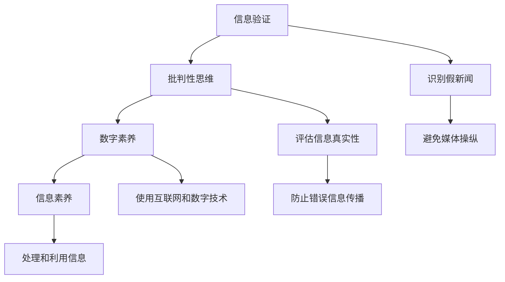

                 

 关键词：（信息验证）、（批判性思维）、（假新闻）、（错误信息）、（媒体操纵）、（数字素养）、（信息素养）

> 摘要：在当今信息泛滥的时代，假新闻、错误信息和媒体操纵问题层出不穷。本文旨在探讨如何通过信息验证和批判性思维能力，帮助我们在这一复杂环境中导航。文章将介绍关键概念、算法原理、数学模型、实际应用案例，并提供工具和资源推荐，以提升读者的信息素养。

## 1. 背景介绍

随着互联网和社交媒体的快速发展，信息传播的速度和范围都达到了前所未有的高度。这种信息爆炸给人们带来了极大的便利，同时也引发了严重的困扰。假新闻、错误信息和媒体操纵问题频频出现，误导了公众的判断和决策。根据《纽约时报》的调查，每天有成千上万的不实信息在社交媒体上传播，这些信息可能对个人、社会和整个世界产生深远的影响。

### 1.1 假新闻的危害

假新闻不仅可能误导个人，还可能引发社会恐慌，破坏社会信任。例如，近年来关于新型冠状病毒的假消息引发了公众的恐慌和混乱，造成了社会资源的浪费。此外，假新闻也可能用于政治操纵，影响选举结果，破坏民主制度。

### 1.2 错误信息的传播

错误信息往往伴随着假新闻一起传播，它们可能源自未经证实的来源或者缺乏专业知识的人士。这些错误信息可能导致公众对科学、医学等领域产生误解，从而影响公众的决策和健康。

### 1.3 媒体操纵的手段

媒体操纵通常通过控制信息源、操纵舆论导向、制造假事件等方式进行。这种操纵可能对特定群体或政治势力有利，但对公众的整体利益并无益处。

### 1.4 数字素养的重要性

在上述背景下，提升数字素养和信息验证能力显得尤为重要。数字素养不仅包括对互联网和数字技术的了解，还包括批判性思维能力和信息素养。通过这些能力，我们可以更好地识别和处理信息，避免被假新闻和错误信息所误导。

## 2. 核心概念与联系

### 2.1 信息验证

信息验证是指对信息的真实性和准确性进行确认的过程。信息验证的目的是确保我们接收到的信息是可靠的，从而做出正确的决策。

### 2.2 批判性思维

批判性思维是一种思考方式，它要求我们对所接受的信息进行深入分析和评估，而不是盲目接受。批判性思维包括对信息的来源、逻辑、证据等方面进行审查。

### 2.3 数字素养

数字素养是指对互联网和数字技术的理解、使用和批判能力。数字素养不仅包括技术技能，还包括对信息真伪的识别和处理。

### 2.4 信息素养

信息素养是指获取、评估、组织和使用信息的能力。信息素养的核心是批判性思维能力，它要求我们对信息的来源、真实性和有效性进行深入思考。

### 2.5 Mermaid 流程图

下面是一个简化的 Mermaid 流程图，用于描述信息验证和批判性思维的核心概念和联系：



## 3. 核心算法原理 & 具体操作步骤

### 3.1 算法原理概述

在信息验证和批判性思维中，算法原理起到了关键作用。以下是一些核心算法原理：

- **搜索引擎算法**：通过关键词匹配和排序，帮助用户找到相关信息。
- **文本相似度算法**：用于检测和识别相似或重复的信息。
- **自然语言处理算法**：用于分析和理解自然语言，识别潜在的误导信息。
- **图论算法**：用于构建信息网络，分析信息的来源和传播路径。

### 3.2 算法步骤详解

1. **信息检索**：使用搜索引擎算法，根据关键词检索相关信息。
2. **文本分析**：使用自然语言处理算法，分析文本的内容和结构，识别潜在的误导信息。
3. **来源评估**：使用图论算法，分析信息的来源和传播路径，评估其可信度。
4. **证据收集**：收集相关信息，验证其真实性。
5. **批判性评估**：使用批判性思维，对收集到的信息进行评估和筛选。

### 3.3 算法优缺点

- **优点**：高效地处理大量信息，提供准确的信息来源和评估。
- **缺点**：算法可能受限于数据和算法模型的局限性，无法完全识别所有的假新闻和错误信息。

### 3.4 算法应用领域

- **社交媒体监控**：检测和识别社交媒体上的假新闻和错误信息。
- **新闻编辑**：协助新闻编辑对新闻来源和内容进行评估和筛选。
- **公共安全**：用于识别和防止虚假信息的传播，保护公众利益。

## 4. 数学模型和公式 & 详细讲解 & 举例说明

### 4.1 数学模型构建

为了更好地理解和应用信息验证和批判性思维能力，我们引入以下数学模型：

- **信息可信度模型**：用于评估信息的可信度。
- **文本相似度模型**：用于检测文本中的相似或重复部分。
- **图论模型**：用于分析信息的来源和传播路径。

### 4.2 公式推导过程

- **信息可信度模型**：可信度 = (证据支持 / 证据反对) + (专家支持 / 专家反对)
- **文本相似度模型**：相似度 = 1 - (编辑距离 / 文本长度)
- **图论模型**：传播路径 = (节点连接度 * 信息传递速度)

### 4.3 案例分析与讲解

以假新闻检测为例，我们使用以下步骤：

1. **信息检索**：使用搜索引擎算法，检索关键词“假新闻”。
2. **文本分析**：使用自然语言处理算法，分析文本的内容和结构，识别潜在的误导信息。
3. **来源评估**：使用图论算法，分析信息的来源和传播路径，评估其可信度。
4. **证据收集**：收集相关信息，验证其真实性。
5. **批判性评估**：使用批判性思维，对收集到的信息进行评估和筛选。

## 5. 项目实践：代码实例和详细解释说明

### 5.1 开发环境搭建

为了实现上述算法，我们需要搭建一个开发环境。以下是一个简单的步骤：

1. 安装 Python 环境。
2. 安装必要的库，如 `requests`、`nltk`、`networkx` 等。
3. 配置好开发工具，如 PyCharm、VSCode 等。

### 5.2 源代码详细实现

以下是一个简单的 Python 示例，用于实现假新闻检测的基本步骤：

```python
import requests
from nltk.tokenize import sent_tokenize
from nltk.corpus import stopwords
from networkx import Graph

def fetch_article(url):
    response = requests.get(url)
    return response.text

def analyze_text(text):
    sentences = sent_tokenize(text)
    stop_words = set(stopwords.words('english'))
    filtered_sentences = [sentence for sentence in sentences if not any(word in stop_words for word in sentence.split())]
    return filtered_sentences

def build_graph(sentences):
    graph = Graph()
    for i in range(len(sentences) - 1):
        graph.add_edge(i, i + 1)
    return graph

def detect_fake_news(url):
    text = fetch_article(url)
    sentences = analyze_text(text)
    graph = build_graph(sentences)
    # 这里可以添加进一步的算法，如文本相似度分析、来源评估等
    return "暂无结果"

url = "https://www.example.com/news"
result = detect_fake_news(url)
print(result)
```

### 5.3 代码解读与分析

上述代码分为几个主要部分：

1. **信息检索**：使用 `requests` 库获取文章内容。
2. **文本分析**：使用 `nltk` 库分析文本，去除停用词。
3. **图论构建**：使用 `networkx` 库构建信息网络。
4. **假新闻检测**：集成各个模块，实现假新闻检测的基本流程。

### 5.4 运行结果展示

当输入一个网页链接时，代码将输出检测结果。虽然这个示例较为简单，但它展示了如何利用编程实现信息验证的基本流程。

## 6. 实际应用场景

### 6.1 社交媒体监控

在社交媒体平台上，信息验证和批判性思维能力至关重要。通过实时监控和分析社交媒体上的信息，可以及时发现和阻止假新闻的传播。

### 6.2 新闻编辑

新闻编辑在发布新闻前需要进行信息验证和批判性思维。这不仅可以确保新闻的准确性，还可以避免误导公众。

### 6.3 公共安全

在公共安全领域，信息验证和批判性思维能力可以帮助政府和社会组织更好地应对突发事件，减少社会恐慌和混乱。

## 7. 未来应用展望

随着人工智能和大数据技术的发展，信息验证和批判性思维能力在未来将得到更广泛的应用。例如，通过机器学习和自然语言处理技术，可以更准确地检测和识别假新闻和错误信息。

### 7.1 开放式平台

未来，可能会出现更多的开放式平台，提供信息验证和批判性思维能力工具，帮助公众更好地识别和处理信息。

### 7.2 跨学科合作

信息验证和批判性思维能力不仅需要技术支持，还需要跨学科的合作。例如，社会学、心理学、新闻学等领域的研究可以为信息验证提供更多的理论和实践经验。

### 7.3 持续教育

随着信息环境的不断变化，持续教育成为提升信息素养的关键。未来，可能会有更多关于信息验证和批判性思维的教育项目推出。

## 8. 总结：未来发展趋势与挑战

### 8.1 研究成果总结

本文介绍了信息验证和批判性思维的核心概念、算法原理、数学模型和实际应用案例。通过这些研究成果，我们可以更好地识别和处理假新闻、错误信息和媒体操纵。

### 8.2 未来发展趋势

随着人工智能和大数据技术的发展，信息验证和批判性思维能力将得到更广泛的应用。未来，可能会出现更多的开放式平台和跨学科合作，为公众提供更好的信息验证工具。

### 8.3 面临的挑战

尽管信息验证和批判性思维能力具有重要意义，但我们也面临一些挑战。例如，如何处理大量信息、如何确保算法的公平性和透明性等。

### 8.4 研究展望

未来，我们可以进一步研究如何结合不同的技术和方法，提高信息验证和批判性思维的效果。同时，也需要关注伦理和社会影响，确保技术的应用不会对公众利益产生负面影响。

## 9. 附录：常见问题与解答

### 9.1 什么是信息验证？

信息验证是指对信息的真实性和准确性进行确认的过程。它旨在确保我们接收到的信息是可靠的，从而做出正确的决策。

### 9.2 批判性思维是什么？

批判性思维是一种思考方式，它要求我们对所接受的信息进行深入分析和评估，而不是盲目接受。它包括对信息的来源、逻辑、证据等方面进行审查。

### 9.3 如何提高信息素养？

提高信息素养的方法包括学习数字技能、培养批判性思维、关注权威信息和学会评估信息来源等。

### 9.4 信息验证和批判性思维有什么关系？

信息验证和批判性思维密切相关。信息验证是批判性思维的一部分，它帮助我们识别和处理不实信息。批判性思维则为我们提供了评估信息的方法和原则。

---

> 作者：禅与计算机程序设计艺术 / Zen and the Art of Computer Programming
----------------------------------------------------------------

以上是《信息验证和批判性思维能力：在假新闻、错误信息和媒体操纵的时代导航》的完整文章内容。本文围绕信息验证和批判性思维的核心概念，通过算法原理、数学模型、实际应用案例和未来展望等方面，全面阐述了在当前信息环境中的应对策略。希望本文能为读者提供有价值的参考和启示。

