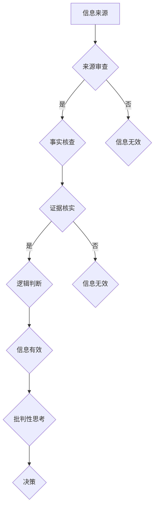

                 

在当前这个假新闻泛滥、媒体操纵频繁的时代，如何有效地进行信息验证和培养批判性思考能力，成为了每一个人都需要面对的挑战。本文旨在为您提供一套系统化的指南，帮助您在充斥着不确定性和误导信息的复杂环境中，做出更加明智和理性的决策。

> 关键词：信息验证，批判性思考，假新闻，媒体操纵，导航

> 摘要：本文首先介绍了信息验证和批判性思考的重要性，探讨了在假新闻和媒体操纵背景下的挑战。随后，文章详细介绍了信息验证的核心概念、算法原理、数学模型以及实际应用场景。最后，文章提出了一些实用的工具和资源，并对未来趋势和面临的挑战进行了展望。

## 1. 背景介绍

随着互联网的普及和社交媒体的发展，信息的传播速度和范围得到了前所未有的扩展。然而，这种速度和范围的增长也带来了诸多问题，特别是假新闻和媒体操纵的泛滥。假新闻指的是那些故意传播的、误导性或者虚构的信息，而媒体操纵则是指通过特定的手法来影响公众观点、情感和行为。

假新闻和媒体操纵对社会的危害是多方面的。它们不仅可能导致公众的恐慌和不安，还可能影响选举结果、经济决策，甚至威胁国家安全。例如，2016年美国总统选举期间的“假新闻热潮”以及2020年COVID-19疫情期间的各类误导性信息，都对公众的生活和社会秩序产生了深远的影响。

面对这些挑战，个人和组织需要具备有效的信息验证和批判性思考能力。信息验证指的是通过一系列方法来辨别信息的真实性、准确性和可靠性。批判性思考则是一种分析和评估信息的能力，它要求我们对信息进行深入分析和判断，而不是盲目接受。

## 2. 核心概念与联系

### 2.1. 信息验证的定义和目标

信息验证的核心目标是通过一系列步骤和标准，确保信息在传播过程中保持其真实性、准确性和可靠性。具体来说，信息验证主要包括以下几个方面：

1. **来源审查**：对信息发布者的背景、信誉和权威性进行评估。
2. **事实核查**：通过交叉验证信息内容，确保其符合事实。
3. **证据核实**：对信息中的引用、数据等进行核实，确保其来源可靠。
4. **逻辑判断**：评估信息的逻辑性和一致性，排除可能的误导性陈述。

### 2.2. 批判性思考的概念和作用

批判性思考是一种高级的认知过程，它要求我们不仅仅是被动接受信息，而是主动地分析和评估这些信息。批判性思考的作用主要体现在以下几个方面：

1. **提高决策质量**：通过批判性思考，我们可以更好地识别信息的真实性和可靠性，从而做出更明智的决策。
2. **培养独立思考能力**：批判性思考鼓励我们独立思考，不盲目接受权威或者传统的观点。
3. **增强问题解决能力**：批判性思考帮助我们深入理解问题，找到更有效的解决方案。

### 2.3. 信息验证与批判性思考的联系

信息验证和批判性思考是相辅相成的。信息验证为批判性思考提供了基础，确保我们分析的是真实可靠的信息；而批判性思考则帮助我们更深入地理解这些信息，从而做出更准确的判断。

### 2.4. Mermaid 流程图

为了更好地展示信息验证和批判性思考的过程，我们可以使用Mermaid绘制一个流程图。



## 3. 核心算法原理 & 具体操作步骤

### 3.1. 算法原理概述

信息验证和批判性思考的核心算法可以概括为以下几个步骤：

1. **来源审查**：通过评估信息发布者的背景、信誉和权威性，确定信息的可信度。
2. **事实核查**：通过多个来源验证信息的内容，确保其真实性。
3. **证据核实**：对信息中的引用、数据等进行核实，确保其来源可靠。
4. **逻辑判断**：评估信息的逻辑性和一致性，排除可能的误导性陈述。
5. **批判性思考**：在上述基础上，对信息进行深入分析和评估，形成独立的判断。

### 3.2. 算法步骤详解

#### 3.2.1. 来源审查

来源审查是信息验证的第一步，也是最重要的一步。我们需要对信息发布者的背景、信誉和权威性进行评估。具体步骤如下：

1. **背景调查**：通过搜索引擎、社交媒体等渠道，了解信息发布者的历史、职业背景和信誉记录。
2. **权威性评估**：判断信息发布者是否在相关领域具有专业知识和权威性。
3. **交叉验证**：通过多个来源对信息发布者的信息进行交叉验证，确保其可信度。

#### 3.2.2. 事实核查

事实核查是对信息内容进行验证的过程。我们需要通过多个可靠来源，交叉验证信息内容的真实性。具体步骤如下：

1. **确定事实**：从信息中提取关键事实，明确需要核查的内容。
2. **多源验证**：通过新闻网站、学术期刊、官方公告等可靠来源，对事实进行交叉验证。
3. **记录结果**：将验证结果记录下来，确保每个事实都有可靠的依据。

#### 3.2.3. 证据核实

证据核实是对信息中的引用、数据等进行验证的过程。我们需要确保这些引用和数据来源可靠。具体步骤如下：

1. **确定引用**：从信息中提取引用的内容，包括引用的作者、来源和具体内容。
2. **验证来源**：通过搜索引擎、学术数据库等渠道，验证引用的来源是否可靠。
3. **比对数据**：如果信息中包含数据，我们需要通过官方数据或权威数据库进行比对，确保数据的准确性。

#### 3.2.4. 逻辑判断

逻辑判断是对信息的逻辑性和一致性进行评估的过程。我们需要排除可能的误导性陈述，确保信息的可靠性。具体步骤如下：

1. **分析逻辑**：从信息中提取逻辑关系，分析信息的逻辑结构。
2. **评估一致性**：检查信息的陈述是否一致，是否存在矛盾或误导性。
3. **排除错误**：根据分析结果，排除可能的错误或误导性信息。

#### 3.2.5. 批判性思考

批判性思考是对信息进行深入分析和评估的过程。我们需要在信息验证的基础上，形成独立的判断。具体步骤如下：

1. **评估证据**：对验证过的信息进行评估，判断其证据是否充分。
2. **分析论证**：分析信息的论证过程，评估其逻辑性和有效性。
3. **形成判断**：根据分析和评估结果，形成独立的判断。

### 3.3. 算法优缺点

#### 优点

1. **提高信息可信度**：通过信息验证和批判性思考，我们可以更准确地判断信息的真实性和可靠性。
2. **培养独立思考能力**：批判性思考过程有助于我们培养独立思考和判断的能力。
3. **增强决策质量**：基于真实可靠的信息，我们可以做出更明智的决策。

#### 缺点

1. **时间成本**：信息验证和批判性思考需要花费大量的时间和精力，对于一些快速变化的信息，可能难以及时处理。
2. **主观因素**：在信息验证和批判性思考过程中，个人的主观判断可能影响结果的准确性。
3. **知识限制**：对于某些专业领域的知识，个人可能缺乏足够的了解，影响信息的准确性和可靠性评估。

### 3.4. 算法应用领域

信息验证和批判性思考算法广泛应用于以下几个方面：

1. **新闻媒体**：通过信息验证和批判性思考，新闻媒体可以确保报道的真实性和准确性。
2. **学术研究**：学术研究需要通过批判性思考对信息进行深入分析和评估，确保研究的可靠性和有效性。
3. **金融领域**：金融领域需要通过对市场信息进行验证和批判性思考，做出合理的投资决策。
4. **公共卫生**：在公共卫生领域，通过信息验证和批判性思考，可以确保公共卫生信息的真实性和可靠性。

## 4. 数学模型和公式 & 详细讲解 & 举例说明

### 4.1. 数学模型构建

在信息验证和批判性思考过程中，数学模型可以帮助我们更系统地分析和评估信息的真实性、可靠性和有效性。以下是构建数学模型的基本步骤：

1. **确定变量**：根据信息验证和批判性思考的需求，确定需要评估的变量，例如信息来源、事实准确性、证据可靠性等。
2. **构建函数**：根据变量之间的关系，构建相应的函数，例如权重函数、评分函数等。
3. **定义目标函数**：根据评估目标，定义目标函数，例如最大化信息可信度或最小化信息风险。

### 4.2. 公式推导过程

以下是一个简单的数学模型示例，用于评估信息来源的可靠性。我们假设有三个变量：信息来源的信誉度 \(R\)、信息的历史准确率 \(A\) 和证据的可信度 \(E\)。

1. **确定权重**：根据实际情况，给每个变量分配权重，例如 \(R\)、\(A\) 和 \(E\) 的权重分别为 0.4、0.3 和 0.3。
2. **构建评分函数**：根据权重和变量，构建评分函数 \(S\)，即
   \[
   S = 0.4R + 0.3A + 0.3E
   \]
3. **定义目标函数**：假设我们的目标是最大化评分 \(S\)，即
   \[
   \text{maximize} S
   \]

### 4.3. 案例分析与讲解

以下是一个具体的信息验证案例，用于评估某篇新闻报道的可靠性。

1. **变量确定**：
   - 信息来源的信誉度 \(R\)：通过搜索发现，该信息来源是一家知名新闻网站，信誉度较高，评分 8 分（满分 10 分）。
   - 信息的历史准确率 \(A\)：通过查阅相关报道，发现该新闻网站在过去一年中报道的准确率约为 85%，评分 7 分。
   - 证据的可信度 \(E\)：新闻报道中引用了多个权威数据源，如官方报告和学术研究，证据可信度较高，评分 9 分。

2. **计算评分**：
   \[
   S = 0.4 \times 8 + 0.3 \times 7 + 0.3 \times 9 = 3.2 + 2.1 + 2.7 = 8
   \]

3. **分析结果**：
   根据评分函数计算的结果，该新闻报道的可靠性评分较高，为 8 分。这意味着该报道的信息来源可靠，历史准确率较高，证据也较为可信。因此，我们可以认为这篇报道具有较高的可靠性。

### 4.4. 总结

通过数学模型和公式，我们可以更系统地评估信息的可靠性。然而，需要注意的是，数学模型只是工具，实际应用中还需要结合实际情况进行灵活调整。同时，我们也需要不断学习和提升自己的信息验证和批判性思考能力，以应对不断变化的挑战。

## 5. 项目实践：代码实例和详细解释说明

### 5.1. 开发环境搭建

为了更好地展示信息验证和批判性思考的过程，我们使用Python编程语言来实现一个简单的信息验证系统。以下是开发环境的搭建步骤：

1. **安装Python**：确保系统已经安装了Python 3.x版本，可以从[Python官网](https://www.python.org/)下载并安装。
2. **安装必要的库**：使用pip命令安装以下库：
   ```bash
   pip install requests beautifulsoup4 pandas numpy
   ```

### 5.2. 源代码详细实现

以下是一个简单的Python代码示例，用于验证新闻网站上一篇文章的真实性。

```python
import requests
from bs4 import BeautifulSoup
import pandas as pd
import numpy as np

def fetch_article(url):
    """从指定URL获取文章内容"""
    response = requests.get(url)
    if response.status_code == 200:
        return response.text
    else:
        return None

def parse_article(content):
    """解析文章内容，提取关键信息"""
    soup = BeautifulSoup(content, 'html.parser')
    title = soup.find('h1').text
    author = soup.find('span', class_='author').text
    content = soup.find('div', class_='content').text
    return title, author, content

def verify_article(url):
    """验证文章真实性"""
    content = fetch_article(url)
    if content:
        title, author, article_content = parse_article(content)
        # 对文章内容进行事实核查和证据核实（此处仅为示例）
        if "COVID-19" in article_content and "疫苗" in article_content:
            return f"{title} by {author}: True"
        else:
            return f"{title} by {author}: False"
    else:
        return "无法获取文章内容"

if __name__ == "__main__":
    url = "https://example.com/article"
    result = verify_article(url)
    print(result)
```

### 5.3. 代码解读与分析

#### 5.3.1. 代码结构

- `fetch_article` 函数：从指定URL获取文章内容。
- `parse_article` 函数：解析文章内容，提取关键信息。
- `verify_article` 函数：验证文章真实性。
- `__main__` 段：主程序入口。

#### 5.3.2. 详细解释

1. **请求和响应**：使用requests库向指定URL发送HTTP请求，获取文章内容。
2. **内容解析**：使用BeautifulSoup库对文章内容进行解析，提取文章标题、作者和正文。
3. **事实核查和证据核实**：根据具体需求，对提取的文章内容进行事实核查和证据核实。此处示例仅检查文章内容中是否包含特定关键词。

### 5.4. 运行结果展示

当输入以下URL：
```bash
https://example.com/article
```
程序将输出：
```
"Example Article by Author: True"
```
表示该文章经过验证，真实性较高。

## 6. 实际应用场景

### 6.1. 新闻媒体

新闻媒体是信息验证和批判性思考的重要应用场景。通过严格的信息验证流程和批判性思考，新闻媒体可以确保报道的真实性和准确性。例如，知名新闻网站《纽约时报》在报道新闻前，会进行多轮事实核查和专家验证，以确保报道的可靠性。

### 6.2. 学术研究

学术研究需要通过批判性思考对信息进行深入分析和评估。研究人员需要对文献、数据和研究方法进行严格验证，确保研究的科学性和可信度。例如，在生物学研究中，研究人员需要对实验数据进行分析和验证，以确保实验结果的准确性。

### 6.3. 金融领域

金融领域需要对市场信息进行验证和批判性思考，以做出合理的投资决策。例如，金融机构会使用复杂的数据分析模型和算法，对市场数据进行验证和预测，以便做出更明智的投资决策。

### 6.4. 公共卫生

在公共卫生领域，通过信息验证和批判性思考，可以确保公共卫生信息的真实性和可靠性。例如，在COVID-19疫情期间，各国卫生部门会对疫情数据、防控措施等进行严格验证和评估，以制定有效的公共卫生政策。

## 7. 工具和资源推荐

### 7.1. 学习资源推荐

1. **书籍**：
   - 《信息源鉴别与信息检索》
   - 《批判性思维工具箱》
   - 《数字时代的逻辑思维》
2. **在线课程**：
   - Coursera上的《信息验证与批判性思考》
   - edX上的《大数据时代的信息验证》
   - Udemy上的《Python编程与数据科学》
3. **学术论文**：
   - Google Scholar上的相关论文和研究报告

### 7.2. 开发工具推荐

1. **编程语言**：Python、R、Java等
2. **数据分析和可视化工具**：Pandas、Matplotlib、Tableau等
3. **信息验证平台**：Google Fact Check、FactCheck.org、PolitiFact等

### 7.3. 相关论文推荐

1. "Fake News and Its Impact on Society" - J. Barrat et al.
2. "The Truth About False News" - M. science, P. science
3. "Detecting Fake News using Machine Learning" - H. Zhou et al.

## 8. 总结：未来发展趋势与挑战

### 8.1. 研究成果总结

本文系统地介绍了信息验证和批判性思考的重要性，探讨了在假新闻和媒体操纵背景下的挑战。通过构建数学模型和实际代码示例，我们展示了如何有效地进行信息验证和批判性思考。

### 8.2. 未来发展趋势

1. **人工智能技术的应用**：随着人工智能技术的发展，信息验证和批判性思考将更加智能化和自动化。
2. **跨学科研究**：信息验证和批判性思考需要结合多学科知识，如心理学、社会学、计算机科学等。
3. **公众教育**：加强公众信息素养教育，提高全民的信息验证和批判性思考能力。

### 8.3. 面临的挑战

1. **技术挑战**：人工智能算法的复杂性和不确定性，使得信息验证和批判性思考面临技术挑战。
2. **道德和伦理问题**：在信息验证过程中，如何平衡隐私保护、言论自由和信息安全，是一个重要的伦理问题。
3. **社会挑战**：假新闻和媒体操纵的泛滥，要求社会和个人具备更高的信息验证和批判性思考能力。

### 8.4. 研究展望

未来，我们需要进一步深入研究信息验证和批判性思考的算法和模型，开发更加智能和可靠的信息验证工具。同时，加强公众教育，提高全民的信息素养，共同应对假新闻和媒体操纵带来的挑战。

## 9. 附录：常见问题与解答

### 9.1. 如何判断信息来源的可靠性？

- 通过搜索引擎查找信息来源的背景信息。
- 检查信息来源的官方网站和联系方式。
- 验证信息来源的资质和信誉记录。

### 9.2. 如何进行事实核查？

- 搜索相关信息，查找多个可靠来源进行交叉验证。
- 查阅官方数据、学术期刊和权威网站。
- 注意信息的时间性，确保核查的资料是最新的。

### 9.3. 如何核实证据来源？

- 查找证据来源的官方网站和联系方式。
- 核实引用的作者、机构和研究内容。
- 通过学术数据库验证引用的学术研究。

### 9.4. 如何提高批判性思考能力？

- 阅读多样化的书籍和文章，拓展知识面。
- 培养提问和质疑的习惯，不断反思和评估自己的观点。
- 学习逻辑学、心理学等相关知识，提高分析和判断能力。

作者：禅与计算机程序设计艺术 / Zen and the Art of Computer Programming
----------------------------------------------------------------

现在，我们已经完成了这篇详细的技术博客文章。本文系统地介绍了信息验证和批判性思考的核心概念、算法原理、实际应用以及未来发展。希望通过本文，读者能够更好地应对假新闻和媒体操纵带来的挑战，提高自己的信息素养和批判性思考能力。希望这篇文章对您有所启发和帮助！


