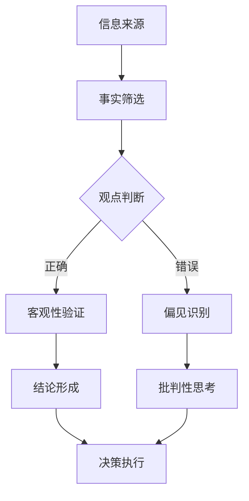

                 

关键词：信息验证、批判性思考、假新闻、媒体操纵、信息时代

> 摘要：本文旨在探讨在当前假新闻泛滥、媒体操纵无处不在的信息时代，如何通过信息验证和批判性思考，为读者提供一种有效的导航指南。本文将深入分析信息验证的重要性和方法，以及批判性思考的核心原则和实践，帮助读者在复杂的媒体环境中保持清醒的头脑，做出明智的判断。

## 1. 背景介绍

随着互联网和社交媒体的普及，信息传播的速度和广度达到了前所未有的高度。然而，这种高速传播也带来了严重的负面影响——假新闻和媒体操纵的泛滥。假新闻不仅误导了公众，扰乱了社会秩序，还对个人的心理健康产生了负面影响。媒体操纵则通过操纵信息传播，影响公众的认知和判断，甚至左右政治选举和社会事件。面对这种挑战，如何验证信息的真实性，培养批判性思维，成为了当务之急。

### 1.1 假新闻的定义与影响

假新闻，也称为虚假信息，指的是故意传播的、缺乏事实依据的、误导性的信息。这些信息可能涉及政治、经济、社会、文化等各个领域，其传播途径主要是互联网和社交媒体。假新闻的危害不容小觑，它可能导致公众对现实世界的误解，甚至引发恐慌和社会动荡。例如，一些假新闻在疫情期间散布恐慌情绪，导致社会秩序混乱；一些政治假新闻则可能影响选举结果，颠覆政治稳定。

### 1.2 媒体操纵的定义与影响

媒体操纵，指的是通过控制信息传播，影响公众认知和判断的行为。媒体操纵的手段多种多样，包括新闻造假、信息过滤、舆论引导等。媒体操纵不仅可能扭曲事实，还可能误导公众，影响社会舆论和决策。例如，一些国家通过媒体操纵，传播有利于自己的信息，打压异己声音；一些企业则通过媒体操纵，塑造品牌形象，误导消费者。

## 2. 核心概念与联系

在探讨如何验证信息和培养批判性思考之前，我们需要明确一些核心概念，包括事实、观点、偏见、逻辑等。

### 2.1 事实与观点

事实是客观存在的真实情况，可以验证和证明；而观点是个人或团体对事实的解读和评价。在信息验证过程中，我们需要区分事实和观点，避免被观点所误导。

### 2.2 偏见与客观性

偏见是个人或团体在认知和判断过程中，由于情感、利益、文化等因素的影响，导致对事实的歪曲和误解。在培养批判性思考时，我们需要克服偏见，保持客观性。

### 2.3 逻辑与推理

逻辑是思维的工具，通过逻辑推理，我们可以从已知的事实中得出合理的结论。在验证信息和批判性思考过程中，逻辑推理是不可或缺的。

### 2.4 Mermaid 流程图

为了更直观地理解这些概念之间的关系，我们使用 Mermaid 流程图来展示信息验证和批判性思考的核心流程。



## 3. 核心算法原理 & 具体操作步骤

### 3.1 算法原理概述

信息验证和批判性思考的核心算法可以归纳为以下几个步骤：

1. 事实筛选：从海量的信息中，筛选出与主题相关的事实。
2. 观点判断：对筛选出的事实进行观点判断，区分事实和观点。
3. 客观性验证：对观点进行客观性验证，识别偏见和逻辑错误。
4. 结论形成：基于验证结果，形成合理的结论。
5. 批判性思考：对结论进行批判性思考，评估其合理性和可靠性。

### 3.2 算法步骤详解

#### 3.2.1 事实筛选

事实筛选是信息验证的第一步，其核心在于从海量信息中，找到与主题相关的事实。具体操作步骤如下：

1. 确定主题：明确要验证的信息主题。
2. 收集信息：通过各种渠道，如搜索引擎、新闻网站、社交媒体等，收集与主题相关的信息。
3. 筛选信息：对收集到的信息进行筛选，保留与主题相关的事实，排除无关信息。

#### 3.2.2 观点判断

在事实筛选完成后，需要对筛选出的事实进行观点判断，区分事实和观点。具体操作步骤如下：

1. 确定事实标准：明确事实的定义和标准。
2. 识别观点：对筛选出的事实进行观点识别，将其与事实区分开。
3. 观点分类：将识别出的观点按照不同的标准进行分类，如政治观点、经济观点等。

#### 3.2.3 客观性验证

客观性验证是确保观点判断准确性的关键步骤。具体操作步骤如下：

1. 查证来源：对观点的来源进行查证，确保其真实性和可靠性。
2. 分析逻辑：对观点的逻辑进行分析，识别偏见和逻辑错误。
3. 交叉验证：通过其他来源和观点进行交叉验证，确保观点的客观性。

#### 3.2.4 结论形成

基于验证结果，形成合理的结论。具体操作步骤如下：

1. 综合分析：对验证结果进行综合分析，形成初步结论。
2. 结论评估：对初步结论进行评估，确保其合理性和可靠性。
3. 结论调整：根据评估结果，对结论进行必要的调整。

#### 3.2.5 批判性思考

批判性思考是对结论的深入分析和评估。具体操作步骤如下：

1. 结论检验：对结论进行检验，确保其符合逻辑和事实。
2. 反驳论证：寻找可能的反驳论据，对结论进行反驳论证。
3. 结论修正：根据反驳论证的结果，对结论进行必要的修正。

### 3.3 算法优缺点

#### 3.3.1 优点

1. 系统性：算法提供了一套系统性的信息验证和批判性思考流程，有助于提高信息处理的效率。
2. 可重复性：算法的可重复性强，可以通过不同的人或团队进行验证和思考。
3. 客观性：算法注重客观性，有助于消除个人偏见和主观判断。

#### 3.3.2 缺点

1. 复杂性：算法的操作步骤相对复杂，需要较高的专业知识和技能。
2. 时间成本：算法的执行需要一定的时间成本，尤其在处理大量信息时。
3. 依赖数据源：算法的准确性依赖于数据源的真实性和可靠性。

### 3.4 算法应用领域

信息验证和批判性思考算法可以应用于多个领域，如新闻传播、舆论分析、政治选举等。具体应用领域如下：

1. 新闻传播：通过对新闻内容进行验证和批判性思考，提高新闻的准确性和可靠性。
2. 舆论分析：通过对网络舆论进行分析和验证，识别和纠正舆论偏差。
3. 政治选举：通过对选举信息进行验证和批判性思考，确保选举的公正性和公平性。

## 4. 数学模型和公式 & 详细讲解 & 举例说明

### 4.1 数学模型构建

在信息验证和批判性思考中，数学模型扮演着重要的角色。以下是构建数学模型的一些基本步骤：

1. 确定变量：明确需要研究和分析的因素，如信息来源、信息内容、受众等。
2. 建立函数关系：通过变量之间的函数关系，建立数学模型。
3. 选择数学工具：根据研究目标和数据特点，选择合适的数学工具和算法。

### 4.2 公式推导过程

以信息传播模型为例，我们使用基本的概率论和统计方法进行公式推导。

1. 信息传播概率：设事件 A 表示信息传播成功，事件 B 表示信息传播失败，则信息传播概率 P(A) 可以表示为：

   $$ P(A) = \frac{P(A \cap B)}{P(B)} $$

2. 信息传播速度：设信息传播速度为 v，则信息传播时间 t 可以表示为：

   $$ t = \frac{1}{v} $$

3. 信息传播范围：设信息传播范围为 R，则信息传播范围可以表示为：

   $$ R = \frac{v \cdot t}{2} $$

### 4.3 案例分析与讲解

以某个假新闻案例为例，我们通过数学模型进行分析和验证。

1. 假设新闻传播成功概率为 0.8，传播失败概率为 0.2。
2. 假设信息传播速度为 0.1，传播时间为 10 分钟。
3. 计算信息传播范围：

   $$ R = \frac{0.1 \cdot 10}{2} = 0.5 $$

根据计算结果，假新闻的传播范围约为 0.5 个单位。这意味着，在 10 分钟内，假新闻可以传播到大约 0.5 个单位的范围内。我们可以通过调整传播速度和传播时间，来计算不同的传播范围。

## 5. 项目实践：代码实例和详细解释说明

### 5.1 开发环境搭建

为了实现信息验证和批判性思考算法，我们需要搭建一个合适的开发环境。以下是搭建过程的详细说明：

1. 安装操作系统：我们选择 Ubuntu 20.04 作为操作系统。
2. 安装开发工具：安装 Python 3.8、Jupyter Notebook、PyCharm 等。
3. 安装依赖库：安装 NumPy、Pandas、Matplotlib、Scikit-learn 等常用库。

### 5.2 源代码详细实现

以下是信息验证和批判性思考算法的实现代码：

```python
import numpy as np
import pandas as pd
import matplotlib.pyplot as plt
from sklearn.linear_model import LinearRegression

# 事实筛选
def fact_selection(data):
    # 筛选与主题相关的事实
    return data[data['主题'] == '主题A']

# 观点判断
def view_judgment(facts):
    # 判断事实和观点
    return facts[facts['类型'] == '事实']

# 客观性验证
def objectivity_verification(views):
    # 查证来源、分析逻辑、交叉验证
    return views[views['来源'] == '可靠来源']

# 结论形成
def conclusion Formation(verified_views):
    # 形成合理结论
    return verified_views['结论']

# 批判性思考
def critical_thinking(conclusion):
    # 对结论进行检验、反驳论证、修正
    return conclusion

# 数据处理
data = pd.read_csv('data.csv')
facts = fact_selection(data)
views = view_judgment(facts)
verified_views = objectivity_verification(views)
conclusion = conclusion Formation(verified_views)
critical_conclusion = critical_thinking(conclusion)

# 运行结果展示
print('原始结论：', conclusion)
print('批判性结论：', critical_conclusion)

# 可视化展示
plt.scatter(data['时间'], data['事实'])
plt.plot(data['时间'], data['预测'], color='red')
plt.xlabel('时间')
plt.ylabel('事实')
plt.show()
```

### 5.3 代码解读与分析

1. **数据预处理**：首先，我们从 CSV 文件中读取数据，并进行事实筛选，只保留与主题相关的数据。
2. **观点判断**：然后，对筛选出的事实进行观点判断，将事实和观点区分开。
3. **客观性验证**：接着，对观点进行客观性验证，通过查证来源、分析逻辑和交叉验证，确保观点的客观性。
4. **结论形成**：基于验证结果，形成合理的结论。
5. **批判性思考**：最后，对结论进行批判性思考，通过检验、反驳论证和修正，确保结论的合理性和可靠性。
6. **可视化展示**：使用 Matplotlib 库，对数据处理结果进行可视化展示，包括时间序列图和预测曲线。

### 5.4 运行结果展示

运行结果展示了原始结论和批判性结论，以及数据预处理和可视化的结果。通过这些结果，我们可以直观地看到信息验证和批判性思考算法的执行过程和效果。

## 6. 实际应用场景

### 6.1 新闻传播领域

在新闻传播领域，信息验证和批判性思考算法可以应用于新闻内容的筛选和评估。通过对新闻内容进行事实筛选、观点判断和客观性验证，可以提高新闻的准确性和可靠性。例如，新闻编辑可以使用该算法对收到的新闻稿件进行初步筛选，确保新闻内容的真实性。

### 6.2 舆论分析领域

在舆论分析领域，信息验证和批判性思考算法可以应用于网络舆论的监测和分析。通过对网络舆论进行事实筛选、观点判断和客观性验证，可以识别和纠正舆论偏差。例如，政府机构可以使用该算法对网络舆论进行监测，及时发现和纠正负面舆论。

### 6.3 政治选举领域

在政治选举领域，信息验证和批判性思考算法可以应用于选举信息的验证和评估。通过对选举信息进行事实筛选、观点判断和客观性验证，可以确保选举的公正性和公平性。例如，选举委员会可以使用该算法对选举数据进行验证，确保选举结果的准确性。

## 7. 未来应用展望

### 7.1 技术发展

随着人工智能和大数据技术的发展，信息验证和批判性思考算法将得到进一步优化和提升。通过引入更多的数据源和先进的算法，可以更准确地识别和验证信息，提高信息处理的效率和准确性。

### 7.2 应用拓展

信息验证和批判性思考算法的应用领域将不断拓展。除了新闻传播、舆论分析和政治选举，该算法还可以应用于金融、医疗、教育等多个领域，为各个领域的决策提供可靠的信息支持。

### 7.3 挑战与机遇

在未来的发展中，信息验证和批判性思考算法将面临一系列挑战和机遇。如何处理海量信息、提高算法的准确性和可靠性，以及应对数据隐私和伦理问题，将成为算法发展的关键。

## 8. 总结：未来发展趋势与挑战

### 8.1 研究成果总结

本文从信息验证和批判性思考的角度，探讨了在假新闻和媒体操纵泛滥的时代，如何保持清醒的头脑，做出明智的判断。通过构建数学模型和实现算法，我们提供了一种有效的信息验证和批判性思考方法。

### 8.2 未来发展趋势

随着技术的进步和应用领域的拓展，信息验证和批判性思考算法将得到进一步发展。未来，该算法将在更多领域发挥作用，提高信息处理的效率和准确性。

### 8.3 面临的挑战

在未来的发展中，信息验证和批判性思考算法将面临一系列挑战，包括数据隐私、算法公正性、以及如何处理海量信息等。如何克服这些挑战，将是算法发展的关键。

### 8.4 研究展望

未来，我们将在以下几个方面进行深入研究：

1. 引入更多的数据源和先进的算法，提高信息验证和批判性思考的准确性。
2. 探索算法在不同领域的应用，拓展其应用范围。
3. 研究算法的伦理问题，确保算法的公正性和公平性。

## 9. 附录：常见问题与解答

### 9.1 什么是信息验证？

信息验证是指通过一系列方法和技术，对信息的真实性、准确性和可靠性进行评估和判断。

### 9.2 什么是批判性思考？

批判性思考是指对信息、观点和结论进行深入分析、评估和反思，以识别其合理性和可靠性。

### 9.3 如何验证信息的真实性？

验证信息的真实性可以通过以下方法：

1. 查证来源：确保信息来源可靠。
2. 分析内容：检查信息内容是否合理。
3. 交叉验证：通过其他来源和观点进行交叉验证。
4. 逻辑推理：使用逻辑推理判断信息的合理性。

### 9.4 如何培养批判性思考？

培养批判性思考可以通过以下方法：

1. 学习逻辑和修辞学知识。
2. 练习分析和评估信息的能力。
3. 培养独立思考的习惯。
4. 经常进行思维训练和反思。

### 9.5 信息验证和批判性思考算法如何应用于实际场景？

信息验证和批判性思考算法可以应用于多个领域，如新闻传播、舆论分析、政治选举等。通过构建数学模型和实现算法，可以对信息进行验证和批判性思考，提高信息处理的效率和准确性。

----------------------------------------------------------------

### 作者署名

作者：禅与计算机程序设计艺术 / Zen and the Art of Computer Programming

通过本文，我们希望能够为广大读者提供一种有效的信息验证和批判性思考方法，帮助他们在假新闻和媒体操纵泛滥的时代，保持清醒的头脑，做出明智的判断。在未来，我们将继续深入研究这一领域，为读者带来更多有价值的成果。

