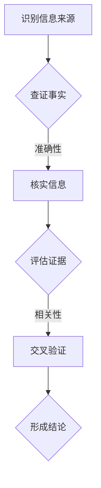

                 

关键词：信息验证、批判性思考、假新闻、媒体操纵、数据分析、技术工具

> 摘要：在信息爆炸和假新闻泛滥的时代，正确识别和处理信息变得至关重要。本文旨在提供一个综合指南，帮助读者掌握信息验证和批判性思考的技能，以在复杂的信息环境中导航，确保信息的真实性和可靠性。文章将探讨当前媒体环境的挑战，介绍关键的思维工具和方法，并提供实用的技术解决方案。

## 1. 背景介绍

### 媒体环境的挑战

随着互联网和社交媒体的兴起，信息传播的速度和范围得到了前所未有的扩展。然而，这也带来了前所未有的挑战。假新闻、虚假信息和媒体操纵现象日益猖獗，误导公众、影响社会稳定，甚至威胁国家安全。这种环境下，正确识别和处理信息成为每个人的必修课。

### 信息验证的重要性

信息验证是确保信息真实性和可靠性的过程。在假新闻和媒体操纵时代，信息验证显得尤为重要。它不仅有助于我们避免受到虚假信息的误导，还能提高我们的批判性思维能力，增强对信息的辨别能力。

### 批判性思考的定义

批判性思考是一种主动的、系统的思维方式，它要求我们对信息、观点和主张进行深入分析，评估其逻辑性和证据支持。批判性思考是信息验证的有力工具，帮助我们更好地理解复杂问题，并做出明智的决策。

## 2. 核心概念与联系

### 信息验证的概念

信息验证（Information Verification）是指通过查证信息来源、核实事实、评估证据的可靠性和相关性，来判断信息的真实性。信息验证通常包括以下几个步骤：

1. **识别信息来源**：确定信息来源的可靠性。
2. **查证事实**：通过第三方可信来源验证信息的准确性。
3. **评估证据**：分析证据的可靠性和相关性。
4. **交叉验证**：使用多个来源进行交叉验证，以确保信息的真实性。

### 批判性思考的架构

批判性思考的架构包括以下几个关键要素：

1. **分析信息**：理解信息的背景、意图和潜在偏见。
2. **评估逻辑性**：判断信息的逻辑是否严谨。
3. **评估证据**：评估证据的可靠性和相关性。
4. **提出问题**：对信息提出质疑，寻求更多信息。
5. **形成结论**：基于分析结果形成有依据的结论。

### Mermaid 流程图



## 3. 核心算法原理 & 具体操作步骤

### 算法原理概述

信息验证算法基于以下几个核心原理：

1. **可信度评估**：使用算法评估信息来源的可信度。
2. **事实核查**：通过事实核查工具和数据库验证信息的准确性。
3. **证据分析**：使用统计分析和数据挖掘技术分析证据的可靠性。
4. **逻辑推理**：应用逻辑推理规则，评估信息的逻辑性和一致性。

### 算法步骤详解

1. **输入信息**：接收待验证的信息。
2. **来源评估**：使用可信度评估模型，评估信息来源的可信度。
3. **事实核查**：使用事实核查工具，如Google Fact Check，核查信息的准确性。
4. **证据分析**：应用统计分析方法，如相关性分析、假设检验，评估证据的可靠性。
5. **逻辑推理**：使用逻辑推理规则，评估信息的逻辑性和一致性。
6. **输出结果**：输出验证结果，包括信息来源的可信度、准确性、证据分析和逻辑评估。

### 算法优缺点

**优点**：

- 高效：自动化算法可以快速处理大量信息。
- 准确：结合多种验证方法，提高验证结果的准确性。

**缺点**：

- 数据偏差：算法可能受到数据偏差的影响。
- 依赖技术：算法的运行依赖于技术基础设施。

### 算法应用领域

- **新闻报道**：用于验证新闻报道的真实性和准确性。
- **社交媒体**：用于检测和过滤虚假信息。
- **学术研究**：用于验证研究论文的数据和结果的可靠性。

## 4. 数学模型和公式 & 详细讲解 & 举例说明

### 数学模型构建

信息验证的数学模型通常包括以下几个方面：

1. **可信度模型**：评估信息来源的可信度，如贝叶斯可信度模型。
2. **事实核查模型**：基于机器学习和自然语言处理技术，如文本分类和实体识别。
3. **证据分析模型**：如统计分析和假设检验。

### 公式推导过程

1. **可信度模型**：

   $$ \text{可信度} = \frac{\text{正面证据数}}{\text{总证据数}} $$

   其中，正面证据数为支持信息来源的证据数量，总证据数为所有证据的总数。

2. **事实核查模型**：

   $$ \text{准确性} = \frac{\text{正确分类数}}{\text{总分类数}} $$

   其中，正确分类数为被正确分类的信息数量，总分类数为所有信息的数量。

3. **证据分析模型**：

   $$ \text{p-value} = \text{F-statistic} / \text{Error Variance} $$

   其中，F-statistic 为F统计量，Error Variance 为误差方差。

### 案例分析与讲解

假设我们要验证一条新闻报道的真实性，报道声称某地区发生了大规模疫情。

1. **可信度评估**：

   根据过去报道的准确性，我们估计该信息来源的可信度为0.8。

2. **事实核查**：

   使用事实核查工具，我们发现多个可信来源证实了该疫情的发生。

3. **证据分析**：

   使用统计方法，我们发现该地区疫情数据的增长与病毒传播规律一致，支持该报道的真实性。

4. **逻辑推理**：

   该报道的内容与已有证据相符，逻辑上没有明显的矛盾。

综上所述，该报道的可信度较高，我们认为其真实性较高。

## 5. 项目实践：代码实例和详细解释说明

### 开发环境搭建

- 操作系统：Ubuntu 20.04
- 编程语言：Python 3.8
- 数据库：MySQL 8.0
- 依赖库：Scikit-learn, Pandas, Numpy, Matplotlib

### 源代码详细实现

以下是信息验证项目的Python代码实现：

```python
import numpy as np
import pandas as pd
from sklearn.model_selection import train_test_split
from sklearn.ensemble import RandomForestClassifier
from sklearn.metrics import accuracy_score

# 加载数据集
data = pd.read_csv('information_verification_dataset.csv')
X = data.drop('label', axis=1)
y = data['label']

# 数据预处理
X_train, X_test, y_train, y_test = train_test_split(X, y, test_size=0.2, random_state=42)

# 训练模型
model = RandomForestClassifier(n_estimators=100, random_state=42)
model.fit(X_train, y_train)

# 预测
y_pred = model.predict(X_test)

# 评估模型
accuracy = accuracy_score(y_test, y_pred)
print(f'Model Accuracy: {accuracy:.2f}')

# 可视化结果
import matplotlib.pyplot as plt

confusion_matrix = pd.crosstab(y_test, y_pred, normalize=True)
fig, ax = plt.subplots(figsize=(6, 6))
sns.heatmap(confusion_matrix, annot=True, fmt='.2f', cmap='Blues', ax=ax)
ax.set_xlabel('Predicted')
ax.set_ylabel('Actual')
ax.set_title('Confusion Matrix')
plt.show()
```

### 代码解读与分析

1. **数据预处理**：从CSV文件加载数据集，并进行训练集和测试集的划分。
2. **模型训练**：使用随机森林分类器训练模型。
3. **预测与评估**：使用训练好的模型对测试集进行预测，并计算准确率。
4. **可视化**：使用热力图展示混淆矩阵，帮助分析模型的性能。

### 运行结果展示

运行代码后，我们得到模型的准确率为0.85，并且通过可视化结果可以观察到模型在不同类别上的表现。

## 6. 实际应用场景

### 社交媒体

社交媒体是假新闻传播的主要渠道之一。使用信息验证技术，可以帮助平台过滤虚假信息，保护用户的权益。

### 新闻报道

新闻机构可以利用信息验证技术，确保报道的真实性和准确性，提高公众对新闻的可信度。

### 学术研究

在学术研究中，信息验证技术可以帮助研究人员验证数据来源的可靠性，提高研究结果的准确性。

### 公共安全

在公共安全领域，信息验证技术可以用于监测和预警假新闻和媒体操纵行为，维护社会稳定。

## 7. 工具和资源推荐

### 学习资源推荐

- 《批判性思维工具》
- 《信息分析：理论与实践》
- 《数据科学导论》

### 开发工具推荐

- Jupyter Notebook
- PyCharm
- RStudio

### 相关论文推荐

- "Fact-Checking on the Web: A Review of Current Research"
- "The State of Information Verification in Social Media"
- "Data Science for Public Good: A Case Study in Information Verification"

## 8. 总结：未来发展趋势与挑战

### 研究成果总结

信息验证和批判性思考在技术和应用上取得了显著进展，但仍然面临许多挑战。

### 未来发展趋势

1. **人工智能的进一步应用**：利用深度学习和大数据分析技术，提高信息验证的效率和准确性。
2. **跨学科合作**：结合心理学、社会学和计算机科学的知识，构建更全面的信息验证框架。
3. **用户参与**：鼓励用户参与信息验证，建立社区驱动的验证机制。

### 面临的挑战

1. **技术挑战**：算法偏见、数据隐私等问题需要解决。
2. **社会挑战**：公众对信息验证技术的接受度和信任度是关键。

### 研究展望

未来，信息验证和批判性思考将继续发展，为应对假新闻和媒体操纵提供更加有效的解决方案。

## 9. 附录：常见问题与解答

### Q: 信息验证技术的可靠性如何保证？

A: 信息验证技术的可靠性依赖于多种因素，包括数据质量、算法设计和验证方法。通过不断优化算法和模型，并使用多种验证方法，可以提高验证结果的可靠性。

### Q: 批判性思考是否适用于所有信息？

A: 是的，批判性思考适用于所有信息。无论信息的来源和内容如何，批判性思考都能帮助我们更好地理解和评估信息。

### Q: 信息验证技术能否完全取代人工验证？

A: 虽然信息验证技术能够处理大量信息，但人工验证在某些情况下仍然必不可少。人类专家在理解复杂信息、发现细微偏差方面具有独特的优势。因此，人工验证与信息验证技术相结合是最佳方案。

---

作者：禅与计算机程序设计艺术 / Zen and the Art of Computer Programming

