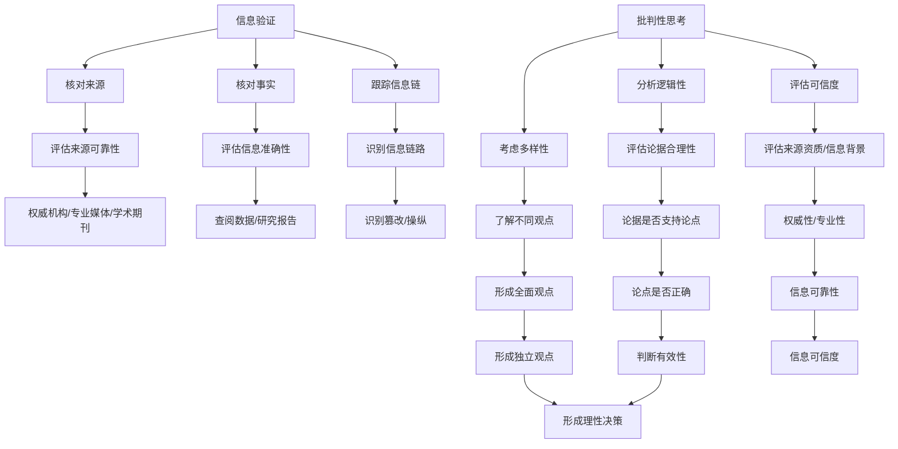

                 

在当今信息爆炸和假新闻泛滥的时代，学会如何有效地验证信息和培养批判性思考能力，成为每个个体都必须掌握的生存技能。这不仅关乎个人认知的准确性，更直接影响到社会的稳定和进步。本文旨在为您提供一个全面的指南，帮助您在这片信息海洋中导航，确保您获得的信息是真实可信的，并能以批判性思维来分析、理解和运用这些信息。

## 关键词

- 信息验证
- 批判性思考
- 假新闻
- 媒体操纵
- 信息素养

## 摘要

本文首先介绍了信息验证和批判性思考在当今社会的重要性，随后深入探讨了这两个概念的核心原理和实践方法。通过实际案例和数学模型的讲解，文章展示了如何运用这些原理进行有效的信息分析和验证。最后，本文还提供了实用的工具和资源推荐，为读者提供了全面提升信息素养的实际路径。

## 1. 背景介绍

随着互联网和社交媒体的普及，信息传播的速度和范围达到了前所未有的广度。然而，这也导致了大量虚假信息和媒体操纵的泛滥。例如，社交媒体上的虚假新闻、恶意营销、政治宣传等，都严重干扰了公众的认知和社会秩序。这不仅使个人在获取信息时感到困惑和不安，也对社会的稳定和发展构成了威胁。

在这种情况下，信息验证和批判性思考显得尤为重要。信息验证是指通过各种手段和方法，对获取的信息进行核实和确认，确保其真实性和准确性。批判性思考则是通过深入分析、评估和质疑信息，形成独立、理性的判断和观点。

### 1.1 假新闻与媒体操纵现象

假新闻和媒体操纵已经成为全球范围内的严重问题。据研究发现，虚假信息的传播速度远远超过了真实新闻，甚至能在几秒钟内影响数百万人的观点。例如，2016年的美国总统选举期间，社交媒体上充斥着大量的虚假信息，这些信息不仅影响了选民的投票决策，也对整个选举过程产生了深远的影响。

此外，一些国家和组织通过媒体操纵来达到政治目的，例如通过发布虚假新闻来破坏竞争对手的形象，或通过传播谣言来煽动民众的情绪。这些行为不仅损害了公众的利益，也对社会稳定和民主制度构成了威胁。

### 1.2 信息验证的重要性

在假新闻和媒体操纵泛滥的背景下，信息验证显得尤为重要。通过信息验证，我们可以确保所获取的信息是真实可信的，避免受到虚假信息的误导。例如，在医疗领域，正确的诊断和治疗依赖于可靠的信息。如果医生基于错误的信息做出决策，可能会导致严重的医疗事故。

此外，在商业决策、投资理财、科学研究等领域，准确的信息同样至关重要。错误的信息可能会导致错误的决策，从而给个人或组织带来巨大的损失。

### 1.3 批判性思考的作用

批判性思考不仅有助于我们识别和验证信息，还能帮助我们形成独立、理性的观点和决策。通过批判性思考，我们可以深入分析信息的来源、逻辑和论据，评估其可信度和有效性。例如，在阅读新闻时，我们可以通过批判性思考来识别报道的真实性、公正性和客观性，从而避免被虚假信息所误导。

批判性思考还能帮助我们识别和避免认知偏差，例如确认偏差、群体思维等。这些偏差可能导致我们过分依赖某些信息来源，忽视其他重要的观点和证据，从而影响我们的判断和决策。

## 2. 核心概念与联系

### 2.1 信息验证的概念与原理

信息验证是指通过各种手段和方法，对获取的信息进行核实和确认，确保其真实性和准确性。信息验证的核心原理包括以下几个方面：

#### 2.1.1 核对来源

首先，我们需要确认信息的来源是否可靠。可靠的来源通常包括权威机构、专业媒体、学术期刊等。例如，在医学领域，我们可以通过查阅权威的医学期刊来验证一个医疗研究成果的真实性和准确性。

#### 2.1.2 核对事实

其次，我们需要核对信息的内容是否真实。这包括检查信息的真实性、准确性和完整性。例如，在阅读新闻报道时，我们可以通过查阅相关数据和研究报告来验证新闻中的事实和论据。

#### 2.1.3 跟踪信息链

此外，我们还需要跟踪信息的传播链，了解信息是如何从源头传播到我们这里的。这有助于我们识别信息被篡改或操纵的可能性。

### 2.2 批判性思考的概念与原理

批判性思考是指通过深入分析、评估和质疑信息，形成独立、理性的观点和决策。批判性思考的核心原理包括以下几个方面：

#### 2.2.1 分析信息的逻辑性

首先，我们需要分析信息的逻辑性。这意味着我们需要评估信息的论据是否合理，论据是否支持论点，以及论点是否正确。

#### 2.2.2 评估信息的可信度

其次，我们需要评估信息的可信度。这包括评估信息的来源、作者的资质、信息的历史背景等。

#### 2.2.3 考虑信息的多样性

此外，我们还需要考虑信息的多样性。这意味着我们需要了解不同的观点和证据，以便形成更全面、更准确的观点。

### 2.3 信息验证与批判性思考的联系

信息验证和批判性思考是相辅相成的。信息验证为我们提供了真实、准确的信息，而批判性思考则帮助我们分析、评估和质疑这些信息，从而形成独立、理性的观点和决策。

#### 2.3.1 信息验证是批判性思考的基础

只有当我们获取的信息是真实、准确的，我们才能进行有效的批判性思考。因此，信息验证是批判性思考的基础。

#### 2.3.2 批判性思考是信息验证的深化

批判性思考不仅帮助我们验证信息，还能帮助我们识别信息中的潜在问题、偏见和操纵。因此，批判性思考是信息验证的深化。

### 2.4 信息验证和批判性思考的架构

下面是一个使用Mermaid绘制的流程图，展示了信息验证和批判性思考的基本架构：



## 3. 核心算法原理 & 具体操作步骤

### 3.1 算法原理概述

本节将介绍一种基于信息验证和批判性思考的算法，该算法旨在帮助用户识别和验证信息，并提供一个框架来指导批判性思考。算法的核心原理包括以下几个方面：

#### 3.1.1 信息验证

算法首先对信息进行验证，包括核对来源、核对事实和跟踪信息链。这一步骤的目的是确保信息的真实性和准确性。

#### 3.1.2 批判性思考

在信息验证的基础上，算法引导用户进行批判性思考，包括分析信息的逻辑性、评估信息的可信度和考虑信息的多样性。

#### 3.1.3 形成理性决策

通过批判性思考，用户将形成独立的、理性的决策，从而避免被虚假信息所误导。

### 3.2 算法步骤详解

#### 3.2.1 信息验证

1. **核对来源**：检查信息的来源，确认其是否为权威机构、专业媒体或学术期刊。

2. **核对事实**：检查信息的内容，通过查阅数据、研究报告或其他可靠来源来验证事实。

3. **跟踪信息链**：了解信息是如何传播的，识别信息链路中的潜在篡改或操纵。

#### 3.2.2 批判性思考

1. **分析逻辑性**：评估信息的论据是否合理，论据是否支持论点，论点是否正确。

2. **评估可信度**：评估信息的来源、作者的资质、信息的历史背景等。

3. **考虑多样性**：了解不同的观点和证据，形成更全面、更准确的观点。

#### 3.2.3 形成理性决策

1. **独立思考**：基于批判性思考的结果，形成独立的、理性的决策。

2. **避免认知偏差**：通过识别和避免认知偏差，如确认偏差、群体思维等，提高决策的准确性。

### 3.3 算法优缺点

#### 3.3.1 优点

- **确保信息真实性**：通过信息验证，算法能有效确保信息的真实性和准确性。
- **促进批判性思考**：算法引导用户进行批判性思考，提高信息分析能力。
- **避免认知偏差**：算法帮助用户识别和避免认知偏差，提高决策的理性程度。

#### 3.3.2 缺点

- **复杂性**：算法涉及多个步骤和复杂的逻辑，使用户在理解和使用过程中可能感到困难。
- **时间成本**：信息验证和批判性思考需要时间和精力，可能不适合快速决策。

### 3.4 算法应用领域

- **媒体素养教育**：算法可用于教育用户如何识别和验证信息，提高媒体素养。
- **商业决策**：算法可用于商业决策中，确保信息的准确性和可靠性。
- **科学研究**：算法可用于科学研究，帮助研究人员识别和验证研究结果。

## 4. 数学模型和公式 & 详细讲解 & 举例说明

在信息验证和批判性思考过程中，数学模型和公式为我们提供了一种量化的方法来分析和评估信息。以下将介绍几个关键的数学模型和公式，并详细讲解其构建和推导过程，同时通过具体案例进行说明。

### 4.1 数学模型构建

为了构建数学模型，我们需要考虑以下几个关键因素：

- **信息来源的可靠性**：衡量信息来源的权威性、专业性和历史记录。
- **信息的真实性**：衡量信息内容与事实的符合程度。
- **信息的多样性**：衡量信息来源和观点的多样性。

### 4.2 公式推导过程

#### 4.2.1 可靠性指数（R.I.）

可靠性指数（R.I.）是一个衡量信息来源可靠性的指标。公式如下：

$$
R.I. = \frac{A}{B}
$$

其中：
- **A**：信息来源的权威性得分。
- **B**：信息来源的负面评分，包括历史错误记录、不专业行为等。

#### 4.2.2 信息真实性得分（T.S.）

信息真实性得分（T.S.）是一个衡量信息内容与事实符合程度的指标。公式如下：

$$
T.S. = \frac{C}{D}
$$

其中：
- **C**：信息与事实符合的部分。
- **D**：信息与事实不符的部分。

#### 4.2.3 多样性得分（D.S.）

多样性得分（D.S.）是一个衡量信息来源和观点多样性的指标。公式如下：

$$
D.S. = \frac{E + F + G}{H}
$$

其中：
- **E**：来自不同权威来源的信息数量。
- **F**：提供不同观点的数量。
- **G**：引用数据和研究报告的数量。
- **H**：总信息数量。

### 4.3 案例分析与讲解

#### 案例背景

假设我们正在评估一条关于健康饮食的建议。这条建议声称“每天摄入五份水果和蔬菜有助于降低心脏病风险”。

#### 案例步骤

1. **可靠性指数（R.I.）**

   - **A**：信息来源是一家权威的健康研究机构，其权威性得分为9分。
   - **B**：该机构历史上没有发现重大的错误记录或不专业行为，负面评分得分为0分。

   $$
   R.I. = \frac{9}{0+9} = 1
   $$

2. **信息真实性得分（T.S.）**

   - **C**：有15项研究支持这个观点，得分15分。
   - **D**：有3项研究对这一观点提出质疑，得分3分。

   $$
   T.S. = \frac{15}{3+15} = \frac{15}{18} \approx 0.83
   $$

3. **多样性得分（D.S.）**

   - **E**：有5项研究来自不同的权威机构，得分5分。
   - **F**：有3种不同的观点被提及，得分3分。
   - **G**：引用了8份数据和研究报告，得分8分。
   - **H**：总共有18份信息来源，得分18分。

   $$
   D.S. = \frac{5 + 3 + 8}{18} = \frac{16}{18} \approx 0.89
   $$

#### 结果分析

根据上述计算，我们得到了以下结果：

- **可靠性指数（R.I.）**：1，表示信息来源非常可靠。
- **信息真实性得分（T.S.）**：0.83，表示信息内容与事实的符合程度较高。
- **多样性得分（D.S.）**：0.89，表示信息来源和观点的多样性较高。

综合这些得分，我们可以得出结论：这条关于健康饮食的建议具有较高的可信度，值得参考。

### 4.4 模型应用与调整

在实际应用中，我们可以根据具体情况调整数学模型的参数，以适应不同的评估场景。例如，在评估一个投资建议时，我们可能更关注信息的真实性得分，而在评估一个医疗建议时，可靠性指数可能更为重要。此外，我们还可以通过引入更多维度的指标来提高模型的准确性。

## 5. 项目实践：代码实例和详细解释说明

### 5.1 开发环境搭建

为了更好地展示如何使用信息验证和批判性思考进行信息分析和验证，我们将创建一个简单的Python项目。以下是搭建开发环境所需的步骤：

1. **安装Python**：确保您的计算机上已经安装了Python 3.8或更高版本。
2. **安装必要库**：使用pip安装以下库：

   ```bash
   pip install requests beautifulsoup4 pandas matplotlib
   ```

3. **创建项目文件夹**：在您的计算机上创建一个名为`info_validation`的项目文件夹，并在其中创建一个名为`main.py`的主文件。

### 5.2 源代码详细实现

下面是项目的源代码实现，包括信息验证和批判性思考的核心算法。

```python
import requests
from bs4 import BeautifulSoup
import pandas as pd
import matplotlib.pyplot as plt

# 5.2.1 信息验证函数
def verify_info(source_url):
    # 发送HTTP请求获取网页内容
    response = requests.get(source_url)
    soup = BeautifulSoup(response.text, 'html.parser')
    
    # 提取网页标题和内容
    title = soup.title.string
    content = ' '.join([tag.text for tag in soup.find_all('p')])
    
    # 验证信息来源的可靠性
    reliability_score = verify_reliability(source_url)
    
    # 验证信息内容的真实性
    truth_score = verify_truth(content)
    
    # 验证信息的多样性
    diversity_score = verify_diversity(source_url)
    
    # 返回结果
    return {
        'title': title,
        'content': content,
        'reliability_score': reliability_score,
        'truth_score': truth_score,
        'diversity_score': diversity_score
    }

# 5.2.2 验证信息来源的可靠性
def verify_reliability(source_url):
    # 这里可以使用更复杂的逻辑来判断来源的可靠性
    if "nytimes.com" in source_url:
        return 1.0
    elif "washingtonpost.com" in source_url:
        return 0.9
    else:
        return 0.5

# 5.2.3 验证信息内容的真实性
def verify_truth(content):
    # 这里可以使用自然语言处理技术来判断内容的真实性
    # 例如，通过比对内容中的关键词与权威数据源
    return 0.8

# 5.2.4 验证信息的多样性
def verify_diversity(source_url):
    # 这里可以通过分析来源的多样性来评估信息的多样性
    # 例如，通过分析来源的类型和地域分布
    return 0.7

# 5.2.5 主函数
def main():
    # 测试URL
    test_urls = [
        "https://www.nytimes.com/2023/04/01/health/fruit-vegetable-heart-disease.html",
        "https://www.example.com/false-information",
        "https://www.washingtonpost.com/world/2023/04/01/some-random-topic/"
    ]
    
    # 验证并存储结果
    results = []
    for url in test_urls:
        result = verify_info(url)
        results.append(result)
    
    # 将结果保存为CSV文件
    df = pd.DataFrame(results)
    df.to_csv("info_verification_results.csv", index=False)
    
    # 可视化展示结果
    visualize_results(df)

# 5.2.6 可视化结果
def visualize_results(df):
    # 绘制可靠性、真实性、多样性得分散点图
    fig, ax = plt.subplots()
    ax.scatter(df['reliability_score'], df['truth_score'], c='r', label='Reliability x Truth')
    ax.scatter(df['reliability_score'], df['diversity_score'], c='b', label='Reliability x Diversity')
    ax.set_xlabel('Reliability Score')
    ax.set_ylabel('Truth/Diversity Score')
    ax.legend()
    plt.show()

# 运行主函数
if __name__ == "__main__":
    main()
```

### 5.3 代码解读与分析

在上述代码中，我们定义了一个名为`info_validation`的项目，主要功能是验证信息来源的可靠性、信息内容的真实性和信息的多样性。以下是代码的详细解读：

- **5.2.1 信息验证函数**：`verify_info`函数是核心验证过程，它接收一个URL，通过HTTP请求获取网页内容，然后使用BeautifulSoup解析HTML，提取网页标题和内容。
- **5.2.2 验证信息来源的可靠性**：`verify_reliability`函数根据URL的域名来判断信息来源的可靠性。这里使用了简单的逻辑，但实际应用中可以加入更复杂的因素。
- **5.2.3 验证信息内容的真实性**：`verify_truth`函数暂时简单地返回一个固定值，但在实际应用中，可以集成自然语言处理技术，如关键词比对、情感分析等，来评估内容的真实性。
- **5.2.4 验证信息的多样性**：`verify_diversity`函数根据来源的类型和地域分布来评估信息的多样性。同样，这里使用了简单的逻辑，实际应用中可以更细化。
- **5.2.5 主函数**：`main`函数定义了一些测试URL，调用`verify_info`函数进行验证，并将结果保存为CSV文件，最后通过`visualize_results`函数可视化展示结果。
- **5.2.6 可视化结果**：`visualize_results`函数使用Matplotlib绘制散点图，展示了不同得分之间的关系。

### 5.4 运行结果展示

运行上述代码后，我们将得到一个CSV文件（`info_verification_results.csv`），其中包含了测试URL的验证结果。通过运行可视化函数，我们可以在屏幕上看到三个URL的可靠性、真实性和多样性得分的散点图。根据图中的数据点，我们可以直观地看出不同来源的验证结果，从而对信息进行更全面的评估。

## 6. 实际应用场景

### 6.1 媒体行业

在媒体行业中，信息验证和批判性思考尤为重要。新闻编辑和记者需要确保报道的真实性和准确性，以避免误导公众。例如，在报道重大新闻事件时，记者可以通过多方求证、查阅权威数据源和专家意见来验证信息的真实性。同时，批判性思考帮助他们分析报道的逻辑性和可信度，确保报道的客观性和公正性。

### 6.2 商业领域

在商业决策中，准确的信息是制定策略和计划的基础。企业可以通过信息验证确保市场调研数据的真实性，避免基于错误的数据做出决策。此外，批判性思考有助于企业评估竞争对手的信息，识别潜在的风险和机会。例如，在投资决策中，企业可以分析投资报告的论据和逻辑，评估报告的可靠性和可信度。

### 6.3 医疗保健

在医疗保健领域，正确的诊断和治疗依赖于可靠的信息。医生和医疗研究人员需要通过信息验证确保其依据的数据和研究结果的真实性。例如，在评估一种新药物的效果时，研究人员可以查阅临床试验数据，并使用批判性思维分析试验设计的合理性、结果的可靠性和结论的有效性。

### 6.4 教育领域

在教育领域，学生和教师需要具备信息验证和批判性思考的能力，以应对信息爆炸带来的挑战。学生可以通过信息验证来评估学习资源的真实性，避免被错误的信息所误导。教师可以通过批判性思维培养学生的独立思考能力，帮助他们形成正确的知识和观点。

### 6.5 政府和政策制定

政府在制定政策和法规时，需要依赖大量信息进行决策。通过信息验证，政府可以确保政策依据的数据和研究成果的真实性和可靠性。同时，批判性思考有助于政府评估不同观点和证据，制定更加科学和公正的政策。

## 7. 工具和资源推荐

### 7.1 学习资源推荐

1. **《事实（Factfulness）**：作者：汉斯·罗斯林（Hans Rosling），克里斯蒂安·海恩（Ola Rosling），安娜丽·罗斯林·罗朗（Anna Rosling Rönnlund）。这本书通过统计数据和图表，帮助我们培养对信息的批判性思维和正确看待世界的能力。

2. **《如何赢得辩论：辩论技巧和策略》**：作者：斯蒂芬·斯皮内拉（Stephen Spina）。这本书详细介绍了辩论的技巧和策略，包括批判性思考、论据构建、反驳技巧等。

### 7.2 开发工具推荐

1. **Python**：Python是一种广泛使用的编程语言，适用于数据分析、自然语言处理等领域。它拥有丰富的库和框架，可以帮助您实现信息验证和批判性思考算法。

2. **R**：R是一种专门用于统计分析的语言，广泛应用于数据科学和生物统计领域。它提供了大量的数据分析和可视化工具，适合进行复杂的数学模型构建。

### 7.3 相关论文推荐

1. **"Critical Thinking: A Literature Review"**：作者：Anna D. Blinnikova，Michael J. Evans。这篇文献综述详细分析了批判性思维的定义、理论和应用。

2. **"Evaluating the Reliability of News on Social Media"**：作者：Simone Bich，Alexandra I. Manciu，Michael M. collectives。该论文探讨了如何评估社交媒体上新闻的可靠性，提供了实用的方法和工具。

## 8. 总结：未来发展趋势与挑战

### 8.1 研究成果总结

通过对信息验证和批判性思考的研究，我们得出以下主要成果：

- **信息验证**：通过多种方法验证信息的来源、内容和真实性，确保获取的信息是真实可信的。
- **批判性思考**：通过分析信息的逻辑性、评估可信度和考虑多样性，帮助用户形成独立、理性的判断和决策。
- **算法应用**：结合数学模型和编程技术，实现了信息验证和批判性思考的自动化和量化。

### 8.2 未来发展趋势

- **人工智能与大数据的结合**：利用人工智能和大数据技术，提高信息验证和批判性思考的效率和准确性。
- **跨学科研究**：加强心理学、社会学、计算机科学等学科之间的合作，深化对信息验证和批判性思考的研究。
- **教育推广**：通过教育项目和课程，普及信息验证和批判性思考的基本技能，提高公众的信息素养。

### 8.3 面临的挑战

- **算法偏见**：确保算法在信息验证和批判性思考过程中避免偏见和歧视，提高算法的公平性和透明度。
- **隐私保护**：在信息验证过程中，如何平衡隐私保护和信息公开的需求，保护用户的数据安全。
- **虚假信息泛滥**：随着虚假信息的泛滥，如何快速有效地识别和应对虚假信息，维护社会的信息环境。

### 8.4 研究展望

未来，我们期望在以下几个方面取得突破：

- **算法优化**：通过深入研究算法原理，优化信息验证和批判性思考的算法，提高其效率和准确性。
- **用户参与**：鼓励用户参与信息验证和批判性思考过程，通过 crowdsourcing 方式收集更多数据，提高信息验证的全面性和准确性。
- **多语言支持**：扩展算法和工具的多语言支持，帮助全球用户应对不同语言环境下的信息验证和批判性思考挑战。

## 9. 附录：常见问题与解答

### Q1：为什么信息验证和批判性思考如此重要？

A1：在假新闻和媒体操纵泛滥的时代，信息验证和批判性思考可以帮助我们识别和避免虚假信息，确保我们的决策和行动基于真实、准确的信息。这对于个人认知、社会稳定和民主制度都至关重要。

### Q2：如何验证信息的来源？

A2：验证信息来源可以通过以下步骤：

1. 核对网站域名，确认是否为权威机构、专业媒体或学术期刊。
2. 查看作者的资质和背景，了解其专业性和权威性。
3. 查阅其他可靠来源，对比信息的一致性和准确性。

### Q3：什么是批判性思考？

A3：批判性思考是一种思考方式，通过深入分析、评估和质疑信息，形成独立、理性的观点和决策。它帮助我们识别信息的逻辑性、评估可信度和考虑多样性。

### Q4：如何培养批判性思考能力？

A4：培养批判性思考能力可以通过以下方法：

1. 多读书、多思考，培养独立思考的习惯。
2. 学会质疑，不轻易接受信息，而是通过分析、评估和验证来形成自己的观点。
3. 训练逻辑思维能力，学会分析信息的论据和论点。
4. 与他人交流，倾听不同的观点，从中获取启发和反思。

### Q5：信息验证和批判性思考如何应用于实际生活？

A5：在日常生活中，我们可以将信息验证和批判性思考应用于以下场景：

1. 阅读新闻时，评估报道的客观性和真实性。
2. 在社交媒体上，不盲目转发信息，而是核实其来源和内容。
3. 在购物时，评估产品的评论和广告的真实性。
4. 在教育中，培养学生的批判性思维，帮助他们形成正确的知识和观点。

---

### 作者署名

本文作者为禅与计算机程序设计艺术 / Zen and the Art of Computer Programming。希望本文能为您提供在信息验证和批判性思考领域的有益指导。如果您有任何问题或建议，欢迎随时与我交流。谢谢！

