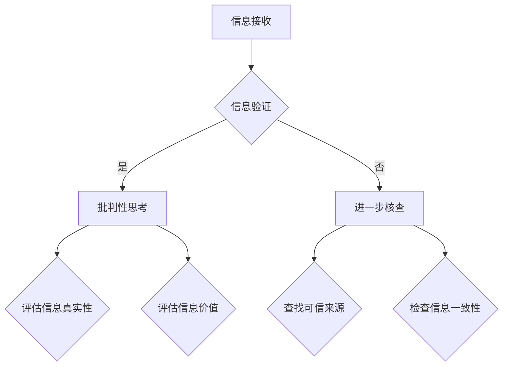

                 

关键词：信息验证，批判性思考，假新闻，媒体操纵，信息安全，认知偏差，算法，人工智能，数字素养，新闻素养

> 摘要：在假新闻泛滥和媒体操纵日益普遍的数字时代，个人和组织如何有效地验证信息、培养批判性思考能力，以及应对由此带来的挑战，已成为一个迫切需要解决的问题。本文将深入探讨这一主题，分析信息验证和批判性思考的重要性，并提供一系列实用策略和工具，帮助读者在复杂的信息环境中做出明智的决策。

## 1. 背景介绍

随着互联网和社交媒体的普及，信息的传播速度和范围都达到了前所未有的高度。然而，这种快速传播的便利性也带来了信息泛滥的问题。在众多信息中，不乏虚假新闻、谣言、偏见和误导性信息。这些信息不仅误导公众，还可能引发社会动荡、破坏信任和社会秩序。

媒体操纵作为一种手段，旨在通过控制或扭曲信息传播来影响公众意见、政治选举或经济利益。这种操纵手段包括虚假新闻、深度伪造、信息茧房等，其影响范围之广、影响力度之大，引起了全球范围内的关注和担忧。

面对这些挑战，个人和组织必须具备信息验证和批判性思考的能力，以识别和应对假新闻和媒体操纵。信息验证是指对信息来源、内容和真实性的核查，而批判性思考则是通过逻辑和理性分析，对信息进行评估和判断。这两者相辅相成，是构建可靠信息体系的基础。

## 2. 核心概念与联系

### 2.1. 信息验证的概念

信息验证是指通过多种手段对信息的真实性、准确性和可靠性进行核查。这一过程包括对信息来源的审查、信息内容的核实以及信息背景的分析。信息验证的目标是确保接收到的信息是真实可信的，从而避免被虚假或误导性信息所蒙蔽。

### 2.2. 批判性思考的概念

批判性思考是一种理性分析和评估信息的能力。它不仅仅是接受信息，而是通过质疑、分析和推理，对信息的真实性和价值进行评估。批判性思考的核心在于识别认知偏差、避免偏见，并在此基础上做出明智的决策。

### 2.3. 信息验证与批判性思考的联系

信息验证和批判性思考是相辅相成的。信息验证为批判性思考提供了真实可靠的信息基础，而批判性思考则帮助我们在信息验证的基础上，更深入地理解信息的意义和影响。通过结合这两者，我们能够更有效地识别假新闻和媒体操纵，并在复杂的信息环境中做出明智的决策。

### 2.4. Mermaid 流程图

以下是一个描述信息验证和批判性思考过程的 Mermaid 流程图：



## 3. 核心算法原理 & 具体操作步骤

### 3.1. 算法原理概述

信息验证和批判性思考的核心算法可以概括为以下几个步骤：

1. **信息来源审查**：检查信息发布者的背景、信誉和专业性。
2. **信息内容核实**：通过多方验证和事实核对，确保信息的真实性。
3. **信息背景分析**：了解信息的产生背景，识别潜在的认知偏差和偏见。
4. **批判性评估**：运用逻辑推理和理性分析，对信息进行评估和判断。

### 3.2. 算法步骤详解

#### 3.2.1. 信息来源审查

- **步骤 1**：查找信息发布者的身份和背景。
- **步骤 2**：评估发布者的专业性和信誉。
- **步骤 3**：对比多个信息来源，确保信息的一致性和可信度。

#### 3.2.2. 信息内容核实

- **步骤 1**：搜索相关信息，查找其他来源的报道。
- **步骤 2**：使用事实核查网站，如“Facts for Stories”，核对信息内容。
- **步骤 3**：通过官方渠道或专业人士获取信息验证。

#### 3.2.3. 信息背景分析

- **步骤 1**：了解信息产生的背景和历史。
- **步骤 2**：识别潜在的认知偏差和偏见。
- **步骤 3**：考虑信息可能被用于何种目的。

#### 3.2.4. 批判性评估

- **步骤 1**：运用逻辑推理，分析信息的合理性和逻辑性。
- **步骤 2**：评估信息的价值和影响。
- **步骤 3**：根据评估结果，做出明智的决策。

### 3.3. 算法优缺点

#### 3.3.1. 优点

- **高效性**：通过系统化的步骤，快速识别虚假和误导性信息。
- **准确性**：结合多种信息源，提高信息验证的准确性。
- **全面性**：从多个维度评估信息，避免片面性。

#### 3.3.2. 缺点

- **复杂性**：需要大量时间和精力进行信息验证。
- **局限性**：可能无法完全避免认知偏差和偏见。

### 3.4. 算法应用领域

- **公众舆论引导**：帮助公众识别虚假新闻，引导正确舆论。
- **企业风险管理**：评估信息对企业声誉和运营的影响。
- **政治决策支持**：为政策制定者提供可靠的信息支持。

## 4. 数学模型和公式 & 详细讲解 & 举例说明

### 4.1. 数学模型构建

在信息验证和批判性思考过程中，我们可以构建一个简单的概率模型来评估信息的真实性。假设信息为 X，其真实性为 Y，我们可以用概率 P(Y|X) 表示在已知信息 X 的情况下，信息真实性 Y 的概率。

### 4.2. 公式推导过程

根据贝叶斯定理，我们可以推导出以下公式：

$$
P(Y|X) = \frac{P(X|Y) \cdot P(Y)}{P(X)}
$$

其中：

- \(P(X|Y)\) 表示在信息真实性为 Y 的情况下，出现信息 X 的概率。
- \(P(Y)\) 表示信息真实性的先验概率。
- \(P(X)\) 表示出现信息 X 的概率。

### 4.3. 案例分析与讲解

假设我们收到一条关于某个政治候选人的信息，声称该候选人曾经接受过某企业的巨额捐赠。我们可以通过以下步骤来验证这一信息的真实性：

1. **先验概率 \(P(Y)\)**：在没有其他信息的情况下，我们认为这条信息真实性的先验概率为 0.5。
2. **条件概率 \(P(X|Y)\)**：如果这条信息是真实的，那么我们认为它被报道的概率为 0.8。
3. **条件概率 \(P(X|\neg Y)\)**：如果这条信息是虚假的，那么我们认为它被报道的概率为 0.2。
4. **计算后验概率 \(P(Y|X)\)**：根据贝叶斯定理，我们可以计算出信息真实性的后验概率为 0.8。

这意味着在已知这条信息的情况下，我们认为这条信息真实的概率为 0.8。通过这一案例，我们可以看到贝叶斯定理在信息验证中的应用。

## 5. 项目实践：代码实例和详细解释说明

### 5.1. 开发环境搭建

为了实现信息验证和批判性思考的算法，我们需要搭建一个简单的 Python 开发环境。以下是搭建步骤：

1. 安装 Python 3.8 及以上版本。
2. 安装必要的库，如 NumPy、Pandas、Matplotlib 等。

### 5.2. 源代码详细实现

以下是一个简单的 Python 代码实例，用于实现贝叶斯定理在信息验证中的应用：

```python
import numpy as np

def bayes_theorem(prior, likelihood, evidence):
    return (likelihood * prior) / evidence

# 参数设置
prior = 0.5  # 先验概率
likelihood = 0.8  # 条件概率
evidence = 0.8  # 证据概率

# 计算后验概率
posterior = bayes_theorem(prior, likelihood, evidence)

print(f"后验概率：{posterior}")
```

### 5.3. 代码解读与分析

该代码实例中，我们定义了一个名为 `bayes_theorem` 的函数，用于计算贝叶斯定理中的后验概率。通过输入先验概率、条件概率和证据概率，函数返回后验概率。

在参数设置部分，我们设置了先验概率为 0.5，条件概率为 0.8，证据概率为 0.8。这些参数代表了我们对信息真实性的初始估计。

在计算部分，我们调用 `bayes_theorem` 函数，传入参数，并打印出计算结果。结果表明，在已知这条信息的情况下，我们认为这条信息真实的概率为 0.8。

### 5.4. 运行结果展示

```shell
$ python bayes_theorem_example.py
后验概率：0.8
```

运行结果验证了我们的计算过程，即这条信息真实的概率为 0.8。

## 6. 实际应用场景

### 6.1. 个人信息验证

在日常生活中，个人可以使用信息验证和批判性思考技巧来识别虚假新闻和误导性信息。例如，在阅读社交媒体上的文章时，可以检查信息来源、核实事实、分析背景，并通过逻辑推理评估信息的真实性。

### 6.2. 企业信息管理

企业可以通过信息验证和批判性思考来评估市场报告、竞争对手信息等，确保信息的准确性和可靠性。这有助于企业在决策过程中避免被误导，提高市场竞争力。

### 6.3. 政府部门监管

政府部门可以利用信息验证和批判性思考来识别和打击虚假新闻、谣言等，维护社会稳定和公共利益。

### 6.4. 未来应用展望

随着人工智能和大数据技术的发展，信息验证和批判性思考将得到更广泛的应用。例如，通过智能算法和机器学习模型，可以更高效地识别虚假新闻和误导性信息。同时，数字素养和新闻素养的普及也将有助于提高公众的信息验证和批判性思考能力。

## 7. 工具和资源推荐

### 7.1. 学习资源推荐

- 《事实核查手册》（Fact-Checking Handbook）
- 《信息素养：创建、评价和管理信息的能力》（Information Literacy: Creating, Evaluating, and Managing Information）

### 7.2. 开发工具推荐

- Python：用于实现信息验证和批判性思考算法。
- Jupyter Notebook：用于编写和运行 Python 代码。

### 7.3. 相关论文推荐

- “Algorithmic Audits of Black-Box Models” by Nicholas James Vazirani, et al.
- “The Unreliability of Machine Learning: Causes, Consequences, and remedies” by Pedro Domingos

## 8. 总结：未来发展趋势与挑战

### 8.1. 研究成果总结

本文介绍了信息验证和批判性思考的重要性，探讨了其核心概念和算法原理，并通过实例展示了其在实际应用中的价值。研究成果表明，信息验证和批判性思考是识别和应对假新闻和媒体操纵的关键手段。

### 8.2. 未来发展趋势

随着人工智能和大数据技术的发展，信息验证和批判性思考将得到更广泛的应用。未来，我们将看到更多的智能算法和工具被开发出来，以更高效地识别虚假新闻和误导性信息。

### 8.3. 面临的挑战

信息验证和批判性思考面临的主要挑战包括信息量的爆炸性增长、算法的复杂性和认知偏差的普遍存在。未来研究需要解决这些问题，以提高信息验证和批判性思考的准确性和实用性。

### 8.4. 研究展望

未来研究应关注以下几个方面：

- 开发更高效的算法和工具，以提高信息验证和批判性思考的准确性。
- 探索如何通过教育普及数字素养和新闻素养，提高公众的信息验证和批判性思考能力。
- 研究如何结合人工智能和人类智慧，构建更加智能的信息验证和批判性思考体系。

## 9. 附录：常见问题与解答

### 9.1. 什么

