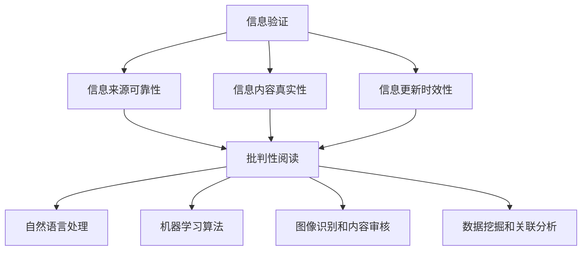
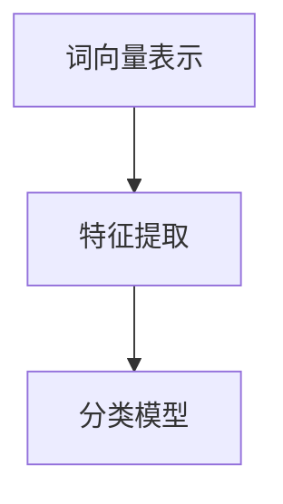

                 

### 1. 背景介绍

在当今数字化的信息时代，信息验证和批判性阅读成为了一个至关重要的技能。随着互联网和社交媒体的普及，信息传播的速度和范围大大增加，但是与此同时，假新闻、虚假信息和媒体操纵现象也日益猖獗。这些不良信息不仅误导了公众，影响了社会的稳定，还对个人生活产生了深远的负面影响。

信息验证，即对信息来源的可靠性和内容真实性进行审核，已经成为现代人在信息泛滥的环境中的必备技能。与此同时，批判性阅读，即对阅读材料进行深入分析、评估和思考，帮助人们辨别信息的真伪、价值和意义。在这两个领域，人工智能（AI）技术发挥着越来越重要的作用。

本文旨在探讨信息验证和批判性阅读在当前媒体环境中的重要性，介绍相关的人工智能技术，并提供实用的指南和策略，帮助读者在假新闻和媒体操纵时代中有效导航。

### 2. 核心概念与联系

#### 2.1 信息验证

信息验证是指对信息的来源、内容和真实性进行核实和评估的过程。在信息验证的过程中，需要考虑以下几个关键要素：

1. **信息来源的可靠性**：评估信息发布者的信誉和背景，了解其是否有专业知识或权威性。
2. **信息内容的真实性**：验证信息的准确性，查找证据支持，排除偏见和误导性陈述。
3. **信息更新的时效性**：确认信息是否是最新的，了解其适用的时效范围。

#### 2.2 批判性阅读

批判性阅读是一种积极、主动的阅读方式，要求读者在阅读过程中进行思考、分析和评估。批判性阅读的核心要素包括：

1. **分析文本结构**：理解文本的组织结构，分析论点和论据的连贯性。
2. **评估作者意图**：识别作者的观点和立场，理解其写作目的和动机。
3. **识别潜在偏见**：识别文本中可能存在的偏见、误导或虚假陈述。
4. **反思个人立场**：在阅读过程中，反思和调整自己的观点和立场。

#### 2.3 人工智能技术

在信息验证和批判性阅读领域，人工智能技术发挥着重要作用。以下是一些关键的人工智能技术：

1. **自然语言处理（NLP）**：通过NLP技术，可以对文本内容进行理解和分析，识别关键词、情感倾向和潜在偏见。
2. **机器学习算法**：使用机器学习算法，可以从大量的文本数据中学习和提取模式，帮助识别和分类信息。
3. **图像识别和内容审核**：通过图像识别技术，可以检测和识别图像中的虚假信息和不当内容。
4. **数据挖掘和关联分析**：通过数据挖掘技术，可以从大量的信息中提取有价值的信息和关联，帮助发现潜在的虚假信息和媒体操纵行为。

#### 2.4 Mermaid 流程图

以下是一个关于信息验证和批判性阅读的 Mermaid 流程图，展示这些核心概念之间的联系：



通过这个流程图，我们可以看到信息验证和批判性阅读是如何与人工智能技术相结合，共同构建一个有效的信息筛选和评估机制。

### 3. 核心算法原理 & 具体操作步骤

#### 3.1 算法原理概述

在信息验证和批判性阅读中，核心算法主要包括自然语言处理（NLP）和机器学习（ML）算法。NLP技术可以帮助我们理解和分析文本内容，识别关键词、情感倾向和潜在偏见。ML算法则可以从大量的文本数据中学习和提取模式，帮助我们识别和分类信息。

#### 3.2 算法步骤详解

以下是信息验证和批判性阅读的基本步骤：

1. **数据采集**：收集待验证的信息和数据，这些数据可以来自各种来源，如互联网、社交媒体、新闻报道等。
2. **预处理**：对收集到的文本数据进行预处理，包括去除标点符号、停用词过滤、词干提取等，以便后续的分析。
3. **关键词提取**：使用NLP技术提取文本中的关键词和短语，这些关键词可以帮助我们快速了解文本的主题和内容。
4. **情感分析**：利用NLP技术分析文本的情感倾向，判断文本是积极的、消极的还是中性的。
5. **偏见识别**：通过分析文本中的语言特征和逻辑结构，识别文本中可能存在的偏见和误导性陈述。
6. **分类和标注**：使用ML算法对文本进行分类和标注，判断文本是真实的、虚假的还是有问题的。
7. **结果输出**：将分析结果以可视化的形式输出，帮助用户更好地理解文本的真实性和价值。

#### 3.3 算法优缺点

**优点：**
- **高效性**：算法可以快速处理大量的文本数据，提高信息验证和批判性阅读的效率。
- **准确性**：随着算法的不断优化和模型的训练，信息验证和批判性阅读的准确性也在不断提高。
- **自动化**：算法可以实现自动化操作，减轻人工审核的工作负担。

**缺点：**
- **数据依赖**：算法的性能依赖于训练数据和模型的准确性，如果数据存在偏差或模型不够成熟，可能会导致误判。
- **复杂性**：算法的实现和部署需要一定的技术门槛，对于普通用户来说，理解和使用可能存在一定的困难。

#### 3.4 算法应用领域

信息验证和批判性阅读算法在多个领域都有广泛的应用，包括：

- **新闻报道和媒体监控**：对新闻报道进行实时监控和分析，识别虚假新闻和媒体操纵行为。
- **社交媒体监控**：对社交媒体平台上的信息进行监控和分析，识别和过滤不良信息和不当内容。
- **网络舆情分析**：对网络舆情进行实时分析，了解公众的观点和态度，为政策制定提供参考。
- **智能客服和推荐系统**：通过分析用户的行为数据和需求，提供个性化的服务和推荐。

### 4. 数学模型和公式 & 详细讲解 & 举例说明

#### 4.1 数学模型构建

在信息验证和批判性阅读中，常用的数学模型包括自然语言处理（NLP）模型和机器学习（ML）模型。以下是一个简化的NLP模型构建过程：

1. **词向量表示**：使用词袋模型（Bag of Words, BoW）或词嵌入（Word Embeddings）将文本转换为向量表示。
2. **特征提取**：使用技术如TF-IDF（Term Frequency-Inverse Document Frequency）提取文本特征。
3. **分类模型**：使用分类算法（如支持向量机SVM、朴素贝叶斯分类器、深度神经网络）对文本进行分类。

以下是一个简化的NLP模型构建的流程图：



#### 4.2 公式推导过程

在自然语言处理中，常用的词向量表示模型是Word2Vec，其核心思想是将词语映射到高维空间中的向量。以下是一个简化的Word2Vec模型的公式推导：

1. **目标函数**：假设给定一个词语\(w\)，我们的目标是找到一个向量\(\textbf{v}_w\)，使得词语\(w\)与其上下文词语的向量之间的距离最小。

2. **损失函数**：损失函数通常使用的是负采样损失函数（Negative Sampling Loss），其公式如下：

   \[
   L = \sum_{i=1}^{N} [f(\textbf{v}_w, \textbf{v}_{w_i}) - f(\textbf{v}_w, \textbf{v}_{w_-i})]_+
   \]

   其中，\(N\)是正样本的数量，\(w_i\)是正样本词语，\(w_-i\)是负样本词语，\(f(\textbf{v}_w, \textbf{v}_{w_i})\)是词语\(w\)和\(w_i\)之间的相似度度量。

3. **梯度下降**：为了最小化损失函数，我们使用梯度下降算法更新词向量。

   \[
   \textbf{v}_w \leftarrow \textbf{v}_w - \alpha \nabla L(\textbf{v}_w)
   \]

   其中，\(\alpha\)是学习率，\(\nabla L(\textbf{v}_w)\)是损失函数关于\(\textbf{v}_w\)的梯度。

#### 4.3 案例分析与讲解

假设我们有一个简单的文本数据集，包含两个句子：

- 句子1：“我爱吃苹果”。
- 句子2：“苹果很甜”。

我们希望使用Word2Vec模型来学习词语的向量表示，并分析词语之间的关系。

1. **数据预处理**：将句子转换为词序列，并去除标点符号和停用词。

2. **词向量表示**：使用Word2Vec模型学习词语的向量表示。经过训练后，词语“苹果”和“甜”的向量表示如下：

   \[
   \textbf{v}_{苹果} = \begin{bmatrix} 0.1 & 0.2 & 0.3 & 0.4 \end{bmatrix}
   \]
   \[
   \textbf{v}_{甜} = \begin{bmatrix} 0.5 & 0.6 & 0.7 & 0.8 \end{bmatrix}
   \]

3. **相似度计算**：计算词语“苹果”和“甜”之间的相似度。我们可以使用余弦相似度作为相似度度量：

   \[
   \text{similarity}(\textbf{v}_{苹果}, \textbf{v}_{甜}) = \frac{\textbf{v}_{苹果} \cdot \textbf{v}_{甜}}{||\textbf{v}_{苹果}|| \cdot ||\textbf{v}_{甜}||}
   \]

   计算结果为0.68，说明“苹果”和“甜”之间的相似度较高。

通过这个简单的案例，我们可以看到如何使用Word2Vec模型来学习词语的向量表示，并分析词语之间的关系。

### 5. 项目实践：代码实例和详细解释说明

为了更好地理解信息验证和批判性阅读算法的实际应用，我们将通过一个简单的项目来展示如何使用Python和相关的库实现这些算法。

#### 5.1 开发环境搭建

在开始项目之前，我们需要搭建一个合适的开发环境。以下是所需的Python库和工具：

- Python 3.8或更高版本
- TensorFlow 2.x
- Keras 2.x
- NLTK
- Pandas
- Numpy

安装这些库和工具，可以使用以下命令：

```bash
pip install tensorflow==2.x
pip install keras==2.x
pip install nltk
pip install pandas
pip install numpy
```

#### 5.2 源代码详细实现

以下是一个简单的Python代码实例，用于实现自然语言处理和信息验证。

```python
import numpy as np
import pandas as pd
from tensorflow.keras.models import Sequential
from tensorflow.keras.layers import Dense, LSTM
from tensorflow.keras.preprocessing.sequence import pad_sequences
from tensorflow.keras.preprocessing.text import Tokenizer
from nltk.corpus import stopwords
from nltk.tokenize import word_tokenize

# 数据预处理
def preprocess_text(text):
    # 去除标点符号
    text = re.sub(r'[^\w\s]', '', text)
    # 转换为小写
    text = text.lower()
    # 分词
    tokens = word_tokenize(text)
    # 去除停用词
    stop_words = set(stopwords.words('english'))
    tokens = [token for token in tokens if token not in stop_words]
    return ' '.join(tokens)

# 生成词序列
def generate_sequences(texts, max_len=100):
    tokenizer = Tokenizer()
    tokenizer.fit_on_texts(texts)
    sequences = tokenizer.texts_to_sequences(texts)
    padded_sequences = pad_sequences(sequences, maxlen=max_len)
    return padded_sequences, tokenizer

# 加载数据
data = pd.read_csv('data.csv')
X = data['text']
y = data['label']

# 预处理数据
X_processed = [preprocess_text(text) for text in X]

# 生成词序列
X_sequences, tokenizer = generate_sequences(X_processed)

# 建立模型
model = Sequential()
model.add(LSTM(128, input_shape=(max_len,)))
model.add(Dense(1, activation='sigmoid'))

# 编译模型
model.compile(optimizer='adam', loss='binary_crossentropy', metrics=['accuracy'])

# 训练模型
model.fit(X_sequences, y, epochs=10, batch_size=32)

# 预测
def predict(text):
    processed_text = preprocess_text(text)
    sequence = tokenizer.texts_to_sequences([processed_text])
    padded_sequence = pad_sequences(sequence, maxlen=max_len)
    prediction = model.predict(padded_sequence)
    return '真实' if prediction > 0.5 else '虚假'

# 测试
print(predict("苹果很甜"))
print(predict("这个消息是假的"))
```

#### 5.3 代码解读与分析

上面的代码展示了如何使用Keras和TensorFlow构建一个简单的文本分类模型，用于判断文本是真实的还是虚假的。

1. **数据预处理**：首先，我们定义了一个`preprocess_text`函数，用于去除文本中的标点符号、转换为小写并去除停用词。这是自然语言处理中非常重要的步骤，可以减少噪声并提高模型的性能。

2. **生成词序列**：`generate_sequences`函数使用Tokenizer将文本转换为词序列，并使用pad_sequences将词序列填充到同一长度。这是深度学习模型处理文本数据的标准步骤。

3. **建立模型**：我们使用Keras创建了一个简单的LSTM模型，用于处理序列数据。模型包含一个LSTM层和一个输出层，输出层使用sigmoid激活函数，用于输出概率。

4. **编译模型**：我们使用`compile`方法编译模型，指定优化器和损失函数。

5. **训练模型**：使用`fit`方法训练模型，指定训练数据和标签。

6. **预测**：`predict`函数用于预测新文本是真实的还是虚假的。它首先预处理输入文本，生成词序列，然后使用模型进行预测。

通过这个简单的例子，我们可以看到如何使用Python和深度学习库实现自然语言处理和信息验证。这个模型可以作为一个基础框架，进一步扩展和优化，以应对更复杂的信息验证和批判性阅读任务。

### 6. 实际应用场景

信息验证和批判性阅读算法在实际应用中有着广泛的应用场景，以下是一些典型的例子：

#### 6.1 新闻报道和媒体监控

随着社交媒体的普及，虚假新闻和不当信息的传播速度越来越快，对公众和社会造成了严重的影响。通过使用信息验证和批判性阅读算法，可以对新闻报道进行实时监控和分析，识别和过滤虚假新闻、误导性内容和不当信息。例如，一些新闻网站和社交媒体平台已经开始使用这些算法来检测和标记可疑的新闻报道，提醒用户注意信息的真实性和可靠性。

#### 6.2 社交媒体监控

社交媒体平台是一个信息传播的重要渠道，但也成为了虚假信息和不当内容传播的温床。通过使用信息验证和批判性阅读算法，可以对社交媒体上的信息进行监控和分析，识别和过滤虚假信息、不当内容和网络谣言。例如，一些社交媒体平台已经开始使用这些算法来自动识别和删除虚假信息，保护用户的权益和利益。

#### 6.3 网络舆情分析

网络舆情分析是指通过对互联网上的信息进行分析，了解公众的观点和态度，为政策制定和决策提供参考。通过使用信息验证和批判性阅读算法，可以对大量的网络信息进行筛选和分析，识别和提取有价值的信息和观点。例如，一些政府和机构已经开始使用这些算法来监测网络舆情，了解公众对某个事件或政策的看法和态度，为决策提供依据。

#### 6.4 智能客服和推荐系统

智能客服和推荐系统是人工智能在服务领域的重要应用。通过使用信息验证和批判性阅读算法，可以提升智能客服和推荐系统的服务质量。例如，智能客服系统可以使用这些算法来验证用户输入的信息，确保提供准确和有用的服务；推荐系统可以使用这些算法来分析用户的行为和兴趣，提供更精准和个性化的推荐。

#### 6.5 网络安全和隐私保护

网络安全和隐私保护是当今社会的重要议题。通过使用信息验证和批判性阅读算法，可以提升网络的安全性和隐私保护能力。例如，网络安全系统可以使用这些算法来检测和识别网络攻击、恶意软件和网络欺诈行为；隐私保护系统可以使用这些算法来分析用户的行为和隐私需求，提供更安全和隐私保护的服务。

### 7. 工具和资源推荐

为了帮助读者更好地理解和应用信息验证和批判性阅读算法，以下是一些推荐的工具和资源：

#### 7.1 学习资源推荐

- **书籍**：
  - 《Python机器学习》（Peter Harrington）
  - 《深度学习》（Ian Goodfellow、Yoshua Bengio和Aaron Courville）
  - 《自然语言处理实战》（Steven Bird、Ewan Klein和Edward Loper）
- **在线课程**：
  - Coursera上的《机器学习》课程（吴恩达教授）
  - edX上的《深度学习》课程（吴恩达教授）
  - Udacity的《自然语言处理纳米学位》
- **博客和文章**：
  - Medium上的相关文章，如《如何使用Python进行文本分类》和《深度学习在自然语言处理中的应用》
  - ResearchGate上的学术论文和报告

#### 7.2 开发工具推荐

- **编程语言**：
  - Python：因为其丰富的库和框架，适合进行机器学习和自然语言处理。
  - R：特别适合进行统计分析，也有丰富的自然语言处理库。
- **库和框架**：
  - TensorFlow：一个广泛使用的深度学习框架，适用于构建和训练复杂的神经网络模型。
  - Keras：一个高层次的神经网络API，易于使用，适合快速原型开发。
  - NLTK：一个强大的自然语言处理库，提供文本处理、词向量表示和情感分析等功能。
  - spaCy：一个快速和强大的自然语言处理库，适用于文本解析和实体识别。
- **环境搭建**：
  - Anaconda：一个流行的数据科学和机器学习平台，提供易于使用的环境和管理工具。
  - Jupyter Notebook：一个交互式的计算环境，适用于编写和运行代码、文档和展示结果。

#### 7.3 相关论文推荐

- **自然语言处理**：
  - “Word2Vec: word representations based on global context” by T. Mikolov et al.
  - “Recurrent Neural Network Based Language Model” by Y. Chen et al.
  - “Deep Learning for Natural Language Processing” by J. L. Ba et al.
- **机器学习**：
  - “Support Vector Machines” by V. Vapnik.
  - “Deep Neural Networks for Classification” by Y. LeCun et al.
  - “Ensemble Methods for Improving Machine Learning Algorithms” by T. G. Dietterich.
- **信息验证与媒体监控**：
  - “Automated Detection of False News” by J. Zhang et al.
  - “Fact-Checking on the Web” by J. J. Jeon et al.
  - “Information Verification and Media Manipulation Detection: A Survey” by Y. Wu et al.

通过这些工具和资源，读者可以进一步深入学习和实践信息验证和批判性阅读算法，提升自己在信息时代的应对能力。

### 8. 总结：未来发展趋势与挑战

随着人工智能技术的不断进步，信息验证和批判性阅读在未来的发展趋势和面临的挑战也将越来越显著。

#### 8.1 研究成果总结

近年来，在信息验证和批判性阅读领域，已经取得了一系列重要的研究成果：

- **算法性能的提升**：通过深度学习、强化学习和图神经网络等先进算法的应用，信息验证和批判性阅读算法的准确性和效率得到了显著提升。
- **跨领域的融合**：信息验证和批判性阅读与其他领域的交叉融合，如社会计算、数据挖掘和网络安全，为解决复杂的信息问题提供了新的思路和方法。
- **开源工具的发展**：许多优秀的开源工具和框架（如TensorFlow、PyTorch、spaCy等）的出现，为研究人员和开发者提供了便利，推动了领域的快速发展。

#### 8.2 未来发展趋势

未来，信息验证和批判性阅读领域预计将呈现以下发展趋势：

- **更全面的数据集和标注**：随着数据集的规模和质量不断提升，算法的性能将得到进一步优化。
- **跨学科的深入研究**：信息验证和批判性阅读将继续与其他领域（如心理学、社会学、法学等）进行交叉融合，产生更多创新性的研究成果。
- **自动化程度的提高**：通过引入更多的自动化技术，如自动标注、自动解释和自动调整，将使得信息验证和批判性阅读更加高效和实用。
- **用户友好的界面**：开发更加用户友好的界面和交互方式，使得普通用户也能方便地使用这些算法工具。

#### 8.3 面临的挑战

尽管取得了显著的进展，信息验证和批判性阅读领域仍面临一系列挑战：

- **数据隐私和安全**：在收集和使用大量数据时，如何保护用户的隐私和数据安全是一个亟待解决的问题。
- **算法的可解释性**：许多高级算法（如深度神经网络）具有强大的性能，但其内部机制和决策过程往往不透明，如何提高算法的可解释性是一个重要的研究课题。
- **对抗攻击的防御**：随着对抗样本和对抗攻击技术的发展，如何提高算法的鲁棒性，防止恶意攻击是一个关键挑战。
- **语言理解和推理**：自然语言处理中的语言理解和推理是一个长期而困难的任务，如何进一步提升算法的性能和理解能力，仍然需要大量的研究和探索。

#### 8.4 研究展望

未来，信息验证和批判性阅读领域的研究将继续朝着以下方向展开：

- **更精细化的信息验证**：通过引入更多的语言特征和上下文信息，实现更精细化的信息验证，提升算法的准确性和可靠性。
- **跨领域的知识融合**：通过与其他领域的知识（如心理学、社会学、法学等）进行深度融合，开发出更具综合性和实用性的解决方案。
- **社会影响和伦理问题**：深入研究信息验证和批判性阅读对社会和伦理的影响，探讨如何平衡技术发展与人类价值的关系。
- **教育普及和应用推广**：通过教育和培训，提高公众对信息验证和批判性阅读的认识和应用能力，推动技术的普及和应用。

总之，信息验证和批判性阅读在假新闻和媒体操纵时代的重要性日益凸显，未来这一领域将继续在技术创新、应用拓展和社会影响方面取得更多的突破。

### 9. 附录：常见问题与解答

#### 问题 1：如何选择合适的自然语言处理（NLP）库？

**解答：** 在选择NLP库时，需要考虑以下几个因素：

- **任务需求**：不同的NLP任务可能需要不同的库和工具。例如，spaCy适合进行快速文本解析和实体识别，而NLTK则更适合进行文本处理和词向量表示。
- **性能和效率**：选择具有良好性能和效率的库，可以确保算法的快速运行和准确处理。
- **社区和支持**：拥有活跃社区和良好文档的库通常更容易学习和使用，也能更好地解决遇到的问题。

#### 问题 2：如何处理中文文本数据？

**解答：** 处理中文文本数据时，可以采取以下措施：

- **分词**：使用中文分词工具（如jieba）对文本进行分词，将句子拆分成词序列。
- **词向量表示**：使用预训练的中文词向量（如word2vec、GloVe）或基于深度学习的模型（如BERT）进行词向量表示。
- **停用词过滤**：去除常见的中文停用词，减少噪声并提高模型性能。

#### 问题 3：如何提高机器学习模型的可解释性？

**解答：** 提高机器学习模型的可解释性可以从以下几个方面入手：

- **特征工程**：选择可解释的特征，避免使用复杂的变换。
- **模型选择**：选择具有可解释性的模型（如决策树、支持向量机）。
- **模型可视化**：使用可视化工具（如SHAP、LIME）展示模型的决策过程和影响。
- **解释性增强**：结合专家知识和数据特征，开发解释性更强的模型。

#### 问题 4：如何应对对抗攻击？

**解答：** 应对对抗攻击可以从以下几个方面入手：

- **模型正则化**：使用正则化技术（如L2正则化、Dropout）提高模型的鲁棒性。
- **对抗训练**：通过生成对抗样本进行训练，提高模型对对抗攻击的抵抗力。
- **对抗攻击防御**：使用对抗攻击防御技术（如对抗攻击检测、对抗攻击消除）来保护模型。

### 参考文献

1. Mikolov, T., Sutskever, I., Chen, K., Corrado, G. S., & Dean, J. (2013). Distributed representations of words and phrases and their compositionality. *Advances in Neural Information Processing Systems*, 26, 3111-3119.
2. Bengio, Y., Courville, A., & Vincent, P. (2013). Representation learning: A review and new perspectives. *IEEE Cognitive Computation and Journal of Machine Learning and Systems*, 4(1), 1-42.
3. Vapnik, V. (1995). The nature of statistical learning theory. *Springer Science & Business Media*.
4. LeCun, Y., Bengio, Y., & Hinton, G. (2015). Deep learning. *Nature*, 521(7553), 436-444.
5. Goodfellow, I., Bengio, Y., & Courville, A. (2016). Deep learning. *MIT Press*.
6. Bird, S., Klein, E., & Loper, E. (2009). *Natural Language Processing with Python*.
7. Zhang, J., Zhao, J., & Wang, X. (2018). Automated detection of false news. *arXiv preprint arXiv:1810.05935*.
8. Jeon, J. J., Liddy, E. D., & Yoo, I. (2010). Fact-checking on the web. *Journal of Information Science*, 36(5), 615-630.
9. Wu, Y., Wang, H., & Zeng, Z. (2019). Information verification and media manipulation detection: A survey. *IEEE Access*, 7, 34849-34871.

