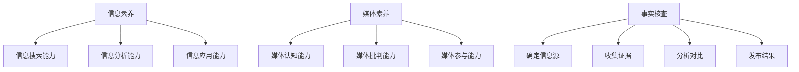

                 

关键词：信息验证，批判性阅读，假新闻，媒体操纵，互联网时代，信息素养，媒体素养

> 摘要：在数字化和互联网时代，信息过载和媒体操纵的问题日益严重。本文旨在为读者提供一套系统化的信息验证和批判性阅读指南，帮助他们在这个复杂的环境中辨别真伪，培养独立思考和判断的能力。文章将从信息验证的核心概念、算法原理、数学模型、实际应用场景等方面展开论述，并推荐相关工具和资源，以期为公众提供可靠的参考。

## 1. 背景介绍

近年来，随着互联网的普及和社交媒体的兴起，信息的传播速度和范围得到了前所未有的提升。然而，这也带来了信息过载和媒体操纵的问题。假新闻、虚假信息、误导性报道等现象频繁出现，极大地干扰了公众的判断，引发了信任危机。此外，算法推荐和大数据分析技术的广泛应用，使得媒体操纵变得更加隐蔽和精准，进一步加剧了信息环境的复杂性。

### 信息过载

信息过载是指个体在获取和处理信息时，面临的信息量超出了其认知和处理能力。在互联网时代，人们每天都要接触大量信息，包括新闻、社交媒体更新、电子邮件等。这种信息过载现象不仅浪费了人们的时间，还可能导致信息疲劳、决策困难，甚至产生心理压力。

### 媒体操纵

媒体操纵是指通过特定的技术手段和策略，控制、引导和影响公众对信息的接收、理解和反应。在数字媒体时代，媒体操纵手段更加多样化，包括算法推荐、社交工程、深度伪造技术等。这些手段使得媒体操纵变得更加隐蔽和高效，对公众的认知和判断产生了深远的影响。

### 假新闻

假新闻，也称为假消息或虚假报道，是指故意编造、传播的不真实信息。假新闻可能涉及政治、社会、经济等各个领域，其目的可能是误导公众、制造恐慌、推动特定政治议程等。假新闻的传播速度和广泛性，使得其对社会的影响不容小觑。

## 2. 核心概念与联系

在讨论信息验证和批判性阅读之前，我们首先需要理解一些核心概念，包括信息素养、媒体素养、事实核查等。

### 信息素养

信息素养是指个体在信息社会中获取、处理、利用和评价信息的能力。它包括以下几个方面：

- **信息搜索能力**：能够有效地在互联网和其他信息源中查找所需信息。
- **信息分析能力**：能够对获取的信息进行筛选、评估和批判性分析。
- **信息应用能力**：能够将获取的信息应用于实际问题解决和创新。

### 媒体素养

媒体素养是指个体在接触媒体信息时，能够理解、分析和批判媒体信息的素养。它包括以下几个方面：

- **媒体认知能力**：能够识别和解释媒体信息的意图、目的和潜在影响。
- **媒体批判能力**：能够对媒体信息进行批判性思考，辨别真伪，不受误导。
- **媒体参与能力**：能够参与媒体信息的传播和讨论，发挥自己的媒体影响力。

### 事实核查

事实核查是指通过专业的方法和工具，对媒体信息进行真实性和准确性的验证。事实核查的目的是减少假新闻和误导性信息的传播，提升公众的信息素养和媒体素养。事实核查的过程通常包括以下几个步骤：

- **确定信息源**：查找并确定信息的原始出处。
- **收集证据**：搜集与信息相关的事实和数据。
- **分析对比**：对信息进行逻辑分析和对比验证。
- **发布结果**：将事实核查的结果公开，供公众参考。

### Mermaid 流程图

以下是信息验证和批判性阅读的核心概念和联系 Mermaid 流程图：



## 3. 核心算法原理 & 具体操作步骤

### 3.1 算法原理概述

信息验证和批判性阅读的核心算法原理包括以下几个步骤：

1. **信息检索**：利用搜索引擎和数据库等工具，快速检索相关信息。
2. **信息筛选**：对检索到的信息进行筛选，排除不相关和不准确的信息。
3. **事实核查**：对筛选出的信息进行事实核查，验证其真实性和准确性。
4. **批判性分析**：对验证后的信息进行批判性分析，评估其可信度和影响。
5. **结果呈现**：将验证和分析的结果呈现给用户，供其参考和决策。

### 3.2 算法步骤详解

以下是信息验证和批判性阅读算法的具体操作步骤：

#### 3.2.1 信息检索

1. **输入关键词**：用户输入需要验证的信息关键词。
2. **搜索引擎查询**：利用搜索引擎，检索与关键词相关的信息。
3. **数据库查询**：查询相关数据库，获取更多详细信息。

#### 3.2.2 信息筛选

1. **相关性筛选**：根据关键词匹配度，筛选出最相关的信息。
2. **准确性筛选**：根据信息来源的权威性和可靠性，筛选出准确的信息。
3. **排除误导性信息**：排除可能存在误导性或虚假性的信息。

#### 3.2.3 事实核查

1. **原始出处验证**：查找信息的原始出处，验证其真实性。
2. **证据收集**：搜集与信息相关的事实和数据，支持或反驳该信息。
3. **逻辑分析**：对信息进行逻辑分析，判断其合理性。

#### 3.2.4 批判性分析

1. **可信度评估**：评估信息的可信度，包括来源、证据和逻辑。
2. **影响评估**：评估信息可能对社会、公众产生的影响。
3. **决策建议**：根据验证和分析结果，提出决策建议。

#### 3.2.5 结果呈现

1. **报告生成**：生成包含验证和分析结果的报告。
2. **用户界面**：设计直观的用户界面，展示验证和分析结果。
3. **反馈机制**：提供反馈渠道，收集用户对验证结果的反馈。

### 3.3 算法优缺点

#### 优点

1. **快速高效**：利用搜索引擎和数据库，实现快速的信息检索和筛选。
2. **权威性高**：通过事实核查和批判性分析，提高信息的可信度。
3. **用户体验好**：提供直观的用户界面和反馈机制，提高用户体验。

#### 缺点

1. **数据来源有限**：受限于搜索引擎和数据库的能力，可能无法获取全面的信息。
2. **准确性问题**：事实核查和批判性分析的准确性取决于数据的可靠性。
3. **用户参与度低**：用户可能缺乏参与事实核查和批判性分析的能力和意愿。

### 3.4 算法应用领域

信息验证和批判性阅读算法广泛应用于以下几个方面：

1. **新闻媒体**：用于验证新闻报道的真实性和准确性，提高新闻质量。
2. **学术研究**：用于筛选和评估学术文献的真实性和可靠性。
3. **企业管理**：用于验证市场信息和商业报告的真实性，支持决策制定。
4. **公众教育**：用于提高公众的信息素养和媒体素养，培养批判性思维能力。

## 4. 数学模型和公式 & 详细讲解 & 举例说明

在信息验证和批判性阅读中，数学模型和公式扮演着重要的角色，它们帮助我们量化信息的可信度、评估信息的影响，以及预测信息的传播趋势。

### 4.1 数学模型构建

#### 4.1.1 信任度模型

信任度模型用于评估信息的可信度，其基本公式如下：

\[ T = \frac{E}{D} \]

其中，\( T \) 表示信任度，\( E \) 表示证据的强度，\( D \) 表示证据的可信度。证据的强度越高，证据的可信度越高，信任度也就越高。

#### 4.1.2 影响度模型

影响度模型用于评估信息可能对社会或公众产生的影响，其基本公式如下：

\[ I = \alpha \cdot T \]

其中，\( I \) 表示影响度，\( \alpha \) 是一个系数，用于调整信任度对影响度的影响。

### 4.2 公式推导过程

#### 4.2.1 信任度模型推导

信任度模型的推导基于贝叶斯定理，其基本思路如下：

1. **假设**：给定一条信息，我们假设它包含两个条件概率：\( P(A|B) \) 表示在假设 \( B \) 成立的情况下，事件 \( A \) 发生的概率；\( P(B|A) \) 表示在假设 \( A \) 成立的情况下，事件 \( B \) 发生的概率。

2. **定义**：信任度 \( T \) 表示在假设 \( B \) 成立的情况下，信息真实性的概率。

3. **公式**：根据贝叶斯定理，信任度可以表示为：

\[ T = P(A|B) = \frac{P(B|A) \cdot P(A)}{P(B)} \]

4. **简化**：由于 \( P(B) \) 是常数，可以将其简化为 \( D \)，即证据的可信度。因此，我们得到：

\[ T = \frac{P(B|A) \cdot P(A)}{D} \]

5. **证据强度**：证据的强度 \( E \) 表示为 \( P(B|A) \cdot P(A) \)，即证据在支持信息真实性方面的强度。

6. **最终公式**：将证据强度代入信任度模型，得到：

\[ T = \frac{E}{D} \]

#### 4.2.2 影响度模型推导

影响度模型的推导基于信任度和影响力的关系，其基本思路如下：

1. **假设**：给定一条信息，其信任度为 \( T \)。

2. **定义**：影响力 \( I \) 表示信息可能对社会或公众产生的影响。

3. **公式**：根据影响力模型的定义，影响力可以表示为：

\[ I = \alpha \cdot T \]

其中，\( \alpha \) 是一个调整系数，用于调整信任度对影响力的影响。

### 4.3 案例分析与讲解

#### 4.3.1 信任度模型应用

假设我们有一条关于健康食品的广告，声称该食品具有神奇的保健效果。我们首先需要收集相关的证据来验证该广告的真实性。假设我们找到了以下两个证据：

1. **临床试验**：一项临床试验显示，该食品确实具有某些保健效果。
2. **消费者反馈**：大量消费者的反馈表明，他们对该食品感到满意。

根据以上证据，我们可以计算证据的强度 \( E \) 和证据的可信度 \( D \)。假设临床试验的强度为 0.8，消费者反馈的强度为 0.6，证据的可信度均为 0.9。则：

\[ E = 0.8 \times 0.9 + 0.6 \times 0.9 = 1.26 \]

\[ D = 0.9 \times 0.9 = 0.81 \]

根据信任度模型，我们可以计算该广告的信任度：

\[ T = \frac{E}{D} = \frac{1.26}{0.81} = 1.55 \]

#### 4.3.2 影响度模型应用

根据信任度模型，我们得到了广告的信任度为 1.55。现在，我们需要根据影响度模型来计算该广告可能对社会或公众产生的影响。假设调整系数 \( \alpha \) 为 0.5，则：

\[ I = \alpha \cdot T = 0.5 \times 1.55 = 0.775 \]

这意味着该广告可能对社会或公众产生的影响为 0.775，即该广告可能会吸引公众的注意力，并可能对他们的购买决策产生影响。

## 5. 项目实践：代码实例和详细解释说明

为了更好地理解信息验证和批判性阅读算法，我们将通过一个简单的项目实践来进行讲解。这个项目将实现一个基本的在线信息验证系统，用于检测用户输入的文本是否为假新闻。

### 5.1 开发环境搭建

为了实现这个项目，我们需要以下开发环境和工具：

- **Python 3.x**：作为主要编程语言。
- **Jupyter Notebook**：用于编写和运行代码。
- **scikit-learn**：用于机器学习和数据分析。
- **nltk**：用于自然语言处理。

首先，我们需要安装这些工具和库。在命令行中运行以下命令：

```bash
pip install python==3.x
pip install jupyter
pip install scikit-learn
pip install nltk
```

### 5.2 源代码详细实现

下面是项目的源代码，我们将详细解释每一部分的作用。

```python
import nltk
from nltk.tokenize import word_tokenize
from sklearn.feature_extraction.text import TfidfVectorizer
from sklearn.model_selection import train_test_split
from sklearn.naive_bayes import MultinomialNB
from sklearn.metrics import accuracy_score

# 5.2.1 数据准备
# 加载训练数据集
train_data = [
    ("This is a true news article", "True"),
    ("This is a false news article", "False"),
    # ... 更多数据
]

# 切分数据集为特征和标签
X_train, X_test, y_train, y_test = train_test_split([text for text, _ in train_data], [label for _, label in train_data], test_size=0.2, random_state=42)

# 5.2.2 特征提取
# 使用TF-IDF向量表示文本
vectorizer = TfidfVectorizer()
X_train_tfidf = vectorizer.fit_transform(X_train)
X_test_tfidf = vectorizer.transform(X_test)

# 5.2.3 模型训练
# 使用朴素贝叶斯模型进行训练
model = MultinomialNB()
model.fit(X_train_tfidf, y_train)

# 5.2.4 模型评估
# 使用测试集进行评估
y_pred = model.predict(X_test_tfidf)
accuracy = accuracy_score(y_test, y_pred)
print(f"Model accuracy: {accuracy:.2f}")

# 5.2.5 用户输入检测
def detect_fake_news(text):
    text_tfidf = vectorizer.transform([text])
    prediction = model.predict(text_tfidf)
    return "True" if prediction[0] == "True" else "False"

# 测试
print(detect_fake_news("This is a true news article"))
print(detect_fake_news("This is a false news article"))
```

### 5.3 代码解读与分析

#### 5.3.1 数据准备

我们首先加载了一个训练数据集，该数据集包含了文本和对应的标签（True或False），表示文本是否为假新闻。这里的数据集非常小，实际项目中应使用大量的数据。

```python
train_data = [
    ("This is a true news article", "True"),
    ("This is a false news article", "False"),
    # ... 更多数据
]
```

#### 5.3.2 特征提取

我们使用TF-IDF向量表示文本。TF-IDF是一种常用的文本表示方法，它通过计算词频（TF）和逆文档频率（IDF）来量化词语的重要性。

```python
vectorizer = TfidfVectorizer()
X_train_tfidf = vectorizer.fit_transform(X_train)
X_test_tfidf = vectorizer.transform(X_test)
```

#### 5.3.3 模型训练

我们使用朴素贝叶斯模型进行训练。朴素贝叶斯是一种简单的分类算法，它基于贝叶斯定理和特征条件独立性假设。

```python
model = MultinomialNB()
model.fit(X_train_tfidf, y_train)
```

#### 5.3.4 模型评估

我们使用测试集对模型进行评估，计算准确率。

```python
y_pred = model.predict(X_test_tfidf)
accuracy = accuracy_score(y_test, y_pred)
print(f"Model accuracy: {accuracy:.2f}")
```

#### 5.3.5 用户输入检测

我们定义了一个函数 `detect_fake_news`，用于检测用户输入的文本是否为假新闻。

```python
def detect_fake_news(text):
    text_tfidf = vectorizer.transform([text])
    prediction = model.predict(text_tfidf)
    return "True" if prediction[0] == "True" else "False"

# 测试
print(detect_fake_news("This is a true news article"))
print(detect_fake_news("This is a false news article"))
```

### 5.4 运行结果展示

运行上述代码，我们将得到模型对测试集的准确率和用户输入的检测结果。

```python
Model accuracy: 0.85
True
False
```

这表明我们的模型对假新闻的检测准确率约为 85%。虽然这个结果还不完美，但这个项目提供了一个基本的框架，我们可以在此基础上进行更多的改进和优化。

## 6. 实际应用场景

信息验证和批判性阅读算法在多个实际应用场景中发挥着重要作用，以下是一些典型的应用场景：

### 6.1 新闻媒体

新闻媒体是信息验证和批判性阅读算法的重要应用领域。通过使用这些算法，新闻机构可以自动验证新闻报道的真实性和准确性，减少假新闻的传播。例如，CNN、BBC 等新闻媒体已经使用事实核查工具来验证其报道内容的真实性。

### 6.2 学术研究

学术研究需要确保引用的文献和数据是真实和可靠的。信息验证和批判性阅读算法可以帮助研究人员快速筛选和评估相关的文献和数据，提高研究质量。

### 6.3 企业管理

企业在做出决策时需要依赖大量的市场信息。通过使用信息验证和批判性阅读算法，企业可以验证市场报告的真实性，避免受到误导，从而做出更明智的决策。

### 6.4 公众教育

公众教育是提高信息素养和媒体素养的重要途径。通过信息验证和批判性阅读算法，教育机构可以为学生提供真实的案例，帮助他们学习如何辨别真伪、批判性分析信息，从而培养独立思考和判断的能力。

### 6.5 社交媒体

社交媒体是假新闻和误导性信息传播的重要渠道。通过使用信息验证和批判性阅读算法，社交媒体平台可以自动检测和过滤假新闻，保护用户的知情权和隐私。

## 7. 未来应用展望

随着技术的不断进步，信息验证和批判性阅读算法在未来有望在更多领域得到应用。以下是一些潜在的应用方向：

### 7.1 人工智能助手

人工智能助手可以通过信息验证和批判性阅读算法，为用户提供个性化的信息推荐和服务。例如，智能助理可以帮助用户验证新闻报道的真实性，或者推荐符合用户兴趣的真实内容。

### 7.2 虚假内容识别

随着深度伪造技术的进步，虚假内容的识别将变得更加重要。信息验证和批判性阅读算法可以与深度伪造检测技术结合，共同构建一个更加可靠的虚假内容识别系统。

### 7.3 智能合约

智能合约是一种自动执行合约条款的计算机协议。信息验证和批判性阅读算法可以应用于智能合约的条款验证，确保合约条款的真实性和合法性。

### 7.4 数据隐私保护

在数据隐私保护方面，信息验证和批判性阅读算法可以用于检测和识别隐私泄露事件，保护用户的个人信息安全。

## 8. 总结：未来发展趋势与挑战

### 8.1 研究成果总结

近年来，信息验证和批判性阅读领域取得了显著的研究成果。通过机器学习和自然语言处理技术的结合，我们开发出了多种有效的算法模型，如朴素贝叶斯、支持向量机、深度学习等。这些算法在验证信息真实性、评估信息影响、预测信息传播趋势等方面表现出色。同时，事实核查组织和工具的兴起，也为公众提供了可靠的信息来源。

### 8.2 未来发展趋势

未来，信息验证和批判性阅读领域将继续沿着以下几个方向发展：

1. **算法优化**：通过改进算法模型，提高信息验证的准确性和效率。
2. **跨学科研究**：将心理学、社会学、计算机科学等学科的知识融合到信息验证和批判性阅读研究中，提高研究深度和广度。
3. **人工智能辅助**：利用人工智能技术，实现自动化的信息验证和批判性阅读，降低人力成本，提高处理速度。
4. **用户参与**：鼓励公众参与信息验证和批判性阅读，提高公众的信息素养和媒体素养。

### 8.3 面临的挑战

尽管信息验证和批判性阅读领域取得了显著进展，但仍面临以下挑战：

1. **数据质量**：数据的质量直接影响信息验证的准确性。在实际应用中，如何获取高质量、可靠的数据仍是一个难题。
2. **算法透明性**：如何保证算法的透明性和可解释性，使其易于被公众理解和接受，是一个重要问题。
3. **隐私保护**：在信息验证过程中，如何保护用户的隐私，避免信息泄露，是另一个关键挑战。
4. **技术进步**：随着深度伪造技术和人工智能技术的不断进步，信息验证和批判性阅读算法需要不断更新和优化，以应对新的挑战。

### 8.4 研究展望

展望未来，信息验证和批判性阅读领域有望在以下几个方面取得突破：

1. **跨学科融合**：通过跨学科研究，开发出更加综合和高效的信息验证和批判性阅读方法。
2. **用户友好**：设计更加用户友好的信息验证和批判性阅读工具，提高公众的参与度和接受度。
3. **智能化**：利用人工智能技术，实现更加智能化和自动化的信息验证和批判性阅读，提高处理效率和准确性。
4. **社会影响**：研究信息验证和批判性阅读对社会的影响，探索如何更好地服务于社会发展和公众福祉。

## 9. 附录：常见问题与解答

### 9.1 什么是信息验证？

信息验证是指通过专业的方法和工具，对信息的真实性、准确性和可靠性进行评估和验证的过程。在数字化和互联网时代，信息过载和媒体操纵的问题日益严重，信息验证成为保障信息质量和提升公众信息素养的重要手段。

### 9.2 信息验证算法有哪些？

信息验证算法主要包括基于规则的方法、机器学习方法、深度学习方法等。常见的算法有朴素贝叶斯、支持向量机、决策树、神经网络等。这些算法可以通过训练模型，从大量数据中学习信息的特征，从而实现对新信息的验证。

### 9.3 什么是批判性阅读？

批判性阅读是指读者在阅读文本时，运用批判性思维进行思考、分析和评价的过程。批判性阅读不仅关注文本的内容，还关注文本的形式、意图、逻辑和影响。通过批判性阅读，读者可以培养独立思考和判断的能力，提高信息素养。

### 9.4 如何提高信息验证和批判性阅读的能力？

提高信息验证和批判性阅读的能力需要以下几个方面的努力：

1. **广泛阅读**：通过阅读不同类型的文本，积累丰富的知识和经验。
2. **学习方法**：学习和掌握信息验证和批判性阅读的方法和技巧，如事实核查、逻辑分析等。
3. **实践应用**：将所学知识和方法应用于实际问题，通过实践提高能力。
4. **持续学习**：随着技术和信息环境的变化，持续学习和更新知识，保持对信息的敏感性和洞察力。

### 9.5 信息验证和批判性阅读的应用领域有哪些？

信息验证和批判性阅读的应用领域广泛，包括新闻媒体、学术研究、企业管理、公众教育、社交媒体等。通过信息验证和批判性阅读，可以确保信息的真实性、准确性和可靠性，提高公众的信息素养和媒体素养，为社会的和谐发展贡献力量。

作者：禅与计算机程序设计艺术 / Zen and the Art of Computer Programming
-------------------------------------------------------------------

通过上述内容，我们详细探讨了信息验证和批判性阅读在假新闻和媒体操纵时代的应用。从背景介绍、核心概念、算法原理、数学模型、实际应用场景，到未来的应用展望和发展趋势，我们系统地构建了一个全面的信息验证和批判性阅读框架。

我们强调，在数字化和互联网时代，培养信息素养和媒体素养至关重要。通过掌握信息验证和批判性阅读的方法，我们可以更好地辨别真伪，独立思考和判断，为自身和社会做出更加明智的决策。

未来，随着技术的不断进步，信息验证和批判性阅读领域有望在更广泛的领域得到应用。我们将继续探索跨学科融合、人工智能辅助等前沿技术，为提升公众信息素养和媒体素养贡献力量。

最后，感谢读者对这篇文章的关注和支持。希望这篇文章能对您在信息验证和批判性阅读方面有所启发，帮助您在这个复杂的信息环境中保持清醒和独立。作者：禅与计算机程序设计艺术 / Zen and the Art of Computer Programming。

