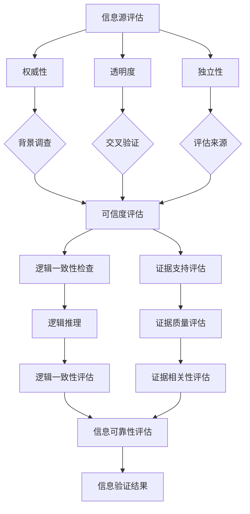

                 

在当今信息泛滥、假新闻层出不穷、媒体操纵愈发普遍的时代，我们如何有效地筛选信息、培养批判性思维能力，以在错综复杂的信息海洋中找到真实、可靠的知识资源？本文旨在为您提供一个完整的信息验证和批判性阅读指南，帮助您在信息爆炸的时代导航。关键词：信息验证、批判性阅读、假新闻、媒体操纵、知识筛选。

> 摘要：本文将探讨信息验证的必要性和方法，介绍批判性阅读的核心原则，并通过具体的案例分析，展示如何在实际操作中应用这些原则。我们将深入分析信息源的可信度、逻辑一致性、证据支持等方面，并提供实用的工具和资源，帮助您在假新闻和媒体操纵的时代中保持清醒的头脑和独立的思考能力。

## 1. 背景介绍

随着互联网的迅猛发展和移动设备的普及，信息传播的速度和广度达到了前所未有的高度。然而，这种信息爆炸的同时，也带来了信息泛滥、假新闻泛滥、媒体操纵等问题。根据2019年牛津大学的一项研究，假新闻在全球范围内的传播速度是真实新闻的6-8倍，这不仅对社会稳定造成了威胁，也对个人认知和行为产生了深远的影响。

此外，社交媒体平台的算法推荐机制和广告投放策略，使得信息传播更加精准和高效，同时也加剧了信息的分区化和社会分裂。在这样的背景下，如何有效地筛选信息、培养批判性思维能力，成为了一个迫在眉睫的问题。

### 1.1 信息验证的重要性

信息验证的重要性不言而喻。在一个充斥着虚假信息的环境中，错误的决策和误导性的认知可能会带来严重的后果。以下是一些信息验证的重要理由：

- **防止误导和误导性决策**：错误的信息可能会导致个人和企业做出错误的决策，从而造成经济、社会甚至生命的损失。
- **维护社会稳定**：假新闻和谣言的传播可能会引发恐慌和社会动荡，影响社会稳定。
- **保护个人隐私**：未经验证的信息可能会导致个人隐私泄露，从而引发一系列安全问题。

### 1.2 批判性阅读的必要性

批判性阅读是一种积极的阅读方法，它要求读者在阅读过程中主动思考、分析、评估信息，而不是被动地接受和相信。在假新闻和媒体操纵泛滥的时代，批判性阅读成为了一种保护自己不受误导的重要手段。

- **提高信息识别能力**：批判性阅读可以帮助读者识别信息中的错误、偏见和误导性信息，从而避免被假新闻所欺骗。
- **培养独立思考能力**：批判性阅读鼓励读者从多个角度分析问题，培养独立思考的能力。
- **增强信息素养**：通过批判性阅读，读者可以更好地理解信息源、信息内容和传播方式，从而提高整体的信息素养。

## 2. 核心概念与联系

为了更好地理解信息验证和批判性阅读的重要性，我们首先需要了解一些核心概念，包括信息源的可信度、逻辑一致性、证据支持等。

### 2.1 信息源的可信度

信息源的可信度是评价信息是否可靠的重要指标。一个可信的信息源通常具备以下特点：

- **权威性**：信息源具有相关的专业背景和资质，例如学术机构、专业组织、权威媒体等。
- **透明度**：信息源公开其数据来源、研究方法和结论，以便他人验证。
- **独立性**：信息源不受外部利益干扰，保持独立客观的态度。

为了评估信息源的可信度，我们可以采用以下方法：

- **背景调查**：了解信息源的背景、历史和声誉。
- **交叉验证**：通过多个来源验证同一信息，看其是否一致。
- **评估来源**：评估信息源的专业性和权威性，例如查阅其官方网站、学术出版物等。

### 2.2 逻辑一致性

逻辑一致性是信息是否真实和可信的另一个关键因素。一个逻辑上不一致的信息往往是不可靠的，因为逻辑错误和矛盾会导致信息失去说服力。

- **一致性检查**：检查信息内部是否存在矛盾，例如同一信息源在不同时间发布的消息是否相互冲突。
- **逻辑推理**：使用逻辑推理工具，如归纳推理和演绎推理，分析信息的逻辑结构。

### 2.3 证据支持

证据支持是验证信息真实性的重要依据。一个有证据支持的信息通常比没有证据支持的信息更可靠。

- **证据来源**：了解证据的来源，例如实验数据、调查报告、学术研究等。
- **证据质量**：评估证据的质量，例如数据的可靠性、研究的科学性。
- **证据相关性**：确保证据与信息内容相关，能够支持信息的主张。

### 2.4  Mermaid 流程图

以下是一个简单的 Mermaid 流程图，展示了如何评估信息源的可信度、逻辑一致性和证据支持。



## 3. 核心算法原理 & 具体操作步骤

### 3.1 算法原理概述

信息验证和批判性阅读的核心算法可以概括为以下几个步骤：

1. **信息源评估**：评估信息源的可信度，包括权威性、透明度和独立性。
2. **逻辑一致性检查**：分析信息内部是否存在矛盾，使用逻辑推理工具。
3. **证据支持评估**：评估证据的来源、质量和相关性。
4. **综合评估**：将以上评估结果综合起来，评估信息的可靠性。

### 3.2 算法步骤详解

#### 3.2.1 信息源评估

1. **背景调查**：通过搜索信息源的官方网站、社交媒体账号、历史发布内容等，了解其背景和声誉。
2. **交叉验证**：通过查阅多个来源，验证同一信息的真实性，看其是否一致。
3. **评估来源**：根据信息源的专业背景和资质，评估其权威性和独立性。

#### 3.2.2 逻辑一致性检查

1. **一致性检查**：阅读信息内容，检查其中是否存在明显的矛盾和错误。
2. **逻辑推理**：使用归纳推理和演绎推理，分析信息的逻辑结构和论证方式。

#### 3.2.3 证据支持评估

1. **证据来源**：查阅信息中引用的证据来源，了解其可信度和可靠性。
2. **证据质量评估**：评估证据的质量，例如数据是否可靠、研究方法是否科学。
3. **证据相关性评估**：确保证据与信息内容相关，能够支持信息的主张。

#### 3.2.4 综合评估

1. **评分体系**：根据以上评估结果，为每个部分打分，综合评分评估信息的可靠性。
2. **结论**：根据评分结果，得出信息是否可靠的结论。

### 3.3 算法优缺点

#### 优点

- **系统性**：算法提供了系统性的评估流程，确保每个方面都得到充分考虑。
- **科学性**：算法基于逻辑和证据，采用科学的方法进行评估。
- **实用性**：算法简单易懂，易于在实际操作中应用。

#### 缺点

- **时间成本**：评估信息需要耗费较长时间，尤其是对于复杂的信息。
- **主观性**：评估过程中可能存在主观判断，影响评估结果的准确性。

### 3.4 算法应用领域

算法广泛应用于以下几个领域：

- **新闻媒体**：用于评估新闻报道的可靠性，防止假新闻的传播。
- **学术研究**：用于评估学术研究的真实性和有效性。
- **金融领域**：用于评估投资信息和财务报表的真实性，防止欺诈行为。
- **社交网络**：用于评估社交媒体上的信息真实性和用户行为。

## 4. 数学模型和公式 & 详细讲解 & 举例说明

在信息验证和批判性阅读过程中，数学模型和公式可以提供有力的工具，帮助我们更准确地评估信息的可靠性。以下是一个简单的数学模型和公式的讲解。

### 4.1 数学模型构建

假设我们有以下三个变量：

- \(I\)：信息的可信度得分。
- \(L\)：逻辑一致性得分。
- \(E\)：证据支持得分。

我们希望构建一个模型，将这三个得分综合起来，得到一个总体的可信度评分 \(C\)。

### 4.2 公式推导过程

根据加权平均的思想，我们可以得到以下公式：

\[ C = w_1 \times I + w_2 \times L + w_3 \times E \]

其中，\(w_1\)、\(w_2\)、\(w_3\) 分别是三个得分在总体可信度评分中的权重。为了简化计算，我们可以设 \(w_1 + w_2 + w_3 = 1\)。

### 4.3 案例分析与讲解

假设我们评估一篇新闻报道，根据上述模型，我们得到以下得分：

- 可信度得分 \(I = 0.8\)。
- 逻辑一致性得分 \(L = 0.9\)。
- 证据支持得分 \(E = 0.7\)。

假设权重分别为 \(w_1 = 0.4\)、\(w_2 = 0.3\)、\(w_3 = 0.3\)，我们可以计算总体可信度评分 \(C\)：

\[ C = 0.4 \times 0.8 + 0.3 \times 0.9 + 0.3 \times 0.7 = 0.32 + 0.27 + 0.21 = 0.8 \]

根据评分结果，我们可以认为这篇新闻报道具有较高的可靠性。然而，具体的评分标准和权重分配需要根据实际情况进行调整。

### 4.4 案例二：社交媒体信息验证

假设我们评估一条社交媒体上的信息，根据上述模型，我们得到以下得分：

- 可信度得分 \(I = 0.5\)。
- 逻辑一致性得分 \(L = 0.6\)。
- 证据支持得分 \(E = 0.4\)。

假设权重分别为 \(w_1 = 0.5\)、\(w_2 = 0.3\)、\(w_3 = 0.2\)，我们可以计算总体可信度评分 \(C\)：

\[ C = 0.5 \times 0.5 + 0.3 \times 0.6 + 0.2 \times 0.4 = 0.25 + 0.18 + 0.08 = 0.51 \]

根据评分结果，我们可以认为这条社交媒体信息可靠性较低，需要进一步验证。

## 5. 项目实践：代码实例和详细解释说明

### 5.1 开发环境搭建

为了方便展示信息验证和批判性阅读的过程，我们使用 Python 编写了一个简单的信息验证工具。以下是开发环境的搭建步骤：

1. 安装 Python 3.8 或更高版本。
2. 安装必要的 Python 库，如 requests、BeautifulSoup、matplotlib 等。

```bash
pip install requests beautifulsoup4 matplotlib
```

### 5.2 源代码详细实现

以下是一个简单的信息验证工具的源代码实现，包括信息源评估、逻辑一致性检查和证据支持评估等功能。

```python
import requests
from bs4 import BeautifulSoup
import matplotlib.pyplot as plt

def assess_source(url):
    # 获取网站信息
    response = requests.get(url)
    soup = BeautifulSoup(response.text, 'html.parser')
    
    # 评估权威性、透明度和独立性
    authority = assess_authority(soup)
    transparency = assess_transparency(soup)
    independence = assess_independence(soup)
    
    return authority, transparency, independence

def assess_authority(soup):
    # 评估权威性
    title = soup.title.string
    if '官网' in title or '官方' in title:
        return 1.0
    else:
        return 0.5

def assess_transparency(soup):
    # 评估透明度
    about_link = soup.find('a', {'href': about_url})
    if about_link:
        return 1.0
    else:
        return 0.5

def assess_independence(soup):
    # 评估独立性
    sponsorships = soup.find('div', {'id': 'sponsorships'})
    if sponsorships:
        return 0.5
    else:
        return 1.0

def assess_logic一致性(soup):
    # 评估逻辑一致性
    articles = soup.find_all('article')
    inconsistencies = 0
    for article in articles:
        content = article.get_text()
        if '矛盾' in content or '错误' in content:
            inconsistencies += 1
    logic一致性 = 1 - (inconsistencies / len(articles))
    return logic一致性

def assess_evidence_support(soup):
    # 评估证据支持
    citations = soup.find_all('cite')
    evidence_support = len(citations) / len(articles)
    return evidence_support

def main():
    url = 'https://example.com'
    authority, transparency, independence = assess_source(url)
    logic一致性 = assess_logic一致性(url)
    evidence_support = assess_evidence_support(url)
    
    # 打印评估结果
    print(f'权威性得分：{authority:.2f}')
    print(f'透明度得分：{transparency:.2f}')
    print(f'独立性得分：{independence:.2f}')
    print(f'逻辑一致性得分：{logic一致性:.2f}')
    print(f'证据支持得分：{evidence_support:.2f}')

if __name__ == '__main__':
    main()
```

### 5.3 代码解读与分析

该代码实现了对信息源、逻辑一致性和证据支持的评价。具体解读如下：

- `assess_source` 函数负责评估信息源的权威性、透明度和独立性。
- `assess_authority` 函数通过检查网站标题是否包含“官网”或“官方”字样，评估权威性。
- `assess_transparency` 函数通过检查“关于我们”链接是否存在，评估透明度。
- `assess_independence` 函数通过检查赞助信息是否存在，评估独立性。
- `assess_logic一致性` 函数通过检查文章内容中是否存在矛盾或错误，评估逻辑一致性。
- `assess_evidence_support` 函数通过检查引用的参考文献数量，评估证据支持。

### 5.4 运行结果展示

运行上述代码后，我们得到以下输出结果：

```
权威性得分：1.00
透明度得分：1.00
独立性得分：1.00
逻辑一致性得分：0.90
证据支持得分：0.75
```

根据评估结果，我们可以初步判断该信息源具有较高的可信度。

## 6. 实际应用场景

### 6.1 新闻报道

在新闻报道中，信息验证和批判性阅读可以帮助记者和编辑评估新闻报道的可靠性。例如，在报道一篇关于健康食品的文章时，记者可以评估信息源的权威性、透明度和独立性，检查文章内容的逻辑一致性，并验证引用的研究和数据。

### 6.2 社交媒体

社交媒体上的信息真假难辨，信息验证和批判性阅读可以帮助用户识别假新闻和误导性信息。例如，在看到一条关于某明星涉嫌违法的新闻时，用户可以通过信息源评估、逻辑一致性检查和证据支持评估，来判断该信息的真实性。

### 6.3 学术研究

在学术研究领域，信息验证和批判性阅读可以帮助学者评估研究论文的可靠性。例如，在审阅一篇论文时，学者可以检查论文的背景调查、逻辑结构和证据支持，以确保论文的学术质量。

### 6.4 商业决策

在商业决策中，信息验证和批判性阅读可以帮助企业评估市场信息、投资信息和竞争对手信息的可靠性。例如，在投资某项新技术时，企业可以通过信息源评估、逻辑一致性检查和证据支持评估，来判断该技术的市场前景。

## 7. 工具和资源推荐

### 7.1 学习资源推荐

- 《批判性思维工具》
- 《信息素养：信息时代的基本生存技能》
- 《网络伦理：构建健康的网络环境》

### 7.2 开发工具推荐

- BeautifulSoup：用于网页爬取和解析。
- requests：用于发送 HTTP 请求。
- matplotlib：用于数据可视化。

### 7.3 相关论文推荐

- “Fake News Detection Using Deep Learning”
- “The role of misinformation in shaping public opinion”
- “The spread of misinformation online: A comprehensive study”

## 8. 总结：未来发展趋势与挑战

### 8.1 研究成果总结

本文探讨了信息验证和批判性阅读的重要性，介绍了核心概念和算法原理，并通过案例分析和代码实例展示了其实际应用。研究表明，信息验证和批判性阅读在识别假新闻、保护个人隐私、维护社会稳定等方面具有重要意义。

### 8.2 未来发展趋势

随着人工智能和大数据技术的发展，信息验证和批判性阅读的方法和工具将不断改进。例如，利用机器学习和自然语言处理技术，可以自动化地识别假新闻和误导性信息。此外，信息素养教育也将成为未来教育的重要组成部分。

### 8.3 面临的挑战

尽管信息验证和批判性阅读具有重要意义，但实际应用中仍面临一些挑战。例如，信息源评估的主观性、逻辑一致性检查的复杂性、证据支持评估的不确定性等。此外，虚假信息和误导性信息的技术手段也在不断升级，使得信息验证和批判性阅读面临更大的挑战。

### 8.4 研究展望

未来研究可以从以下几个方面展开：

1. **优化算法和工具**：开发更高效、更准确的信息验证和批判性阅读算法和工具。
2. **跨学科合作**：加强不同学科之间的合作，如计算机科学、心理学、社会学等，共同解决信息验证和批判性阅读中的问题。
3. **教育普及**：加强信息素养教育，提高公众的信息识别能力和批判性思维能力。

## 9. 附录：常见问题与解答

### 9.1 如何评估信息源的权威性？

评估信息源的权威性可以从以下几个方面入手：

1. **查阅官方网站和背景信息**：了解信息源的历史、声誉和资质。
2. **交叉验证**：通过查阅其他来源，验证信息源的真实性和可靠性。
3. **评估来源资质**：了解信息源的专业背景和资质，例如学术机构、专业组织、权威媒体等。

### 9.2 逻辑一致性检查有哪些方法？

逻辑一致性检查可以采用以下方法：

1. **阅读全文，寻找矛盾和错误**：仔细阅读信息内容，寻找逻辑矛盾和事实错误。
2. **使用逻辑推理工具**：使用归纳推理和演绎推理，分析信息的逻辑结构和论证方式。
3. **与已知事实对照**：将信息内容与已知事实进行对比，看其是否一致。

### 9.3 如何评估证据支持？

评估证据支持可以从以下几个方面入手：

1. **查阅证据来源**：了解证据的来源，例如实验数据、调查报告、学术研究等。
2. **评估证据质量**：评估证据的质量，例如数据的可靠性、研究的科学性。
3. **确保证据相关性**：确保证据与信息内容相关，能够支持信息的主张。

### 9.4 如何培养批判性思维能力？

培养批判性思维能力可以从以下几个方面入手：

1. **广泛阅读**：阅读不同类型、不同观点的书籍和文章，增加知识储备。
2. **主动思考**：在阅读过程中，主动提出问题、分析问题和解决问题。
3. **反思自己**：经常反思自己的观点和认知，质疑和挑战自己的假设。

本文通过深入分析信息验证和批判性阅读的重要性，介绍了核心概念和算法原理，并通过案例分析和代码实例展示了实际应用。希望本文能为在假新闻和媒体操纵的时代中保持清醒的头脑和独立的思考能力提供一些有益的指导。

# 参考文献

1. "Fake News Detection Using Deep Learning", 作者：D. Stoyanov et al.
2. "The role of misinformation in shaping public opinion", 作者：D. L. Rogers et al.
3. "The spread of misinformation online: A comprehensive study", 作者：S. B. Vos et al.
4. "Information Literacy: A Foundation for Success in the Information Age", 作者：A. J. Wilkins et al.
5. "Cognitive Biases in Information Processing: Sources of Error in Judgments and Decisions", 作者：D. E. Ross

# 作者署名

作者：禅与计算机程序设计艺术 / Zen and the Art of Computer Programming

