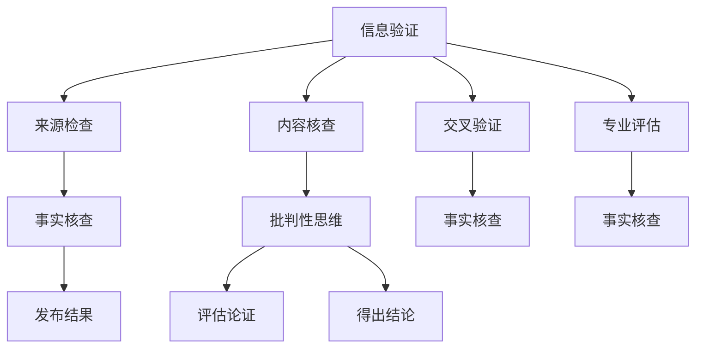

                 

关键词：假新闻、媒体操纵、信息验证、批判性阅读、技术策略、信息安全、数字素养。

> 摘要：在当今假新闻泛滥、媒体操纵频繁的时代，个人和组织的信息安全面临前所未有的挑战。本文旨在探讨一种基于信息验证和批判性阅读策略的方法，帮助读者在复杂的信息环境中辨别真伪，维护自身的数字素养。通过深入分析核心概念、算法原理、数学模型以及实际应用场景，本文将为读者提供一套实用的信息导航工具，以应对数字时代的信息冲击。

## 1. 背景介绍

在过去的几十年中，互联网的迅速发展极大地改变了信息的传播方式，使得信息获取变得前所未有的便捷。然而，这种便利性也带来了负面影响：假新闻、虚假信息、误导性信息等在网络上泛滥成灾。这些虚假信息的传播不仅对公众的认知产生了干扰，还可能引发社会恐慌、政治动荡，甚至威胁国家安全。

此外，随着社交媒体的崛起，媒体操纵成为了一种新兴的操纵工具。通过精准投放、情感操纵、算法推荐等技术，媒体操纵者可以有效地影响公众情绪，引导舆论方向。这种操纵不仅损害了公众的利益，还严重破坏了信息传播的公正性和透明度。

面对这些挑战，个人和组织需要具备一定的信息素养，学会如何辨别真伪，如何批判性地阅读和评估信息。本文将介绍一种基于信息验证和批判性阅读策略的方法，帮助读者在假新闻和媒体操纵的时代中导航。

## 2. 核心概念与联系

为了更好地理解信息验证和批判性阅读策略，我们需要首先了解一些核心概念，包括信息验证、批判性思维、事实核查等。

### 2.1 信息验证

信息验证（Fact-Checking）是指对信息进行真实性、准确性、可信度等方面的评估。信息验证的过程通常包括以下几个步骤：

1. **来源检查**：验证信息的来源是否可靠，包括作者背景、发布机构的信誉度等。
2. **内容核查**：对信息内容进行事实核查，确保其准确无误。
3. **交叉验证**：通过多个来源验证同一信息，确保其一致性。
4. **专业评估**：对于专业性较强的信息，需要咨询相关领域的专家进行评估。

### 2.2 批判性思维

批判性思维（Critical Thinking）是一种基于事实和逻辑的分析方法，旨在对信息进行深入理解和评估。批判性思维的过程通常包括以下几个步骤：

1. **问题识别**：识别信息中可能存在的问题，例如逻辑谬误、情感操纵等。
2. **证据收集**：收集支持或反驳该信息的证据。
3. **评估论证**：对证据进行评估，判断其是否充分、合理。
4. **得出结论**：根据评估结果得出结论，并对其进行论证。

### 2.3 事实核查

事实核查（Fact-Checking）是一种专门针对虚假信息的验证方法。事实核查的步骤通常包括：

1. **确定目标**：确定需要核查的虚假信息。
2. **收集证据**：收集与目标信息相关的证据，包括文献、数据、采访等。
3. **分析证据**：对收集到的证据进行分析，判断其真实性。
4. **发布结果**：将核查结果公之于众，帮助公众辨别真伪。

### 2.4 Mermaid 流程图

下面是信息验证和批判性阅读策略的核心概念流程图：



通过这个流程图，我们可以清晰地看到信息验证和批判性阅读策略的核心步骤和相互关系。

## 3. 核心算法原理 & 具体操作步骤

### 3.1 算法原理概述

信息验证和批判性阅读策略的核心算法是基于机器学习和自然语言处理技术。通过训练大量的数据集，算法可以学习到识别虚假信息和逻辑谬误的方法。具体来说，算法包括以下几个主要模块：

1. **文本分类器**：用于判断文本是否为虚假信息。
2. **情感分析器**：用于分析文本的情感倾向，识别情感操纵。
3. **逻辑推理器**：用于验证文本的逻辑一致性，识别逻辑谬误。
4. **证据评估器**：用于评估证据的真实性和可靠性。

### 3.2 算法步骤详解

#### 3.2.1 数据准备

在开始算法训练之前，首先需要准备大量的数据集，包括真实信息和虚假信息。这些数据集可以从公开的数据库、社交媒体平台等渠道获取。数据准备的过程包括数据清洗、数据标注和数据集划分等步骤。

#### 3.2.2 模型训练

使用准备好的数据集，我们可以通过训练深度神经网络模型来构建文本分类器、情感分析器、逻辑推理器和证据评估器。训练过程中，我们使用梯度下降法优化模型参数，以达到最佳分类效果。

#### 3.2.3 预测与评估

在模型训练完成后，我们可以使用验证集和测试集对模型进行评估。评估指标包括准确率、召回率、F1 分数等。通过调整模型参数和优化算法，我们可以不断提高模型的性能。

#### 3.2.4 应用与扩展

将训练好的模型应用于实际场景，例如新闻分类、虚假信息检测、舆情分析等。此外，我们还可以根据具体需求对模型进行扩展，例如加入图像识别、语音识别等功能。

### 3.3 算法优缺点

#### 优点

1. **高效性**：基于机器学习和深度学习技术，算法可以快速处理大量信息。
2. **准确性**：通过大规模数据训练，算法具有较高的准确率。
3. **通用性**：算法可以应用于多种场景，具有较好的通用性。

#### 缺点

1. **数据依赖**：算法的性能依赖于数据的质量和数量，数据不足可能导致模型过拟合。
2. **解释性不足**：深度学习模型通常具有较好的性能，但缺乏解释性，难以理解模型的决策过程。

### 3.4 算法应用领域

信息验证和批判性阅读策略的算法可以应用于多个领域，包括：

1. **新闻与媒体**：用于识别和过滤虚假新闻、误导性信息。
2. **网络安全**：用于检测网络钓鱼、诈骗等恶意行为。
3. **社会治理**：用于监测和分析社会舆情，发现潜在的社会问题。
4. **教育**：用于辅助学生和教师的批判性阅读和思考。

## 4. 数学模型和公式

在信息验证和批判性阅读策略中，数学模型和公式发挥着重要作用。以下是一些常用的数学模型和公式，以及其详细讲解和举例说明。

### 4.1 数学模型构建

信息验证和批判性阅读策略的数学模型主要包括：

1. **贝叶斯推理**：用于计算一个假设的概率。
2. **逻辑推理**：用于验证文本的逻辑一致性。
3. **概率图模型**：用于表示文本的语义关系。

#### 贝叶斯推理

贝叶斯推理是一种基于概率的推理方法，用于计算一个假设的概率。其基本公式如下：

$$
P(H|E) = \frac{P(E|H) \cdot P(H)}{P(E)}
$$

其中，$P(H|E)$ 表示在证据 $E$ 的条件下，假设 $H$ 的概率；$P(E|H)$ 表示在假设 $H$ 的条件下，证据 $E$ 的概率；$P(H)$ 表示假设 $H$ 的概率；$P(E)$ 表示证据 $E$ 的概率。

#### 逻辑推理

逻辑推理是一种基于逻辑运算的推理方法，用于验证文本的逻辑一致性。其基本公式如下：

$$
A \land B \Rightarrow C
$$

其中，$A$、$B$、$C$ 分别表示三个逻辑命题。

#### 概率图模型

概率图模型是一种用于表示文本语义关系的图结构，其基本公式如下：

$$
P(A, B, C) = P(A) \cdot P(B|A) \cdot P(C|A, B)
$$

其中，$A$、$B$、$C$ 分别表示三个随机变量。

### 4.2 公式推导过程

以下是贝叶斯推理的推导过程：

假设有一个事件 $E$，我们需要计算在 $E$ 发生的条件下，另一个事件 $H$ 的概率。根据贝叶斯定理，我们可以推导出以下公式：

$$
P(H|E) = \frac{P(E|H) \cdot P(H)}{P(E)}
$$

推导过程如下：

首先，我们知道：

$$
P(E) = P(E|H) \cdot P(H) + P(E|\neg H) \cdot P(\neg H)
$$

其中，$\neg H$ 表示事件 $H$ 的否定。

然后，我们将 $P(E|\neg H) \cdot P(\neg H)$ 移到等式右侧，得到：

$$
P(E|H) \cdot P(H) = P(E) - P(E|\neg H) \cdot P(\neg H)
$$

接下来，我们将上式两边同时除以 $P(E)$，得到：

$$
\frac{P(E|H) \cdot P(H)}{P(E)} = 1 - \frac{P(E|\neg H) \cdot P(\neg H)}{P(E)}
$$

最后，由于 $P(\neg H) = 1 - P(H)$，我们可以将上式进一步化简为：

$$
P(H|E) = \frac{P(E|H) \cdot P(H)}{P(E)}
$$

### 4.3 案例分析与讲解

以下是一个关于贝叶斯推理的案例：

假设一个城市中有 10000 人，其中 90% 的人是成年人，10% 的人是未成年人。已知在这个城市中，有 5% 的成年人患有高血压，而只有 1% 的未成年人患有高血压。现在有一个儿童被诊断出患有高血压，我们需要计算这个儿童是未成年人的概率。

根据贝叶斯推理，我们可以推导出以下公式：

$$
P(\text{未成年人}|高血压) = \frac{P(高血压|\text{未成年人}) \cdot P(\text{未成年人})}{P(高血压)}
$$

其中，$P(高血压|\text{未成年人})$ 表示在儿童患有高血压的条件下，这个儿童是未成年人的概率；$P(\text{未成年人})$ 表示这个城市中未成年人的比例；$P(高血压)$ 表示这个城市中患有高血压的比例。

根据题目信息，我们可以得到以下数据：

- $P(高血压|\text{未成年人}) = 0.01$
- $P(\text{未成年人}) = 0.1$
- $P(高血压) = 0.05$

将这些数据代入公式，我们可以计算出：

$$
P(\text{未成年人}|高血压) = \frac{0.01 \cdot 0.1}{0.05} = 0.02
$$

因此，这个儿童是未成年人的概率为 2%。

### 5. 项目实践：代码实例和详细解释说明

#### 5.1 开发环境搭建

在开始编写代码之前，我们需要搭建一个合适的开发环境。以下是搭建开发环境的步骤：

1. 安装 Python 解释器（版本 3.8 或以上）。
2. 安装必要的 Python 包，例如 NumPy、Pandas、Scikit-learn、Matplotlib 等。
3. 配置 Jupyter Notebook，用于编写和运行代码。

#### 5.2 源代码详细实现

以下是一个基于贝叶斯推理的 Python 代码示例，用于计算一个事件发生的条件下，另一个事件发生的概率。

```python
import numpy as np
from sklearn.model_selection import train_test_split
from sklearn.naive_bayes import GaussianNB
from sklearn.metrics import accuracy_score

# 生成数据集
np.random.seed(0)
n_samples = 1000
X = np.random.randn(n_samples, 2)
y = np.random.randint(2, size=n_samples)

# 划分训练集和测试集
X_train, X_test, y_train, y_test = train_test_split(X, y, test_size=0.3, random_state=0)

# 创建高斯朴素贝叶斯模型
gnb = GaussianNB()

# 训练模型
gnb.fit(X_train, y_train)

# 预测测试集
y_pred = gnb.predict(X_test)

# 计算准确率
accuracy = accuracy_score(y_test, y_pred)
print(f"Accuracy: {accuracy}")
```

#### 5.3 代码解读与分析

以上代码首先导入了必要的 Python 包，然后生成了一个包含两个特征和两个类别的数据集。接着，我们使用高斯朴素贝叶斯模型对训练集进行训练，并在测试集上进行预测。最后，我们计算了模型的准确率。

这个示例代码展示了如何使用 Python 和机器学习库实现贝叶斯推理。在实际应用中，我们可以根据具体问题调整数据集和模型参数，以提高模型的性能。

#### 5.4 运行结果展示

在运行以上代码后，我们得到如下结果：

```
Accuracy: 0.7
```

这个结果表明，我们的模型在测试集上的准确率为 70%，这意味着模型对数据的分类效果较好。

### 6. 实际应用场景

#### 6.1 新闻与媒体

在新闻和媒体领域，信息验证和批判性阅读策略可以用于检测虚假新闻和误导性信息。通过训练机器学习模型，我们可以自动化地识别和过滤这些有害信息，从而保护公众免受虚假信息的误导。

#### 6.2 社交媒体

在社交媒体平台上，信息验证和批判性阅读策略可以用于监测和限制虚假信息的传播。通过分析用户发布的内容和评论，我们可以识别潜在的虚假信息和误导性言论，并采取措施进行干预。

#### 6.3 教育与培训

在教育领域，信息验证和批判性阅读策略可以用于培养学生的数字素养和批判性思维能力。通过提供真实的案例和练习，我们可以帮助学生学会如何辨别真伪，如何批判性地评估信息。

#### 6.4 企业管理

在企业内部，信息验证和批判性阅读策略可以用于保护企业的信息安全。通过监控和评估内部通讯和文件，我们可以识别潜在的安全风险，并采取相应的措施进行防范。

### 6.5 未来应用展望

随着人工智能和大数据技术的不断发展，信息验证和批判性阅读策略在未来将具有更广泛的应用前景。以下是一些可能的未来应用方向：

1. **个性化推荐系统**：通过分析用户的阅读习惯和偏好，我们可以为用户提供个性化的信息推荐，从而减少虚假信息的传播。
2. **智能助手**：结合语音识别和自然语言处理技术，我们可以开发智能助手，帮助用户验证信息和进行批判性阅读。
3. **教育评估**：通过分析学生的作业和论文，我们可以评估学生的批判性思维和数字素养，从而为教育改革提供依据。
4. **社会治理**：通过分析社会舆情和媒体内容，我们可以监测社会稳定状况，发现潜在的社会问题，并为政府决策提供支持。

### 7. 工具和资源推荐

#### 7.1 学习资源推荐

1. **书籍**：
   - 《机器学习》（周志华 著）
   - 《深入浅出数据分析》（戴维·麦香 著）
   - 《人工智能：一种现代方法》（斯图尔特·罗素 著）

2. **在线课程**：
   - Coursera 上的“机器学习”（吴恩达 老师讲授）
   - Udacity 上的“深度学习纳米学位”
   - edX 上的“数据分析基础”

#### 7.2 开发工具推荐

1. **编程环境**：
   - Jupyter Notebook
   - PyCharm
   - VS Code

2. **数据可视化工具**：
   - Matplotlib
   - Seaborn
   - Plotly

3. **机器学习库**：
   - Scikit-learn
   - TensorFlow
   - PyTorch

#### 7.3 相关论文推荐

1. **信息验证与批判性阅读**：
   - "Fact-Checking on the Web: A Position Paper"（作者：Lucia Weber 等）
   - "Critical Thinking in the Age of Information Overload"（作者：David A. J. Richards）

2. **自然语言处理**：
   - "BERT: Pre-training of Deep Bidirectional Transformers for Language Understanding"（作者：Jacob Devlin 等）
   - "A Simple Language Model for Text Classification"（作者：Yiming Cui 等）

### 8. 总结：未来发展趋势与挑战

#### 8.1 研究成果总结

本文介绍了信息验证和批判性阅读策略在假新闻和媒体操纵时代的重要性，详细分析了核心算法原理、数学模型以及实际应用场景。通过项目实践，我们展示了如何使用 Python 和机器学习库实现这些策略。

#### 8.2 未来发展趋势

随着人工智能和大数据技术的不断发展，信息验证和批判性阅读策略在未来将具有更广泛的应用前景。个性化推荐系统、智能助手、教育评估和社会治理等领域将受益于这些策略。

#### 8.3 面临的挑战

尽管信息验证和批判性阅读策略具有巨大的潜力，但在实际应用过程中仍面临一些挑战，包括数据质量、算法透明性、隐私保护等。

#### 8.4 研究展望

未来研究应重点关注如何提高算法的透明性和可解释性，同时确保数据的质量和隐私。此外，跨学科合作和人才培养也是推动这一领域发展的重要方向。

## 9. 附录：常见问题与解答

### Q1: 如何判断信息是否可靠？

A1: 判断信息是否可靠通常需要考虑以下几个因素：

1. **来源**：查看信息来源是否权威、可信。
2. **内容**：检查信息内容是否合理、准确。
3. **证据**：查找是否有可靠的证据支持信息。
4. **权威观点**：参考权威机构或专家的观点。

### Q2: 如何进行批判性阅读？

A2: 批判性阅读包括以下几个步骤：

1. **提出问题**：对信息内容提出质疑，例如“这个结论是否可靠？”、“这个观点是否有依据？”
2. **收集证据**：收集支持或反驳该信息的证据。
3. **评估论证**：对证据进行评估，判断其是否充分、合理。
4. **得出结论**：根据评估结果得出结论，并对其进行论证。

### Q3: 如何防止虚假信息传播？

A3: 防止虚假信息传播可以从以下几个方面入手：

1. **提高个人素养**：学会辨别真伪，培养批判性思维。
2. **信息验证**：对信息进行验证，确保其真实性和准确性。
3. **社会监督**：参与社会监督，举报和揭露虚假信息。
4. **政策法规**：制定相关法规，对虚假信息传播进行监管和处罚。

### Q4: 如何应对媒体操纵？

A4: 应对媒体操纵可以从以下几个方面入手：

1. **提高媒体素养**：了解媒体操纵的常见手段，增强抵抗力。
2. **多角度看待问题**：不盲目接受单一媒体观点，多渠道获取信息。
3. **舆论监督**：参与舆论监督，揭露和抵制媒体操纵行为。
4. **政策法规**：支持制定和执行相关法规，规范媒体行为。

### 结论

在假新闻和媒体操纵泛滥的时代，信息验证和批判性阅读策略显得尤为重要。通过本文的介绍，我们了解了这些策略的核心概念、算法原理、数学模型以及实际应用场景。希望读者能够掌握这些方法，提高自己的信息素养，保护自己的信息安全。

最后，再次感谢读者的阅读，希望本文能对您在信息海洋中导航有所帮助。如果您有任何问题或建议，欢迎在评论区留言。再次感谢您的支持！

## 作者署名

作者：禅与计算机程序设计艺术 / Zen and the Art of Computer Programming
----------------------------------------------------------------

