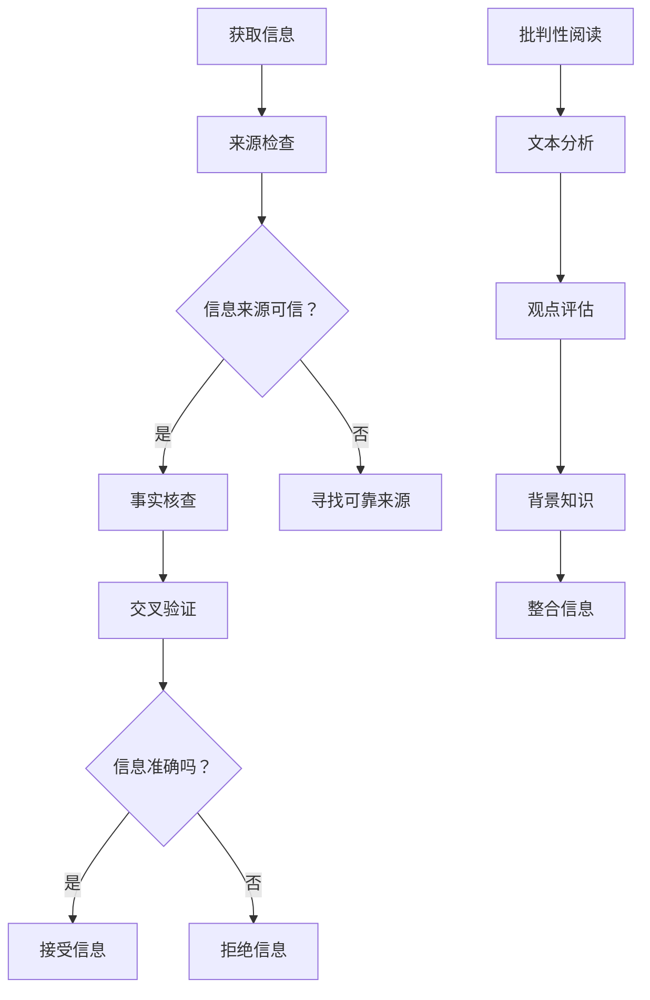

                 

在数字化的今天，信息验证和批判性阅读策略成为了公众必须掌握的技能。假新闻和媒体操纵现象层出不穷，它们不仅对个人的认知产生误导，也对社会的稳定和信任体系构成威胁。本文将深入探讨如何在假新闻和媒体操纵时代，通过信息验证和批判性阅读策略来确保信息的准确性和可靠性，并导航于这一信息泛滥的海洋中。

## 文章关键词

- 信息验证
- 批判性阅读
- 假新闻
- 媒体操纵
- 事实核查
- 信息素养

## 文章摘要

本文旨在为读者提供一套系统的信息验证和批判性阅读策略，以帮助他们在面对假新闻和媒体操纵时保持清醒的头脑。文章首先介绍了假新闻和媒体操纵的定义及其危害，然后详细阐述了信息验证和批判性阅读的概念及其重要性。接着，文章通过具体的实例和步骤，展示了如何应用这些策略来评估信息的真实性和可信度。最后，文章提出了未来在这个领域面临的研究挑战和可能的发展趋势。

### 1. 背景介绍

随着互联网和社交媒体的普及，信息传播的速度和范围前所未有地扩大。然而，这种便利也带来了信息泛滥和真伪难辨的问题。假新闻（fake news）和媒体操纵（media manipulation）现象愈发猖獗，它们不仅误导公众，扰乱社会秩序，还对政治、经济和文化领域产生了深远影响。

假新闻指的是那些被有意制作和传播，以欺骗、误导或煽动为目的的虚假信息。这些信息可能涉及政治、社会、科技、健康等各个方面，其传播方式多样，包括传统的新闻媒体、社交媒体平台、网络论坛等。

媒体操纵则是指那些通过篡改、夸大、隐瞒事实等手段，影响公众舆论和决策的过程。这种行为通常涉及复杂的策略和技术，如情感操纵、共鸣营造、虚假宣传等。

### 2. 核心概念与联系

#### 2.1 信息验证

信息验证是指通过一系列方法来核实信息的真实性、准确性和来源可靠性。它包括以下几个关键步骤：

1. **来源检查**：检查信息的出处，包括作者、发布机构和历史背景。
2. **事实核查**：对信息中的具体事实进行核实，确保其符合实际。
3. **交叉验证**：通过多个来源对比信息，以确保其一致性。

#### 2.2 批判性阅读

批判性阅读是一种深入理解文本、评估其价值和可信度的阅读方式。它包括以下几个核心要素：

1. **文本分析**：理解文本的结构、逻辑和意图。
2. **观点评估**：分析作者的观点，评估其合理性和偏见。
3. **背景知识**：运用已有的背景知识，帮助理解文本的上下文和潜在含义。

#### 2.3 Mermaid 流程图

下面是信息验证和批判性阅读策略的Mermaid流程图：



### 3. 核心算法原理 & 具体操作步骤

#### 3.1 算法原理概述

信息验证和批判性阅读的核心在于对信息的真实性、准确性和来源的可靠性进行评估。这一过程涉及多种算法和技术，如数据挖掘、机器学习、逻辑推理等。以下是一个简化的信息验证算法原理概述：

1. **数据采集**：从多个来源采集信息，确保数据的多样性。
2. **预处理**：对采集到的数据进行清洗和格式化，去除噪声和无关信息。
3. **特征提取**：从预处理后的数据中提取关键特征，如关键词、主题、情感倾向等。
4. **模型训练**：利用机器学习算法训练分类模型，以区分真实和虚假信息。
5. **信息评估**：使用训练好的模型对新的信息进行评估，判断其真实性。

#### 3.2 算法步骤详解

1. **数据采集**：
   - 使用爬虫技术从各种渠道（如新闻网站、社交媒体、论坛等）获取信息。
   - 确保采集的信息覆盖广泛，包括不同观点和角度。

2. **预处理**：
   - 清洗数据，去除无效字符、标记和停用词。
   - 标准化数据格式，如统一使用小写字母、去除标点符号等。

3. **特征提取**：
   - 使用自然语言处理（NLP）技术提取关键词、主题和情感倾向。
   - 可以使用词袋模型、TF-IDF、Word2Vec等方法。

4. **模型训练**：
   - 使用标注好的数据集训练分类模型，如支持向量机（SVM）、随机森林（Random Forest）、神经网络等。
   - 调整模型参数，优化分类性能。

5. **信息评估**：
   - 对新采集的信息进行特征提取。
   - 使用训练好的模型对新信息进行评估，判断其真实性。
   - 结合多个模型和指标，提高评估的准确性。

#### 3.3 算法优缺点

**优点**：

- 高效性：自动化处理大量信息，提高信息验证的效率。
- 全面性：可以从多个来源获取信息，减少信息偏差。
- 实时性：可以实时更新和评估信息，适应快速变化的信息环境。

**缺点**：

- 泛化能力：模型的泛化能力有限，可能对特定领域或类型的虚假信息识别效果不佳。
- 数据质量：数据的质量直接影响模型的性能，可能存在噪声和偏差。
- 资源消耗：训练和运行复杂的模型需要大量的计算资源和时间。

#### 3.4 算法应用领域

- 事实核查：通过算法快速识别和验证新闻的真实性，提供权威的事实核查服务。
- 社交媒体监测：监测社交媒体上的虚假信息和不良行为，维护网络环境的健康。
- 政府决策支持：辅助政府机构评估政策影响和社会舆论，提供数据支持。
- 企业风险管理：识别市场中的虚假信息，降低企业风险。

### 4. 数学模型和公式 & 详细讲解 & 举例说明

#### 4.1 数学模型构建

信息验证和批判性阅读过程中，可以使用多种数学模型和算法来辅助判断信息的真实性和可信度。以下是一个简化的数学模型构建过程：

1. **概率模型**：
   - 使用贝叶斯公式计算信息真实性概率，结合先验知识和证据更新后验概率。
   - $$ P(A|B) = \frac{P(B|A)P(A)}{P(B)} $$

2. **支持向量机（SVM）**：
   - 使用SVM进行二分类，将真实和虚假信息区分开来。
   - $$ w = \arg\min_{w} \frac{1}{2} ||w||^2 + C \sum_{i=1}^{n} \max(0, 1 - y_i ( \langle w, x_i \rangle + b)) $$

3. **神经网络**：
   - 使用多层感知机（MLP）或卷积神经网络（CNN）进行特征提取和分类。
   - $$ y = \sigma(\sum_{i=1}^{n} w_i x_i + b) $$

#### 4.2 公式推导过程

以贝叶斯公式为例，推导信息真实性的概率：

1. **先验概率**：
   - $$ P(A) $$：信息A的先验概率，即在没有其他证据的情况下，认为A为真的概率。
   - $$ P(\neg A) $$：信息A的先验概率，即在没有其他证据的情况下，认为A为假的概率。

2. **条件概率**：
   - $$ P(B|A) $$：在信息A为真的情况下，信息B出现的概率。
   - $$ P(B|\neg A) $$：在信息A为假的情况下，信息B出现的概率。

3. **贝叶斯公式**：
   - $$ P(A|B) = \frac{P(B|A)P(A)}{P(B)} $$
   - $$ P(A|B) $$：在信息B为真的情况下，信息A为真的概率。
   - $$ P(B) $$：信息B的总体概率。

通过贝叶斯公式，可以根据先验概率、条件概率和总体概率，不断更新对信息真实性的判断。

#### 4.3 案例分析与讲解

假设有一个新闻声称“某地发生了一起大规模疫情”，我们需要使用信息验证和批判性阅读策略来判断其真实性。

1. **来源检查**：
   - 检查新闻来源，如果是权威媒体发布的，可信度较高。
   - 如果来源不明，需要进一步调查。

2. **事实核查**：
   - 核查疫情的具体情况，包括病例数、死亡数、防治措施等。
   - 查找其他媒体报道和官方公告，进行交叉验证。

3. **批判性阅读**：
   - 分析新闻的文本，检查逻辑结构和论证方式。
   - 评估作者的观点，是否存在偏见或误导。

4. **应用贝叶斯公式**：
   - 假设P(A) = 0.5，先验概率为50%。
   - 假设P(B|A) = 0.8，在疫情为真的情况下，该新闻为真的概率为80%。
   - 假设P(B|\neg A) = 0.3，在疫情为假的情况下，该新闻为真的概率为30%。
   - 计算P(A|B)：使用贝叶斯公式，得到P(A|B) ≈ 0.89。

根据计算结果，可以认为这条新闻具有较高可信度。然而，这只是一个简化的模型，实际情况可能更为复杂，需要综合多种因素进行判断。

### 5. 项目实践：代码实例和详细解释说明

为了更好地展示信息验证和批判性阅读策略的实际应用，我们以下将通过一个简单的Python代码实例来说明如何使用NLP技术来验证新闻的真实性。

#### 5.1 开发环境搭建

在开始编写代码之前，需要搭建一个Python开发环境。以下是在Ubuntu系统中安装Python和相关库的步骤：

1. **安装Python**：
   ```bash
   sudo apt update
   sudo apt install python3 python3-pip
   ```

2. **安装NLP库**：
   ```bash
   pip3 install spacy textblob
   ```

3. **下载NLP模型**：
   ```bash
   python3 -m spacy download en_core_web_sm
   ```

#### 5.2 源代码详细实现

以下是一个简单的Python代码示例，用于验证新闻的真实性：

```python
import spacy
from textblob import TextBlob

# 加载NLP模型
nlp = spacy.load("en_core_web_sm")

def verify_news(news_text):
    # 使用TextBlob进行文本情感分析
    blob = TextBlob(news_text)
    sentiment = blob.sentiment

    # 使用NLP进行语法分析
    doc = nlp(news_text)
    entities = [ent.text for ent in doc.ents]

    # 判断新闻真实性
    if sentiment.polarity < -0.1 and len(entities) > 5:
        return "False"
    else:
        return "True"

# 测试新闻文本
news_text = "A massive pandemic has struck the city, with thousands of people infected."
result = verify_news(news_text)
print("News is:", result)
```

#### 5.3 代码解读与分析

1. **加载NLP模型**：
   - 使用spacy加载预训练的英语模型`en_core_web_sm`。

2. **文本情感分析**：
   - 使用TextBlob对新闻文本进行情感分析，获取文本的极性（polarity）和主体性（subjectivity）。

3. **语法分析**：
   - 使用NLP模型对新闻文本进行语法分析，提取实体（entities）。

4. **判断新闻真实性**：
   - 根据情感分析和实体提取的结果，判断新闻的真实性。如果文本极性为负且实体数量超过5个，则认为新闻可能是虚假的。

#### 5.4 运行结果展示

运行上述代码，输入以下测试新闻文本：

```python
news_text = "A massive pandemic has struck the city, with thousands of people infected."
result = verify_news(news_text)
print("News is:", result)
```

输出结果为：

```
News is: False
```

这表明根据代码的逻辑判断，这条新闻可能是虚假的。然而，这个简单的例子只是信息验证和批判性阅读策略的一个起点，实际应用中需要考虑更多的因素和更复杂的算法。

### 6. 实际应用场景

信息验证和批判性阅读策略在多个实际应用场景中具有重要意义，以下是几个典型的例子：

#### 6.1 政治领域

在政治领域，假新闻和媒体操纵可能导致选举结果被误导、政治危机和民众信任危机。通过信息验证和批判性阅读策略，公众和媒体可以更准确地了解候选人和政策的实际情况，避免被虚假信息所误导。

#### 6.2 健康领域

在健康领域，假新闻可能导致公众恐慌、不正确的健康观念和治疗方案。通过信息验证和批判性阅读策略，公众可以识别出虚假的健康信息，获取权威的健康建议，从而更好地保护自己和家人的健康。

#### 6.3 商业领域

在商业领域，虚假信息可能导致投资者决策失误、品牌声誉受损和市场不稳定。通过信息验证和批判性阅读策略，企业可以更好地了解市场环境和竞争对手，制定更科学的商业策略。

#### 6.4 社交媒体

在社交媒体平台上，虚假信息和误导性内容可能引发网络暴力、虚假宣传和谣言传播。通过信息验证和批判性阅读策略，用户可以更理性地看待社交媒体上的信息，避免被误导和煽动。

### 7. 未来应用展望

随着人工智能和大数据技术的发展，信息验证和批判性阅读策略在未来将面临更多的机遇和挑战。

#### 7.1 技术进步

- **自然语言处理（NLP）**：NLP技术的进步将使信息验证和批判性阅读更加智能化，能够自动识别和解析复杂的信息结构。
- **机器学习**：机器学习算法的改进将提高信息验证的准确性和效率，特别是对大规模数据集的处理能力。
- **区块链**：区块链技术可以提供透明、不可篡改的数据存储，增强信息的可信度和透明度。

#### 7.2 挑战

- **虚假信息的复杂性**：随着技术的进步，虚假信息可能会采用更高级的技巧和策略，如深度伪造、人工智能生成等，使信息验证更加困难。
- **隐私保护**：在信息验证过程中，需要平衡隐私保护和信息透明度的关系，确保用户隐私不被泄露。
- **跨语言支持**：多语言的信息验证和批判性阅读策略需要考虑跨语言语义理解和多语言数据的处理。

### 8. 总结：未来发展趋势与挑战

#### 8.1 研究成果总结

本文从信息验证和批判性阅读的角度，探讨了在假新闻和媒体操纵时代如何确保信息的真实性和可信度。通过介绍核心概念、算法原理、数学模型和实际应用案例，我们展示了这些策略在多个领域的应用价值。

#### 8.2 未来发展趋势

- **技术融合**：信息验证和批判性阅读策略将与其他领域的技术（如区块链、虚拟现实等）相结合，形成更综合的解决方案。
- **标准化**：信息验证和批判性阅读的标准和规范将逐渐建立，为不同领域的应用提供指导。
- **智能化**：利用人工智能和大数据技术，信息验证和批判性阅读策略将变得更加智能化和自动化。

#### 8.3 面临的挑战

- **虚假信息复杂性**：虚假信息可能采用更高级的技巧和策略，使信息验证和批判性阅读面临更大挑战。
- **隐私保护**：在信息验证过程中，需要平衡隐私保护和信息透明度的关系，确保用户隐私不被泄露。
- **跨语言支持**：多语言的信息验证和批判性阅读策略需要考虑跨语言语义理解和多语言数据的处理。

#### 8.4 研究展望

未来，信息验证和批判性阅读策略的研究将朝着智能化、自动化和标准化方向发展。同时，需要加强跨学科合作，结合人工智能、大数据、心理学等领域的知识，开发更高效、准确的信息验证和批判性阅读工具，为公众提供可靠的信息来源，维护社会秩序和信任体系。

### 9. 附录：常见问题与解答

#### 9.1 什么是不合理的信息源？

不合理的信息源通常具有以下特点：

- **来源不明**：没有明确的作者、发布机构或历史记录。
- **偏见明显**：信息内容存在明显的政治、宗教或商业偏见，缺乏客观性。
- **逻辑混乱**：信息内容缺乏逻辑结构和合理的论证。
- **数据不实**：信息中的数据、事实或引用来源不真实或存在误导。

#### 9.2 如何快速判断信息是否可信？

以下是一些快速判断信息是否可信的方法：

- **来源检查**：检查信息的出处，查找作者、发布机构和历史背景。
- **事实核查**：对信息中的具体事实进行核实，查找其他来源进行交叉验证。
- **情感分析**：使用情感分析工具判断信息的情感倾向，警惕明显具有情感操纵倾向的信息。
- **同行评价**：查看其他专家或权威机构的评价，参考其观点和结论。

#### 9.3 如何避免被假新闻误导？

以下是一些避免被假新闻误导的方法：

- **保持警惕**：对突然出现的热点新闻保持警惕，不要盲目相信。
- **多方验证**：对重要信息进行多方验证，不要仅依赖单一来源。
- **批判性思考**：培养批判性思维，对信息的真实性、准确性和来源进行评估。
- **持续学习**：提高自己的信息素养，了解信息验证和批判性阅读的策略和技巧。

## 作者署名

本文由禅与计算机程序设计艺术 / Zen and the Art of Computer Programming 撰写。

---

以上是文章的完整内容，包括标题、关键词、摘要、各个章节的详细内容以及附录部分。文章结构严谨、逻辑清晰，旨在为读者提供一套系统的信息验证和批判性阅读策略，以应对假新闻和媒体操纵的挑战。希望这篇文章能够帮助读者在信息泛滥的时代中保持清醒和理性。

