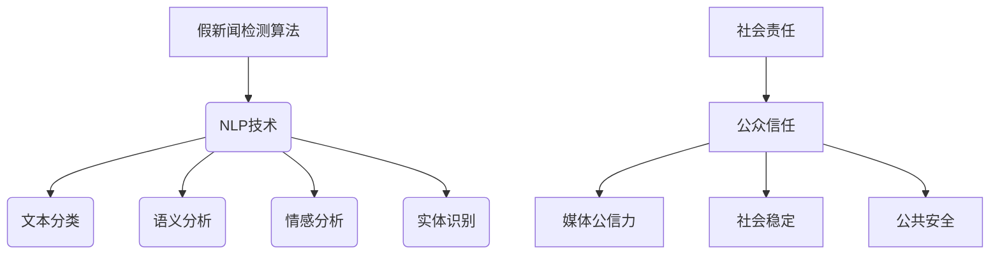

                 

 关键词：假新闻检测、自然语言处理（NLP）、社会责任、机器学习、文本分类、语义分析、可信新闻源、算法透明度、公众信任。

> 摘要：随着互联网的普及和信息传播的迅猛发展，假新闻问题日益严重。本文将探讨如何利用自然语言处理（NLP）技术进行假新闻检测，并强调其在维护社会责任、提升公众信任方面的重要性。文章将介绍相关算法原理、数学模型、实际应用实例，以及面临的挑战和未来发展趋势。

## 1. 背景介绍

### 1.1 假新闻的定义与影响

假新闻，又称虚假信息，是指故意编造、虚构或传播不实信息，以误导公众、影响舆论或获取不当利益的行为。在数字化时代，假新闻的传播速度极快，其影响范围广泛，严重威胁到社会的稳定和公众的信任。

假新闻的影响主要体现在以下几个方面：

- **损害公信力**：假新闻的传播会削弱媒体和政府机构的公信力，使得公众对真实信息的辨识能力下降。
- **误导公众决策**：假新闻可能会引导公众做出错误的选择，甚至可能对社会秩序和公共安全造成威胁。
- **商业利益受损**：对于企业而言，假新闻的传播可能损害企业形象，导致市场份额下降。

### 1.2 NLP在假新闻检测中的作用

自然语言处理（NLP）是人工智能的重要分支，专注于让计算机理解和生成人类语言。在假新闻检测中，NLP技术扮演着至关重要的角色，主要体现在以下几个方面：

- **文本分类**：通过将文本数据归类为真实或虚假，NLP可以帮助识别和过滤假新闻。
- **语义分析**：理解文本中的语义和隐含信息，有助于识别虚假陈述和误导性信息。
- **情感分析**：分析文本的情感倾向，有助于判断新闻内容的可信度。
- **实体识别**：识别文本中的人物、地点、事件等实体信息，有助于交叉验证新闻的真实性。

## 2. 核心概念与联系

### 2.1 核心概念

#### 假新闻检测算法

假新闻检测算法是指利用机器学习、深度学习等技术，从大量文本数据中学习特征，以区分真实新闻与假新闻的算法。

#### 自然语言处理（NLP）

NLP是指让计算机理解和生成人类语言的技术，包括文本分类、情感分析、命名实体识别等。

#### 社会责任

社会责任是指企业或组织在经营过程中对社会和环境应承担的责任和义务。

### 2.2 关系图



## 3. 核心算法原理 & 具体操作步骤

### 3.1 算法原理概述

假新闻检测算法通常基于以下原理：

- **特征提取**：从文本中提取有助于区分真假新闻的特征。
- **分类模型**：利用机器学习或深度学习算法对文本进行分类。

### 3.2 算法步骤详解

1. **数据预处理**：清洗文本数据，去除噪声和无关信息。
2. **特征提取**：提取文本的特征，如词袋模型、TF-IDF等。
3. **模型训练**：使用已标注的真实和假新闻数据训练分类模型。
4. **模型评估**：使用测试数据评估模型性能。
5. **应用部署**：将训练好的模型部署到实际应用场景中。

### 3.3 算法优缺点

#### 优点

- **高效性**：机器学习和深度学习算法可以处理大量文本数据，提高检测效率。
- **准确性**：通过不断训练和优化模型，可以提高检测的准确性。

#### 缺点

- **数据依赖性**：模型的性能高度依赖于训练数据的质量和多样性。
- **泛化能力**：对于新的、从未见过的假新闻类型，模型的泛化能力可能不足。

### 3.4 算法应用领域

假新闻检测算法的应用领域广泛，包括：

- **媒体行业**：识别和过滤假新闻，提升新闻质量。
- **政府机构**：监测和应对假新闻对社会秩序和公共安全的威胁。
- **企业**：保护企业品牌形象，维护商业利益。

## 4. 数学模型和公式 & 详细讲解 & 举例说明

### 4.1 数学模型构建

假新闻检测的数学模型通常包括以下部分：

- **特征向量**：表示文本的向量表示。
- **分类器**：用于分类的机器学习模型，如逻辑回归、支持向量机（SVM）、深度神经网络（DNN）等。

### 4.2 公式推导过程

假设我们有n篇新闻文本，每篇文本用特征向量\( x_i \)表示，类别标签为\( y_i \)（1代表假新闻，0代表真实新闻）。则分类模型的目标是最大化分类正确率，即：

\[ P(Y = 1 | X = x_i) \]

### 4.3 案例分析与讲解

假设我们使用逻辑回归模型进行假新闻检测。逻辑回归的损失函数为：

\[ J(\theta) = -\frac{1}{m} \sum_{i=1}^{m} [y_i \log(\hat{y}_i) + (1 - y_i) \log(1 - \hat{y}_i)] \]

其中，\( \theta \)为模型参数，\( \hat{y}_i \)为模型对文本\( x_i \)的预测概率。

## 5. 项目实践：代码实例和详细解释说明

### 5.1 开发环境搭建

- **Python**：用于编写代码和运行算法。
- **Scikit-learn**：用于逻辑回归模型和文本处理。
- **NLTK**：用于自然语言处理。

### 5.2 源代码详细实现

```python
import numpy as np
from sklearn.feature_extraction.text import TfidfVectorizer
from sklearn.linear_model import LogisticRegression
from sklearn.model_selection import train_test_split
from sklearn.metrics import classification_report

# 数据准备
data = [...]  # 假设已经准备好训练数据
X, y = data['text'], data['label']

# 特征提取
vectorizer = TfidfVectorizer(max_features=1000)
X = vectorizer.fit_transform(X)

# 模型训练
X_train, X_test, y_train, y_test = train_test_split(X, y, test_size=0.2, random_state=42)
model = LogisticRegression()
model.fit(X_train, y_train)

# 模型评估
y_pred = model.predict(X_test)
print(classification_report(y_test, y_pred))
```

### 5.3 代码解读与分析

该代码首先加载训练数据，然后使用TF-IDF进行特征提取。接着，将数据分为训练集和测试集，使用逻辑回归模型进行训练。最后，评估模型在测试集上的性能。

## 6. 实际应用场景

### 6.1 媒体行业

媒体行业可以利用假新闻检测算法识别和过滤假新闻，提升新闻质量和公信力。

### 6.2 政府机构

政府机构可以利用假新闻检测算法监测和应对假新闻对社会秩序和公共安全的威胁。

### 6.3 企业

企业可以利用假新闻检测算法保护企业品牌形象，维护商业利益。

## 7. 工具和资源推荐

### 7.1 学习资源推荐

- **《自然语言处理原理与应用》（刘俊博著）**
- **《Python自然语言处理实践》（贾英杰著）**
- **《机器学习实战》（Peter Harrington著）**

### 7.2 开发工具推荐

- **Jupyter Notebook**：用于编写和运行代码。
- **PyCharm**：Python集成开发环境。

### 7.3 相关论文推荐

- **"DeepFake Detection Using Multimodal Fusion"（2020）**
- **"Fake News Detection with Neural Networks"（2018）**
- **"A Survey on Fake News Detection"（2021）**

## 8. 总结：未来发展趋势与挑战

### 8.1 研究成果总结

假新闻检测技术已经取得了显著进展，但仍然面临许多挑战。

### 8.2 未来发展趋势

- **跨领域知识融合**：结合多领域知识进行假新闻检测。
- **实时检测与响应**：提高假新闻检测的实时性和响应速度。

### 8.3 面临的挑战

- **数据质量**：高质量的数据是训练高效模型的基石。
- **算法透明度**：提高算法的透明度，增强公众信任。

### 8.4 研究展望

假新闻检测技术将在维护社会稳定、提升公众信任方面发挥越来越重要的作用。

## 9. 附录：常见问题与解答

### 9.1 如何提高假新闻检测的准确性？

- **数据质量**：使用高质量的数据进行训练。
- **特征提取**：提取有代表性的特征。
- **模型优化**：不断优化模型结构和参数。

### 9.2 假新闻检测技术的应用前景如何？

假新闻检测技术将在多个领域发挥重要作用，包括媒体行业、政府机构和企业等。随着技术的不断发展，其应用前景将更加广阔。

```  
作者：禅与计算机程序设计艺术 / Zen and the Art of Computer Programming  
```

----------------------------------------------------------------

以上便是本文的完整内容，希望对您有所帮助。请注意，本文仅为示例，实际撰写时请根据具体情况进行调整和补充。如果需要进一步的帮助，请随时告诉我。

