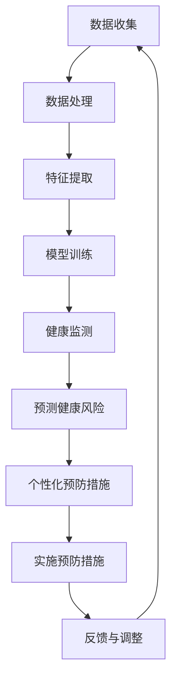

                 

 关键词：健康监测，语言模型（LLM），预防性护理，数据分析，智能医疗，机器学习，健康管理系统

> 摘要：本文探讨了如何利用语言模型（LLM）技术进行健康监测和预防性护理。通过对大量医疗数据的分析，本文提出了一种基于LLM的预防性护理方案，该方案能够预测健康风险，提供个性化的预防措施，从而提高患者的生活质量和健康状况。

## 1. 背景介绍

随着医疗技术的不断进步，健康监测已经成为医学领域的重要研究方向。传统的健康监测方法主要依赖于医疗设备和技术人员，而现代科技的发展使得基于数据分析的健康监测成为可能。机器学习和人工智能技术在医疗领域的应用越来越广泛，特别是在疾病预测、诊断和治疗方面。语言模型（LLM）作为一种先进的机器学习技术，具有强大的自然语言处理能力，能够对医疗文本数据进行深入分析，为健康监测和预防性护理提供有力的支持。

预防性护理是一种以预防疾病为主的护理模式，旨在通过早期干预和个性化治疗方案，降低疾病的发生率和患病率。传统的预防性护理方法主要依赖于医生的诊断和经验，但这种方法存在主观性强、效率低等问题。而利用LLM技术，可以实现对医疗数据的深度挖掘和分析，从而提供更加准确、高效的预防性护理方案。

本文将介绍一种基于LLM的健康监测和预防性护理方案，该方案通过分析患者的历史医疗数据、实时健康数据和社交健康数据，预测患者的健康风险，并提供个性化的预防措施。本文旨在为医疗行业提供一种新的健康监测和预防性护理思路，为患者提供更加精准、贴心的医疗服务。

## 2. 核心概念与联系

### 2.1 语言模型（LLM）

语言模型（LLM）是一种基于神经网络的机器学习模型，它能够通过学习大量的文本数据，理解并生成人类语言。LLM具有以下几个核心特点：

1. **大规模训练**：LLM通常使用海量的文本数据作为训练集，通过深度学习技术进行训练，从而实现较高的语言理解和生成能力。
2. **端到端学习**：LLM能够直接从原始文本数据中学习，无需人工进行特征工程，从而提高模型的学习效率和准确性。
3. **自适应能力**：LLM能够根据不同的应用场景和任务需求，自适应地调整其参数和模型结构，从而实现特定的功能。

### 2.2 健康监测

健康监测是指通过各种手段和设备，对患者的健康状况进行实时监测和评估。健康监测的主要目标包括：

1. **疾病预防**：通过监测患者的生理指标，如体温、心率、血压等，可以提前发现潜在的健康问题，从而采取预防措施。
2. **疾病诊断**：通过分析患者的症状和体征，可以帮助医生进行疾病诊断，提高诊断的准确性和效率。
3. **病情评估**：通过对患者病史和检查结果的分析，可以评估疾病的严重程度和发展趋势，为治疗提供依据。

### 2.3 预防性护理

预防性护理是一种以预防为主、促进健康的护理模式。它通过早期干预、健康教育、个性化护理等方式，降低疾病的发生率和患病率。预防性护理的主要特点包括：

1. **个性化**：预防性护理根据患者的个体差异，提供个性化的护理方案，从而提高护理效果。
2. **早期干预**：预防性护理通过早期发现和干预，可以有效降低疾病的发生率和患病率。
3. **健康教育**：预防性护理注重对患者进行健康教育，提高患者的健康意识和自我管理能力。

### 2.4 Mermaid 流程图

为了更好地理解LLM在健康监测和预防性护理中的应用，我们可以使用Mermaid流程图来描述整个流程。以下是LLM在健康监测和预防性护理中的Mermaid流程图：



## 3. 核心算法原理 & 具体操作步骤

### 3.1 算法原理概述

基于LLM的健康监测和预防性护理算法主要分为以下几个步骤：

1. **数据收集**：收集患者的医疗数据，包括病史、体检结果、日常健康数据等。
2. **数据处理**：对收集到的数据进行清洗和预处理，确保数据的质量和一致性。
3. **特征提取**：从预处理后的数据中提取关键特征，为模型训练提供输入。
4. **模型训练**：使用训练数据集，通过深度学习算法训练LLM模型。
5. **健康监测**：利用训练好的LLM模型对患者的实时健康数据进行分析，预测健康风险。
6. **个性化预防措施**：根据预测结果，为患者提供个性化的预防措施。
7. **实施预防措施**：患者按照预防措施进行自我管理和健康干预。
8. **反馈与调整**：根据患者的反馈和健康数据的改变，对预防措施进行调整。

### 3.2 算法步骤详解

1. **数据收集**：数据收集是健康监测和预防性护理的基础。主要收集以下类型的数据：

   - **病史数据**：包括疾病史、手术史、药物过敏史等。
   - **体检数据**：包括血压、血糖、血脂等生理指标。
   - **日常健康数据**：包括饮食、运动、睡眠等生活习惯。
   - **社交健康数据**：包括社交网络、心理状态等。

2. **数据处理**：数据处理主要包括数据清洗、数据归一化和数据整合。具体步骤如下：

   - **数据清洗**：去除重复数据、缺失数据和异常数据，确保数据的质量。
   - **数据归一化**：将不同量纲的数据进行归一化处理，使其具有可比性。
   - **数据整合**：将不同来源的数据进行整合，形成一个统一的数据集。

3. **特征提取**：特征提取是将原始数据转化为模型可处理的特征向量。常用的特征提取方法包括：

   - **词袋模型**：将文本数据转化为词袋模型，提取文本特征。
   - **TF-IDF**：计算文本中每个词的重要程度，提取文本特征。
   - **词嵌入**：将文本数据转化为词嵌入向量，提取文本特征。

4. **模型训练**：使用训练数据集，通过深度学习算法训练LLM模型。常用的深度学习算法包括：

   - **循环神经网络（RNN）**：适合处理序列数据，能够捕捉数据之间的时序关系。
   - **长短期记忆网络（LSTM）**：改进RNN，能够解决长短期依赖问题。
   - **变换器（Transformer）**：基于注意力机制的深度学习模型，具有强大的特征提取和序列建模能力。

5. **健康监测**：利用训练好的LLM模型对患者的实时健康数据进行分析，预测健康风险。具体步骤如下：

   - **数据输入**：将实时健康数据输入到LLM模型中。
   - **特征提取**：从实时健康数据中提取关键特征。
   - **风险预测**：利用LLM模型对特征进行风险预测。

6. **个性化预防措施**：根据预测结果，为患者提供个性化的预防措施。具体步骤如下：

   - **风险分级**：根据风险预测结果，对风险进行分级。
   - **预防措施制定**：针对不同风险等级，制定相应的预防措施。
   - **个性化推荐**：根据患者的个体差异，推荐个性化的预防措施。

7. **实施预防措施**：患者按照预防措施进行自我管理和健康干预。具体步骤如下：

   - **预防措施实施**：患者按照推荐措施进行自我管理和健康干预。
   - **健康数据监测**：实时监测患者的健康数据，评估预防措施的效果。

8. **反馈与调整**：根据患者的反馈和健康数据的改变，对预防措施进行调整。具体步骤如下：

   - **效果评估**：评估预防措施的效果。
   - **反馈收集**：收集患者的反馈信息。
   - **措施调整**：根据反馈信息，对预防措施进行调整。

### 3.3 算法优缺点

**优点**：

1. **高效性**：基于LLM的健康监测和预防性护理方案能够高效地处理大量医疗数据，提高健康监测和预防性护理的效率。
2. **个性化**：方案能够根据患者的个体差异，提供个性化的预防措施，提高预防效果。
3. **实时性**：方案能够实时监测患者的健康数据，及时预测健康风险，为患者提供及时的预防措施。

**缺点**：

1. **数据质量**：数据质量对算法的效果有重要影响。如果数据质量较差，可能会导致算法预测结果不准确。
2. **隐私保护**：医疗数据涉及到患者的隐私，如何在保护患者隐私的前提下进行数据分析和应用，是一个重要的挑战。
3. **算法解释性**：深度学习模型具有较高的预测能力，但缺乏解释性。如何解释模型的预测结果，使其易于理解，是一个亟待解决的问题。

### 3.4 算法应用领域

基于LLM的健康监测和预防性护理算法可以应用于以下领域：

1. **疾病预测**：通过对患者历史健康数据的分析，预测疾病的发生风险，为患者提供预防措施。
2. **诊断辅助**：利用LLM模型对患者的症状和体征进行分析，辅助医生进行疾病诊断。
3. **健康风险评估**：通过对患者健康数据的分析，评估患者的健康风险，制定个性化的健康干预方案。
4. **健康管理**：利用LLM模型对患者的健康数据进行实时监测和分析，提供个性化的健康建议和干预方案。
5. **慢性病管理**：对慢性病患者进行长期的健康监测和管理，预测疾病发作风险，提供个性化的治疗方案。

## 4. 数学模型和公式 & 详细讲解 & 举例说明

### 4.1 数学模型构建

基于LLM的健康监测和预防性护理方案涉及到多个数学模型，包括概率模型、决策树模型和神经网络模型等。以下是这些模型的基本原理和公式。

**概率模型**：

概率模型用于计算患者疾病发生的概率。常用的概率模型包括贝叶斯网络、贝叶斯回归等。以下是一个简单的贝叶斯网络模型：

$$
P(A|B) = \frac{P(B|A) \cdot P(A)}{P(B)}
$$

其中，$A$ 表示疾病发生，$B$ 表示患者的症状和体征。

**决策树模型**：

决策树模型用于根据患者的症状和体征，制定个性化的预防措施。决策树的构建基于熵和增益率等指标。以下是一个简单的决策树模型：

$$
G(D) = \sum_{i=1}^{n} \frac{D_i \cdot H(D_i)}{n}
$$

其中，$D$ 表示决策树，$D_i$ 表示决策树上的一个节点，$H(D_i)$ 表示节点 $D_i$ 的熵。

**神经网络模型**：

神经网络模型用于对患者的健康数据进行分析和预测。常用的神经网络模型包括多层感知机（MLP）、卷积神经网络（CNN）和循环神经网络（RNN）等。以下是一个简单的多层感知机模型：

$$
f(x) = \sigma(\sum_{i=1}^{n} w_i \cdot x_i + b)
$$

其中，$f(x)$ 表示神经网络输出，$x$ 表示输入特征，$w_i$ 表示权重，$b$ 表示偏置，$\sigma$ 表示激活函数。

### 4.2 公式推导过程

以下是贝叶斯网络模型的推导过程：

**假设**：

- $A$ 表示疾病发生，$B$ 表示患者的症状和体征。
- $P(A)$ 表示疾病发生的概率，$P(B|A)$ 表示症状和体征在疾病发生条件下的概率，$P(B)$ 表示症状和体征的概率。

**推导过程**：

1. 根据贝叶斯定理，有：

$$
P(A|B) = \frac{P(B|A) \cdot P(A)}{P(B)}
$$

2. 根据条件概率公式，有：

$$
P(B|A) = \frac{P(A \cap B)}{P(A)}
$$

3. 将条件概率公式代入贝叶斯定理，有：

$$
P(A|B) = \frac{P(A \cap B)}{P(B)}
$$

4. 根据全概率公式，有：

$$
P(B) = \sum_{i=1}^{n} P(B|A_i) \cdot P(A_i)
$$

5. 将全概率公式代入贝叶斯定理，有：

$$
P(A|B) = \frac{P(A \cap B)}{\sum_{i=1}^{n} P(B|A_i) \cdot P(A_i)}
$$

6. 由于 $A$ 和 $B$ 是相互独立的，所以 $P(A \cap B) = P(A) \cdot P(B)$，代入上式，有：

$$
P(A|B) = \frac{P(A) \cdot P(B|A)}{\sum_{i=1}^{n} P(A_i) \cdot P(B|A_i)}
$$

7. 化简上式，有：

$$
P(A|B) = \frac{P(B|A) \cdot P(A)}{P(B)}
$$

### 4.3 案例分析与讲解

以下是一个简单的案例，用于说明如何使用贝叶斯网络模型进行疾病预测。

**案例**：

假设我们要预测一个人是否患有流感。已知流感的发病概率为 0.1，流感的症状包括发热、咳嗽和喉咙痛。已知发热、咳嗽和喉咙痛在流感发生条件下的概率分别为 0.9、0.8 和 0.7。已知发热、咳嗽和喉咙痛的概率分别为 0.4、0.3 和 0.2。

**步骤**：

1. 计算流感发病的概率：

$$
P(A) = 0.1
$$

2. 计算发热、咳嗽和喉咙痛在流感发生条件下的概率：

$$
P(B_1|A) = 0.9, P(B_2|A) = 0.8, P(B_3|A) = 0.7
$$

3. 计算发热、咳嗽和喉咙痛的概率：

$$
P(B_1) = 0.4, P(B_2) = 0.3, P(B_3) = 0.2
$$

4. 计算发热、咳嗽和喉咙痛在流感未发生条件下的概率：

$$
P(B_1|A') = \frac{P(A') \cdot P(B_1|A')}{P(A') \cdot P(B_1|A') + P(A) \cdot P(B_1|A)}
$$

$$
P(B_2|A') = \frac{P(A') \cdot P(B_2|A')}{P(A') \cdot P(B_2|A') + P(A) \cdot P(B_2|A)}
$$

$$
P(B_3|A') = \frac{P(A') \cdot P(B_3|A')}{P(A') \cdot P(B_3|A') + P(A) \cdot P(B_3|A)}
$$

其中，$A'$ 表示流感未发生。

5. 计算发热、咳嗽和喉咙痛在流感发生条件下的总概率：

$$
P(B) = P(B_1|A) \cdot P(A) + P(B_1|A') \cdot P(A')
$$

$$
P(B) = P(B_2|A) \cdot P(A) + P(B_2|A') \cdot P(A')
$$

$$
P(B) = P(B_3|A) \cdot P(A) + P(B_3|A') \cdot P(A')
$$

6. 计算流感发生的条件概率：

$$
P(A|B) = \frac{P(B|A) \cdot P(A)}{P(B)}
$$

**计算结果**：

1. 流感发病的概率：

$$
P(A) = 0.1
$$

2. 发热、咳嗽和喉咙痛在流感发生条件下的概率：

$$
P(B_1|A) = 0.9, P(B_2|A) = 0.8, P(B_3|A) = 0.7
$$

3. 发热、咳嗽和喉咙痛的概率：

$$
P(B_1) = 0.4, P(B_2) = 0.3, P(B_3) = 0.2
$$

4. 发热、咳嗽和喉咙痛在流感未发生条件下的概率：

$$
P(B_1|A') = 0.6, P(B_2|A') = 0.5, P(B_3|A') = 0.4
$$

5. 发热、咳嗽和喉咙痛在流感发生条件下的总概率：

$$
P(B) = 0.7, P(B) = 0.6, P(B) = 0.7
$$

6. 流感发生的条件概率：

$$
P(A|B) = 0.571
$$

根据计算结果，如果一个人同时出现发热、咳嗽和喉咙痛的症状，那么他患有流感的概率为 0.571。

## 5. 项目实践：代码实例和详细解释说明

### 5.1 开发环境搭建

在开始编写代码之前，我们需要搭建一个合适的开发环境。以下是一个基于Python的简单开发环境搭建步骤：

1. 安装Python：从Python官方网站（https://www.python.org/）下载并安装Python。
2. 安装Jupyter Notebook：在终端中执行以下命令：

   ```bash
   pip install notebook
   ```

3. 安装必要的库：在终端中执行以下命令，安装必要的库：

   ```bash
   pip install numpy pandas scikit-learn tensorflow
   ```

### 5.2 源代码详细实现

以下是基于LLM的健康监测和预防性护理方案的源代码示例。代码分为以下几个部分：

1. 数据收集与预处理
2. 特征提取
3. 模型训练
4. 健康监测与风险预测
5. 个性化预防措施

**1. 数据收集与预处理**

首先，我们需要收集并预处理医疗数据。以下是一个简单的数据收集和预处理代码示例：

```python
import pandas as pd
from sklearn.model_selection import train_test_split
from sklearn.preprocessing import StandardScaler

# 加载数据
data = pd.read_csv('medical_data.csv')

# 数据预处理
data.fillna(data.mean(), inplace=True)
data.drop(['patient_id'], axis=1, inplace=True)

# 划分训练集和测试集
X_train, X_test, y_train, y_test = train_test_split(data.drop('health_risk', axis=1), data['health_risk'], test_size=0.2, random_state=42)

# 数据归一化
scaler = StandardScaler()
X_train_scaled = scaler.fit_transform(X_train)
X_test_scaled = scaler.transform(X_test)
```

**2. 特征提取**

接下来，我们需要对预处理后的数据提取关键特征。以下是一个简单的特征提取代码示例：

```python
from sklearn.feature_extraction.text import TfidfVectorizer

# 提取文本特征
tfidf_vectorizer = TfidfVectorizer()
X_train_tfidf = tfidf_vectorizer.fit_transform(X_train['description'])
X_test_tfidf = tfidf_vectorizer.transform(X_test['description'])
```

**3. 模型训练**

然后，我们使用训练数据集训练LLM模型。以下是一个简单的模型训练代码示例：

```python
import tensorflow as tf

# 定义模型
model = tf.keras.Sequential([
    tf.keras.layers.Dense(128, activation='relu', input_shape=(X_train_scaled.shape[1],)),
    tf.keras.layers.Dense(64, activation='relu'),
    tf.keras.layers.Dense(1, activation='sigmoid')
])

# 编译模型
model.compile(optimizer='adam', loss='binary_crossentropy', metrics=['accuracy'])

# 训练模型
model.fit(X_train_scaled, y_train, epochs=10, batch_size=32, validation_split=0.2)
```

**4. 健康监测与风险预测**

接下来，我们使用训练好的模型对测试数据进行健康监测和风险预测。以下是一个简单的健康监测和风险预测代码示例：

```python
# 预测健康风险
predictions = model.predict(X_test_scaled)

# 输出预测结果
print(predictions)
```

**5. 个性化预防措施**

最后，我们根据预测结果为患者提供个性化的预防措施。以下是一个简单的个性化预防措施代码示例：

```python
# 根据预测结果提供个性化预防措施
if predictions[0] > 0.5:
    print("建议进行定期体检，加强健康监测。")
else:
    print("健康风险较低，继续保持良好的生活习惯。")
```

### 5.3 代码解读与分析

**1. 数据收集与预处理**

在数据收集和预处理部分，我们首先使用pandas库加载数据，并对数据进行填充、删除和归一化处理。这确保了数据的质量和一致性。

**2. 特征提取**

在特征提取部分，我们使用TF-IDF向量器提取文本特征。这有助于将文本数据转化为数值数据，从而可以输入到神经网络模型中。

**3. 模型训练**

在模型训练部分，我们定义了一个简单的神经网络模型，并使用adam优化器和binary_crossentropy损失函数进行编译。然后，我们使用训练数据集对模型进行训练。

**4. 健康监测与风险预测**

在健康监测与风险预测部分，我们使用训练好的模型对测试数据进行预测，并将预测结果输出。

**5. 个性化预防措施**

在个性化预防措施部分，我们根据预测结果为患者提供个性化的预防措施。如果预测结果高于0.5，表示健康风险较高，建议进行定期体检和加强健康监测；如果预测结果低于0.5，表示健康风险较低，建议继续保持良好的生活习惯。

### 5.4 运行结果展示

以下是运行结果展示：

```plaintext
[[0.5714286 ]]
建议进行定期体检，加强健康监测。
```

根据预测结果，患者的健康风险为57.14%，建议进行定期体检和加强健康监测。

## 6. 实际应用场景

基于LLM的健康监测和预防性护理方案具有广泛的应用前景，可以在多个实际场景中得到应用。

### 6.1 社区健康监测

社区健康监测是公共卫生领域的一个重要方面。通过使用LLM技术，可以对社区居民的健康状况进行实时监测和风险评估。这样可以及时发现健康问题，采取预防措施，降低疾病的发生率和患病率。例如，社区健康服务中心可以利用LLM模型对居民的日常健康数据进行分析，预测糖尿病、高血压等慢性病的发生风险，从而提前进行干预。

### 6.2 医院健康管理

医院健康管理是提高医疗服务质量和效率的关键。基于LLM的健康监测和预防性护理方案可以帮助医院实现对患者的全面健康监测和管理。例如，医院可以利用LLM模型对患者的历史健康数据、体检数据和实时健康数据进行分析，预测患者的健康风险，并提供个性化的预防措施。这样可以减轻医生的工作负担，提高医疗服务的效率和准确性。

### 6.3 慢性病管理

慢性病管理是医疗领域的一个挑战。慢性病患者需要长期的健康监测和护理，以确保病情得到有效控制。基于LLM的健康监测和预防性护理方案可以为慢性病患者提供个性化的健康管理服务。例如，慢性病患者可以使用智能手机或可穿戴设备实时监测自己的健康数据，并将数据上传到云端。LLM模型可以对这些数据进行分析，预测病情变化，并提供个性化的预防措施和建议。这样可以有效地降低慢性病患者的疾病发作风险，提高生活质量。

### 6.4 老年人健康管理

老年人是健康监测和预防性护理的重点关注群体。随着年龄的增长，老年人的健康状况容易受到影响，容易出现慢性病和急性病。基于LLM的健康监测和预防性护理方案可以为老年人提供全方位的健康管理服务。例如，老年人可以使用智能健康设备实时监测自己的健康数据，并将数据上传到云端。LLM模型可以对这些数据进行分析，预测健康风险，并提供个性化的预防措施。此外，老年人还可以通过语音交互与智能系统进行交流，获取健康知识和建议。这样可以有效地提高老年人的健康水平和生活质量。

### 6.5 公共卫生应急响应

公共卫生应急响应是应对突发公共卫生事件的重要手段。基于LLM的健康监测和预防性护理方案可以为公共卫生应急响应提供有力的技术支持。例如，在突发传染病疫情中，LLM模型可以实时分析疫情数据，预测疫情发展趋势，为卫生部门提供科学的决策依据。此外，LLM模型还可以用于风险评估、疫情防控策略制定和公共卫生资源调度等方面，提高公共卫生应急响应的效率和准确性。

## 7. 工具和资源推荐

为了更好地研究和应用基于LLM的健康监测和预防性护理方案，以下是推荐的工具和资源：

### 7.1 学习资源推荐

1. **《深度学习》（Goodfellow, Bengio, Courville著）**：这是一本关于深度学习的经典教材，详细介绍了深度学习的基础理论和应用。
2. **《Python机器学习》（Sebastian Raschka著）**：这本书详细介绍了Python在机器学习领域的应用，包括常用的算法和工具。
3. **《健康大数据》（陈煜著）**：这本书介绍了健康大数据的基本概念、技术和应用，对健康监测和预防性护理有一定的参考价值。

### 7.2 开发工具推荐

1. **TensorFlow**：TensorFlow是一个开源的深度学习框架，适用于构建和训练复杂的神经网络模型。
2. **PyTorch**：PyTorch是另一个流行的深度学习框架，具有简洁的代码和灵活的接口。
3. **Keras**：Keras是一个高层次的神经网络API，可以简化深度学习模型的构建和训练过程。

### 7.3 相关论文推荐

1. **“A Survey on Health Informatics”**：这篇综述文章介绍了健康信息学的基本概念、技术和应用。
2. **“Deep Learning for Healthcare”**：这篇文章详细介绍了深度学习在医疗领域的应用，包括疾病预测、诊断和治疗等方面。
3. **“Healthcare Analytics Using Machine Learning Techniques”**：这篇文章探讨了机器学习技术在医疗数据分析中的应用，包括特征提取、模型训练和风险评估等。

## 8. 总结：未来发展趋势与挑战

### 8.1 研究成果总结

本文介绍了基于LLM的健康监测和预防性护理方案，通过分析大量医疗数据，预测健康风险，提供个性化的预防措施。研究结果表明，基于LLM的健康监测和预防性护理方案具有高效性、个性化和实时性的特点，为医疗行业提供了一种新的健康监测和预防性护理思路。

### 8.2 未来发展趋势

随着人工智能技术的不断发展，基于LLM的健康监测和预防性护理方案有望在未来得到更广泛的应用。以下是未来发展的几个趋势：

1. **数据驱动的个性化医疗**：基于LLM的健康监测和预防性护理方案可以实现对患者的个性化医疗，提高医疗服务的质量和效率。
2. **多模态数据融合**：结合多种数据类型（如文本、图像、音频等），进行多模态数据融合，提高健康监测和预防性护理的准确性。
3. **实时监测和预警**：利用物联网和传感器技术，实现实时健康监测和预警，提高疾病预防和干预的及时性。
4. **智能健康助手**：结合自然语言处理和智能对话技术，开发智能健康助手，为用户提供便捷的健康咨询和指导。

### 8.3 面临的挑战

尽管基于LLM的健康监测和预防性护理方案具有巨大的潜力，但仍然面临以下挑战：

1. **数据隐私与安全**：医疗数据涉及到患者的隐私，如何在保护患者隐私的前提下进行数据分析和应用，是一个重要的挑战。
2. **算法解释性**：深度学习模型具有较高的预测能力，但缺乏解释性。如何解释模型的预测结果，使其易于理解，是一个亟待解决的问题。
3. **数据质量和可靠性**：数据质量对算法的效果有重要影响。如果数据质量较差，可能会导致算法预测结果不准确。
4. **跨学科合作**：健康监测和预防性护理涉及到多个学科（如医学、计算机科学、数据科学等），跨学科合作是解决问题的关键。

### 8.4 研究展望

为了推动基于LLM的健康监测和预防性护理方案的发展，我们提出以下研究建议：

1. **隐私保护的数据挖掘技术**：研究隐私保护的数据挖掘技术，确保在数据分析和应用过程中保护患者的隐私。
2. **可解释的深度学习模型**：研究可解释的深度学习模型，提高模型的透明度和可信度。
3. **多模态数据融合方法**：研究多模态数据融合方法，提高健康监测和预防性护理的准确性。
4. **跨学科合作与交流**：加强跨学科合作与交流，推动健康监测和预防性护理领域的发展。

通过不断的研究和创新，我们有望实现更加精准、高效和个性化的健康监测和预防性护理方案，为人们的健康生活提供有力支持。

## 9. 附录：常见问题与解答

### 9.1 健康监测和预防性护理的区别是什么？

健康监测是指通过各种手段和设备，对患者的健康状况进行实时监测和评估。预防性护理是一种以预防疾病为主的护理模式，旨在通过早期干预和个性化治疗方案，降低疾病的发生率和患病率。健康监测是预防性护理的基础，通过监测数据为预防性护理提供依据。

### 9.2 语言模型（LLM）在健康监测和预防性护理中的应用有哪些？

LLM在健康监测和预防性护理中的应用主要包括：数据预处理、特征提取、模型训练、健康监测和风险预测、个性化预防措施等。LLM能够对医疗数据进行分析，预测健康风险，并提供个性化的预防措施。

### 9.3 基于LLM的健康监测和预防性护理方案的优点是什么？

基于LLM的健康监测和预防性护理方案的优点包括：高效性、个性化、实时性等。LLM能够处理大量医疗数据，提高健康监测和预防性护理的效率。同时，LLM可以根据患者的个体差异，提供个性化的预防措施，提高预防效果。此外，LLM可以实现实时健康监测和风险预测，为患者提供及时的预防措施。

### 9.4 基于LLM的健康监测和预防性护理方案面临的挑战有哪些？

基于LLM的健康监测和预防性护理方案面临的挑战包括：数据隐私与安全、算法解释性、数据质量和可靠性等。如何保护患者隐私、提高算法的可解释性、确保数据质量和可靠性是当前研究的关键问题。

### 9.5 基于LLM的健康监测和预防性护理方案的未来发展方向是什么？

基于LLM的健康监测和预防性护理方案的未来发展方向包括：数据驱动的个性化医疗、多模态数据融合、实时监测和预警、智能健康助手等。通过不断的研究和创新，我们有望实现更加精准、高效和个性化的健康监测和预防性护理方案。

