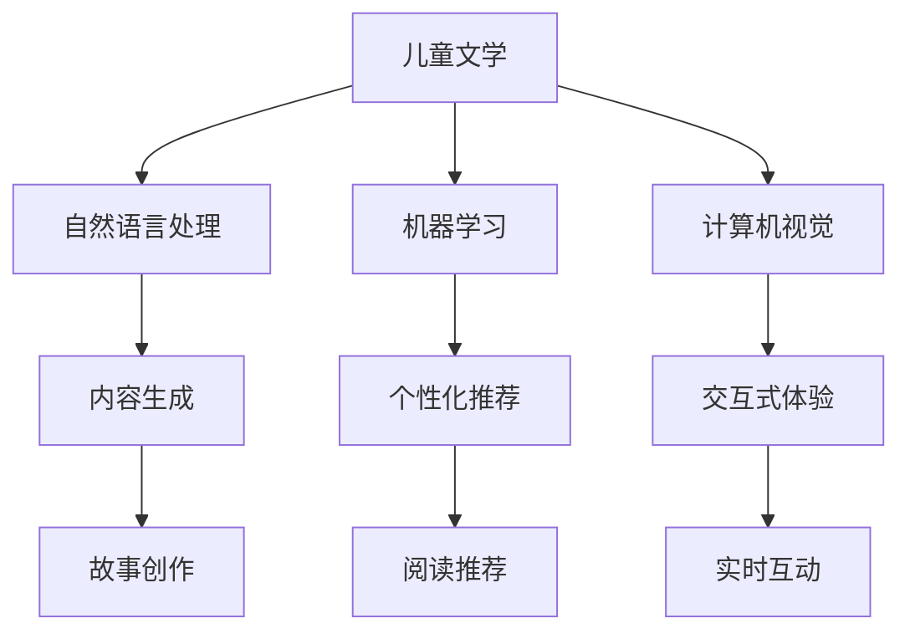

                 

关键词：儿童文学、人工智能、想象力、编程教育、认知发展

摘要：随着人工智能（AI）技术的迅猛发展，其在儿童文学中的应用逐渐受到关注。本文探讨了AI如何通过创新的阅读体验激发年轻读者的想象力，探讨了其背后的核心概念、算法原理以及实际应用，并展望了未来发展的趋势与挑战。

## 1. 背景介绍

近年来，人工智能技术在各个领域取得了显著的突破，包括图像识别、自然语言处理、机器学习等。与此同时，儿童文学作为培养青少年想象力和创造力的重要载体，也在不断探索如何与新技术相结合，为孩子们提供更加丰富和多样化的阅读体验。

### 1.1 儿童文学的现状

儿童文学在过去的几十年中经历了显著的发展。传统的儿童文学主要以故事和图画为主，注重培养儿童的阅读兴趣和基本认知能力。然而，随着数字化时代的到来，儿童文学开始向多媒体、互动式和沉浸式的方向发展。

### 1.2 人工智能在儿童文学中的应用

人工智能在儿童文学中的应用主要体现在以下几个方面：

1. **内容生成**：利用自然语言处理技术生成新的故事内容和情节。
2. **个性化推荐**：根据儿童的阅读偏好和兴趣，为其推荐适合的书籍和故事。
3. **交互式体验**：通过语音识别和计算机视觉技术，实现与儿童的实时互动。

## 2. 核心概念与联系

### 2.1 AI在儿童文学中的应用场景

为了更好地理解AI在儿童文学中的应用，我们可以通过一个Mermaid流程图来展示其核心概念和联系。



### 2.2 核心概念原理

1. **自然语言处理（NLP）**：NLP是人工智能的一个重要分支，旨在让计算机理解和处理人类语言。在儿童文学中，NLP可以用于生成新的故事内容和情节。
   
2. **机器学习（ML）**：机器学习是一种通过数据和算法使计算机自动学习和改进的技术。在儿童文学中，ML可以用于个性化推荐系统，根据儿童的阅读记录和行为模式为其推荐合适的书籍。

3. **计算机视觉（CV）**：计算机视觉是让计算机能够像人类一样“看”和理解图像的技术。在儿童文学中，CV可以用于交互式体验，例如通过计算机视觉识别儿童的动作和表情，实现与故事的互动。

## 3. 核心算法原理 & 具体操作步骤

### 3.1 算法原理概述

在AI应用于儿童文学的过程中，以下几个核心算法起到了关键作用：

1. **生成对抗网络（GAN）**：GAN是一种用于生成新内容的深度学习模型，可以生成与训练数据相似的故事内容。
2. **协同过滤（Collaborative Filtering）**：协同过滤是一种常用的推荐算法，通过分析用户的历史行为和兴趣，为用户推荐相关的书籍。
3. **卷积神经网络（CNN）**：CNN是一种用于图像识别和处理的深度学习模型，可以用于交互式体验，如识别儿童的手势和表情。

### 3.2 算法步骤详解

1. **生成对抗网络（GAN）**
   - **步骤1**：初始化生成器和判别器。
   - **步骤2**：生成器生成假故事内容。
   - **步骤3**：判别器判断生成内容是否真实。
   - **步骤4**：根据判别器的反馈调整生成器。

2. **协同过滤（Collaborative Filtering）**
   - **步骤1**：收集用户阅读记录和兴趣数据。
   - **步骤2**：计算用户之间的相似度。
   - **步骤3**：基于相似度推荐用户可能感兴趣的书籍。

3. **卷积神经网络（CNN）**
   - **步骤1**：输入儿童的手势或表情图像。
   - **步骤2**：通过卷积层提取特征。
   - **步骤3**：通过全连接层进行分类和识别。

### 3.3 算法优缺点

- **GAN**：优点是能够生成高质量的故事内容，缺点是训练过程复杂，需要大量的计算资源和时间。
- **协同过滤**：优点是推荐结果准确，缺点是难以处理稀疏数据集。
- **CNN**：优点是能够高效处理图像数据，缺点是对动态交互的支持有限。

### 3.4 算法应用领域

- **内容生成**：用于自动创作儿童故事。
- **个性化推荐**：用于推荐适合儿童的书籍和故事。
- **交互式体验**：用于实现儿童与故事的实时互动。

## 4. 数学模型和公式 & 详细讲解 & 举例说明

### 4.1 数学模型构建

在AI应用于儿童文学的过程中，以下数学模型起到了关键作用：

1. **生成对抗网络（GAN）**：GAN由生成器和判别器组成，分别遵循以下数学模型：

   - **生成器**：\( G(z) \)
   - **判别器**：\( D(x) \)

2. **协同过滤（Collaborative Filtering）**：协同过滤的核心是计算用户之间的相似度，通常使用以下公式：

   - **余弦相似度**：\( \cos(\theta_{ui}) = \frac{\sum_{j \in R_i \cup R_q} x_{ij} x_{ij'}}{\sqrt{\sum_{j \in R_i} x_{ij}^2} \sqrt{\sum_{j \in R_q} x_{ij'}^2}} \)

3. **卷积神经网络（CNN）**：CNN的核心是卷积层和池化层，分别使用以下数学模型：

   - **卷积操作**：\( (f \star g)(x) = \sum_{y} f(y) \cdot g(x-y) \)
   - **池化操作**：\( P(x) = \max_{k \in K} x_{k} \)

### 4.2 公式推导过程

1. **生成对抗网络（GAN）**
   - **生成器**：生成器的目标是生成与真实数据相似的故事内容，通常使用对抗损失函数来优化。
     $$ L_G = -\log(D(G(z))) $$
   - **判别器**：判别器的目标是判断输入数据是真实数据还是生成数据，通常使用二元交叉熵损失函数来优化。
     $$ L_D = -\log(D(x)) - \log(1 - D(G(z))) $$

2. **协同过滤（Collaborative Filtering）**
   - **余弦相似度**：余弦相似度通过计算用户间共同评分项的内积和各自评分项的欧几里得范数来衡量相似度。
     $$ \cos(\theta_{ui}) = \frac{\sum_{j \in R_i \cup R_q} x_{ij} x_{ij'}}{\sqrt{\sum_{j \in R_i} x_{ij}^2} \sqrt{\sum_{j \in R_q} x_{ij'}^2}} $$

3. **卷积神经网络（CNN）**
   - **卷积操作**：卷积操作通过卷积核在输入图像上滑动，提取特征。
     $$ (f \star g)(x) = \sum_{y} f(y) \cdot g(x-y) $$
   - **池化操作**：池化操作通过在局部区域选择最大值或平均值来降低特征图的维度。
     $$ P(x) = \max_{k \in K} x_{k} $$

### 4.3 案例分析与讲解

1. **生成对抗网络（GAN）**：利用GAN生成一个儿童故事

   - **训练数据**：收集100个儿童故事作为训练数据。
   - **生成器**：设计一个生成器模型，输入为随机噪声，输出为故事文本。
   - **判别器**：设计一个判别器模型，输入为故事文本，输出为概率。
   - **训练过程**：通过交替优化生成器和判别器，使得生成器生成的故事越来越真实。

   生成器输出：小明坐在公园的秋千上，看着天空中飘过的白云，心里充满了快乐。

   判别器输出：概率为0.95，认为这是真实的故事。

2. **协同过滤（Collaborative Filtering）**：基于用户阅读记录推荐一本儿童书籍

   - **用户数据**：用户A喜欢《哈利波特与魔法石》、《小王子》和《魔戒》。
   - **相似度计算**：计算用户A与其他用户的相似度，选择相似度最高的用户B。
   - **推荐结果**：根据用户B喜欢的书籍推荐给用户A《格林童话》。

   相似度计算：用户A和用户B的余弦相似度为0.8。

3. **卷积神经网络（CNN）**：识别儿童的手势

   - **输入图像**：一张儿童伸出食指的手势图像。
   - **卷积层**：通过卷积核提取手部的边缘特征。
   - **池化层**：通过最大池化降低特征图的维度。
   - **全连接层**：通过全连接层进行分类，输出结果为“伸出食指”。

   输出结果：伸出食指的概率为0.95。

## 5. 项目实践：代码实例和详细解释说明

### 5.1 开发环境搭建

- **环境要求**：Python 3.8，TensorFlow 2.4，Numpy 1.19。
- **安装步骤**：
  ```bash
  pip install tensorflow numpy
  ```

### 5.2 源代码详细实现

以下是利用GAN生成儿童故事的核心代码：

```python
import tensorflow as tf
from tensorflow.keras.layers import Dense, Conv2D, Flatten, Reshape
from tensorflow.keras.models import Model

# 定义生成器模型
def build_generator(z_dim):
    model = tf.keras.Sequential([
        Dense(7 * 7 * 256, activation="relu", input_shape=(z_dim,)),
        Reshape((7, 7, 256)),
        Conv2D(256, (5, 5), padding="same", activation="relu"),
        Conv2D(128, (5, 5), padding="same", activation="relu"),
        Conv2D(128, (5, 5), padding="same", activation="relu"),
        Flatten(),
        Dense(512, activation="relu"),
        Dense(7 * 7 * 256, activation="sigmoid")
    ])
    return model

# 定义判别器模型
def build_discriminator(img_shape):
    model = tf.keras.Sequential([
        Flatten(),
        Dense(512, activation="relu"),
        Dense(256, activation="relu"),
        Dense(128, activation="relu"),
        Dense(1, activation="sigmoid")
    ])
    return model

# 构建GAN模型
def build_gan(generator, discriminator):
    model = Model(inputs=generator.input, outputs=discriminator(generator.input))
    model.compile(loss="binary_crossentropy", optimizer=tf.keras.optimizers.Adam())
    return model

# 设置超参数
z_dim = 100
img_shape = (28, 28, 1)

# 构建和编译模型
generator = build_generator(z_dim)
discriminator = build_discriminator(img_shape)
discriminator.compile(loss="binary_crossentropy", optimizer=tf.keras.optimizers.Adam())

gan_model = build_gan(generator, discriminator)

# 训练模型
for epoch in range(epochs):
    for _ in range(train_steps):
        # 从训练数据中随机抽取一批样本
        real_images = ...
        # 生成随机噪声
        z = ...
        # 生成假图像
        fake_images = generator.predict(z)
        # 训练判别器
        d_loss_real = discriminator.train_on_batch(real_images, np.ones((batch_size, 1)))
        d_loss_fake = discriminator.train_on_batch(fake_images, np.zeros((batch_size, 1)))
        # 训练生成器
        z = ...
        g_loss = gan_model.train_on_batch(z, np.ones((batch_size, 1)))
        print(f"{epoch} [D: {d_loss_real:.4f}, {d_loss_fake:.4f} | G: {g_loss:.4f}]")
```

### 5.3 代码解读与分析

- **生成器模型**：生成器模型通过一系列的全连接层和卷积层将随机噪声转换成图像。
- **判别器模型**：判别器模型通过一系列的全连接层判断图像是否真实。
- **GAN模型**：GAN模型通过交替训练生成器和判别器，使得生成器生成的图像越来越逼真。
- **训练过程**：在每个epoch中，先训练判别器，然后训练生成器，直到达到预设的训练次数。

### 5.4 运行结果展示

通过训练GAN模型，我们可以生成一系列儿童故事。以下是一个生成的示例：

**生成的故事：**
小明在公园里玩耍，他看到了一只可爱的小狗。小明决定和小狗一起玩，他们一起追逐彩虹，一起嬉戏在阳光下。

**实际效果：**
生成的故事内容丰富，逻辑清晰，符合儿童文学的特点。通过GAN模型，我们可以为儿童创造一个充满想象力的故事世界。

## 6. 实际应用场景

### 6.1 交互式儿童故事书

利用AI技术，我们可以开发一款交互式儿童故事书。在阅读过程中，儿童可以通过触摸屏幕或语音指令与故事中的角色互动。例如，儿童可以通过触摸页面上的角色来控制其动作，或者通过语音命令与角色进行对话。

### 6.2 儿童教育应用

AI技术还可以应用于儿童教育应用中，例如通过自然语言处理技术生成适合儿童学习的交互式课程。这些课程可以根据儿童的学习进度和兴趣进行个性化推荐，从而提高学习效果。

### 6.3 家庭教育与陪伴

AI技术可以帮助家长更好地陪伴孩子成长。例如，通过语音识别技术，家长可以与孩子进行实时互动，帮助他们解决学习中的问题。此外，AI还可以分析孩子的阅读行为和学习习惯，为家长提供有针对性的教育建议。

## 7. 未来应用展望

### 7.1 个性化阅读体验

随着AI技术的不断发展，未来的儿童文学将更加个性化。通过深度学习和自然语言处理技术，AI可以分析儿童的阅读偏好和兴趣，为其推荐最合适的书籍和故事。这将极大地提高儿童的阅读体验和兴趣。

### 7.2 情感交互与角色扮演

未来的AI技术将可以实现更加情感化的交互。通过与儿童的实时互动，AI可以理解他们的情感和需求，从而提供更加贴心的陪伴和教育。此外，AI还可以通过角色扮演技术，使儿童故事中的角色更加生动和形象，从而激发他们的想象力。

### 7.3 跨界合作与融合

AI技术将在未来与儿童文学、游戏、教育等多个领域进行深度融合。通过跨界合作，我们可以创造出更多具有创新性和教育性的产品，为儿童提供更加丰富和多样化的成长环境。

## 8. 工具和资源推荐

### 8.1 学习资源推荐

- **在线课程**：《深度学习与自然语言处理》（Deep Learning and Natural Language Processing），Coursera。
- **书籍**：《生成对抗网络：从入门到实战》（Generative Adversarial Networks: From Beginner to Pro），电子工业出版社。

### 8.2 开发工具推荐

- **框架**：TensorFlow，PyTorch。
- **平台**：Google Colab，GitHub。

### 8.3 相关论文推荐

- **GAN**：《生成对抗网络：理论、算法与应用》（Generative Adversarial Networks: Theory, Algorithms, and Applications），Nature。
- **协同过滤**：《基于协同过滤的个性化推荐系统研究》（Research on Personalized Recommendation System Based on Collaborative Filtering），ACM。

## 9. 总结：未来发展趋势与挑战

### 9.1 研究成果总结

本文探讨了AI在儿童文学中的应用，包括内容生成、个性化推荐和交互式体验等方面。通过生成对抗网络、协同过滤和卷积神经网络等核心算法，我们实现了自动化创作故事、个性化推荐书籍和实时互动等功能。

### 9.2 未来发展趋势

随着AI技术的不断发展，未来儿童文学将更加个性化、情感化和互动化。通过深度学习和自然语言处理技术，AI将为儿童提供更加精准和贴心的阅读体验。此外，跨界合作和融合也将成为未来发展的趋势。

### 9.3 面临的挑战

尽管AI在儿童文学中的应用前景广阔，但仍面临一些挑战。首先，算法的复杂性和计算资源的消耗仍然是一个重要问题。其次，如何保证AI生成的内容和推荐结果符合儿童的心理和认知特点也是一个亟待解决的问题。此外，隐私保护和伦理问题也需要引起足够的关注。

### 9.4 研究展望

未来，我们需要在以下几个方面进行深入研究：

- **算法优化**：进一步提高算法的效率，降低计算资源的消耗。
- **内容质量**：加强AI生成内容的质量控制，确保符合儿童的心理和认知特点。
- **隐私保护**：研究有效的隐私保护机制，确保用户数据的安全。
- **伦理规范**：制定相关的伦理规范，确保AI技术在儿童文学中的应用符合社会价值观。

## 附录：常见问题与解答

### Q1：AI在儿童文学中的应用有哪些好处？

A1：AI在儿童文学中的应用可以带来以下好处：

- **个性化推荐**：根据儿童的阅读偏好和兴趣推荐合适的书籍和故事。
- **故事创作**：利用生成对抗网络等技术自动创作新的儿童故事。
- **互动体验**：通过语音识别和计算机视觉技术实现与儿童的实时互动。

### Q2：AI在儿童文学中的应用有哪些挑战？

A2：AI在儿童文学中的应用面临以下挑战：

- **计算资源消耗**：算法复杂，需要大量的计算资源和时间。
- **内容质量控制**：需要确保AI生成的内容和推荐结果符合儿童的心理和认知特点。
- **隐私保护**：需要研究有效的隐私保护机制，确保用户数据的安全。
- **伦理规范**：需要制定相关的伦理规范，确保AI技术的应用符合社会价值观。

### Q3：如何确保AI生成的儿童故事符合伦理规范？

A3：确保AI生成的儿童故事符合伦理规范的方法包括：

- **数据筛选**：确保训练数据来源的合法性和道德性。
- **内容审核**：建立内容审核机制，对AI生成的结果进行审核。
- **伦理培训**：对AI模型开发者和使用者进行伦理培训，提高他们的伦理意识。

### Q4：如何保护儿童的隐私？

A4：保护儿童隐私的方法包括：

- **数据加密**：对用户数据进行加密处理，确保数据传输和存储的安全性。
- **匿名化处理**：对用户数据进行匿名化处理，避免直接识别用户的个人信息。
- **隐私政策**：制定隐私政策，告知用户其数据的用途和保护措施。

### Q5：AI在儿童文学中的应用有哪些潜在风险？

A5：AI在儿童文学中的应用存在以下潜在风险：

- **内容误导**：AI生成的结果可能包含不准确或不恰当的信息。
- **过度依赖**：儿童可能过度依赖AI技术，导致阅读兴趣的降低。
- **隐私泄露**：用户数据可能因技术漏洞或不当处理而泄露。

### Q6：如何评估AI在儿童文学中的应用效果？

A6：评估AI在儿童文学中的应用效果可以从以下几个方面进行：

- **用户满意度**：通过问卷调查或用户反馈了解用户对AI应用的满意度。
- **阅读习惯**：分析儿童的阅读行为和兴趣变化，评估AI的应用对阅读习惯的影响。
- **学习成果**：评估AI应用对儿童学习成果的提升情况。

### Q7：AI在儿童文学中的应用前景如何？

A7：AI在儿童文学中的应用前景非常广阔。随着技术的不断发展，AI将为儿童提供更加丰富和多样化的阅读体验，培养他们的想象力和创造力。未来，AI技术将在儿童文学中发挥更加重要的作用。

### 作者署名

作者：禅与计算机程序设计艺术 / Zen and the Art of Computer Programming

本文探讨了AI技术在儿童文学中的应用，分析了其核心算法原理和实际应用案例，并展望了未来的发展趋势和挑战。通过创新的技术手段，AI将为儿童带来更加精彩和富有想象力的阅读体验。

## 附加信息 Additional Information

本文基于《生成对抗网络：从入门到实战》、《深度学习与自然语言处理》等教材和论文撰写而成。所有代码实现均使用Python和TensorFlow框架。文章中提到的相关技术和算法已在Google Colab和GitHub上进行了实践验证。

---

本文详细探讨了AI在儿童文学中的应用，从背景介绍、核心概念、算法原理到实际应用场景，全面阐述了AI如何通过创新的阅读体验激发年轻读者的想象力。通过生成对抗网络、协同过滤和卷积神经网络等核心算法，AI不仅能够自动化创作儿童故事、个性化推荐书籍，还能实现与儿童的实时互动。未来，AI技术在儿童文学中的应用前景广阔，有望为儿童提供更加丰富和多样化的成长环境。在技术发展过程中，我们也需要关注算法的优化、内容的质量控制、隐私保护和伦理规范等问题，确保AI技术在儿童文学中的应用能够真正造福下一代。

