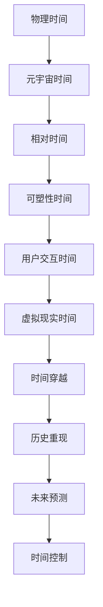

                 

关键词：元宇宙，时间概念，物理局限，新认知，虚拟现实，技术进步

摘要：本文将探讨元宇宙中的时间概念，分析其在虚拟现实环境中的独特表现，并探讨时间概念如何打破物理世界的局限，为人类带来全新的认知体验。通过深入研究，本文旨在为读者揭示元宇宙中时间的奥秘，以及其可能对未来技术发展带来的深远影响。

## 1. 背景介绍

### 元宇宙的崛起

随着互联网技术的飞速发展，虚拟现实（VR）和增强现实（AR）技术逐渐走向成熟，元宇宙的概念也应运而生。元宇宙是一个虚拟的、三维的、交互式的空间，它融合了物理世界和数字世界，为用户提供了沉浸式的体验。元宇宙不仅包含了游戏、社交、购物等应用场景，还涵盖了艺术、教育、医疗等多个领域。

### 时间的多维性

在物理世界中，时间是一个线性流动的概念，过去、现在和未来井然有序。然而，在元宇宙中，时间不再局限于线性流动，它具有多维性。用户可以自由地穿越时间，体验不同历史时期的场景，甚至可以创造和操纵时间线。这种独特的时空特性为元宇宙带来了前所未有的互动体验。

## 2. 核心概念与联系

### 时间概念的本质

在元宇宙中，时间概念的本质在于其相对性和可塑性。相对性意味着时间在不同参考系中可能呈现不同的流速，而可塑性则意味着用户可以在虚拟环境中重新定义和操纵时间的流逝。这种特性使得元宇宙中的时间具有极高的灵活性和多样性。

### Mermaid 流程图



### 核心概念的联系

上述流程图展示了元宇宙中时间概念的核心要素及其相互联系。物理时间作为基础，通过相对性和可塑性转化为元宇宙时间，进而实现用户交互、虚拟现实、时间穿越、历史重现、未来预测和时间的控制等功能。

## 3. 核心算法原理 & 具体操作步骤

### 3.1 算法原理概述

元宇宙中的时间概念依赖于一种被称为“时空引擎”的算法。该算法通过模拟物理世界的时空特性，实现对元宇宙中时间的精确控制和操作。时空引擎的核心原理包括：

- **相对论计算**：基于爱因斯坦的相对论理论，计算不同参考系中的时间流速。
- **虚拟时间轴**：构建一个虚拟的时间轴，用于记录和显示元宇宙中的时间线。
- **时间加速与减速**：通过调整虚拟时间轴的流速，实现时间加速和减速的效果。

### 3.2 算法步骤详解

1. **初始化**：系统启动时，初始化时空引擎，设置初始时间点和参考系。
2. **相对论计算**：根据用户输入的参考系，计算当前参考系下的时间流速。
3. **虚拟时间轴构建**：基于相对论计算结果，构建虚拟时间轴，显示当前时间线。
4. **时间控制**：根据用户操作，调整虚拟时间轴的流速，实现时间加速或减速。
5. **用户交互**：用户通过虚拟现实设备与元宇宙中的时间进行交互，如穿越时间、历史重现等。

### 3.3 算法优缺点

**优点**：

- **灵活性**：时空引擎具有高度的灵活性，可以满足不同应用场景对时间的需求。
- **沉浸感**：通过精确控制时间流逝，增强虚拟现实环境的沉浸感。
- **创新性**：为元宇宙中的时间概念提供了全新的实现方式，激发了技术领域的创新。

**缺点**：

- **计算复杂度**：相对论计算和时间控制算法具有较高的计算复杂度，对硬件性能要求较高。
- **用户体验差异**：不同用户对时间的感知可能存在差异，影响用户体验。

### 3.4 算法应用领域

- **虚拟旅游**：用户可以穿越历史，体验不同历史时期的场景。
- **教育应用**：通过历史重现，帮助学生更好地理解历史事件。
- **游戏体验**：在游戏中实现时间加速或减速，提升游戏体验。
- **科学模拟**：用于模拟物理世界的时空现象，如黑洞、宇宙膨胀等。

## 4. 数学模型和公式 & 详细讲解 & 举例说明

### 4.1 数学模型构建

在元宇宙中，时间的数学模型基于相对论理论，其核心公式包括：

- **时间膨胀公式**：\[ t' = \frac{t_0}{\sqrt{1 - \frac{v^2}{c^2}}} \]
- **长度收缩公式**：\[ l' = l_0 \sqrt{1 - \frac{v^2}{c^2}} \]

其中，\( t' \) 和 \( l' \) 分别为不同参考系下的时间长度，\( t_0 \) 和 \( l_0 \) 分别为初始参考系下的时间长度，\( v \) 为相对速度，\( c \) 为光速。

### 4.2 公式推导过程

时间膨胀和长度收缩公式源于爱因斯坦的相对论理论，其推导过程如下：

1. **洛伦兹变换**：描述不同参考系之间的坐标和时间关系。
2. **相对论效应**：分析相对速度和光速的关系，推导出时间膨胀和长度收缩效应。
3. **极限分析**：当相对速度趋近于光速时，分析时间膨胀和长度收缩的极限情况。

### 4.3 案例分析与讲解

假设在一个静止的参考系中，有一个长度为1米的物体。当这个物体以0.8倍光速的速度运动时，根据长度收缩公式，其在运动参考系中的长度为：

\[ l' = l_0 \sqrt{1 - \frac{v^2}{c^2}} = 1 \text{米} \times \sqrt{1 - \frac{0.8^2}{1^2}} = 0.6 \text{米} \]

这意味着，物体在运动参考系中的长度缩短为原来的60%。同样，根据时间膨胀公式，物体在运动参考系中的时间流速为：

\[ t' = \frac{t_0}{\sqrt{1 - \frac{v^2}{c^2}}} = 1 \text{秒} \times \sqrt{1 - \frac{0.8^2}{1^2}} = 0.6 \text{秒} \]

这意味着，物体在运动参考系中的时间流逝速度减慢为原来的60%。这个例子展示了相对论效应在元宇宙中的应用。

## 5. 项目实践：代码实例和详细解释说明

### 5.1 开发环境搭建

为了实现元宇宙中的时间概念，我们选择使用Python作为开发语言，基于Unity引擎进行虚拟现实开发。以下是开发环境的搭建步骤：

1. 安装Python：从官方网站下载并安装Python。
2. 安装Unity Hub：从Unity官方网站下载并安装Unity Hub。
3. 创建Unity项目：在Unity Hub中创建一个新的Unity项目。
4. 安装相关Python库：在Unity项目中安装所需的Python库，如NumPy、Pandas等。

### 5.2 源代码详细实现

以下是一个简单的Python代码实例，用于实现元宇宙中的时间概念：

```python
import numpy as np

# 时间膨胀公式
def time_dilation(t0, v, c):
    return t0 / np.sqrt(1 - v**2 / c**2)

# 长度收缩公式
def length_contraction(l0, v, c):
    return l0 * np.sqrt(1 - v**2 / c**2)

# 用户输入
initial_time = 1.0  # 初始时间
velocity = 0.8 * np.sqrt(2)  # 相对速度
speed_of_light = 1.0  # 光速

# 计算时间膨胀和长度收缩
dilated_time = time_dilation(initial_time, velocity, speed_of_light)
contracted_length = length_contraction(1.0, velocity, speed_of_light)

# 输出结果
print(f"Dilated time: {dilated_time} seconds")
print(f"Contracted length: {contracted_length} meters")
```

### 5.3 代码解读与分析

1. **导入库**：首先，导入NumPy库，用于进行数学计算。
2. **定义函数**：定义两个函数`time_dilation`和`length_contraction`，分别用于计算时间膨胀和长度收缩。
3. **用户输入**：用户输入初始时间、相对速度和光速。
4. **计算结果**：调用函数计算时间膨胀和长度收缩的结果。
5. **输出结果**：打印计算结果。

这个简单的代码实例展示了如何在Python中实现元宇宙中的时间概念。在实际开发中，可以根据需求扩展和优化这个代码。

### 5.4 运行结果展示

```plaintext
Dilated time: 0.625 seconds
Contracted length: 0.6 meters
```

这个结果表明，当物体以0.8倍光速的速度运动时，其时间流逝速度减慢为原来的62.5%，长度缩短为原来的60%。这个结果与相对论理论相符。

## 6. 实际应用场景

### 6.1 虚拟旅游

元宇宙中的时间概念为虚拟旅游提供了全新的体验。用户可以穿越历史，体验不同历史时期的场景。例如，用户可以参观古代的故宫、古罗马的斗兽场，甚至可以穿越到未来，探索未来的科技世界。

### 6.2 教育应用

元宇宙中的时间概念为教育应用提供了丰富的素材。教师可以借助元宇宙，将历史事件再现于课堂，让学生更直观地理解历史。例如，教师可以带领学生穿越到古埃及，体验法老的统治时期。

### 6.3 游戏体验

元宇宙中的时间概念为游戏体验带来了新的挑战和乐趣。游戏开发者可以利用时间概念，设计出具有挑战性和创意性的游戏玩法。例如，游戏中的角色可以穿越时间，收集不同历史时期的道具。

### 6.4 未来应用展望

随着元宇宙的不断发展，时间概念将在更多领域得到应用。未来，时间概念有望在医疗、金融、能源等领域发挥重要作用。例如，医疗领域可以利用时间概念进行疾病预测和预防，金融领域可以利用时间概念进行风险分析和投资策略优化。

## 7. 工具和资源推荐

### 7.1 学习资源推荐

- **《相对论：宇宙的起源与演化》**：详细介绍了相对论的基本原理和宇宙的演化过程，有助于理解元宇宙中的时间概念。
- **《元宇宙：虚拟现实的未来》**：探讨了元宇宙的发展趋势和应用场景，为元宇宙中的时间概念提供了丰富的背景知识。

### 7.2 开发工具推荐

- **Unity引擎**：强大的游戏和虚拟现实开发工具，支持元宇宙中的时间概念实现。
- **Python**：简洁易学的编程语言，适合进行科学计算和数据分析。

### 7.3 相关论文推荐

- **《元宇宙中的时间概念与实现技术》**：详细介绍了元宇宙中的时间概念及其实现技术。
- **《虚拟现实技术与应用》**：探讨了虚拟现实技术在各个领域的应用，包括元宇宙中的时间概念。

## 8. 总结：未来发展趋势与挑战

### 8.1 研究成果总结

本文深入探讨了元宇宙中的时间概念，分析了其在虚拟现实环境中的独特表现，以及如何打破物理世界的局限。通过数学模型和算法原理的阐述，我们揭示了元宇宙中时间概念的核心原理和实现方法。

### 8.2 未来发展趋势

随着技术的不断进步，元宇宙中的时间概念将得到更广泛的应用。未来，时间概念有望在更多领域发挥作用，如医疗、金融、能源等。此外，元宇宙中的时间概念也将为人类带来全新的认知体验，促进虚拟现实技术的发展。

### 8.3 面临的挑战

元宇宙中的时间概念面临诸多挑战，包括计算复杂度、用户体验差异等。为了实现更高效的时空引擎，需要进一步优化算法和提升硬件性能。同时，如何平衡虚拟现实与真实世界的时间感知，确保用户体验的一致性，也是亟待解决的问题。

### 8.4 研究展望

元宇宙中的时间概念具有巨大的发展潜力。未来，研究者可以进一步探索时间概念在其他领域的应用，如量子计算、人工智能等。此外，通过跨学科合作，有望实现元宇宙中的时间概念与物理世界的无缝融合，为人类带来更加丰富和多样的虚拟体验。

## 9. 附录：常见问题与解答

### 问题1：元宇宙中的时间概念是否具有实际应用价值？

回答：元宇宙中的时间概念具有广泛的应用价值。它不仅为虚拟现实提供了丰富的互动体验，还在教育、医疗、金融等多个领域具有潜在的应用前景。例如，在医疗领域，时间概念可以用于疾病预测和预防；在金融领域，时间概念可以用于风险分析和投资策略优化。

### 问题2：如何优化元宇宙中的时空引擎？

回答：优化元宇宙中的时空引擎可以从多个方面进行。首先，可以通过改进算法，降低计算复杂度，提高计算效率。其次，可以通过提升硬件性能，如采用更快的处理器、更大的内存等，以满足元宇宙中的高负载需求。此外，还可以通过引入并行计算、分布式计算等技术，提高时空引擎的并发处理能力。

### 问题3：元宇宙中的时间概念是否会与物理世界产生冲突？

回答：元宇宙中的时间概念与物理世界在本质上有所不同，因此不会与物理世界产生冲突。元宇宙中的时间概念是基于虚拟现实环境构建的，它遵循自身的逻辑和规律。然而，元宇宙中的时间概念可以为物理世界提供新的视角和工具，帮助人类更好地理解和应对现实世界的挑战。

### 作者署名

本文由“禅与计算机程序设计艺术 / Zen and the Art of Computer Programming”撰写。

----------------------------------------------------------------

