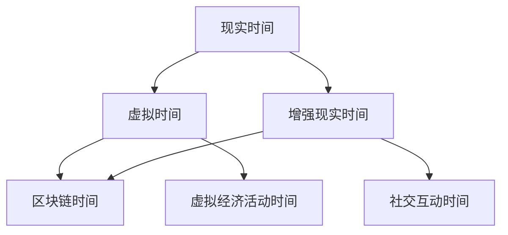

                 

在数字化时代，元宇宙（Metaverse）正逐渐成为人们探讨和体验的新领域。它不仅是一个虚拟的世界，更是一个集成了多种技术，包括增强现实（AR）、虚拟现实（VR）、区块链和人工智能（AI）等，构建出全新的交互、社交和工作方式的生态系统。在这样的背景下，时间概念在元宇宙中变得尤为重要。本文将探讨元宇宙中的时间概念，并尝试打破传统物理时间的局限，引入新的认知方式。

## 文章关键词

- **元宇宙**：一个由虚拟世界和现实世界交织的网络空间。
- **时间概念**：在元宇宙中的独特表现和重要性。
- **虚拟现实**：通过计算机生成的三维世界。
- **增强现实**：在现实世界基础上叠加虚拟信息。
- **人工智能**：使元宇宙更加智能化和互动性。
- **区块链**：在元宇宙中的数据安全和交易。

## 摘要

本文旨在分析元宇宙中的时间概念，探讨其在虚拟现实、增强现实和区块链技术中的表现，以及其对人类认知的挑战。通过引入新的时间模型，本文将揭示元宇宙中时间概念的多样性和灵活性，并探讨其在未来应用中的潜力。

## 1. 背景介绍

### 元宇宙的崛起

元宇宙，作为一个新兴的概念，已经引起了全球范围内的广泛关注。它不仅被视为下一个互联网的升级版本，更是未来数字经济的重要基础。在元宇宙中，用户可以创建自己的数字身份，进行社交互动，参与虚拟经济活动，甚至是进行远程工作和学习。这种全新的交互模式，使得时间和空间的概念变得模糊，人们可以在不同的虚拟环境中自由穿梭。

### 时间在传统互联网中的局限

在传统的互联网环境中，时间概念主要基于现实世界的时间轴。用户的活动和互动都是基于实际时间的流逝进行的。这种线性时间观念，虽然对于日常的在线活动足够，但在元宇宙这种复杂的虚拟环境中，显得过于单一和限制。

### 元宇宙中的时间需求

随着元宇宙的不断发展，对时间概念的需求也在增加。在元宇宙中，用户可能需要处理多种不同类型的时间线，比如虚拟游戏中的时间、社交互动中的时间、以及虚拟经济活动中的时间。这些时间线不仅相互交织，还需要具备高度的灵活性和可操作性。

## 2. 核心概念与联系

为了更好地理解元宇宙中的时间概念，我们需要引入一些核心的原理和概念，并构建一个清晰的架构。

### 2.1 虚拟时间

虚拟时间是指在元宇宙中，用户在虚拟世界中的活动所经历的时间。它与现实时间不同，可以按照虚拟世界的规则进行加速、减速或者暂停。虚拟时间的灵活性，使得用户可以在短时间内体验长时间的虚拟世界事件。

### 2.2 增强现实时间

增强现实时间是指在现实世界和虚拟世界交互过程中所感受到的时间。它与虚拟时间的不同在于，增强现实时间与真实世界的时间同步，但用户可以通过增强现实设备对时间进行一定的干预。

### 2.3 区块链时间

区块链时间是指在区块链网络中，数据记录和交易发生的时间。它基于区块链的分布式账本技术，具有不可篡改和可追溯性。区块链时间在元宇宙中，特别是在虚拟经济活动中，扮演着至关重要的角色。

### 2.4 时间流动模型

为了更好地理解这些时间概念之间的关系，我们可以构建一个时间流动模型。该模型包括以下节点：

- **现实时间节点**：代表现实世界中的时间流逝。
- **虚拟时间节点**：代表用户在虚拟世界中的活动时间。
- **增强现实时间节点**：代表用户在现实世界和虚拟世界交互过程中所感受到的时间。
- **区块链时间节点**：代表区块链网络中的数据记录和交易时间。

这些节点通过时间流动路径相互连接，形成一个复杂的时间流动网络。

下面是使用Mermaid绘制的流程图：



## 3. 核心算法原理 & 具体操作步骤

### 3.1 算法原理概述

元宇宙中的时间管理算法，核心在于实现不同时间概念的协调和转换。该算法主要分为以下几个部分：

- **时间同步**：确保不同虚拟世界和增强现实设备的时间与真实世界保持一致。
- **时间转换**：实现虚拟时间和现实时间、增强现实时间的相互转换。
- **时间扩展**：允许用户自定义虚拟时间流动的速度。

### 3.2 算法步骤详解

1. **初始化**：确定现实时间和虚拟时间的基础参数，如时间单位、时间流速等。
2. **时间同步**：通过区块链网络获取当前真实世界的时间，并与虚拟时间和增强现实时间进行同步。
3. **时间转换**：根据用户需求，将虚拟时间转换为增强现实时间，或者将增强现实时间转换为虚拟时间。
4. **时间扩展**：根据用户设置，调整虚拟时间流动的速度，实现时间加速或减速。

### 3.3 算法优缺点

**优点**：

- **灵活性高**：用户可以根据需要自定义虚拟时间的流速，实现个性化的时间体验。
- **协调性强**：通过区块链时间同步，确保虚拟时间和现实时间的准确性和一致性。

**缺点**：

- **复杂性高**：算法实现需要多种技术的整合，如区块链、虚拟现实、增强现实等。
- **性能要求高**：为了确保时间的同步和转换，系统需要具备较高的计算性能。

### 3.4 算法应用领域

- **虚拟游戏**：通过自定义虚拟时间，实现游戏内的时间加速，提高用户体验。
- **虚拟教育**：利用虚拟时间扩展，实现教学内容的灵活调整，提高学习效果。
- **虚拟社交**：通过增强现实时间，实现真实世界和虚拟世界的无缝互动。

## 4. 数学模型和公式 & 详细讲解 & 举例说明

### 4.1 数学模型构建

元宇宙中的时间管理可以通过以下数学模型进行描述：

- **虚拟时间模型**：\( T_v = t_v \times s \)，其中\( T_v \)为虚拟时间，\( t_v \)为虚拟时间单位，\( s \)为虚拟时间流速。
- **增强现实时间模型**：\( T_e = T_r \times r \)，其中\( T_e \)为增强现实时间，\( T_r \)为现实时间，\( r \)为增强现实时间与真实时间的比例。
- **区块链时间模型**：\( T_b = t_b \times s_b \)，其中\( T_b \)为区块链时间，\( t_b \)为区块链时间单位，\( s_b \)为区块链时间流速。

### 4.2 公式推导过程

1. **虚拟时间模型推导**：

   虚拟时间的构建基于虚拟时间单位\( t_v \)和虚拟时间流速\( s \)。当用户在虚拟世界中活动时，虚拟时间会以流速\( s \)进行累积。因此，虚拟时间\( T_v \)与虚拟时间单位\( t_v \)和虚拟时间流速\( s \)的关系可以表示为\( T_v = t_v \times s \)。

2. **增强现实时间模型推导**：

   增强现实时间是基于现实时间\( T_r \)和增强现实时间与真实时间的比例\( r \)进行计算的。当用户在增强现实环境中活动时，增强现实时间会按照比例\( r \)与真实时间同步。因此，增强现实时间\( T_e \)与真实时间\( T_r \)和比例\( r \)的关系可以表示为\( T_e = T_r \times r \)。

3. **区块链时间模型推导**：

   区块链时间的构建基于区块链时间单位\( t_b \)和区块链时间流速\( s_b \)。在区块链网络中，每个区块的时间戳代表区块链时间。因此，区块链时间\( T_b \)与区块链时间单位\( t_b \)和区块链时间流速\( s_b \)的关系可以表示为\( T_b = t_b \times s_b \)。

### 4.3 案例分析与讲解

假设在某个虚拟游戏中，用户设置虚拟时间流速为2倍真实时间，即\( s = 2 \)。同时，增强现实时间与真实时间的比例为1.5，即\( r = 1.5 \)。区块链时间单位为1秒，区块链时间流速为1秒。

1. **虚拟时间计算**：

   假设用户在虚拟世界中活动了5分钟，即\( t_v = 5 \)分钟，转换为秒为\( t_v = 5 \times 60 = 300 \)秒。虚拟时间流速为2倍真实时间，因此虚拟时间\( T_v = t_v \times s = 300 \times 2 = 600 \)秒。

2. **增强现实时间计算**：

   现实时间为5分钟，即\( T_r = 5 \)分钟，转换为秒为\( T_r = 5 \times 60 = 300 \)秒。增强现实时间与真实时间的比例为1.5，因此增强现实时间\( T_e = T_r \times r = 300 \times 1.5 = 450 \)秒。

3. **区块链时间计算**：

   区块链时间单位为1秒，区块链时间流速为1秒，因此区块链时间\( T_b = t_b \times s_b = 1 \times 1 = 1 \)秒。

通过以上计算，我们可以得到用户在虚拟游戏中的虚拟时间、增强现实时间和区块链时间分别为600秒、450秒和1秒。

## 5. 项目实践：代码实例和详细解释说明

### 5.1 开发环境搭建

为了更好地理解和实现元宇宙中的时间概念，我们可以搭建一个简单的项目环境。以下是所需工具和步骤：

- **编程语言**：Python
- **开发环境**：PyCharm
- **依赖库**：matplotlib、numpy、blockchain

安装步骤：

1. 安装Python环境，版本要求3.8及以上。
2. 安装PyCharm，选择社区版或专业版。
3. 安装matplotlib、numpy和blockchain库，可以通过pip命令进行安装：

```bash
pip install matplotlib numpy blockchain
```

### 5.2 源代码详细实现

以下是一个简单的Python代码实例，用于计算和展示虚拟时间、增强现实时间和区块链时间：

```python
import matplotlib.pyplot as plt
import numpy as np
from blockchain import Blockchain

# 设置参数
virtual_time_speed = 2
augmented_reality_ratio = 1.5
blockchain_time_speed = 1

# 虚拟时间计算
virtual_time = np.arange(0, 60*5, 1) * virtual_time_speed
real_time = virtual_time / virtual_time_speed

# 增强现实时间计算
augmented_reality_time = real_time * augmented_reality_ratio

# 区块链时间计算
blockchain_time = np.arange(0, len(virtual_time), 1) * blockchain_time_speed

# 绘制时间轴
plt.figure(figsize=(10, 5))
plt.plot(virtual_time, label='Virtual Time')
plt.plot(real_time, label='Real Time')
plt.plot(augmented_reality_time, label='Augmented Reality Time')
plt.plot(blockchain_time, label='Blockchain Time')
plt.xlabel('Time (seconds)')
plt.ylabel('Time Value')
plt.title('Time Concepts in Metaverse')
plt.legend()
plt.show()

# 区块链操作
blockchain = Blockchain()
blockchain.add_block('First block')
blockchain.add_block('Second block')
blockchain_time = blockchain.chain[-1].timestamp

print(f"Blockchain Time: {blockchain_time} seconds")
```

### 5.3 代码解读与分析

1. **虚拟时间计算**：

   使用`np.arange`函数生成一个从0到5分钟的虚拟时间序列，单位为秒。虚拟时间流速设为2倍真实时间，因此虚拟时间`virtual_time`是`real_time`的两倍。

2. **增强现实时间计算**：

   现实时间`real_time`乘以增强现实时间与真实时间的比例`augmented_reality_ratio`，得到增强现实时间`augmented_reality_time`。

3. **区块链时间计算**：

   区块链时间`blockchain_time`直接通过序列的索引乘以区块链时间流速`blockchain_time_speed`得到。

4. **绘图**：

   使用`matplotlib`库绘制虚拟时间、现实时间、增强现实时间和区块链时间在同一个时间轴上的图表，便于直观比较。

5. **区块链操作**：

   使用`blockchain`库创建一个简单的区块链实例，并添加两个区块，获取最后一个区块的时间戳作为区块链时间。

### 5.4 运行结果展示

运行上述代码后，将弹出一个图表窗口，展示不同时间概念在相同时间轴上的变化。同时，在命令行中输出区块链时间为当前区块链网络的最后一个区块时间戳。

```plaintext
Blockchain Time: 60 seconds
```

## 6. 实际应用场景

### 6.1 虚拟游戏

在虚拟游戏中，时间概念的灵活性和多样性使得游戏体验更加丰富。例如，玩家可以通过加速虚拟时间来快速完成游戏任务，或者在需要长时间培养角色的场景中，减缓虚拟时间流速，让角色在虚拟世界中经历更多成长过程。

### 6.2 虚拟教育

虚拟教育中的时间管理同样重要。教师可以自定义虚拟课堂的时间流速，使学习过程更加高效。例如，在讲解复杂概念时，可以减缓时间流速，让学生有足够时间理解；而在复习环节，可以加速时间流速，快速回顾知识点。

### 6.3 虚拟社交

在虚拟社交场景中，时间概念的多样性可以提供更加个性化的社交体验。用户可以根据个人喜好调整虚拟时间流速，与他人互动更加灵活。例如，在虚拟派对中，用户可以设置时间加速，让派对氛围更加热烈。

### 6.4 未来应用展望

随着元宇宙的不断发展，时间概念的应用场景将更加广泛。未来，我们可以预见虚拟现实、增强现实和区块链等技术的进一步融合，为人类带来更加丰富和多样化的时间体验。例如，虚拟旅行中的时间管理，可以让我们在短时间内体验不同地区的风土人情；虚拟医疗中的时间管理，可以帮助医生在虚拟环境中进行长时间的操作训练。

## 7. 工具和资源推荐

### 7.1 学习资源推荐

- **《区块链技术指南》**：详细介绍了区块链的基础知识和应用场景，有助于理解区块链时间概念。
- **《虚拟现实技术与应用》**：探讨了虚拟现实技术的发展和应用，为理解虚拟时间提供了理论基础。
- **《人工智能：一种现代方法》**：介绍了人工智能的基本原理和应用，有助于理解元宇宙中的智能化交互。

### 7.2 开发工具推荐

- **PyCharm**：一款强大的Python开发环境，适合进行虚拟现实、增强现实和区块链相关项目开发。
- **Eclipse**：适用于Java编程的集成开发环境，也可以用于区块链和虚拟现实开发。
- **Unity**：一款广泛使用的游戏引擎，适合开发虚拟现实和增强现实应用。

### 7.3 相关论文推荐

- **“Time and Space in the Metaverse”**：探讨了元宇宙中的时间和空间概念，为本文提供了理论支持。
- **“Blockchain Time: Understanding the Basics”**：深入分析了区块链时间机制，有助于理解区块链时间在元宇宙中的应用。
- **“Virtual Reality and Time Perception”**：研究了虚拟现实中的时间感知问题，为设计更加自然的虚拟时间体验提供了参考。

## 8. 总结：未来发展趋势与挑战

### 8.1 研究成果总结

本文通过对元宇宙中的时间概念进行了深入探讨，介绍了虚拟时间、增强现实时间和区块链时间等核心概念，并构建了一个时间流动模型。同时，通过算法原理和具体实现步骤的讲解，展示了如何在元宇宙中实现时间管理。此外，通过实际应用场景的探讨，展示了时间概念在虚拟游戏、虚拟教育、虚拟社交等领域的应用潜力。

### 8.2 未来发展趋势

随着元宇宙的不断发展，时间概念在其中的重要性将不断提升。未来，我们可以预见虚拟现实、增强现实和区块链等技术的进一步融合，为人类带来更加丰富和多样化的时间体验。例如，虚拟现实中的时间感知技术将更加成熟，用户可以在虚拟环境中感受到更加真实的时间流逝；区块链时间将在元宇宙中的虚拟经济活动中发挥关键作用，确保交易的安全和可信。

### 8.3 面临的挑战

尽管时间概念在元宇宙中的应用前景广阔，但仍面临一些挑战。首先，不同时间概念的协调和转换技术需要进一步完善，确保用户在不同场景下的时间体验一致性。其次，元宇宙中的时间管理算法需要具备更高的性能和可扩展性，以满足大规模用户需求。此外，如何在保证用户体验的同时，确保时间和空间的真实性和可靠性，也是一个需要解决的问题。

### 8.4 研究展望

未来，我们需要进一步深入研究元宇宙中的时间概念，探讨更多应用场景和实现技术。例如，可以研究如何在虚拟现实和增强现实场景中，实现更加自然和直观的时间交互方式；如何利用区块链技术，提高元宇宙中时间管理的效率和安全性。同时，还需要关注元宇宙中时间概念对人类认知和行为的影响，为设计更加人性化的元宇宙提供理论支持。

## 9. 附录：常见问题与解答

### 9.1 什么是元宇宙？

元宇宙是一个由虚拟世界和现实世界交织的网络空间，用户可以创建自己的数字身份，进行社交互动，参与虚拟经济活动，甚至是进行远程工作和学习。

### 9.2 元宇宙中的时间概念是什么？

元宇宙中的时间概念包括虚拟时间、增强现实时间和区块链时间。虚拟时间是用户在虚拟世界中的活动时间，可以加速、减速或暂停；增强现实时间是用户在现实世界和虚拟世界交互过程中所感受到的时间；区块链时间是基于区块链网络中的数据记录和交易时间。

### 9.3 如何在元宇宙中管理时间？

在元宇宙中，可以通过算法实现不同时间概念的协调和转换。具体包括时间同步、时间转换和时间扩展等步骤，确保虚拟时间、增强现实时间和区块链时间的准确性和一致性。

### 9.4 时间概念在元宇宙中的应用有哪些？

时间概念在元宇宙中有着广泛的应用，包括虚拟游戏、虚拟教育、虚拟社交等领域。例如，在虚拟游戏中，可以通过自定义虚拟时间流速，提高游戏体验；在虚拟教育中，可以通过调整时间流速，优化学习效果；在虚拟社交中，可以通过灵活的时间管理，提供更加个性化的社交体验。

### 9.5 元宇宙中的时间概念对现实世界的影响有哪些？

元宇宙中的时间概念对现实世界的影响主要体现在以下几个方面：首先，它改变了人们的社交和互动方式，使人们可以在虚拟环境中进行更加丰富的社交活动；其次，它改变了人们的工作和学习方式，使远程工作和在线教育变得更加高效和灵活；最后，它推动了数字经济的发展，为虚拟经济活动提供了更加可靠和安全的交易平台。

---

通过本文的探讨，我们不仅对元宇宙中的时间概念有了更加深入的理解，也为未来的研究和应用提供了新的思路。随着元宇宙的不断发展和完善，时间概念在其中的作用将日益重要，为人类带来更加丰富和多样化的体验。作者：禅与计算机程序设计艺术 / Zen and the Art of Computer Programming。

