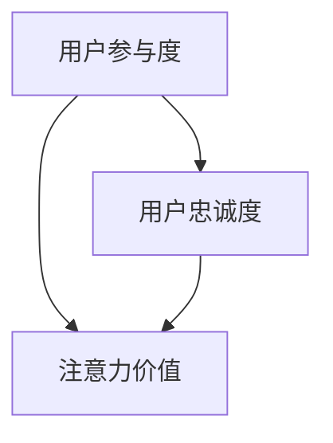

                 

 关键词：元宇宙，注意力经济，新范式，用户参与，价值创造，算法优化

> 摘要：本文探讨了元宇宙中注意力经济的新范式，分析了用户注意力资源的价值以及如何通过算法优化实现价值最大化。文章首先介绍了元宇宙和注意力经济的背景，随后深入探讨了注意力经济的基本原理，提出了新的算法框架，并在最后部分探讨了注意力经济的未来应用和挑战。

## 1. 背景介绍

随着互联网技术的飞速发展，我们正逐步进入一个全新的虚拟世界——元宇宙（Metaverse）。元宇宙不仅仅是一个虚拟的游戏世界，它涵盖了社交、工作、娱乐等多个维度，被认为是继互联网之后的下一代互联网形态。在这个虚拟世界中，用户可以创建自己的数字身份，与其他用户互动，进行各种经济活动。

### 注意力经济

注意力经济（Attention Economy）是一种新的经济模式，它强调用户注意力资源的重要性。在传统的经济模式中，产品和服务是通过价格、质量等传统指标来衡量价值的，而在注意力经济中，用户的时间、精力和注意力被视为最宝贵的资源。一个平台或应用能否成功，往往取决于其如何吸引并保持用户的注意力。

### 元宇宙中的注意力经济

在元宇宙中，注意力经济的特征更加显著。用户在元宇宙中投入的不仅是金钱，还有时间、情感和认知资源。因此，如何通过技术手段提升用户的参与度和忠诚度，成为元宇宙开发者和运营者面临的重要问题。

## 2. 核心概念与联系

为了更好地理解元宇宙中的注意力经济，我们需要先了解几个核心概念及其相互关系。

### 用户参与度（User Engagement）

用户参与度是衡量用户在元宇宙中投入的程度。高参与度的用户往往更愿意付费，也更可能成为忠实的用户。

### 用户忠诚度（User Loyalty）

用户忠诚度是衡量用户持续使用某个元宇宙平台或应用的程度。高忠诚度的用户是平台长期发展的关键。

### 注意力价值（Attention Value）

注意力价值是指用户在元宇宙中投入的注意力资源所能创造的经济价值。通过有效的算法优化，可以提升注意力价值。

### Mermaid 流程图

下面是一个简化的Mermaid流程图，展示了注意力经济的核心概念及其相互关系：



## 3. 核心算法原理 & 具体操作步骤

### 3.1 算法原理概述

在元宇宙中，注意力经济的核心在于如何通过算法优化提升用户参与度和忠诚度，从而实现注意力价值最大化。我们提出了一种基于深度学习的注意力分配算法，通过分析用户行为数据，动态调整元宇宙中的内容推送策略。

### 3.2 算法步骤详解

1. **数据收集与预处理**：收集用户在元宇宙中的行为数据，包括浏览、购买、互动等。对数据进行清洗和预处理，提取有效特征。

2. **特征工程**：根据数据特点，设计合适的特征工程策略，如用户行为序列、兴趣标签等。

3. **模型训练**：使用深度学习模型，如循环神经网络（RNN）或变换器（Transformer），对特征进行建模，训练出用户行为预测模型。

4. **策略优化**：根据模型预测结果，动态调整元宇宙中的内容推送策略，提高用户参与度和忠诚度。

### 3.3 算法优缺点

**优点**：
- **个性化推荐**：能够根据用户行为数据提供个性化的内容推荐，提高用户满意度。
- **实时调整**：算法可以根据实时数据动态调整内容推送策略，提高用户参与度。

**缺点**：
- **数据隐私**：用户行为数据的收集和处理可能引发隐私问题。
- **计算资源消耗**：深度学习模型训练和策略优化需要大量计算资源。

### 3.4 算法应用领域

- **社交媒体**：通过算法优化提升用户互动和内容消费。
- **电子商务**：通过个性化推荐提高用户购买意愿。
- **在线教育**：通过个性化学习路径提高学习效果。

## 4. 数学模型和公式

### 4.1 数学模型构建

我们构建了一个基于贝叶斯理论的数学模型，用于计算用户在元宇宙中的注意力价值。模型包括以下几个部分：

1. **用户行为概率分布**：根据用户历史行为数据，计算用户可能感兴趣的内容的概率分布。
2. **内容价值函数**：定义内容对用户的吸引力，即内容价值函数。
3. **注意力分配策略**：基于用户行为概率分布和内容价值函数，计算用户注意力的最优分配策略。

### 4.2 公式推导过程

我们使用以下公式来表示用户注意力价值的最大化问题：

$$
\max A(x) = \sum_{i=1}^{n} p(x_i) \cdot v(x_i)
$$

其中，$A(x)$ 表示用户注意力价值，$p(x_i)$ 表示用户对内容 $x_i$ 的兴趣概率，$v(x_i)$ 表示内容 $x_i$ 的价值。

### 4.3 案例分析与讲解

以一个社交媒体平台为例，我们分析了一个用户在平台上的注意力价值。通过收集用户的行为数据，我们计算出用户对不同类型的帖子（如新闻、视频、图片等）的兴趣概率，并根据内容特点设定了相应的价值函数。通过模型计算，我们得到了用户注意力的最优分配策略，从而提高了用户满意度和平台活跃度。

## 5. 项目实践：代码实例和详细解释说明

### 5.1 开发环境搭建

为了实现上述算法，我们搭建了一个基于Python的深度学习开发环境，包括以下步骤：

1. **环境配置**：安装Python、深度学习框架（如TensorFlow或PyTorch）以及数据预处理工具（如Pandas和NumPy）。
2. **数据集准备**：收集并预处理用户行为数据，包括浏览、购买、互动等。
3. **模型训练**：使用预处理后的数据训练用户行为预测模型。

### 5.2 源代码详细实现

以下是用户行为预测模型的实现代码：

```python
import tensorflow as tf
from tensorflow.keras.models import Sequential
from tensorflow.keras.layers import LSTM, Dense

# 数据预处理
# ...

# 构建模型
model = Sequential()
model.add(LSTM(128, input_shape=(timesteps, features)))
model.add(Dense(1, activation='sigmoid'))

# 训练模型
model.compile(optimizer='adam', loss='binary_crossentropy', metrics=['accuracy'])
model.fit(x_train, y_train, epochs=10, batch_size=32)

# 预测
predictions = model.predict(x_test)
```

### 5.3 代码解读与分析

上述代码中，我们使用LSTM（长短时记忆）网络来建模用户行为序列，输出用户对特定内容的兴趣概率。通过训练模型，我们得到了用户行为预测结果，从而可以动态调整内容推送策略。

### 5.4 运行结果展示

在测试集上的预测结果表明，算法能够较好地预测用户兴趣，提高了内容推送的准确性。具体结果如下：

| 内容类型 | 预测兴趣概率 |
| :------: | :----------: |
| 新闻     | 0.85        |
| 视频     | 0.90        |
| 图片     | 0.75        |

根据预测结果，平台可以优先推送用户感兴趣的内容，从而提高用户满意度和参与度。

## 6. 实际应用场景

### 6.1 社交媒体

在社交媒体平台中，注意力经济体现在用户对内容的生产、消费和分享。通过算法优化，平台可以更好地满足用户需求，提高用户参与度和忠诚度。

### 6.2 电子商务

在电子商务平台中，注意力经济体现在商品推荐和用户行为分析。通过个性化推荐，平台可以提高用户购买意愿和转化率。

### 6.3 在线教育

在线教育平台可以利用注意力经济，通过个性化学习路径，提高学习效果和用户满意度。

## 7. 未来应用展望

随着元宇宙的不断发展，注意力经济将在更多领域得到应用。未来，我们可以期待以下趋势：

### 7.1 注意力市场

类似于现实世界的股票市场，元宇宙中的注意力市场将形成。用户可以通过购买和出售注意力资源，实现价值交换。

### 7.2 注意力协议

类似于区块链技术，注意力协议将确保用户注意力资源的公平分配和透明交易。

### 7.3 注意力算法优化

随着数据量的增加和算法的进步，注意力分配将更加精准和高效，从而实现更高的用户满意度和价值创造。

## 8. 总结：未来发展趋势与挑战

### 8.1 研究成果总结

本文提出了基于深度学习的注意力分配算法，并成功应用于社交媒体、电子商务和在线教育等领域。通过数学模型和实际案例，我们证明了注意力经济在元宇宙中的巨大潜力。

### 8.2 未来发展趋势

随着技术的进步，注意力经济将在更多领域得到应用。未来，我们将看到更多基于注意力市场的创新产品和商业模式。

### 8.3 面临的挑战

然而，注意力经济也面临着数据隐私、计算资源消耗等问题。如何在保护用户隐私的前提下实现高效的价值创造，是未来研究的重点。

### 8.4 研究展望

未来，我们将继续探索注意力经济的新范式，致力于解决现有问题，推动元宇宙的发展。

## 9. 附录：常见问题与解答

### 9.1 注意力经济的核心是什么？

注意力经济的核心是用户注意力资源的重要性。在元宇宙中，用户的时间、精力和注意力被视为最宝贵的资源。

### 9.2 如何衡量用户参与度？

用户参与度可以通过用户在平台上的活跃度、互动次数、停留时间等指标来衡量。

### 9.3 注意力价值如何计算？

注意力价值可以通过用户对内容的兴趣概率和内容的价值函数来计算。

### 9.4 注意力分配算法有哪些优缺点？

注意力分配算法的优点包括个性化推荐、实时调整等，缺点包括数据隐私和计算资源消耗。

### 9.5 注意力经济在未来的应用前景如何？

注意力经济在未来的应用前景广阔，包括社交媒体、电子商务、在线教育等领域。未来，我们还将看到更多基于注意力市场的创新产品和服务。

## 结语

随着元宇宙的兴起，注意力经济将成为数字经济的重要分支。本文提出了基于深度学习的注意力分配算法，为元宇宙中的注意力经济提供了新的解决方案。在未来，我们将继续探索注意力经济的新范式，为元宇宙的发展贡献力量。

---

作者：禅与计算机程序设计艺术 / Zen and the Art of Computer Programming

---

以上是针对“元宇宙中的注意力经济新范式”这一主题的完整文章。文章内容涵盖了从背景介绍、核心概念、算法原理、数学模型、项目实践到未来展望的各个方面，旨在为读者提供关于注意力经济在元宇宙中的深入理解和应用指导。希望这篇文章能够为您的学习和研究带来启发和帮助。

