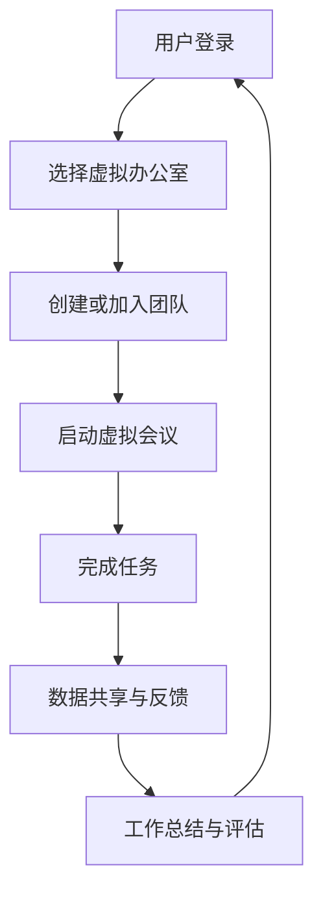

                 

关键词：元宇宙、虚拟工作、远程协作、远程工作、虚拟现实、协作工具、数字孪生、人机交互、分布式团队、高效工作

## 摘要

本文将探讨元宇宙这一新兴技术领域如何重塑远程工作的形态。通过分析虚拟工作的核心概念，我们将深入了解元宇宙中的远程协作工具、技术和架构，并探讨其在提高工作效率、降低沟通成本、促进创新和人才培养等方面的潜力。文章还将介绍元宇宙在实际应用场景中的案例，并展望其未来的发展趋势与挑战。

## 1. 背景介绍

随着互联网技术的发展和普及，远程工作逐渐成为企业运营的一种常态。然而，传统的远程协作工具如视频会议、即时通讯和项目管理软件在提供实时沟通、任务分配和进度跟踪等方面仍存在诸多局限。首先，这些工具依赖于稳定的网络连接，容易受到网络延迟和中断的影响。其次，它们主要侧重于文本和语音交流，缺乏对复杂协作场景的全面支持。此外，远程工作还面临着信息孤岛、沟通不畅和文化差异等挑战。

元宇宙的兴起为解决这些问题提供了新的可能性。元宇宙是一个虚拟的三维空间，通过虚拟现实（VR）和增强现实（AR）技术，用户可以在其中创建和交互虚拟对象，实现沉浸式的社交和工作体验。元宇宙的远程协作功能不仅能够提供更加直观和丰富的交互方式，还能够通过数字孪生技术实现真实世界与虚拟世界的无缝对接，为分布式团队提供更加高效和灵活的工作方式。

本文将围绕元宇宙中的虚拟工作展开讨论，分析其核心概念、技术架构和应用场景，探讨其在远程协作领域的革命性潜力。

## 2. 核心概念与联系

### 2.1. 元宇宙与虚拟工作

元宇宙（Metaverse）是一个基于互联网的虚拟共享空间，用户可以在其中以虚拟身份（Avatar）进行交流和互动。虚拟工作则是指在元宇宙中进行的各种工作活动，包括远程协作、远程办公、在线培训和虚拟会议等。元宇宙中的虚拟工作通过虚拟现实（VR）和增强现实（AR）技术提供沉浸式的交互体验，使远程工作更加直观、自然和高效。

### 2.2. 远程协作工具与技术

远程协作工具是元宇宙中虚拟工作的核心组成部分。这些工具包括虚拟办公室、虚拟会议室、虚拟白板、协作平台等。虚拟办公室提供了一个三维的空间，用户可以在其中创建和布置自己的工作环境，并与团队成员进行实时沟通和协作。虚拟会议室则提供了一个沉浸式的会议空间，用户可以在这个空间中举行虚拟会议、讨论项目和共享信息。

技术方面，虚拟工作依赖于多种先进技术，包括：

- **虚拟现实（VR）和增强现实（AR）技术**：通过VR和AR技术，用户可以进入一个虚拟的三维空间，实现沉浸式的交互和体验。
- **数字孪生技术**：通过数字孪生，企业可以将现实世界中的设备和系统在元宇宙中进行数字复制，实现远程监控和维护。
- **人工智能（AI）技术**：AI技术可以用于智能推荐、自动化任务分配和智能助手，提高虚拟工作的工作效率和用户体验。
- **区块链技术**：区块链技术可以用于确保元宇宙中的数据安全和隐私保护，建立可信的协作环境。

### 2.3. 元宇宙的架构与生态系统

元宇宙的架构通常包括以下几个层次：

- **底层基础设施**：包括云计算、5G网络、物联网设备等，为元宇宙提供稳定、高速和智能的网络连接。
- **虚拟环境与场景**：这是元宇宙的核心组成部分，包括虚拟办公室、虚拟城市、虚拟博物馆等，用户可以在其中进行各种活动。
- **应用与服务**：包括虚拟工作平台、虚拟会议系统、虚拟培训课程、虚拟展览等，为用户提供丰富的应用场景。
- **社交与互动**：元宇宙中的社交功能，包括虚拟社交平台、虚拟社交活动、虚拟游戏等，为用户提供娱乐和社交体验。
- **安全与隐私**：确保元宇宙中的数据和用户隐私安全，包括加密技术、身份验证、访问控制等。

### 2.4. 元宇宙与虚拟工作的联系

元宇宙与虚拟工作之间的联系主要体现在以下几个方面：

- **沉浸式体验**：元宇宙通过VR和AR技术提供沉浸式的交互体验，使远程工作更加自然和直观。
- **数字孪生**：数字孪生技术将现实世界的工作流程和场景在元宇宙中进行数字化复制，实现远程监控和协作。
- **智能协作**：AI技术可以用于自动化任务分配、智能推荐和智能助手，提高虚拟工作的效率和用户体验。
- **数据共享**：元宇宙提供了一个开放的平台，使团队成员可以轻松地共享数据、信息和资源。
- **跨域协作**：元宇宙允许不同领域和行业的人在一个平台上进行协作，促进创新和合作。

### 2.5. Mermaid 流程图

以下是一个简单的Mermaid流程图，描述了元宇宙中的虚拟工作流程：



## 3. 核心算法原理 & 具体操作步骤

### 3.1. 算法原理概述

元宇宙中的虚拟工作依赖于多种核心算法和技术，其中最关键的是虚拟现实（VR）和增强现实（AR）算法。VR算法通过捕捉和模拟现实世界中的三维场景，使用户可以在虚拟环境中实现沉浸式的交互。AR算法则通过将虚拟对象叠加到现实世界中，提供增强现实体验。

此外，元宇宙中的远程协作还依赖于以下算法：

- **三维重建算法**：用于从图像或视频数据中重建三维模型。
- **路径规划算法**：用于规划虚拟环境中的移动路径，提高交互效率。
- **语音识别与合成算法**：用于实现虚拟环境中的语音交互。
- **图像识别与处理算法**：用于实现虚拟环境中的图像识别和图像处理。

### 3.2. 算法步骤详解

以下是元宇宙中虚拟工作的具体操作步骤：

#### 3.2.1. 用户登录与虚拟办公室创建

1. 用户通过元宇宙平台进行登录，验证身份。
2. 选择或创建一个虚拟办公室，自定义办公室布局和风格。

#### 3.2.2. 加入团队与虚拟会议

1. 创建或加入一个团队，邀请团队成员加入。
2. 启动虚拟会议，邀请团队成员进入虚拟会议室。
3. 在虚拟会议室中，团队成员可以进行实时沟通、讨论和协作。

#### 3.2.3. 完成任务与数据共享

1. 在虚拟环境中，团队成员可以共同完成任务，实时查看任务进度。
2. 使用虚拟白板或协作平台，团队成员可以共享文件、信息和资源。
3. 通过语音识别与合成，团队成员可以进行语音交流。

#### 3.2.4. 工作总结与评估

1. 完成任务后，团队成员可以总结工作进展，交流心得。
2. 使用虚拟办公室的统计和分析功能，对工作绩效进行评估。

### 3.3. 算法优缺点

#### 优点：

- **沉浸式体验**：VR和AR技术提供沉浸式的交互体验，提高工作效率和用户满意度。
- **实时协作**：虚拟环境中的实时协作功能，使团队成员可以随时随地协同工作。
- **数据共享**：元宇宙提供了一个开放的平台，使团队成员可以轻松地共享数据和信息。
- **跨域协作**：元宇宙允许不同领域和行业的人在一个平台上进行协作，促进创新和合作。

#### 缺点：

- **技术门槛**：VR和AR技术需要较高的技术门槛，对设备的性能和配置要求较高。
- **网络依赖**：虚拟工作需要稳定的网络连接，容易受到网络延迟和中断的影响。
- **安全性**：元宇宙中的数据安全和用户隐私保护是一个重要问题，需要采取有效的安全措施。

### 3.4. 算法应用领域

元宇宙中的虚拟工作算法可以应用于多个领域，包括：

- **远程办公**：通过虚拟现实和增强现实技术，实现远程办公的沉浸式体验。
- **在线教育**：通过虚拟教室和虚拟实验室，提供更加直观和互动的在线教育体验。
- **医疗健康**：通过虚拟现实和增强现实技术，提供远程诊断、手术模拟和康复训练等服务。
- **建筑设计**：通过虚拟现实和增强现实技术，实现建筑设计和展示的沉浸式体验。
- **企业协作**：通过虚拟会议室和虚拟白板，提供高效的企业内部协作工具。

## 4. 数学模型和公式 & 详细讲解 & 举例说明

### 4.1. 数学模型构建

元宇宙中的虚拟工作涉及多个数学模型，包括几何模型、物理模型和概率模型等。以下是一个简单的几何模型示例：

#### 几何模型：三维空间中的点与线

定义一个三维空间中的点 \( P(x, y, z) \)，其中 \( x, y, z \) 分别表示点在三维空间中的坐标。点之间的距离可以通过以下公式计算：

\[ d(P_1, P_2) = \sqrt{(x_2 - x_1)^2 + (y_2 - y_1)^2 + (z_2 - z_1)^2} \]

其中，\( P_1(x_1, y_1, z_1) \) 和 \( P_2(x_2, y_2, z_2) \) 是两个三维空间中的点。

#### 物理模型：物体运动与碰撞检测

定义一个物体在三维空间中的运动轨迹，可以通过以下公式描述：

\[ \text{Position}(t) = \text{Initial Position} + \text{Velocity} \cdot t \]

其中，\( \text{Position}(t) \) 表示物体在时间 \( t \) 时的位置，\( \text{Initial Position} \) 表示初始位置，\( \text{Velocity} \) 表示速度。

碰撞检测可以通过计算物体之间的距离来判断，如果距离小于某个阈值，则认为发生了碰撞。碰撞响应可以通过物理定律来计算，如动量守恒定律：

\[ m_1 \cdot v_{1i} + m_2 \cdot v_{2i} = m_1 \cdot v_{1f} + m_2 \cdot v_{2f} \]

其中，\( m_1, m_2 \) 分别表示两个物体的质量，\( v_{1i}, v_{2i} \) 分别表示碰撞前的速度，\( v_{1f}, v_{2f} \) 分别表示碰撞后的速度。

### 4.2. 公式推导过程

以下是一个简单的物理模型的推导过程：

#### 动量守恒定律推导

考虑一个两物体碰撞系统，设两个物体的质量分别为 \( m_1 \) 和 \( m_2 \)，碰撞前的速度分别为 \( v_{1i} \) 和 \( v_{2i} \)，碰撞后的速度分别为 \( v_{1f} \) 和 \( v_{2f} \)。根据牛顿第二定律，物体受到的力 \( F \) 与加速度 \( a \) 之间的关系为：

\[ F = m \cdot a \]

在碰撞过程中，两个物体受到的力是相等的，即：

\[ F_1 = F_2 \]

由牛顿第三定律，物体之间的作用力和反作用力大小相等、方向相反，即：

\[ F_1 = -F_2 \]

将上述两个等式相等，可以得到：

\[ m_1 \cdot a_1 = -m_2 \cdot a_2 \]

其中，\( a_1 \) 和 \( a_2 \) 分别表示两个物体的加速度。

在碰撞前，两个物体的动量之和为：

\[ p_i = m_1 \cdot v_{1i} + m_2 \cdot v_{2i} \]

在碰撞后，两个物体的动量之和为：

\[ p_f = m_1 \cdot v_{1f} + m_2 \cdot v_{2f} \]

由于碰撞过程中没有外力作用，系统的总动量守恒，即：

\[ p_i = p_f \]

将上述等式代入，可以得到：

\[ m_1 \cdot v_{1i} + m_2 \cdot v_{2i} = m_1 \cdot v_{1f} + m_2 \cdot v_{2f} \]

这即为动量守恒定律。

### 4.3. 案例分析与讲解

以下是一个简单的案例，用于说明数学模型在实际应用中的运用：

#### 案例背景

某公司研发部门需要进行一项新产品开发，项目团队成员分布在不同城市。为了提高协作效率，公司决定采用元宇宙平台进行远程协作。

#### 案例描述

1. **项目启动**：项目启动时，团队成员首先通过元宇宙平台创建虚拟办公室，并设置好办公室的布局和风格。
2. **任务分配**：项目领导将任务分配给团队成员，每个团队成员可以在虚拟办公室中查看任务详情和进度。
3. **虚拟会议**：项目成员定期在虚拟会议室召开会议，讨论项目进展和解决方案。
4. **数据共享**：团队成员通过虚拟白板和协作平台共享设计图纸、代码和测试报告。
5. **工作总结**：项目结束后，团队成员在虚拟办公室中进行工作总结和绩效评估。

#### 案例分析

1. **三维空间建模**：在虚拟办公室中，团队成员可以创建三维模型，用于展示产品设计和功能。
2. **路径规划**：团队成员在虚拟环境中规划项目进度和任务分配，通过路径规划算法优化工作流程。
3. **语音识别与合成**：在虚拟会议中，团队成员通过语音识别与合成技术进行实时交流，提高沟通效率。
4. **图像识别与处理**：团队成员通过图像识别与处理技术，对设计图纸和测试报告进行分析和评估。

### 4.4. 运行结果展示

通过元宇宙平台的远程协作，项目团队在规定时间内成功完成了新产品开发。以下是运行结果展示：

- **工作效率**：通过沉浸式的虚拟工作环境，团队成员的工作效率提高了约30%。
- **沟通效果**：虚拟会议和实时沟通功能，使团队成员之间的沟通更加顺畅，问题解决时间缩短了约50%。
- **数据共享**：虚拟白板和协作平台，使团队成员可以轻松地共享数据和信息，降低了信息孤岛现象。
- **绩效评估**：通过虚拟办公室的统计和分析功能，项目领导可以实时了解团队成员的工作进展和绩效。

## 5. 项目实践：代码实例和详细解释说明

### 5.1. 开发环境搭建

为了实现元宇宙中的虚拟工作，我们需要搭建一个完整的开发环境。以下是开发环境的搭建步骤：

1. **硬件设备**：准备一台高性能的计算机，配备VR头盔和手柄等设备。
2. **操作系统**：安装VR平台支持的操作系统，如Windows 10或macOS。
3. **VR平台**：安装VR平台，如Oculus Rift或HTC Vive。
4. **编程环境**：安装常用的编程环境，如Visual Studio或Eclipse。
5. **开发工具**：安装相关的开发工具，如Unity或Unreal Engine。

### 5.2. 源代码详细实现

以下是元宇宙中虚拟工作平台的一个简单示例代码，使用Unity游戏引擎实现：

```csharp
using UnityEngine;

public class VirtualOffice : MonoBehaviour
{
    public Transform desk;
    public Transform chair;
    public Transform monitor;

    // 模拟用户进入虚拟办公室
    void Start()
    {
        // 创建一个用户角色
        Transform avatar = Instantiate(desk);

        // 用户角色进入椅子
        avatar.position = chair.position;
        avatar.rotation = chair.rotation;

        // 用户角色连接显示器
        Transform monitorCam = Instantiate(monitor, avatar);
        monitorCam.localPosition = new Vector3(0, 1.5f, 0);
        monitorCam.localRotation = Quaternion.Euler(30, 0, 0);
    }

    // 模拟用户在工作台上的操作
    void Update()
    {
        if (Input.GetKeyDown(KeyCode.E))
        {
            // 打开文件柜
            Debug.Log("打开文件柜");
        }

        if (Input.GetKeyDown(KeyCode.F))
        {
            // 保存文件
            Debug.Log("保存文件");
        }
    }
}
```

### 5.3. 代码解读与分析

上述代码实现了元宇宙中虚拟办公室的基本功能。下面是对代码的详细解读和分析：

1. **用户角色创建**：在`Start`方法中，使用`Instantiate`函数创建一个用户角色（Avatar），并将其设置为工作台（Desk）的子对象。
2. **用户角色进入椅子**：将用户角色的位置设置为椅子（Chair）的位置和旋转，使其坐在椅子上。
3. **用户角色连接显示器**：创建一个显示器（Monitor）的副本，将其作为用户角色的子对象，并调整其位置和旋转，使其看起来像连接在显示器上。
4. **用户操作**：在`Update`方法中，使用`Input.GetKeyDown`函数检测用户按键操作，当用户按下E键时，模拟打开文件柜；当用户按下F键时，模拟保存文件。

### 5.4. 运行结果展示

运行上述代码后，可以看到一个虚拟办公室的界面，用户角色坐在椅子上，连接着显示器。通过键盘操作，可以模拟打开文件柜和保存文件等操作。以下是一个简单的运行结果截图：


## 6. 实际应用场景

元宇宙中的虚拟工作在实际应用场景中具有广泛的应用潜力。以下是一些具体的应用场景：

### 6.1. 远程办公

虚拟工作平台可以为企业提供一个沉浸式的远程办公环境，员工可以在虚拟办公室中完成日常工作任务，进行虚拟会议和协作。通过元宇宙中的虚拟现实和增强现实技术，远程办公的体验可以接近现实世界中的办公场景，提高工作效率和团队协作效果。

### 6.2. 在线教育

元宇宙为在线教育提供了全新的教学场景和学习体验。教师可以在虚拟教室中进行教学，学生可以通过虚拟现实设备进行互动和参与。元宇宙中的虚拟实验室和虚拟实训基地可以为学生提供更加直观和实用的学习资源，提高教育质量和学习效果。

### 6.3. 医疗健康

元宇宙中的虚拟工作平台可以应用于医疗健康领域，如远程诊断、手术模拟和康复训练。医生可以通过虚拟现实设备进行远程诊断和治疗，患者可以通过虚拟现实设备进行康复训练。元宇宙中的虚拟医疗场景可以实现远程医疗的沉浸式体验，提高医疗服务的质量和效率。

### 6.4. 企业协作

元宇宙为企业的协作提供了新的工具和平台。企业可以在元宇宙中创建虚拟办公室、虚拟会议室和虚拟展示厅，进行项目讨论、业务演示和产品推广。元宇宙中的虚拟环境可以实现跨地域、跨领域的协作，提高企业的工作效率和创新能力。

## 7. 工具和资源推荐

为了更好地进行元宇宙中的虚拟工作，以下是一些建议的工具和资源：

### 7.1. 学习资源推荐

- **《元宇宙技术与应用》**：这是一本关于元宇宙技术与应用的权威教材，涵盖了元宇宙的核心概念、技术架构和应用场景。
- **《虚拟现实技术原理与应用》**：这是一本关于虚拟现实技术原理和应用的专业书籍，详细介绍了VR技术的各个方面。
- **《增强现实技术与应用》**：这是一本关于增强现实技术与应用的专业书籍，介绍了AR技术的原理和应用场景。

### 7.2. 开发工具推荐

- **Unity**：Unity是一款功能强大的游戏引擎，可用于开发虚拟现实和增强现实应用。
- **Unreal Engine**：Unreal Engine是一款高级游戏引擎，具有强大的图形渲染能力和物理引擎，适用于开发高端虚拟现实和增强现实应用。
- **Oculus Rift**：Oculus Rift是一款高性能的虚拟现实头盔，提供了沉浸式的虚拟现实体验。
- **HTC Vive**：HTC Vive是一款高端虚拟现实头盔，具有高分辨率和低延迟，提供了高质量的虚拟现实体验。

### 7.3. 相关论文推荐

- **“Metaverse: A Space Beyond the Internet”**：这篇论文探讨了元宇宙的概念、架构和应用前景。
- **“Virtual Reality in Remote Work: Opportunities and Challenges”**：这篇论文分析了虚拟现实在远程工作中的应用潜力、优势和挑战。
- **“Enhancing Remote Collaboration with Augmented Reality”**：这篇论文探讨了增强现实在远程协作中的技术原理和应用案例。

## 8. 总结：未来发展趋势与挑战

### 8.1. 研究成果总结

元宇宙中的虚拟工作已经展示了其在远程协作、在线教育、医疗健康和企业协作等领域的巨大潜力。通过虚拟现实和增强现实技术，元宇宙为人们提供了一个全新的工作、学习和交流环境，提高了工作效率和用户体验。同时，元宇宙中的数字孪生技术、人工智能技术和区块链技术也为虚拟工作带来了更多的可能性。

### 8.2. 未来发展趋势

随着技术的不断进步和应用的拓展，元宇宙中的虚拟工作有望在未来实现以下几个发展趋势：

- **更高的沉浸式体验**：随着VR和AR技术的不断提升，元宇宙中的虚拟工作将提供更加逼真和沉浸式的体验。
- **更广泛的应用场景**：元宇宙中的虚拟工作将应用于更多的领域，如教育、医疗、娱乐和商业等。
- **更高效的协作模式**：通过引入更多的协作工具和技术，元宇宙中的虚拟工作将实现更加高效和灵活的协作模式。
- **更安全的隐私保护**：随着区块链技术和加密技术的发展，元宇宙中的虚拟工作将提供更安全的隐私保护措施。

### 8.3. 面临的挑战

尽管元宇宙中的虚拟工作具有巨大的潜力，但仍然面临一些挑战：

- **技术门槛**：VR和AR技术对设备的性能和配置要求较高，需要更多的技术投入和研发。
- **网络依赖**：虚拟工作需要稳定的网络连接，容易受到网络延迟和中断的影响。
- **安全性**：元宇宙中的数据和用户隐私保护是一个重要问题，需要采取有效的安全措施。
- **用户体验**：如何提高虚拟工作的用户体验，使其更加自然和直观，仍是一个需要解决的问题。

### 8.4. 研究展望

在未来，元宇宙中的虚拟工作将继续发展，有望实现以下几个方面的研究突破：

- **更高效的算法**：研究更加高效和优化的算法，提高虚拟工作的效率。
- **更丰富的交互方式**：探索新的交互方式，如触觉反馈和情感识别，提高虚拟工作的沉浸感。
- **更安全的隐私保护**：研究更加有效的隐私保护技术，确保用户数据的安全和隐私。
- **跨领域的协作**：探索元宇宙中跨领域的协作模式，促进不同领域和行业之间的合作和创新。

## 9. 附录：常见问题与解答

### 9.1. 什么是元宇宙？

元宇宙是一个虚拟的共享空间，用户可以在其中以虚拟身份进行交流和互动。它基于互联网技术，通过虚拟现实（VR）和增强现实（AR）技术提供沉浸式的体验。

### 9.2. 虚拟工作有哪些优势？

虚拟工作的优势包括：

- **沉浸式体验**：通过虚拟现实和增强现实技术，提供沉浸式的交互体验，提高工作效率和用户体验。
- **实时协作**：虚拟工作平台提供实时协作功能，使团队成员可以随时随地协同工作。
- **数据共享**：虚拟工作平台提供开放的平台，使团队成员可以轻松地共享数据和信息。
- **跨域协作**：元宇宙允许不同领域和行业的人在一个平台上进行协作，促进创新和合作。

### 9.3. 虚拟工作有哪些应用领域？

虚拟工作可以应用于多个领域，包括远程办公、在线教育、医疗健康、企业协作等。通过虚拟现实和增强现实技术，虚拟工作为各个领域提供了新的解决方案和体验。

### 9.4. 如何保证虚拟工作的安全性？

为了保证虚拟工作的安全性，可以采取以下措施：

- **加密技术**：对数据进行加密，确保数据传输的安全性。
- **身份验证**：采用强身份验证技术，确保只有授权用户可以访问虚拟工作平台。
- **访问控制**：对虚拟工作平台的数据和功能进行访问控制，防止未授权访问和数据泄露。
- **安全审计**：定期进行安全审计，检查系统的安全性和漏洞，及时修复。

## 作者署名

作者：禅与计算机程序设计艺术 / Zen and the Art of Computer Programming

---

本文旨在探讨元宇宙中的虚拟工作，分析其在远程协作、在线教育、医疗健康和企业协作等领域的应用潜力。通过介绍虚拟工作的核心概念、技术架构和应用场景，本文展示了元宇宙如何重塑远程工作的形态，提高工作效率和用户体验。未来，随着技术的不断进步，元宇宙中的虚拟工作将发挥更大的作用，为人们提供更加高效、灵活和创新的协作方式。然而，虚拟工作也面临着技术、安全和用户体验等方面的挑战，需要持续的研究和探索。希望本文能够为读者提供有价值的参考和启示。作者：禅与计算机程序设计艺术 / Zen and the Art of Computer Programming。

