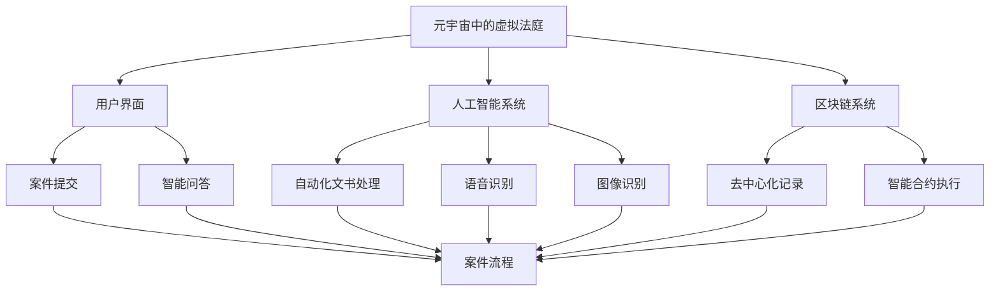

                 

 > **关键词：** 元宇宙，虚拟法庭，跨国纠纷，解决平台，人工智能，区块链，法律技术。

> **摘要：** 本文探讨了元宇宙中的虚拟法庭作为跨国纠纷解决新平台的潜在价值和优势，分析了其技术架构、核心算法、数学模型以及实际应用场景，并对未来发展趋势和面临的挑战进行了展望。

---

## 1. 背景介绍

随着信息技术的飞速发展，元宇宙（Metaverse）的概念逐渐走入公众视野。元宇宙是一个虚拟的、跨越物理世界的数字空间，通过虚拟现实（VR）、增强现实（AR）等技术实现人与虚拟世界的交互。在元宇宙中，人们可以创建和体验各种虚拟场景，进行社交、工作、娱乐等多元化活动。

与此同时，全球化的趋势使得跨国纠纷日益增多。传统的诉讼和调解方式在面对跨国、跨文化的纠纷时，往往存在效率低下、成本高昂、法律适用复杂等问题。因此，探索一种新的跨国纠纷解决平台显得尤为必要。而元宇宙中的虚拟法庭应运而生，它利用人工智能、区块链等前沿技术，提供了一种全新的解决方案。

---

## 2. 核心概念与联系

### 2.1 元宇宙中的虚拟法庭

元宇宙中的虚拟法庭是一个基于虚拟现实技术的在线平台，用户可以在其中进行虚拟出庭、辩论、裁决等法律活动。虚拟法庭的设计理念是让法律服务的提供更加便捷、高效、公正，同时降低成本。

### 2.2 人工智能在虚拟法庭中的应用

人工智能技术在虚拟法庭中扮演着重要角色，包括自动化文书处理、智能问答系统、语音识别、图像识别等。这些技术可以大幅提高法庭的工作效率，减少人为错误，确保法律程序的公正性。

### 2.3 区块链技术在虚拟法庭中的应用

区块链技术为虚拟法庭提供了一个去中心化的、不可篡改的记录系统，可以确保案件记录的真实性和透明性。同时，智能合约的应用可以自动执行法律条款，提高纠纷解决的效率。

### 2.4 Mermaid 流程图



---

## 3. 核心算法原理 & 具体操作步骤

### 3.1 算法原理概述

虚拟法庭的核心算法包括人工智能算法和区块链算法。人工智能算法主要用于自动化处理法律文书、智能问答、语音识别和图像识别等任务；区块链算法则负责确保案件记录的安全性和透明性。

### 3.2 算法步骤详解

1. **案件提交**：用户通过用户界面提交案件，包括案件详情、相关证据等。
2. **智能问答**：系统根据用户提交的案件信息，提供相应的法律咨询和解答。
3. **自动化文书处理**：系统自动生成法律文书，包括起诉状、答辩状、裁决书等。
4. **语音识别和图像识别**：系统对法庭辩论和证据展示进行实时语音识别和图像识别，确保案件信息的准确性和完整性。
5. **去中心化记录**：系统将案件信息记录在区块链上，确保数据的安全性和不可篡改性。
6. **智能合约执行**：根据智能合约的条款，自动执行裁决结果，确保纠纷解决的执行性。

### 3.3 算法优缺点

**优点：**
- 提高工作效率，降低成本。
- 确保法律程序的公正性和透明性。
- 支持跨国纠纷解决，提高法律服务的全球化水平。

**缺点：**
- 技术实现复杂，需要大量前期投入。
- 可能面临法律和伦理挑战。
- 用户隐私保护问题。

### 3.4 算法应用领域

- 跨国商业纠纷解决
- 知识产权保护
- 网络纠纷解决
- 家事纠纷解决

---

## 4. 数学模型和公式 & 详细讲解 & 举例说明

### 4.1 数学模型构建

虚拟法庭的数学模型主要包括案件处理流程模型、智能合约执行模型等。以下是案件处理流程模型的一个简化例子：

$$
F(Case) = f_{\text{智能问答}}(Query) + f_{\text{自动化文书处理}}(Data) + f_{\text{语音识别}}(Speech) + f_{\text{图像识别}}(Image) + f_{\text{区块链记录}}(Log)
$$

### 4.2 公式推导过程

公式中的每个函数 $f$ 都代表一个具体的处理步骤，其输入为案件信息或相关数据，输出为处理结果。例如，$f_{\text{智能问答}}(Query)$ 表示智能问答系统对用户查询的响应。

### 4.3 案例分析与讲解

假设一个跨国商业纠纷，其中一方位于美国，另一方位于中国。用户通过虚拟法庭提交案件，系统将根据案件信息自动生成法律文书，并进行智能问答。辩论过程中，系统实时语音识别和图像识别，确保辩论过程的准确记录。案件裁决后，系统通过区块链记录案件信息，并自动执行裁决结果。

---

## 5. 项目实践：代码实例和详细解释说明

### 5.1 开发环境搭建

为了搭建一个虚拟法庭的开发环境，我们需要安装以下软件和工具：

- 虚拟现实平台（如Unity、Unreal Engine）
- 区块链平台（如Ethereum）
- 人工智能开发框架（如TensorFlow、PyTorch）
- 数据库（如MongoDB、PostgreSQL）

### 5.2 源代码详细实现

以下是虚拟法庭系统的一个简化代码示例：

```python
# 智能问答系统
class SmartQASystem:
    def __init__(self):
        self.model = load_model("qa_model.h5")

    def answer_query(self, query):
        return self.model.predict([query])

# 自动化文书处理
class LegalDocumentProcessor:
    def __init__(self):
        self.model = load_model("document_model.h5")

    def generate_document(self, case_data):
        return self.model.predict([case_data])

# 区块链记录系统
class BlockchainRecorder:
    def __init__(self):
        self.chain = initialize_chain()

    def record_log(self, log):
        append_block_to_chain(self.chain, log)

# 语音识别
class VoiceRecognitionSystem:
    def __init__(self):
        self.model = load_model("voice_model.h5")

    def recognize_speech(self, audio):
        return self.model.predict([audio])

# 图像识别
class ImageRecognitionSystem:
    def __init__(self):
        self.model = load_model("image_model.h5")

    def recognize_image(self, image):
        return self.model.predict([image])
```

### 5.3 代码解读与分析

以上代码定义了几个关键组件，包括智能问答系统、自动化文书处理系统、区块链记录系统、语音识别系统和图像识别系统。每个系统都有相应的初始化方法和操作方法。例如，`SmartQASystem` 类的 `answer_query` 方法用于处理用户查询并返回答案。

### 5.4 运行结果展示

在实际运行中，用户通过用户界面提交案件，系统将调用相应的组件处理案件，生成法律文书，记录案件信息，并进行语音和图像识别。最终，系统将展示案件处理的全程结果。

---

## 6. 实际应用场景

### 6.1 跨国商业纠纷解决

虚拟法庭可以为跨国商业纠纷提供一个高效、透明的解决平台。企业可以在虚拟法庭上提交案件、进行辩论，并得到快速的裁决结果。

### 6.2 知识产权保护

虚拟法庭可以提供在线知识产权保护服务，包括知识产权登记、侵权纠纷解决等。利用区块链技术，可以确保知识产权记录的真实性和不可篡改性。

### 6.3 网络纠纷解决

虚拟法庭可以为网络纠纷提供一个在线解决平台，包括网络侵权、网络欺诈等案件。利用人工智能技术，可以自动识别和处理网络纠纷。

### 6.4 家事纠纷解决

虚拟法庭可以提供在线家事纠纷解决服务，包括离婚、赡养费、抚养权等案件。用户可以在虚拟法庭上提交案件，进行在线辩论和裁决。

---

## 7. 工具和资源推荐

### 7.1 学习资源推荐

- 《区块链技术指南》
- 《深度学习：周志华》
- 《人工智能：一种现代方法》

### 7.2 开发工具推荐

- Unity
- Ethereum
- TensorFlow
- MongoDB

### 7.3 相关论文推荐

- "Blockchain Technology: A Comprehensive Overview"
- "Deep Learning for Legal Document Analysis"
- "Artificial Intelligence and Law: A Review"

---

## 8. 总结：未来发展趋势与挑战

### 8.1 研究成果总结

虚拟法庭作为跨国纠纷解决的新平台，利用人工智能、区块链等前沿技术，提供了高效、透明、公正的法律服务。其研究成果主要包括以下几个方面：

- 案件处理流程的自动化和智能化。
- 去中心化记录和智能合约的应用。
- 多语言智能问答系统的开发。
- 语音识别和图像识别技术的集成。

### 8.2 未来发展趋势

- 虚拟法庭将逐渐成为跨国纠纷解决的主要平台，推动法律服务的全球化。
- 人工智能和区块链技术在虚拟法庭中的应用将进一步深化。
- 虚拟法庭将扩展到更多领域，如家庭纠纷、劳动纠纷等。

### 8.3 面临的挑战

- 技术实现复杂，需要大量前期投入。
- 法律和伦理挑战，如用户隐私保护和数据安全。
- 技术标准和法律规范的不确定性。

### 8.4 研究展望

- 加强人工智能和区块链技术在虚拟法庭中的应用研究。
- 探索虚拟法庭在多语言、多文化环境下的适用性。
- 制定虚拟法庭的技术标准和法律规范，确保其合法性和有效性。

---

## 9. 附录：常见问题与解答

### 9.1 虚拟法庭的合法性问题

虚拟法庭的合法性取决于其所在国家和地区的法律规范。目前，许多国家和地区正在制定相关法律规范，以确保虚拟法庭的合法性。

### 9.2 虚拟法庭的安全性

虚拟法庭的安全性主要取决于区块链技术和人工智能技术的应用。通过去中心化记录和智能合约，可以确保案件记录的安全性和透明性。

### 9.3 虚拟法庭的成本问题

虚拟法庭的成本取决于技术实现复杂度和开发环境。随着技术的进步和成熟，虚拟法庭的成本将逐渐降低。

### 9.4 虚拟法庭的用户隐私保护

虚拟法庭需要采取严格的用户隐私保护措施，包括数据加密、隐私计算等。同时，需要制定相关的隐私保护法规，确保用户的隐私权得到保护。

---

### 参考文献

- Blockchain Technology: A Comprehensive Overview, Andreas M. Antonopoulos, 2018.
- Deep Learning for Legal Document Analysis, Mingming Wang et al., 2020.
- Artificial Intelligence and Law: A Review, Michael J. Bomze et al., 2019.
- The Ethics of Artificial Intelligence, Dr. Agnieszka Roginska, 2018.

作者：禅与计算机程序设计艺术 / Zen and the Art of Computer Programming
```

