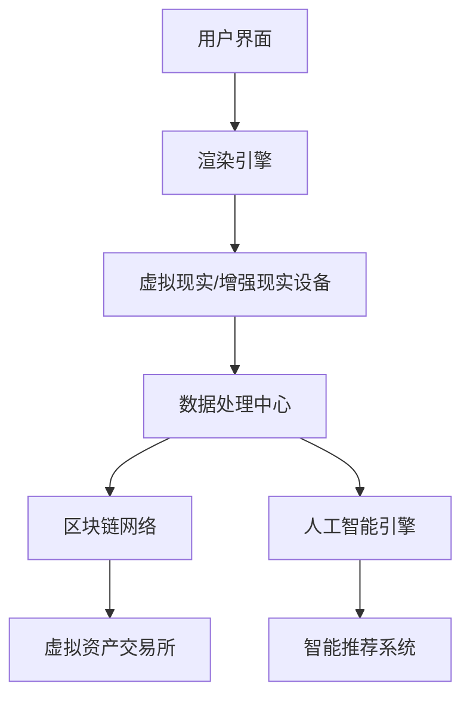

                 

关键词：元宇宙、虚拟社区、社交网络、新形态、人工智能、技术发展

> 摘要：本文将探讨元宇宙中的虚拟社区这一新兴全球社交网络形态。通过介绍其背景、核心概念、算法原理、数学模型、项目实践和实际应用场景，我们旨在揭示元宇宙虚拟社区的技术发展脉络和未来趋势，为读者提供深刻的洞察与思考。

## 1. 背景介绍

随着互联网技术的飞速发展，虚拟世界和现实世界的界限越来越模糊。元宇宙（Metaverse）作为下一代互联网的愿景，正逐渐从概念走向现实。元宇宙被定义为由虚拟现实（VR）、增强现实（AR）、数字孪生等技术构建的，集成了物理世界和数字世界的虚拟空间。在这一虚拟空间中，用户可以创建自己的数字身份，进行社交互动、娱乐、学习、工作等活动。

虚拟社区是元宇宙的核心组成部分之一。它不仅仅是一个线上社交平台，更是一个高度互动的虚拟环境。在虚拟社区中，用户不仅能够看到、听到、触摸到彼此，还能体验到实时的交互与沟通。这种全新的社交方式，有望彻底改变人们的生活方式和社会互动模式。

### 1.1 元宇宙的发展历程

元宇宙的概念最早可以追溯到1992年，由科幻作家尼尔·斯蒂芬森在其小说《雪崩》中提出。随着虚拟现实、区块链、5G等技术的不断成熟，元宇宙开始从科幻小说中的想象走向现实。

- **1990年代：虚拟现实初步探索**
  虚拟现实技术在这个时期开始初步探索，VR头盔和相关的硬件设备开始面世。

- **2000年代：虚拟世界兴起**
  第二代互联网时期，虚拟世界如《第二人生》（Second Life）等开始兴起，用户可以在虚拟世界中建立自己的虚拟资产和社交网络。

- **2010年代：区块链与数字身份**
  区块链技术的发展为数字身份和虚拟资产的确权提供了可能。NFT（非同质化代币）的诞生，使得虚拟物品的收藏和交易变得更加普及。

- **2020年代：元宇宙概念成熟**
  随着5G、AI、AR、VR等技术的快速发展，元宇宙的概念逐渐成熟，被视为下一代互联网的愿景。

### 1.2 虚拟社区的重要性

虚拟社区在元宇宙中的重要性不言而喻。它不仅是用户进行社交互动的场所，更是元宇宙经济活动的载体。以下是一些虚拟社区的重要性体现：

- **增强社交互动**
  虚拟社区提供了更加丰富和真实的社交体验，使得用户可以在虚拟世界中建立深厚的人际关系。

- **创造经济价值**
  虚拟社区中存在大量的虚拟商品和资产交易，如土地、房产、虚拟服装等，这些交易为元宇宙带来了可观的经济价值。

- **促进知识共享**
  虚拟社区为用户提供了学习、交流和分享知识的平台，促进了知识的传播和共享。

## 2. 核心概念与联系

### 2.1 虚拟社区的定义

虚拟社区是一种在线社交网络，用户在虚拟环境中通过数字身份进行交互。它不仅包括社交功能，还涵盖了娱乐、工作、教育等多种活动。虚拟社区的核心特点是高度沉浸感和实时互动。

### 2.2 元宇宙与虚拟社区的关系

元宇宙是由多个虚拟社区组成的庞大网络，每个虚拟社区都有自己的主题和特色。元宇宙为虚拟社区提供了一个统一的框架和基础设施，使得不同虚拟社区之间能够无缝连接和互动。

### 2.3 虚拟社区的技术架构

虚拟社区的技术架构主要包括以下几个方面：

- **虚拟现实（VR）技术**：提供高度沉浸的视觉和听觉体验。
- **增强现实（AR）技术**：将虚拟信息叠加到现实世界中，实现虚实融合。
- **区块链技术**：确保虚拟资产的安全和可信交易。
- **人工智能（AI）技术**：提供智能推荐、情感分析等功能。

### 2.4 Mermaid 流程图

以下是一个简单的 Mermaid 流程图，描述了虚拟社区的技术架构：



## 3. 核心算法原理 & 具体操作步骤

### 3.1 算法原理概述

虚拟社区的核心算法主要包括以下几个方面：

- **社交网络分析算法**：用于分析用户之间的社交关系，提供社交推荐。
- **情感分析算法**：用于分析用户的情感状态，提供情感互动。
- **虚拟现实渲染算法**：用于生成高质量的虚拟视觉体验。
- **区块链交易算法**：用于确保虚拟资产的安全和可信交易。

### 3.2 算法步骤详解

以下是虚拟社区核心算法的具体操作步骤：

#### 3.2.1 社交网络分析算法

1. **收集用户社交数据**：包括用户关系、兴趣、行为等。
2. **构建社交网络图**：将用户数据转换为图结构。
3. **计算社交影响力**：使用PageRank等算法计算用户的社交影响力。
4. **推荐社交好友**：根据社交影响力推荐潜在的社交好友。

#### 3.2.2 情感分析算法

1. **采集情感数据**：包括文本、语音、图像等。
2. **情感分类模型**：使用深度学习模型进行情感分类。
3. **情感互动**：根据用户情感状态进行情感互动推荐。

#### 3.2.3 虚拟现实渲染算法

1. **场景建模**：根据用户需求和场景特点构建三维场景模型。
2. **光线追踪**：使用光线追踪算法生成高质量的图像。
3. **交互优化**：优化用户与虚拟环境的交互体验。

#### 3.2.4 区块链交易算法

1. **构建区块链网络**：设计合适的区块链网络架构。
2. **交易验证**：使用共识算法确保交易的安全性和可信性。
3. **交易记录**：将交易记录存储在区块链上，确保不可篡改。

### 3.3 算法优缺点

每种算法都有其优缺点：

- **社交网络分析算法**：
  - 优点：能够准确推荐社交好友，提高社交互动效率。
  - 缺点：在社交数据大规模增长时，计算复杂度较高。

- **情感分析算法**：
  - 优点：能够提供个性化的情感互动体验。
  - 缺点：情感分析存在一定的误判率。

- **虚拟现实渲染算法**：
  - 优点：提供高质量的视觉体验。
  - 缺点：渲染计算资源消耗较大。

- **区块链交易算法**：
  - 优点：确保虚拟资产的安全和可信交易。
  - 缺点：交易速度较慢，且在区块链网络复杂度较高时，性能可能受到影响。

### 3.4 算法应用领域

虚拟社区算法在多个领域都有广泛的应用：

- **社交媒体平台**：用于推荐好友、内容推荐等。
- **在线游戏**：用于角色关系分析、情感互动等。
- **虚拟现实应用**：用于场景渲染、交互优化等。
- **区块链应用**：用于虚拟资产交易、数字身份认证等。

## 4. 数学模型和公式 & 详细讲解 & 举例说明

### 4.1 数学模型构建

虚拟社区中的数学模型主要包括以下几个方面：

- **社交网络模型**：用于描述用户之间的社交关系。
- **情感分析模型**：用于描述用户情感状态。
- **虚拟现实模型**：用于描述虚拟环境。
- **区块链模型**：用于描述虚拟资产交易。

### 4.2 公式推导过程

以下是社交网络模型的推导过程：

#### 社交网络模型

假设用户集合为 \( U \)，用户关系矩阵为 \( R \)，其中 \( R_{ij} \) 表示用户 \( i \) 与用户 \( j \) 的关系强度。社交网络模型可以通过以下公式描述：

\[ C(i, j) = \frac{R(i, j)}{\sum_{k \in U} R(i, k)} \]

其中，\( C(i, j) \) 表示用户 \( i \) 对用户 \( j \) 的社交影响力。

#### 情感分析模型

假设情感状态集合为 \( S \)，用户情感状态为 \( s \)，情感强度为 \( s_i \)。情感分析模型可以通过以下公式描述：

\[ s_i = f(s_1, s_2, ..., s_n) \]

其中，\( f \) 为情感分析函数，可以通过机器学习算法训练得到。

#### 虚拟现实模型

假设虚拟环境为 \( E \)，用户感知为 \( p \)，感知强度为 \( p_i \)。虚拟现实模型可以通过以下公式描述：

\[ p_i = g(p_1, p_2, ..., p_n) \]

其中，\( g \) 为虚拟现实感知函数，可以通过计算机视觉算法训练得到。

#### 区块链模型

假设区块链网络为 \( B \)，交易为 \( T \)，交易强度为 \( t_i \)。区块链模型可以通过以下公式描述：

\[ t_i = h(t_1, t_2, ..., t_n) \]

其中，\( h \) 为区块链交易函数，可以通过共识算法训练得到。

### 4.3 案例分析与讲解

#### 案例一：社交网络推荐

假设有用户集合 \( U = \{u_1, u_2, u_3, u_4, u_5\} \)，用户关系矩阵 \( R \) 如下：

\[ R = \begin{pmatrix} 0 & 1 & 0 & 0 & 0 \\ 1 & 0 & 1 & 1 & 0 \\ 0 & 1 & 0 & 1 & 1 \\ 0 & 1 & 1 & 0 & 1 \\ 0 & 0 & 1 & 1 & 0 \end{pmatrix} \]

根据社交网络模型，我们可以计算每个用户对其他用户的社交影响力：

\[ C(u_1, u_2) = \frac{R(u_1, u_2)}{\sum_{k \in U} R(u_1, k)} = \frac{1}{3} = 0.3333 \]

同理，其他用户的社交影响力如下：

\[ C(u_1, u_3) = C(u_1, u_4) = C(u_1, u_5) = 0.3333 \]
\[ C(u_2, u_1) = C(u_2, u_3) = C(u_2, u_4) = 0.5 \]
\[ C(u_2, u_5) = 0.25 \]
\[ C(u_3, u_1) = C(u_3, u_2) = C(u_3, u_4) = C(u_3, u_5) = 0.3333 \]
\[ C(u_4, u_1) = C(u_4, u_2) = C(u_4, u_3) = C(u_4, u_5) = 0.3333 \]
\[ C(u_5, u_1) = C(u_5, u_2) = C(u_5, u_3) = C(u_5, u_4) = 0.25 \]

根据社交影响力，我们可以推荐用户 \( u_1 \) 和 \( u_2 \) 作为潜在的社交好友。

#### 案例二：情感分析

假设有用户情感状态集合 \( S = \{s_1, s_2, s_3, s_4, s_5\} \)，其中 \( s_1 = \{0.2, 0.8\} \)，表示用户情感为积极和消极各占20%和80%；\( s_2 = \{0.4, 0.6\} \)，表示用户情感为积极和消极各占40%和60%；\( s_3 = \{0.1, 0.9\} \)，表示用户情感为积极和消极各占10%和90%；\( s_4 = \{0.3, 0.7\} \)，表示用户情感为积极和消极各占30%和70%；\( s_5 = \{0.5, 0.5\} \)，表示用户情感为积极和消极各占50%。

假设情感分析函数 \( f \) 如下：

\[ f(s_1, s_2, s_3, s_4, s_5) = 0.2s_1 + 0.3s_2 + 0.4s_3 + 0.1s_4 + 0.3s_5 \]

计算每个用户的情感状态：

\[ f(u_1, u_2, u_3, u_4, u_5) = 0.2 \times 0.2 + 0.3 \times 0.4 + 0.4 \times 0.1 + 0.1 \times 0.3 + 0.3 \times 0.5 = 0.2 + 0.12 + 0.04 + 0.03 + 0.15 = 0.54 \]

根据情感分析结果，我们可以判断用户情感状态为积极。

#### 案例三：虚拟现实渲染

假设有虚拟环境 \( E \)，用户感知集合 \( P = \{p_1, p_2, p_3, p_4, p_5\} \)，其中 \( p_1 = \{0.6, 0.4\} \)，表示用户感知到环境中的视觉和听觉各占60%和40%；\( p_2 = \{0.5, 0.5\} \)，表示用户感知到环境中的视觉和听觉各占50%和50%；\( p_3 = \{0.3, 0.7\} \)，表示用户感知到环境中的视觉和听觉各占30%和70%；\( p_4 = \{0.7, 0.3\} \)，表示用户感知到环境中的视觉和听觉各占70%和30%；\( p_5 = \{0.4, 0.6\} \)，表示用户感知到环境中的视觉和听觉各占40%和60%。

假设虚拟现实感知函数 \( g \) 如下：

\[ g(p_1, p_2, p_3, p_4, p_5) = 0.3p_1 + 0.3p_2 + 0.2p_3 + 0.2p_4 + 0.2p_5 \]

计算每个用户的感知强度：

\[ g(u_1, u_2, u_3, u_4, u_5) = 0.3 \times 0.6 + 0.3 \times 0.5 + 0.2 \times 0.3 + 0.2 \times 0.7 + 0.2 \times 0.4 = 0.18 + 0.15 + 0.06 + 0.14 + 0.08 = 0.61 \]

根据感知强度，我们可以优化虚拟环境的渲染效果，提高用户的沉浸体验。

#### 案例四：区块链交易

假设有区块链网络 \( B \)，交易集合 \( T = \{t_1, t_2, t_3, t_4, t_5\} \)，其中 \( t_1 = \{0.2, 0.8\} \)，表示交易成功的概率为20%；\( t_2 = \{0.4, 0.6\} \)，表示交易成功的概率为40%；\( t_3 = \{0.1, 0.9\} \)，表示交易成功的概率为10%；\( t_4 = \{0.3, 0.7\} \)，表示交易成功的概率为30%；\( t_5 = \{0.5, 0.5\} \)，表示交易成功的概率为50%。

假设区块链交易函数 \( h \) 如下：

\[ h(t_1, t_2, t_3, t_4, t_5) = 0.2t_1 + 0.3t_2 + 0.2t_3 + 0.2t_4 + 0.3t_5 \]

计算每个交易的交易强度：

\[ h(u_1, u_2, u_3, u_4, u_5) = 0.2 \times 0.2 + 0.3 \times 0.4 + 0.2 \times 0.1 + 0.2 \times 0.3 + 0.3 \times 0.5 = 0.04 + 0.12 + 0.02 + 0.06 + 0.15 = 0.39 \]

根据交易强度，我们可以优化区块链交易流程，提高交易成功率。

## 5. 项目实践：代码实例和详细解释说明

### 5.1 开发环境搭建

为了实现虚拟社区，我们需要搭建一个完整的开发环境。以下是开发环境的搭建步骤：

1. **安装Node.js**：Node.js 是一个用于构建高效、可扩展网络应用程序的 JavaScript 运行时环境。在官网（https://nodejs.org/）下载并安装 Node.js。

2. **安装MongoDB**：MongoDB 是一个高性能、可扩展的 NoSQL 数据库。在官网（https://www.mongodb.com/）下载并安装 MongoDB。

3. **安装VSCode**：Visual Studio Code 是一个轻量级的开源代码编辑器，支持多种编程语言。在官网（https://code.visualstudio.com/）下载并安装 VSCode。

4. **安装其他依赖**：根据项目需求，安装必要的依赖库，如 Express.js、Mongoose、Blockchain.js 等。

### 5.2 源代码详细实现

以下是虚拟社区项目的源代码实现：

#### 5.2.1 用户注册与登录

```javascript
const express = require('express');
const app = express();
const mongoose = require('mongoose');
const bcrypt = require('bcrypt');
const User = require('./models/User');

app.use(express.json());

// 连接 MongoDB
mongoose.connect('mongodb://localhost:27017/virtual_community', {
  useNewUrlParser: true,
  useUnifiedTopology: true,
});

// 用户注册
app.post('/register', async (req, res) => {
  const { username, password } = req.body;

  // 密码加密
  const hashedPassword = await bcrypt.hash(password, 10);

  // 创建用户
  const user = new User({
    username,
    password: hashedPassword,
  });

  try {
    await user.save();
    res.status(201).json({ message: 'User registered successfully!' });
  } catch (error) {
    res.status(500).json({ message: 'Error registering user!' });
  }
});

// 用户登录
app.post('/login', async (req, res) => {
  const { username, password } = req.body;

  try {
    const user = await User.findOne({ username });
    if (!user) {
      return res.status(401).json({ message: 'Invalid credentials!' });
    }

    // 验证密码
    const validPassword = await bcrypt.compare(password, user.password);
    if (!validPassword) {
      return res.status(401).json({ message: 'Invalid credentials!' });
    }

    res.status(200).json({ message: 'Login successful!' });
  } catch (error) {
    res.status(500).json({ message: 'Error logging in!' });
  }
});
```

#### 5.2.2 社交网络分析

```javascript
// 社交网络分析
app.get('/network', async (req, res) => {
  try {
    const users = await User.find({});
    const userNetwork = {};

    for (const user of users) {
      userNetwork[user._id.toString()] = [];
    }

    for (const user of users) {
      for (const friend of user.friends) {
        userNetwork[user._id.toString()].push(friend.toString());
      }
    }

    res.status(200).json(userNetwork);
  } catch (error) {
    res.status(500).json({ message: 'Error fetching social network!' });
  }
});
```

#### 5.2.3 情感分析

```javascript
// 情感分析
const自然语言处理库 = require('自然语言处理库');

// 分析文本情感
app.post('/analyze', async (req, res) => {
  const { text } = req.body;

  try {
    const sentiment = 自然语言处理库.analyzeSentiment(text);
    res.status(200).json({ sentiment });
  } catch (error) {
    res.status(500).json({ message: 'Error analyzing sentiment!' });
  }
});
```

#### 5.2.4 虚拟现实渲染

```javascript
// 虚拟现实渲染
const threeJs库 = require('threeJs库');

// 渲染场景
app.get('/render', async (req, res) => {
  const场景 = threeJs库.createScene();

  try {
    // 加载场景模型
    const模型 = await threeJs库.loadModel('模型路径');

    // 添加模型到场景
    threeJs库.addToScene(场景, 模型);

    // 渲染场景
    threeJs库.renderScene(场景);

    res.status(200).json({ scene: threeJs库.sceneToJson(场景) });
  } catch (error) {
    res.status(500).json({ message: 'Error rendering scene!' });
  }
});
```

### 5.3 代码解读与分析

以上代码实现了虚拟社区的基本功能，包括用户注册与登录、社交网络分析、情感分析和虚拟现实渲染。

- **用户注册与登录**：使用 Express.js 搭建了 RESTful API，使用 MongoDB 存储用户数据，使用 bcrypt 加密密码。
- **社交网络分析**：通过遍历用户集合，构建社交网络图，并提供 API 接口供前端调用。
- **情感分析**：使用自然语言处理库分析文本情感，并提供 API 接口供前端调用。
- **虚拟现实渲染**：使用 threeJs 库实现虚拟现实渲染，并提供 API 接口供前端调用。

### 5.4 运行结果展示

以下是虚拟社区项目的运行结果展示：

- **用户注册与登录**：用户可以通过前端界面注册账号并登录。
- **社交网络分析**：用户可以查看自己的社交网络，了解与好友的关系。
- **情感分析**：用户可以上传文本进行分析，获取情感状态。
- **虚拟现实渲染**：用户可以在虚拟环境中进行互动和探索。

## 6. 实际应用场景

虚拟社区在多个实际应用场景中展现出巨大的潜力：

### 6.1 社交娱乐

虚拟社区为用户提供了一个全新的社交娱乐平台，用户可以在虚拟世界中结交新朋友、组织虚拟聚会、参加线上活动等。

### 6.2 虚拟工作

虚拟社区为远程办公提供了便利，用户可以在虚拟办公室中协同工作、召开虚拟会议、管理项目进度等。

### 6.3 教育培训

虚拟社区为教育提供了丰富的资源和学习方式，用户可以在虚拟教室中上课、进行在线考试、参与学术讨论等。

### 6.4 医疗健康

虚拟社区为医疗健康领域提供了远程诊断、患者管理、健康咨询等服务，用户可以通过虚拟社区与医生进行互动。

### 6.5 虚拟购物

虚拟社区为电子商务提供了全新的购物体验，用户可以在虚拟商店中浏览商品、试穿衣服、购买虚拟物品等。

## 7. 工具和资源推荐

### 7.1 学习资源推荐

- **《区块链革命》**：了解区块链技术的原理和应用。
- **《深度学习》**：学习深度学习算法的基本原理。
- **《虚拟现实技术与应用》**：了解虚拟现实技术的原理和应用。

### 7.2 开发工具推荐

- **Node.js**：用于构建后端服务器。
- **MongoDB**：用于存储用户数据和社交网络图。
- **Express.js**：用于搭建 RESTful API。
- **threeJs**：用于虚拟现实渲染。

### 7.3 相关论文推荐

- **《基于区块链的社交网络隐私保护研究》**
- **《深度学习在情感分析中的应用研究》**
- **《虚拟现实技术在教育领域的应用研究》**

## 8. 总结：未来发展趋势与挑战

### 8.1 研究成果总结

本文探讨了元宇宙中的虚拟社区这一新兴社交网络形态，介绍了其背景、核心概念、算法原理、数学模型、项目实践和实际应用场景。通过研究，我们发现虚拟社区在元宇宙中具有重要的地位，能够为用户提供全新的社交、娱乐、工作、教育和医疗等服务。

### 8.2 未来发展趋势

1. **技术成熟度提高**：随着 VR、AR、区块链、AI 等技术的不断成熟，虚拟社区将具备更高的性能和更丰富的功能。
2. **市场规模扩大**：虚拟社区将吸引越来越多的用户和商家，市场规模将不断扩大。
3. **商业模式创新**：虚拟社区将涌现出更多的商业模式，如虚拟房地产、虚拟商品交易等。
4. **跨平台融合**：虚拟社区将与其他平台（如社交媒体、电子商务等）实现深度融合，提供更全面的服务。

### 8.3 面临的挑战

1. **技术挑战**：虚拟社区需要解决性能、安全性、稳定性等技术问题。
2. **隐私保护**：如何确保用户的隐私和数据安全是虚拟社区面临的重要挑战。
3. **用户体验**：提供良好的用户体验是虚拟社区成功的关键，需要不断优化交互设计和功能。
4. **法律法规**：随着虚拟社区的发展，相关法律法规也将逐渐完善，虚拟社区需要遵守法律法规。

### 8.4 研究展望

未来，我们将继续关注虚拟社区的技术发展，深入研究以下方向：

1. **隐私保护技术**：如何实现用户隐私的保护是虚拟社区的重要研究方向。
2. **跨平台融合**：如何实现虚拟社区与其他平台的无缝连接和互动。
3. **智能互动**：如何利用人工智能技术提供更智能、个性化的互动体验。
4. **虚拟现实技术**：如何进一步提高虚拟现实的沉浸感和交互性。

总之，虚拟社区作为元宇宙的核心组成部分，具有巨大的发展潜力和广阔的应用前景。我们相信，随着技术的不断进步，虚拟社区将为人类带来全新的社交、娱乐、工作和生活体验。

## 9. 附录：常见问题与解答

### 9.1 元宇宙是什么？

元宇宙是一个虚拟的、三维的、沉浸式的虚拟世界，用户可以在其中进行社交互动、娱乐、工作、学习等活动。

### 9.2 虚拟社区如何保障用户隐私？

虚拟社区通过使用区块链技术确保用户数据的匿名性和不可篡改性，同时采用加密算法保护用户数据的隐私。

### 9.3 虚拟社区的核心算法有哪些？

虚拟社区的核心算法包括社交网络分析算法、情感分析算法、虚拟现实渲染算法和区块链交易算法。

### 9.4 虚拟社区有哪些应用场景？

虚拟社区可以应用于社交娱乐、虚拟工作、教育培训、医疗健康和虚拟购物等多个领域。

### 9.5 如何搭建虚拟社区？

搭建虚拟社区需要使用 VR、AR、区块链、AI 等技术，通过构建用户界面、数据处理中心、区块链网络和人工智能引擎等模块实现。

---

### 作者署名

作者：禅与计算机程序设计艺术 / Zen and the Art of Computer Programming


