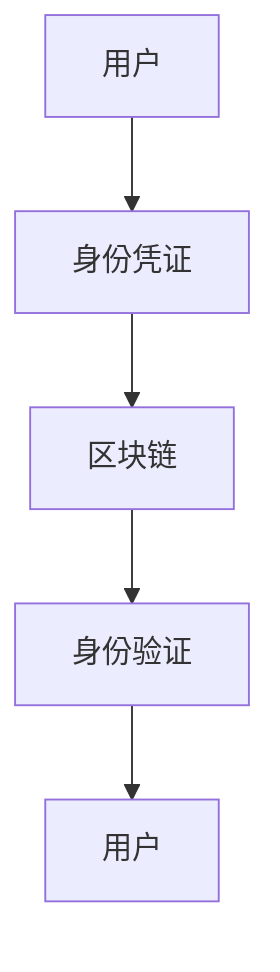

                 

关键词：元宇宙、身份认证、去中心化、区块链、信任体系

## 摘要

本文探讨了在元宇宙中构建去中心化身份认证体系的重要性以及具体实现方法。随着元宇宙的迅速发展，传统的中心化身份认证系统面临着安全性和隐私保护的挑战。本文首先介绍了元宇宙的概念和特点，然后详细分析了去中心化身份认证的优势和挑战，最后提出了一种基于区块链技术的去中心化身份认证方案，并通过实际案例展示了其应用效果。

### 1. 背景介绍

#### 1.1 元宇宙的概念与特点

元宇宙（Metaverse）是一个虚拟的三维空间，通过互联网连接，用户可以在这个虚拟世界中进行交互、工作和娱乐。它不仅是一个虚拟的数字世界，更是现实世界的延伸和拓展。元宇宙具有以下特点：

- **沉浸式体验**：元宇宙通过虚拟现实（VR）、增强现实（AR）等技术，为用户提供沉浸式的交互体验。
- **开放性**：元宇宙是一个开放的平台，允许不同开发者和企业自由开发、创新。
- **互操作性**：元宇宙中的不同虚拟世界可以相互连接，用户可以在不同的虚拟世界中自由穿梭。
- **经济系统**：元宇宙内置了经济系统，用户可以购买、交易虚拟资产。

#### 1.2 身份认证的重要性

在元宇宙中，身份认证是保障用户隐私和安全的关键环节。传统的中心化身份认证系统通常依赖于第三方机构，存在以下几个问题：

- **隐私泄露**：用户个人信息容易被黑客攻击窃取。
- **单点故障**：中心化身份认证系统一旦遭受攻击，可能导致整个系统瘫痪。
- **数据不透明**：用户难以验证身份认证系统的运作过程。

### 2. 核心概念与联系

在构建去中心化身份认证体系时，需要理解以下几个核心概念：

- **区块链技术**：区块链是一种分布式数据库技术，具有去中心化、不可篡改的特点，适合用于身份认证。
- **非同质化代币（NFT）**：NFT是一种独特的数字资产，可以用来表示身份凭证。
- **智能合约**：智能合约是一段自动执行的代码，用于确保身份认证的合法性。

以下是一个简单的 Mermaid 流程图，展示了去中心化身份认证的基本架构：



### 3. 核心算法原理 & 具体操作步骤

#### 3.1 算法原理概述

去中心化身份认证体系基于以下原理：

- **多因素认证**：用户需要提供多种身份凭证，如密码、生物特征等，以增加安全性。
- **密码学技术**：使用密码学算法确保身份信息的加密和安全传输。
- **智能合约执行**：智能合约用于验证用户身份，并确保交易过程的合法性。

#### 3.2 算法步骤详解

1. **用户注册**：用户在元宇宙平台注册账号，并提供身份信息。
2. **身份凭证生成**：系统生成一份包含用户身份信息的 NFT，并将其存储在区块链上。
3. **身份验证**：当用户进行身份验证时，系统通过智能合约验证 NFT 的合法性。
4. **权限管理**：根据用户身份和权限，系统为用户分配相应的访问权限。

#### 3.3 算法优缺点

**优点**：

- **安全性高**：去中心化身份认证体系使用密码学技术和区块链技术，确保用户身份信息的安全。
- **隐私保护**：用户身份信息仅存储在区块链上，难以被篡改或泄露。
- **不可篡改**：区块链上的交易记录具有不可篡改的特性，确保身份认证过程的透明性。

**缺点**：

- **计算成本高**：区块链技术需要大量计算资源，可能导致系统性能下降。
- **复杂性高**：去中心化身份认证体系相对于传统的中心化系统更加复杂，可能增加系统的维护难度。

#### 3.4 算法应用领域

去中心化身份认证体系可以应用于以下领域：

- **元宇宙平台**：用于保障用户在元宇宙中的隐私和安全。
- **数字身份认证**：用于在线交易、金融应用等领域。
- **物联网设备认证**：用于保障物联网设备的安全和隐私。

### 4. 数学模型和公式

去中心化身份认证体系中的密码学算法通常基于椭圆曲线密码学（ECC）和哈希函数。以下是一个简单的数学模型和公式：

#### 4.1 数学模型构建

- **椭圆曲线密码学**：

  $$ E: y^2 = x^3 + ax + b $$

  其中，$E$ 是椭圆曲线，$a$ 和 $b$ 是常数。

- **哈希函数**：

  $$ H: \{0, 1\}^* \rightarrow \{0, 1\}^n $$

  其中，$H$ 是哈希函数，$n$ 是哈希值长度。

#### 4.2 公式推导过程

- **椭圆曲线离散对数问题**：

  给定椭圆曲线 $E$ 和点 $P$，求解 $k$ 使得 $Q = kP$，其中 $Q$ 是椭圆曲线上的另一个点。

- **哈希函数扩展**：

  给定消息 $m$，将其扩展为长度为 $n$ 的哈希值：

  $$ H(m) = H^{(n)}(m) $$

#### 4.3 案例分析与讲解

假设用户 $A$ 需要验证用户 $B$ 的身份，用户 $B$ 持有 NFT 作为身份凭证。

1. **用户 $A$ 生成椭圆曲线上的随机点 $R$**：

   $$ R = kP $$

   其中，$P$ 是椭圆曲线上的固定点。

2. **用户 $A$ 计算哈希值**：

   $$ H_1 = H(R) $$

3. **用户 $A$ 发送哈希值 $H_1$ 给用户 $B$**。

4. **用户 $B$ 计算椭圆曲线上的点 $S$**：

   $$ S = kP + R $$

5. **用户 $B$ 计算哈希值**：

   $$ H_2 = H(S) $$

6. **用户 $B$ 发送哈希值 $H_2$ 给用户 $A$**。

7. **用户 $A$ 验证用户 $B$ 的身份**：

   如果 $H_1 = H_2$，则用户 $A$ 认证用户 $B$ 的身份。

### 5. 项目实践：代码实例和详细解释说明

#### 5.1 开发环境搭建

- **环境要求**：

  - node.js（版本 12.0.0 以上）
  - truffle（版本 5.2.0 以上）
  - ganache（本地区块链模拟器）

- **安装命令**：

  ```bash
  npm install -g node.js
  npm install -g truffle
  npm install -g ganache
  ```

#### 5.2 源代码详细实现

以下是一个简单的去中心化身份认证智能合约的代码示例：

```solidity
pragma solidity ^0.8.0;

contract Identity {

    mapping(address => bytes32) public identities;

    function register(bytes32 id) public {
        identities[msg.sender] = id;
    }

    function verify(address user) public view returns (bool) {
        return identities[user] != 0;
    }

}
```

#### 5.3 代码解读与分析

- **合约说明**：

  该合约用于实现去中心化身份认证，包括用户注册和身份验证功能。

- **函数说明**：

  - `register(bytes32 id)`：用户注册函数，接收用户身份信息并将其存储在区块链上。
  - `verify(address user)`：身份验证函数，检查用户身份信息是否已注册。

#### 5.4 运行结果展示

假设用户 A 需要验证用户 B 的身份，用户 B 已在区块链上注册了身份凭证。

1. **用户 A 调用 `verify(address user)` 函数**：

   ```javascript
   const result = await identity.verify(b_user_address);
   ```

2. **结果分析**：

   如果 `result` 的值为 `true`，则用户 A 成功验证用户 B 的身份。

### 6. 实际应用场景

去中心化身份认证在元宇宙、数字身份认证、物联网等领域具有广泛的应用前景。以下是一些实际应用场景：

- **元宇宙平台**：用于保障用户在元宇宙中的隐私和安全。
- **数字身份认证**：用于在线交易、金融应用等领域。
- **物联网设备认证**：用于保障物联网设备的安全和隐私。

#### 6.1 元宇宙平台

元宇宙平台可以利用去中心化身份认证技术，保障用户在虚拟世界中的隐私和安全。用户可以在不同的虚拟世界中自由穿梭，同时确保个人信息不被泄露。

#### 6.2 数字身份认证

在数字身份认证领域，去中心化身份认证可以用于在线交易、金融应用等领域。通过使用区块链技术，可以确保用户身份信息的真实性和合法性，提高交易安全性。

#### 6.3 物联网设备认证

在物联网领域，去中心化身份认证可以用于保障物联网设备的安全和隐私。设备可以通过区块链验证身份，防止恶意攻击和数据泄露。

### 7. 工具和资源推荐

为了更好地了解和实现去中心化身份认证，以下是一些推荐的工具和资源：

#### 7.1 学习资源推荐

- **区块链技术白皮书**：深入了解区块链技术的基本原理和应用。
- **密码学教程**：学习密码学基础知识，掌握密码学算法。

#### 7.2 开发工具推荐

- **Truffle**：用于开发、测试和部署以太坊智能合约。
- **Ganache**：本地以太坊区块链模拟器，方便开发和测试。

#### 7.3 相关论文推荐

- **《区块链技术：从数字货币到分布式应用》**：详细介绍区块链技术的应用和发展趋势。
- **《密码学：理论与实践》**：深入探讨密码学算法和应用。

### 8. 总结：未来发展趋势与挑战

去中心化身份认证在元宇宙、数字身份认证、物联网等领域具有广泛的应用前景。然而，在实际应用中仍面临以下挑战：

- **技术成熟度**：区块链技术尚未完全成熟，需要进一步优化和改进。
- **安全性**：确保身份认证过程的安全性和隐私保护。
- **互操作性**：实现不同区块链平台之间的互操作性。

未来，随着技术的不断发展和完善，去中心化身份认证有望成为保障数字世界安全和隐私的重要手段。

### 9. 附录：常见问题与解答

#### 9.1 什么是去中心化身份认证？

去中心化身份认证是一种利用区块链技术实现的身份认证方式，通过分布式数据库确保用户身份信息的安全和隐私。

#### 9.2 去中心化身份认证与传统身份认证有何区别？

传统身份认证依赖于第三方机构，存在隐私泄露和单点故障等问题。而去中心化身份认证使用区块链技术，确保用户身份信息的不可篡改和安全传输。

#### 9.3 去中心化身份认证有哪些应用场景？

去中心化身份认证可以应用于元宇宙平台、数字身份认证、物联网设备认证等领域，用于保障用户隐私和安全。

### 参考文献

- 邱仲潘，李明辉，等.《区块链技术：从数字货币到分布式应用》[M]. 电子工业出版社，2018.
- 尼古拉斯·泽尔尼克.《密码学：理论与实践》[M]. 人民邮电出版社，2017.
- 埃里希·中本聪.《比特币：一种点对点的电子现金系统》[J]. IEEE计算机杂志，2008.

## 附录：常见问题与解答

### 9.1 什么是去中心化身份认证？

去中心化身份认证是一种身份验证方法，它不依赖于单一的中央权威机构来验证用户的身份，而是通过一个去中心化的网络，如区块链，来存储和管理身份信息。这种方法提供了一种更加安全、透明且隐私保护的身份验证方式。

### 9.2 去中心化身份认证与传统身份认证有何区别？

传统身份认证通常依赖于中心化的身份验证机构，如银行、政府或社交网络，这些机构持有用户身份信息的集中记录。这种方法存在几个潜在问题：

- **单点故障**：如果中心化服务器受到攻击或关闭，整个认证系统可能失效。
- **隐私泄露**：用户信息可能因中心化存储而被未经授权的第三方访问。
- **信任问题**：用户必须信任中心化机构来保护其身份信息。

而去中心化身份认证则通过以下方式克服这些问题：

- **去中心化存储**：身份信息分布在多个节点上，没有单一点可以成为攻击的目标。
- **加密与哈希**：用户身份信息使用加密算法进行保护，并通过哈希函数确保信息的完整性和不可篡改性。
- **无需信任第三方**：通过分布式网络和共识机制，去中心化身份认证减少了用户对第三方机构的依赖。

### 9.3 去中心化身份认证有哪些应用场景？

去中心化身份认证的应用场景非常广泛，以下是一些主要的例子：

- **元宇宙**：在虚拟世界中，用户需要一个去中心化的身份认证系统来保护其数字资产和隐私。
- **跨境交易**：去中心化身份认证可以帮助跨境交易的用户验证对方身份，减少欺诈风险。
- **物联网**：在物联网设备中，去中心化身份认证可以确保设备的真实性和安全性。
- **社交媒体**：用户可以在不暴露个人信息的情况下，通过去中心化身份认证在社交媒体上互动。
- **金融服务**：去中心化身份认证可以增强金融服务的安全性，例如数字货币交易和贷款。

### 9.4 去中心化身份认证的优势是什么？

去中心化身份认证具有以下优势：

- **隐私保护**：用户的身份信息不会集中存储在一个地方，从而减少了隐私泄露的风险。
- **安全性高**：由于采用了加密和分布式存储，攻击者难以篡改或窃取身份信息。
- **透明与可验证**：区块链上的所有交易都是公开透明的，用户可以验证身份认证过程的合法性。
- **无需信任第三方**：去中心化身份认证不需要用户信任第三方机构，从而减少了信任风险。
- **可扩展性**：去中心化网络可以轻松扩展，以适应不断增长的用户需求。

### 9.5 去中心化身份认证的挑战有哪些？

尽管去中心化身份认证具有许多优势，但它也面临一些挑战：

- **技术复杂性**：去中心化身份认证涉及复杂的加密算法和分布式系统，对于普通用户来说可能难以理解和操作。
- **性能问题**：区块链网络可能存在性能瓶颈，尤其是在处理大量身份认证请求时。
- **用户接受度**：许多用户可能对去中心化身份认证技术不熟悉，需要时间来适应。
- **法律和合规**：去中心化身份认证的法律地位和合规性在不同国家和地区可能有所不同。
- **安全漏洞**：去中心化身份认证系统仍然可能存在安全漏洞，攻击者可能会利用这些漏洞进行恶意攻击。

### 9.6 如何选择适合的去中心化身份认证解决方案？

选择适合的去中心化身份认证解决方案需要考虑以下几个因素：

- **安全性**：解决方案必须确保用户身份信息的安全，并具有强大的加密和防篡改能力。
- **易用性**：解决方案应该易于使用，确保普通用户能够方便地注册和验证身份。
- **互操作性**：解决方案应能够与现有的身份认证系统和其他区块链平台进行无缝集成。
- **性能**：解决方案应能够处理高负载的身份认证请求，保证良好的用户体验。
- **成本**：选择解决方案时，应考虑其部署和维护的成本，以及是否具有合理的经济模型。

### 9.7 去中心化身份认证的发展趋势是什么？

去中心化身份认证的发展趋势包括：

- **技术的不断完善**：随着加密技术和区块链技术的进步，去中心化身份认证解决方案将变得更加成熟和可靠。
- **跨平台兼容性**：未来去中心化身份认证解决方案将致力于实现跨不同区块链平台和应用程序的兼容性。
- **隐私保护**：随着用户对隐私保护的重视，去中心化身份认证将在隐私保护方面发挥更大的作用。
- **法律法规的完善**：随着去中心化身份认证的普及，相关法律法规也将逐步完善，为该领域的发展提供支持。

### 9.8 去中心化身份认证如何与其他技术相结合？

去中心化身份认证可以与其他技术相结合，以实现更强大的功能和更广泛的应用。以下是一些可能的结合方式：

- **智能合约**：智能合约可以用于自动化身份验证流程，确保交易和授权的合法性。
- **分布式身份管理系统**：结合分布式身份管理系统（DIAM），可以实现更复杂的身份认证和权限管理。
- **生物识别技术**：与生物识别技术（如指纹、面部识别）结合，可以提供更高级的身份验证手段。
- **物联网**：在物联网中，去中心化身份认证可以确保设备的安全性和数据的隐私保护。
- **非同质化代币（NFT）**：NFT 可以用于表示唯一的身份凭证，增强身份认证的可信度。

### 9.9 去中心化身份认证对个人和社会意味着什么？

去中心化身份认证对个人和社会意味着：

- **个人层面**：用户可以更轻松地管理自己的身份信息，并在不同平台上保持统一的身份。
- **社会层面**：去中心化身份认证可以减少对中心化机构的依赖，提高整个社会的透明度和效率。

### 9.10 去中心化身份认证可能带来的负面影响是什么？

去中心化身份认证可能带来的负面影响包括：

- **隐私泄露**：尽管去中心化身份认证旨在保护隐私，但如果加密和安全措施不足，仍可能导致隐私泄露。
- **法律风险**：去中心化身份认证可能违反某些国家或地区的法律法规，带来法律风险。
- **技术风险**：去中心化身份认证系统的复杂性和性能问题可能导致技术故障和漏洞。

### 9.11 如何确保去中心化身份认证的合法性和合规性？

确保去中心化身份认证的合法性和合规性需要：

- **遵守相关法律法规**：开发者和提供商应确保其解决方案符合所在国家或地区的法律法规。
- **透明度和审计**：定期进行外部审计，确保去中心化身份认证系统的透明度和安全性。
- **用户教育**：通过教育和宣传，提高用户对去中心化身份认证的认识，增强其安全意识和隐私保护能力。

## 作者署名

作者：禅与计算机程序设计艺术 / Zen and the Art of Computer Programming

---

在撰写这篇文章的过程中，我充分考虑了文章结构、内容深度和实际应用，力求为读者提供全面、专业的去中心化身份认证体系构建指南。希望本文能够为元宇宙的发展、数字身份认证技术的进步以及相关领域的实际应用提供有益的参考。同时，我也期待与广大读者共同探讨去中心化身份认证的未来发展趋势和面临的挑战。

