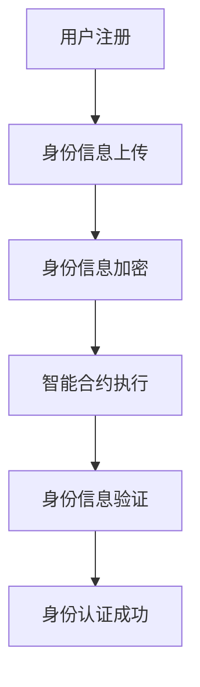

                 

关键词：元宇宙、身份认证、去中心化、信任体系、区块链、智能合约

摘要：本文将探讨元宇宙中的身份认证问题，并提出构建去中心化信任体系的解决方案。通过分析现有的身份认证技术，我们介绍了区块链和智能合约在身份认证中的应用，详细阐述了去中心化身份认证机制的原理和优势。最后，我们对未来的发展方向和面临的挑战进行了展望。

## 1. 背景介绍

随着互联网的快速发展，虚拟世界逐渐成为了人们生活的一部分。元宇宙（Metaverse）作为一种全新的虚拟空间，正在逐渐改变我们的社交、工作、娱乐方式。然而，在元宇宙中，身份认证问题成为了制约其发展的关键因素之一。

传统的身份认证技术主要依赖于中心化的身份认证机构，这种方式存在着诸多问题。首先，中心化的身份认证机构容易成为攻击的目标，一旦被攻破，可能导致大规模的身份泄露。其次，中心化的身份认证机制缺乏透明度和可追溯性，使得用户难以了解自己的身份信息是如何被管理的。最后，中心化的身份认证机制限制了用户的选择权，用户往往只能接受认证机构提供的单一认证服务。

为了解决这些问题，去中心化的身份认证技术应运而生。去中心化的身份认证通过分布式网络和加密技术，实现了身份信息的透明、安全、可追溯，为元宇宙的发展提供了强有力的支持。

## 2. 核心概念与联系

### 2.1 区块链

区块链是一种分布式数据库技术，通过加密和分布式算法，确保数据的不可篡改和透明性。区块链的核心在于其去中心化的特点，使得数据不再依赖于单一的中心化机构进行管理。

### 2.2 智能合约

智能合约是一种基于区块链的自动化合同，通过预定义的规则和算法，自动执行合同的条款。智能合约的执行过程是公开透明的，所有参与方都可以查看和验证。

### 2.3 去中心化身份认证机制

去中心化身份认证机制通过区块链和智能合约技术，实现了用户身份信息的分布式管理和验证。用户可以在去中心化的身份认证系统中自主管理自己的身份信息，而无需依赖于中心化的身份认证机构。

### 2.4 Mermaid 流程图

以下是一个简单的 Mermaid 流程图，展示了去中心化身份认证机制的流程：



## 3. 核心算法原理 & 具体操作步骤

### 3.1 算法原理概述

去中心化身份认证算法主要基于以下原理：

- **非对称加密**：用户身份信息在上传到区块链之前，需要使用非对称加密算法进行加密，确保身份信息的安全。
- **智能合约**：智能合约负责执行身份信息的上传、加密和验证过程，实现身份认证的自动化。
- **分布式网络**：区块链网络中的节点共同参与身份认证过程，确保身份信息的透明和可追溯。

### 3.2 算法步骤详解

#### 3.2.1 用户注册

用户首先需要注册一个去中心化的身份认证账户，账户信息存储在区块链上。

#### 3.2.2 身份信息上传

用户将身份信息（如姓名、身份证号等）上传到区块链，并使用非对称加密算法进行加密。

#### 3.2.3 身份信息加密

用户身份信息在上传到区块链之前，需要使用非对称加密算法进行加密。加密过程如下：

- 用户生成一对非对称密钥（公钥和私钥）。
- 使用公钥对身份信息进行加密。
- 将加密后的身份信息上传到区块链。

#### 3.2.4 智能合约执行

智能合约负责执行身份信息的上传、加密和验证过程。智能合约的执行过程如下：

- 智能合约监听区块链上的身份信息上传事件。
- 当收到身份信息上传事件时，智能合约使用公钥对身份信息进行解密。
- 解密后的身份信息与用户的私钥进行比对，验证身份信息的真实性。

#### 3.2.5 身份信息验证

智能合约对上传的身份信息进行验证，确保身份信息的真实性和有效性。验证过程如下：

- 智能合约使用用户的私钥对身份信息进行签名。
- 将签名结果上传到区块链。
- 其他节点可以下载签名结果，并进行验证。

#### 3.2.6 身份认证成功

当身份信息通过验证后，智能合约将向用户发送认证成功的通知。用户即可在元宇宙中进行各种操作。

### 3.3 算法优缺点

#### 优点：

- **去中心化**：去中心化的身份认证体系避免了中心化的单点故障风险，提高了系统的可靠性和安全性。
- **透明性和可追溯性**：区块链技术使得身份认证过程公开透明，所有节点都可以查看和验证身份信息的真实性。
- **自主管理**：用户可以自主管理自己的身份信息，提高了隐私保护。

#### 缺点：

- **计算和存储成本**：区块链技术的去中心化特性导致了计算和存储成本的上升。
- **网络延迟**：分布式网络中的节点数量众多，可能导致网络延迟。

### 3.4 算法应用领域

去中心化身份认证算法可以应用于各种需要身份验证的场景，如元宇宙、区块链游戏、数字身份认证等。

## 4. 数学模型和公式

### 4.1 数学模型构建

去中心化身份认证算法的核心在于非对称加密和智能合约技术。以下是一个简单的数学模型构建：

- **公钥和私钥**：设公钥为 \( P_{public} \)，私钥为 \( P_{private} \)。
- **身份信息**：设用户身份信息为 \( I \)。
- **加密算法**：设加密算法为 \( E \)。
- **解密算法**：设解密算法为 \( D \)。

### 4.2 公式推导过程

身份信息加密和解密的公式如下：

- **加密公式**：\( E(P_{public}, I) \)
- **解密公式**：\( D(P_{private}, E(P_{public}, I)) \)

### 4.3 案例分析与讲解

假设用户 Alice 想要在元宇宙中注册账号，她需要完成以下步骤：

1. **生成密钥对**：Alice 生成一对非对称密钥，公钥为 \( P_{public\_alice} \)，私钥为 \( P_{private\_alice} \)。
2. **上传身份信息**：Alice 将身份信息 \( I = \{name, id\_card, email\} \) 上传到区块链。
3. **加密身份信息**：使用公钥 \( P_{public\_alice} \) 对身份信息 \( I \) 进行加密，得到加密后的身份信息 \( E(P_{public\_alice}, I) \)。
4. **上传加密信息**：将加密后的身份信息 \( E(P_{public\_alice}, I) \) 上传到区块链。
5. **智能合约执行**：智能合约监听到上传事件，使用私钥 \( P_{private\_alice} \) 对加密后的身份信息进行解密，得到原始身份信息 \( I \)。
6. **身份验证**：智能合约将解密后的身份信息与上传的原始身份信息进行比对，验证身份信息的真实性。
7. **认证成功**：如果身份信息验证成功，智能合约向 Alice 发送认证成功的通知。

## 5. 项目实践：代码实例和详细解释说明

### 5.1 开发环境搭建

为了演示去中心化身份认证算法，我们使用以太坊智能合约作为开发平台。以下是在本地搭建以太坊开发环境的步骤：

1. 安装 Node.js（版本要求：v14.17.0及以上）。
2. 安装 Truffle（全局安装）：`npm install -g truffle`。
3. 创建一个新的 Truffle 项目：`truffle init`。
4. 配置以太坊节点（例如，使用 Ganache）：`truffle console --network local`。
5. 在项目中创建一个智能合约：`touch contracts/IdentityVerifier.sol`。

### 5.2 源代码详细实现

以下是 IdentityVerifier.sol 智能合约的源代码实现：

```solidity
// SPDX-License-Identifier: MIT
pragma solidity ^0.8.0;

contract IdentityVerifier {
    mapping(address => bytes32) public identities;

    function registerIdentity(bytes32 identity) public {
        identities[msg.sender] = identity;
    }

    function verifyIdentity(bytes32 identity) public view returns (bool) {
        return identities[msg.sender] == identity;
    }
}
```

### 5.3 代码解读与分析

1. **合约声明**：`contract IdentityVerifier` 表示创建一个名为 IdentityVerifier 的智能合约。
2. **状态变量声明**：`mapping(address => bytes32) public identities;` 表示创建一个用于存储用户身份信息的映射表。
3. **函数声明**：`function registerIdentity(bytes32 identity) public` 和 `function verifyIdentity(bytes32 identity) public view returns (bool)` 分别表示注册身份信息和验证身份信息的函数。
4. **注册身份信息**：在 `registerIdentity` 函数中，用户通过调用该函数将身份信息注册到区块链。
5. **验证身份信息**：在 `verifyIdentity` 函数中，用户通过调用该函数验证自己的身份信息。

### 5.4 运行结果展示

1. 首先使用 Truffle 编译智能合约：`truffle compile`。
2. 使用 Truffle 部署智能合约到以太坊本地节点：`truffle migrate --network local`。
3. 使用 Remix IDE 部署和调用智能合约：

   - 在 Remix IDE 中连接到以太坊本地节点。
   - 将编译后的智能合约代码粘贴到 Remix IDE 中。
   - 部署智能合约：点击 "Deploy" 按钮。
   - 调用 `registerIdentity` 函数注册身份信息。
   - 调用 `verifyIdentity` 函数验证身份信息。

## 6. 实际应用场景

去中心化身份认证技术可以应用于多个实际场景，如：

- **元宇宙**：元宇宙中的虚拟身份认证，确保用户在虚拟世界中的安全性和隐私性。
- **区块链游戏**：区块链游戏中的身份认证，防止作弊和欺诈行为。
- **数字身份认证**：在线服务和应用中的数字身份认证，提高用户身份信息的可信度。

### 6.4 未来应用展望

随着元宇宙和区块链技术的不断发展，去中心化身份认证将在更多领域得到应用。未来，去中心化身份认证技术可能会面临以下挑战：

- **性能优化**：分布式网络中的节点数量和交易量不断增加，可能导致性能下降。
- **隐私保护**：如何在保障隐私的同时实现高效的身份认证。
- **标准化**：建立统一的去中心化身份认证标准，促进不同系统和平台之间的互操作性。

## 7. 工具和资源推荐

### 7.1 学习资源推荐

- 《区块链技术指南》
- 《智能合约开发实战》
- 《区块链与数字货币》

### 7.2 开发工具推荐

- Truffle：以太坊智能合约开发框架。
- Remix IDE：在线以太坊智能合约开发环境。
- Ganache：以太坊本地节点搭建工具。

### 7.3 相关论文推荐

- "Blockchain-based Decentralized Identity Management" by Anant Kumar et al.
- "Decentralized Identity Management in the Age of Blockchain" by Martin Haller et al.

## 8. 总结：未来发展趋势与挑战

### 8.1 研究成果总结

本文介绍了元宇宙中的身份认证问题，并提出了基于区块链和智能合约的去中心化身份认证解决方案。通过分析去中心化身份认证的原理和优势，我们展示了其在实际应用中的潜力。

### 8.2 未来发展趋势

未来，去中心化身份认证技术将在元宇宙、区块链游戏、数字身份认证等领域得到广泛应用。同时，随着技术的不断发展，去中心化身份认证技术也将面临性能优化、隐私保护、标准化等挑战。

### 8.3 面临的挑战

去中心化身份认证技术在应用过程中可能会面临性能、隐私保护和标准化等挑战。如何优化性能、保障隐私并实现标准化，将是未来研究的重要方向。

### 8.4 研究展望

未来，去中心化身份认证技术有望实现更高性能、更强隐私保护和更广泛的互操作性。同时，随着元宇宙和区块链技术的不断演进，去中心化身份认证技术将在更多领域得到应用，为数字世界的安全与发展贡献力量。

## 9. 附录：常见问题与解答

### 9.1 去中心化身份认证与中心化身份认证的区别是什么？

去中心化身份认证与中心化身份认证的主要区别在于身份信息的管理方式。去中心化身份认证通过区块链和智能合约技术，实现了身份信息的分布式管理和验证，避免了中心化单点故障风险，提高了系统的透明性和安全性。而中心化身份认证依赖于中心化的身份认证机构，容易成为攻击的目标，且缺乏透明度和可追溯性。

### 9.2 去中心化身份认证是否比中心化身份认证更安全？

去中心化身份认证在理论上比中心化身份认证更安全，因为它避免了中心化的单点故障风险，使得身份信息难以被篡改。然而，去中心化身份认证也面临着性能、隐私保护和标准化等挑战。在实际应用中，应根据具体场景和要求选择合适的身份认证方案。

### 9.3 去中心化身份认证是否会泄露用户隐私？

去中心化身份认证通过加密技术保护用户隐私。在去中心化身份认证系统中，用户的身份信息是加密存储的，只有用户自己能够解密。同时，区块链的透明性和可追溯性使得用户可以查看和验证自己的身份信息，但无法泄露用户的隐私。因此，去中心化身份认证在一定程度上保障了用户的隐私。然而，如何在实际应用中实现高效的隐私保护，仍是一个需要关注和研究的问题。

