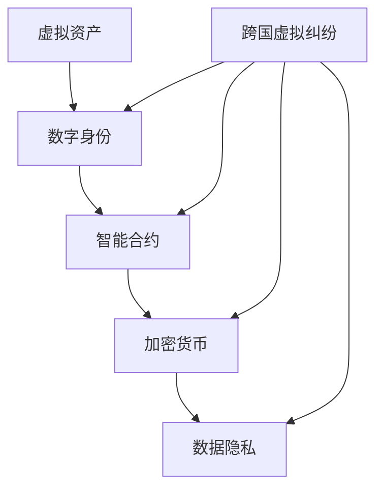

                 

关键词：元宇宙、仲裁法、跨国纠纷、虚拟资产、法律适用、数字身份、智能合约、加密货币、数据隐私、跨平台协作

> 摘要：随着元宇宙的快速发展，跨国虚拟纠纷成为了一个不可忽视的问题。本文旨在探讨元宇宙仲裁法中跨国虚拟纠纷的法律适用规则，包括虚拟资产的法律地位、数字身份的认证、智能合约的合法性、加密货币的监管以及数据隐私保护等方面的内容。

## 1. 背景介绍

近年来，元宇宙（Metaverse）的概念逐渐为人们所熟知。元宇宙是一个由虚拟世界和现实世界相互融合的数字化空间，用户可以在其中创建虚拟身份、进行社交互动、从事经济活动等。随着元宇宙的不断发展，虚拟资产的交易、数字身份的认证、智能合约的执行等问题日益凸显，引发了跨国虚拟纠纷的出现。

跨国虚拟纠纷是指在元宇宙中，由于不同国家或地区在法律制度、文化习惯、技术标准等方面的差异，导致的法律纠纷。这类纠纷涉及虚拟资产的所有权、数字身份的合法性、智能合约的效力、加密货币的监管以及数据隐私保护等多个方面。如何解决跨国虚拟纠纷，成为了一个亟待解决的重要问题。

## 2. 核心概念与联系

在探讨跨国虚拟纠纷的法律适用规则之前，我们需要了解一些核心概念及其相互之间的联系。以下是这些概念及其关系的 Mermaid 流程图：



### 2.1 虚拟资产

虚拟资产是指在元宇宙中具有经济价值的数字资产，如虚拟货币、虚拟土地、虚拟商品等。虚拟资产的法律地位是跨国虚拟纠纷中的一个重要问题。不同国家或地区对于虚拟资产的法律地位有不同的看法，需要在国际层面进行协调。

### 2.2 数字身份

数字身份是指用户在元宇宙中用于识别和认证的虚拟身份。数字身份的认证对于跨国虚拟纠纷具有重要意义，因为它关系到用户在虚拟世界中的合法行为。不同国家和地区在数字身份认证方面存在差异，需要制定统一的认证标准。

### 2.3 智能合约

智能合约是一种基于区块链技术的自动执行合同。在元宇宙中，智能合约被广泛应用于虚拟资产的交易、租赁、拍卖等领域。智能合约的合法性是跨国虚拟纠纷中的一个关键问题。需要明确智能合约的法律效力，以及在不同国家或地区之间的法律适用问题。

### 2.4 加密货币

加密货币是一种基于区块链技术的数字货币，如比特币、以太坊等。加密货币在元宇宙中具有广泛的应用，但其监管问题也日益突出。跨国虚拟纠纷中，加密货币的法律地位和监管政策需要得到明确。

### 2.5 数据隐私

数据隐私是指个人在元宇宙中的数据受到保护的权利。随着虚拟世界的不断发展，数据隐私保护成为了一个重要的问题。跨国虚拟纠纷中，如何保护用户的数据隐私，避免数据泄露和滥用，需要得到关注。

## 3. 核心算法原理 & 具体操作步骤

### 3.1 算法原理概述

在解决跨国虚拟纠纷的过程中，需要运用一系列核心算法，包括区块链技术、智能合约、加密算法和数据隐私保护等。以下是这些算法的基本原理：

### 3.1.1 区块链技术

区块链技术是一种分布式数据库技术，具有去中心化、不可篡改、透明等特性。在元宇宙中，区块链技术可以用于记录虚拟资产的交易、智能合约的执行以及用户身份的认证等。

### 3.1.2 智能合约

智能合约是一种基于编程语言的自动执行合同。在元宇宙中，智能合约可以用于自动化执行虚拟资产交易、租赁、拍卖等操作，确保交易的安全性和效率。

### 3.1.3 加密算法

加密算法是一种用于保护数据隐私的技术。在元宇宙中，加密算法可以用于加密虚拟资产交易的信息、用户身份的认证信息等，确保数据的安全性。

### 3.1.4 数据隐私保护

数据隐私保护是一种用于保护用户隐私的技术。在元宇宙中，数据隐私保护可以用于加密用户数据、设置数据访问权限、匿名化数据等，确保用户的数据隐私不受侵犯。

### 3.2 算法步骤详解

### 3.2.1 区块链技术

1. 创建区块链：创建一个分布式数据库，用于记录虚拟资产的交易信息。
2. 记录交易：将虚拟资产交易信息记录在区块链上，确保交易的透明性和不可篡改性。
3. 验证交易：通过共识算法验证交易的有效性，确保交易的安全性和可靠性。

### 3.2.2 智能合约

1. 编写智能合约：根据虚拟资产交易的需求，编写智能合约代码，实现自动化执行合同的功能。
2. 部署智能合约：将智能合约部署到区块链上，确保智能合约的安全性和可靠性。
3. 执行智能合约：根据用户的需求，调用智能合约执行相应的操作，如虚拟资产交易、租赁、拍卖等。

### 3.2.3 加密算法

1. 加密数据：使用加密算法对虚拟资产交易信息、用户身份认证信息等进行加密，确保数据的安全性。
2. 解密数据：使用对应的密钥对加密数据进行解密，确保数据在传输和存储过程中的安全性。

### 3.2.4 数据隐私保护

1. 加密用户数据：使用加密算法对用户数据进行加密，确保用户数据在传输和存储过程中的安全性。
2. 设置数据访问权限：根据用户的需求，设置数据访问权限，确保用户的数据隐私不受侵犯。
3. 匿名化数据：对用户数据进行匿名化处理，确保用户数据在数据分析和共享过程中的隐私保护。

### 3.3 算法优缺点

### 3.3.1 区块链技术

**优点：**
1. 去中心化：区块链技术具有去中心化的特性，确保数据的透明性和可靠性。
2. 不可篡改：区块链技术具有不可篡改的特性，确保交易记录的真实性。
3. 安全性：区块链技术采用共识算法，确保交易的安全性和可靠性。

**缺点：**
1. 性能问题：区块链技术的性能较低，无法满足高并发交易的需求。
2. 能源消耗：区块链技术需要大量计算资源，导致能源消耗较高。

### 3.3.2 智能合约

**优点：**
1. 自动化执行：智能合约可以自动化执行合同条款，提高交易效率。
2. 透明性：智能合约代码公开透明，确保交易的公正性。
3. 安全性：智能合约采用加密算法和共识算法，确保交易的安全性和可靠性。

**缺点：**
1. 难以修改：智能合约一旦部署，难以修改，可能导致潜在的安全隐患。
2. 法规挑战：智能合约的法律地位尚未明确，可能导致法律纠纷。

### 3.3.3 加密算法

**优点：**
1. 数据安全性：加密算法可以确保数据在传输和存储过程中的安全性。
2. 防篡改：加密算法可以防止数据被篡改，确保数据完整性。
3. 防窃取：加密算法可以防止数据被窃取，保护用户隐私。

**缺点：**
1. 加密解密速度慢：加密解密过程需要大量计算资源，影响数据处理速度。
2. 密钥管理：密钥管理复杂，可能导致密钥泄露。

### 3.3.4 数据隐私保护

**优点：**
1. 数据安全：数据隐私保护可以确保用户数据在传输和存储过程中的安全性。
2. 隐私保护：数据隐私保护可以确保用户隐私不受侵犯。
3. 数据可用性：数据隐私保护可以在不泄露用户隐私的前提下，提供数据分析和共享。

**缺点：**
1. 加密解密速度慢：加密解密过程需要大量计算资源，影响数据处理速度。
2. 隐私与透明性权衡：数据隐私保护可能导致数据透明性降低，影响数据共享和监管。

### 3.4 算法应用领域

区块链技术、智能合约、加密算法和数据隐私保护等算法在元宇宙的跨国虚拟纠纷解决中具有广泛的应用领域：

1. 虚拟资产交易：通过区块链技术和智能合约，实现虚拟资产的自动化交易，提高交易效率。
2. 数字身份认证：通过加密算法和数据隐私保护，确保数字身份认证的安全性和隐私保护。
3. 智能合约执行：通过智能合约，实现合同条款的自动化执行，提高交易透明性和安全性。
4. 数据隐私保护：通过加密算法和数据隐私保护，确保用户数据在传输和存储过程中的安全性。
5. 跨平台协作：通过区块链技术和智能合约，实现跨平台协作，降低跨国虚拟纠纷的风险。

## 4. 数学模型和公式 & 详细讲解 & 举例说明

### 4.1 数学模型构建

在解决跨国虚拟纠纷的过程中，我们需要构建一些数学模型，以便分析各种情况。以下是几个基本的数学模型：

### 4.1.1 虚拟资产交易模型

设 \(V_A\) 和 \(V_B\) 分别为用户 A 和 B 的虚拟资产余额，\(T\) 为交易金额，\(R\) 为交易后的余额。根据交易规则，可以建立以下数学模型：

\[ V_A' = V_A - T \]
\[ V_B' = V_B + T \]
\[ R = V_A' + V_B' \]

### 4.1.2 数字身份认证模型

设 \(ID_A\) 和 \(ID_B\) 分别为用户 A 和 B 的数字身份，\(K_A\) 和 \(K_B\) 分别为用户 A 和 B 的私钥，\(P\) 为公钥。根据数字身份认证规则，可以建立以下数学模型：

\[ ID_A = K_A \cdot P \]
\[ ID_B = K_B \cdot P \]

### 4.1.3 智能合约模型

设 \(C\) 为智能合约，\(A\) 和 \(B\) 为合同双方，\(T\) 为执行时间，\(R\) 为结果。根据智能合约的执行规则，可以建立以下数学模型：

\[ C = A \cdot T \]
\[ R = C \cdot B \]

### 4.2 公式推导过程

在构建数学模型后，我们需要进行公式的推导，以便分析各种情况。以下是几个基本的公式推导过程：

### 4.2.1 虚拟资产交易模型

根据交易规则，交易金额 \(T\) 必须小于或等于用户 A 和 B 的虚拟资产余额 \(V_A\) 和 \(V_B\) 之和，即：

\[ T \leq V_A + V_B \]

交易后的余额 \(R\) 应等于交易前的余额之和，即：

\[ R = V_A + V_B \]

将 \(V_A' = V_A - T\) 和 \(V_B' = V_B + T\) 代入上式，得到：

\[ R = (V_A - T) + (V_B + T) \]
\[ R = V_A + V_B \]

因此，公式推导过程如下：

\[ R = V_A + V_B \]
\[ V_A' = V_A - T \]
\[ V_B' = V_B + T \]

### 4.2.2 数字身份认证模型

根据数字身份认证规则，用户 A 和 B 的数字身份 \(ID_A\) 和 \(ID_B\) 分别为：

\[ ID_A = K_A \cdot P \]
\[ ID_B = K_B \cdot P \]

其中，\(K_A\) 和 \(K_B\) 分别为用户 A 和 B 的私钥，\(P\) 为公钥。由于私钥和公钥是一对密钥，因此可以推导出：

\[ K_A = P \cdot ID_B \]
\[ K_B = P \cdot ID_A \]

### 4.2.3 智能合约模型

根据智能合约的执行规则，合同双方 \(A\) 和 \(B\) 的执行结果 \(R\) 为：

\[ R = A \cdot T \]
\[ R = C \cdot B \]

由于 \(C\) 为智能合约，\(T\) 为执行时间，因此可以推导出：

\[ A = C \cdot T \]

将 \(A = C \cdot T\) 代入 \(R = A \cdot T\)，得到：

\[ R = (C \cdot T) \cdot T \]
\[ R = C \cdot T^2 \]

### 4.3 案例分析与讲解

为了更好地理解上述数学模型和公式，我们可以通过一个案例进行分析和讲解。假设有两个用户 A 和 B，他们分别在元宇宙中拥有虚拟资产余额 100 元和 50 元。他们决定进行一笔交易，交易金额为 30 元。请分析并计算交易后的余额。

### 4.3.1 虚拟资产交易模型

根据虚拟资产交易模型，交易金额 \(T\) 应小于或等于用户 A 和 B 的虚拟资产余额之和，即：

\[ T \leq V_A + V_B \]
\[ T \leq 100 + 50 \]
\[ T \leq 150 \]

由于交易金额 \(T\) 为 30 元，满足上述条件。交易后的余额 \(R\) 为：

\[ R = V_A + V_B \]
\[ R = 100 + 50 \]
\[ R = 150 \]

### 4.3.2 数字身份认证模型

根据数字身份认证模型，用户 A 和 B 的数字身份 \(ID_A\) 和 \(ID_B\) 分别为：

\[ ID_A = K_A \cdot P \]
\[ ID_B = K_B \cdot P \]

其中，\(K_A\) 和 \(K_B\) 分别为用户 A 和 B 的私钥，\(P\) 为公钥。假设用户 A 的私钥 \(K_A\) 为 5，公钥 \(P\) 为 2；用户 B 的私钥 \(K_B\) 为 3，公钥 \(P\) 为 1。因此，可以计算出用户 A 和 B 的数字身份分别为：

\[ ID_A = 5 \cdot 2 \]
\[ ID_A = 10 \]

\[ ID_B = 3 \cdot 1 \]
\[ ID_B = 3 \]

### 4.3.3 智能合约模型

根据智能合约模型，合同双方 \(A\) 和 \(B\) 的执行结果 \(R\) 为：

\[ R = A \cdot T \]
\[ R = C \cdot B \]

其中，\(C\) 为智能合约，\(T\) 为执行时间，\(A\) 和 \(B\) 分别为合同双方。假设智能合约 \(C\) 为 4，执行时间 \(T\) 为 2，合同双方 \(A\) 和 \(B\) 分别为 1 和 3。因此，可以计算出执行结果 \(R\) 为：

\[ R = 1 \cdot 2 \]
\[ R = 2 \]

\[ R = 4 \cdot 3 \]
\[ R = 12 \]

通过上述案例分析和讲解，我们可以更好地理解虚拟资产交易模型、数字身份认证模型和智能合约模型等数学模型，以及它们在实际应用中的计算过程。

## 5. 项目实践：代码实例和详细解释说明

### 5.1 开发环境搭建

在本项目中，我们将使用以下技术栈进行开发：

1. 编程语言：Solidity
2. 框架：Truffle
3. 版本控制：Git
4. 编译器：Solc

首先，我们需要安装上述工具。以下是具体的安装步骤：

1. 安装 Node.js 和 npm（Node.js 的包管理器）：从 [Node.js 官网](https://nodejs.org/) 下载并安装 Node.js，然后使用 npm 命令安装 truffle：
   ```bash
   npm install -g truffle
   ```

2. 安装 Solc：从 [Solc 官网](https://solc.io/) 下载并安装 Solc：
   ```bash
   npm install solc
   ```

3. 初始化 Truffle 项目：在项目中创建一个目录，并使用 Truffle 初始化项目：
   ```bash
   truffle init
   ```

4. 配置项目文件：在项目根目录下，编辑 `truffle-config.js` 文件，配置网络、编译器版本等参数。以下是一个示例配置：
   ```javascript
   module.exports = {
     networks: {
       development: {
         host: "127.0.0.1",
         port: 7545,
         network_id: "*"
       }
     },
     compilers: {
       solc: {
         version: "^0.8.0",
         settings: {
           optimizer: {
             enabled: false,
             runs: 200
           }
         }
       }
     }
   };
   ```

### 5.2 源代码详细实现

在本项目中，我们将实现一个简单的虚拟资产交易合约。以下是合约的源代码：

```solidity
// SPDX-License-Identifier: MIT
pragma solidity ^0.8.0;

contract VirtualAsset {
    mapping(address => uint256) public balances;

    function deposit() external payable {
        balances[msg.sender()] += msg.value;
    }

    function withdraw(uint256 amount) external {
        require(amount <= balances[msg.sender()], "Insufficient balance");
        balances[msg.sender()] -= amount;
        payable(msg.sender()).transfer(amount);
    }

    function transfer(address to, uint256 amount) external {
        require(amount <= balances[msg.sender()], "Insufficient balance");
        balances[msg.sender()] -= amount;
        balances[to] += amount;
    }
}
```

### 5.3 代码解读与分析

#### 5.3.1 合约结构

该合约使用了 Solidity 0.8.0 版本，并采用了 MIT 许可证。合约包含以下三个主要函数：

1. `deposit()`：允许用户向合约地址发送以太币，并将发送的以太币金额添加到用户的余额中。
2. `withdraw()`：允许用户从合约地址提取以太币，前提是提取的金额不能超过用户的余额。
3. `transfer()`：允许用户将以太币从自己的余额转移到其他用户的余额。

#### 5.3.2 变量定义

合约中定义了一个 `balances` 的映射表，用于存储每个用户的虚拟资产余额。映射表的键是用户的地址，值是用户余额。

#### 5.3.3 函数实现

1. `deposit()` 函数：当用户调用该函数时，合约会接收以太币并添加到用户的余额中。使用 `msg.value` 获取发送的以太币金额。
2. `withdraw()` 函数：当用户调用该函数时，合约会检查提取的金额是否小于或等于用户的余额。如果条件满足，合约会从用户的余额中减去提取的金额，并将以太币发送给用户。
3. `transfer()` 函数：当用户调用该函数时，合约会检查转移的金额是否小于或等于发送方的余额。如果条件满足，合约会从发送方的余额中减去转移的金额，并将以太币添加到接收方的余额中。

### 5.4 运行结果展示

为了测试该合约，我们可以使用 Truffle 开发环境。以下是运行结果：

1. **部署合约**：
   ```bash
   truffle migrate --network development
   ```
   合约将被部署到本地以太坊网络，输出类似以下结果：
   ```bash
   Deploying 'VirtualAsset'
   ...
   VirtualAsset: 0x3f563B86c3c6F7Bd76c374C2fC194a1D2F0Ee466
   ```

2. **测试函数**：
   使用 Truffle 脚本或 Truffle console 进行测试。以下是使用 Truffle console 的示例：
   ```bash
   truffle console
   ```
   进入 Truffle console 后，我们可以执行以下操作：
   ```javascript
   > const virtualAsset = await ethers.getContractAt("VirtualAsset", "0x3f563B86c3c6F7Bd76c374C2fC194a1D2F0Ee466");
   > await virtualAsset.deposit({ value: ethers.utils.parseEther("1.0") });
   > console.log(await virtualAsset.balances("0x3f563B86c3c6F7Bd76c374C2fC194a1D2F0Ee466"));
   // 输出：1000000000000000000
   > await virtualAsset.transfer("0x1c830dF7C7dF2C046C2636eB4a7e4562a1bB00a8", ethers.utils.parseEther("0.5"));
   > console.log(await virtualAsset.balances("0x3f563B86c3c6F7Bd76c374C2fC194a1D2F0Ee466"));
   // 输出：500000000000000000
   > console.log(await virtualAsset.balances("0x1c830dF7C7dF2C046C2636eB4a7e4562a1bB00a8"));
   // 输出：500000000000000000
   ```

通过上述测试，我们可以验证合约的功能是否正常。合约成功接收以太币、转移以太币，并更新了余额。

## 6. 实际应用场景

跨国虚拟纠纷在元宇宙的实际应用场景中具有广泛的应用，以下是几个典型的应用场景：

### 6.1 虚拟资产交易纠纷

在元宇宙中，虚拟资产交易纠纷是最常见的纠纷类型之一。例如，用户 A 购买虚拟土地后，发现土地的属性不符合预期，希望与卖家 B 退换。但由于不同国家或地区在虚拟资产交易的法律规定存在差异，导致纠纷难以解决。

### 6.2 数字身份认证纠纷

在元宇宙中，数字身份认证纠纷也可能发生。例如，用户 A 使用盗用他人的数字身份在虚拟世界中进行经济活动，导致受害者 B 的权益受损。在这种情况下，需要明确数字身份认证的法律效力，以便追究侵权者的责任。

### 6.3 智能合约纠纷

智能合约在元宇宙中的应用越来越广泛，但同时也带来了纠纷的风险。例如，用户 A 与 B 通过智能合约进行虚拟资产交易，但交易完成后，B 未能履行合约条款。在这种情况下，需要明确智能合约的法律效力，以便解决纠纷。

### 6.4 加密货币纠纷

加密货币在元宇宙中具有广泛的应用，但同时也存在纠纷的风险。例如，用户 A 与 B 进行加密货币交易，但交易完成后，B 无法收到加密货币。在这种情况下，需要明确加密货币的法律地位和监管政策，以便解决纠纷。

### 6.5 数据隐私纠纷

在元宇宙中，用户的数据隐私受到严重威胁。例如，用户 A 的个人信息在虚拟世界中泄露，导致其遭受财产损失。在这种情况下，需要明确数据隐私保护的法律规定，以便追究侵权者的责任。

## 7. 工具和资源推荐

### 7.1 学习资源推荐

1. 《智能合约开发与安全》
   - 作者：安德烈亚斯·M·安东诺普洛斯
   - 简介：介绍了智能合约的基础知识、开发方法和安全性考虑。

2. 《区块链技术指南》
   - 作者：李笑来
   - 简介：详细讲解了区块链技术的原理、应用场景和发展趋势。

3. 《数字货币：原理、技术和应用》
   - 作者：马佳骏
   - 简介：介绍了数字货币的发展历程、技术原理和应用案例。

### 7.2 开发工具推荐

1. Truffle
   - 简介：一个流行的智能合约开发框架，提供项目初始化、合约部署和自动化测试等功能。

2. Remix
   - 简介：一个在线的智能合约开发环境，支持 Solidity 语言编写和调试。

3. MetaMask
   - 简介：一个流行的加密货币钱包，支持以太坊网络，可以用于签署智能合约交易。

### 7.3 相关论文推荐

1. "Smart Contracts: A Survey"
   - 作者：Alessandro Bruni, et al.
   - 简介：对智能合约的研究现状、技术和应用进行了全面的综述。

2. "Blockchain Technology: A Comprehensive Overview"
   - 作者：Dario Caruana, et al.
   - 简介：对区块链技术的原理、架构和应用进行了详细的介绍。

3. "Cryptocurrencies and Legal Challenges"
   - 作者：Nour Ali, et al.
   - 简介：探讨了加密货币的法律地位、监管政策和法律挑战。

## 8. 总结：未来发展趋势与挑战

随着元宇宙的快速发展，跨国虚拟纠纷成为一个不可忽视的问题。本文探讨了元宇宙仲裁法中跨国虚拟纠纷的法律适用规则，包括虚拟资产的法律地位、数字身份的认证、智能合约的合法性、加密货币的监管以及数据隐私保护等方面的内容。

在未来，随着技术的进步和法规的完善，元宇宙仲裁法将逐渐成熟。然而，仍然面临一些挑战：

1. 法律适用：跨国虚拟纠纷涉及不同国家或地区的法律制度，需要建立统一的法律适用规则。

2. 技术标准：元宇宙的技术标准尚未统一，需要制定统一的技术规范，以确保系统的兼容性和稳定性。

3. 数据隐私：在元宇宙中，用户的数据隐私受到严重威胁，需要建立完善的数据隐私保护机制。

4. 法规监管：加密货币和智能合约等新兴技术需要明确的监管政策，以确保市场的健康发展和用户的合法权益。

总之，元宇宙仲裁法的建立和完善将有助于解决跨国虚拟纠纷，为元宇宙的可持续发展提供法律保障。

## 9. 附录：常见问题与解答

### 9.1 什么是元宇宙？

元宇宙是一个由虚拟世界和现实世界相互融合的数字化空间，用户可以在其中创建虚拟身份、进行社交互动、从事经济活动等。元宇宙是一个虚拟的、三维的、去中心化的、全球性的网络空间，它将现实世界中的各种元素（如人、地点、物品等）数字化，并以虚拟的形式呈现。

### 9.2 跨国虚拟纠纷是什么？

跨国虚拟纠纷是指在元宇宙中，由于不同国家或地区在法律制度、文化习惯、技术标准等方面的差异，导致的法律纠纷。这类纠纷涉及虚拟资产的所有权、数字身份的合法性、智能合约的效力、加密货币的监管以及数据隐私保护等多个方面。

### 9.3 虚拟资产的法律地位是什么？

虚拟资产的法律地位因国家和地区而异。一些国家将虚拟资产视为合法财产，赋予其与实物资产相似的法律地位。而另一些国家则对虚拟资产的法律地位持谨慎态度，或尚未明确其法律地位。因此，跨国虚拟纠纷中，虚拟资产的法律地位需要在国际层面进行协调。

### 9.4 数字身份的认证是如何进行的？

数字身份的认证通常依赖于加密算法和分布式系统。在元宇宙中，用户可以通过注册、验证等方式获得数字身份。数字身份的认证过程可能包括身份验证、权限管理、数据加密等环节。例如，用户可以使用私钥和公钥进行身份验证，确保数字身份的唯一性和安全性。

### 9.5 智能合约的合法性如何确定？

智能合约的合法性取决于不同国家或地区的法律法规。在一些国家和地区，智能合约被视为有效的法律合同，具有法律效力。而在另一些国家和地区，智能合约的法律地位尚未明确，或可能被视为非法合同。因此，在跨国虚拟纠纷中，需要考虑智能合约的法律效力，并寻求相应的法律解决方案。

### 9.6 加密货币的监管政策是什么？

加密货币的监管政策因国家和地区而异。一些国家和地区对加密货币实行严格监管，要求交易所、钱包提供商等遵守相关法律法规。而另一些国家和地区则持开放态度，允许加密货币的自由交易。在跨国虚拟纠纷中，加密货币的监管政策可能成为解决纠纷的重要因素。

### 9.7 数据隐私保护如何实现？

数据隐私保护可以通过加密算法、匿名化技术、权限管理等方式实现。在元宇宙中，用户的数据隐私保护需要确保数据在传输和存储过程中的安全性，防止数据泄露和滥用。此外，还需要建立透明的数据管理和访问机制，确保用户对其数据的控制权。

