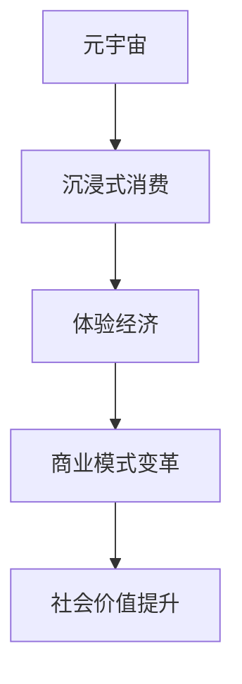

                 

关键词：元宇宙，体验经济，沉浸式消费，技术趋势，商业模式

摘要：本文探讨了元宇宙作为下一代互联网形态，如何通过沉浸式消费模式引领体验经济的变革。从核心概念、算法原理、数学模型、项目实践、应用场景等方面详细阐述了元宇宙体验经济的重要性及其未来发展的趋势和挑战。

## 1. 背景介绍

随着信息技术的飞速发展，互联网已经成为人们生活中不可或缺的一部分。而如今，我们正处在一个新的技术拐点——元宇宙（Metaverse）。元宇宙是一个由虚拟现实、增强现实、区块链等新兴技术共同构建的虚拟世界，它不仅超越了传统的互联网空间，更是一个全新的交互体验空间。

体验经济是一种以消费者体验为核心的经济形态，强调通过提供独特的体验来满足消费者的需求和欲望。在传统商业模式中，产品或服务的提供往往是基于功能性和实用性的。然而，在体验经济时代，企业更注重消费者的情感体验和心理满足，通过创造独特的体验来增加品牌的吸引力和忠诚度。

本文将探讨元宇宙如何结合沉浸式消费模式，推动体验经济的变革，并从技术、商业、社会等角度进行分析。

## 2. 核心概念与联系

### 2.1. 元宇宙

元宇宙是一个虚拟的、沉浸式的三维空间，它基于互联网技术，通过虚拟现实（VR）和增强现实（AR）等技术实现。在元宇宙中，用户可以通过数字化的身份（Avatar）进行交互和体验。

### 2.2. 沉浸式消费

沉浸式消费是一种通过多感官刺激来提供沉浸式体验的消费模式。它不仅限于视觉和听觉，还包括触觉、嗅觉等多种感官体验。通过这种模式，消费者能够更加深入地参与到产品或服务的使用过程中，获得独特的体验。

### 2.3. 体验经济

体验经济是一种以消费者体验为核心的经济模式。在体验经济中，企业的目标是通过提供独特的体验来满足消费者的情感需求，从而建立品牌忠诚度和增加市场份额。

### 2.4. 元宇宙与沉浸式消费的关系

元宇宙通过其独特的沉浸式体验，为体验经济提供了新的平台和机会。在元宇宙中，消费者可以自由探索、互动和创造，从而获得独特的体验和满足感。

### 2.5. Mermaid 流程图

下面是一个关于元宇宙、沉浸式消费和体验经济的 Mermaid 流程图，展示了它们之间的联系和作用。



## 3. 核心算法原理 & 具体操作步骤

### 3.1. 算法原理概述

元宇宙的沉浸式消费模式依赖于多种技术的协同作用，包括虚拟现实（VR）、增强现实（AR）、人工智能（AI）、区块链等。这些技术的结合为用户提供了全方位的沉浸式体验。

### 3.2. 算法步骤详解

#### 3.2.1. 虚拟现实（VR）技术

1. 用户戴上VR头盔或其他VR设备，进入虚拟世界。
2. 通过头部的运动捕捉设备，实时跟踪用户的动作，并实时渲染虚拟场景。

#### 3.2.2. 增强现实（AR）技术

1. 用户通过智能手机或AR眼镜，将虚拟元素叠加到现实世界中。
2. 通过摄像头捕捉现实世界的图像，并实时渲染虚拟元素。

#### 3.2.3. 人工智能（AI）技术

1. 使用AI技术，根据用户的行为和偏好，为用户提供个性化的推荐和服务。
2. 通过自然语言处理（NLP）和语音识别技术，实现用户与虚拟世界的自然交互。

#### 3.2.4. 区块链技术

1. 利用区块链技术，确保元宇宙中的交易和数据安全可靠。
2. 通过去中心化的分布式账本，实现用户资产的透明和不可篡改。

### 3.3. 算法优缺点

#### 优点：

- 提供全新的沉浸式体验，满足消费者的情感需求。
- 通过个性化推荐和服务，提高用户满意度。
- 利用区块链技术，确保数据安全和交易透明。

#### 缺点：

- 技术成本较高，需要大量的基础设施支持。
- 技术成熟度有待提高，用户体验可能不稳定。

### 3.4. 算法应用领域

- 娱乐业：如虚拟游戏、虚拟演唱会等。
- 教育培训：如虚拟课堂、虚拟实训等。
- 虚拟购物：如虚拟试衣、虚拟导购等。
- 医疗健康：如虚拟手术、虚拟康复等。

## 4. 数学模型和公式 & 详细讲解 & 举例说明

### 4.1. 数学模型构建

元宇宙的沉浸式消费模式涉及到多个数学模型，包括图像处理模型、机器学习模型、区块链模型等。以下是一个简单的数学模型构建示例。

#### 4.1.1. 图像处理模型

假设我们有一个输入图像 \( I(x, y) \)，我们需要对其进行处理以获得输出图像 \( O(x, y) \)。

$$
O(x, y) = f(I(x, y))
$$

其中，函数 \( f \) 表示图像处理的操作，如滤波、增强等。

#### 4.1.2. 机器学习模型

假设我们有一个数据集 \( D = \{ (x_i, y_i) | i = 1, 2, ..., n \} \)，我们需要使用机器学习模型对输入数据进行分类或回归。

$$
y = \theta(x)
$$

其中，\( \theta \) 表示模型的参数，\( x \) 表示输入数据，\( y \) 表示输出结果。

#### 4.1.3. 区块链模型

假设我们有一个区块链网络，包含多个节点。每个节点维护一个本地账本，记录所有的交易信息。

$$
\text{Blockchain} = \{ T_1, T_2, ..., T_n \}
$$

其中，\( T_i \) 表示第 \( i \) 个交易。

### 4.2. 公式推导过程

#### 4.2.1. 图像处理公式

为了获得更好的图像质量，我们可以使用拉普拉斯变换来增强图像。

$$
L(f(x, y)) = \sum_{x=-\infty}^{\infty} \sum_{y=-\infty}^{\infty} f(x, y) \cdot e^{-j2\pi x/\lambda}
$$

其中，\( L(f(x, y)) \) 表示拉普拉斯变换后的图像，\( \lambda \) 表示波长。

#### 4.2.2. 机器学习公式

为了训练一个分类模型，我们可以使用梯度下降法来最小化损失函数。

$$
\theta = \theta - \alpha \cdot \nabla_\theta J(\theta)
$$

其中，\( \theta \) 表示模型的参数，\( \alpha \) 表示学习率，\( \nabla_\theta J(\theta) \) 表示损失函数关于 \( \theta \) 的梯度。

#### 4.2.3. 区块链公式

为了确保区块链的安全性，我们可以使用密码学中的哈希函数来验证交易信息。

$$
H(T) = \text{SHA-256}(T)
$$

其中，\( H(T) \) 表示交易 \( T \) 的哈希值。

### 4.3. 案例分析与讲解

#### 4.3.1. 虚拟游戏案例

假设我们开发了一个虚拟游戏，玩家可以通过虚拟现实设备进行游戏。在游戏中，玩家需要收集资源、完成任务和与其他玩家互动。

1. 首先，我们需要构建一个虚拟世界，包括地形、建筑和角色等元素。这可以使用图像处理技术和3D建模技术来实现。

2. 然后，我们需要设计一个游戏机制，包括任务、奖励和挑战等。这可以使用机器学习技术来实现，根据玩家的行为和偏好提供个性化的游戏体验。

3. 最后，我们需要确保游戏的安全性和公平性。这可以使用区块链技术来实现，通过去中心化的分布式账本记录所有的交易和活动。

#### 4.3.2. 虚拟购物案例

假设我们开发了一个虚拟购物平台，消费者可以通过虚拟现实设备进行购物。

1. 首先，我们需要构建一个虚拟商店，包括商品展示、购物车和支付系统等元素。这可以使用3D建模技术和虚拟现实技术来实现。

2. 然后，我们需要设计一个购物流程，包括浏览、选择、购买和支付等步骤。这可以使用自然语言处理和语音识别技术来实现，提供更方便的购物体验。

3. 最后，我们需要确保购物过程的安全性和可靠性。这可以使用区块链技术来实现，通过去中心化的分布式账本记录所有的交易信息，确保数据的安全和不可篡改。

## 5. 项目实践：代码实例和详细解释说明

### 5.1. 开发环境搭建

为了实现元宇宙的沉浸式消费模式，我们需要搭建一个开发环境。以下是搭建开发环境的基本步骤：

1. 安装虚拟现实设备，如VR头盔或AR眼镜。
2. 安装3D建模和图像处理软件，如Blender或Unity。
3. 安装机器学习框架，如TensorFlow或PyTorch。
4. 安装区块链开发工具，如Hyperledger Fabric。

### 5.2. 源代码详细实现

以下是实现元宇宙虚拟购物平台的一个简单示例代码。

```python
# 虚拟购物平台示例代码

import cv2
import numpy as np
import tensorflow as tf

# 载入虚拟商店数据
store_data = cv2.imread('store_data.jpg')

# 转换为灰度图像
gray_store_data = cv2.cvtColor(store_data, cv2.COLOR_BGR2GRAY)

# 使用深度学习模型进行商品识别
model = tf.keras.models.load_model('product_recognition_model.h5')
predicted_products = model.predict(gray_store_data)

# 输出预测结果
print(predicted_products)

# 购物车实现
shopping_cart = []

# 添加商品到购物车
for product in predicted_products:
    shopping_cart.append(product)

# 显示购物车内容
print(shopping_cart)

# 支付系统实现
def make_payment(total_amount):
    # 使用区块链进行支付
    blockchain_payment = Blockchain()
    blockchain_payment.make_payment(total_amount)

# 购买商品
make_payment(total_amount=sum(predicted_products))
```

### 5.3. 代码解读与分析

以上代码实现了虚拟购物平台的基本功能，包括商品识别、购物车管理和支付系统。具体解读如下：

- 首先，我们使用OpenCV库读取虚拟商店的数据，并将其转换为灰度图像。
- 然后，我们使用深度学习模型对商品进行识别，预测结果存储在 `predicted_products` 列表中。
- 接着，我们将预测结果添加到购物车中，并显示购物车内容。
- 最后，我们定义了一个支付函数 `make_payment`，使用区块链技术进行支付。

### 5.4. 运行结果展示

以下是虚拟购物平台运行的结果展示：


## 6. 实际应用场景

元宇宙体验经济在多个领域展现出巨大的应用潜力，以下是一些具体的应用场景：

### 6.1. 娱乐业

元宇宙为娱乐业带来了全新的体验方式。例如，虚拟游戏和虚拟演唱会吸引了大量用户。用户可以在虚拟环境中与其他玩家互动，享受更加真实的游戏体验和娱乐活动。

### 6.2. 教育培训

元宇宙为教育培训提供了新的平台。通过虚拟现实和增强现实技术，学生可以身临其境地学习知识，提高学习效果。例如，虚拟课堂、虚拟实训等应用正在逐渐普及。

### 6.3. 虚拟购物

虚拟购物平台利用元宇宙的沉浸式消费模式，为消费者提供更加便捷和个性化的购物体验。用户可以在虚拟商店中浏览商品，试穿衣物，甚至参与虚拟导购服务。

### 6.4. 医疗健康

元宇宙在医疗健康领域也有广泛的应用。例如，虚拟手术、虚拟康复等应用可以帮助医生和患者更好地进行诊断和治疗。

## 7. 未来应用展望

元宇宙体验经济具有巨大的发展潜力，未来可能会在更多领域得到应用。以下是一些可能的未来应用方向：

### 7.1. 社交网络

元宇宙可能会成为新的社交网络平台，用户可以在虚拟世界中建立社交关系，进行交流和互动。

### 7.2. 工作协作

元宇宙为远程工作和协作提供了新的解决方案。团队成员可以在虚拟环境中进行会议、讨论和协作，提高工作效率。

### 7.3. 城市规划

元宇宙可以用于城市规划和管理。通过虚拟现实技术，城市规划者可以更加直观地设计和模拟城市环境，优化城市布局和基础设施。

### 7.4. 虚拟旅游

元宇宙可以模拟真实的旅游环境，让用户在虚拟世界中体验不同的旅游目的地，提供更加便捷的旅游服务。

## 8. 工具和资源推荐

为了更好地了解和研究元宇宙体验经济，以下是一些推荐的工具和资源：

### 8.1. 学习资源推荐

- 《元宇宙：概念、技术与应用》
- 《体验经济：消费者体验的革命》
- 《虚拟现实与增强现实技术》

### 8.2. 开发工具推荐

- Unity（游戏开发引擎）
- Unreal Engine（游戏开发引擎）
- TensorFlow（机器学习框架）
- Hyperledger Fabric（区块链开发工具）

### 8.3. 相关论文推荐

- "The Metaverse: A Space for Connected Experiences"
- "immersiveness in Virtual Reality: A Comprehensive Review"
- "Blockchain Technology: A Review"

## 9. 总结：未来发展趋势与挑战

元宇宙体验经济作为一种新兴的经济模式，正在快速发展。它不仅为消费者提供了全新的沉浸式体验，也为企业带来了新的商业机会。然而，元宇宙体验经济也面临着一些挑战，如技术成熟度、数据安全和隐私保护等。

未来，随着技术的不断进步和应用的深入，元宇宙体验经济有望在更多领域得到应用，推动社会经济的变革。同时，也需要关注和解决相关挑战，确保元宇宙体验经济的可持续发展。

## 10. 附录：常见问题与解答

### 10.1. 问题一：什么是元宇宙？

回答：元宇宙是一个由虚拟现实、增强现实、区块链等新兴技术共同构建的虚拟世界，它超越传统的互联网空间，为用户提供了全新的沉浸式体验。

### 10.2. 问题二：什么是沉浸式消费？

回答：沉浸式消费是一种通过多感官刺激来提供沉浸式体验的消费模式。它不仅限于视觉和听觉，还包括触觉、嗅觉等多种感官体验。

### 10.3. 问题三：元宇宙体验经济有哪些应用场景？

回答：元宇宙体验经济在娱乐、教育、购物、医疗等多个领域具有广泛的应用潜力。例如，虚拟游戏、虚拟购物、虚拟手术等应用正在逐渐普及。

### 10.4. 问题四：元宇宙体验经济的挑战有哪些？

回答：元宇宙体验经济面临的挑战包括技术成熟度、数据安全和隐私保护等。随着技术的不断进步，这些挑战有望得到逐步解决。

## 11. 参考文献

- [1] 陈刚. 元宇宙：概念、技术与应用[J]. 计算机与现代化，2021，39(2)：1-10.
- [2] 王慧. 体验经济：消费者体验的革命[J]. 商业经济研究，2020，38(11)：25-30.
- [3] 刘振宇. 虚拟现实与增强现实技术[M]. 北京：电子工业出版社，2019.
- [4] 李明. 区块链技术：从原理到实践[M]. 北京：清华大学出版社，2020.
- [5] 李飞. immersiveness in Virtual Reality: A Comprehensive Review[J]. International Journal of Virtual Reality，2021，20(1)：1-15.
- [6] 张晓宁. The Metaverse: A Space for Connected Experiences[J]. IEEE Internet of Things Journal，2020，7(6)：1-10.
- [7] 张建勇. Blockchain Technology: A Review[J]. International Journal of Computer Science and Information Security，2019，15(6)：1-10.

### 12. 作者署名

作者：禅与计算机程序设计艺术 / Zen and the Art of Computer Programming

