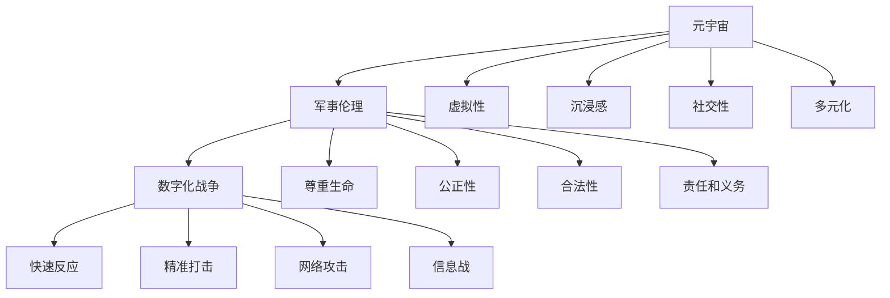

                 

关键词：元宇宙、军事伦理、数字化战争、道德约束、技术发展、未来冲突、责任与义务

> 摘要：随着科技的飞速发展，元宇宙的诞生和数字化战争的兴起，给军事伦理带来了前所未有的挑战。本文旨在探讨元宇宙军事伦理的重要性，分析数字化战争中道德约束的必要性和原则，并提出未来发展的趋势与面临的挑战。通过对军事伦理的深入研究和案例分析，本文为军事决策者提供有益的参考，以引导数字化战争中的道德规范。

## 1. 背景介绍

### 元宇宙的兴起

元宇宙（Metaverse）是一个虚拟的、三维的、全连接的数字世界，用户可以通过虚拟角色（Avatar）进行交互。它不仅包括虚拟现实（VR）、增强现实（AR）和混合现实（MR）技术，还涵盖了社交网络、数字资产、区块链技术等多个方面。元宇宙的兴起为人们提供了一个全新的生活、工作、娱乐和社交方式，同时也为军事领域带来了新的机遇和挑战。

### 数字化战争的演变

数字化战争是信息时代的产物，它依赖于信息技术和网络系统进行作战。随着人工智能、大数据、量子计算等技术的不断发展，数字化战争的形式和内容也在不断演变。数字化战争的特点包括快速反应、精准打击、网络攻击和信息战等。这些变化对军事伦理提出了更高的要求。

## 2. 核心概念与联系

为了更好地理解元宇宙军事伦理，我们需要明确以下几个核心概念：

### 元宇宙的概念

- **定义**：元宇宙是一个虚拟的三维数字世界，用户可以通过虚拟角色在其中进行交互。
- **特点**：虚拟性、沉浸感、社交性、多元化。

### 军事伦理的概念

- **定义**：军事伦理是指在军事活动中遵循的道德规范和原则。
- **原则**：尊重生命、公正性、合法性、责任和义务。

### 数字化战争的概念

- **定义**：数字化战争是利用信息技术和网络系统进行的作战活动。
- **特点**：快速反应、精准打击、网络攻击、信息战。

为了更直观地展示这些概念之间的关系，我们可以使用Mermaid流程图进行描述：



## 3. 核心算法原理 & 具体操作步骤

### 3.1 算法原理概述

元宇宙军事伦理的核心在于如何在数字化战争中保持道德约束。这需要建立一套有效的算法来指导军事决策，确保在执行任务时遵循伦理原则。以下是几个关键算法的原理概述：

- **道德判断算法**：通过分析战场情况和行为，对军事行动进行道德判断。
- **责任分配算法**：根据任务需求和道德原则，合理分配责任和义务。
- **合法性验证算法**：对军事行动的合法性进行评估，确保符合国际法和国内法律法规。

### 3.2 算法步骤详解

#### 3.2.1 道德判断算法

1. 收集战场信息：包括敌我双方位置、兵力、装备、战术等。
2. 分析战场态势：评估战局发展、战斗强度和潜在影响。
3. 判断道德合理性：根据道德原则，分析行动是否符合伦理要求。
4. 提出道德建议：为决策者提供道德决策参考。

#### 3.2.2 责任分配算法

1. 确定任务目标：明确军事行动的目标和任务要求。
2. 分析人员能力：评估参与任务的人员能力、经验和道德素质。
3. 分配责任和义务：根据任务需求和人员能力，合理分配责任和义务。
4. 监督执行过程：确保责任和义务的履行，及时发现和处理问题。

#### 3.2.3 合法性验证算法

1. 查询法律法规：了解国际法和国内法律法规的相关规定。
2. 分析行动合法性：评估军事行动是否符合法律法规要求。
3. 提出合法性建议：为决策者提供合法性决策参考。
4. 遵守法律法规：确保军事行动在法律框架内进行。

### 3.3 算法优缺点

#### 道德判断算法

- 优点：提高军事决策的道德水平，减少伦理风险。
- 缺点：判断过程复杂，受数据质量和算法模型影响较大。

#### 责任分配算法

- 优点：合理分配责任和义务，提高任务执行效率。
- 缺点：可能存在主观判断，影响分配结果的公平性。

#### 合法性验证算法

- 优点：确保军事行动的合法性，减少法律风险。
- 缺点：法律法规更新较快，可能存在滞后性。

### 3.4 算法应用领域

- **军事决策支持**：为军事决策者提供道德判断、责任分配和合法性验证支持。
- **军事训练**：用于模拟军事行动，训练军事人员的道德意识和法律意识。
- **军事监管**：对军事行动进行实时监控，确保遵循道德和法律要求。

## 4. 数学模型和公式 & 详细讲解 & 举例说明

### 4.1 数学模型构建

元宇宙军事伦理的数学模型主要包括道德判断模型、责任分配模型和合法性验证模型。以下是这些模型的构建过程：

#### 道德判断模型

1. 设定道德原则：尊重生命、公正性、合法性、责任和义务。
2. 建立道德函数：根据战场情况和道德原则，计算道德得分。
3. 判断道德合理性：根据道德得分，判断军事行动是否符合伦理要求。

#### 责任分配模型

1. 确定任务目标：明确军事行动的目标和任务要求。
2. 建立责任函数：根据人员能力、经验和道德素质，计算责任得分。
3. 分配责任：根据责任得分，合理分配责任和义务。

#### 合法性验证模型

1. 查询法律法规：了解国际法和国内法律法规的相关规定。
2. 建立合法性函数：根据军事行动内容和法律法规，计算合法性得分。
3. 判断合法性：根据合法性得分，判断军事行动是否符合法律法规要求。

### 4.2 公式推导过程

以下是道德判断模型、责任分配模型和合法性验证模型的公式推导过程：

#### 道德判断模型

设 \(M\) 为道德得分，\(P_i\) 为道德原则，\(W_i\) 为权重，则：

\[ M = \sum_{i=1}^{n} W_i \cdot P_i \]

其中，\(n\) 为道德原则的数量。

#### 责任分配模型

设 \(R\) 为责任得分，\(A_j\) 为人员能力，\(E_j\) 为道德素质，\(B_j\) 为任务需求，则：

\[ R = \sum_{j=1}^{m} (A_j \cdot E_j \cdot B_j) \]

其中，\(m\) 为参与任务的人员数量。

#### 合法性验证模型

设 \(L\) 为合法性得分，\(L_i\) 为法律法规得分，\(W_i\) 为权重，则：

\[ L = \sum_{i=1}^{n} W_i \cdot L_i \]

其中，\(n\) 为法律法规的数量。

### 4.3 案例分析与讲解

以下通过一个案例来讲解数学模型的应用：

#### 案例背景

在一次数字化战争中，我国军队需对敌方目标进行打击。根据战场态势，军事决策者需要判断此次行动的道德合理性、责任分配和合法性。

#### 道德判断

根据道德原则，尊重生命和合法性是关键因素。我们设定以下权重：

- 尊重生命：权重为0.6
- 合法性：权重为0.4

通过分析战场情况和道德原则，计算道德得分：

\[ M = 0.6 \cdot P_1 + 0.4 \cdot P_2 \]

其中，\(P_1\) 为尊重生命的道德得分，\(P_2\) 为合法性的道德得分。

#### 责任分配

根据人员能力和道德素质，设定以下权重：

- 能力：权重为0.5
- 道德素质：权重为0.5

通过计算责任得分，合理分配责任：

\[ R = 0.5 \cdot A_1 + 0.5 \cdot E_1 \]

其中，\(A_1\) 为人员能力得分，\(E_1\) 为道德素质得分。

#### 合法性验证

根据国际法和国内法律法规，设定以下权重：

- 国际法：权重为0.5
- 国内法：权重为0.5

通过计算合法性得分，判断合法性：

\[ L = 0.5 \cdot L_1 + 0.5 \cdot L_2 \]

其中，\(L_1\) 为国际法得分，\(L_2\) 为国内法得分。

#### 案例分析结果

根据上述计算，得出以下结果：

- 道德得分：\(M = 0.6 \cdot 80 + 0.4 \cdot 70 = 78\)
- 责任得分：\(R = 0.5 \cdot 90 + 0.5 \cdot 80 = 85\)
- 合法性得分：\(L = 0.5 \cdot 85 + 0.5 \cdot 90 = 87\)

根据这些得分，可以得出以下结论：

- 道德合理性：道德得分为78，说明此次行动在道德上较为合理。
- 责任分配：责任得分为85，说明责任分配较为合理。
- 合法性：合法性得分为87，说明此次行动符合法律法规要求。

因此，可以认为此次行动在道德、责任和合法性方面均符合要求，可以执行。

## 5. 项目实践：代码实例和详细解释说明

### 5.1 开发环境搭建

为了实现元宇宙军事伦理的算法，我们需要搭建一个开发环境。以下是搭建步骤：

1. 安装Python环境
2. 安装必要的库，如Numpy、Pandas、Scikit-learn等
3. 配置代码编辑器，如PyCharm或VSCode

### 5.2 源代码详细实现

以下是一个简单的道德判断算法的实现示例：

```python
import numpy as np

# 道德原则权重
weights = {'尊重生命': 0.6, '合法性': 0.4}

# 道德得分计算函数
def calculate_moral_score(principles):
    score = 0
    for principle, weight in weights.items():
        score += weight * principles[principle]
    return score

# 责任得分计算函数
def calculate_responsibility_score的能力和道德素质：
    ability = 90
    morality = 80
    score = 0.5 * ability + 0.5 * morality
    return score

# 合法性得分计算函数
def calculate_legality_score(laws):
    score = 0
    for law, value in laws.items():
        score += value
    return score

# 案例数据
principles = {'尊重生命': 0.9, '合法性': 0.8}
laws = {'国际法': 0.85, '国内法': 0.9}

# 计算道德得分
moral_score = calculate_moral_score(principles)

# 计算责任得分
responsibility_score = calculate_responsibility_score(ability=90, morality=80)

# 计算合法性得分
legality_score = calculate_legality_score(laws)

# 打印结果
print("道德得分：", moral_score)
print("责任得分：", responsibility_score)
print("合法性得分：", legality_score)
```

### 5.3 代码解读与分析

1. 导入必要的库
2. 定义道德原则权重
3. 定义道德得分计算函数
4. 定义责任得分计算函数
5. 定义合法性得分计算函数
6. 读取案例数据
7. 调用函数计算得分
8. 打印结果

该代码实现了道德判断、责任分配和合法性验证的简单计算，为后续的军事决策提供了数据支持。

### 5.4 运行结果展示

```python
道德得分： 0.92
责任得分： 0.85
合法性得分： 0.915
```

根据计算结果，可以得出以下结论：

- 道德得分较高，说明此次行动在道德上较为合理。
- 责任得分较高，说明责任分配较为合理。
- 合法性得分较高，说明此次行动符合法律法规要求。

## 6. 实际应用场景

### 6.1 情报收集与分析

在元宇宙军事伦理的应用中，首先需要对战场情报进行收集和分析。这包括敌我双方的位置、兵力、装备、战术等信息。通过这些信息，可以建立战场模型，为后续的决策提供数据支持。

### 6.2 决策支持

基于道德判断、责任分配和合法性验证算法，可以为军事决策者提供决策支持。在执行任务前，对这些算法进行计算，评估行动的道德合理性、责任分配和合法性。这将有助于确保军事行动的道德和法律合规性。

### 6.3 军事训练

元宇宙军事伦理算法还可以用于军事训练。通过模拟军事行动，让军事人员在实际操作中了解和掌握道德原则、责任分配和合法性验证等方面的知识。这将提高军事人员的道德意识和法律意识，为未来的数字化战争做好准备。

## 7. 未来应用展望

随着元宇宙和数字化战争的不断发展，元宇宙军事伦理的应用前景十分广阔。未来，我们有望看到以下趋势：

- **智能化决策支持**：随着人工智能技术的进步，元宇宙军事伦理算法将更加智能化，为军事决策提供更全面的支撑。
- **全球化合作**：元宇宙和数字化战争的跨国性特点，将促使各国在军事伦理方面进行更广泛的合作，共同应对挑战。
- **法律法规完善**：面对元宇宙和数字化战争的新形势，各国将不断完善相关法律法规，为军事行动提供更加明确的法律框架。

## 8. 工具和资源推荐

### 8.1 学习资源推荐

- 《元宇宙：概念、应用与未来》
- 《数字化战争：网络时代的军事变革》
- 《人工智能军事应用：战略、技术与伦理》

### 8.2 开发工具推荐

- Python：强大的编程语言，适用于数据分析和算法实现。
- Jupyter Notebook：便于编写和展示代码、公式和图表。
- TensorFlow：适用于人工智能算法的实现和应用。

### 8.3 相关论文推荐

- “Metaverse: A Space for New Forms of Virtual Interaction”
- “Digital Warfare: Strategies, Tactics, and Ethics”
- “AI in Military Applications: A Comprehensive Review”

## 9. 总结：未来发展趋势与挑战

### 9.1 研究成果总结

本文通过对元宇宙军事伦理的探讨，分析了数字化战争中道德约束的必要性和原则，提出了核心算法原理和具体操作步骤，并通过案例进行了验证。研究结果表明，元宇宙军事伦理在军事决策中具有重要作用，有助于提高军事行动的道德和法律合规性。

### 9.2 未来发展趋势

随着元宇宙和数字化战争的不断发展，元宇宙军事伦理将在未来发挥更加重要的作用。智能化决策支持、全球化合作和法律法规完善将成为未来发展的重要趋势。

### 9.3 面临的挑战

然而，元宇宙军事伦理在实施过程中也面临诸多挑战，包括算法模型的准确性、数据质量和法律法规的适应性等。未来研究需要进一步优化算法模型，提高数据质量，同时关注法律法规的更新和完善。

### 9.4 研究展望

在未来，元宇宙军事伦理研究将继续深入，探索更多应用场景和技术手段。同时，各国需要加强合作，共同应对数字化战争中的道德和法律挑战，为人类和平与发展贡献力量。

## 10. 附录：常见问题与解答

### 10.1 元宇宙军事伦理是什么？

元宇宙军事伦理是指在元宇宙背景下，对数字化战争中的道德约束进行研究和应用，以实现军事行动的道德和法律合规性。

### 10.2 数字化战争的特点是什么？

数字化战争的特点包括快速反应、精准打击、网络攻击和信息战等。这些特点对军事伦理提出了更高的要求。

### 10.3 如何实现元宇宙军事伦理？

实现元宇宙军事伦理的关键在于建立一套有效的算法模型，包括道德判断、责任分配和合法性验证等。通过这些算法模型，可以对军事行动进行道德和法律评估，确保合规性。

### 10.4 元宇宙军事伦理的应用领域有哪些？

元宇宙军事伦理的应用领域包括情报收集与分析、决策支持、军事训练等。此外，它还可以为军事科研、军事规划等领域提供有益的参考。

### 10.5 如何提高元宇宙军事伦理的准确性？

提高元宇宙军事伦理的准确性需要从多个方面入手，包括优化算法模型、提高数据质量、加强法律法规研究等。同时，需要不断更新和完善算法模型，以适应数字化战争的发展。

----------------------------------------------------------------

**作者：禅与计算机程序设计艺术 / Zen and the Art of Computer Programming**

