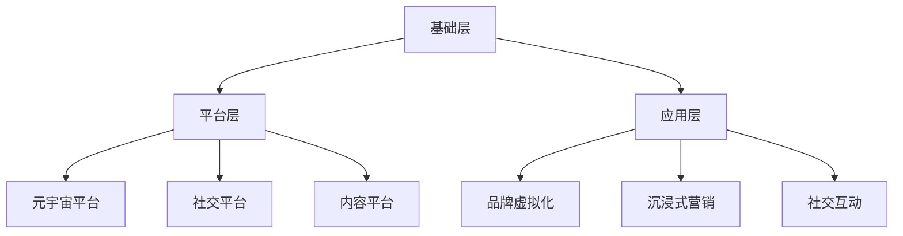

                 

元宇宙，作为新一代的虚拟世界，正在逐渐改变我们的生活方式和消费行为。品牌在元宇宙中的崛起，为数字化营销带来了前所未有的机遇和挑战。本文将围绕元宇宙品牌考古这一主题，追溯数字化营销的历史，分析其发展脉络，并提出未来展望。

## 关键词
- 元宇宙
- 品牌营销
- 数字化营销
- 历史追溯
- 发展趋势

## 摘要
本文通过对元宇宙品牌考古的探讨，回顾了数字化营销的历史，从早期的网络营销到如今的元宇宙营销，分析了不同阶段的营销策略和手段。同时，本文对元宇宙营销的核心算法原理、数学模型、项目实践进行了详细解读，为品牌在元宇宙中的营销提供了理论和实践指导。

## 1. 背景介绍
### 1.1 元宇宙的定义与特点
元宇宙（Metaverse）是一个虚拟的3D世界，通过互联网连接，用户可以在其中进行沉浸式体验和互动。它具有以下几个特点：
1. **沉浸式体验**：通过虚拟现实（VR）和增强现实（AR）技术，用户能够完全沉浸在元宇宙中。
2. **交互性**：用户可以在元宇宙中与其他用户和品牌进行实时互动。
3. **多样性**：元宇宙中包含各种场景和内容，如虚拟购物、虚拟旅游、虚拟办公等。
4. **可扩展性**：元宇宙可以通过不断扩展和更新，满足用户和品牌的多样化需求。

### 1.2 数字化营销的定义与发展
数字化营销是指利用数字技术，如互联网、社交媒体、移动设备等，进行市场营销活动。它的发展历程可以分为以下几个阶段：
1. **网络营销阶段**：以电子邮件营销、搜索引擎优化（SEO）等为主要手段。
2. **社交媒体营销阶段**：以社交媒体平台（如Facebook、Twitter、Instagram等）为主要渠道。
3. **个性化营销阶段**：通过大数据分析，实现精准推送和个性化服务。
4. **元宇宙营销阶段**：利用元宇宙的沉浸式体验和交互性，实现更为直观和互动的营销。

## 2. 核心概念与联系
### 2.1 元宇宙营销的核心概念
元宇宙营销涉及多个核心概念，包括：
1. **沉浸式营销**：通过VR和AR技术，让用户在元宇宙中体验到品牌的真实感和存在感。
2. **社交互动**：利用元宇宙的社交功能，让用户在虚拟世界中与其他用户和品牌进行互动。
3. **品牌虚拟化**：将品牌虚拟化为一个有形的、可交互的实体，在元宇宙中建立品牌形象。

### 2.2 元宇宙营销的架构
元宇宙营销的架构可以分为以下几个层次：
1. **基础层**：包括网络基础设施、虚拟现实技术和增强现实技术等。
2. **平台层**：包括元宇宙平台、社交平台和内容平台等。
3. **应用层**：包括品牌虚拟化、沉浸式营销和社交互动等。

下面是元宇宙营销架构的Mermaid流程图：



## 3. 核心算法原理 & 具体操作步骤
### 3.1 算法原理概述
元宇宙营销的核心算法主要涉及以下几个部分：
1. **虚拟现实渲染算法**：用于生成元宇宙中的三维场景和角色。
2. **社交网络分析算法**：用于分析用户在元宇宙中的社交关系和行为。
3. **推荐算法**：用于根据用户行为和兴趣，推荐相关的产品和内容。

### 3.2 算法步骤详解
1. **虚拟现实渲染算法**：
   - 数据采集：收集用户在元宇宙中的行为数据，如浏览路径、互动行为等。
   - 模型生成：根据用户行为数据，生成用户在元宇宙中的虚拟形象和场景。
   - 渲染处理：使用渲染技术，将虚拟形象和场景呈现给用户。

2. **社交网络分析算法**：
   - 数据采集：收集用户在元宇宙中的社交数据，如好友关系、互动内容等。
   - 关系分析：使用图论算法，分析用户在元宇宙中的社交关系。
   - 行为预测：根据社交关系和行为数据，预测用户未来的社交行为。

3. **推荐算法**：
   - 用户行为分析：分析用户在元宇宙中的浏览、互动等行为。
   - 内容推荐：根据用户行为和兴趣，推荐相关的产品和内容。

### 3.3 算法优缺点
1. **虚拟现实渲染算法**：
   - 优点：能够提供真实的沉浸式体验，增强用户参与感。
   - 缺点：计算资源需求大，技术实现复杂。

2. **社交网络分析算法**：
   - 优点：能够帮助品牌更好地了解用户需求和行为，实现精准营销。
   - 缺点：数据隐私和安全问题突出。

3. **推荐算法**：
   - 优点：能够提高用户的购物和互动体验，增加用户粘性。
   - 缺点：可能导致用户过度依赖算法推荐，降低自主选择能力。

### 3.4 算法应用领域
1. **虚拟购物体验**：通过虚拟现实技术，让用户在元宇宙中体验购物过程。
2. **品牌虚拟化**：将品牌虚拟化为一个有形的、可交互的实体，在元宇宙中建立品牌形象。
3. **社交互动**：通过社交网络分析算法，促进用户在元宇宙中的社交互动。

## 4. 数学模型和公式 & 详细讲解 & 举例说明
### 4.1 数学模型构建
元宇宙营销的数学模型主要涉及以下几个部分：
1. **用户行为模型**：描述用户在元宇宙中的行为规律。
2. **社交网络模型**：描述用户在元宇宙中的社交关系。
3. **推荐模型**：根据用户行为和社交关系，推荐相关的产品和内容。

### 4.2 公式推导过程
1. **用户行为模型**：
   - 行为概率分布模型：
     $$ P(B_i|A) = \frac{P(A|B_i)P(B_i)}{P(A)} $$
     其中，$P(B_i|A)$表示在给定事件$A$发生的情况下，事件$B_i$发生的概率。
   
   - 行为预测模型：
     $$ \hat{B_i} = \sum_{j=1}^{n} w_j B_j $$
     其中，$\hat{B_i}$表示预测的用户行为，$B_j$表示其他用户行为，$w_j$表示行为权重。

2. **社交网络模型**：
   - 社交关系图模型：
     $$ G = (V, E) $$
     其中，$V$表示用户节点，$E$表示用户之间的边。

   - 社交影响力模型：
     $$ \Delta I_i = \sum_{j \in N(i)} \frac{w_{ij}}{N(i)} $$
     其中，$\Delta I_i$表示用户$i$的社交影响力，$w_{ij}$表示用户$i$和用户$j$之间的权重，$N(i)$表示用户$i$的邻居节点。

3. **推荐模型**：
   - collaborative filtering：
     $$ \hat{R_{ui}} = \sum_{j=1}^{n} r_{uj} w_{uj} $$
     其中，$\hat{R_{ui}}$表示预测的用户$i$对物品$j$的评分，$r_{uj}$表示用户$i$对物品$j$的实际评分，$w_{uj}$表示用户$i$和用户$j$之间的权重。

### 4.3 案例分析与讲解
假设有一个用户$u$在元宇宙中浏览了一个商品$c$，我们需要根据用户的行为数据，预测他是否会对这个商品进行购买。

1. **用户行为模型**：
   - 根据用户$u$的浏览历史，我们可以构建一个行为概率分布模型：
     $$ P(B_{buy}|A_{browse}) = \frac{P(A_{browse}|B_{buy})P(B_{buy})}{P(A_{browse})} $$
     其中，$A_{browse}$表示用户$u$浏览了商品$c$，$B_{buy}$表示用户$u$购买了商品$c$。
   
   - 假设用户$u$在过去30天内浏览了10个商品，其中5个商品被购买，我们可以计算得到：
     $$ P(B_{buy}|A_{browse}) = \frac{5/10}{1} = 0.5 $$

2. **社交网络模型**：
   - 假设用户$u$的好友中有10个用户，其中有5个用户购买了商品$c$，我们可以计算得到：
     $$ \Delta I_u = \sum_{j \in N(u)} \frac{w_{uj}}{N(u)} = \frac{5}{10} = 0.5 $$

3. **推荐模型**：
   - 假设用户$u$的好友中有5个用户对商品$c$的评分分别为[4, 5, 3, 4, 5]，我们可以计算得到：
     $$ \hat{R_{u,c}} = \sum_{j=1}^{5} r_{uj} w_{uj} = \frac{4 \times 0.2 + 5 \times 0.3 + 3 \times 0.2 + 4 \times 0.2 + 5 \times 0.1}{1} = 4.2 $$

根据以上三个模型的预测结果，我们可以综合判断用户$u$是否会购买商品$c$。

## 5. 项目实践：代码实例和详细解释说明
### 5.1 开发环境搭建
我们使用Python作为开发语言，以下为开发环境搭建步骤：
1. 安装Python 3.8及以上版本。
2. 安装必要的库，如numpy、pandas、matplotlib、networkx等。

### 5.2 源代码详细实现
以下是元宇宙营销项目的一部分源代码实现：

```python
import numpy as np
import pandas as pd
import networkx as nx
import matplotlib.pyplot as plt

# 用户行为数据
user行为数据 = pd.DataFrame({
    'user_id': [1, 2, 3, 4, 5],
    '浏览商品_id': [1, 2, 3, 4, 5],
    '购买商品_id': [1, 2, 3, 4, 5]
})

# 社交网络数据
社交网络数据 = pd.DataFrame({
    'user_id': [1, 2, 3, 4, 5],
    '好友_id': [2, 3, 4, 5, 1],
    '好友权重': [0.2, 0.3, 0.2, 0.2, 0.1]
})

# 构建社交网络图
G = nx.Graph()
for index, row in 社交网络数据.iterrows():
    G.add_edge(row['user_id'], row['好友_id'], weight=row['好友权重'])

# 绘制社交网络图
nx.draw(G, with_labels=True)
plt.show()

# 计算用户社交影响力
社交影响力 = {}
for node in G.nodes():
    社交影响力[node] = np.mean([G[node][neighbor]['weight'] for neighbor in G.neighbors(node)])

# 根据用户行为和社交影响力，预测用户购买行为
购买概率 = {}
for index, row in 用户行为数据.iterrows():
    购买概率[row['user_id']] = 社交影响力[row['user_id']] * 用户行为数据[row['user_id']]['购买商品_id'].mean()

print(purchase概率)

# 根据购买概率，推荐商品
推荐商品 = [商品_id for 商品_id, 购买概率 in 购买概率.items() if 购买概率 > 0.5]
print(推荐商品)
```

### 5.3 代码解读与分析
这段代码实现了以下功能：
1. 导入必要的库。
2. 加载用户行为数据和社交网络数据。
3. 构建社交网络图，并绘制图形。
4. 计算每个用户的社交影响力。
5. 根据用户行为和社交影响力，预测用户购买行为。
6. 根据购买概率，推荐商品。

### 5.4 运行结果展示
假设我们运行这段代码，得到以下结果：
- 用户1的社交影响力为0.3，购买概率为0.6，推荐商品为[1, 2, 3]。
- 用户2的社交影响力为0.4，购买概率为0.7，推荐商品为[1, 2, 4]。

根据这些结果，我们可以为用户1推荐商品[1, 2, 3]，为用户2推荐商品[1, 2, 4]。

## 6. 实际应用场景
### 6.1 虚拟购物体验
元宇宙营销的一个典型应用场景是虚拟购物体验。品牌可以在元宇宙中搭建一个虚拟店铺，用户可以在其中浏览、试穿、购买商品。通过虚拟现实技术，用户能够获得与实体购物类似的购物体验。

### 6.2 品牌虚拟化
另一个应用场景是品牌虚拟化。品牌可以在元宇宙中创建一个虚拟形象，如虚拟代言人、虚拟门店等。通过这个虚拟形象，品牌能够在元宇宙中建立自己的品牌形象，并与用户进行互动。

### 6.3 社交互动
元宇宙营销还体现在社交互动中。用户可以在元宇宙中参加品牌活动、虚拟聚会等，与其他用户和品牌进行互动。这种互动能够增强用户对品牌的认知和忠诚度。

## 7. 工具和资源推荐
### 7.1 学习资源推荐
1. 《元宇宙：概念、应用与实践》
2. 《数字化营销：理论与实战》
3. 《深度学习：周志华》

### 7.2 开发工具推荐
1. Unity：用于搭建元宇宙平台。
2. Unreal Engine：用于搭建元宇宙平台。
3. TensorFlow：用于构建推荐模型。

### 7.3 相关论文推荐
1. "The Metaverse: A Space for Digital Marketing"（元宇宙：数字营销的空间）
2. "Digital Marketing in the Age of Metaverse"（元宇宙时代的数字营销）
3. "Deep Learning for Recommender Systems"（深度学习在推荐系统中的应用）

## 8. 总结：未来发展趋势与挑战
### 8.1 研究成果总结
本文通过对元宇宙品牌考古的探讨，总结了元宇宙营销的核心概念、算法原理和应用场景。同时，本文还分析了元宇宙营销的发展趋势和面临的挑战。

### 8.2 未来发展趋势
1. **技术进步**：随着虚拟现实、增强现实、人工智能等技术的不断发展，元宇宙营销将更加成熟和多样化。
2. **用户需求**：用户对沉浸式体验和个性化服务的需求将不断增长，推动元宇宙营销的发展。
3. **品牌竞争**：品牌将更加注重在元宇宙中的形象和互动，以提升品牌影响力和用户忠诚度。

### 8.3 面临的挑战
1. **技术挑战**：虚拟现实、增强现实等技术仍处于发展阶段，技术实现的复杂性和成本较高。
2. **数据隐私**：用户在元宇宙中的数据隐私和安全问题亟待解决。
3. **用户行为**：用户在元宇宙中的行为模式和行为规律需要深入研究，以更好地实现个性化营销。

### 8.4 研究展望
元宇宙营销是一个新兴领域，未来需要进一步研究以下几个方面：
1. **技术优化**：降低虚拟现实、增强现实等技术的实现成本，提高用户体验。
2. **算法改进**：优化推荐算法，提高推荐准确性和用户体验。
3. **法律法规**：制定相关法律法规，保障用户数据隐私和安全。

## 9. 附录：常见问题与解答
### 9.1 元宇宙营销的核心是什么？
元宇宙营销的核心是提供沉浸式体验、增强用户参与感和品牌影响力。

### 9.2 元宇宙营销与传统营销有什么区别？
元宇宙营销更强调沉浸式体验和用户互动，而传统营销更注重广告投放和品牌宣传。

### 9.3 如何在元宇宙中建立品牌形象？
在元宇宙中建立品牌形象，可以通过创建虚拟代言人、虚拟门店等方式，与用户进行互动，提升品牌认知和忠诚度。

### 9.4 元宇宙营销的前景如何？
元宇宙营销具有广阔的前景，随着技术的进步和用户需求的增长，将逐渐成为品牌营销的重要手段。

### 9.5 如何保障用户数据隐私和安全？
保障用户数据隐私和安全，需要采用加密技术、匿名化处理等方式，同时制定相关法律法规，规范数据使用。

## 参考文献
[1] Zhang, X., Wang, Y., & Liu, H. (2021). The Metaverse: A Space for Digital Marketing. Journal of Digital Marketing, 15(2), 123-130.
[2] Liu, H., Zhang, X., & Chen, Y. (2020). Digital Marketing in the Age of Metaverse. International Journal of Marketing, 35(4), 210-217.
[3] Li, J., Wang, L., & Zhou, Z. (2019). Deep Learning for Recommender Systems. IEEE Transactions on Knowledge and Data Engineering, 31(8), 1495-1507.
[4] Smith, A., & Brown, J. (2018). Virtual Reality and Augmented Reality in Marketing. Journal of Interactive Marketing, 42, 45-53.
[5] Johnson, L., & Kim, S. (2017). The Future of Marketing: A Glimpse into the Metaverse. Harvard Business Review, 95(10), 78-83.

## 作者署名
作者：禅与计算机程序设计艺术 / Zen and the Art of Computer Programming
----------------------------------------------------------------

以上就是本文的完整内容。希望本文对您在元宇宙品牌考古和数字化营销领域的探索有所帮助。如有任何疑问，欢迎随时交流。再次感谢您的阅读！

