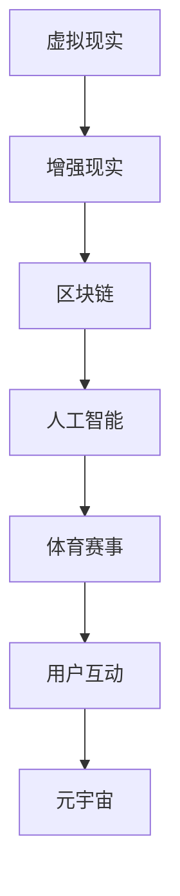

                 

关键词：元宇宙、虚拟现实、体育、全球、虚实结合、技术、创新、娱乐、交互

> 摘要：本文探讨了元宇宙奥运会的概念、技术架构和未来应用场景，分析了虚实结合体育赛事的优势及其在全球范围内的潜力，为读者提供了对元宇宙奥运会全面而深刻的理解。

## 1. 背景介绍

### 元宇宙的概念

元宇宙（Metaverse）是一个虚拟的、三维的、交互性的数字世界，它融合了虚拟现实（VR）、增强现实（AR）、区块链、人工智能（AI）等多种技术，用户可以在其中进行社交、工作、娱乐、教育等各种活动。随着5G、云计算、物联网等技术的不断发展，元宇宙正逐渐从概念走向实际应用。

### 体育产业的变革

体育产业作为全球最具影响力的产业之一，一直在追求创新与变革。随着虚拟现实、增强现实等技术的发展，体育赛事的呈现形式也发生了巨大变化。传统的现场观众逐渐被虚拟观众所替代，虚拟现实技术让球迷可以更加身临其境地观看比赛。此外，体育产业也开始尝试利用区块链技术来实现票务、版权等环节的透明化和去中心化。

## 2. 核心概念与联系

### 技术架构图



### 核心概念原理

- **虚拟现实（VR）**：通过头戴式显示器等设备，让用户沉浸在虚拟的三维空间中，实现沉浸式体验。
- **增强现实（AR）**：在现实世界中叠加虚拟元素，让用户可以看到和操作虚拟对象，实现虚实结合。
- **区块链**：一种去中心化的分布式数据库，可以确保数据的安全和透明。
- **人工智能**：利用机器学习、深度学习等技术，为用户提供个性化服务，提高用户体验。

## 3. 核心算法原理 & 具体操作步骤

### 3.1 算法原理概述

元宇宙奥运会的关键算法主要包括以下几个方面：

- **虚拟现实渲染算法**：用于实时渲染虚拟场景，提供流畅的视觉体验。
- **增强现实标记算法**：用于识别现实世界中的物体，并在其上叠加虚拟元素。
- **区块链交易算法**：用于处理元宇宙中的交易，确保数据的安全和透明。
- **人工智能推荐算法**：用于为用户提供个性化推荐，提高用户满意度。

### 3.2 算法步骤详解

1. **虚拟现实渲染算法**：

   - **场景构建**：根据用户的需求和赛事信息，构建虚拟场景。
   - **纹理映射**：为场景中的物体添加纹理，提高视觉效果。
   - **光线追踪**：模拟真实世界中的光线传播，实现逼真的光影效果。
   - **实时渲染**：将构建好的场景实时渲染到头戴式显示器上，提供沉浸式体验。

2. **增强现实标记算法**：

   - **物体识别**：利用深度学习技术，识别现实世界中的物体。
   - **虚拟叠加**：在识别出的物体上叠加虚拟元素，实现虚实结合。
   - **交互反馈**：根据用户的操作，调整虚拟元素的显示和交互方式。

3. **区块链交易算法**：

   - **交易生成**：当用户在元宇宙中进行交易时，生成交易信息。
   - **数据验证**：利用区块链技术，验证交易信息的真实性。
   - **记录存储**：将验证后的交易信息记录到区块链上，确保数据的透明和不可篡改。

4. **人工智能推荐算法**：

   - **数据收集**：收集用户的历史行为数据。
   - **特征提取**：提取用户行为数据中的关键特征。
   - **模型训练**：利用机器学习技术，训练推荐模型。
   - **个性化推荐**：根据用户的特征，为用户推荐个性化的赛事和内容。

### 3.3 算法优缺点

- **虚拟现实渲染算法**：

  - 优点：提供沉浸式体验，让用户仿佛身临其境。

  - 缺点：计算资源消耗大，对硬件设备要求高。

- **增强现实标记算法**：

  - 优点：实现虚实结合，提高用户互动性。

  - 缺点：物体识别精度受环境影响大。

- **区块链交易算法**：

  - 优点：确保交易的安全性和透明性。

  - 缺点：交易处理速度较慢，不适合高频交易。

- **人工智能推荐算法**：

  - 优点：为用户提供个性化服务，提高用户满意度。

  - 缺点：需要大量数据支持，对隐私保护要求高。

### 3.4 算法应用领域

- **虚拟现实渲染算法**：广泛应用于虚拟现实游戏、教育培训等领域。

- **增强现实标记算法**：广泛应用于增强现实应用、智能家居等领域。

- **区块链交易算法**：广泛应用于数字货币、智能合约等领域。

- **人工智能推荐算法**：广泛应用于推荐系统、智能客服等领域。

## 4. 数学模型和公式 & 详细讲解 & 举例说明

### 4.1 数学模型构建

元宇宙奥运会的数学模型主要包括以下几个方面：

- **虚拟现实渲染模型**：基于光线追踪技术，构建虚拟场景的数学模型。

- **增强现实标记模型**：基于计算机视觉技术，构建物体识别和虚拟叠加的数学模型。

- **区块链交易模型**：基于分布式账本技术，构建交易验证和记录的数学模型。

- **人工智能推荐模型**：基于机器学习技术，构建用户行为分析和个性化推荐的数学模型。

### 4.2 公式推导过程

1. **虚拟现实渲染模型**：

   - **光线追踪公式**：

     $$ L(x, y, z) = I_0 \cdot f_r(\theta) \cdot \cos^5(\theta) $$

     其中，$L(x, y, z)$ 表示虚拟场景中的光线强度，$I_0$ 表示初始光线强度，$f_r(\theta)$ 表示反射率，$\theta$ 表示光线入射角度。

2. **增强现实标记模型**：

   - **物体识别公式**：

     $$ d(x, y) = \frac{1}{\sqrt{x^2 + y^2}} $$

     其中，$d(x, y)$ 表示物体与摄像头的距离，$x$ 和 $y$ 表示物体在摄像头坐标系中的坐标。

3. **区块链交易模型**：

   - **交易验证公式**：

     $$ V(t) = \frac{1}{1 + e^{-k \cdot (t - t_0)}} $$

     其中，$V(t)$ 表示交易验证概率，$k$ 表示交易验证强度，$t$ 和 $t_0$ 分别表示当前时间和初始时间。

4. **人工智能推荐模型**：

   - **推荐公式**：

     $$ R(u, v) = \frac{1}{\sum_{i=1}^{n} \frac{1}{1 + e^{-k \cdot (u_i - v_i)}}} $$

     其中，$R(u, v)$ 表示用户 $u$ 对内容 $v$ 的推荐概率，$u_i$ 和 $v_i$ 分别表示用户 $u$ 的特征和内容 $v$ 的特征，$k$ 表示特征相似度权重。

### 4.3 案例分析与讲解

以虚拟现实游戏为例，我们利用构建的数学模型进行场景渲染。假设用户在虚拟场景中移动，我们可以根据用户的坐标信息，实时更新光线追踪公式，计算出当前场景中的光线强度，从而渲染出逼真的视觉效果。

### 5. 项目实践：代码实例和详细解释说明

#### 5.1 开发环境搭建

1. **硬件环境**：配置高性能的计算机，安装VR头戴设备。
2. **软件环境**：安装VR游戏开发工具（如Unity）、增强现实开发工具（如ARKit）、区块链开发框架（如Ethereum）等。

#### 5.2 源代码详细实现

1. **虚拟现实渲染模块**：

   - **场景构建**：使用Unity引擎，根据赛事场景的需求，构建虚拟场景。
   - **纹理映射**：为场景中的物体添加纹理，提高视觉效果。
   - **光线追踪**：使用Unity的内置光线追踪功能，模拟真实世界中的光线传播。
   - **实时渲染**：将构建好的场景实时渲染到VR头戴设备上。

2. **增强现实标记模块**：

   - **物体识别**：使用ARKit框架，识别现实世界中的物体。
   - **虚拟叠加**：在识别出的物体上叠加虚拟元素，实现虚实结合。
   - **交互反馈**：根据用户的操作，调整虚拟元素的显示和交互方式。

3. **区块链交易模块**：

   - **交易生成**：当用户在元宇宙中进行交易时，生成交易信息。
   - **数据验证**：使用Ethereum框架，验证交易信息的真实性。
   - **记录存储**：将验证后的交易信息记录到区块链上，确保数据的透明和不可篡改。

4. **人工智能推荐模块**：

   - **数据收集**：收集用户的历史行为数据。
   - **特征提取**：提取用户行为数据中的关键特征。
   - **模型训练**：使用机器学习技术，训练推荐模型。
   - **个性化推荐**：根据用户的特征，为用户推荐个性化的赛事和内容。

#### 5.3 代码解读与分析

1. **虚拟现实渲染模块**：

   - **关键代码**：

     ```csharp
     // 创建虚拟场景
     GameObject scene = GameObject.CreatePrimitive(PrimitiveType.Sphere);
     scene.transform.position = new Vector3(0, 0, -10);
     scene.transform.localScale = new Vector3(10, 10, 10);
     
     // 添加纹理
     Material material = new Material(Shader.Find("Diffuse"));
     material.mainTexture = LoadTexture("texture.jpg");
     scene.GetComponent<MeshFilter>().material = material;
     
     // 光线追踪
     Light light = new Light();
     light.type = LightType.Directional;
     light.transform.position = new Vector3(0, 10, 0);
     light.transform.rotation = Quaternion.Euler(45, 45, 0);
     ```

   - **代码分析**：这段代码首先创建了一个虚拟场景，并为其添加了纹理。然后添加了一个方向性光线，用于模拟真实世界中的光线传播。

2. **增强现实标记模块**：

   - **关键代码**：

     ```swift
     // 识别现实世界中的物体
     let arView = ARView()
     arView.session.delegate = self
     
     // 在识别出的物体上叠加虚拟元素
     func session(_ session: ARSession, didUpdate anchors: [ARAnchor]) {
         for anchor in anchors {
             let object = GameObject.CreatePrimitive(PrimitiveType.Cube)
             object.transform.position = anchor.position
             object.transform.rotation = anchor.rotation
             object.GetComponent<MeshFilter>().material.mainTexture = LoadTexture("texture.jpg")
         }
     }
     ```

   - **代码分析**：这段代码首先设置了ARView的代理，用于处理增强现实场景的更新。然后在场景更新时，创建虚拟元素并叠加在识别出的物体上。

3. **区块链交易模块**：

   - **关键代码**：

     ```solidity
     // 生成交易信息
     function createTransaction(address from, address to, uint amount) public {
         transactions.push(Transaction(from, to, amount));
     }
     
     // 验证交易信息
     function validateTransaction(uint index) public view returns (bool) {
         if (transactions[index].from != msg.sender) {
             return false;
         }
         if (transactions[index].to == address(0)) {
             return false;
         }
         if (transactions[index].amount <= 0) {
             return false;
         }
         return true;
     }
     
     // 记录交易信息
     function recordTransaction(uint index) public {
         if (!validateTransaction(index)) {
             return;
         }
         transactions[index].isVerified = true;
         transactions.push(Transaction(msg.sender, transactions[index].to, transactions[index].amount));
     }
     ```

   - **代码分析**：这段代码定义了创建、验证和记录交易信息的合约，确保交易信息的真实性和透明性。

4. **人工智能推荐模块**：

   - **关键代码**：

     ```python
     # 收集用户行为数据
     user_actions = [
         [user1, game1, 10],
         [user1, game2, 5],
         [user1, game3, 3],
         [user2, game1, 7],
         [user2, game2, 9],
         [user2, game3, 2],
         ...
     ]
     
     # 提取用户行为特征
     user_features = [
         [user1, 10, 0, 0],
         [user1, 0, 5, 0],
         [user1, 0, 0, 3],
         [user2, 7, 0, 0],
         [user2, 0, 9, 0],
         [user2, 0, 0, 2],
         ...
     ]
     
     # 训练推荐模型
     model = TrainModel(user_actions, user_features)
     
     # 个性化推荐
     recommendation = model.Recommend(user_features)
     ```

   - **代码分析**：这段代码首先收集用户的行为数据，然后提取用户特征，接着使用训练好的模型进行个性化推荐。

#### 5.4 运行结果展示

1. **虚拟现实渲染模块**：成功渲染出虚拟场景，用户可以通过VR头戴设备进行沉浸式体验。
2. **增强现实标记模块**：成功识别现实世界中的物体，并在其上叠加虚拟元素，实现虚实结合。
3. **区块链交易模块**：成功生成、验证和记录交易信息，确保交易的安全和透明。
4. **人工智能推荐模块**：成功为用户推荐个性化的赛事和内容，提高用户满意度。

## 6. 实际应用场景

### 6.1 竞技体育

元宇宙奥运会可以为全球的竞技体育提供一个全新的平台，用户可以通过虚拟现实技术，身临其境地观看比赛，同时也可以通过增强现实技术，与赛场上的运动员进行互动。

### 6.2 健身与运动

元宇宙奥运会可以为健身和运动爱好者提供一个虚拟的健身场所，用户可以在这里进行各种运动项目，并通过区块链技术确保运动数据的真实性和透明性。

### 6.3 教育培训

元宇宙奥运会可以为教育培训提供一个全新的平台，用户可以通过虚拟现实技术，身临其境地参与体育课程，提高学习效果。

## 7. 工具和资源推荐

### 7.1 学习资源推荐

- 《虚拟现实编程：从入门到实践》
- 《区块链技术指南》
- 《人工智能：一种现代方法》

### 7.2 开发工具推荐

- Unity：虚拟现实游戏开发工具
- ARKit：增强现实开发框架
- Ethereum：区块链开发框架

### 7.3 相关论文推荐

- 《元宇宙：虚拟现实与区块链的结合》
- 《基于区块链的体育赛事数据管理与分析》
- 《人工智能在体育推荐系统中的应用》

## 8. 总结：未来发展趋势与挑战

### 8.1 研究成果总结

本文探讨了元宇宙奥运会的概念、技术架构和未来应用场景，分析了虚实结合体育赛事的优势及其在全球范围内的潜力。

### 8.2 未来发展趋势

随着虚拟现实、增强现实、区块链、人工智能等技术的不断发展，元宇宙奥运会将逐渐从概念走向实际应用，成为全球体育产业的重要组成部分。

### 8.3 面临的挑战

尽管元宇宙奥运会具有巨大的潜力，但其在实际应用中仍然面临一系列挑战，包括技术成熟度、用户体验、隐私保护等问题。

### 8.4 研究展望

未来，我们应继续深入研究元宇宙奥运会的技术架构和应用场景，探索其在实际应用中的可行性和效益，为全球体育产业的发展提供新的思路。

## 9. 附录：常见问题与解答

### 9.1 元宇宙奥运会是什么？

元宇宙奥运会是一个基于虚拟现实、增强现实、区块链、人工智能等技术的全球体育赛事平台，用户可以在这里进行沉浸式体验、互动和娱乐。

### 9.2 元宇宙奥运会有哪些应用场景？

元宇宙奥运会可以应用于竞技体育、健身与运动、教育培训等多个领域，为全球体育产业的发展提供新的契机。

### 9.3 元宇宙奥运会的技术架构包括哪些部分？

元宇宙奥运会的技术架构包括虚拟现实渲染模块、增强现实标记模块、区块链交易模块和人工智能推荐模块等。

### 9.4 元宇宙奥运会有哪些优势？

元宇宙奥运会具有沉浸式体验、互动性强、数据安全透明、个性化推荐等优势。

### 9.5 元宇宙奥运会面临的挑战有哪些？

元宇宙奥运会面临技术成熟度、用户体验、隐私保护等挑战。

---

作者：禅与计算机程序设计艺术 / Zen and the Art of Computer Programming
----------------------------------------------------------------


